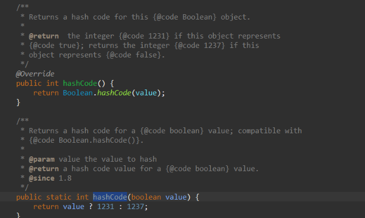
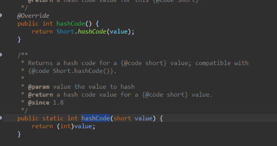
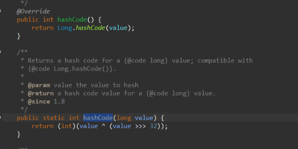
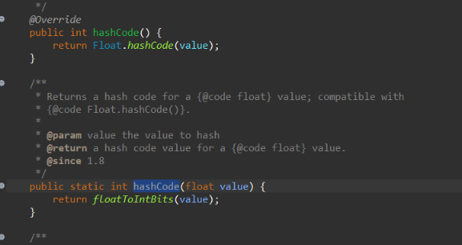

# About Programming

- Programming is the process of creating a set of instructions that a computer can follow to perform specific tasks. These instructions are written in a programming language, which is a special language designed to communicate with computers.
- A programming language is a set of instructions written by a programmer to deliver instructions to the computer to perform and accomplish a task. This set of instructions is usually viewed as incomprehensible code structured following a definite programming language syntax.

## Types of Programming


**1. Low Level**
  - Also known as machine language, this is the only language computers understand. It's made up of binary numbers (1s and 0s) and is machine-friendly, but hard for humans to understand. Low-level languages are closer to machine code, offering more control and efficiency, but are harder to program. They are often used in system programming, operating systems, and device drivers

**2. Middle-level**
  - Also known as assembly language, this level uses letters, digits, and special characters to create instructions. Assembly language uses predefined words called mnemonics.

**3. High-level**
  - These languages are easier to understand and debug, and are widely used today. They are portable and do not depend on machines. High-level languages are more human-readable and abstracted from hardware, making them easier to program but less efficient. They allow for faster development time since they require less coding and debugging. Examples include Java, C, C++, Python, Perl, BASIC, COBOL, Pascal, and Ruby.


# About Java
- Java is one of the most popular programming languages in the world. Lets see how good is java.

- Lets first install java and check its version by running command `java -version`.


- If you see currently we are using **Java 21 LTS** (Long Term Support). Lets print world famous line **Hello World!**. Okay but where to print it? in Linux we have CLI or Command line interface whereas in windows we have powershell, for java we have **JShell**.
- To open the JShell in your windows terminal , type `jshell`



- Lets print Hello world!!


- Lets say you wanna add numbers or multiply that we can do it directly in Jshell


- Lets say you wanna create some variables and store value you can do this way


- Lets do some operations 



- Here we created 3 variables which has some pre-defined value (10,20 & 30) and did some mathematical operation on a new variable and printed that out. JShell maintains the state of variables, methods, and classes across the session. This means that once you define a variable or a method in JShell, it remembers and can use these definitions throughout the session.
- Once you close the terminal ( which acts like my session ) all the variables or methods created are gone.



- `/vars` list out all the variables created in the Jshell session.

- **JShell** 
  - JShell is an interactive tool introduced in Java 9, known as a REPL (Read-Eval-Print Loop) for the Java programming language. It allows you to execute Java code snippets and see immediate results without needing to create a complete Java class or method.
  - You can type Java code directly into JShell, and it will be executed immediately. This is great for quick experiments and learning.
  - JShell is particularly useful for learning Java, as you can try out small pieces of code and see the results immediately, which helps in understanding concepts better.
  - Learn more about JShell [here](https://cr.openjdk.org/~rfield/tutorial/JShellTutorial.html)

- To write small scale programs which are simply for learning purpose we can use Jshell to test those out, but when it comes to write large scale programs we required an editor or an IDE (Integrated Development Environment).

<details>

<summary> What is IDE? </summary>

- Integrated Development Environment (IDE) is a software application that provides a comprehensive suite of tools for software development. An IDE typically combines several development tools into a single interface, making it easier for developers to write, test, and debug code.
- Colors and styles different parts of the code (keywords, variables, etc.) to make it easier to read.
- Provides suggestions for code completion based on the context, which speeds up coding and reduces errors.
- Automatically formats code according to predefined style guidelines
- Allows you to pause execution at specific points to inspect variables and the program state.
- Lets you execute code line-by-line to observe its behavior.
- So there are several benefits of using an IDE.
- Some popular IDEs are Visual Studio Code, Eclipse, NetBeans etc..

</details>

- Here i will be using Visual Studio Code IDE.
- So we create a file and with name **HelloWorld.java** . So any java file will have an extension of **.java**. Lets write the same **Hello World!!** code here.



- Unfortunately, the IDE is giving our some error. Lets ignore this may be IDE issue. Lets run the same file in Jshell

<video controls src="20240819-1745-38.9397224.mp4" title="Title"></video>

- It works, then probably there is IDE issue ? 🤔 , not exactly , IDE typically requires a complete Java application structure to run a program. For a Java program to execute properly in an IDE, it needs a proper **class** and **main method** atleast.
- What are class ? and what is main method?

### Class, Methods and Objects

- Imagine you have a blueprint for making a car. This blueprint describes what a car should have (like wheels, doors, and an engine) and what it can do (like drive and stop). In Java, a class is like this blueprint.
- The activity like drive and stop are called as methods.
- If you use the car blueprint to build a red sports car and a blue sedan, each of these cars is an object. They are created based on the same blueprint but have different properties and states.
- **Class**: It defines the structure and behavior that objects created from this blueprint will have.
- **Method**: A method is like a function or action that an object can perform. It describes what the object can do. Methods are defined inside a class and can operate on the object's properties.

```
public class Car {
    // Properties
    String color;
    int numberOfWheels;

    // Methods
    void drive() {
        System.out.println("The car is driving");
    }
    
    void stop() {
        System.out.println("The car has stopped");
    }
}
```

- **Object**: An object is an instance of a class. It’s like a specific car built from the car blueprint. Each object has its own state (values of its properties) and can perform actions (methods).

```
public class Example {
    public static void main(String[] args) {
        // Creating objects or Instances of Car class
        Car myCar = new Car();
        Car yourCar = new Car();
        
        // Setting properties
        myCar.color = "Red";
        myCar.numberOfWheels = 4;

        // Calling methods
        myCar.drive();
        myCar.stop();
    }
}
```

- In the above skeleton we can see there is a **class** Example which has a **main** method. Refering this lets try to write our program in java for Hello World.

<video controls src="20240819-1820-44.7270727.mp4" title="Title"></video>

- If you see when we re-write the class name, the java file name also gets renamed. This states that **your class name must be same as your java file name**.
- In C or C++ first you compile your code and then you run your code. Similarly we need to do that for java but how to do so?


