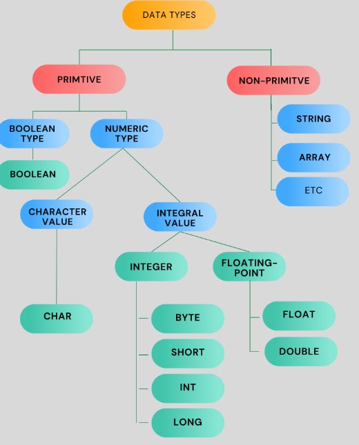

# About Programming

- Programming is the process of creating a set of instructions that a computer can follow to perform specific tasks. These instructions are written in a programming language, which is a special language designed to communicate with computers.
- A programming language is a set of instructions written by a programmer to deliver instructions to the computer to perform and accomplish a task. This set of instructions is usually viewed as incomprehensible code structured following a definite programming language syntax.

## Types of Programming


**1. Low Level**
  - Also known as machine language, this is the only language computers understand. It's made up of binary numbers (1s and 0s) and is machine-friendly, but hard for humans to understand. Low-level languages are closer to machine code, offering more control and efficiency, but are harder to program. They are often used in system programming, operating systems, and device drivers

**2. Middle-level**
  - Also known as assembly language, this level uses letters, digits, and special characters to create instructions. Assembly language uses predefined words called mnemonics.

**3. High-level**
  - These languages are easier to understand and debug, and are widely used today. They are portable and do not depend on machines. High-level languages are more human-readable and abstracted from hardware, making them easier to program but less efficient. They allow for faster development time since they require less coding and debugging. Examples include Java, C, C++, Python, Perl, BASIC, COBOL, Pascal, and Ruby.


# About Java
- Java is one of the most popular programming languages in the world. Lets see how good is java.

- Lets first install java and check its version by running command `java -version`.


- If you see currently we are using **Java 21 LTS** (Long Term Support). Lets print world famous line **Hello World!**. Okay but where to print it? in Linux we have CLI or Command line interface whereas in windows we have powershell, for java we have **JShell**.
- To open the JShell in your windows terminal , type `jshell`


- Lets print Hello world!!


- Lets say you wanna add numbers or multiply that we can do it directly in Jshell


- Lets say you wanna create some variables and store value you can do this way


- Lets do some operations 


- Here we created 3 variables which has some pre-defined value (10,20 & 30) and did some mathematical operation on a new variable and printed that out. JShell maintains the state of variables, methods, and classes across the session. This means that once you define a variable or a method in JShell, it remembers and can use these definitions throughout the session.
- Once you close the terminal ( which acts like my session ) all the variables or methods created are gone.


- `/vars` list out all the variables created in the Jshell session.

- **JShell** 
  - JShell is an interactive tool introduced in Java 9, known as a REPL (Read-Eval-Print Loop) for the Java programming language. It allows you to execute Java code snippets and see immediate results without needing to create a complete Java class or method.
  - You can type Java code directly into JShell, and it will be executed immediately. This is great for quick experiments and learning.
  - JShell is particularly useful for learning Java, as you can try out small pieces of code and see the results immediately, which helps in understanding concepts better.
  - Learn more about JShell [here](https://cr.openjdk.org/~rfield/tutorial/JShellTutorial.html)

- To write small scale programs which are simply for learning purpose we can use Jshell to test those out, but when it comes to write large scale programs we required an editor or an IDE (Integrated Development Environment).

<details>

<summary> What is IDE? </summary>

- Integrated Development Environment (IDE) is a software application that provides a comprehensive suite of tools for software development. An IDE typically combines several development tools into a single interface, making it easier for developers to write, test, and debug code.
- Colors and styles different parts of the code (keywords, variables, etc.) to make it easier to read.
- Provides suggestions for code completion based on the context, which speeds up coding and reduces errors.
- Automatically formats code according to predefined style guidelines
- Allows you to pause execution at specific points to inspect variables and the program state.
- Lets you execute code line-by-line to observe its behavior.
- So there are several benefits of using an IDE.
- Some popular IDEs are Visual Studio Code, Eclipse, NetBeans etc..

</details>

- Here i will be using Visual Studio Code IDE.
- So we create a file and with name **HelloWorld.java** . So any java file will have an extension of **.java**. Lets write the same **Hello World!!** code here.


- Unfortunately, the IDE is giving our some error. Lets ignore this may be IDE issue. Lets run the same file in Jshell

<video controls src="Images/aboutjava/20240819-1745-38.9397224.mp4" title="Title"></video>

- It works, then probably there is IDE issue ? 🤔 , not exactly , IDE typically requires a complete Java application structure to run a program. For a Java program to execute properly in an IDE, it needs a proper **class** and **main method** atleast.
- What are class ? and what is main method?

## Class, Methods and Objects

- Imagine you have a blueprint for making a car. This blueprint describes what a car should have (like wheels, doors, and an engine) and what it can do (like drive and stop). In Java, a class is like this blueprint.
- The activity like drive and stop are called as methods.
- If you use the car blueprint to build a red sports car and a blue sedan, each of these cars is an object. They are created based on the same blueprint but have different properties and states.
- **Class**: It defines the structure and behavior that objects created from this blueprint will have.
- **Method**: A method is like a function or action that an object can perform. It describes what the object can do. Methods are defined inside a class and can operate on the object's properties.

```
public class Car {
    // Properties
    String color;
    int numberOfWheels;

    // Methods
    void drive() {
        System.out.println("The car is driving");
    }
    
    void stop() {
        System.out.println("The car has stopped");
    }
}
```

- **Object**: An object is an instance of a class. It’s like a specific car built from the car blueprint. Each object has its own state (values of its properties) and can perform actions (methods).

```
public class Example {
    public static void main(String[] args) {
        // Creating objects or Instances of Car class
        Car myCar = new Car();
        Car yourCar = new Car();
        
        // Setting properties
        myCar.color = "Red";
        myCar.numberOfWheels = 4;

        // Calling methods
        myCar.drive();
        myCar.stop();
    }
}
```

- In the above skeleton we can see there is a **class** Example which has a **main** method. Refering this lets try to write our program in java for Hello World.

<video controls src="Images/aboutjava/20240819-1820-44.7270727.mp4" title="Title"></video>

- If you see when we re-write the class name, the java file name also gets renamed. This states that **your class name must be same as your java file name**.
- In C or C++ first you compile your code and then you run your code. Similarly we need to do that for java but how to do so? for compilation you have to run command **javac** (Java programming language compile) and to run your java code run command **java**.

<video controls src="Images/aboutjava/20240820-0315-06.0621240.mp4" title="Title"></video>

- Java is the programming language, while Javac is the command-line compiler used to convert Java source code files `(.java)` into executable Java bytecode files `(.class)`. Once the code is compiled we need to run it using **java** command and providing our class name (**HelloWorld**) .
- When we are using any IDE we get a direct run option, lets try that.

<video controls src="Images/aboutjava/20240820-0344-23.9034724.mp4" title="Title"></video>

- Wow, it automatically got compiled and got executed as well, but where is the `.class` file? actually it is created into another folder `C:\Program Files\Java\jdk-21\bin\java.exe" -XX:+ShowCodeDetailsInExceptionMessages -cp C:\Users\Harsh\AppData\Roaming\Code\User\workspaceStorage\4b2481d76e2f322457b2eaa1bad66aec\redhat.java\jdt_ws\LearnJava_ca9cff3\bin HelloWorld `.
- When you are using an editor or an IDE (Integrated Development Environment) like VSCode, Sublime or NetBeans to develop Java applications, the editor/IDE invokes the java compiler **(javac.exe)** to compile the source files **(.java)** and calls the Java launcher **(java.exe)** to run the compiled files **(.class)**. The following picture illustrates this process:


- **javac** is the Java compiler. It takes your human-readable Java source code (`.java` files) and translates it into bytecode (`.class` files). This bytecode is platform-independent and can be executed on any system with a Java Virtual Machine (JVM).
- The java command invokes the JRE (Java Runtime Environment) to run a program. For example, to run the program "Hello World!", you can type `java HelloWorld`.
- When you run a Java program using the java command, you need to specify the name of the class that contains the main method. This is because:
  - **Entry Point**: The main method is the starting point of any Java application. It's where the program execution begins.
  - **Class Loading**: The JVM loads the specified class and its dependencies into memory.   
  - **Method Invocation**: Once the class is loaded, the JVM looks for the main method within that class ( the class name we provided) and starts executing the code from there.

- **`javac`** compiles your Java source code into bytecode. **`java`** runs the compiled bytecode. You need to specify the class name with the java command because it tells the JVM where to start executing the program.
- What if there are multiple java source code files? how to run those all?, lets say we have **Class1.java** (it consist the main method), **Class2.java** and **Class3.java** source code files. I can compile those all once by using `javac Class1.java Class2.java Class3.java` and to run my source codes i will specify `java Class1`.
- If your source codes are in different folders , you can compile all of them using `javac "About Java"/HelloWorld.java` by providing completed folder path and while running your need to specify **fully qualified** name like this `java com.example.ClassWithMain`.
- But wait how do these IDEs know which is the main method? because we just click on **Run** button ? Many IDEs have a default setting to look for a class named **Main** or **App** as the main class. This is a common convention. Thats why is way easier to use IDEs rather than running your code inside the terminal.

## How does your code works? (JVM,JRE,JDK and JIT)


- **JDK**: Java Development Kit (JDK) is the core component of the Java Environment and provides the tools that include executables, and binaries required to Compile, Debug, and Execute a Java Program. JDK is a platform-specific software and hence we have separate installers for Windows, Mac, and Unix systems. Thats why when we download JDK it ask which type of OS you are using 


  - JDK includes:
    - JRE
    - Development Tools :
      - `javac` — reads class and interface definitions and compiles them into class files
      - `java` — launches the Java application
      - `Javadoc` — generates HTML pages of API documentation from Java source files
      etc....

- **JRE**: The JRE is a subset of the JDK. It provides the necessary environment to run Java applications. JRE doesn’t contain any development tools such as Java compiler, Debugger, JShell, etc. JRE is an implementation of the JVM. The Java Runtime Environment (JRE) is software that Java programs require to run correctly. Java is a computer language that powers many current web and mobile applications. The JRE is the underlying technology that communicates between the Java program and the operating system. It acts as a translator and facilitator, providing all the resources. **JRE is an implementation of JVM**.

- **JVM**: The JVM is software that runs the Java program line by line. It is widely known as a runtime interpreter. The JVM is like a special engine that runs Java programs. It interprets the Java code and translates it into something the computer can understand and execute. The JVM is included in the JRE, so whenever you run a Java program using the JRE, the JVM does the actual work of running the program. The JVM first interprets the bytecode. It then stores the class information in the memory areas. Finally, it executes the bytecode generated by the Java compiler.

- **JIT**: JIT stands for Just-In-Time compilation. It's a component of the Java Runtime Environment (JRE) that improves the performance of Java applications by compiling bytecode into native machine code at runtime. The JIT compiler analyzes the code as it runs, identifying frequently executed sections, known as "hotspots." These hotspots are then compiled into native machine code, which can be executed directly by the processor. This compiled code is stored in a cache for future use. By compiling only the frequently used parts of the code, the JIT compiler achieves a balance between the overhead of compilation and the performance gains of running native code.


### Code Execution Flow.


- Writing the code in NetBeans IDE or any other IDE. In this image above you can see we have our code file as **abc.java**
- Once you have written the code you save itand click Run. This invokes the Java Compiler. The compiler checks the code for syntax errors and any other compile time errors and if no error is found the compiler converts the java code into an intermediate code( **abc.class** file) known as bytecode. 
-  This intermediate code is platform independent (you can take this bytecode from a machine running windows and use it in any other machine running Linux or MacOS etc). Also this bytecode is an intermediate code, hence it is only understandable by the JVM and not the user or even the hardware /OS layer.
- This is the start of the Run Time phase, where the bytecode is loaded into the JVM by the class loader (another inbuilt program inside the JVM).
- Now the bytecode verifier (an inbuilt program inside the JVM) checks the bytecode for its integrity and if not issues are found passes it to the interpreter.
- Since java is both compiled and interpretted language, now the interpreter inside the JVM converts each line of the bytecode into executable machine code and passed it to the OS/Hardware i.e. the CPU to execute.
- In the above steps we didn’t mention the working of JIT compiler.


**CASE I**: Without JIT
  - In case 1 you can see that we are at the intepretation phase. Lets assume we have 5 lines which are supposed to be interpretted to their corresponding machine code lines. So as you can see in the Case 1 there is no JIT involved. thus the interpreter converts each line into its corresponding machine code line. However if you notice the last 2 lines are the same (consider it a redundant line inserted by mistake). Clearly that line is redundant and does not have any effect on the actual output but yet since the interpreter works line by line it still creates 5 lines of machine code for 5 lines of the bytecode.
**CASE II**: With JIT
  - In case 2 we have the JIT compiler. Now before the bytecode is passed onto the interpreter for conversion to machine code, the JIT compiler scans the full code to see if it can be optimized. As it finds the last line is redundant it removes it from the bytecode and passes only 4 lines to the interpreter thus making it more efficient and faster as the interpreter now has 1 line less to interpret.
  - So this is how JIT compiler speeds up the overall execution process.

- [Reference](https://simplesnippets.tech/execution-process-of-java-program-in-detail-working-of-just-it-time-compiler-jit-in-detail/)
- [Reference Video](https://www.youtube.com/watch?app=desktop&v=GXUiEouK7DM)

- **If the Class Loader Fails**:
  - The class loader is responsible for loading the required classes into the JVM. If the class loader fails (e.g., it can’t find the .class file or there's a problem accessing it), the JVM will throw a `ClassNotFoundException` or `NoClassDefFoundError`. The program will stop running because it can't proceed without loading the necessary classes.

- **If the Bytecode Verifier Finds an Error**:
  - The bytecode verifier checks the bytecode for any issues that could compromise security or system stability (e.g., illegal code or attempts to access restricted areas of memory). If the verifier finds an error, the JVM will throw a `VerifyError`. The program will not execute because the JVM cannot trust the integrity of the bytecode.


## Data Types

- Data types can be defined as its a kind of data that can be stored and manipulated within a program. They specify what kind of value a variable can hold and what operations can be performed on that variable.
- When we declare a variable in Java, the data is stored in memory in a binary format (as bits). In Java, data types define how variables values are kept in memory. Each variable has a data type that determines the type of value it will store and size require in the memory.




- Primitive data types in Java are the most basic kinds of data types that are built into the language. These data types are "primitive" because they represent simple, foundational values and do not have any methods associated with them.


- Non primitive data type also called as reference data type. Imagine a treasure map. The map itself is not the treasure, but it tells you where to find the treasure. That's essentially what a non-primitive or reference object is in programming. Non-primitive data types (or reference objects) are like treasure maps. They hold a reference or address that points to where the actual data is stored.


- Lets understand with this an example. In the below code, we have declare primitive data type as well as Non primitive. `num1` and `num2` are both primitive variables of type `int`. When you assign `num1` to `num2`, a copy of the value 10 is created for num2.
Changing num2 to 20 doesn't affect the value of num1 because they are independent copies.

```
public class PrimitiveVsReference {
    public static void main(String[] args) {
        // Primitive data type (int)
        int num1 = 10;
        int num2 = num1;

        // Changing num2 doesn't affect num1
        num2 = 20;

        System.out.println("num1: " + num1); // Output: 10
        System.out.println("num2: " + num2); // Output: 20

        // Reference data type (String)
        String str1 = "Hello";
        String str2 = str1;
        
        /**
         * Here str1 and str2 referece the same object
         * thats why we get same hash code
         */

        System.out.println(str1.hashCode());
        System.out.println(str2.hashCode());

        /**
         * The moment a new object is assigned it changes the reference
         */
        str2 = "World";

        System.out.println("str1: " + str1); // Output: Hello
        System.out.println("str2: " + str2); // Output: World

        /**
         * New References
         */
        System.out.println(str1.hashCode());
        System.out.println(str2.hashCode());

    }
}


Output:
num1: 10
num2: 20
69609650
69609650
str1: Hello
str2: World
69609650
83766130
```

- The `hashCode()` method is a built-in method in Java that returns a unique integer value, known as a hash code, for an object. The hash code is generated based on the object's content and memory address.

- Lets try to understand more about primitive data types by performing some code. Lets say we have just declare a variable and try to print it.
- We will get an error


- Your Java code will won't work without initializing the values because Java requires all variables to be initialized before they can be used. 
- That is why **Java is a statically typed language**, which means that the data type of each variable must be declared and initialized before it can be used. If a variable is not initialized, it will have a default value that may not be appropriate for the intended use case, leading to unexpected behavior or errors.

```
public class PrimitiveDataType {

    public static void main(String[] args) {

        /**
         * Declaring and Initializating variables
         */
         int a=1;
         float b=2;
         double c=3;
        System.out.println(a+b+c);
    }
}

Output:
6.0
```

- Lets say we wanted to define a proper decimal or a floating point number. Here we simply define a float variable and also initialized that variable with floating value and still we got an error.


- In Java, the default type for floating-point numbers is double, not float.  Java assumes any floating-point literal with a decimal point is a double by default because double provides more precision and is widely used in scientific calculations and most general-purpose applications. To make under java that is the value is floating number you must explicitly specify a float literal with an `f` or `F` suffix to tell the compiler that you intend to use a float.

```
public class PrimitiveDataType {

    public static void main(String[] args) {

        /**
         * Declaring and Initializating variables
         */
         int a=1;
         float b=2;
         double c=3;
        System.out.println(a+b+c);

        /**
         * Floating Point Numbers
         * - In Java, the default type for floating-point numbers is double, not float
         * - float has about 7 decimal digits of precision, double has about 15 decimal digits of precision.
         */
        float abc=3.678f;
        System.out.println(abc);
    }
}
Output:
6.0
3.678
```

- Lets explore all the datatypes.

```
public class PrimitiveDataType {

    public static void main(String[] args) {

        /**
         * Declaring and Initializating variables
         */
         int a=1;
         float b=2;
         double c=3;

        short sh=12345;
        long l=1234567890;

        System.out.println(a+b+c);

        /**
         * Literals are the values assigned to the varibles like 1,2,3 are literals.
         */

        /**
         * Floating Point Numbers
         * - In Java, the default type for floating-point numbers is double, not float
         * - float has about 7 decimal digits of precision, double has about 15 decimal digits of precision.
         */
        float abc=3.678f;
        System.out.println(abc);

        /**
         * Character Literals is represented using Single quotes to store single character
         */
        char ch='a';
        System.out.println(ch);

        /**
         * Character Literals can be used to store unicode values.
         *  - Unicode is a standardized system for encoding and representing text in most of the world's writing systems. 
         *  - It assigns a unique number, called a code point, to every character, no matter the platform, program, or language. 
         *  - These code points are written in the format U+XXXX, where XXXX is a hexadecimal number.
         * Example:
         * - The character 'A' has the Unicode code point U+0041.
         * - The character 'B' has the Unicode code point U+0042.
         */
        char un='\u0041'; // Unicode escape sequence for 'A'
        System.out.println(un);

        /**
         * Byte Literals
         */
        byte by=127;
        System.out.println(by);

        /**
         * Boolean Literals
         */
        boolean bTrue=true;
        System.out.println(bTrue);

        /**
         * Apart from stroing decimal valeues ,int can store hexadecimal, Octal and even binary representing values
         */

         int x = 100; //Decimal
         int y = 0b1010; //Binary
         int z = 0123; //Octal
         int w = 0xA1;//Hexadecimal
         System.err.println("Binary: "+y);
         System.err.println("Octal: "+z);
         System.err.println("Hexadecimal: "+w);

         /**
          * Working with huge integers like 10^10 and how to read those in human mathematical wordings?
          */
          long oneway=1000000;
          long secondway=10_00_00_000;
          System.out.println(secondway);

          /**
           * Work with scientific notation
           */
          double scify=10e12;
          System.out.println(scify);

          /**
           * You can increment the character literals
           */
          char a_value='a';
          a_value++; // Post increment operator
          System.out.println(a_value);
     }
}


Output:
6.0
3.678
a
A
127
true
Binary: 10
Octal: 83
Hexadecimal: 161
100000000
1.0E13
b
```

## Type Casting 

- In Java, type conversion refers to the process of converting a variable from one data type to another. This can happen either implicitly (automatically) or explicitly (manually).

```
int i = 100;
long l = i;  // Implicit casting from int to long
float f = l;  // Implicit casting from long to float
```

- In above example the int value 100 is automatically converted to a long value. The long value is then automatically converted to a float value.

```
double d = 9.78;
int i = (int) d;  // Explicit casting from double to int
i=9 -> output
```

- Explicit casting, also known as narrowing conversion, is required when you need to assign a larger data type (in terms of size ) to a smaller data type. Since the smaller type may not be able to hold all possible values of the larger type, there is a risk of data loss, and the conversion must be done manually.
- The double value **9.78** is explicitly cast to an int. The fractional part `.78` is lost, so i will hold the value **9**.
- Similarly for conversion of `char` to `int`.
- `char` can be implicitly cast to int because each character in Java corresponds to a Unicode code point, which is an integer. Converting int to char explicitly can be done if the int value is within the range of valid Unicode characters.

```
char c = 'A';
int num = c;  // Implicit casting from char to int (num=65 the ASCII value of A)
char newChar = (char) num;  // Explicit casting from int to char
Value of newChar = 'A'
```

## Type promotion

- Consider the below example

```
byte a=10;
byte b=20;
// Type promotion
int c=a*b; // Int can store 300 as value
c=300


byte b = 42;
char c = 'A';
int i = 100;
float f = 5.67f;
double d = .1234;

// Type promotion in expressions
double result = (f * b) + (i / c) - (d * c);
result=231.11899938964845
```

- Type promotion in Java refers to the automatic conversion of a smaller primitive data type to a larger one when performing operations involving multiple data types. This is done to prevent data loss and to ensure that calculations can be performed without errors.

## Operators

- Operators in Java are symbols that perform operations on variables( also called as operands ) and values, such as arithmetic, comparison, logical, and bitwise operations

```
public class Operators {
    public static void main(String[] args) {
        int a=61;
        int b=30;

        /**
         * Basic operators
         */
        System.out.println("Addition - " +a+b);
        System.out.println("Substraction - " +(a-b));
        System.out.println("Multiplication - " +a*b);
        System.out.println("Quotient - " +a/b);
        System.out.println("Modulo - " +a%b);
        System.out.println("Division in point decimal - " +(float)a/b);

        /**
         * Shorthand operators
         */
        a+=10;
        System.out.println("Compound Operation1 - "+a);
        b-=10;
        System.out.println("Compound Operation2 - "+a);


        /**
         * Increment/Decrement operators
         */
        /**
         * Pre-increment - first increment itself then it gives the output.
         * Post-increment - first gives output then does the increment
         */
        System.out.println("Pre-increment operator - "+(++a));
        System.out.println("Post-increment operator - "+(b++));

        System.out.println("Pre-decrement operator - "+(--a));
        System.out.println("Post-decrement operator - "+(b--));

        /**
         * Relational Operators
         * - Always returns a boolean value
         */
        System.out.println(10>20); // Greater than
        System.out.println(10<20); // Less than
        System.out.println(10==20); // Equals
        System.out.println(10!=20); // Not Equals
        System.out.println(20>=10); // Greater than Equals
        System.out.println(10<=20); // Less than Equals

        /**
         * Logical Operators
         * - Logical operators are used to perform logical “AND”, “OR” and “NOT” operations, i.e. the function
         *   similar to AND gate and OR gate in digital electronics. They are used to combine two or more conditions/constraints or
         *   to complement the evaluation of the original condition under particular consideration.
         */

         System.out.println(true & false); // AND of (true AND false) -> false similarly to (1 AND 0) -> 0
         System.out.println(true | false); // OR of (true OR false) -> true similarly to (1 OR 0) -> 1
         System.out.println(!true); // NOT of (NOT of true) -> false similarly to NOT of 1 -> 0

         /**
          * short-circuit evaluation
            - This means that if the value of an expression can be determined based on the left operand alone, 
              the right operand is not evaluated at all. While this can be useful for optimizing code and preventing unnecessary computations
          * - Example, 
            Short circuit AND (false && true && true)
              The && operator is a short-circuiting logical AND. It means that if the first operand is false, 
              Java does not evaluate the second operand because the entire expression cannot possibly be true.
            Short circuit OR (true || false || true)
             The || operator is a short-circuiting logical OR. If the first operand is true, Java does not evaluate 
             the second operand because the entire expression is already true.
          */
          System.out.println(false && true && true); 
          System.out.println(true || false || true);

          /**
           * Bitwise Operator
           */
          // Initial values
        int a1 = 5;
        int b1 = 7;

        // bitwise and
        // 0101 & 0111=0101 = 5
        System.out.println("a1&b1 = " + (a1 & b1));

        // bitwise or
        // 0101 | 0111=0111 = 7
        System.out.println("a1|b1 = " + (a1 | b1));

        // bitwise xor
        // 0101 ^ 0111=0010 = 2
        System.out.println("a1^b1 = " + (a1 ^ b1));

        // bitwise not
        // ~00000000 00000000 00000000 00000101=11111111 11111111 11111111 11111010
        // will give 2's complement (32 bit) of 5 = -6
        System.out.println("~a1 = " + ~a1);

        // can also be combined with
        // assignment operator to provide shorthand
        // assignment
        // a=a&b
        a1 &= b1;
        System.out.println("a1= " + a1);
        System.out.println("Bitwise Left Shift: " + (a1 << 2));
        System.out.println("Bitwise Right Shift: " + (a1 >> 2));
        System.out.println("Bitwise Unsigned Right Shift: " + (a1 >>> 2));
        }
}


Output:
Addition - 6130
Substraction - 31
Multiplication - 1830
Quotient - 2
Modulo - 1
Division in point decimal - 2.0333333
Compound Operation1 - 71
Compound Operation2 - 71
Pre-increment operator - 72
Post-increment operator - 20
Pre-decrement operator - 71
Post-decrement operator - 21
false
true
false
true
true
true
false
true
false
false
true
a1&b1 = 5
a1|b1 = 7
a1^b1 = 2
~a1 = -6
a1= 5
Bitwise Left Shift: 20
Bitwise Right Shift: 1
Bitwise Unsigned Right Shift: 1
```

## Conditional Statements

- Conditional statements in Java are constructs that allow the program to make decisions and execute certain blocks of code based on whether a condition (usually a boolean expression) is **true** or **false**. They control the flow of execution by branching paths depending on the outcome of these conditions.

```

public class ConditionalStatements {
    public static void main( String args[]){
        int x=10;
        if(x>10){
            System.out.println("Greater");
        }
        else if(x==10){
            System.out.println("Equal");
        }
        else{
            System.out.println("Smaller");
        }

        //Ternary Conditional operator
        String result = (x>10)?"Greater":(x==10)?"Equal":"Smaller";
        System.out.println(result);
    }
}

Output:
Equal
Equal
```

## Switch Statements/Case

- The switch statement in Java is a control flow statement that allows you to execute one block of code among many based on the value of an expression. It provides a cleaner way to handle multiple conditions compared to using multiple if-else statements, especially when dealing with discrete values.

```
public class SwitchStatements{
    public static void main(String args[]){

        int x=10;

        /**
         * Based on the case value the statement under the case will be executed
         * Here wherever the case gets matched , below that all statement will be include, because we have not specified `break` key word
         * thats why all statements will get executed
         */
        switch(x){
            case 0:
                System.out.println("Zero");
            case 10:
                System.out.println("Equal"); 
            case 30:
                System.out.println("Not Equal");           
            default: // if no cases matches, then print a default statement
                System.out.println("Undefined");
             
        }

        int y=10;

        /**
         * Only executes the require case statement is printed out.
         */

        switch(y){
            case 0:
                System.out.println("Zero");
            case 10:
                System.out.println("Equal"); 
                break; // break out the block
            case 30:
                System.out.println("Not Equal");
                break;      
            default:
                System.out.println("Undefined");
             
        }

    }
}


Output:
Equal
Not Equal
Undefined
Equal
```

## Iterations

- Iteration in Java refers to the process of repeatedly executing a block of code as long as a specified condition is met. It allows you to perform repetitive tasks efficiently and is commonly implemented using loops.

```
public class Iteration {
    public static void main(String[] args) {
        /**
         * For Loops
         *  - Used when the number of iterations is known beforehand
         */
        for (int j = 0; j < 5; j++) {
            System.out.println(j); // Prints numbers 0 to 4
        }

        /**
         * While Loops
         *  - Used when the number of iterations is not known and depends on a condition
         */
        int i = 0;
        while (i < 5) {
            System.out.println(i); // Prints numbers 0 to 4
            i++;
        }

        /**
         * Do-While Loops
         *  - Similar to the while loop, but guarantees that the code block will be executed at least once because the condition is checked after the loop's body.
         */
        int k = 0;
        do {
            System.out.println(k); // Prints numbers 0 to 4
            k++;
        } while (k < 5);

        
    }
}


Output:
0
1
2
3
4
0
1
2
3
4
0
1
2
3
4
```


