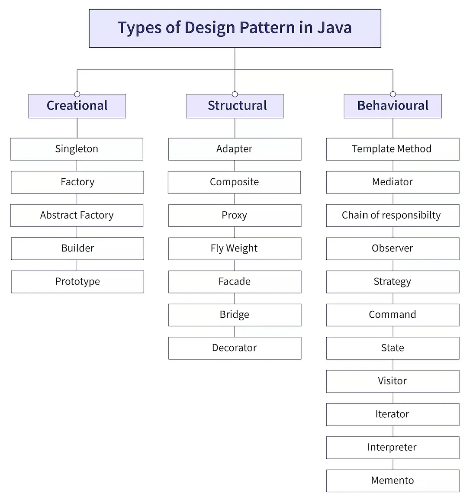

# Design Patterns

## What is Design Pattern?

- Imagine you want to build a house. You could:

    - Start from scratch without a plan → This might lead to a weak, inefficient, or inconsistent house.

    - Follow a standard blueprint → You get a well-structured, reliable, and scalable house.

- Design patterns like blueprints for building a house. Now, instead of inventing your own way to build every time, architects use proven blueprints (design patterns) that work best for different types of buildings.
- Design patterns are like pre-designed blueprints for building specific parts of your Java program.
- Design patterns provide structured and reusable solutions to common programming problems. If we don’t use design patterns, we can end up with messy, repetitive, and hard-to-maintain code—leading to inconsistent solutions for the same problem.

## Why Are Design Patterns Required?

- Design patterns are essential for several reasons:

1. Code Reusability → Helps avoid reinventing the wheel by using tried-and-tested solutions/template.

2. Maintainability → Structured code is easier to understand and modify.

3. Scalability → Helps build applications that can be extended easily.

4. Reduces Code Complexity → Simplifies complex design structures.

5. Improves Code Readability → Patterns follow a standard approach, making the code easier to understand.

6. Encourages Best Practices → Promotes SOLID principles and best programming practices.

## Without Design Pattern

- Let’s say we need to implement a logger in our application to log messages to the console or a file. Without design pattern vvery time we need logging, we might create different loggers manually, leading to duplicate code and inconsistencies.

```
class ConsoleLogger {
    void log(String message) {
        System.out.println("Console Log: " + message);
    }
    void defaultMethod(){
        System.out.println("Default Method Implementation for Logging");
    }
}

class FileLogger {
    void log(String message) {
        System.out.println("File Log: " + message);
        // Code to write to a file (skipped for simplicity)
    }
    void defaultMethod(){
        System.out.println("Default Method Implementation for Logging");
    }
}

// Client Code
class Main {
    public static void main(String[] args) {
        ConsoleLogger consoleLogger = new ConsoleLogger();
        consoleLogger.log("This is a console log");

        FileLogger fileLogger = new FileLogger();
        fileLogger.log("This is a file log");
    }
}

Output:
Console Log: This is a console log
File Log: This is a file log
```

- The above code has below problems

    - Tight Coupling ❌ →  The client (`LoggerService`) depends on specific logging type/classes.

    - Difficult to Scale ❌ →  Adding a new logging type/class requires modifying client code as it creates instances of different types of loggers (`ConsoleLogger` & `FileLogger`) .

    - Code Duplication ❌ →  Every time we add a new logger, we create a new class where we need to implement all the methods used for logging even if the methods has some default implementations.

    - No Flexibility ❌ →  If we want to switch logging type dynamically, it's not easy.

    - Hard to Maintain ❌ →  If we need to change logging behavior, we must update multiple places.

- Lets use a **Factory Design Pattern** for this kind of problems

```
// Step 1: Create a Common Interface for Loggers
interface Logger {
    void log(String message);
    default void defaultMethod(){
        System.out.println("Default Method Implementation for Logging");
    }
}

// Step 2: Implement Concrete Loggers
class ConsoleLogger implements Logger {
    public void log(String message) {
        System.out.println("Console Log: " + message);
    }
}

class FileLogger implements Logger {
    public void log(String message) {
        System.out.println("File Log: " + message);
        // Code to write to a file (skipped for simplicity)
    }
}

// Step 3: Create a Factory Class to Provide Loggers
class LoggerFactory {
    public static Logger getLogger(String type) {
        if (type.equalsIgnoreCase("CONSOLE")) return new ConsoleLogger();
        if (type.equalsIgnoreCase("FILE")) return new FileLogger();
        return null;
    }
}

// Step 4: Client Code (Now Clean and Scalable)
class Main {
    public static void main(String[] args) {
        Logger logger = LoggerFactory.getLogger("CONSOLE");
        logger.log("This is a console log");

        logger = LoggerFactory.getLogger("FILE");
        logger.log("This is a file log");
    }
}

Output:
Console Log: This is a console log
File Log: This is a file log
```

- ✅ No Code Duplication → We reuse the LoggerFactory to create loggers dynamically.
- ✅ Easy Maintenance → If we need to add a new logger type (e.g., `DatabaseLogger`), we only modify the `LoggerFactory`.
- ✅ Scalable → The client (`LoggerService`) doesn't change when adding new loggers.

## Types Of Design Pattern

- Design patterns are common solutions to recurring problems in software development. They are broadly classified into three categories:

    1. Creational Patterns (How objects are created)
        - These deal with how objects are instantiated (created) efficiently.
        - Instead of directly creating objects using `new`, these patterns provide better ways to create objects while keeping the system flexible.

    2. Structural Patterns (How objects are structured & related)
        - These focus on organizing classes and objects to make the system more scalable and flexible.
        - They help combine objects in a structured way without tightly coupling them.

    3. Behavioral Patterns (How objects communicate & behave)
        - These deal with how objects interact and communicate with each other efficiently.
        - They help manage complex interactions between objects without making the system difficult to maintain.





## Creational Design Pattern

### 1. Singleton Design Pattern

- The Singleton pattern ensures that **only one instance of a class exists throughout the application** and provides a global access point to it.
- Consider below example

```
class Singleton {
    private static Singleton instance;

    private Singleton() {
        // Private constructor to prevent external instantiation
    }

    public static Singleton getInstance() {
        if (instance == null) {
            instance = new Singleton();
        }
        return instance;
    }

    public void doSomething() {
        System.out.println("Singleton doing something...");
    }

}

public class AboutSingletonClass{
    public static void main(String[] args) {
        Singleton obj1 = Singleton.getInstance();
        Singleton obj2 = Singleton.getInstance();
        System.out.println(obj1 == obj2); // True, both references point to the same object
    }
}

Output:
True
```

- In Java, a singleton class is a class that allows only one instance (object) to be created and provides a global point of access to that instance. This design pattern is useful when exactly one instance of a class is needed to control a particular task or coordinate actions across the system, such as logging, configuration management, caching, or database connection pools.
- In cases where multiple instances could lead to conflicting states, resource wastage, or synchronization issues, a singleton ensures that only one object coordinates actions. For instance, a logging service would be consistent across the application if it has only one instance managing all log entries.

#### Why Use Singleton?

- **Controlled Access to a Single Resource**: When a single shared resource (like a database connection) needs to be accessed across multiple parts of an application, a singleton ensures that only one object controls this resource.
- **Global Access**: It provides a way to access the single instance globally, allowing for consistent data or behavior across different parts of an application.
- **Saves Memory**: Only one instance is created, which saves memory, especially for objects that consume significant resources.

#### Implementing a Singleton Class in Java
- Declare a private static variable to hold the single instance of the class.
- Make the constructor of the class private, so that no other instances can be created.
- Provide a public static method to return the single instance of the class, creating it if necessary.

#### Types of Singleton class

##### Eager Initialization:

- The singleton instance is created when the class is loaded, ensuring it's available from the beginning. This approach is straightforward but could waste resources if the instance is never used.

```
public class Singleton {
    private static final Singleton instance = new Singleton();

    private Singleton() {}

    public static Singleton getInstance() {
        return instance;
    }
}
```

##### Lazy Initialization:

- The singleton instance is created only when it’s requested for the first time. This avoids unnecessary resource use. However, it’s not thread-safe without additional synchronization.

```
public class Singleton {
    private static Singleton instance;

    private Singleton() {}

    public static Singleton getInstance() {
        if (instance == null) {
            instance = new Singleton();
        }
        return instance;
    }
}
```

##### Thread-Safe Singleton (with Synchronization):

- The singleton instance is created in a thread-safe way using synchronized. This ensures that multiple threads cannot create multiple instances simultaneously, but it can lead to performance issues due to synchronization overhead.

```
public class Singleton {
    private static Singleton instance;

    private Singleton() {}

    public static synchronized Singleton getInstance() {
        if (instance == null) {
            instance = new Singleton();
        }
        return instance;
    }
}
```

#### Real-World Use Cases

- Database Connection Manager

    - Example: You don't want to create multiple database connections as it is costly. The Singleton pattern ensures that only one database connection instance is used throughout the app.

- Logger Service

    - Example: In an application, logs are written from different places. A Singleton Logger class ensures that all parts of the application log messages to the same file/system.

- Cache Manager

    - Example: To improve performance, applications cache frequently used data. A Singleton Cache Manager ensures that the same cache data is accessed across the app.

#### Breaking Singleton Design Pattern

- 3 ways to break Singleton Design Pattern

##### Reflection API

- Now consider below code of singleton pattern

```


public class AboutSingleton{
    public static void main(String[] args) {
        Singleton obj1 = Singleton.getInstance();
        Singleton obj2 = Singleton.getInstance();
        System.out.println(obj1 == obj2); // True, both references point to the same object
    }
}

class Singleton {
    private static Singleton instance;

    private Singleton() {
        // Private constructor to prevent external instantiation
    }

    public static Singleton getInstance() {
        if (instance == null) {
            instance = new Singleton();
        }
        return instance;
    }

    public void doSomething() {
        System.out.println("Singleton doing something...");
    }

}

Output:
true
```

- Now using Reflection API we can get list of all constructor, and we can make or change constructor visibility from private to public like below

```

import java.lang.reflect.Constructor;

public class AboutSingleton {
    public static void main(String[] args) throws Exception{
        Singleton obj1 = Singleton.getInstance();
        Singleton obj2 = Singleton.getInstance();
        System.out.println(obj1 == obj2); // True, both references point to the same object
        Singleton obj3=null;
        Constructor[] constructors
                = Singleton.class.getDeclaredConstructors();
            for (Constructor constructor : constructors) {
                // Below code will destroy the singleton
                // pattern
                constructor.setAccessible(true);
                obj3
                    = (Singleton)constructor.newInstance();
                break;
            }
            System.out.println(obj1 == obj3); // False, both references point to the different object

    }
}

class Singleton {
    private static Singleton instance;

    private Singleton() {
        // Private constructor to prevent external instantiation
    }

    public static Singleton getInstance() {
        if (instance == null) {
            instance = new Singleton();
        }
        return instance;
    }

    public void doSomething() {
        System.out.println("Singleton doing something...");
    }

}

Output:
true
false
```

- We can prevent this break by following 2 ways

###### Prevent Breaking from Reflection API - Throwing Exception

- Consider below code

```

import java.lang.reflect.Constructor;

public class AboutSingleton {
    public static void main(String[] args) throws Exception{
        Singleton obj1 = Singleton.getInstance();
        Singleton obj2 = Singleton.getInstance();
        System.out.println(obj1 == obj2); // True, both references point to the same object
        Singleton obj3=null;
        Constructor[] constructors
                = Singleton.class.getDeclaredConstructors();
            for (Constructor constructor : constructors) {
                // Below code will destroy the singleton
                // pattern
                constructor.setAccessible(true);
                obj3
                    = (Singleton)constructor.newInstance();
                break;
            }
            System.out.println(obj1 == obj3); // False, both references point to the different object

    }
}

class Singleton {
    private static Singleton instance;

    private Singleton() {
        // Private constructor to prevent external instantiation
        if(instance!=null){
            throw new RuntimeException("Exception msg: You are trying to change the visibility of constructor");
        }
    }

    public static Singleton getInstance() {
        if (instance == null) {
            instance = new Singleton();
        }
        return instance;
    }

    public void doSomething() {
        System.out.println("Singleton doing something...");
    }

}

Output:
true
Exception in thread "main" java.lang.reflect.InvocationTargetException
        at java.base/jdk.internal.reflect.DirectConstructorHandleAccessor.newInstance(DirectConstructorHandleAccessor.java:74)
        at java.base/java.lang.reflect.Constructor.newInstanceWithCaller(Constructor.java:501)
        at java.base/java.lang.reflect.Constructor.newInstance(Constructor.java:485)
        at AboutSingleton.main(AboutSingleton.java:19)
Caused by: java.lang.RuntimeException: Exception msg: You are trying to change the visibility of constructor
        at Singleton.<init>(AboutSingleton.java:33)
        at java.base/jdk.internal.reflect.DirectConstructorHandleAccessor.newInstance(DirectConstructorHandleAccessor.java:62)
        ... 3 more
```

###### Prevent Breaking from Reflection API -Enums

- We can declare our singleton class as **enum**.

```


public class AboutSingleton {
    public static void main(String[] args) throws Exception{
            PreventBreakingSingleton p1 = PreventBreakingSingleton.SingleInstance;
            PreventBreakingSingleton p2 = PreventBreakingSingleton.SingleInstance;
            System.out.println(p1 == p2); // True, both references point to the same object
    }
}

enum PreventBreakingSingleton{
    SingleInstance;
}

Output:
true
```

- To overcome issues raised by reflection, enums are used because java ensures internally that the enum value is instantiated only once. Since java Enums are globally accessible, they can be used for singletons. Its only drawback is that it is not flexible i.e it does not allow lazy initialization. 
- As the constructor for an enum is package-private or private access, It automatically creates the constants that are defined at the beginning of the enum body. You cannot invoke an enum constructor yourself, so it is not possible for Reflection to utilize it. Hence, reflection can’t break singleton property in the case of enums.

##### Serialization

- `Serialization` can also cause breakage of singleton property of singleton classes. `Serialization` is used to convert an object of a byte stream and save in a file or send it over a network. Suppose you serialize an object of a singleton class. Then if you de-serialize that object it will create a new instance and hence break the singleton pattern. 
- Consider below code

```
import java.io.FileInputStream;
import java.io.FileOutputStream;
import java.io.ObjectInput;
import java.io.ObjectInputStream;
import java.io.ObjectOutput;
import java.io.ObjectOutputStream;
import java.io.Serializable;
import java.lang.reflect.Constructor;

public class AboutSingleton {
    public static void main(String[] args) throws Exception{

            try {
            Singleton instance1 = Singleton.getInstance();
            ObjectOutput out = new ObjectOutputStream(
                new FileOutputStream("file.text"));
            out.writeObject(instance1);
            out.close();
 
            // deserialize from file to object
            ObjectInput in = new ObjectInputStream(
                new FileInputStream("file.text"));
 
            Singleton instance2
                = (Singleton)in.readObject();
            in.close();

            System.out.println(instance1==instance2); //False
        }
 
        catch (Exception e) {
            e.printStackTrace();
        }
        
    }
}

class Singleton implements Serializable{
    private static Singleton instance;

    private Singleton() {

    }

    public static Singleton getInstance() {
        if (instance == null) {
            instance = new Singleton();
        }
        return instance;
    }

    public void doSomething() {
        System.out.println("Singleton doing something...");
    }

}

Output:
False
```

- As you can see, the hashCode of both instances is different, hence there are 2 objects of a singleton class. Thus, the class is no more singleton. 
- To overcome this issue, we have to implement the method `readResolve()` method. By adding the `readResolve()` method, we ensure that deserialization returns the existing instance instead of creating a new one.

```
import java.io.FileInputStream;
import java.io.FileOutputStream;
import java.io.ObjectInput;
import java.io.ObjectInputStream;
import java.io.ObjectOutput;
import java.io.ObjectOutputStream;
import java.io.Serializable;
import java.lang.reflect.Constructor;

public class AboutSingleton {
    public static void main(String[] args) throws Exception{

            try {
            Singleton instance1 = Singleton.getInstance();
            ObjectOutput out = new ObjectOutputStream(
                new FileOutputStream("file.text"));
            out.writeObject(instance1);
            out.close();
 
            // deserialize from file to object
            ObjectInput in = new ObjectInputStream(
                new FileInputStream("file.text"));
 
            Singleton instance2
                = (Singleton)in.readObject();
            in.close();

            System.out.println(instance1==instance2); //True
        }
 
        catch (Exception e) {
            e.printStackTrace();
        }
        
    }
}

class Singleton implements Serializable{
    private static Singleton instance;

    private Singleton() {

    }

    public static Singleton getInstance() {
        if (instance == null) {
            instance = new Singleton();
        }
        return instance;
    }

    public void doSomething() {
        System.out.println("Singleton doing something...");
    }

    // implement readResolve method
    protected Object readResolve() { return instance; }
}

Output:
true
```

##### Cloning 

-  Cloning is the concept to create duplicate objects. Using clone we can create copy of object. Suppose, we create clone of a singleton object, then it will create a copy that is there are two instances of a singleton class, hence the class is no more singleton. 

```


public class AboutSingleton {
    public static void main(String[] args) throws Exception{

        Singleton obj1 = Singleton.getInstance();
        Singleton obj2 = (Singleton) obj1.clone();
     
        System.out.println(obj1 == obj2); // False, both references point to the different object

    }
}

class Singleton implements Cloneable{
    private static Singleton instance;

    private Singleton() {

    }

    public static Singleton getInstance() {
        if (instance == null) {
            instance = new Singleton();
        }
        return instance;
    }

    public void doSomething() {
        System.out.println("Singleton doing something...");
    }

    @Override
    public Object clone()
        throws CloneNotSupportedException
    {
        return super.clone();
    }

}


Output:
false
```

- To overcome this issue, override `clone()` method and throw an exception from clone method that is `CloneNotSupportedException`. Now, whenever user will try to create clone of singleton object, it will throw an exception and hence our class remains singleton. 

```


public class AboutSingleton {
    public static void main(String[] args) throws Exception{

        Singleton obj1 = Singleton.getInstance();
        Singleton obj2 = (Singleton) obj1.clone();
     
        System.out.println(obj1 == obj2); // False, both references point to the different object

    }
}

class Singleton implements Cloneable{
    private static Singleton instance;

    private Singleton() {

    }

    public static Singleton getInstance() {
        if (instance == null) {
            instance = new Singleton();
        }
        return instance;
    }

    public void doSomething() {
        System.out.println("Singleton doing something...");
    }

    @Override
    public Object clone()
        throws CloneNotSupportedException
    {
        throw new CloneNotSupportedException();
    }

}

Output:
Exception in thread "main" java.lang.CloneNotSupportedException
	at Singleton.clone(Main.java:36)
	at AboutSingleton.main(Main.java:7)
```

### 2. Factory Design Pattern

- The Factory Design Pattern is used to create objects without specifying their exact class type. Instead of using `new` everywhere, a factory method decides which object to create based on given input.
- Factory Method Design Pattern define an interface for creating an object, but let subclass decide which class to instantiate.
- Before we dive into implementation details, let’s get acquainted with the primary components of the Factory Pattern:
    - **Product**: This is an interface or abstract class that defines the type of objects to be created.
    - **Concrete Product**: These are the classes that implement the `Product` interface or extend the `Product` abstract class. They represent the actual objects created by the factory.
    - **Factory**: This is an interface or abstract class responsible for declaring the factory method, which creates objects of the `Product` type.
Concrete Factory: These are the classes that implement the `Factory` interface or extend the `Factory` abstract class. They override the factory method to produce specific instances of `Product` or Concrete Products.
- Lets see an example, we’ll create a food ordering system that allows customers to order different types of dishes, such as pizza and sushi, using the Factory Pattern.

```
// Step:1
// Product interface
interface Dish {
    void prepare();
    void serve();
}

//Step 2: Create Concrete Products
// Concrete products
class Pizza implements Dish {
    @Override
    public void prepare() {
        System.out.println("Preparing pizza...");
    }

    @Override
    public void serve() {
        System.out.println("Serving pizza...");
    }
}

class Sushi implements Dish {
    @Override
    public void prepare() {
        System.out.println("Preparing sushi...");
    }

    @Override
    public void serve() {
        System.out.println("Serving sushi...");
    }
}

//Step 3: Define the Factory Interface
// Factory interface
interface DishFactory {
    Dish createDish();
}

//Step 4: Create Concrete Factories
// These Concrete factories will return the Concrete Products (Pizza or Sushi) for the Product (Dish)
class PizzaFactory implements DishFactory {
    @Override
    public Dish createDish() {
        return new Pizza();
    }
}

class SushiFactory implements DishFactory {
    @Override
    public Dish createDish() {
        return new Sushi();
    }
}

//Step 5: Client Code or Customer Ordering dishes
public class AboutFactoryDesign {
    public static void main(String[] args) {
                // Order a pizza using the PizzaFactory
                DishFactory pizzaFactory = new PizzaFactory();
                Dish pizza = pizzaFactory.createDish();
                pizza.prepare();
                pizza.serve();
        
                // Order sushi using the SushiFactory
                DishFactory sushiFactory = new SushiFactory();
                Dish sushi = sushiFactory.createDish();
                sushi.prepare();
                sushi.serve();
    }
}

Output:
Preparing pizza...
Serving pizza...
Preparing sushi...
Serving sushi...
```

- By using the Factory Method pattern:
    - We keep client code decoupled from concrete dish types.
    - Adding new dish types is easy, just create a new concrete dish class and its corresponding factory.
    - Creation logic is encapsulated in factory classes, promoting maintainability.

#### Advantages of this method

- Encourages loose coupling between client code and the created objects.
- Provides a centralized point of control for object creation, facilitating easier maintenance and testing.
- Supports the Open/Closed Principle, allowing for the addition of new product types without modifying existing client code.
- Promotes code reusability by defining common creation logic in superclass methods.
- The Factory Pattern enforces uniform object creation following a common interface (Product). This consistency simplifies code maintenance and minimizes errors.
- The Factory Pattern plays a significant role in dependency injection frameworks, allowing for the creation and management of dependencies.

#### Disadvantages of this design method

- Can lead to an increase in numbers of subclasses if there are many variations of products.
- Increases complexity in the codebase, especially when dealing with multiple factories and product types.
- **While client code is decoupled from Concrete Products, it remains tightly coupled with Concrete Factories. Significant changes in factory logic can impact multiple parts of the code**.

### 3. Abstract Factory Design Pattern

- In the Factory Pattern, the client code depends on the Concrete Factory to create objects.
    - If we change the factory logic (e.g., introduce a new type of product), we must modify multiple parts of the code.
    - This tight coupling makes it harder to maintain and scale.
- This problem is resolved by Abstract Factory. Instead of calling a concrete factory directly, we introduce an abstract factory interface that defines which objects can be created.
- Lets consider the same example used in Factory Design Pattern

```
// Step:1
// Product interface
interface Dish {
    void prepare();
    void serve();
}

//Step 2: Create Concrete Products
// Concrete products
class Pizza implements Dish {
    @Override
    public void prepare() {
        System.out.println("Preparing pizza...");
    }

    @Override
    public void serve() {
        System.out.println("Serving pizza...");
    }
}

class Sushi implements Dish {
    @Override
    public void prepare() {
        System.out.println("Preparing sushi...");
    }

    @Override
    public void serve() {
        System.out.println("Serving sushi...");
    }
}

//Step 3: Define the Factory Interface
// Factory interface
interface DishFactory {
    Dish createDish();
}

//Step 4: Create Concrete Factories
// These Concrete factories will return the Concrete Products (Pizza or Sushi) for the Product (Dish)
class PizzaFactory implements DishFactory {
    @Override
    public Dish createDish() {
        return new Pizza();
    }
}

class SushiFactory implements DishFactory {
    @Override
    public Dish createDish() {
        return new Sushi();
    }
}

//Step 5: Abstract Factory 
class AbstractDishFactory{

    public static Dish createDish(DishFactory dishfactory){
        return dishfactory.createDish();
    }
}

//Step 6: Client Code or Customer Ordering dishes
public class AboutAbstractFactoryDesign {
    public static void main(String[] args) {
        Dish pizzaDish = AbstractDishFactory.createDish(new PizzaFactory());
        pizzaDish.prepare();
        pizzaDish.serve();
        
        Dish sushiDish = AbstractDishFactory.createDish(new SushiFactory());
        sushiDish.prepare();
        sushiDish.serve();
    }
}


Output:
Preparing pizza...
Serving pizza...
Preparing sushi...
Serving sushi...
```

- **The core difference lies in the scope of object creation, the Factory pattern creates a single type of object (`new PizzaFactory()`,`new SushiFactory()`), while the Abstract Factory pattern creates families of related or dependent objects (`AbstractDishFactory.createDish(new PizzaFactory());`, `AbstractDishFactory.createDish(new SushiFactory());`)**
- Factory Pattern focuses on creation of a single type of object, encapsulating the object creation logic in a dedicated factory class.
- Abstract Factory Pattern focuses on creation families of related or dependent objects, providing an interface for creating those objects without specifying their concrete classes.


| **Factory Pattern**                   | **Abstract Factory Pattern**                  |
|---------------------------------------|-----------------------------------------------|
| Good for creating one type of object  | Best for creating families of related objects |
| Client depends on a concrete factory  | Client depends only on an abstract factory    |
| Tightly coupled to specific factories | Loosely coupled, easy to switch factories     |
| Simpler to implement                  | More complex but more scalable                |


#### Real-World Use Cases

- **GUI Toolkit**: Consider a scenario where you are developing a graphical user interface (GUI) toolkit that needs to support multiple platforms, such as Windows, macOS, and Linux. You can use the Abstract Factory pattern to define an abstract GUI factory interface, with methods like `createButton()`, `createTextBox()`, and `createCheckbox()`. Each platform-specific implementation of the GUI factory (e.g., `WindowsGUIFactory`, `MacOSGUIFactory`, `LinuxGUIFactory`) would provide concrete implementations of these methods to create platform-specific GUI components. This allows your client code to create GUI components without being tightly coupled to a specific platform.

- **Database Abstraction**: Suppose you have an application that needs to support multiple database systems, such as MySQL, PostgreSQL, and Oracle. By applying the Abstract Factory pattern, you can define an abstract database factory interface, with methods like `createConnection()`, `createQuery()`, and `createRecord()`. Each concrete factory implementation (e.g., `MySQLFactory`, `PostgreSQLFactory`, `OracleFactory`) would provide the specific implementation of these methods to create the corresponding database objects. This allows your client code to work with databases without having to directly deal with the specific database system.

- Logging Framework: In a logging framework, you may have different logging backends, such as file-based logging, database logging, or console logging. The Abstract Factory pattern can be used to define an abstract logger factory interface with methods like `createLogger()`, `createLoggerConfigurator()`, etc. Each concrete factory implementation (e.g., `FileLoggerFactory`, `DatabaseLoggerFactory`, `ConsoleLoggerFactory`) would provide the necessary implementation to create the specific logger and its related components. This allows the client code to log messages without being tied to a particular logging backend.


### 4. Builder Design Pattern

- While the Factory pattern excels at creating instances of different classes based on input, it becomes cumbersome when an object has numerous attributes, especially many optional ones. 
- In factory pattern, when we create instance or object, and if the objects requires attributes, then we need to create different method for the same object (varying arguments depending upon product type). Similarly, in abstract factory, we create object based on constructor and if the constructor has parameters (optional/required) then create instances based on abstract factory design will be difficult as we need to pass these parameters from method to method which may vary from product to product.
- In Factory Pattern, we need to create multiple factory methods to support different variations of object creation (due to required and optional parameters).
- In Abstract Factory, the factory creates product families, but if each product has different constructor arguments, then passing these arguments through multiple factory methods becomes complex
- These issue is resolved in Builder Design. The Builder Design Pattern is used to construct complex objects step by step. It provides better readability and flexibility than the Factory Pattern, especially when an object has many optional parameters.
- Lets see an example how to implement Builder Factory Pattern

```

class Computer {
	
	//required parameters
	private String HDD;
	private String RAM;
	
	//optional parameters
	private boolean isGraphicsCardEnabled;
	private boolean isBluetoothEnabled;
	

	public String getHDD() {
		return HDD;
	}

	public String getRAM() {
		return RAM;
	}

	public boolean isGraphicsCardEnabled() {
		return isGraphicsCardEnabled;
	}

	public boolean isBluetoothEnabled() {
		return isBluetoothEnabled;
	}
	
	private Computer(ComputerBuilder builder) {
		this.HDD=builder.HDD;
		this.RAM=builder.RAM;
		this.isGraphicsCardEnabled=builder.isGraphicsCardEnabled;
		this.isBluetoothEnabled=builder.isBluetoothEnabled;
	}
	
@Override
public String toString(){
    return "Computer Specification: RAM : "+getRAM()+", HDD: "+getHDD()+", Graphic Card: "+this.isGraphicsCardEnabled+", Bluetooth: "+this.isBluetoothEnabled;
}

	//Builder Class
	public static class ComputerBuilder{

		// required parameters
		private String HDD;
		private String RAM;

		// optional parameters
		private boolean isGraphicsCardEnabled;
		private boolean isBluetoothEnabled;
		
		public ComputerBuilder(String hdd, String ram){
			this.HDD=hdd;
			this.RAM=ram;
		}

		public ComputerBuilder setGraphicsCardEnabled(boolean isGraphicsCardEnabled) {
			this.isGraphicsCardEnabled = isGraphicsCardEnabled;
			return this;
		}

		public ComputerBuilder setBluetoothEnabled(boolean isBluetoothEnabled) {
			this.isBluetoothEnabled = isBluetoothEnabled;
			return this;
		}
		
		public Computer build(){
			return new Computer(this);
		}

	}

}


public class AboutBuilderFactoryDesign {

	public static void main(String[] args) {
		//Using builder to get the object in a single line of code and 
                //without any inconsistent state or arguments management issues		
                Computer comp = new Computer.ComputerBuilder(
                    "500 GB", "2 GB").setBluetoothEnabled(true)
                    .setGraphicsCardEnabled(true).build();
            System.out.println(comp.toString());
            
            Computer comp1 = new Computer.ComputerBuilder(
                    "1000 GB", "16 GB").build();
            System.out.println(comp1.toString());
	}

}

Output:
Computer Specification: RAM : 2 GB, HDD: 500 GB, Graphic Card: true, Bluetooth: true
Computer Specification: RAM : 16 GB, HDD: 1000 GB, Graphic Card: false, Bluetooth: false
```

- First of all you need to create a static nested class and then copy all the arguments from the outer class to the Builder class. We should follow the naming convention and if the class name is `Computer` then builder class should be named as `ComputerBuilder`.
- Java Builder class should have a public constructor with all the required attributes as parameters.
- Java Builder class should have methods to set the optional parameters and it should return the same Builder object after setting the optional attribute.
- The final step is to provide a `build()` method in the builder class that will return the Object needed by client program. For this we need to have a private constructor in the Class with Builder class as argument.

#### Advantages of Builder Pattern

- ✅ Improves Code Readability – Each step of object creation is clear.
- ✅ Encapsulates Construction Logic – Object creation logic is separated from business logic.
- ✅ Supports Immutable Objects – Since fields are private and set only once, it ensures immutability.
- ✅ Easy to Extend – Adding a new attribute does not require modifying constructor logic.
- ✅ No need for multiple constructors or multiple factory methods!
- ✅ Flexible object creation!
- ✅ Handles optional parameters elegantly!

#### Disadvantages of Builder Pattern
- ❌ More Code Overhead – Requires additional Builder class and methods.
- ❌ Not Suitable for Simple Objects – If an object has only 1-2 parameters, a Factory Pattern is better.

### Combine Factory and Builder Pattern

- Factory Pattern centralizes the creation of objects by providing a single point of entry to create different types of objects based on input parameters, effectively hiding the specific implementation details from the client code.
- Builder Pattern allows for constructing complex objects step-by-step, enabling the creation of different variations of the object with specific configurations by setting individual properties independently.
- Combining both gives us a flexible and maintainable approach. Lets see an example

```
// Computer Class (Same as before)
class Computer {
	
	// Required parameters
	private String HDD;
	private String RAM;
	
	// Optional parameters
	private boolean isGraphicsCardEnabled;
	private boolean isBluetoothEnabled;

	public String getHDD() { return HDD; }
	public String getRAM() { return RAM; }
	public boolean isGraphicsCardEnabled() { return isGraphicsCardEnabled; }
	public boolean isBluetoothEnabled() { return isBluetoothEnabled; }
	
	// Private constructor - Only accessible through Builder
	private Computer(ComputerBuilder builder) {
		this.HDD = builder.HDD;
		this.RAM = builder.RAM;
		this.isGraphicsCardEnabled = builder.isGraphicsCardEnabled;
		this.isBluetoothEnabled = builder.isBluetoothEnabled;
	}
	
	@Override
	public String toString() {
	    return "Computer Specification: RAM: " + getRAM() + 
	           ", HDD: " + getHDD() + 
	           ", Graphic Card: " + this.isGraphicsCardEnabled + 
	           ", Bluetooth: " + this.isBluetoothEnabled;
	}

	// Builder Class
	public static class ComputerBuilder {

		// Required parameters
		private String HDD;
		private String RAM;

		// Optional parameters
		private boolean isGraphicsCardEnabled = false;  // Default false
		private boolean isBluetoothEnabled = false;     // Default false
		
		public ComputerBuilder(String hdd, String ram) {
			this.HDD = hdd;
			this.RAM = ram;
		}

		public ComputerBuilder setGraphicsCardEnabled(boolean isGraphicsCardEnabled) {
			this.isGraphicsCardEnabled = isGraphicsCardEnabled;
			return this;
		}

		public ComputerBuilder setBluetoothEnabled(boolean isBluetoothEnabled) {
			this.isBluetoothEnabled = isBluetoothEnabled;
			return this;
		}
		
		public Computer build() {
			return new Computer(this);
		}
	}
}

// Factory Class using Builder
class ComputerFactory {

    // Factory method: Only requires HDD & RAM (Mandatory parameters)
    public static Computer getComputer(String hdd, String ram, boolean... options) {
        Computer.ComputerBuilder builder = new Computer.ComputerBuilder(hdd, ram);

        // If options are provided, apply them
        if (options.length > 0 && options[0]) {
            builder.setGraphicsCardEnabled(true);
        }
        if (options.length > 1 && options[1]) {
            builder.setBluetoothEnabled(true);
        }

        return builder.build();
    }
}

public class CombineFactoryAndBuilderPattern {
    public static void main(String[] args) {
        // Creating a Gaming PC (Graphics Card & Bluetooth enabled)
        Computer gamingPC = ComputerFactory.getComputer("1 TB", "16 GB", true, true);

        // Creating an Office PC (No optional features)
        Computer officePC = ComputerFactory.getComputer("500 GB", "8 GB");

        // Creating a Media PC (Only Bluetooth enabled)
        Computer mediaPC = ComputerFactory.getComputer("750 GB", "12 GB", false, true);

        // Displaying computer details
        System.out.println(gamingPC);
        System.out.println(officePC);
        System.out.println(mediaPC);
    }
}


Output:
Computer Specification: RAM: 16 GB, HDD: 1 TB, Graphic Card: true, Bluetooth: true
Computer Specification: RAM: 8 GB, HDD: 500 GB, Graphic Card: false, Bluetooth: false
Computer Specification: RAM: 12 GB, HDD: 750 GB, Graphic Card: false, Bluetooth: true
```

### 5. Prototype Design Pattern

- Factory and Builder Patterns create new objects every time. Object creation can be expensive. Object creation is considered expensive when it requires significant resources like time, memory, or processing power. Some common cases include:
    - Database Calls – Fetching data from a database for each new object can be slow.
    - Complex Computations – Performing heavy calculations before setting object properties.
    - Large Object Initialization – Creating objects with large data structures (e.g., deep object hierarchies).
    - External API Calls – Retrieving data from APIs before constructing an object.
    - I/O Operations – Reading files, network requests, or other costly I/O tasks.
- Prototype Pattern is used when we need to create multiple objects with the same structure but different data. Instead of creating new objects from scratch, we clone an existing object, which improves performance. Using Prototype design, it saves time by cloning an existing object instead of creating a new one.
- Lets see an example of prototype design pattern

```
class Employee implements Cloneable{
    private String name;
    private String department;

    public Employee(String name, String department) {
        this.name = name;
        this.department = department;
        System.out.println("Expensive object creation process...perform API calls, network calls and DB calls");
    }

    public void setName(String name) { this.name = name; }

    @Override
    public String toString() {
        return "Employee{name='" + name + "', department='" + department + "'}";
    }

    // Clone method to duplicate object without calling constructor
    @Override
    protected Object clone() throws CloneNotSupportedException {
            return super.clone();
    }
    
}

public class AboutProtoTypeDesign {
    public static void main(String[] args) throws Exception {
        Employee emp1 = new Employee("Alice", "IT");

        // Cloning emp1 instead of creating a new object
        Employee emp2 = (Employee) emp1.clone();
        emp2.setName("Bob"); // Change only the name

        System.out.println(emp1);
        System.out.println(emp2);
    }
}


Output:
Expensive object creation process...perform API calls, network calls and DB calls
Employee{name='Alice', department='IT'}
Employee{name='Bob', department='IT'}
```

- If we don't clone the object every time we create an object, the constructor runs again, which slow down the object creation. So use prototype design pattern when object creation is costly and you want to avoid repeated constructor calls. When you need many similar objects with minor modifications.

#### Advantages of Prototype

- ✔️ Avoids expensive object creation by cloning an existing object.
- ✔️ Faster than Factory/Builder, since it doesn’t call the constructor.
- ✔️ Useful when object initialization is complex (e.g., fetching from a database).
- ✔️ Instead of passing a large number of parameters to a constructor, the prototype pattern lets you clone a pre-configured object.

#### Shallow Copy vs Deep Copy

- When cloning an object in Java, it's important to understand Shallow Copy and Deep Copy, especially when the object contains nested objects (references to other objects).

##### Shallow Copy (Default Cloning)

- A shallow copy means that the cloned object gets a new reference, but its nested objects (sub-objects) still point to the same memory location as the original object.
- Consider below code of shallow copy

```
class Address {
    String city;
    Address(String city) {
        this.city = city;
    }
}

class Employee implements Cloneable{
    private String name;
    private String department;
    Address address;  // Nested object

    public Employee(String name, String department, Address address) {
        this.name = name;
        this.department = department;
        this.address=address;
        System.out.println("Expensive object creation process...perform API calls, network calls and DB calls");
    }

    public void setName(String name) { this.name = name; }

    @Override
    public String toString() {
        return "Employee{name='" + name + "', department='" + department + "', lives in " + address.city+";}";
    }

    // Clone method to duplicate object without calling constructor
    @Override
    protected Object clone() throws CloneNotSupportedException {
            return super.clone();
    }
    
}

public class AboutProtoTypeDesign {
    public static void main(String[] args) throws Exception {
        Address address = new Address("New York");
        Employee emp1 = new Employee("Alice", "IT",address);

        // Cloning emp1 instead of creating a new object
        Employee emp2 = (Employee) emp1.clone(); //Shallow Copy
        emp2.setName("Bob"); // Change only the name


        // Two Different Objects of Employee
        System.out.println(emp1);
        System.out.println(emp2);
        System.out.println(emp1.hashCode());
        System.out.println(emp2.hashCode());
        // Two Different Object of Employee pointing to same object memory address for Address Class
        System.out.println(emp1.address.hashCode());
        System.out.println(emp2.address.hashCode());

        // Changing in One will affect other employee objects
        emp1.address.city="Mumbai";
        System.out.println(emp1);
        System.out.println(emp2);
    }
}

Output:
Expensive object creation process...perform API calls, network calls and DB calls
Employee{name='Alice', department='IT', lives in New York;}
Employee{name='Bob', department='IT', lives in New York;}
1984990929
1105423942
365181913
365181913
Employee{name='Alice', department='IT', lives in Mumbai;}
Employee{name='Bob', department='IT', lives in Mumbai;}
```

- Even though we cloned `emp1`, modifying `emp1.address.city` also changed `emp2.address.city`. This happens because both objects share the same nested `Address` object.

##### Deep Copy

- A deep copy ensures that all objects, including nested objects, get fully duplicated. This prevents changes in the cloned object from affecting the original.
- Lets see an example

```
class Address implements Cloneable{
    String city;
    Address(String city) {
        this.city = city;
    }

    // Clone method to duplicate object without calling constructor
    @Override
    protected Object clone() throws CloneNotSupportedException {
            return super.clone();
    }
}

class Employee implements Cloneable{
    private String name;
    private String department;
    Address address;  // Nested object

    public Employee(String name, String department, Address address) {
        this.name = name;
        this.department = department;
        this.address=address;
        System.out.println("Expensive object creation process...perform API calls, network calls and DB calls");
    }

    public void setName(String name) { this.name = name; }

    @Override
    public String toString() {
        return "Employee{name='" + name + "', department='" + department + "', lives in " + address.city+";}";
    }

    // Clone method to duplicate object without calling constructor
    @Override
    protected Object clone() throws CloneNotSupportedException {
        Employee cloned = (Employee) super.clone();
        cloned.address = (Address) this.address.clone(); // Deep copy of nested object
        return cloned;
    }
    
}

public class AboutProtoTypeDesign {
    public static void main(String[] args) throws Exception {
        Address address = new Address("New York");
        Employee emp1 = new Employee("Alice", "IT",address);

        // Cloning emp1 instead of creating a new object
        Employee emp2 = (Employee) emp1.clone(); //Deep Copy
        emp2.setName("Bob"); // Change only the name


        // Two Different Objects of Employee
        System.out.println(emp1);
        System.out.println(emp2);
        System.out.println(emp1.hashCode());
        System.out.println(emp2.hashCode());
        // Two Different Object of Employee pointing to same object memory address for Address Class
        System.out.println(emp1.address.hashCode());
        System.out.println(emp2.address.hashCode());

        // Changing in One will affect other employee objects
        emp1.address.city="Mumbai";
        System.out.println(emp1);
        System.out.println(emp2);
    }
}


Output:
Expensive object creation process...perform API calls, network calls and DB calls
Employee{name='Alice', department='IT', lives in New York;}
Employee{name='Bob', department='IT', lives in New York;}
1912962767
452805835
1769190683
447981768
Employee{name='Alice', department='IT', lives in Mumbai;}
Employee{name='Bob', department='IT', lives in New York;}
```

- 🏆 When to Use Deep Copy?
    - ✔️ When objects have nested references that should not be shared between original and cloned objects.
    - ✔️ When you want to completely isolate the original and cloned object instances.
    - ✔️ When working with complex object graphs (e.g., multi-level data structures).


 
#### 🚨 Disadvantages of Prototype Design Pattern

1. Complex Cloning for Deep Copies
    - If an object contains nested objects (references to other objects), default cloning (`super.clone()`) only performs a shallow copy. You must implement a deep copy manually, which can be complex.
2. Hard to Manage Cloning in Large Object Graphs
    - If an object has many references (e.g., multiple levels of nested objects), managing cloning can be error-prone and time-consuming. You need to ensure that all objects implement `Cloneable` interface and override `clone()`.
3. Limited Applicability
    - The Prototype Pattern is most suitable when the cost of creating objects from scratch is high. In cases where object creation is relatively simple and inexpensive, using the pattern may introduce unnecessary complexity.
4. Increased Maintenance Effort
    - Every time a class is modified (e.g., adding a new field), the `clone()` method must also be updated. If you forget to clone a new field, it may introduce hard-to-debug issues