# About OOPS (Object-Oriented Programming System)

- So when a car was introduce, a blueprint of a car was prepared, like what could be requirements to built a car? , this included color, Engine , cylinder and etc..
- So imagine referring this blue print, there is a Ferrari car, so what could be its properties?  color - red, Engine - 3902 cc, No. of cylinder - 4 and so on.. what could be his behaviour? so the behaviors - Start engine, Accelerate, Brake, Turn, Park.
- **Class**: Is the blueprint to built a car.
- **Object**: Is Ferrari
- **Data**: Is Ferrari properties
- **Method**: Is Ferrari behaviour.

- So OOP basically organize your code structure by defining a class which acts as a blueprint. It consists a set of properties (data) and methods (behaviors). It provides a general template for what an object can be and do.
- To use the class, you create or instantiate an object. The object is a specific instance of the class, with its own customized properties using the properties of class (like a red Ferrari with a 3902 cc engine) and access to the methods defined in the class.
- When you instantiate an object, you can set its properties to match what you need, and then use its methods to perform actions. This approach helps in organizing code, making it more modular, reusable, and easier to manage.

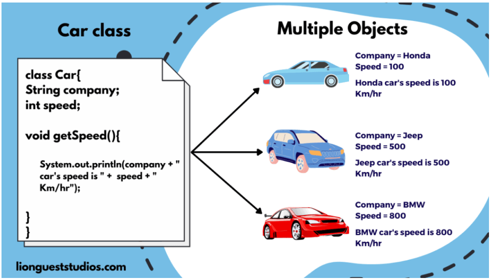

```
package OOPS;

class Car{

    int speed;
    int numberOfCyclinder;

    public void startEngine(){
        System.out.println("Engine Started..."+", speed - "+speed+", cyclinder - "+numberOfCyclinder);
    }
}

public class SimpleOOP {
    public static void main(String[] args) {
        
        /**
         * Ferrari
         */
        Car ferrari= new Car(); //Reference variable
        ferrari.speed=230;
        ferrari.numberOfCyclinder=4;
        ferrari.startEngine();
    }
}

Output
Engine Started..., speed - 230, cyclinder - 4
```

- Lets create a mustang 


```
package OOPS;

class Car{

    int speed;
    int numberOfCyclinder;

    public void startEngine(){
        System.out.println("Engine Started..."+", speed - "+speed+", cyclinder - "+numberOfCyclinder);
    }
}

public class SimpleOOP {
    public static void main(String[] args) {
        
        /**
         * Ferrari
         */
        Car ferrari= new Car(); //Reference variable
        ferrari.speed=230;
        ferrari.numberOfCyclinder=4;
        ferrari.startEngine();

        /**
         * Mustang
         */
        Car mustang= new Car(); //Reference variable
        mustang.speed=200;
        mustang.numberOfCyclinder=3;
        mustang.startEngine();

    }
}

Output:
Engine Started..., speed - 230, cyclinder - 4
Engine Started..., speed - 200, cyclinder - 3
```

- The JVM creates these objects, so there could possibilities like there can be multiple types of cars like TATA, Tesla, etc.. how to identify each? thats where every object has a unique identifier.

```
package OOPS;

class Car{

    int speed;
    int numberOfCyclinder;

    public void startEngine(){
        System.out.println("Engine Started..."+", speed - "+speed+", cyclinder - "+numberOfCyclinder);
    }
}

public class SimpleOOP {
    public static void main(String[] args) {
        
        /**
         * Ferrari
         */
        Car ferrari= new Car(); //Reference variable
        ferrari.speed=230;
        ferrari.numberOfCyclinder=4;
        ferrari.startEngine();

        /**
         * Mustang
         */
        Car mustang= new Car(); //Reference variable
        mustang.speed=200;
        mustang.numberOfCyclinder=3;
        mustang.startEngine();

        /**
         * Unique Identifier
         */
        System.out.println("Unique Identifier for ferrari - "+System.identityHashCode(ferrari));
        System.out.println("Unique Identifier for mustang - "+System.identityHashCode(mustang));
    }
}


Output:
Engine Started..., speed - 230, cyclinder - 4
Engine Started..., speed - 200, cyclinder - 3
Unique Identifier for ferrari - 791452441
Unique Identifier for mustang - 142257191
```

- An object identity is typically implemented via a unique ID. The value of the ID is not visible to the external user. However, it is used internally by the JVM to identify each object uniquely.

- Lets deep dive more into class. So lets say inside a class each variable has a scope.

```
class Car{

    int speed; // Instance variable
    int numberOfCyclinder;

    public void startEngine(){
        System.out.println("Engine Started..."+", speed - "+speed+", cyclinder - "+numberOfCyclinder);
    }

    public void speedLimit(){
        int i=200; // Local variable
    }
}
```

- **Local variable**: 
    - Scope: Declared within a method, constructor, or block of code (e.g., inside loops or conditional statements).
    - Lifetime: Created when the method is called and destroyed when the method exits. They are not accessible outside the method in which they are declared.
    - Initialization: Must be initialized before use; otherwise, the compiler will throw an error.
- **Instance variable**:
    - Scope: Declared inside a class but outside any method, constructor, or block. They are associated with an instance of the class (each object has its own copy).
    - Lifetime: Exist as long as the object (instance of the class) exists. They are created when the object is created using the new keyword and destroyed when the object is destroyed.
    - Initialization: Automatically initialized to default values if not explicitly initialized (e.g., 0 for integers, null for objects).

>[!IMPORTANT]
> - Java does not support the concept of "nested" methods (a new method statements within another method). All methods in Java are defined at the class level. Therefore, you cannot declare a method inside another method.
> - Java does support nested classes but does support method calling from another method.


- Consider the below code.

```
class Car{

    int speed; // Instance variable
    int numberOfCyclinder;

    public void startEngine(){
        System.out.println("Engine Started..."+", speed - "+speed+", cyclinder - "+numberOfCyclinder);
    }

    public void speedLimit(){
        int i=200; // Local variable
    }
}

public class SimpleOOP {
    public static void main(String[] args) {
        System.out.println("Not creating reference variable of any class");
    }
}


Output:
Not creating reference variable of any class
```

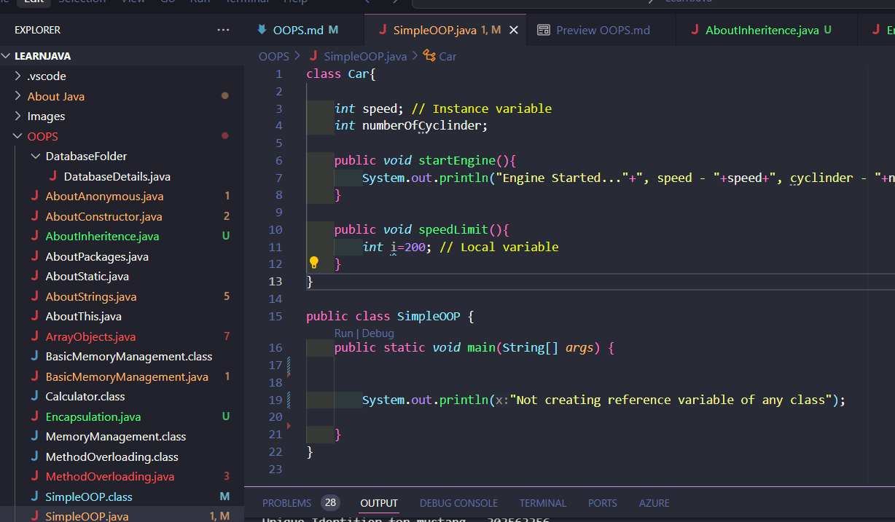

- If you see we can see **SimpleOOP.class** file but not **Car.class** file, this is because we have not created any object of it. Such class whose object is not created are not compiled by java.

>[!IMPORTANT]
> - If class object is not created those class are not compile by java


## Basics of Memory Management

### What is Garbage Collector?

- As a programmer you will write lots of classes and your code might ended up creating many objects in the memory, so someone should be responsible for it to clean and vacant those memory occupied by objects, thats where comes your garbage collector.
- Garbage collection is an automatic process that the programming language runtime (like the Java Virtual Machine for Java) uses to identify and delete objects that are no longer needed by the program.
- Objects are instances of data that a program creates to perform its tasks. As the program runs, it may create many objects. Some objects are only needed for a short time. Once they are no longer used, they become "**garbage**". The garbage collector's job is to find these unused objects and free up the memory they occupy, making that memory available for new objects.

### Stack  

- In terms of data structure, stack is refered as Last-In-First-Out order. The stack is a linear data structure that is used to store the collection of objects.


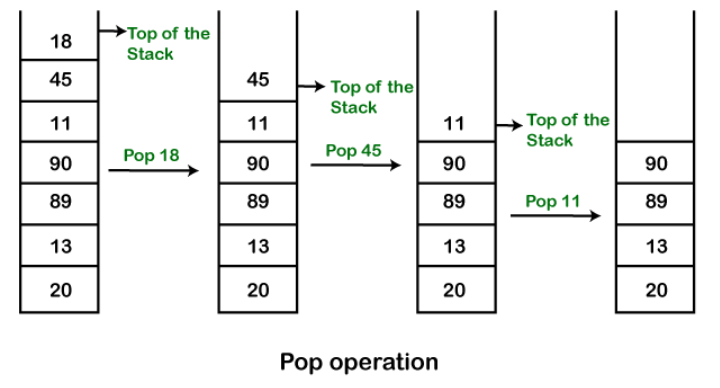

- **Stack memory** is the temporary memory where variable values are stored when their methods are invoked. After the method is finished, the memory containing those values is cleared to make room for new methods. Any values in this block are only accessible by the current method and will not exist once it ends. When the method ends, that block will be erased. The next method invoked will use that empty block.
- **In a program if there are multiple methods, then every methods will have its own stack**

### Heap

>[!IMPORTANT]
> - **The heap in the JVM and the heap in data structures are different concepts, even though they share the same name.**

-  In the JVM, the heap is a portion of memory used for dynamic memory allocation. It's where objects and their associated instance variables are stored. Whenever you create an object using the `new` keyword, the memory for that object is allocated from the heap.
- Consider the below example

```

class Calculator{

    int instanceVar; // Instance variable
    public int add(int n1,int n2){
        return n1+n2; // Local Variables
    }
}

public class BasicMemoryManagement{
    public static void main(String[] args) {

        int localVar=10;
        Calculator calc=new Calculator();
        int sum=calc.add(5, 4);
        System.out.println(sum);
        calc.instanceVar=6;
        System.out.println(calc.instanceVar);

        Calculator calc1=new Calculator();
        calc1.instanceVar=16;
        System.out.println(calc1.instanceVar);
    }
}

Output:
9
6
16
```

- Now when the program will get executed , main method will have a stack. Inside the stack all its local variables will be there

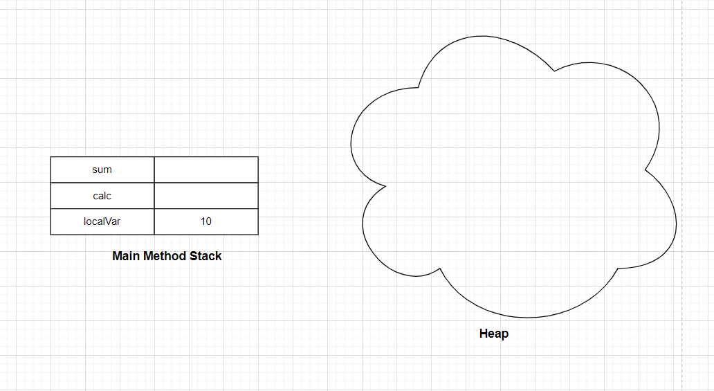

- `new Calculator()` creates an object inside the heap memory , the address of that object gets stored in the main method stack for **calc** variable. So **calc is a reference variable and not object because it as reference of Calculator Object not the object itself**

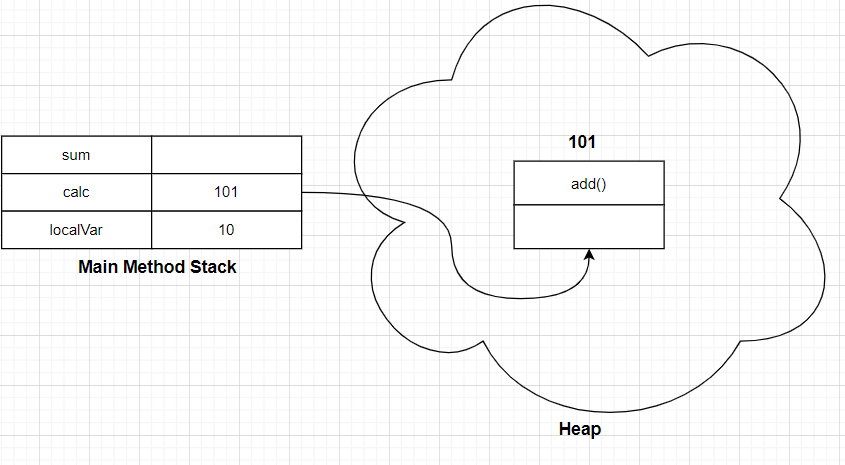

- What happens to the instance variable? `int instanceVar` , now instance variable are not part of stack, it gets created within the heap under the same object address.

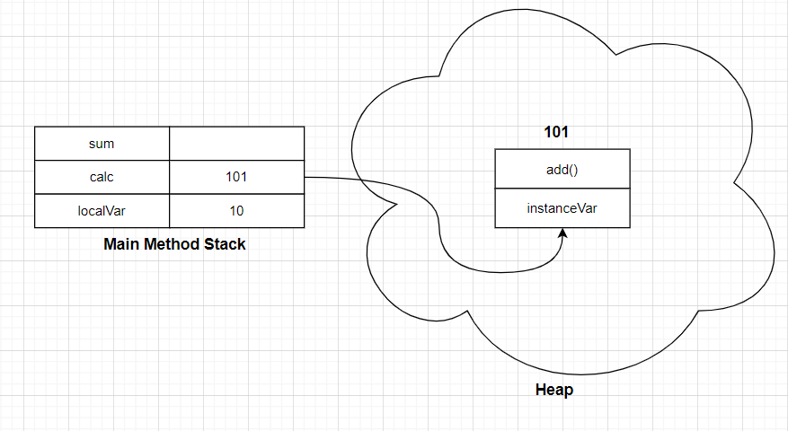

- Now **calc** calls **add** method , so now a new stack for add method will be created, this add method will have all its local variables.

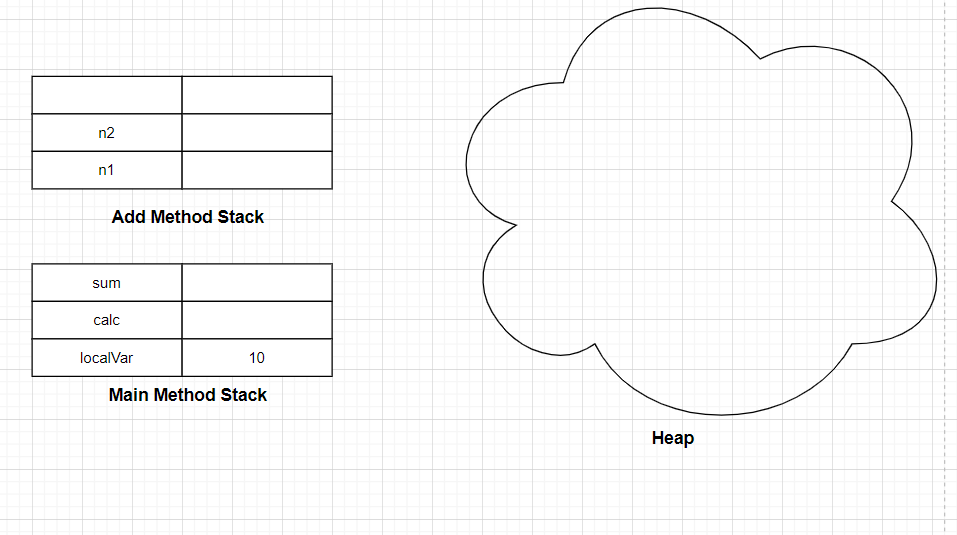

- What will the values of **n1** and **n2**? it will be 5 and 4 because that it was it been pass when **calc** calls **add** method. After executing add it will return 7 as its output to the variable sum.

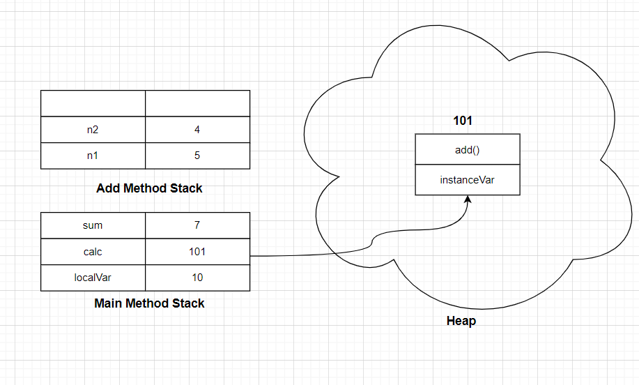

- Now we have set the **instanceVar=6** .

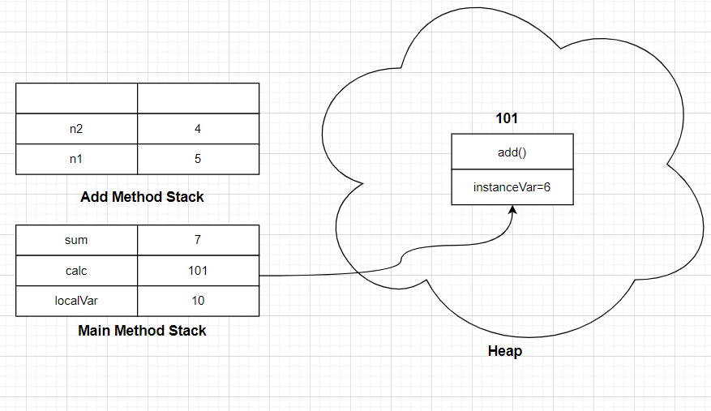

- We creating a new object reference for **calc1** and setting **instanceVar=7** for that newly object reference.

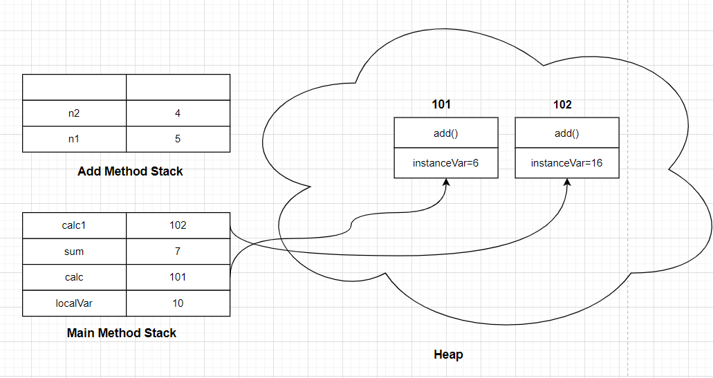

- If you notice, the heap size has been also increase thus heap memory is also called as **dynamic memory**.

## What is String?

- In Java, a String is a sequence of characters and is one of the most commonly used classes in the Java programming language. The String class is part of the `java.lang` package and is used to create and manipulate strings (text).

```
public class AboutStrings {
    public static void main(String[] args) {
        
        /**
         * Initializing a value in String
         */
        String n=new String();
        n="Harsh";
        System.out.println(n);

        String n1=new String("Pandya");
        System.out.println(n+" "+n1);
    
        String n2="Mr.";
        System.out.println(n2+" "+n+" "+n1);
    }
}


Output:
Harsh
Harsh Pandya
Mr. Harsh Pandya
```

- Lets say you have two string variables which stores the same value. What do you thing the reference variable values are same or different?

```
        /**
         * Points the same object in the string pool of heap memory
         */
        String s1="welcome";
        String s2="welcome";
        String s3="Welcome"; // New String literal

        System.out.println(s1.hashCode());
        System.out.println(s2.hashCode());
        System.out.println(s3.hashCode());


Output:
1233099618
1233099618
-1397214398
```

- It is the same. Java uses a special memory area called the **String Pool** to store string literals or value. When a string literal is created, the JVM checks the string pool to see if an identical string already exists. If it does, the new reference points to the existing string. If not, a new string is created in the pool.

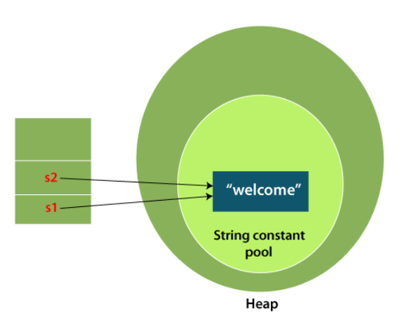

>[!IMPORTANT]
> - If we explicitly specify **`String str=new String("Explicitly telling java to create a new Object but still it won't create")`** then still it will search in String pool. If literal is not available then only its creates a new object of string.

### Common String in-built methods

```
        String str = "Hello";
        int len = str.length(); // 5
        char c = str.charAt(1); // 'e'
        String sub = str.substring(1, 4); // "ell"
        boolean isEqual = str.equals("Hello"); // true
        String greeting = str.concat(" World"); // "Hello World"

        String strWithSpaces = "   Hello World   ";
        String trimmed = strWithSpaces.trim();
        System.out.println("Trimmed: '" + trimmed + "'"); // Output: Trimmed: 'Hello World'

        String replaced = str.replace('o', 'a');
        System.out.println("Replaced 'o' with 'a': " + replaced); // Output: Replaced 'o' with 'a': Hella Warld

        boolean contains = str.contains("World");
        System.out.println("Contains 'World': " + contains); // Output: Contains 'World': true

        boolean isEqualIgnoreCase = str.equalsIgnoreCase("hello world");
        System.out.println("Equals Ignore Case 'hello world': " + isEqualIgnoreCase); // Output: Equals Ignore Case 'hello world': true

        boolean startsWith = str.startsWith("Hello");
        System.out.println("Starts with 'Hello': " + startsWith); // Output: Starts with 'Hello': true

        boolean endsWith = str.endsWith("World");
        System.out.println("Ends with 'World': " + endsWith); // Output: Ends with 'World': true
        
        String[] parts = str.split(" ");
        System.out.println("Split by space: ");
        for (String part : parts) {
            System.out.println(part);
        }
        // Output:
        // Split by space:
        // Hello
        // World
```

### Immutable and Mutable String (String, String Buffer, String Builder)

#### Immutable (String)

- Strings in Java are **immutable**, which means once a String object is created, it cannot be changed. Any modification to a string creates a new String object.

```
String str = "Hello";
str = str + " World";  // A new string "Hello World" is created, "str" now references the new string
```
- **Usage**: Best used when the string content is not expected to change frequently, such as for string literals or small concatenations.
- **Performance**: Since strings are immutable, every modification (like concatenation) creates a new object, which can be inefficient, especially in loops or when handling large amounts of data.

#### Mutable (String Buffer, String Builder)

##### String Buffer

- **Mutable**: Unlike String, **StringBuffer** allows modification of the string content without creating new objects.
- **Thread-Safe**: **StringBuffer** is synchronized, meaning it is safe to use in a multi-threaded environment where multiple threads might access and modify the string simultaneously.
- **Usage**: Use **StringBuffer** when you need to perform many modifications on a string in a multi-threaded environment.
- **Performance**: It is slower than **StringBuilder** due to the overhead of synchronization but faster than String for string modifications.

```
StringBuffer sb = new StringBuffer("Hello");
sb.append(" World");
System.out.println(sb.toString()); // Output: Hello World
```

##### String Builder

- **Mutable**: Like **StringBuffer**, **StringBuilder** allows modification of the string content.
- **Not Thread-Safe**: **StringBuilder** is not synchronized, meaning it is not safe to use in a multi-threaded environment without additional synchronization.
- **Usage**: Use **StringBuilder** when you need to perform many modifications on a string in a single-threaded environment. It's more efficient than StringBuffer because it doesn’t have the synchronization overhead.
- **Performance**: It is the fastest option for string modification when thread safety is not a concern.

*We will explore String buffer how it is thread safe when we will learn about threads*

```
StringBuilder sb = new StringBuilder("Hello");
sb.append(" World");
System.out.println(sb.toString()); // Output: Hello World
```

>[!NOTE]
> - In-built methods which are applicable for string are also applicable for String builder as well as String buffer.

## Packages

- As a developer when you work on a large project , you will be writing many codes. You might ended up multiple files. Now it is a good practice to organize you files into a different folder , thus providing a readability.
- Packages help organize your code into a structured, hierarchical way, making it easier to manage large projects.
- Packages are simple sort of folder where all your require files are structure. Packages help avoid naming conflicts for two same while which does the same function but present in different packages or folder.
- When you are working on large project you might require a different package for a database conections. Lets create that

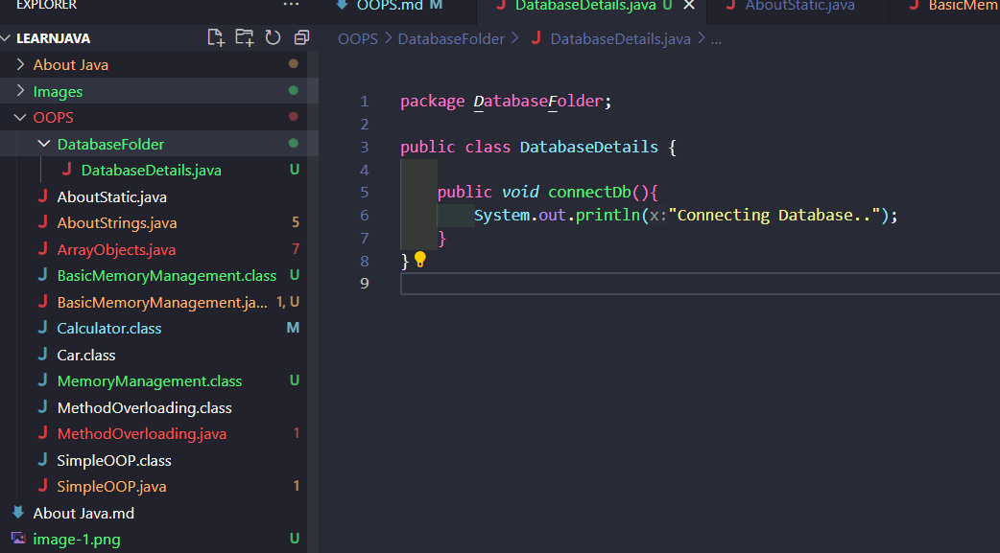

- Lets create a project java file which will call this **DatabaseDetails.java** 

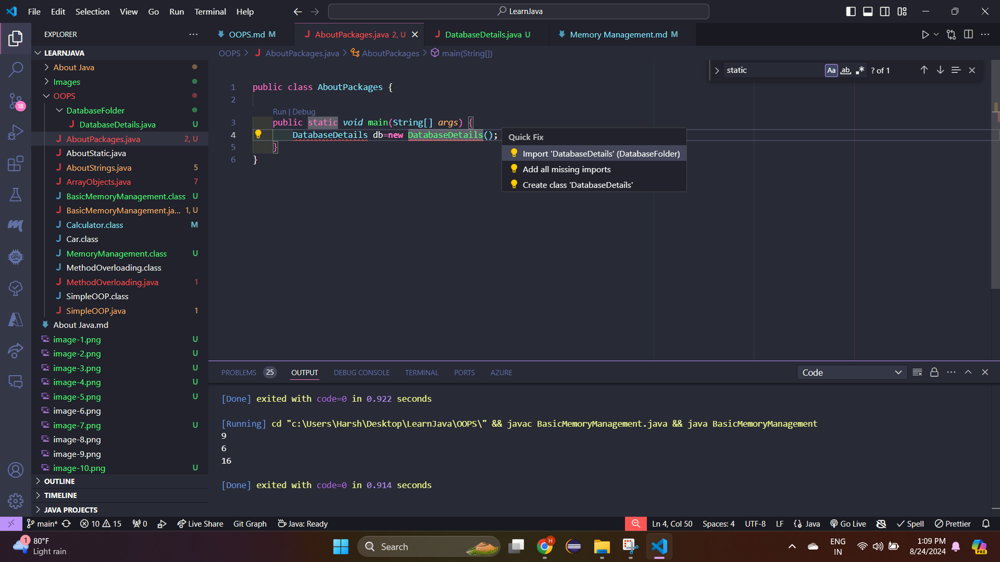

- If you see it is suggesting to import **DatabaseDetails** of **DatabaseFolder** package, since the class is in different folder
- Post importing

```
import DatabaseFolder.DatabaseDetails;

public class AboutPackages {

    public static void main(String[] args) {
        DatabaseDetails db=new DatabaseDetails();
        db.connectDb();
    }
}


Output:
Connecting Database..
```

- Now the packages we have declare are **User-defined or Custom** package. `import DatabaseFolder.DatabaseDetails` states that import the class `DatabaseDetails` of the folder `DatabaseFolder`.
- **Every class methods you use belongs to a package**. There are some in-built packages which comes with JDK.
- Have wonder `System.out.println` belongs to ?

<video controls src="Images/java-1/20240824-0748-27.8244916.mp4" title="Title"></video>

- The `System` is a class which belongs to `java.lang` folder, it means some where in the jdk there is a java folder , inside that there is a sub-folder called lang which has a class called **System**.
- `java.lang.*` is imported by default into a Java program. When we say `java.lang.*` it means all the files present under lang folder are imported by default.
- Similarly if we have multiple sub-folders which consist of several file, we can import them using **`*`** wildcard.

### Why Are Packages Required?
- **Organize Code**: Packages help organize your code into a structured, hierarchical way, making it easier to manage large projects.
- **Avoid Naming Conflicts**: By grouping related classes together, packages help avoid naming conflicts. Classes in different packages can have the same name.
- **Access Control**: Packages provide access protection; classes within a package can access each other's members without restriction, while restricting access from classes in different packages.
- **Reusability**: Packages allow for easy reuse of classes and interfaces. Developers can create libraries of code and distribute them in the form of packages.


## Static

- Lets create a student class and reference variable of it.

```
class Student{
    String schoolname;
    int id;
    int marks;

    public void details(){
        System.out.println("School name: "+schoolname+" ,ID: "+id+" ,marks: "+marks);
    }
}

public class AboutStatic {
    public static void main(String[] args) {
        
        Student s1=new Student();
        s1.schoolname="IIT";
        s1.id=1;
        s1.marks=95;

        Student s2=new Student();
        s2.schoolname="BITS";
        s2.id=2;
        s2.marks=95;

        s1.details();
        s2.details();
    }
}

Output:
School name: IIT ,ID: 1 ,marks: 95
School name: BITS ,ID: 2 ,marks: 95
```

- Lets add **static** keyword against the `schoolname` variable and then lets try to execute the same code.

```
class Student{
    static String schoolname;
    int id;
    int marks;

    public void details(){
        System.out.println("School name: "+schoolname+" ,ID: "+id+" ,marks: "+marks);
    }
}

public class AboutStatic {
    public static void main(String[] args) {
        
        Student s1=new Student();
        s1.schoolname="IIT";
        s1.id=1;
        s1.marks=95;

        Student s2=new Student();
        s2.schoolname="BITS";
        s2.id=2;
        s2.marks=96;

        s1.details();
        s2.details();
    }
}


Output:
School name: BITS ,ID: 1 ,marks: 95
School name: BITS ,ID: 2 ,marks: 96
```

- Why so we got `BITS` for reference variable s1?, this is because a static variable is a variable that belongs to the class rather than to any specific instance (object) of the class. It is shared among all instances of the class. Only one copy of a static variable is created and shared across all objects of that class.
- Static variables are useful when you want to share a common piece of data across all instances of a class. For example, a variable that counts the number of instances of a class created.
- The static variables are stored in **MetaSpace** 

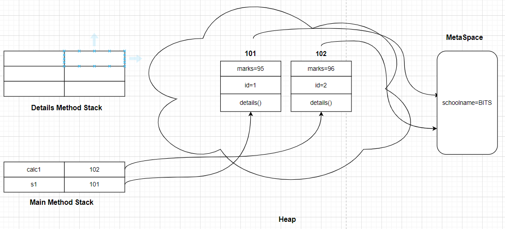

- What if the **static** key word is applied on method? , lets apply static keyword on the `details()` method.

```
class Student{
    static String schoolname;
    int id;
    int marks;

    public static void details(){
        System.out.println("School name: "+schoolname+" ,ID: "+id+" ,marks: "+marks);
    }
}

public class AboutStatic {
    public static void main(String[] args) {
        
        Student s1=new Student();
        s1.schoolname="IIT";
        s1.id=1;
        s1.marks=95;

        Student s2=new Student();
        s2.schoolname="BITS";
        s2.id=2;
        s2.marks=96;

        s1.details();
        s2.details();

        
    }
}
```

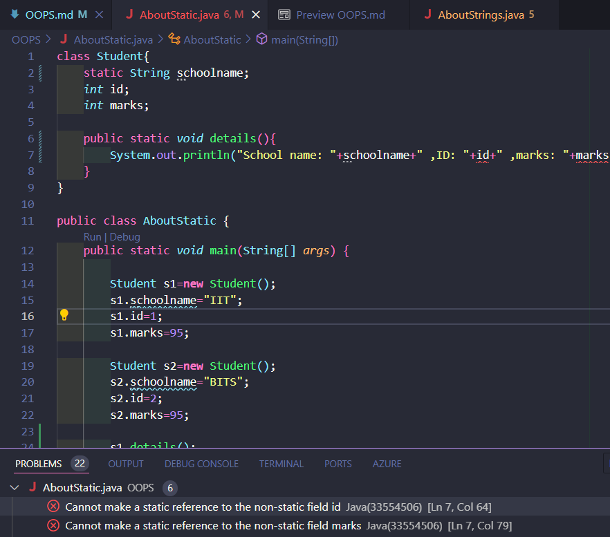

- We got an error **`Cannot make a static reference to the non-static field id, Cannot make a static reference to the non-static field marks`**. So basically there is 1 value for the variable **schoolname** since it is a static variable, but there are 2 values of **id** and **marks** (`s1.id=1,s2.id=2` and `s1.marks=95,s2.marks=96`) , these are non-static variables. Now since there are two different values, how will the static method will get to know which one to be called and printed?
- Thats why we can use **a static variable inside a static method but we cannot use a non-static variable inside a static method**.
- Lets do a work around, now if a static method is confused which values to be printed out what if we pass the reference variable's object to clear out the confusion?

```
class Student{
    static String schoolname;
    int id;
    int marks;

    public static void details(Student obj){
        System.out.println("School name: "+schoolname+" ,ID: "+obj.id+" ,marks: "+obj.marks);
    }
}

public class AboutStatic {
    public static void main(String[] args) {
        
        Student s1=new Student();
        s1.schoolname="IIT";
        s1.id=1;
        s1.marks=95;

        Student s2=new Student();
        s2.schoolname="BITS";
        s2.id=2;
        s2.marks=95;

        s1.details(s2);
        s2.details(s1);

        
    }
}

Output:
School name: BITS ,ID: 2 ,marks: 95
School name: BITS ,ID: 1 ,marks: 95
```

- So **by passing out the reference variable's object we can use non-static variable can be access in static method**


### Why Should We Call Static Members via Class Name and Not Object Name?

- We see below warnings which says 

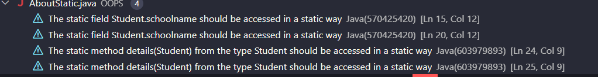

- **Clarity and Intent**: Calling static methods or accessing static variables via the class name makes it clear that these members belong to the class, not to any specific instance. It clarifies that the method or variable is not dependent on the state of any particular object.
- **Avoid Confusion**: If you call a static method using an object, it can give the false impression that the method is tied to the instance's state, which it is not. Using the class name prevents this confusion.
- **Language Specification**: Java language specification allows calling static methods through objects, but it's not recommended as it goes against the intended use of static members.

```
class Student{
    static String schoolname;
    int id;
    int marks;

    public static void details(Student obj){
        System.out.println("School name: "+schoolname+" ,ID: "+obj.id+" ,marks: "+obj.marks);
    }
}

public class AboutStatic {
    public static void main(String[] args) {
        
        Student s1=new Student();
        Student.schoolname="IIT";
        s1.id=1;
        s1.marks=95;

        Student s2=new Student();
        Student.schoolname="BITS";
        s2.id=2;
        s2.marks=95;

        Student.details(s2);
        Student.details(s1);

        
    }
}
```

### Static on Class

- In Java, top-level classes (classes that are not nested within another class) cannot be declared as static. **This is because the static keyword implies that something belongs to the class itself rather than an instance of the class**. A top-level class itself is not contained within another class, so the concept of **static** does not apply in this context.

```
static class TopLevelClass { // Compilation error -> Illegal modifier for the class Student; only public, abstract & final are permitted
    // ...
}
```

- Though static cannot be applied on top-level class but it can be applied on nested classes.

```
class OuterClass {
    int i; // Instance variable
    static int j; // Static variable or Class variables 
    // Static nested class or Static member inner classes
    static class StaticNestedClass {
        void display() {
            System.out.println("Inside static nested class "+OuterClass.j);
        }
    }
}

public class Main {
    public static void main(String[] args) {
        // No need to create an instance of the outer class
        OuterClass.StaticNestedClass nestedObject = new OuterClass.StaticNestedClass();
        nestedObject.display(); // Output: Inside static nested class
    }
}

Output:
Inside static nested class 0
```

>[!IMPORTANT]
> - Static variables (also known as class variables) are associated with the class itself rather than with any particular instance of the class. They are shared across all instances of a class. Static variables are declared at the class level, outside any method. Declaring them inside a method would contradict their class-level nature, as methods are instance-specific (non-static methods) or just a part of the class logic (static methods).
> - Static variables cannot be defined under any method.


#### Key Points about Static Nested Classes:
- A static nested class can access the static members (variables and methods) of the outer class.
- A static nested class cannot directly access the non-static members of the outer class. It must use an instance of the outer class to do so.
- Instances of a static nested class are not tied to instances of the outer class.

### Static Block

- Lets say you wanted to execute some statements or initialize values into variable whenever the class is loaded.

```
public class AboutStatic {

    static{
        System.out.println("Statement got executed when the class is loaded");
    }

    public static void main(String[] args) {
        
        System.out.println("Inside Main Method");
                
    }
}

Output:
Statement got executed when the class is loaded
Inside Main Method
```

- A static block (also known as a static initializer block) is a block of code that is executed when the class is loaded into memory by the Java ClassLoader. So it only executes once because class is loaded once until new changes are made into it.
- It is used to initialize static variables and perform any setup required for the class before any instances are created or any static methods are called

#### Characteristics of Static Blocks
- **Executed Once**: The static block is executed only once, when the class is loaded for the first time.
- **Executed Before main**: Static blocks are executed before the main method, as well as before any static methods or constructors are called.
- **Multiple Static Blocks**: You can have more than one static block in a class, and they will be executed in the order in which they appear in the class.

```
public class AboutStatic {

    static{
        System.out.println("Statement got executed when the class is loaded");
    }
    static{
        System.out.println("Second Statement");
    }
    public static void main(String[] args) {

        System.out.println("Inside Main Method");
                
    }
}

Output:
Statement got executed when the class is loaded
Second Statement
Inside Main Method
```

#### When to Use Static Blocks?
- **Initialization of Static Fields**: When static fields need to be initialized with values that require some logic or computation.
- **Resource Management**: To initialize static resources, such as loading a file or setting up a database connection that will be shared across instances. When working with large project, you need to first initialize database connections , logging etc..
- **Exception Handling**: To initialize a static variable in a static block that can handle exceptions (since static variable initialization in a field declaration cannot have a try-catch block).


- Can we have static block in other class except for main? lets try , so we have a class **A**, and we have create a static block within class A which has a method `display()`.

```
class A{
    static int num;
    static{
        num=7;
        System.out.println("Assigned Number 7");
    }

    public void display(){
        System.out.println("In A");
    }
}

public class AboutStatic {

    static{
        System.out.println("Statement got executed when the class is loaded");
    }
    static{
        System.out.println("Second Statement");
    }
    public static void main(String[] args) {

        System.out.println("Inside Main Method");

        A a=new A();
        a.display();
                
    }
}

Output:
Statement got executed when the class is loaded
Second Statement
Inside Main Method
Assigned Number 7
In A
```

- So before `display` method is called, the static block statements got executed. What if we don't create object of class A? will it still execute?

```
class A{
    static int num;
    static{
        num=7;
        System.out.println("Assigned Number 7");
    }

    public void display(){
        System.out.println("In A");
    }
}

public class AboutStatic {

    static{
        System.out.println("Statement got executed when the class is loaded");
    }
    static{
        System.out.println("Second Statement");
    }
    public static void main(String[] args) {

                
    }
}

Output:
Statement got executed when the class is loaded
Second Statement
```

- So when the object of class A was created then only the static block of A got executed. This state that static block only gets executed when object creation takes place.
- What if you don't wanna create any object and just wanted to load class A.

```
public class AboutStatic {

    static{
        System.out.println("Statement got executed when the class is loaded");
    }
    static{
        System.out.println("Second Statement");
    }
    public static void main(String[] args) throws ClassNotFoundException {

        Class.forName("A");
                
    }
}

Output:
Statement got executed when the class is loaded
Second Statement
Assigned Number 7
```

- So `Class.forName("A")` accepts a string parameter of your class name and just loads the class inside your JVM.
- This concludes that **static block statements gets executed when the class is loaded or a object of that class is instantiated**.


## Array Objects

- In Java, an Array of Objects refers to an array that can store references to objects of a particular class. Just like arrays of primitive types (e.g., int[], char[]), an array of objects can store multiple elements, but each element is a reference to an instance of a class.

```

class Student{
    int rollnumber;
    String name;
    long marks;
}


public class ArrayObjects{
    public static void main(String[] args) {
        
        /**
         * Creating references objects for student class
         */
        Student s1=new Student();
        s1.rollnumber=1;
        s1.marks=90;
        s1.name="Harsh";

        Student s2=new Student();
        s2.rollnumber=2;
        s2.marks=97;
        s2.name="Meet";

        Student[] ArrayObject = {s1,s2};
        for(Student s:ArrayObject){
            System.out.println(s.name+" , "+s.marks+" , "+s.rollnumber);
        }
    }
}

Output:
Harsh , 90 , 1
Meet , 97 , 2
```

- An array of objects in Java allows you to store multiple objects of a particular class in a single data structure.
- You must create each object individually before storing it in the array.
- Once stored, you can access and manipulate these objects using their index in the array.

## Reference Keyword 'this'

- Lets say you have a class called Assigned

```
class AssignedNumbers{

    int num1;

    public void assigned(int n1){
        num1=n1;
    }
    public void display(){
        System.out.println("Number value is - "+num1);
    }
}

public class AboutThis {
    
    public static void main(String[] args) {
        
        AssignedNumbers a = new AssignedNumbers();
        a.assigned(5);
        a.display();
    }
}

Output:
Number value is - 5
```

- Lets say you wanna change the argument of `assigned` method to **num1**

```
class AssignedNumbers{

    int num1;

    public void assigned(int num1){
        num1=num1;
    }
    public void display(){
        System.out.println("Number value is - "+num1);
    }
}

public class AboutThis {
    
    public static void main(String[] args) {
        
        AssignedNumbers a = new AssignedNumbers();
        a.assigned(5);
        a.display();
    }
}

Output:
Number value is - 0
```

- Why did we got 0? this is because you are assigning the value of local variable (num1) to itself. (5=5). You are not assigning your local variable value to your instance variable.
- How to then assign to our instance variable? one way is to pass the object itself as an argument.

```
class AssignedNumbers{

    int num1;

    public void assigned(int num1,AssignedNumbers a){
        a.num1=num1;
    }
    public void display(){
        System.out.println("Number value is - "+num1);
    }
}

public class AboutThis {
    
    public static void main(String[] args) {
        
        AssignedNumbers a = new AssignedNumbers();
        a.assigned(5,a);
        a.display();
    }
}

Output:
Number value is - 5
```

- Now java says, why to again pass the object to method, imagine there are several variable instance and different methods, will you pass the object repeatably ? to avoid this we have a **this** keyword.

```
class AssignedNumbers{

    int num1;

    public void assigned(int num1){
        this.num1=num1;
    }
    public void display(){
        System.out.println("Number value is - "+num1);
    }
}

public class AboutThis {
    
    public static void main(String[] args) {
        
        AssignedNumbers a = new AssignedNumbers();
        a.assigned(5);
        a.display();
    }
}

Output:
Number value is - 5
```

## Method Overloading

- Lets say we have a class calculator , for which we need add two numbers and returns the value. Uptil now we have used **void** which means that the method won't return anything , now the method will compute and return a integer value.

```
package OOPS;


class Calculator{

    public int add(int n1,int n2){

        /**
         * Method add returns the sum of n1+n2
         */
        return n1+n2;
    }
    
}

public class MethodOverloading {
    
    public static void main(String[] args) {
        
        Calculator twoNums=new Calculator();
        /**
         * Passing 4 and 5 required arguments for method "add"
         */
        System.out.println("Addition of 5 and 4 is "+twoNums.add(4, 5));
    }
}

Output:
Addition of 5 and 4 is 9
```

- Now lets say there is a requirement like , sometimes you may get 3 numbers or you may get 2 numbers, now you could create another method inside the class. The method could be **add1** since there exists already an **add** method. Here we have taken example of 2 - 3 variables addition, tomorrow there could be n number of variables addition , how do that ? java says, hey programmer since you have different number of arguments inside your add method , you can still create a method with same name i.e **add**.

```
package OOPS;


class Calculator{

    public int add(int n1,int n2){

        /**
         * Method add returns the sum of n1+n2
         */
        return n1+n2;
    }

    /**
     * Method Overloading by parameters
     */
    public int add(int n1, int n2, int n3){
        return n1+n2+n3;
    }
    
}

public class MethodOverloading {
    
    public static void main(String[] args) {
        
        Calculator twoNums=new Calculator();
        /**
         * Passing 4 and 5 required arguments for method "add"
         */
        System.out.println("Addition of 5 and 4 is "+twoNums.add(4, 5));
        System.out.println("Addition of 5,4 and 6 is "+twoNums.add(5, 4,6));
    }
}

Output:
Addition of 5 and 4 is 9
Addition of 5,4 and 6 is 15
```

- Lets say we wanna add two floating point numbers.

```
package OOPS;


class Calculator{

    public int add(int n1,int n2){

        /**
         * Method add returns the sum of n1+n2
         */
        return n1+n2;
    }

    /**
     * Method Overloading by parameters
     */
    public int add(int n1, int n2, int n3){
        return n1+n2+n3;
    }

    /**
     * Method Overloading by type
     */
    public double add(double n1,double n2){
        return n1+n2;
    }
}

public class MethodOverloading {
    
    public static void main(String[] args) {
        
        Calculator twoNums=new Calculator();
        /**
         * Passing 4 and 5 required arguments for method "add"
         */
        System.out.println("Addition of 5 and 4 is "+twoNums.add(4, 5));
        System.out.println("Addition of 5,4 and 6 is "+twoNums.add(5, 4,6));
        System.out.println("Addition of 5.5 and 4.5 is "+twoNums.add(4.5, 5.5));

    }
}


Output:
Addition of 5 and 4 is 9
Addition of 5,4 and 6 is 15
Addition of 5.5 and 4.5 is 10.0
```

- Method overloading is a technique, multiple methods in the same class can have the same name but different parameters.

>[!NOTE]
> - Overloading property is only associated with method and not with variables and classes

## Constructors

- A constructor in Java is a special method that is automatically called when an object of a class is created. The purpose of a constructor is to initialize the newly created object. A constructor has the same name as the class and does not have a return type (not even void).
- Lets create a constructor

```

class ABC{

    ABC(){ //constructor
        System.out.println("Constructor of ABC");
    }
}

public class AboutConstructor {
    public static void main(String[] args) {

        /**
         * Object initialized and reference is assigned to abc 
         */
        ABC abc=new ABC();
    }
}

Output:
Constructor of ABC
```

- Thus, you can see when the object is initialized method `ABC` or the constructor method `ABC` is called by default. We have not specified `abc.ABC()`.
- Lets create some instance variable and assigned them some default values via constructor.

```

class ABC{

    int age;
    String name;

    ABC(){ //constructor
        System.out.println("Constructor of ABC");
        age=10;
        name="Harsh";
        System.out.println("Name: "+name+", age:"+age);
    }
}

public class AboutConstructor {
    public static void main(String[] args) {

        /**
         * Object initialized and reference is assigned to abc 
         */
        ABC abc=new ABC();
    }
}


Output:
Constructor of ABC
Name: Harsh, age:10
```

- This way constructors are used to initialize the state of an object when it is created. This means setting up the initial values for the object’s instance variables.
- Now lets add assign value using reference variable. 

```

class ABC{

    int age;
    String name;

    ABC(){ //constructor or No-Args Constructor
        System.out.println("Constructor of ABC");
        age=10;
        name="Harsh";
        System.out.println("Name: "+name+", age:"+age);
    }

    ABC(int age,String name){ // Constructor overloading
        this.age=age;
        this.name=name;
        System.out.println("Constructor with arguments of ABC");
        System.out.println("Name: "+name+", age:"+age);
    }
}

public class AboutConstructor {
    public static void main(String[] args) {

        /**
         * Object initialized and reference is assigned to abc 
         */
        ABC abc=new ABC();
        ABC abc1=new ABC(24,"Meet");
    }
}


Output:
Constructor of ABC
Name: Harsh, age:10
Constructor with arguments of ABC
Name: Meet, age:24
```

- You can see by assigning values via object we perform method overloading or to be more specific constructor overloading. You can have multiple constructors in a class with different parameters (this is called constructor overloading).
- So there are two types of constructor

###  Default Constructor (No-Argument Constructor)
- **Definition**: A default constructor is a no-argument constructor that is automatically provided by the Java compiler if no other constructors are explicitly defined in the class.
- **Purpose**: The default constructor initializes the object with default values. For example, numeric fields are initialized to 0, boolean fields to false, and object references to null.
- **When It's Used**: If you do not define any constructor in your class, the compiler automatically provides a default constructor.

### Parameterized Constructor
- **Definition**: A parameterized constructor is one that accepts parameters (arguments). It allows you to pass values to the constructor when creating an object, providing a way to initialize the object with different values.
- **Purpose**: To initialize objects with specific values provided at the time of creation, allowing for greater flexibility and customization.
- **When It's Used**: When you want to initialize an object with specific values or require certain parameters to be set upon object creation.


## Anonymous Object

- What if instead of creating reference variable of an object , can we create only just a object? lets see

```
class Unknown{
    public void show(){
        System.out.println("In display...");
    }
}
public class AboutAnonymous {
    public static void main(String[] args) {
        int i=0;
        new Unknown().show(); // Anonymous Object
    }
}

Output:
In display...
```

- An anonymous object in Java is an object that is created without being assigned a reference variable. This means that the object is instantiated and immediately used without storing it in a variable.
- Since it has no reference, it cannot be reused after its creation and initial use.

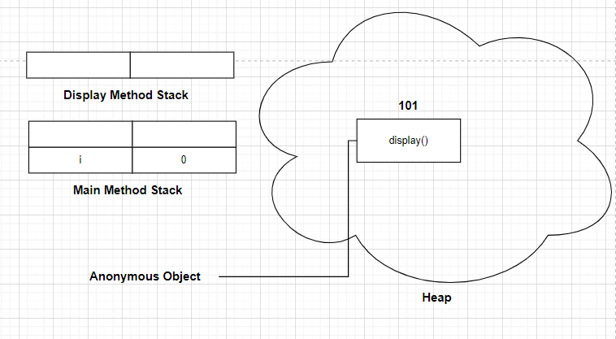

- Anonymous objects are used when an object is needed only once. For example, when you want to call a method of an object and do not need to reuse the object afterwards.
- Because anonymous objects are not stored in variables, they can help save memory. After the object is used, it becomes eligible for garbage collection immediately, reducing the memory footprint.

## Cohesion

- Cohesion in Java is the Object-Oriented principle most closely associated with making sure that a class is designed with a single, well-focused purpose. In object-oriented design, cohesion refers to how a single class is designed.
- Lets take an example, look the below code

```
// High Cohesion Example
 
// This class is responsible only for managing books.
class Book {
    private String title;
    private String author;
    
    public Book(String title, String author) {
        this.title = title;
        this.author = author;
    }
 
    public String getTitle() {
        return title;
    }
 
    public String getAuthor() {
        return author;
    }
 
    public void displayBookDetails() {
        System.out.println("Title: " + getTitle() + ", Author: " + getAuthor());
    }
}
 
// This class is responsible only for library management tasks.
class Library {

    static int i=0;
    static Book books[] = new Book[5];
 
    public void addBook(Book book) {
        books[i]=book;
        i++;
    }
 
    public void displayAllBooks() {
        for (int j=0;j<i;j++) {
            books[j].displayBookDetails();
        }
    }
}

public class AboutCohesion{
    public static void main(String args[]){

        Library library = new Library();
        Book book1 = new Book("1984", "George Orwell");
        Book book2 = new Book("To Kill a Mockingbird", "Harper Lee");

        library.addBook(book1);
        library.addBook(book2);

        library.displayAllBooks();

    }
}

Output:
Title: 1984, Author: George Orwell
Title: To Kill a Mockingbird, Author: Harper Lee
```

- If you see the above code, the `Book` class has a single responsibility: to represent a book. The `Library` class manages books (adding, displaying).  Each class is focused on a single responsibility. This is called **High Cohesion**.
- Now consider the below code.

```
// Low Cohesion Example
class AllThingsInOneClass {
    
    static int bookCounter=0;
    static int UserCounter=0;
    String booksName[] = new String[5];
    String booksAuthor[] = new String[5];
    String Users[] = new String[5];
    
    // Book Management Responsibility
    public void addBook(String name,String author) {
        booksName[bookCounter]=name;
        booksAuthor[bookCounter]=author;
        bookCounter++;
    }

    public void displayAllBooks() {
        for (int i=0;i<bookCounter;i++) {
            System.out.println("Title: " + booksName[i] + ", Author: " + booksAuthor[i]);
        }
    }

    // User Management Responsibility (Unrelated to books)
    public void addUser(String user) {
        Users[UserCounter]=user;
        UserCounter++;
    }

    public void displayAllUsers() {
        for (int i=0;i<UserCounter;i++) {
            System.out.println("User: " + Users[i]);
        }
    }

    // Some unrelated functionality (Unrelated to both books and users)
    public void sendNotification(String message) {
        System.out.println("Sending notification: " + message);
    }
}

public class AboutCohesion{
    public static void main(String args[]){

        // Low Cohesion
        AllThingsInOneClass allThingsInOneClass = new AllThingsInOneClass();
        
        // Book management
        allThingsInOneClass.addBook("1984", "George Orwell");
        
        // User management
        allThingsInOneClass.addUser("Alice");
        
        // Display all books and users
        allThingsInOneClass.displayAllBooks();
        
        // Unrelated functionality
        allThingsInOneClass.sendNotification("Library will be closed tomorrow.");
    }
}

Output:
Title: 1984, Author: George Orwell
Sending notification: Library will be closed tomorrow.
```

- In the above code all things are maintained within the one single class. The `AllThingsInOneClass` class handles multiple unrelated tasks:
    - Book management: Adding and displaying books.
    - User management: Adding and displaying users.
    - Notifications: Sending notifications.
- It mixes concerns, making the class harder to understand and maintain. For example, if you need to modify the book management, you might accidentally impact the unrelated user or notification logic.
- The class has too many responsibilities, leading to poor maintainability and increased complexity.
- **High Cohesion**: The class performs only one role and focuses on doing one thing well.
- **Low Cohesion**: The class tries to do too many things, making it harder to maintain, understand, and extend.
- **High cohesion** leads to better design and more maintainable code, while **low cohesion** makes the code more error-prone, harder to extend, and more difficult to understand.

| **Aspect**           | **High Cohesion**                       | **Low Cohesion**                                  |
|----------------------|-----------------------------------------|---------------------------------------------------|
| **Responsibilities** | Focused on a single responsibility.     | Multiple, unrelated responsibilities.             |
| **Maintainability**  | Easy to maintain due to clear purpose.  | Harder to maintain due to mixed responsibilities. |
| **Readability**      | Code is easier to read and follow.      | Code is harder to read and understand.            |
| **Reusability**      | Classes can be reused easily.           | Classes are harder to reuse due to complexity.    |
| **Complexity**       | Low complexity, small, focused classes. | Higher complexity, large, multi-purpose classes   |

## Inheritance

- Lets say you have a Basic calculator class which only performs addition and subtraction. 

```
class BasicCalculator{
    public int add(int n1, int n2){
        return n1+n2;
    }

    public int subtract(int n1,int n2){
        return n1-n2;
    }
}


public class AboutInheritence{
    public static void main(String[] args) {
        BasicCalculator bc=new BasicCalculator();
        System.out.println("Addition of 5 and 4 - "+bc.add(5,4));
        System.out.println("Subtraction of 5 and 4 - "+bc.subtract(5,4));
    }
}

Output:
Addition of 5 and 4 - 9
Subtraction of 5 and 4 - 1
```

- Now lets say you have built logic for multiplication as well division, now you have written those logic inside the class. 

```
class BasicCalculator{
    public int add(int n1, int n2){
        return n1+n2;
    }

    public int subtract(int n1,int n2){
        return n1-n2;
    }
}


class CompleteCalculator{
    public int multiply(int n1,int n2){
        return n1*n2;
    }

    public double division(int n1,int n2){
        return (double)n1/n2;
    }
}

public class AboutInheritence{
    public static void main(String[] args) {
        BasicCalculator bc=new BasicCalculator();
        System.out.println("Addition of 5 and 4 - "+bc.add(5,4));
        System.out.println("Subtraction of 5 and 4 - "+bc.subtract(5,4));

        CompleteCalculator cc=new CompleteCalculator();
        System.out.println("Multiply 5 and 4 - "+cc.multiply(5,4));
        System.out.println("Divide 5 and 4 - "+cc.division(5,4));


    }
}


Output:
Addition of 5 and 4 - 9
Subtraction of 5 and 4 - 1
Multiply 5 and 4 - 20
Divide 5 and 4 - 1.25
```

- Your class `CompleteCalculator` is still incomplete because it does not have addition and subtraction. Now to make this complete you could implement the logic of addition and subtraction by yourself or you could have inherit the properties of `BasicCalculator`.

```
class BasicCalculator{ // Parent Class or Super Class
    public int add(int n1, int n2){
        return n1+n2;
    }

    public int subtract(int n1,int n2){
        return n1-n2;
    }
}


class CompleteCalculator extends BasicCalculator{ // Child Class or Sub Class 
    public int multiply(int n1,int n2){
        return n1*n2;
    }

    public double division(int n1,int n2){
        return (double)n1/n2;
    }
}

public class AboutInheritence{
    public static void main(String[] args) {
        BasicCalculator bc=new BasicCalculator();
        System.out.println("Addition of 5 and 4 - "+bc.add(5,4));
        System.out.println("Subtraction of 5 and 4 - "+bc.subtract(5,4));

        CompleteCalculator cc=new CompleteCalculator();
        System.out.println("Multiply 5 and 4 - "+cc.multiply(5,4));
        System.out.println("Divide 5 and 4 - "+cc.division(5,4));
        System.out.println("Addition of 5 and 4 - "+cc.add(5,4));
        System.out.println("Subtraction of 5 and 4 - "+cc.subtract(5,4));

    }
}

Output:
Addition of 5 and 4 - 9
Subtraction of 5 and 4 - 1
Multiply 5 and 4 - 20
Divide 5 and 4 - 1.25
Addition of 5 and 4 - 9
Subtraction of 5 and 4 - 1
```

- Inheritance is a fundamental concept of Object-Oriented Programming (OOP) in Java, where one class (the child class or subclass) inherits the properties (fields) and behaviors (methods) of another class (the parent class or superclass).
- Inheritance allows a new class to reuse the fields and methods of an existing class, thereby promoting code reusability and creating a hierarchical relationship between classes. The child class reference variable can access the parent class instance variable as well as methods.
- Lets say there is a `reset` method which makes the calculation starting point to 0 ( BasicCalculator ) and to 1 ( CompleteCalculator ). Both method names are same in the parent class as well the child class. If we call the `reset` method using child class reference variable what gonna happen?

```
class BasicCalculator{ // Parent Class or Super Class
    public int add(int n1, int n2){
        return n1+n2;
    }

    public int subtract(int n1,int n2){
        return n1-n2;
    }

    public void reset(){
        System.out.println("Reset value to 0");
    }
}


class CompleteCalculator extends BasicCalculator{ // Child Class or Sub Class 
    public int multiply(int n1,int n2){
        return n1*n2;
    }

    public double division(int n1,int n2){
        return (double)n1/n2;
    }

    public void reset(){ // Preference given to child class
        System.out.println("Reset value to 1");
    }
}

public class AboutInheritence{
    public static void main(String[] args) {
        BasicCalculator bc=new BasicCalculator();
        System.out.println("Addition of 5 and 4 - "+bc.add(5,4));
        System.out.println("Subtraction of 5 and 4 - "+bc.subtract(5,4));
        bc.reset();

        CompleteCalculator cc=new CompleteCalculator();
        System.out.println("Multiply 5 and 4 - "+cc.multiply(5,4));
        System.out.println("Divide 5 and 4 - "+cc.division(5,4));
        System.out.println("Addition of 5 and 4 - "+cc.add(5,4));
        System.out.println("Subtraction of 5 and 4 - "+cc.subtract(5,4));
        cc.reset();

    }
}


Output:
Addition of 5 and 4 - 9
Subtraction of 5 and 4 - 1
Reset value to 0
Multiply 5 and 4 - 20
Divide 5 and 4 - 1.25
Addition of 5 and 4 - 9
Subtraction of 5 and 4 - 1
Reset value to 1
```

- Thus we can see when we use reference variable of child class, the method `reset` inside the **CompleteCalculator** got executed. Whenever a method is called using child class reference variable , the method is searched first into child class if not found then java reaches out parent class. This how we can also peform **Method Overriding**

### Method Overriding

- Method overloading is a technique, multiple methods in the same class can have the same name but different parameters.
- Method overriding is a technique, a subclass provides its own implementation of a method that is already defined in its superclasses. This happens when the method signature (name and parameters) are the same in both the superclass and the child class.

```
// Superclass
class Animal {
    // Method to be overridden
    public void makeSound() {
        System.out.println("Animal makes a sound");
    }
}

// Subclass
class Dog extends Animal {
    // Overriding the makeSound method
    @Override
    public void makeSound() {
        System.out.println("Dog barks");
    }
}

public class Main {
    public static void main(String[] args) {
        Animal myAnimal = new Animal(); // Animal reference and object
        Animal myDog = new Dog(); // Animal reference but Dog object

        myAnimal.makeSound(); // Output: Animal makes a sound
        myDog.makeSound();    // Output: Dog barks
    }
}

```

- When a method in a subclass has the same name, return type, and parameters as a method in its superclass, the subclass's method is said to **override** the superclass's method.

### Why is Inheritance Required?
- **Code Reusability**: Inheritance allows classes to reuse the code of existing classes, reducing redundancy and making the code more maintainable. A subclass inherits all the non-private fields and methods of its superclass.
- **Method Overriding**: Subclasses can override methods of the superclass to provide specific implementations for certain behaviors.

### Types of Inheritance

#### 1. Single Level Inheritance

- In single inheritance, a class inherits from only one superclass. This is the simplest form of inheritance.
- The above code examples are called as single level inheritance.

#### 2. Multilevel Inheritance

- In multilevel inheritance, a class is derived from a class, which is also derived from another class, forming a hierarchy.

```
class Animal {  // Superclass
    void eat() {
        System.out.println("Animal eats");
    }
}

class Dog extends Animal {  // Subclass of Animal
    void bark() {
        System.out.println("Dog barks");
    }
}

class Puppy extends Dog {  // Subclass of Dog
    void weep() {
        System.out.println("Puppy weeps");
    }

    public static void main(String[] args) {
        Puppy myPuppy = new Puppy();
        myPuppy.eat();   // Inherited from Animal
        myPuppy.bark();  // Inherited from Dog
        myPuppy.weep();  // Defined in Puppy
    }
}
```

#### 3. Hierarchical Inheritance

- In hierarchical inheritance, multiple classes inherit from a single superclass. This means a single class is a parent class for multiple subclasses.

```
class Vehicle {  // Superclass
    void run() {
        System.out.println("Vehicle is running");
    }
}

class Car extends Vehicle {  // Subclass 1
    void display() {
        System.out.println("Car is a Vehicle");
    }
}

class Bike extends Vehicle {  // Subclass 2
    void display() {
        System.out.println("Bike is a Vehicle");
    }

    public static void main(String[] args) {
        Car myCar = new Car();
        myCar.run();
        myCar.display();

        Bike myBike = new Bike();
        myBike.run();
        myBike.display();
    }
}
```

#### 4. Multiple Inheritance

- A subclass which extends multiple parent class is called as multiple inheritance , lets try to implement it.

```
class BasicCalculator{ // Parent Class or Super Class
    public int add(int n1, int n2){
        return n1+n2;
    }

    public int subtract(int n1,int n2){
        return n1-n2;
    }

    public void reset(){
        System.out.println("Reset value to 0");
    }
}


class CompleteCalculator extends BasicCalculator{ // Child Class or Sub Class 
    public int multiply(int n1,int n2){
        return n1*n2;
    }

    public double division(int n1,int n2){
        return (double)n1/n2;
    }

    public void reset(){ // Preference given to child class
        System.out.println("Reset value to 1");
    }
}

class AdvanceCalculator extends CompleteCalculator, BasicCalculator{

    public void scifyCalculations(){
        System.out.println("Scientific calculations");
    }
}

public class AboutInheritence{
    public static void main(String[] args) {
        BasicCalculator bc=new BasicCalculator();
        System.out.println("Addition of 5 and 4 - "+bc.add(5,4));
        System.out.println("Subtraction of 5 and 4 - "+bc.subtract(5,4));
        bc.reset();

        CompleteCalculator cc=new CompleteCalculator();
        System.out.println("Multiply 5 and 4 - "+cc.multiply(5,4));
        System.out.println("Divide 5 and 4 - "+cc.division(5,4));
        System.out.println("Addition of 5 and 4 - "+cc.add(5,4));
        System.out.println("Subtraction of 5 and 4 - "+cc.subtract(5,4));
        cc.reset();


        AdvanceCalculator ac= new AdvanceCalculator();
        ac.reset();
    }
}

```

- Here the **AdvanceCalculator** extends **CompleteCalculator** and **BasicCalculator**. We have create a reference variable of **AdvanceCalculator** and now we are calling `reset` method. Now the `reset` method is present in **CompleteCalculator** (`System.out.println("Reset value to 1");`) and **BasicCalculator** (`System.out.println("Reset value to 0");`), which one will be called? now this creates an ambiguity.
- Thats why **multiple inheritance is not supported by java**.

>[!NOTE]
> - Multiple inheritance is not directly support in java but indirectly supported via interfaces which we will see about it later.

## Association

- Association in Java refers to the relationship between two separate classes that are connected in some way. It allows one object to interact with another.
- An association is a relationship between two or more items in which they are not physically linked to one another but instead use one another to carry out some action. They can exist independently.
- Forms of relationships:
**1. One-to-One:**
    - One object is associated with exactly one other object.
    - Example: A person has one passport.
**2. One-to-Many:** 
    - One object is associated with multiple objects.
    - Example: A teacher can have many students.
**3. Many-to-One:**
    - Many objects are associated with one object.
    - Example: Many students are taught by one teacher.
**4. Many-to-Many:**
    - Many objects are associated with many other objects.
    - Example: A student can enroll in many courses, and a course can have many students.

- Lets see an example of **One-to-Many** 

```
// Class representing a Student
class Student {
    private String name;

    public Student(String name) {
        this.name = name;
    }

    public String getName() {
        return name;
    }
}

// Class representing a Teacher
class Teacher {
    static String name;
    static int numberOfStudents=0;
    static Student students[] = new Student[5];

    public Teacher(String name) {
        this.name = name;
    }

    public void addStudent(Student student) {
        students[numberOfStudents]=student;
        numberOfStudents++;
    }

    public void displayStudents() {
        System.out.println("Teacher: " + name);
        for (int i=0;i<numberOfStudents;i++) {
            System.out.println("Student: " + students[i].getName());
        }
    }
}


public class AboutAssociation{

    public static void main(String args[]){
        Student s1=new Student("Robin");
        Student s2=new Student("Aaron");
        Teacher t1= new Teacher("Mary");
        t1.addStudent(s1);
        t1.addStudent(s2);
        t1.displayStudents();
    }
}

Output:
Teacher: Mary
Student: Robin
Student: Aaron
```

- Association here is between `Teacher` and `Student` classes. The Teacher class has a list of Student objects, demonstrating a One-to-Many association. The relationship is not strong like inheritance, meaning the Teacher class does not own or control the Student class, but can interact with it.

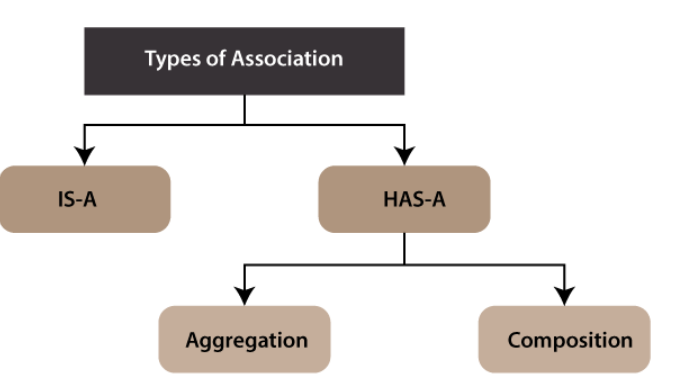

- Types of Association
    - **IS-A Relationship (Inheritance)**:
        - This represents an inheritance relationship where one class is a subtype of another class. It is also known as inheritance. It uses the extends keyword in Java.
    - **HAS-A Relationship**:
        - This represents a relationship where one class "has" another class as a member or part of itself.
        - The HAS-A Association is further classified into two parts, i.e., Aggregation and Composition

##### Aggregation (HAS-A Weak Relationship)

- A weaker relationship where one object is associated with another, but they can exist independently. 
- Lets take an analogy, an university can have multiple departments. Even if the university is shut down, the departments (like a Math Department) can still exist independently. The part (department) can exist independently of the whole (university). If the university is destroyed, the department may still function elsewhere.

```
// Aggregration
class Department {
    private String name;

    public Department(String name) {
        this.name = name;
    }

    public String getDepartmentName() {
        return name;
    }
}

class University {
    static Department departments[] = new Department[5];
    static int counts=0;

    public void addDepartment(Department dept) {
        departments[counts]=dept;
        counts++;
    }

    public void displayDepartments() {
        for (int i=0;i<counts;i++) {
            System.out.println("Department: " + departments[i].getDepartmentName());
        }
    }
}

public class AboutAssociation{

    public static void main(String args[]){
        //Aggregration
        Department math=new Department("Maths");
        Department science=new Department("Science");
        University uni = new University();
        uni.addDepartment(math);
        uni.addDepartment(science);
        uni.displayDepartments();
    }
}


Output:
Department: Maths
Department: Science
```

##### Composition (HAS-A Strong Relationship)

- A strong relationship where one object is a part of another object, and the part cannot exist without the whole.
- Lets take an analogy, a Car has an Engine. Without an engine, a car can't work, so the car is strongly dependent on the engine.

```


//Composition
class Engine {
    void start() {
        System.out.println("Engine is starting...");
    }
}

class Car {
    private Engine engine;

    public Car() {
        engine = new Engine();  // Engine is created inside Car
    }

    public void startCar() {
        engine.start();
    }
}

public class AboutAssociation{
    public static void main(String args[]){
        //Composition
        Car car = new Car();
        car.startCar();
    }
}

Output:
Engine is starting...
```

- So **Composition** makes your tightly coupled whereas **Aggregation** makes your code loosely coupled.

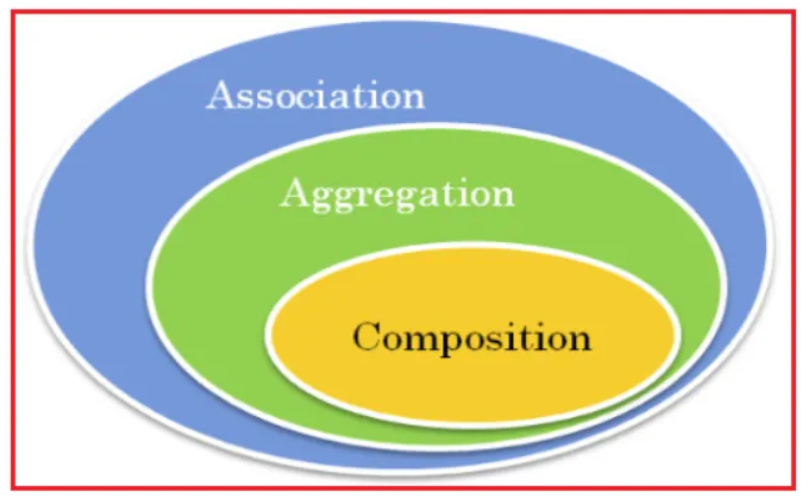


| **Aspect** | **Composition**                                            | **Aggregation**                                                 |
|------------|------------------------------------------------------------|-----------------------------------------------------------------|
| Dependency | Strong: Part cannot exist without whole.                   | Weak: Part can exist without whole.                             |
| Example    | A Car has an Engine (strong relationship).                 | A University has Departments (weak relationship).               |
| Life cycle | When the whole is destroyed, the parts are also destroyed. | When the whole is destroyed, the parts can exist independently. |


### Why Association is Required ?
- It models real-world relationships between objects in a program.
- Helps in designing flexible and reusable code, allowing objects to collaborate without a strict hierarchy.

### Advantages:
- Flexibility: Objects are loosely coupled, meaning they can interact without being tightly bound, making the code easier to modify.
- Reusability: Objects can be reused in different contexts since the relationships are not tightly bound.

### Disadvantages:
- Complexity: Managing relationships between many objects can make the code more complex.
- Loose Coupling: While beneficial in many cases, loose coupling can sometimes make it harder to track how objects interact.


## Super & This method

- Lets say you have 2 class X & Y. Each class has their own constructor.

```
class X{
    X(){
        System.out.println("Default Constructor of X");
    }
}

class Y{
    Y(){
        System.out.println("Default Constructor of Y");
    }
}

public class AboutSuperAndThis {
    public static void main(String[] args) {
        Y y= new Y();
        
    }
}

Output:
Default Constructor of Y
```

- Here we can see when we created the object of **Y** class, by default the construct method got called. Lets say Y extends X.
- Lets run the program again and see the output.

```
class X{
    X(){
        System.out.println("Default Constructor of X");
    }
}

class Y extends X{
    Y(){
        System.out.println("Default Constructor of Y");
    }
}

public class AboutSuperAndThis {
    public static void main(String[] args) {
        Y y= new Y();

    }
}


Output:
Default Constructor of X
Default Constructor of Y
```

- Thats strange right? , **when you create an object of a subclass, the constructor of the superclass is automatically called**.
- Behind the scene the method `super()` does these thing.

```
class X{
    X(){
        System.out.println("Default Constructor of X");
    }
}

class Y extends X{
    Y(){
        super();
        System.out.println("Default Constructor of Y");
    }
}
```

- Lets say you have a method `show()` inside your class X. You wanted to call this `show()` method in your `display()` method of your class Y.

```
class X{
    X(){
        System.out.println("Default Constructor of X");
    }

    public void show(){
        System.out.println("Class X show method");
    }
}

class Y extends X{
    Y(){
        super();
        System.out.println("Default Constructor of Y");
    }

    public void display(){
        super.show();
        System.out.println("Class Y Display method");
    }
}

public class AboutSuperAndThis {
    public static void main(String[] args) {
        Y y= new Y();
        y.display();
    }
}


Output:
Default Constructor of X
Default Constructor of Y
Class X show method
Class Y Display method
```

- As the same `super` suggest , it calls methods or variable of **Super**class.

### Why Super is required?

- **Why super() calls parent constructor?** : In a subclass, the super keyword is used to explicitly call the constructor of its parent class. This is important to ensure that the parent class is properly initialized before the subclass adds its specific initialization. Inheritance means that a subclass inherits properties and behavior from a parent class. To ensure the integrity of this hierarchy, the parent class constructor needs to run to set up its part of the object within subclass constructor.
- **Accessing Parent Class Methods and Fields**: If the child class has overridden a method of the parent class, you can use super to call the parent class's version of the method.
- **Avoiding Shadowing**: If a subclass defines a field with the same name as a field in the superclass, super can be used to access the superclass's field.

- Lets create parameterize constructor in X and Y class.

```
class X{
    X(){
        System.out.println("Default Constructor of X");
    }

    X(int i){
        System.out.println("Parameterized constructor of X");
    }
    public void show(){
        System.out.println("Class X show method");
    }

    public void test(){
        System.out.println("Class X test method");
    }
}

class Y extends X{
    Y(){
        super();
        System.out.println("Default Constructor of Y");
    }
    Y(int i){
        System.out.println("Parameterized constructor of Y");
    }
    public void display(){
        super.show();
        System.out.println("Class Y Display method");
    }

    public void test(){ // Method Overriding
        System.out.println("Class Y test method");
    }
}

public class AboutSuperAndThis {
    public static void main(String[] args) {

        /**
         * Calling Y parameterized constructor
         */
        Y y1=new Y(5);

    }
}


Output:
Default Constructor of X
Parameterized constructor of Y
```

- If you see ,X default constructor is called and Y parameterize constructor is called. How will you call X parameterizec constructor? simple just pass int value into the `super` .

```
class X{
    X(){
        System.out.println("Default Constructor of X");
    }

    X(int i){
        System.out.println("Parameterized constructor of X");
    }
    public void show(){
        System.out.println("Class X show method");
    }

    public void test(){
        System.out.println("Class X test method");
    }
}

class Y extends X{
    Y(){
        super();
        System.out.println("Default Constructor of Y");
    }
    Y(int i){
        super(i); // Calling parameterized constructor of X
        System.out.println("Parameterized constructor of Y");
    }
    public void display(){
        super.show();
        System.out.println("Class Y Display method");
    }

    public void test(){ // Method Overriding
        System.out.println("Class Y test method");
    }
}

public class AboutSuperAndThis {
    public static void main(String[] args) {

        /**
         * Calling Y parameterized constructor
         */
        Y y1=new Y(5);

    }
}


Output:
Parameterized constructor of X
Parameterized constructor of Y
```

- Now lets use `this()` keyword

```
class X{
    X(){
        System.out.println("Default Constructor of X");
    }

    X(int i){
        System.out.println("Parameterized constructor of X");
    }
    public void show(){
        System.out.println("Class X show method");
    }

    public void test(){
        System.out.println("Class X test method");
    }
}

class Y extends X{
    Y(){
        super();
        System.out.println("Default Constructor of Y");
    }
    Y(int i){
        super(i);
        System.out.println("Parameterized constructor of Y");
    }
    Y(double d){
        this();
        System.out.println("Parameterized double constructor of Y");
    }
    public void display(){
        super.show();
        System.out.println("Class Y Display method");
    }

    public void test(){ // Method Overriding
        System.out.println("Class Y test method");
    }
}

public class AboutSuperAndThis {
    public static void main(String[] args) {

        /**
         * Calling Y parameterized double constructor
         */
        Y y2=new Y(5.1);

    }
}

Output:
Default Constructor of Y
Parameterized double constructor of Y
```

- `this()` keywords call the constructor of subclass . `this` keyword in Java are used in object-oriented programming to refer to the current object (this object) respectively.
- The `this` keyword refers to the current object — the instance of the class in which it appears.
- It is often used to distinguish between instance variables and parameters or to call other constructors within the same class.
- Just like `super`, `this` access current class methods and variables it must be always the **first statement** within the constructor.
- What happens if we write both? , if both `super()` and `this()` need to be the first statement, then only one of them can actually be the first statement in any given constructor. It is not possible to have two first statements, so you cannot use both super() and this() simultaneously in a single constructor.

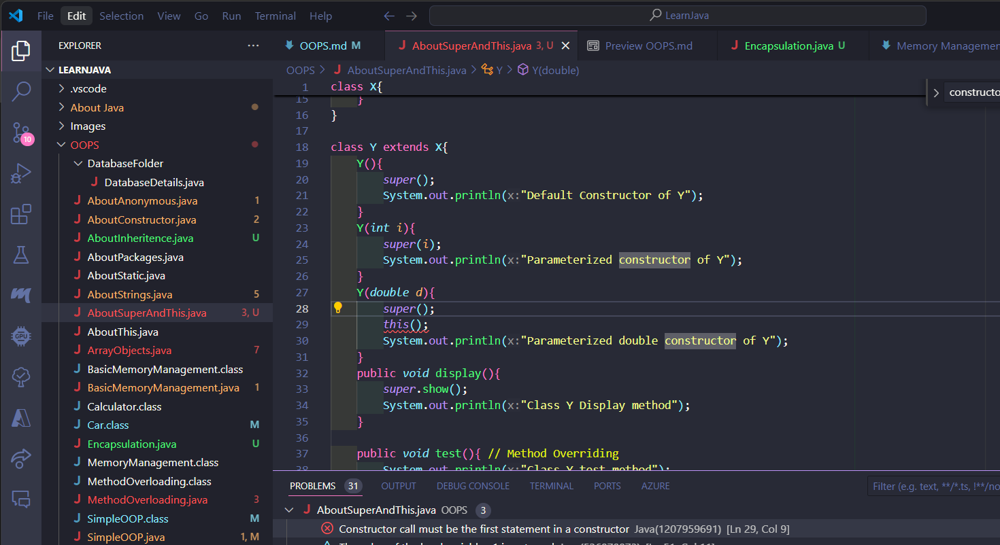

## Polymorphism

- "**poly**" meaning "**many**" and "**morph**" meaning "**forms**" or **behavior**. Thus, polymorphism means "many forms" or "many behavior".
- Lets take a real life example, a human we have different behaviors for a situation, like in office we would have a boss/employee behavior , when human are with friends we have a different behavior, when human is at home , it would have a different behavior.
- So here human is polymorphic. Similarly in java when we create a object or a reference variable, it will have certain behavior. When we say certain behavior it means **methods**.
- Lets take an example of method overloading

```
class Calculator{

    public int add(int n1,int n2){

        /**
         * Method add returns the sum of n1+n2
         */
        return n1+n2;
    }

    /**
     * Method Overloading by parameters
     */
    public int add(int n1, int n2, int n3){
        return n1+n2+n3;
    }

    /**
     * Method Overloading by type
     */
    public double add(double n1,double n2){
        return n1+n2;
    }
}

public class MethodOverloading {
    
    public static void main(String[] args) {
        
        Calculator twoNums=new Calculator();
        /**
         * Passing 4 and 5 required arguments for method "add"
         */
        System.out.println("Addition of 5 and 4 is "+twoNums.add(4, 5));
        System.out.println("Addition of 5,4 and 6 is "+twoNums.add(5, 4,6));
        System.out.println("Addition of 5.5 and 4.5 is "+twoNums.add(4.5, 5.5));

    }
}

Addition of 5 and 4 is 9
Addition of 5,4 and 6 is 15
Addition of 5.5 and 4.5 is 10.0
```

- Here when you call the `add` method, depending the number of arguments or parameters the appropriate add method will be called during compilation. So there are 3 different behaviors of `add` but we know which method will be executed based on parameter. This is called **Compile-time Polymorphism or Static Polymorphism**.
- Lets take an example of method overriding.

```
// Superclass
class Animal {
    public void makeSound() {
        System.out.println("Animal makes a sound");
    }
}

// Subclass 1
class Dog extends Animal {
    @Override
    public void makeSound() {
        System.out.println("Dog barks");
    }
}

// Subclass 2
class Cat extends Animal {
    @Override
    public void makeSound() {
        System.out.println("Cat meows");
    }
}

public class Main {
    public static void main(String[] args) {
        Animal myAnimal; // Reference of type Animal
        
        myAnimal = new Dog(); // Animal reference but Dog object
        myAnimal.makeSound(); // Output: Dog barks
        
        myAnimal = new Cat(); // Animal reference but Cat object
        myAnimal.makeSound(); // Output: Cat meows
    }
}
```

- Here the method `makeSound` behavior is not decided during the compilation, because it depends on the object being called which is created during run-time. Example during compilation the `new Dog()` object is not created but when the program is execute, basically in the run-time the object is created. Thus depending on the object creation during run-time we will be able to determine the behavior of `makeSound()` method. This is called **Runtime Polymorphism or Dynamic Polymorphism Or Dynamic Method Dispatch**.
- In the above example of `Animal` class, we did not created reference variable of `Dog` class or `Cat` class we created reference variable of its parent which is `Animal` class. **You use a reference variable of a superclass to refer to an object of a subclass**. For example, you can have a reference of type `Animal` pointing to an object of type `Dog`.
- This behavior is called **Dynamic Method Dispatch**.
- Dynamic method dispatch (also called **runtime polymorphism**) occurs when a method is called on a reference of a superclass (or interface), but the actual method that gets executed is the one in the object of the subclass at runtime.
- Lets see the backend memory management for it.

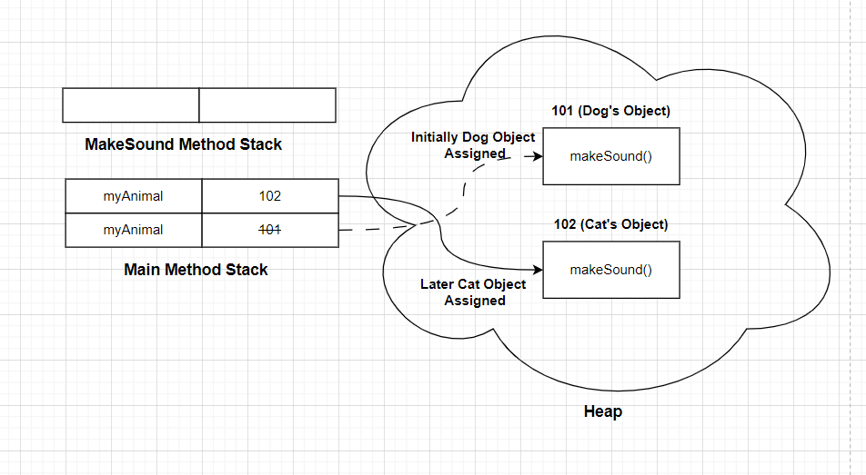

- Also one thing if you observer , we are using the same reference variable of Animal for Cat's object creation. This makes your code **loosely coupled** , so lets say in future you will create another subclass name `Cow` which extends Animal, using the same reference variable you can create object of Cow thus making your code **loosely coupled**.
- If you have created individual reference variable for each class it would ended up taking space in heap and also made your application **tightly coupled** means for a new subclass like `Cow` you need to create a new reference variable.

### There are two types of polymorphism in Java:

1. **Compile-time Polymorphism (Static Polymorphism)**: This is also known as method overloading. It occurs when multiple methods have the same name with different parameters (different type or number of parameters) within the same class.

2. **Runtime Polymorphism (Dynamic Polymorphism)**: This is achieved through method overriding, where a subclass provides a specific implementation of a method that is already defined in its superclass. The method to be executed is determined at runtime based on the object's type.

### Why Polymorphism required?

1. **Flexibility and Extensibility**: Polymorphism allows a single reference variable to represent different underlying data types. This means you can write more flexible and reusable code. For instance, a method that takes an **Animal** object can accept any subclass of **Animal** like Dog, Cat, etc., allowing you to extend and modify your code with new subclasses without changing the existing code.
2. **Code Reusability**: It promotes code reusability. You can write code that works on the superclass level, and this code can handle all subclasses equally, allowing you to reuse the same code for different types of objects.
3. **Ease of Maintenance**: Polymorphism makes it easier to manage and maintain code. Since you can use a single reference variable for multiple methods, any change you make in a superclass method will automatically apply to all subclasses, reducing redundancy and improving maintainability.

## Access Modifiers

- Uptil now we have majorly used **public** , so what is this **public**?, it is an type of access assigned to methods or variables.
- Access modifiers in Java are keywords used to set the access level (visibility) of classes, methods, and other members. They control who can access or modify the code, thereby providing a mechanism for encapsulation and security in Java applications.

### Types of Access Modifiers in Java
- Java provides four types of access modifiers:

1. **public**
    - **Access Level**: Visible everywhere. The member (class, method, or variable) can be accessed from any other class in any package.
    - **Usage**: Used when you want to make a method, variable, or class universally accessible.

2. **private**
    - **Access Level**: Visible only within the same class. Private instance variable can be access via methods using reference variable but private methods cannot be access via reference variable.
    - **Usage**: Used to restrict access to sensitive data or methods that should not be exposed outside the class.

    
    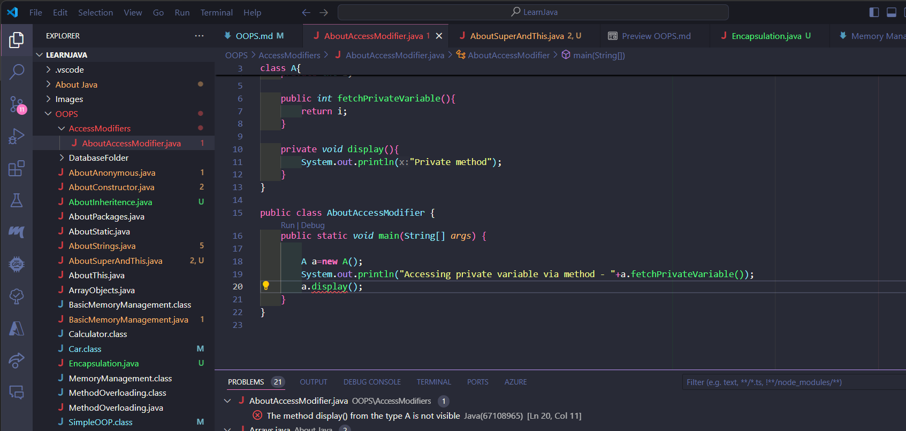
    
    
    - Private methods can be accessible within the same method of that class.

```
package AccessModifiers;

class A{
    private int i;

    public int fetchPrivateVariable(){
        display();
        return i;
    }

    private void display(){
        System.out.println("Private method");
    }
}

public class AboutAccessModifier {
    public static void main(String[] args) {
        
        A a=new A();
        System.out.println("Accessing private variable via method - "+a.fetchPrivateVariable());
    }
}


Output:
Private method
Accessing private variable via method - 0
```

3. **protected**
    - **Access Level**: Visible within the same package and subclasses (even if they are in different packages).
    - **Usage**: Typically used in inheritance scenarios where you want to give access to subclasses but keep it hidden from other classes.

```
Protected method in AboutAccessModified.java

package AccessModifiers;

class A{
    private int i;

    public int fetchPrivateVariable(){
        display();
        return i;
    }

    private void display(){
        System.out.println("Private method");
    }
}

class B{
    protected int i;

    protected void show(){
        System.out.println("Protected method show of B");
    }
}

public class AboutAccessModifier {
    public static void main(String[] args) {
        
        A a=new A();
        System.out.println("Accessing private variable via method - "+a.fetchPrivateVariable());

        B b= new B();
        b.show();

    }
}


Output:
Private method
Accessing private variable via method - 0
Protected method show of B

Inherit class B into class C thus accessing protected methods or variables

package AccessModifiers;

class C extends B{

}

public class OtherClass {
    public static void main(String[] args) {
        C c = new C();
        c.show();
    }
}


Output:
Protected method show of B
```

4. **Default (package-private)**
    - **Access Level**: Visible only within the same package. This is the default access level when no access modifier is specified.
    - **Usage**: Used when you want to restrict access to within the same package but do not want to make it protected.

```
class MyClass { // Accessible only within the same package
    int packagePrivateNumber; // Default access modifier

    void displayPackagePrivate() {
        System.out.println("Default (package-private) method");
    }
}
```

#### Summary of types of access modifiers

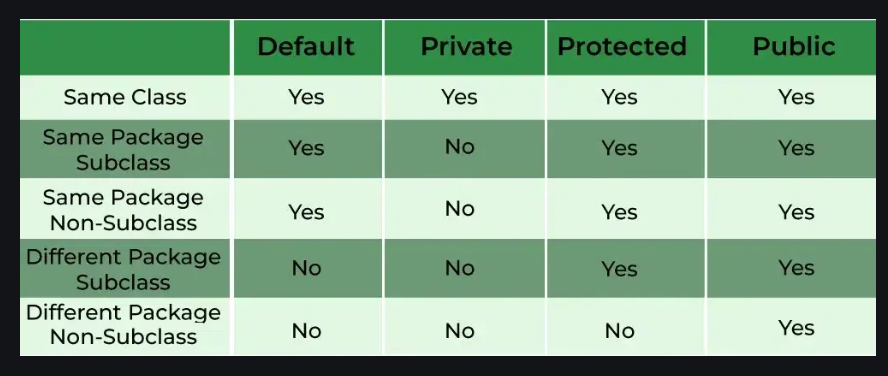


- Can we apply these access modifiers on a **class**, uptil now we have applied this on class members like instance variable and methods. What if we apply access modifiers on a **class**.
- **private** and **protected** cannot be applied on a class. Java will give your compilation error `Illegal modifier for the class B; only public, abstract & final are permittedJava`.
- **public** and **default** can be applied, if **public** is not specified implicitly then **default** becomes the access modifier of a class.

## Encapsulation

- Let say if a stranger ask you about personal information like name, age etc.. would you share the details? now it depends like if you are taking a loan the bank manager requires your details to sanction you loan. Your personal information must not be share until and unless it is require. Your personal information data is encapsulated in your brain.
- Similarly in terms of java, no one must have access of your instance variable of class directly, if any other program needs your instance variable they must ask or they must get the access via method.

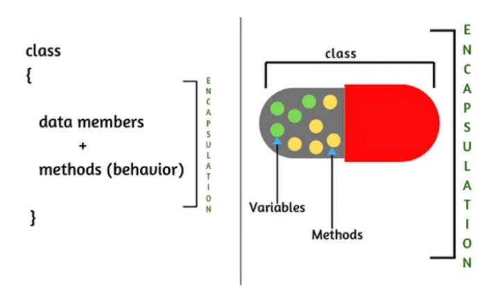

- Encapsulation is the mechanism of wrapping the data (variables) and code (methods) that operates on the data into a single unit called a class. It restricts direct access to some of an object's components and prevents the accidental modification of data.
- In simple terms, encapsulation is about bundling the data (attributes) and methods (functions) that operate on the data into a single unit (class), and controlling the access to the data to ensure the integrity of the object's state.
- So then how to restrict your data access? , by making your instance variable **private**.

```

class Information{
     int age;
     String name;


}

public class Encapsulation{
    public static void main(String[] args) {
        Information inf=new Information();
        inf.age=20;
        inf.name="Harsh";
        System.out.println(inf.name+" ,"+inf.age);
    }
}

Output:
Harsh ,20
```

- The above method is not encapsulated, we are still able to access instance variables. Lets make those **private**.

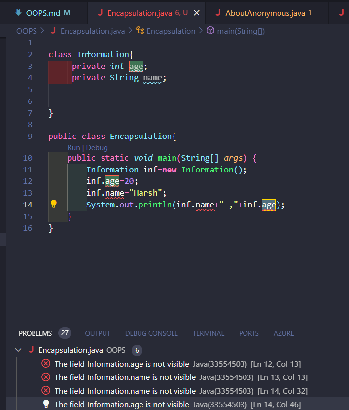

- The moment we make those variable private, the variables are not visible or accessible to other class directly. Lets create a method to make it access indirectly.

```

class Information{
     private int age;
     private String name;

     public void assignAge(int age){
        this.age=age;
     }
     public void assignName(String name){
        this.name=name;
     }
     public int fetchAge(){
        return age;
     }
     public String fetchName(){
        return name;
     }

}

public class Encapsulation{
    public static void main(String[] args) {
        Information inf=new Information();
        inf.assignAge(20);
        inf.assignName("Harsh");
        System.out.println(inf.fetchName()+", "+inf.fetchAge());
    }
}

Output:
Harsh, 20
```

- Encapsulation in Java refers to integrating data (variables) and code (methods) into a single unit. In encapsulation, a class's variables are hidden from other classes and can only be accessed by the methods of the class in which they are found.
- In simpler terms, encapsulation is the practice of hiding internal data and functionality of an object from external entities.
- In Java, encapsulation is implemented through access modifiers such as private, public, and protected, which control the visibility of class members such as fields and methods. Private members can only be accessed within the same class, whereas public members can be accessed anywhere in the program. Protected members can be accessed within the same class, subclasses, and classes in the same package.

### Getters and Setters

- In developers community, to fetch a variable your must should be `getVarname` and while assign a value to a variable your method should be `setVarname`.

```
public class Person {
  private String name; // private = restricted access

  // Getter
  public String getName() {
    return name;
  }

  // Setter
  public void setName(String newName) {
    this.name = newName;
  }
}
```

>[!NOTE]
> - This is a standard practice followed in industries however you can have your own name for getters and setters.

## Final

- Lets say you have a variable in your program

```
public class AboutFinal {
    public static void main(String[] args) {
        int i=1;
        i=2;
        System.out.println("i value : "+i);
    }
}
```

- Lets apply **final** keyword on that variable.

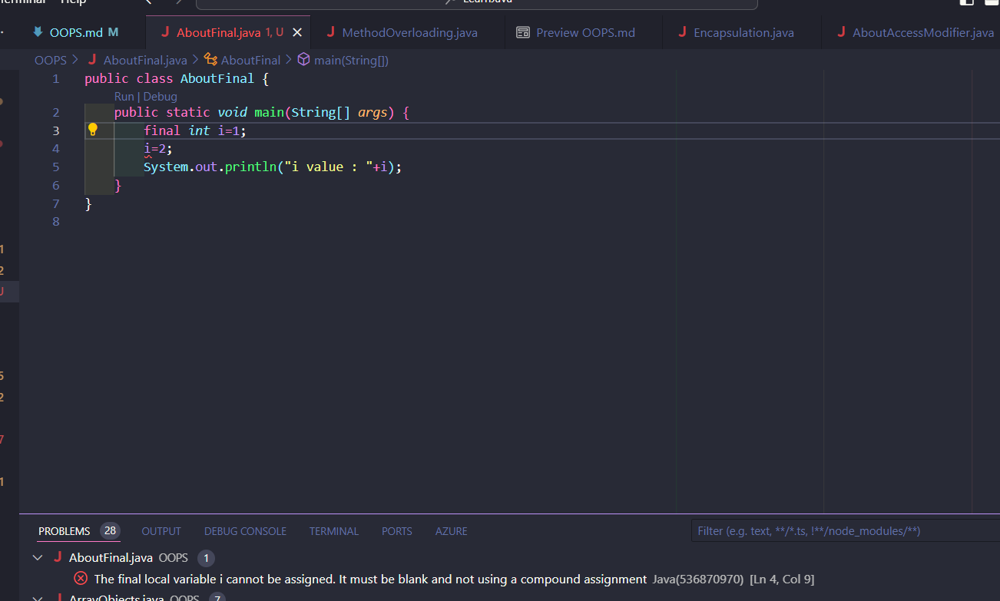

- We get an error which says, `final variable i cannot be assigned`. When a variable is declared as final, its value cannot be changed once it is initialized. This effectively makes the variable a constant like `final double PIE=3.14`.

```
        final int j;
        j=1;
```

- Here we declare a blank variable and then assigned the value to it which works fine.
- What if , we apply final keyword on a **class**?

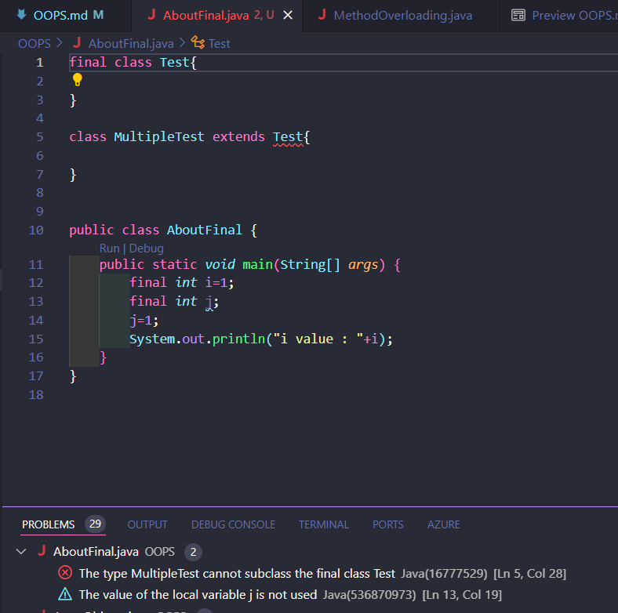

- It seems java is stopping us to inherit the class. When a class is declared as final, it cannot be subclassed. This is useful when you want to prevent the inheritance of a class.

- What if we apply that on a method? , it will prevent method overriding if the method belongs is a subclass whos parent class as final method.


- When a method is declared as final, it cannot be overridden by subclasses. This is useful when you want to prevent a method from being modified or altered in any subclass.

### Why final is required?

- Lets say you are making a community based program for which you don't want anyone to modified your variables, method or class implementations, you can use the **final** keyword.
- **Data Integrity and Consistency**: Using final helps in maintaining data integrity by preventing changes to critical variables or constants.
- **Preventing Unwanted Overriding**: It ensures that certain methods or classes remain unchanged and consistent, which is important for the correct functioning of libraries and frameworks.
- **Security**: Helps in securing sensitive parts of the code by preventing inheritance and modification.
- **Optimization**: In some cases, the JVM can optimize the performance of final methods and variables since it knows they won't change or be overridden.

## Object Class

- **By default every class extends Object class**.
- So here we create a class , behind the scene for any class java extends object class `extends Object`.

```
class My extends Object{

}

public class ObjectClass{
    public static void main(String[] args) {
        My my=new My();
        System.out.println(my.toString());
    }
}

Output:
My@2f92e0f4
```

- If you see class **My** does not consist of any method, but there are default in-build method associated with reference variable **my**. This in-build method are inherited from the object class.

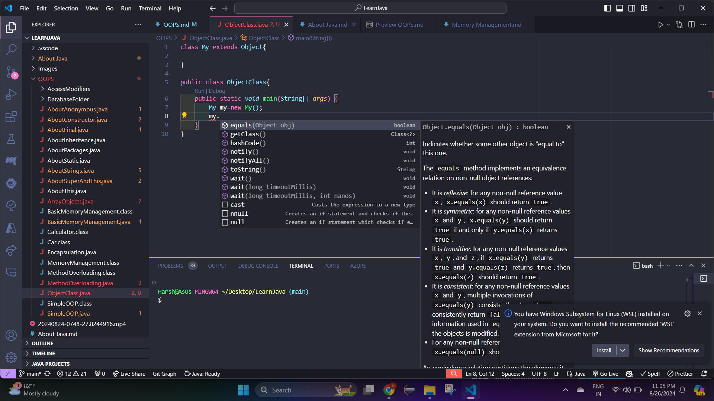

- Object class method (`Ctrl+Shift+O`)

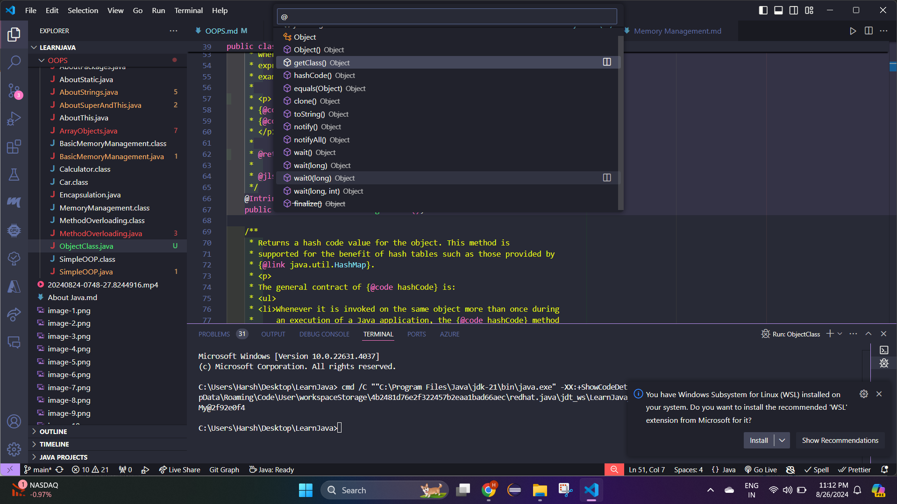

## Upcasting & Downcasting

- Lets take an example 

```
class Animal{

    public void makeSound(){
        System.out.println("Animal makes a sound");
    }
}

class Dog extends Animal {

    public void makeSound() {
        System.out.println("Dog barks");
    }
}

public class UpcastingDownCasting {
    public static void main(String[] args) {

        /**
         * Upcasting
         */
        Animal a = (Animal) new Dog();
        a.makeSound();

        /**
         * Downcasting
         */
        Animal a1 = new Dog();
        Dog dog = (Dog) a1;
        dog.makeSound();
    }
}

Output:
Dog barks
Dog barks
```

- Upcasting and downcasting are related to inheritance and type conversion between parent and child classes.
- Upcasting is when a subclass (child class) reference is automatically or explicitly converted to a superclass (parent class) reference.
- Downcasting is the opposite of upcasting. It converts a superclass reference back to a subclass reference.
- When you upcast a Dog object to an Animal reference, the actual object in memory is still a Dog. This is why, when you call the `makeSound()` method on the Animal reference a, the Dog class's overridden `makeSound()` method is executed instead of the Animal class's method.
- Other way

```
        Animal myAnimal = new Dog(); // Upcasting
        myAnimal.makeSound(); // Output: Dog barks
```

- Dynamic method dispatch is a upcasting.

### Key Points to Remember

- Upcasting is always safe and doesn't require explicit casting because every subclass is an instance of its parent class.
- Downcasting requires explicit casting and is potentially unsafe because not all parent class instances are instances of a specific subclass.
- Use upcasting when you want to treat different subclass objects uniformly as instances of their parent class.
- Use downcasting only when you are sure about the actual object type and need to access subclass-specific methods.

## Naming Convention

- Whenever you write a code , a good practice while creating class , methods or variable are:
    - Class & Interface : Should be in Camel Case e.g class MyCalculator
    - Variables & Methods : Should be in lower case e.g marks(), show()
    - Constants : Should be in upper case e.g PIE, EPSON
- This provides readability.

## Wrapper Classes

- **Java is not purely Object-Oriented because it uses primitive data types to optimize performance. Primitive types are not objects; they are simple data types that represent single values and are stored directly in memory. Primitive data types are stored on the stack (for local variables) or directly in the memory locations of objects (for instance variables), allowing faster access and processing. Primitives are accessed directly by their memory address, without the need for dereferencing. This is faster than accessing object references, which involves additional indirection. Operations on primitives are significantly faster than operations on objects because there is no need for additional memory lookups or method invocations. Arithmetic operations on primitives `(+, -, *, /, etc.)` are performed directly on CPU registers or simple memory addresses, making them much quicker than operations on objects.**

### What is Wrapper Classes?

- Wrapper classes in Java provide a way to use primitive data types (int, char, boolean, etc.) as objects. Each primitive type has a corresponding wrapper class in the `java.lang` package:

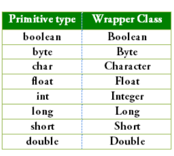

- Lets understand via simple example.

```
public class WrapperClasses {
    public static void main(String[] args) {
        
        // Primitive Data type
        int i=1;

        // Wrapper class for data type int
        /**
         * j is a reference variable of new object Integer
         */
        Integer j= new Integer(10);

        System.out.println(i+j);


    }
}

Output:
11
```

- So here `Integer` is a class where as `int` is a primitive data type. So `i` is a just a simple variable but `j` is a reference variable. If we click on `Integer` it will show the internal implements which is similar like object and classes.

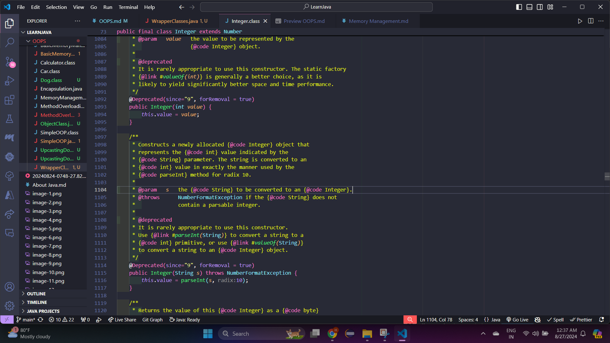

- Another way to implement these wrapper class and assign value is 

```
Integer wi=10; // Same as Integer wi= new Integer(10);
```

- Just like `Integer` we can use other wrapper classes.

```
public class WrapperClasses {
    public static void main(String[] args) {
        
        // Primitive Data type
        int i=1;

        // Wrapper class for data type int
        /**
         * j is a reference variable of new object Integer
         */
        Integer j= new Integer(10);

        System.out.println(i+j);

        Integer wi=10;


        float pf=1.5f;
        Float wf= 1.5f;
        System.out.println(pf+wf);

        long pl=10l;
        Long wl=20l;

        System.out.println(pl+wl);

        double pd= 10.20;
        Double wd=20.10;
        System.out.println(pd+wd);
    }
}


Output:
11
3.0
30
30.3
```

- Wrapper classes wrap primitive data type value into a class object. It is this wrapper class that helps to make Java object-oriented.

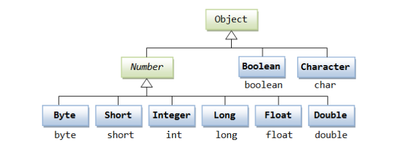

#### Autoboxing & Unboxing

- Now since wrapper classes are objects, it will have some methods? right? so in those method can we pass primitive variables? lets try

```
        /**
         * Autoboxing
         */

         int pAuto=10;
         Integer wAuto=pAuto;
         System.out.println(wAuto);

Output:
10
```

- **Autoboxing** is a procedure of converting a primitive value into an object of the corresponding wrapper class. For example, converting int to Integer class or double to Double, etc.. The Java compiler applies autoboxing when a primitive value is:
    - Passed as a parameter to a method that expects an object of the corresponding wrapper class.
    - Assigned to a variable of the corresponding wrapper class.

```
1. Passing a Primitive to a Method that Expects a Wrapper Class Object

List<Double> doubleList = new ArrayList<>(); // List of Double objects // Collections
double primitiveDouble = 15.5; // Primitive type

doubleList.add(primitiveDouble); // Autoboxing occurs here

- The ArrayList doubleList is defined to store Double objects (the wrapper class for double).
- When we pass primitiveDouble (a double primitive) to the add() method, the Java compiler automatically converts primitiveDouble from double to Double. This is autoboxing in action.

2. Assigning a Primitive to a Wrapper Class Variable:

Integer intObject; // Wrapper class variable
int primitiveInt = 10; // Primitive type

intObject = primitiveInt; // Autoboxing occurs here

```

```

         /**
          * Unboxing
          */
          Integer a=3;
          int var1=a.intValue(); // Unboxing // Explicit specify the conversion or unboxing.
          int var2=a; // Auto-unboxing // Compiler automatically unbox from Wrapper to primitive

Output:
9
```

- The automatic conversion of wrapper type into its corresponding primitive type is known as unboxing. It is the reverse process of autoboxing. Unboxing on the other hand refers to converting an object of a wrapper type to its corresponding primitive value. For example conversion of Integer to int. The Java compiler applies to unbox when an object of a wrapper class is: 
    - Passed as a parameter to a method that expects a value of the corresponding primitive type.
    - Assigned to a variable of the corresponding primitive type.

```
1. Passing a Wrapper Class Object to a Method that Expects a Primitive Type:

List<Double> doubleList = new ArrayList<>();
doubleList.add(15.5); // Autoboxing: primitive double to Double

double primitiveDouble = doubleList.get(0); //unboxing

- The ArrayList doubleList is defined to store Double objects (wrapper class for double). When we retrieve an element from doubleList using list.get(0), it returns a Double object.
- However, when passing this object to a method getFirstElement that expects a primitive double, unboxing automatically converts the Double object to its primitive double form.

2. Assigning a Wrapper Class Object to a Primitive Type Variable:

Integer intObject = 10; // Autoboxing: int to Integer
int primitiveInt = intObject; // Unboxing: Integer to int

```

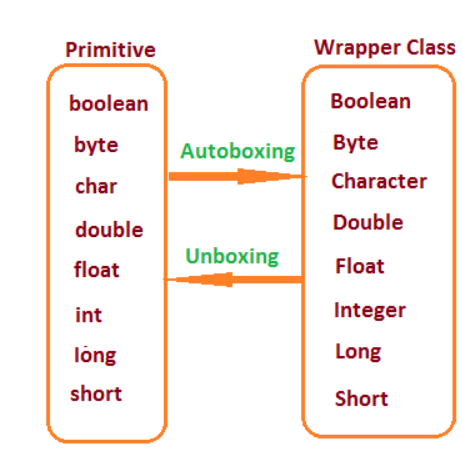

### Why Wrapper Class is Invented?

- Now the question arise why wrapper class is actually invented when we have primitive data types?
- Java is an object-oriented language, and many of its features are designed around objects. Primitive data types (such as int, char, etc.) are not objects; they are simple data containers.

<details>
<summary>Memory management for primitive data types</summary>

1. **Optimization**:
    - Primitives require less memory compared to their corresponding wrapper classes because they do not have the overhead associated with objects, such as object headers or metadata.
    - For example, an int variable occupies 4 bytes of memory, while an Integer object may occupy significantly more due to the overhead of the object itself (headers, metadata, and alignment padding).
2. **Faster Access and Processing**
    - Primitive data types are stored on the stack (for local variables) or directly in the memory locations of objects (for instance variables), allowing faster access and processing:
    - Stack Storage: Local primitive variables are stored in the stack memory, which is much faster to allocate and access compared to heap memory (where objects are stored).
    - Direct Access: Primitives are accessed directly by their memory address, without the need for dereferencing. This is faster than accessing object references, which involves additional indirection.
    - Operations on primitives are significantly faster than operations on objects because there is no need for additional memory lookups or method invocations.
    - Arithmetic operations on primitives (+, -, *, /, etc.) are performed directly on CPU registers or simple memory addresses, making them much quicker than operations on objects.
3. **Lower Garbage Collection Overhead**
    - Since primitive data types are not objects, they do not need to be managed by the garbage collector. This reduces the overhead of garbage collection and memory management
    - Primitive variables do not involve object creation or destruction, so there are fewer allocations on the heap and less work for the garbage collector.
    - Primitives do not need to be garbage collected, which reduces the frequency and duration of garbage collection cycles.
    
</details>

- Wrapper classes (like Integer, Character, Double, etc.) allow primitives to be treated as objects, which enables their use in object-based APIs, collections, and other data structures that require objects (e.g., ArrayList, HashMap).
- **Java collections (like ArrayList, HashMap, HashSet, etc.) and the generics system only work with objects, not primitive types**. You cannot create a `List<int>`, but you can create a `List<Integer>`. ( We will later about collections and generics).

```
List<Integer> list = new ArrayList<>(); // Works because Integer is a class
list.add(10); // Autoboxing converts '10' (int) to 'Integer' object
```

- Wrapper classes provide utility methods to convert between primitive types and strings, parse strings into primitives, or perform numerical operations.

```
String numberString = "123";
int number = Integer.parseInt(numberString); // Parses the string into a primitive int
```

- Primitive types cannot hold a null value, but their corresponding wrapper classes can. This feature is useful when you want to indicate the absence of a value (e.g., in databases or collections where a value might be optional or missing).

```
Integer number = null; // Possible with Integer (wrapper class)
// int number = null; // Not possible with primitive int
```

- **Java automatically converts between primitives and their wrapper classes (autoboxing and unboxing) to make coding easier and more intuitive**. However, wrapper classes are still required because they offer capabilities that primitive types alone cannot provide, especially in contexts where objects are needed (like collections, generics, nullability, and utility methods).

- **Wrapper classes are final and immutable**. Lets see what does it means, when we say 

```
Integer x=10; 
x=11; // x reference variable is referring a new object.
```

- We can change the value if we look via code, but behind the scene a new object is created. `x` was initially pointing to 10. When a new Integer object is created with the value 11. The reference `x` is then updated to point to this new object. The original Integer object with the value 10 remains unchanged, but the reference `x` no longer points to it.

- Wrapper Final classes cannot be extended, which means no other class can inherit from them and potentially introduce mutability or other behavior changes. This preserves the intended immutability and simplicity of the wrapper classes. Making wrapper classes final also prevents subclasses from overriding methods in a way that could violate the expected contract of immutability, such as adding setters or other mutating methods.
-  In Java, the wrapper classes (Integer, Long, Boolean, etc.) provide a mechanism for caching commonly used objects within a certain range. When we create a new wrapper object for a primitive value within a certain range (e.g., Integer objects for values between -128 and 127), Java will reuse an existing object from an internal cache instead of creating a new one.

```
Integer a = 100; // Uses cached object
Integer b = 100; // Reuses cached object
System.out.println(a == b); // Output: true (same object)
```

## Abstract 

- Lets say you are building a AI , where the AI will solve any kind of problem but you don't know what ML & DL model it will require? but you sure know that ML & DL model are required for it ? so you just create an empty methods for ML and DL

```
class AI{
    public void MLModel(){

    }

    public void DLModel(){

    }

    public void AllProblems(){
        System.out.println("AI Solves All the problems but requires both ML and DL model");
    }
}
```

- In the AI developer community , developer will create a subclass and override these method, but as per code it does not implies that both ML & DL model are require, because when we create a subclass we can override both of these method or one of these , but to built AI it is compulsory to have both.

```
class AI{
    public void MLModel(){

    }

    public void DLModel(){

    }

    public void AllProblems(){
        System.out.println("AI Solves All the problems but requires both ML and DL model");
    }
}

class DeveloperCommunity extends AI{

    public void DLModel(){
        System.out.println("I think only DL Model will perfectly work for AI");
    }
}
```

- Lets define `abstract` keyword. **Whenever we declare a method as abstract , we need to specify that class also as abstract**.

```
abstract class AI{
    public abstract void MLModel();

    public abstract void DLModel();

    public void AllProblems(){
        System.out.println("AI Solves All the problems but requires both ML and DL model");
    }
}
```

- Now if anyone extends our parent class AI , they need to **mandatory** define logic for ML as well as DL model.

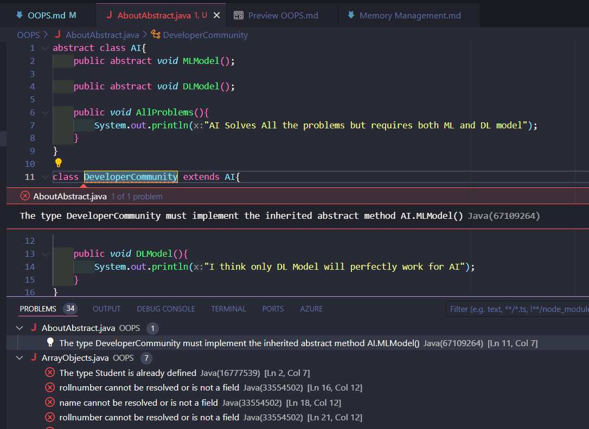


```
abstract class AI{
    public abstract void MLModel();

    public abstract void DLModel();

    public void AllProblems(){
        System.out.println("AI Solves All the problems but requires both ML and DL model");
    }
}

class DeveloperCommunity extends AI{

    @Override
    public void DLModel(){
        System.out.println("I think only DL Model will perfectly work for AI");
    }

    @Override
    public void MLModel() {
        // TODO Auto-generated method stub
        throw new UnsupportedOperationException("Unimplemented method 'MLModel'");
    }
}
```

- **Abstract** serves as a blueprint for other classes. It can have abstract methods (methods without a body) and concrete methods (methods with a body).
- **Whenever a method is declared abstract, we need to make the class also as abstract. But astract class may or may not have abstract methods or may or may not have concrete methods**.
- An abstract class may or may not have instance variables
- An abstract method is a method that does not have a body; it only has a method signature (name, return type, parameters) followed by a semicolon. Abstract methods must be implemented (i.e., given a body) by subclasses (non-abstract classes that extend the abstract class).
- Can we try to create object of abstract class? lets try

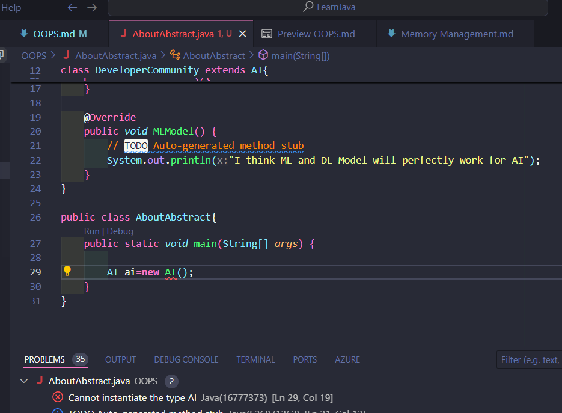

- **An abstract class is a class that cannot be instantiated directly. This means you cannot create an object of an abstract class.**
- But we can create object of subclass 

```
abstract class AI{

    public abstract void MLModel();

    public abstract void DLModel();

    public void AllProblems(){
        System.out.println("AI Solves All the problems but requires both ML and DL model");
    }
}

class DeveloperCommunity extends AI{

    @Override
    public void DLModel(){
        System.out.println("I think only DL Model will perfectly work for AI");
    }

    @Override
    public void MLModel() {
        // TODO Auto-generated method stub
        System.out.println("I think ML and DL Model will perfectly work for AI");
    }
}

public class AboutAbstract{
    public static void main(String[] args) {
        
        AI ai=new DeveloperCommunity(); // Dynamic method dispatch
        ai.DLModel();
    }
}

Output:
I think only DL Model will perfectly work for AI
```

### Why is Abstract Required?

- An abstract method is a way to enforce that a method must be implemented by any subclass. If you simply declared a method as empty (e.g., void myMethod() {}), the subclass could choose to ignore it or not provide its specific behavior. By declaring a method as abstract, you ensure that every subclass must provide its own implementation of that method. This creates a contract between the abstract class and its subclasses.
- Using abstract makes the design clearer. When you see an abstract method, you immediately understand that this method is meant to be overridden in subclasses and that each subclass will have its own specific implementation. If you just had an empty method, this intention wouldn't be as clear, making the code harder to understand and maintain.
- **Design Purpose**: Abstract classes are used to provide a common base or blueprint for subclasses. They allow you to define methods that must be created in any subclass, enforcing a contract of what the subclass should do.
- **Reuse Code**: They help in reusing code as they can have common functionality (concrete methods) that can be shared across multiple subclasses.
- **Flexibility**: You can create abstract methods in the abstract class that can be implemented in multiple ways by different subclasses.


- Lets say one of the developer builts AI only using ML model but that developer requires a plugin which is based on the future tech stack. So in that case your `DeveloperCommunity` also becomes a abstract class.

```
abstract class AI{

    public abstract void MLModel();

    public abstract void DLModel();

    public void AllProblems(){
        System.out.println("AI Solves All the problems but requires both ML and DL model");
    }
}

abstract class DeveloperCommunity extends AI{

    @Override
    public void DLModel(){
        System.out.println("I think only DL Model will perfectly work for AI");
    }

}

class futureMLModelPlugin extends DeveloperCommunity{

    @Override
    public void MLModel() {
        // TODO Auto-generated method stub
        System.out.println("Only ML plugin can built AI");
    }

    
}

public class AboutAbstract{
    public static void main(String[] args) {
        
        AI ai=new futureMLModelPlugin(); // Dynamic method dispatch
        ai.DLModel();
        ai.MLModel();
    }
}

Output:
I think only DL Model will perfectly work for AI
Only ML plugin can built AI
```

## Nested or Inner classes

- A nested class in Java is a class that is defined within another class.

```
class N1{
    int i;

    public void display(){
        System.out.println("In N1 class");
    }

    class N2{
        public void display(){
            System.out.println("In N2 class");
        }
    }
}


public class AboutNestedClass {
    public static void main(String[] args) {
        
        N1 n1 = new N1();
        n1.display();

        /**
         * Create reference variable for non-static nested class using outer class object
         */
        N1.N2 n2 = n1. new N2();
        n2.display();
    }
}

Output:
In N1 class
In N2 class
```

- To access the nested class, we need to have object of its outer class. This was an example of Non-static Nested Class (Inner Class).
- So basically for **Non-static nested class methods we require object of its outer class**.
- When we compile Nester class we get below type of class file


- The nested class is separated by `$`.
- Lets a static nested class example.

```
class N1{ // Non-Static class
    int i;

    public void display(){
        System.out.println("In N1 class");
    }

    class N2{
        public void display(){
            System.out.println("In N2 class");
        }
    }

    static class N3Static{
        public void display(){
            System.out.println("In N3Static");
        }
    }
}


public class AboutNestedClass {
    public static void main(String[] args) {
        
        N1 n1 = new N1();
        n1.display();

        /**
         * Create reference variable for non-static nested class using outer class object
         */
        N1.N2 n2 = n1. new N2();
        n2.display();

        /**
         * Create reference variable for static nested class using outer class object
         */
        N1.N3Static n3 = new N1.N3Static();
        n3.display();
    }
}


Output:
In N1 class
In N2 class
In N3Static
```

- **Outer class cannot be declare as static**.
- Nested classes can access private members of the outer class, which helps in encapsulating the outer class's data.

```
class OuterClass {
    private int outerValue = 10;

    // Static nested class
    static class StaticNestedClass {
        void display() {
            System.out.println("I am a static nested class");
        }
    }

    // Non-static nested class (Inner class)
    class InnerClass {
        void display() {
            System.out.println("I am an inner class. Outer value is " + outerValue);
        }
    }
}

public class Main {
    public static void main(String[] args) {
        // Creating an instance of StaticNestedClass
        OuterClass.StaticNestedClass staticNested = new OuterClass.StaticNestedClass();
        staticNested.display(); // Output: I am a static nested class

        // Creating an instance of InnerClass
        OuterClass outer = new OuterClass();
        OuterClass.InnerClass inner = outer.new InnerClass();
        inner.display(); // Output: I am an inner class. Outer value is 10
    }
}
```

### Why Nested Class?

- Consider a scenario where you need to use some class X within another class Y . The simplest way to do this is to create a top level class X and use it in class Y. That works but what if no other class needs X? X may not even have a significance of its own. X may have a meaning only in context of Y.
- For example, use nested classes when the nested class logically belongs to the outer class. For example, a Node class within a LinkedList class, where the node is tightly coupled with the structure of the list.
- If a class should not be visible to the outside world except to its containing class, make it a nested class.
- Grouping classes together that are only used together makes the code easier to maintain and understand.

### Anonymous Inner class

- Lets say you have a class 

```
class OnceTobeUsed{

    public void show(){
        System.out.println("In OnceTobeUsed");
    }
}
```

- Now some where in your requirement you wanna to override the method `show` of class `OnceTobeUsed`, you could have create a new class or you could create **Anonymous class**.

```

        /**
         * Anonymous Inner class
         */
        OnceTobeUsed utb = new OnceTobeUsed(){
            public void show(){
                System.out.println("Anonymous Class");
            }
        };

        //utb is reference variable of anonymous {...} inner class and not OnceTobeUsed
        utb.show();

Output:
Anonymous Class
```

- An anonymous inner class in Java is a type of inner class that does not have a name and is used to instantiate an object with certain **modifications** such as method overriding. It is typically used for creating an instance of a class with modifications for one-time use.
- **You can override methods of the superclass. You cannot add new methods in the anonymous inner class because it doesn't have a name that can be used to call the new methods directly.**

```
Runnable runnable = new Runnable() {
    @Override
    public void run() {
        System.out.println("Running...");
    }

    // This method is not accessible outside this block
    public void newMethod() {
        System.out.println("New method.");
    }
};

// You cannot call runnable.newMethod(); because it's not part of the Runnable interface
```

- If you attempt to define a new method inside the anonymous inner class, it won't be accessible directly because you cannot refer to the class by name (as it doesn’t have one).
- When we compile the class we get below class file

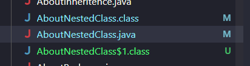

- If you see **1** indicates that an anonymous class, now if your have many such anonymous class then the value will increment like 2,3 etc..

### Abstract Anonymous Inner class

- What if your parent class is abstract class? 

```
abstract class AbstractOnceTobeUsed{
    abstract public void display();
}

psvm..
        /**
         * Here AbstractOnceTobeUsed is abstract class we cannot create object of it
         * but in the below code `new AbstractOnceTobeUsed(){...}` here we are creating object of anonymous inner class
         */
        AbstractOnceTobeUsed abc= new AbstractOnceTobeUsed() {
            public void display(){
                System.out.println("Abstract Anonymous Inner class");
            }
        };
        abc.display();

Output:
Abstract Anonymous Inner class
```

- Look below compile anonymous classes.


## Interface

- Lets say you have a class which consist of **abstract methods or variables only**.

```
abstract class AllTest{
    public abstract void test1();
    public abstract void test2();
    ..
    ..
    public abstract void test100();
}

```

- Suppose you need to create 100 test method , so every time you need to specify **public abstract** for each of these 100 test method, we can avoid this by using **Interface**

```
interface AllTest{
     void test1();
     void test2();
    ..
    ..
     void test100();
}
```

- An interface in Java is a reference type, similar to a class, that is a collection of abstract methods (methods without a body). Interfaces provide a way to define methods that must be implemented by any class that implements the interface, thereby providing a way to enforce certain behaviors across different classes. An interface can also contain constants, default methods, static methods, and nested types.
- **All methods in an interface are, by default, public and abstract, and all variables declared in an interface are implicitly public, static (we need to call them using interface name), and final (if we declare variable then we need to initialized it)**.
- Interface provides you the design whereas a class **implements** those design.

```
interface AllTest{

    long totalMarks=100;

    void test1();
    void test2();
    void test3();
}

class EnglishTest implements AllTest{

    @Override
    public void test1() {
        System.out.println("English Test1");
    }

    @Override
    public void test2() {
        System.out.println("English Test2");
    }

    @Override
    public void test3() {
        System.out.println("English Test3");
    }
    
}

public class AboutInterface{
    public static void main(String[] args) {

        /**
         * Cannot create object of interface
         */
        //AllTest at= new AllTest();

        EnglishTest et= new EnglishTest();
        et.test1();
        System.out.println(AllTest.totalMarks); // Variables are static, so we can directly access it using interface name

        // AllTest.totalMarks=100; // Cannot update final variable
    }
}

Output:
English Test1
100
```

- Lets say you wanted to add more test cases for the interface, but not directly on the interface by implementing it.

```
interface AllTest{

    long totalMarks=100;

    void test1();
    void test2();
    void test3();
}

abstract class MoreTestCases implements AllTest{

    public abstract void test4();
    public abstract void test5();
    public abstract void test6();
}
```

- By default when we don't implement methods of an interface , the class becomes an **abstract** class.
- But we have seen we can define all these repetitive `public abstract` methods into interface, right, so can we create a interface and then **extends** another interface?

```
interface AllTest{

    long totalMarks=100;

    void test1();
    void test2();
    void test3();
}

interface ManyTestCases extends AllTest{

    void test4();
    void test5();
    void test6();
    
}

class EnglishTest implements AllTest{

    @Override
    public void test1() {
        System.out.println("English Test1");
    }

    @Override
    public void test2() {
        System.out.println("English Test2");
    }

    @Override
    public void test3() {
        System.out.println("English Test3");
    }
    
}
```


### Why Can't We Create Objects of an Interface?

- An interface cannot be instantiated directly because it does not have a complete implementation. Interfaces only provide method declarations, not method bodies. To use an interface, you need to have a concrete class that implements all the abstract methods of the interface.

### Need of an Interface

- In programming, a program must be generalize rather than specialized. This makes your application loosely coupled. Lets see an example.
- So here we have Developer class , a developer requires a laptop to work with.

```

class Laptop{

}

class Developer{

    public void development(Laptop device){
        System.out.println("Developer performing development");
    }
}

public class AboutInterface{
    public static void main(String[] args) {

        Laptop lap = new Laptop();
        Developer dev= new Developer();
        dev.development(lap);
    }
}

Output:
Developer performing development
```

- When the developer was doing WFH , he was doing development on a laptop, but when we went to office he has a desktop, now the development needs to be done on a desktop.

```
class Laptop{

}

class Desktop{

}

class Developer{

    public void development(Laptop device){
        System.out.println("Developer performing development");
    }
}

public class AboutInterface{
    public static void main(String[] args) {

        Desktop dk= new Desktop();
        dev.development(dk); // Error because dk is type of Desktop and Laptop
    }
}
```

- Now if you see, variable `dk` is of type **Desktop** and not type of **Laptop**, so we need to change argument type of `development` to Desktop `public void development(Desktop device)` OR we can do method overloading

```
class Developer{

    public void development(Laptop device){
        System.out.println("Developer performing development");
    }

    public void development(Desktop device){
        System.out.println("Developer performing development");
    }
}
```

- What if tomorrow, there is a touch based computer device and the developer requires that to use it? you need to create a new method to do method overloading like `TouchBasedComp`, this dependency of class makes your application tightly coupled.
- Lets use a generic interface which will be implemented by all types of devices like Laptop, Desktop or TouchBasedComp.
- So basically a developer requires a Computer , whether it could be laptop , desktop etc..

```
interface Computer{
    void development();
}

class Laptop implements Computer{

    @Override
    public void development() {
        System.out.println("Using Laptop");
    }

}

class Desktop implements Computer{

    @Override
    public void development() {
        System.out.println("Using Desktop");
    }
}

class TouchBasedComp implements Computer{

    @Override
    public void development() {
        System.out.println("Using TouchBasedComp");
    }
}

class Developer{

    public void development(Computer com){
        com.development();
    }
}

public class AboutInterface{
    public static void main(String[] args) {

        Developer dev1 = new Developer();
        /**
         * Developer Got Laptop
         */
        Computer com=new Laptop();
        dev1.development(com);

        /**
         * Developer Got Desktop
         */
        com=new Desktop();
        dev1.development(com);

        /**
         * Developer Got TouchBasedComp
         */
        com= new TouchBasedComp();
        dev1.development(com);
    }
}

Output:
Using Laptop
Using Desktop
Using TouchBasedComp
```

- Here if you see we are passing reference variable of the implemented class `Computer` this makes the `development` loosely coupled.
- The code is loosely coupled because the `Developer` class depends on the `Computer` interface, not on specific implementations (Laptop, Desktop, TouchBasedComp). This allows the Developer to work with any Computer implementation without changing its code, making the system more flexible and easier to extend with new types of computers.
- Lets say you wanted to have an implementation of interface but only for 1 time.

```
public class AboutInterface{
    public static void main(String[] args) {


        Computer com1= new Computer() {

            @Override
            public void development() {
                System.out.println("One-Time Purpose Only");
            }
        
        };
        com1.development();
    }
}

Output:
One-Time Purpose Only
```

- The code appears to create an object of the Computer interface, but it's actually creating an instance of an anonymous inner class that implements the Computer interface.
- So, `com1` is not an instance of the Computer interface itself (since interfaces cannot be instantiated), but rather an instance of an anonymous class that implements Computer.

#### Multiple Inheritance 

- Consider below example

```

interface first{
    void display();
}

interface second{
    void show();
}

class third implements first,second{

    @Override
    public void display() {

    }

    @Override
    public void show() {
        
    }
    
}
```

- Here class is implementing both interfaces `first` and `second`, does it will consists implementation of both the interfaces, this how **interfaces helps to provide multiple inheritance**.
- In simple terms, interfaces in Java are needed for the following reasons:

1. **Define a Contract:** Interfaces provide a way to define a set of methods that a class must implement. Think of an interface as a contract or agreement that any class must follow. If a class implements an interface, it promises to provide implementations for all the methods defined in the interface.

2. **Achieve Abstraction:** Interfaces help in achieving abstraction, which means that you can define methods without worrying about how they are implemented. The details are hidden from the user of the interface, and only the method signatures are exposed.

3. **Support Multiple Inheritance:** Java does not support multiple inheritance with classes (a class cannot extend more than one class), but a class can implement multiple interfaces. This allows a class to inherit behaviors (method contracts) from multiple sources, solving the problem of multiple inheritance in a safe and controlled manner.

4. **Decouple Code:** Interfaces help in decoupling the code. For example, if a method uses an interface type instead of a specific class type, it can work with any object that implements that interface, making the code more flexible and easier to maintain.

### Types of Interface

1. **Normal or Regular Interface**: A normal interface in Java contains abstract methods that need to be implemented by any class that implements the interface. All above  code example of interfaces are normal or regular interface.

2. **Marker or Tag Interfaces**: A marker interface is an interface with no methods or fields.

```
interface SpecialEntity {
    // Marker interface has no methods or fields
}

class SpecialClass implements SpecialEntity {
    void display() {
        System.out.println("SpecialClass object.");
    }
}

public class Main {
    public static void main(String[] args) {
        SpecialClass specialObj = new SpecialClass();
        specialObj.display();
        
        if (specialObj instanceof SpecialEntity) {
            System.out.println("This object is marked as a SpecialEntity.");
        } else {
            System.out.println("This object is not marked as a SpecialEntity.");
        }
    }
}

Output:
SpecialClass object.
This object is marked as a SpecialEntity.
```

#### Why marker interface is required when it is empty ?

- **Object Type Identification** : Marker interfaces are used to indicate that a class belongs to a particular category or possesses a specific capability. For example, a class implementing the Cloneable interface indicates that it supports cloning. The Java runtime can then use this information to allow or disallow certain operations (like cloning). At runtime, Java can use the **instanceof** operator to check if an object is of a particular marker interface type. This helps in making decisions based on whether an object is marked with a particular capability then we need to execute the statement or else not.
- Marker interfaces were the best available solution before Java 5.0 introduced annotations. Many of the marker interfaces, such as `Serializable` and `Cloneable`, have been around since early versions of Java (JDK 1.1). Removing them would break backward compatibility with a massive amount of existing code.
- Removing a marker interface or changing the way a class is marked as `Serializable` or `Cloneable` would require recompiling any class that relies on it, which could break binary compatibility. Java developers are very cautious about breaking binary compatibility, as it would force developers to recompile large amounts of code.
- In practice, existing Java frameworks (e.g., Spring, Hibernate) often use marker interfaces to enforce certain behaviors. Rewriting these frameworks to use annotations instead of marker interfaces would involve a lot of work for little immediate gain


3. **Functional or Single Abstract method Interfaces**: A functional interface is an interface with exactly one abstract method. These interfaces can be implemented using lambda expressions.

```
interface Greeting {
    void sayHello(String name);
}

public class Main {
    public static void main(String[] args) {
        // Using lambda expression to implement the sayHello method
        Greeting greeting = (name) -> System.out.println("Hello, " + name + "!");
        
        greeting.sayHello("Alice");
    }
}

Output:
Hello, Alice!
```

*We will see more about lambda expression*

4. **Sealed Interfaces (Java 17 Feature)** A sealed interface restricts which other interfaces or classes may implement it. This feature provides more control over the inheritance hierarchy, allowing only a specific set of classes or interfaces to implement the sealed interface.

```
sealed interface Vehicle permits Car, Truck {
    void displayType();
}

final class Car implements Vehicle {
    @Override
    public void displayType() {
        System.out.println("This is a Car.");
    }
}

final class Truck implements Vehicle {
    @Override
    public void displayType() {
        System.out.println("This is a Truck.");
    }
}

public class Main {
    public static void main(String[] args) {
        Vehicle car = new Car();
        Vehicle truck = new Truck();
        
        car.displayType();
        truck.displayType();
    }
}


Output:
This is a Car.
This is a Truck.
```

##### Why Sealed Interfaces are required?

- Sealed interfaces, introduced in Java 17, provide a more refined approach to controlling inheritance. They allow a class or interface to specify which classes can implement or extend it.

## Enum (enumerations)

- In a week we have 5 working days, these days are fixed, Monday .. Friday. Since the number of days are fixed it will be always constant. Now in java if you wanted to store these days you could have 5 different variables. But what if Saturday also becomes a working day? you need to again create a new variable right?, so basically each time there is a new working day introduce or excluded we need to create or remove the variables.
- What if we have a special class that only holds such constant values?, we have **Enums**
- **Enums** (short for **enumerations**) in Java are a special type of class that represents a fixed set of constants. They are used to define a collection of constants that are related to each other.

```
enum WorkingDays{
    Monday,Tuesday,Wednesday,Thursday,Friday;
}

public class AboutEnum{
    public static void main(String[] args) {
        
        WorkingDays wd=WorkingDays.Monday;
        System.out.println("Current working day is "+wd);

        WorkingDays[] getAllDays = WorkingDays.values();
        for(WorkingDays i: getAllDays){
            System.out.println(i);
        }

        /**
         * Each constant has a index in Enum , starting from 0
         */
        WorkingDays getFirstDay = WorkingDays.Monday;
        System.out.println("Index of Monday - "+getFirstDay.ordinal());
    }
}

Output:
Current working day is Monday
Monday
Tuesday
Wednesday
Thursday
Friday
Index of Monday - 0
```

- We can call a constant variable inside an enum class by using the enum class name and the variable name.
- Since we call Enum variables using class name, so **all members of an enum are implicitly static, including its constants.**

### Constructor in Enum

- Lets say we have a laptop class

```
enum Laptop{
    MACBOOK,HP,DELL,ASUS;
}
```

- We need to define price for each of these laptop. We can do it this way

```
enum Laptop{
    MACBOOK(1000),HP(500),DELL(750),ASUS(600);

    private int price;

    Laptop(int price) {
        this.price=price;
    }
}
```

- If you see we have create a parameterized constructor, which takes a integer. So all these constant has assigned with a price and this price is stored into a variable `price`. But wait does it all the price of each constant are stored into a single variable? Nope, each constant will invoke the `Laptop` parameterize constructor, in which they gonna pass their data (`price`) into constructor.
- Can we access this integer of each constant? yes, using getters setters.

```
enum Laptop{
    MACBOOK(1000),HP(500),DELL(750),ASUS(600);

    private int price;

    Laptop(int price) {
        this.price=price;
    }

    public int getPrice() {
        return price;
    }

    public void setPrice(int price) {
        this.price = price;
    }
}

public class AboutEnum{
    public static void main(String[] args) {

        Laptop lap=Laptop.MACBOOK;
        System.out.println("Laptop Price "+lap.getPrice());
        lap.setPrice(2000);
        System.out.println("Laptop Price "+lap.getPrice());
    }
}
```

- Lets say we need to define RAM for each laptop.

```
enum Laptop{
    MACBOOK(1000,"64GB"),HP(500,"32GB"),DELL(750,"32GB"),ASUS(600,"128GB");

    private int price;

    private String ram;

    Laptop(int price,String ram) {
        this.price=price;
        this.ram=ram;
    }

    public int getPrice() {
        return price;
    }

    public void setPrice(int price) {
        this.price = price;
    }

    public String getRam() {
        return ram;
    }

    public void setRam(String ram) {
        this.ram = ram;
    }

}

public class AboutEnum{
    public static void main(String[] args) {

        Laptop lap=Laptop.MACBOOK;
        System.out.println("Laptop Price "+lap.getPrice());
        lap.setPrice(2000);
        System.out.println("Laptop Price "+lap.getPrice());
        System.out.println("Laptop RAM "+lap.getRam());

    }
}

Output:
Laptop Price 1000
Laptop Price 2000
Laptop RAM 64GB
```

- Lets say we will be having a new Laptop but the price and ram are not yet fixed. In such case we can simply just define the constant. Now since we have a parameterize constructor we need to also create a default constructor.

```
enum Laptop{
    MACBOOK(1000,"64GB"),HP(500,"32GB"),DELL(750,"32GB"),ASUS(600,"128GB"),NEWLAPTOP;

    private int price;

    private String ram;

    Laptop(){
        System.out.println("Default Constructor");
        this.price=0;
        this.ram="not defined";
    }

    Laptop(int price,String ram) {
        System.out.println("Parameterized Constructor");
        this.price=price;
        this.ram=ram;
    }

    public int getPrice() {
        return price;
    }

    public void setPrice(int price) {
        this.price = price;
    }

    public String getRam() {
        return ram;
    }

    public void setRam(String ram) {
        this.ram = ram;
    }
}

public class AboutEnum{
    public static void main(String[] args) {
        Laptop lap=Laptop.MACBOOK;
        System.out.println("Laptop Price "+lap.getPrice());
        lap.setPrice(2000);
        System.out.println("Laptop Price "+lap.getPrice());
        System.out.println("Laptop RAM "+lap.getRam());
        
        Laptop newlap=Laptop.NEWLAPTOP;
        System.out.println("Laptop Price "+newlap.getPrice());
        System.out.println("Laptop RAM "+newlap.getRam());
    }
}

Output:
Parameterized Constructor
Parameterized Constructor
Parameterized Constructor
Parameterized Constructor
Default Constructor
Laptop Price 1000
Laptop Price 2000
Laptop RAM 64GB
Laptop Price 0
Laptop RAM not defined
```

- As said , each constant calls the constructor . So here if we define only constant the default constructor got executed once whereas for constant associated with values , the parameterize constructor got executed 3 times.

>[!NOTE]
> - Enums are primarily meant to represent immutable constants, meaning their values should not change once they are defined.
> - Allowing setters, as in above example, can technically modify the values, but that goes against the intended purpose of enums, which is to define constant values that should not be modified during runtime.
> - In an enum, you cannot create new constants at runtime, but you can modify the data associated with a constant if you provide mutable fields or setters. However, this goes against the primary use case of enums, which is to represent immutable constants.


### Features of Enum

- Enum constants are **public, static, and final,** which means they are unchangeable and cannot be overridden.
- When an enum is defined, Java automatically creates instances of each constant. You cannot create new instances of an enum because the set of constants is predefined and finite. Thats why can't we create objects of Enums. So, the object creation is handled internally, and new instances cannot be created by the user, as this would defeat the purpose of having a fixed set of constants.

```
public enum Day {
    SUNDAY, MONDAY, TUESDAY, WEDNESDAY, THURSDAY, FRIDAY, SATURDAY;
}

public class Test {
    public static void main(String[] args) {
        Day today = Day.MONDAY;
        // Cannot create a new object like this: new Day() is not allowed
        // Because the instances (like Day.MONDAY) are already created by the enum
    }
}
```

- Enums can have constructors, methods, and variables just like regular classes. However, enum constructors are implicitly private, meaning they cannot be called externally. Why are constructor private? enum constructor to be private because enums define a finite set of values. If the constructor was public or protected, people could potentially create more value. As we can’t create enum objects explicitly, hence we can’t call the enum constructor directly.

```
enum Direction {
    NORTH(0), EAST(90), SOUTH(180), WEST(270);

/**
 * Each enum constant (NORTH, EAST, etc.) is internally treated like an instance or object of the Direction enum. So, when you declare NORTH(0), it is like creating an object Direction.NORTH with the value 0 passed to the constructor. NORTH(0) is equivalent to calling new Direction(0).
 * Java automatically creates these objects for each constant at compile time
 * The value 0 is passed to the constructor private Direction(int degrees)
    public static final Direction NORTH = new Direction(0);
    public static final Direction EAST = new Direction(90);
 */
    private int degrees;

    // Constructor
    private Direction(int degrees) {
        this.degrees = degrees;
    }

    // Method
    public int getDegrees() {
        return degrees;
    }
}

public class Test {
    public static void main(String[] args) {
        Direction dir = Direction.NORTH;
        System.out.println("Direction: " + dir + " Degrees: " + dir.getDegrees());
    }
}


Output:
Direction: NORTH Degrees: 0
```

- The number of times the constructor executes is determined by the number of constants in the enum.
- Enums can implement interface but cannot extends any class. In java multiple inheritance are not supported in class i.e a class cannot extends multiple classes. Enum implicitly extends `java.lang.Enum ` now if it extends any other class it would break the multiple inheritance concept for a class. Thats why it can implement interfaces but cannot extends any class.

```
Code wise
public enum Direction {
    NORTH, EAST, SOUTH, WEST;
}

Internally
public final class Direction extends java.lang.Enum<Direction> {
    public static final Direction NORTH = new Direction();
    public static final Direction EAST = new Direction();
    // ... other constants
}
```

- Example of interface.

```
interface Describable {
    String getDescription();
}

enum Planet implements Describable {
    EARTH("Third planet from the Sun"), MARS("Fourth planet from the Sun");

    private String description;

    private Planet(String description) {
        this.description = description;
    }

    public String getDescription() {
        return description;
    }
}

public class Test {
    public static void main(String[] args) {
        Planet p = Planet.EARTH;
        System.out.println(p.getDescription());
    }
}

Output:
Third planet from the Sun
```

### Enum with if-else

```
enum LogLevel {
    INFO, WARNING, ERROR;
}

public class LogTest {
    public static void main(String[] args) {
        LogLevel currentLogLevel = LogLevel.WARNING;

        if (currentLogLevel == LogLevel.INFO) {
            System.out.println("This is an INFO level message.");
        } else if (currentLogLevel == LogLevel.WARNING) {
            System.out.println("This is a WARNING level message.");
        } else if (currentLogLevel == LogLevel.ERROR) {
            System.out.println("This is an ERROR level message.");
        }
    }
}

Output:
This is a WARNING level message.
```

### Enum with Switch Case

```
enum LogLevel {
    INFO, WARNING, ERROR;
}

public class LogTest {
    public static void main(String[] args) {
        LogLevel currentLogLevel = LogLevel.ERROR;

        switch (currentLogLevel) {
            case INFO:
                System.out.println("This is an INFO level message.");
                break;
            case WARNING:
                System.out.println("This is a WARNING level message.");
                break;
            case ERROR:
                System.out.println("This is an ERROR level message.");
                break;
            default:
                System.out.println("Unknown log level.");
        }
    }
}

Output:
This is an ERROR level message.
```

## Annotations

- Lets consider below example

```
class A{

    public void thisistheshowmethodwhichbelongstoaclass(){
        System.out.println("In A");
    }
}
class B extends A{

    public void thisistheshowmethodwhichbelongtoaclass(){
        System.out.println("In B");
    }
}


public class AboutAnnotations {
    
    public static void main(String[] args) {
        B b = new B();
        b.thisistheshowmethodwhichbelongstoaclass();    
    }

}

Output:
In A
```

- Hey wait, here we create two method **thisistheshowmethodwhichbelongstoaclass** and **thisistheshowmethodwhichbelongtoaclass**, the the B class method must override the A class method right? , if you observe the B and A class method name , A class : *thisistheshowmethodwhichbelong**s**toaclass* and B class : *thisistheshowmethodwhichbelongtoaclass*, B class is missing letter **`s`**. Thats why in the output we got `In A`. 
- Such human mistakes could happen, now to avoid this java provides some annotations e.g `@Override` which help to show that the method name is not same as parent method name.

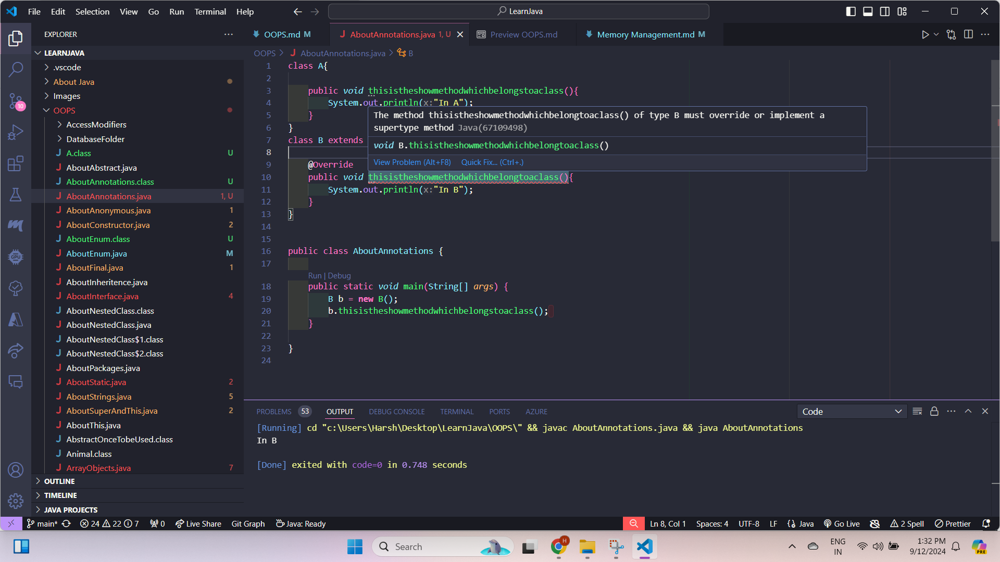

```
class A{

    public void thisistheshowmethodwhichbelongstoaclass(){
        System.out.println("In A");
    }
}
class B extends A{

    @Override
    public void thisistheshowmethodwhichbelongstoaclass(){
        System.out.println("In B");
    }
}


public class AboutAnnotations {
    
    public static void main(String[] args) {
        B b = new B();
        b.thisistheshowmethodwhichbelongstoaclass(); 
    }

}

Output:
In B
```

- Annotations in Java are metadata that provide additional information about a program but do not directly affect the code’s operation. They are a form of syntactic metadata that can be applied to classes, methods, fields, parameters, and other elements in the code.
- Annotations in Java are marked by the **@** symbol, followed by the annotation name. They can be applied to various code elements, including classes, methods, fields, parameters, and even other annotations.
- Annotations in Java are a form of metadata, providing information about the code to the compiler, runtime, or other tools.
- The annotation `@Override` tells the compiler that this method is an overridden method (metadata about the method), and if any such method does not exist in a subclass class which is extending the parent class, then throw a compiler error (method does not override a method from its parent class).
- There are other annotations like `@Deprecated` which is applied on class or on methods stating the functionality can be use with the current version but will be remove in the future version.

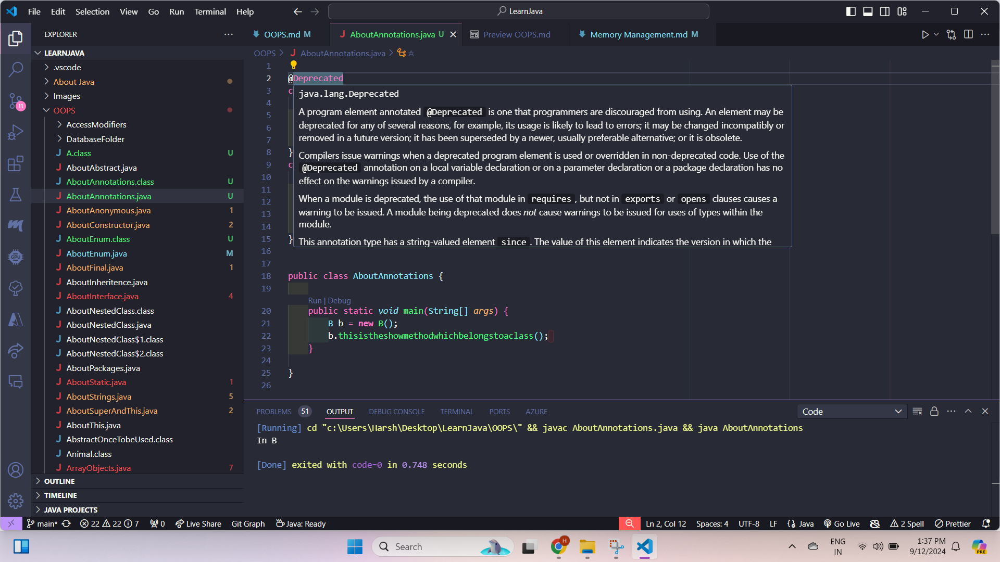

- If any one uses the class or method, they will see strike in their editor.

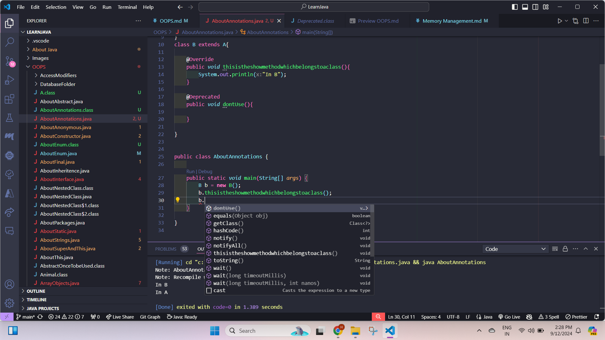

- Even if you use it , something below like message will be shown during the run-time

```
Note: AboutAnnotations.java uses or overrides a deprecated API.
Note: Recompile with -Xlint:deprecation for details.
In B
```

- We have seen about functional interface or single abstract method. We have an annotation of it `@FunctionalInterface`. If you see , second method `show1()` is not allowed , it gives some error.

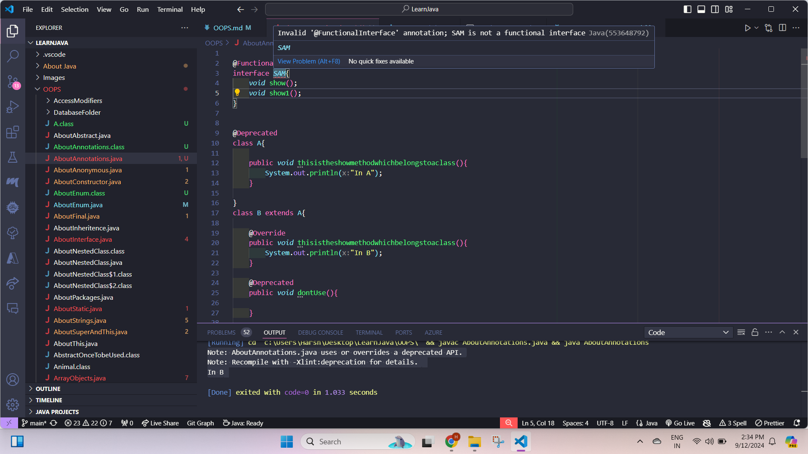

- So this way annotation not only helps in readability but also helps the compiler to stick with the functionality mentioned using the annotation.
- In Spring framework, there are pretty good amount of annotations used like `@Component`,`@Autowired`, `@Entity`, `@Table` etc..
- Lets explore the `@Override` and `@Deprecated` annotation by clicking on it.

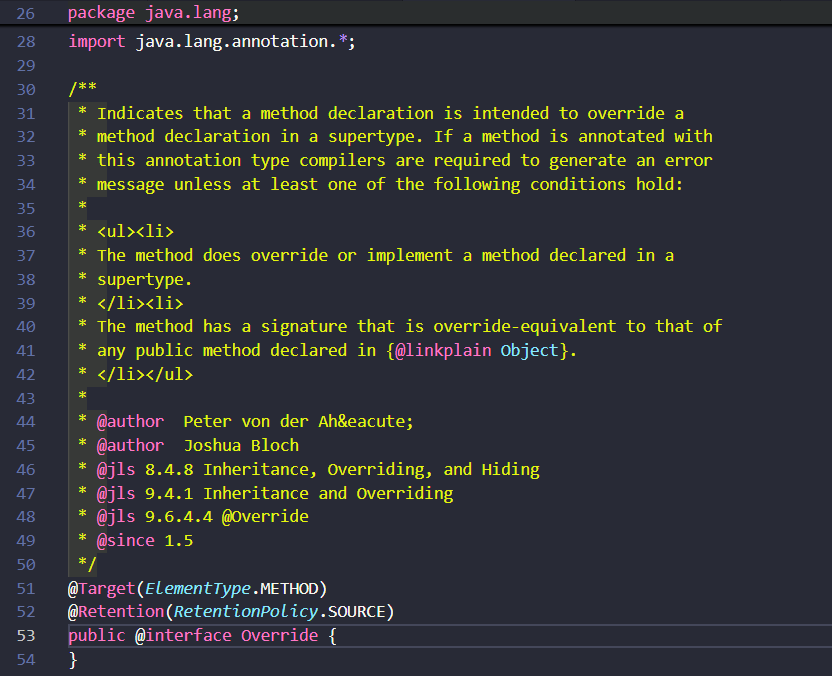

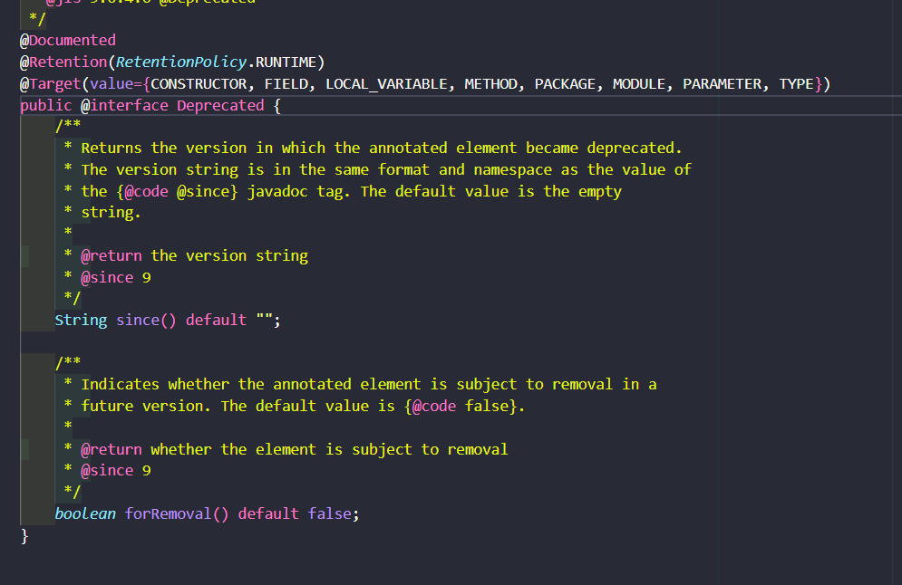

- If you see both are interfaces and there is nothing any logic thing written on it, then how does it works? basically the java compiler knows the related logic for every in-built annotation. Thus the annotation just provide metadata or information to the compiler and using that the compiler, depending on whatever annotation, perform the compilation.
- The Java compiler has built-in knowledge about how to handle these annotations. This knowledge is embedded within the compiler’s codebase. The compiler knows how to interpret the metadata provided by annotations and what checks or actions to perform based on them.
- The java compiler leverages **annotation processor**. Annotation processors are a specialized tool that the Java compiler leverages during the compilation process. They play a crucial role in analyzing and processing annotations at compile time.
- For `@Override`: The compiler checks whether the annotated method correctly overrides a method from a superclass or interface.
- For `@Deprecated`: The compiler generates warnings when deprecated methods or classes are used.
- For `@FunctionalInterface`: The compiler checks that the annotated interface meets the criteria for a functional interface.
- If you see `@Retention` and `@Target` anntotation define, what are they?
- Annotations in Java are processed at compile time or runtime, depending on their retention policy. The retention policy is specified by the `@Retention` annotation, and it can be one of three values: SOURCE, CLASS, or RUNTIME.
    1. **SOURCE**: Annotations are only available in the source code and are discarded during compilation.
    2. **CLASS**: Annotations are included in the class file during compilation but not accessible at runtime.
    3. **RUNTIME**: Annotations are retained at runtime and can be accessed programmatically through reflection.
- The `@Target` annotation specifies the types of program elements to which an annotation can be applied. The `@Target` annotation specifies where an annotation can be applied, defining the kinds of program elements (like methods, classes, fields) that the annotation can be used on via **ElementType**.
- For example, if an annotation is designed for methods, you would use `@Target(ElementType.METHOD)`. `ElementType.TYPE` annotation can be applied to any class, interface, enum, or annotation type. `ElementType.FIELD` annotation can be applied to fields (i.e., member variables of a class). `ElementType.PARAMETER` annotation can be applied to method parameters , example `@RequestParam` in spring boot framework and so on.
- Can we create our own annotation? , yes you can. Creating custom annotation is similar to writing an interface, except that the interface keyword is prefixed with `@` symbol.

```
@Retention(RetentionPolicy.RUNTIME)
@Target(ElementType.TYPE)
@interface MyCustomAnnotation {
    String value() default "default value";
    int count() default 0;
}

@MyCustomAnnotation(value = "Hi",count = 2)
class useAnnotation{
    public void display(){
        System.out.println("Use Annotation Display");
    }
}


public class AboutAnnotations {
    
    public static void main(String[] args) {

        useAnnotation uA= new useAnnotation();
        uA.display();
        MyCustomAnnotation getvalue=uA.getClass().getAnnotation(MyCustomAnnotation.class);
        System.out.println(getvalue.count()+" "+getvalue.value());
    }

}

Output:
2 Hi
```

## Exception

### Errors

- Errors in Java are issues or problems that occur during the execution of a program, leading to abnormal or unexpected behavior. Errors can prevent a program from functioning correctly.

#### Types of Errors


##### Compile-time Error or Syntax Error

- Compile Time Errors are those errors which prevent the code from running because of an incorrect syntax such as a missing semicolon at the end of a statement or a missing bracket, class not found, etc. These errors are detected by the java compiler and an error message is displayed on the screen while compiling. Compile Time Errors are sometimes also referred to as Syntax errors. 
- These kind of errors are easy to spot and rectify because the java compiler finds them for you. The compiler will tell you which piece of code in the program got in trouble and its best guess as to what you did wrong. 
- Usually, the compiler indicates the exact line where the error is, or sometimes the line just before it, however, if the problem is with incorrectly nested braces, the actual error may be at the beginning of the block. In effect, syntax errors represent grammatical errors in the use of the programming language.

```
class PrintingSentence {
	public static void main(String args[])
	{
		String s = "GeeksforGeeks";

		// Missing ';' at the end
		System.out.println("Welcome to " + s)
	}
}

Output:
prog.java:8: error: ';' expected
        System.out.println("Welcome to " + s)
                                             ^
1 error


class MisspelledVar {
	public static void main(String args[])
	{
		int a = 40, b = 60;

		// Declared variable Sum with Capital S
		int Sum = a + b;

		// Trying to call variable Sum
		// with a small s ie. sum
		System.out.println(
			"Sum of variables is "
			+ sum);
	}
}

Output:
prog.java:14: error: cannot find symbol
            + sum);
              ^
  symbol:   variable sum
  location: class MisspelledVar
1 error
```

##### Run-time Error

- Run Time errors occur or we can say, are detected during the execution of the program.
-  Runtime errors occur when a program does not contain any syntax errors but asks the computer to do something that the computer is unable to reliably do.

```
class DivByZero {
    public static void main(String args[])
    {
        int var1 = 15;
        int var2 = 5;
        int var3 = 0;
        int ans1 = var1 / var2;
 
        // This statement causes a runtime error,
        // as 15 is getting divided by 0 here
        int ans2 = var1 / var3;
 
        System.out.println(
            "Division of va1"
            + " by var2 is: "
            + ans1);
        System.out.println(
            "Division of va1"
            + " by var3 is: "
            + ans2);
    }
}

Output:
Exception in thread "main" java.lang.ArithmeticException: / by zero
    at DivByZero.main(File.java:14)


class RTErrorDemo {
	public static void main(String args[])
	{
		int arr[] = new int[5];

		// Array size is 5
		// whereas this statement assigns

		// value 250 at the 10th position.
		arr[9] = 250;

		System.out.println("Value assigned! ");
	}
}

Output:
Exception in thread "main" java.lang.ArrayIndexOutOfBoundsException: 9
    at RTErrorDemo.main(File.java:10)
```

##### Logical or Semantic Error

- A logic error is when your program compiles and executes, but does the wrong thing or returns an incorrect result or no output when it should be returning an output.
-  Logical errors are also called Semantic Errors. These errors are caused due to an incorrect idea or concept used by a programmer while coding. Syntax errors are grammatical errors whereas, logical errors are errors arising out of an incorrect meaning.

```
public class LErrorDemo {
	public static void main(String[] args)
	{
		int num = 789;
		int reversednum = 0;
		int remainder;

		while (num != 0) {

			// to obtain modulus % sign should
			// have been used instead of /
			remainder = num / 10;
			reversednum
				= reversednum * 10
				+ remainder;
			num /= 10;
		}
		System.out.println("Reversed number is "
						+ reversednum);
	}
}


Output:
Reversed number is 7870
```


- We can handle compile-time errors by writting correct syntax code, we can handle logical error by re-writing the correct logic but run-time error are kind of exception which may or may not be handle using. 
- Examples:
    - OutOfMemoryError: When the JVM runs out of memory.
    - StackOverflowError: When the call stack limit is exceeded, usually due to deep recursion.
    - VirtualMachineError: Indicates that the JVM is broken or has run into a serious problem.
- Errors represent serious, often unrecoverable issues that occur outside the control of the application. These typically occur due to problems in the Java runtime environment (JVM), system resources, or hardware failures.
- Errors are usually not recoverable. They indicate severe issues that a typical Java application cannot handle or recover from (e.g., out-of-memory conditions, stack overflows).
- Since errors indicate issues beyond the scope of the application, it's rare to handle them programmatically or using codes.

```
public class Main {
    public static void main(String[] args) {
        causeStackOverflowError(); // Recursive call to cause stack overflow error
    }
    
    public static void causeStackOverflowError() {
        causeStackOverflowError();  // This will cause a StackOverflowError
    }
}
```

- Any error which we can handle using programmatically or using codes, those errors are called as **Exceptions**.

| Aspect         | Error                                             | Exception                                       |
|----------------|---------------------------------------------------|-------------------------------------------------|
| Definition     | Represents serious system-level issues            | Represents issues within the application        |
| Recoverability | Generally unrecoverable (but you can still use `try-catch`)                        | Recoverable through `try-catch` blocks            |
| Hierarchy      | Inherits from `java.lang.Error`                     | Inherits from `java.lang.Exception`               |
| Handling       | Rarely handled in code                            | Handled using `try-catch` or declared             |
| Cause          | Caused by JVM or resource failures (e.g., memory) | Caused by application logic or external events  |
| Examples       | `OutOfMemoryError`, `StackOverflowError`              | `NullPointerException`, `IOException`, `SQLException` |


- In Java, Exception is an unwanted or unexpected event, which occurs during the execution of a program, i.e. at run time, that disrupts the normal flow of the program’s instructions. Exceptions can be caught and handled by the program.
- Lets take an example

```
public class AboutExceptions{
    public static void main(String[] args) {

        try{
            int i=0;
            int j=19;
            System.out.println(j/i);
        }catch(Exception e){
            System.out.println("Got an exception "+e);
        }

    }
}

Output:
Got an exception java.lang.ArithmeticException: / by zero
```

- So here whatever the statement you write , you fell it gonna throw some exception, you need to mentioned that in the try block . And whatever the exception thrown by java you need to catch that, catch it and store it in a variable (**`e`**).
- If any exception is thrown by java, all the statement present inside the catch block will get executed.
- Variable **`e`** consist of exception message.
- Consider if you have an array and you are accessing element which is beyond the size of the array. You will get an exception.

```
public class AboutExceptions{
    public static void main(String[] args) {

        int a[] = new int[5];
        try{
            int i=19;
            int j=19;
            System.out.println(j/i);
            System.out.println("Accessing element "+a[10]);
        }catch(Exception e){
            System.out.println("Got an exception "+e);
        }

    }
}

Output:
1
Got an exception java.lang.ArrayIndexOutOfBoundsException: Index 10 out of bounds for length 5
```

- If you see our division program got execute but we got **ArrayIndexOutOfBoundsException**. Lets say in your program you need to print out two different statements whenever an **ArrayIndexOutOfBoundsException** or **ArithmeticException** occurs. We can do this using try multi-catch block.

```
public class AboutExceptions{
    public static void main(String[] args) {

        int a[] = new int[5];
        try{
            int i=19;
            int j=19;
            System.out.println(j/i);
            System.out.println("Accessing element "+a[10]);
        }
        catch(ArithmeticException ae){
            System.out.println("Cannot divided number by 0");
        }
        catch(ArrayIndexOutOfBoundsException aiobe){
            System.out.println("You are trying to access and element which is greater than the actual size of array");
        }
        catch(Exception e){ // Don't know if any other exception occurs.
            System.out.println("Got an exception "+e);
        }

    }
}

Output:
1
You are trying to access and element which is greater than the actual size of array
```

- **Exception** is a class. This class is parent of all the exceptions whether it is a built-in exception or user defined exception.
- Always define your parent class **Excpetion** at the last of multi-catch exceptions because as soon as you define the parent exception above your multi-catch exception block , those multi-catch exception won't be reachable because any exception which should be part of multi-catch statement will go under the parent exception.

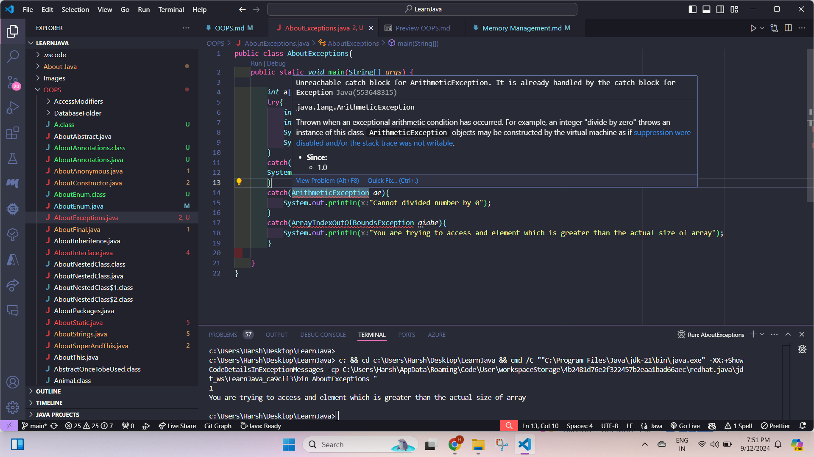

### Throw

- Lets say when we divide the two numbers `num` and `den`, if `den` is zero then don't need to perform division we know we will get **ArithmeticException** . So can we throw **ArithmeticException** without performing division?

```
import java.text.DateFormat;
import java.text.ParseException;
import java.text.SimpleDateFormat;
import java.util.Date;

public class AboutExceptions{
    public static void main(String[] args) {

        int num=10;
        int den=0;
        try{
            if(den==0)
                throw new ArithmeticException();
            else
                System.out.println(num/den);
        }catch(ArithmeticException eden){
            System.out.println(eden);
        }
    }
}

Output:
java.lang.ArithmeticException
```

- Using **throw** keyword, we can explicitly throw an exception from a method or any block of code.
- In the output, if you see we get `java.lang.ArithmeticException` what if we wanted to print out our own custom message.

```
        int num=10;
        int den=0;
        try{
            if(den==0)
                throw new ArithmeticException("Cannot Divided number by 0");
            else
                System.out.println(num/den);
        }catch(ArithmeticException eden){
            System.out.println(eden);
        }

Output:
java.lang.ArithmeticException: Cannot Divided number by 0
```

- Using **throw** keyword you can throw any exception whether it is an in-built or user defined exception.
- When we use **throw**, the flow of execution of the program stops immediately after the throw statement is executed and the nearest enclosing try block is checked to see if it has a catch statement that matches the type of exception. 
- If it finds a match, controlled is transferred to that statement otherwise next enclosing try block is checked, and so on. If no matching catch is found then the default exception handler will halt the program.

```
class Test {
	public static void main(String[] args)
	{
		System.out.println(1 / 0); // Program got halt
        System.out.println("Hello");
	}
}

Output:
Exception in thread "main" java.lang.ArithmeticException: / by zero
```

### Throws

- Lets say there is a method which performs division, and the main method calls the method and passes the input argument to it. The main method must know if any **ArithmeticException** occurs in the division method, then the main method would perform some exception. So here if we use try-catch inside the division block, the main method won't be able to know if any **ArithmeticException** has occured and thats where we will use **throws** keyword.

```
public class AboutExceptions{
    public static void main(String[] args) {
        try{
            System.out.println("Division - "+division(5,0));
        }catch(ArithmeticException de){
            System.out.println("Division method failed");
        }
    }

    public static int division(int num,int den) throws ArithmeticException{
        return num/den;
    }
}

Output:
Division method failed
```

- **throws** is used in method signatures to declare that a method may throw certain exceptions. This informs the caller that they need to handle or declare these exceptions. **throws** is placed after the method parameters in the method declaration, followed by a list of exceptions.
- The usage of the throws keyword convinces the compiler that the exception occurred in the method is to be handled by the caller method hence, no compilation error occurs. But, the caller method must handle the exception or delegate the responsibility to handle the exception to its hierarchy method.

```
    public static int division(int num,int den) throws ArithmeticException,NullPointerException{
        return num/den;
    }
```
- You cannot pass your own custom message in these exceptions.

> [!CAUTION]
> - Below declaration is invalid leading to syntax error
> ```
> 
>    public static int division(int num,int den) throws ArithmeticException("Custom Exception Message"),NullPointerException{
>         return num/den;
>     }
> ```

- **The `throw` keyword is used to handover the instance of the exception created by the programmer to the JVM manually. The `throws` keyword used to handover the responsibility of handling the exception occurred in the method to the caller method**.

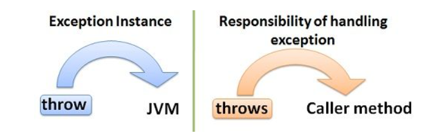


- Consider the below snippet. Can you guess will the catch block will get executed?

```
public class AboutExceptions{
    public static void main(String[] args) throws IOException {

        try{
            throw new IOException();
        }catch(Exception e){
            System.out.println("Inside catch block");
        }

    }
}

Output:
Inside catch block
```

- When an exception (like `IOException`) is thrown in the try block, the catch block for Exception catches it because `IOException` is a subclass of Exception. The `throws IOException` in the method declaration only comes into play if the exception is not caught inside the method. In this case, since the exception is caught by the `catch (Exception e)` block, it doesn't propagate outside the method, so the `throws IOException` part is not used.
- The `catch` block takes precedence because it intercepts the exception. The `throws` clause would only apply if the exception wasn’t caught inside the method.

##### Ducking Exception

- "**Ducking**" an exception refers to the practice of passing the responsibility of handling an exception to the calling method by declaring the exception in the method's signature using the `throws` keyword.
- When a method ducks an exception, it tells the compiler, `"I'm not going to handle this exception, but whoever calls me needs to deal with it."`.

```
public static void main(String args[]){
        try{
            System.out.println("Division - "+division(5,0)); // Ducking occurs
        }catch(ArithmeticException de){
            System.out.println("Division method failed");
        }
}

    // Method ducks the ArithmeticException,NullPointerException by declaring it with 'throws'
public static int division(int num,int den) throws ArithmeticException,NullPointerException{
        return num/den;
    }
```

- Ducking occurs in the `division()` method because it doesn't handle the ArithmeticException,NullPointerException itself; it declares throws ArithmeticException,NullPointerException and leaves it to the `main()` method to handle it.
- The advantage of ducking is that it allows exceptions to be handled at a higher level, where you might have a better understanding of the context in which the exception occurred.

### Throwable

- Consider below **try-catch** block, guess what will be the output?

```
        try{
            throw new OutOfMemoryError();
        }catch(Exception var){
            System.out.println("Out of memory occurred");
        }
```

- Output

```
Exception in thread "main" java.lang.OutOfMemoryError
	at AboutExceptions.main(AboutExceptions.java:54)
```

- Now consider below **try-catch** block, and guess again what will be the output?

```
        try{
            throw new OutOfMemoryError();
        }catch(Error var){
            System.out.println("Out of memory occurred");
        }
```

- Output

```
Out of memory occurred
```

- If you see in the first try-catch block , the catch block was handling **Exception** related entities where in the second try catch block , the catch block was handling **Error** related entities. Thats why in the first try-catch block the catch statements did not got executed whereas in the second try-catch block the catch statement got executed.
- **Error class cannot handle Exception class similarly Exception class cannot handle Error class**.
- So there could be a possibility in your programming that you might encounter exception as well as error, how to handle it? , using **Throwable**.

```
        try{
            throw new OutOfMemoryError();
        }catch(Throwable var){
            System.out.println("Out of memory occurred");
        }

        try{
            throw new ArithmeticException();
        }catch(Throwable var){
            System.out.println("Arithmetic Exception occurred");
        }

Output:
Out of memory occurred
Arithmetic Exception occurred
```

- **Throwable** superclass of all errors and exceptions in Java. It has two main subclasses: Exception and Error. You generally use Throwable when you need to catch all possible exceptions and errors, but it's rarely used directly in practice.

| **Feature** | **throw**                                            | **throws**                                               | **Throwable**                                    |
|:-----------:|:----------------------------------------------------:|:--------------------------------------------------------:|:------------------------------------------------:|
| **Purpose** | To explicitly throw an exception                     | To declare exceptions that a method may throw            | The superclass of all exceptions and errors      |
| **Usage**   | Used inside methods or blocks to throw an exception  | Used in method signatures to declare possible exceptions | Used to catch all possible exceptions and errors |
| **Scope**   | Limited to where it is used                          | Applies to the method's signature                        | Can be used to catch any throwable object        |
| **Example** | throw new IllegalArgumentException("Error message"); | public void method() throws IOException                  | catch (Throwable t  )                             |

### When to use throw, throws and Throwable

- **`throw`**: Necessary when you want to manually trigger an exception, indicating that something went wrong at a specific point in your code.
- **`throws`**: Important for methods that may throw checked exceptions. It ensures that the method's callers are aware of and handle these exceptions.
- **`Throwable`**: Useful for catching all possible exceptions and errors, but it is not common practice because it catches everything, including errors that usually shouldn't be handled.

>[!NOTE]
> - **`throw`** and **`throws`** can be used to handle **Error** (like IOError, StackOverflowError etc..) as well as **Exception**.


>[!TIP]
> - If we add **`throws`** keyword on a main method? then whos gonna handle it? now here main is the calling method? 
> - If the `main` method declares exceptions using `throws`, then the **Java Virtual Machine (JVM)** is responsible for handling any uncaught exceptions that occur during the execution of the program. This means that if an exception is not caught in the program and the main method has a throws declaration, the JVM will handle the exception by typically printing an error stack trace and terminating the program.
> - The JVM prints the exception's name, message, and stack trace, which includes details about where the exception occurred in the code.
> - After printing the stack trace, the JVM terminates the program. This abrupt termination happens because the program didn't handle the exception.
> 
> ```
> import java.io.IOException;
> public class Main {
>     public static void main(String[] args) throws IOException {
>        readFile();  // IOException is thrown by this method
>    }
>
>    public static void readFile() throws IOException {
>        throw new IOException("File not found!");
>    }
>}
> 
> Exception in thread "main" java.io.IOException: File not found!
>   at Main.readFile(Main.java:9)
>   at Main.main(Main.java:5)
> ```
>
> - **Letting the JVM handle exceptions is not recommended**.
>   - The application will terminate abruptly if the exception isn't handled.
>   - The program doesn't get a chance to recover or log the error in a controlled way.
>   - If an uncaught exception terminates a program, the end user sees an error message, which isn't a good user experience.


### Types of Exceptions

- Lets day you have a string , you wanted to convert that into a date format.

```
        String myBirthDate="01-11-1999";
        DateFormat dateFormat = new SimpleDateFormat("yyyy-MM-dd"); 
        Date parsedDate = dateFormat.parse(myBirthDate); 
```

- When we do this , we get something like below

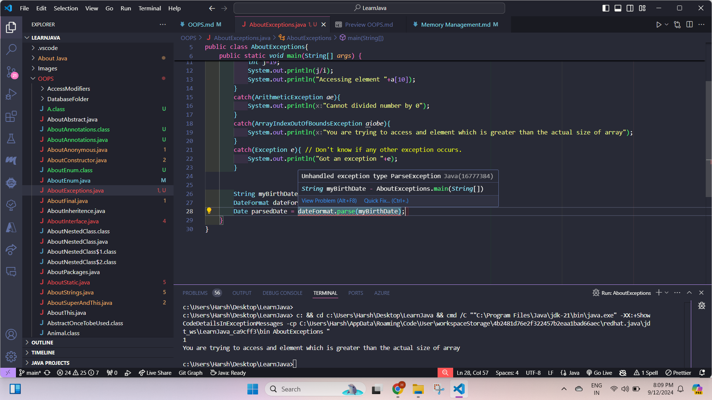
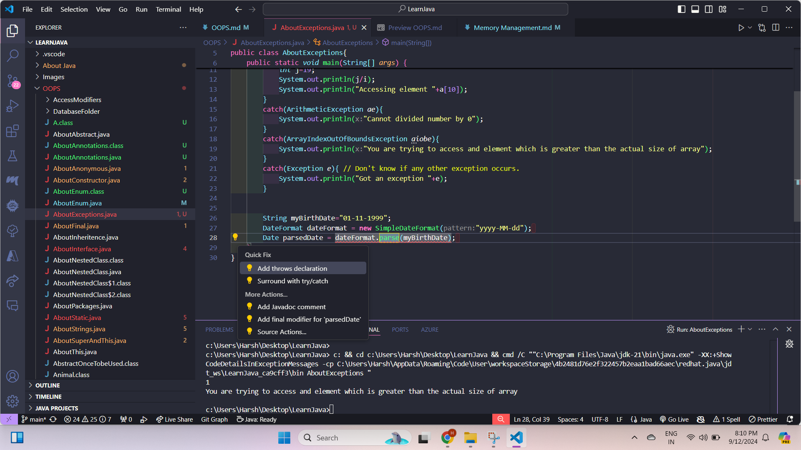

- Java compiler automatically suggest to add a try-catch block or use throws, why so? because our string may or may not be in proper date format. This would lead to ParseException.

```
import java.text.DateFormat;
import java.text.ParseException;
import java.text.SimpleDateFormat;
import java.util.Date;

public class AboutExceptions{
    public static void main(String[] args) {

        String myBirthDate="01-11-1999";
        DateFormat dateFormat = new SimpleDateFormat("yyyy-MM-dd"); 
        try {
            Date parsedDate = dateFormat.parse(myBirthDate);
        } catch (ParseException e) {
        
            System.out.println("Date is not in proper format");
        } 
    }
}
```

- Such exceptions are called as **checked exceptions**. The **ArrayIndexOutOfBoundsException** or **ArithmeticException** these types of exceptions are called as **Unchecked exceptions**.
- Checked exceptions are checked by compiler at compile-time. Checked exceptions, such as `IOException` or `SQLException`, are exceptions that a method must declare in its throws clause or handle using a try-catch block. These exceptions are typically external to the program and demand the developer's attention to ensure it is handle.
- Unchecked exceptions, like `NullPointerException` or `ArrayIndexOutOfBoundsException`, which means they don't require explicit declaration or handling. Unchecked exceptions often signal programming errors, such as accessing an array index out of bounds, prompting developers to rectify their code.


| **Aspect**               | **Checked Exception**                                                                                  | **Unchecked Exception**                                                                                   |
|--------------------------|--------------------------------------------------------------------------------------------------------|-----------------------------------------------------------------------------------------------------------|
| **Other Name**           | Compile-time exception                                                                                 | Runtime exception                                                                                         |
| **Hierarchy**            | Subclass of java.lang.Exception (except RuntimeException)                                              | Subclass of java.lang.RuntimeException                                                                    |
| **When Detected**        | At compile-time                                                                                        | At runtime                                                                                                |
| **Handling Requirement** | Must be handled with try-catch or declared using throws                                                | Does not need to be explicitly handled or declared                                                        |
| **Examples**             | IOException, SQLException, ClassNotFoundException                                                      | NullPointerException, ArrayIndexOutOfBoundsException, ArithmeticException                                 |
| **When to Use**          | Used for conditions that are outside the control of the program (e.g., file not found, network issues) | Used for programming errors or logical mistakes that can be avoided (e.g., null access, dividing by zero) |
| **Type**                 | Typically recoverable                                                                                  | Generally results from programming errors                                                                 |


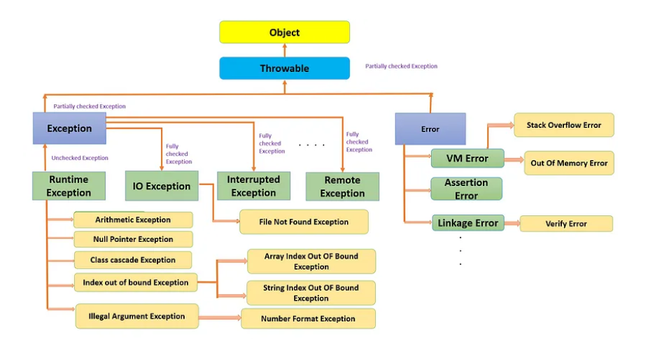


### Custom Exception

- Before creating our own exception , lets see how in-built exceptions are made. This will give us idea to built our own exceptions. Lets see the implementation of **ArithmeticException**.

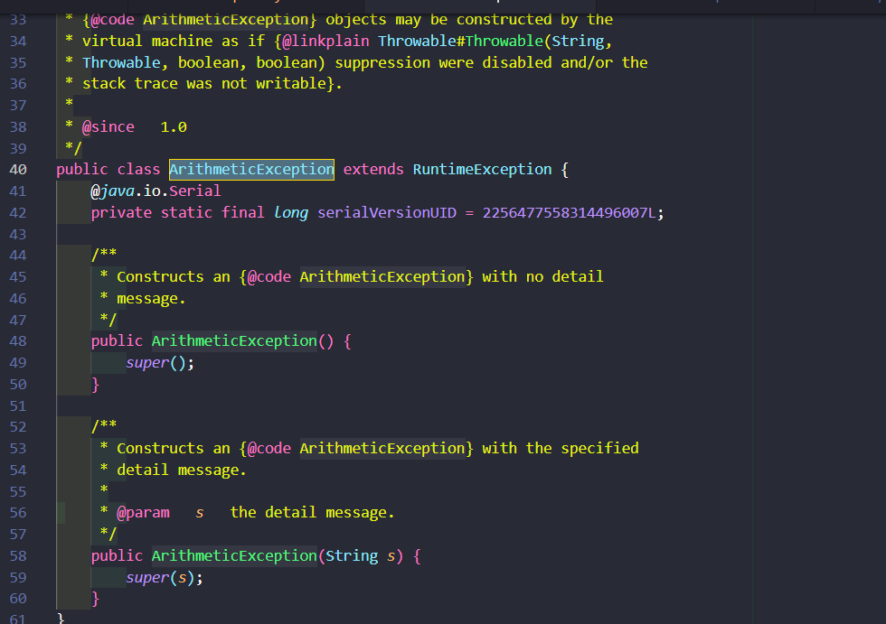

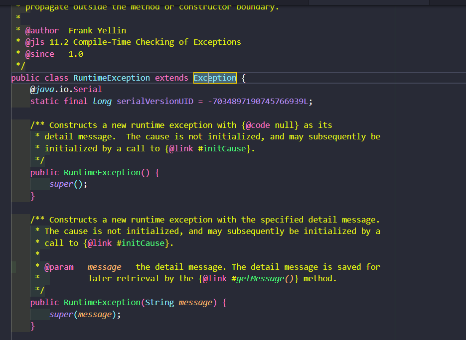

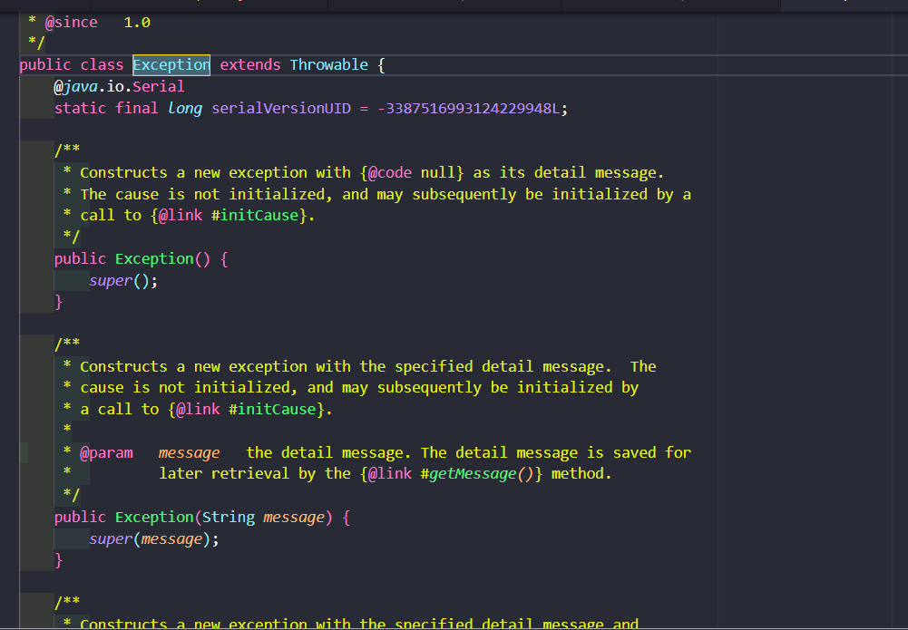

- Now **ArithmeticException** extends **RuntimeException** and **RuntimeException** extends **Exception**.
- When defining a custom exception in Java, you can extend either the **RuntimeException** class (for unchecked exceptions) or the Exception class (for checked exceptions). The choice of whether to extend **RuntimeException** or **Exception** depends on the specific behavior you want for your custom exception and how you expect it to be handled by users of your code.
- Lets implement both and see

#### Runtime Custom Exception

- So here we have defined a exception class, which will throw **InvalidAgeException** when age value is negative.

```
class InvalidAgeException extends RuntimeException {

}
```

- Below is the main block.

```
        int age=-5;
        try{
            if(age<0)
            throw new InvalidAgeException();
        }
        catch(InvalidAgeException iae){
            System.out.println(iae);
        }

Output:
InvalidAgeException
```

- How to pass your custom message `InvalidAgeException("Age cannot be negative")` into your custom exception? if you see the style it is a parameterized constructor which is accepting input in string type.

```
class InvalidAgeException extends RuntimeException {

    public InvalidAgeException(String exceptionMsg){

        super(exceptionMsg);

        /**
         * Or using System.out.println or System.out.print if not to use super
         */
    }
}
```

- Main block

```
        int age=-5;
        try{
            if(age<0)
            throw new InvalidAgeException("Age is negative");
        }
        catch(InvalidAgeException iae){
            System.out.println(iae);
        }

Output:
InvalidAgeException: Age is negative
```

- Here it is recommended to use `super` as all the exception class follows the same pattern.

#### Compile time Custom Exception

- Lets create a class which will extend **Exception**. Lets create a compile time exception class which will throw exception if age is greater than 100 then it will throw an exception.

```
class CompileTimeAgeCheckerException extends Exception{

    public CompileTimeAgeCheckerException(String msg){
        super(msg);
    }
}
```

- Lets create a method which will throws **CompileTimeAgeCheckerException**.

```
    public static String display(int age) throws CompileTimeAgeCheckerException{
        if(age>100)
            throw new CompileTimeAgeCheckerException("Age is greater than 100");
        return "Age is valid";
    }
```

- Inside the main block, we can see we are getting the checked exception like message.

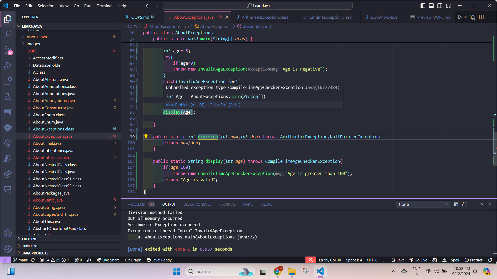

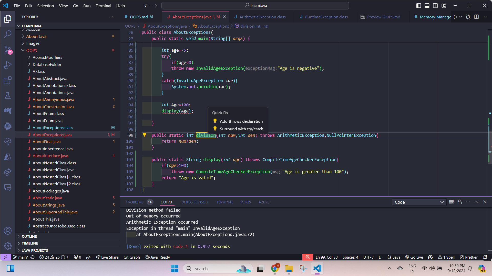

```
        int Age=1000;
        try {
            System.out.println(display(Age));
        } catch (CompileTimeAgeCheckerException eage) {
            System.out.println(eage);
        }

Output:
CompileTimeAgeCheckerException: Age is greater than 100
```

## Finally

- The finally block is used in conjunction with a try-catch statement to ensure that some specific code runs regardless of whether an exception occurs or not. It is often used for cleanup activities like closing files, releasing resources, or other tasks that must be executed no matter what.

```
public class Main {
    public static void main(String[] args) {
        try {
            int result = 10 / 0;  // This will cause an ArithmeticException
        } catch (ArithmeticException e) {
            System.out.println("Caught exception: " + e.getMessage());
        } finally {
            System.out.println("This will always execute.");
        }
    }
}

Output:
Caught exception: / by zero
This will always execute.
```

- The code in the finally block will always be executed after the try block completes, whether an exception was thrown or not.
- **You can also write try-with-finally**

```
try{
    // Statements
}
finally{
    //Statements
}
```

## I/O Streams

- Have you ever wondered how java accepts input and gives output? it is using **Streams** which is part of package `java.io`.
- What are **Streams**?
    - A stream is a sequence of data flowing from a source to a destination. Think of it as a pipeline through which data travels from some source (like the keyboard, a file, or a network) into your program, where you can use it.
    - It is neither a data structure nor a store of data. For example, a river stream is where water flows from source to destination. Similarly, these are data streams; data flows through one point to another.
    - The `java.io` package helps the user perform all input-output operations. Java IO package is primarily focused on input-output
    - Streams support many different kinds of data, including simple bytes, primitive data types, localized characters, and objects. Some streams simply pass on data; others manipulate and transform the data in useful ways.
    - No matter how they work internally, all streams present the same simple model to programs that use them.
    - A program uses an input stream to read data from a source, one item at a time. A program uses an output stream to write data to a destination, one item at time.

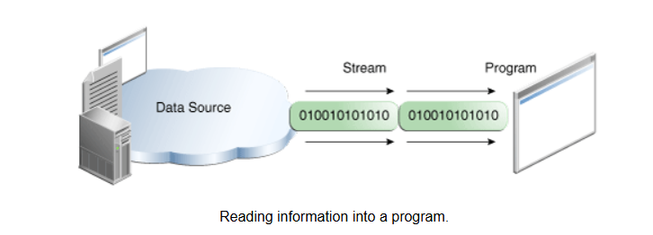

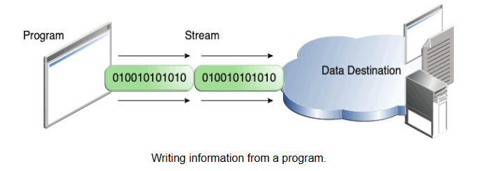


<details>

<summary> What is ASCII and UTF-8 ? </summary>

- ASCII (American Standard Code for Information Interchange) and UTF-8 (8-bit Unicode Transformation Format) are both systems for encoding characters so that computers can understand and process text.
- ASCII was developed in the 1960s. It uses 7 bits to represent each character. Can encode 128 different characters, including the English alphabet (both uppercase and lowercase), digits, punctuation marks, and some control characters. For example, the letter "A" is represented by the number 65 in ASCII. Checkout ASCII table [here](https://www.cs.cmu.edu/~pattis/15-1XX/common/handouts/ascii.html)
- ASCII was designed for English, so it can only represent 128 basic characters (like A-Z, 0-9, and some punctuation). This is fine if you’re only working with English, but the world uses many languages with thousands of unique characters, such as Chinese, Arabic, or Hindi.
- UTF-8 was developed to handle all characters from all languages, as well as symbols like emojis and special characters (e.g., mathematical symbols, currency signs). This is crucial for global communication, software, and the internet.
- UTF-8 uses 1 to 4 bytes to represent each character. For common characters (like those in ASCII), it uses just 1 byte, but for more complex characters (like emojis or symbols from various languages), it uses more bytes.
- So, while ASCII is a subset of UTF-8 (every ASCII character is represented the same way in UTF-8), UTF-8 can handle a much broader range of characters.
- Checkout UTF-8 table [here](https://www.charset.org/utf-8)
- **Why it is required?**
    - Imagine sending an email or text in a language with characters that don’t exist in ASCII. Without a system like UTF-8, the receiver's computer wouldn’t understand the characters and would display garbled or missing text. UTF-8 ensures that different computers, systems, and platforms can all read and display the same text, regardless of the language or symbols used.
    - UTF-8 is efficient because it uses 1 byte for common characters (like those in ASCII), and more bytes only when needed for more complex characters. This means it's space-efficient for text-heavy in English but still versatile enough for any other language. Since UTF-8 includes ASCII as a subset, systems using ASCII can work with UTF-8 without compatibility issues.


</details>

### Stream Categories

#### Byte-oriented Stream

- Lets take an example to understand byte-oriented stream, suppose you have a java program , your java program takes an input and display the same input as output. Suppose as a input you entered **code**, now these **code**  is converted travels to the steam from your keyboard as its source to your java program as destination in this way.

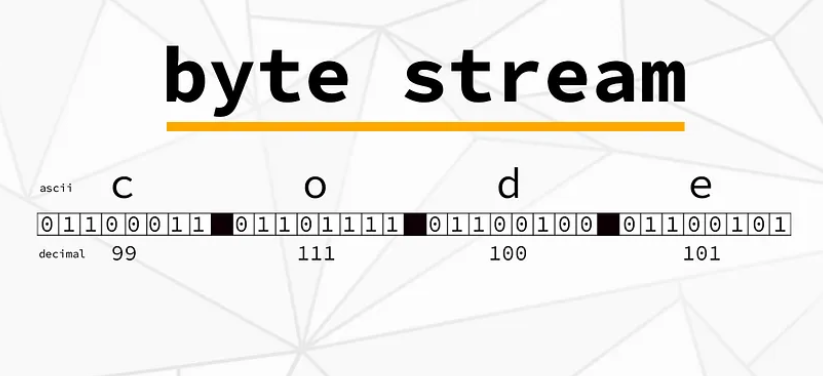

- Consider below code

```
// Online Java Compiler
// Use this editor to write, compile and run your Java code online
import java.io.InputStream;
import java.io.IOException;

class HelloWorld {
    public static void main(String[] args) throws IOException {
        InputStream inputStream = System.in;
        System.out.println("Enter text:");
        int byteData;
        String enteredInput="";
        // Reading byte by byte
        while ((byteData = inputStream.read()) != '\n') { // '\n' marks the end of input
            System.out.print(byteData+", ");
            enteredInput+=(char) byteData; // Converting bytes to characters
        }    
        System.out.println();
        System.out.println(enteredInput);
        
    }
}

Output:
Enter text:
code
99, 111, 100, 101, 
code
```

- You enter the text "code" on the console. Each character in converted as per UTF-8 encoding format (99,111,100,101) and then it travels via stream in form of byte (0's and 1's) representation.
- The byte-oriented stream reads each byte, one by one, from the console.
- Since the stream only understands bytes, it does not interpret the data as text but simply as a sequence of numbers.
- If you want to display this input as characters, you must manually convert these bytes back to characters or decode it back (`(char) byteData`).
- A byte stream in Java is used to **handle raw binary data (0's and 1's data contents)**. It processes data in the form of **8-bit** and is commonly used for reading and writing **binary files** (such as images, videos, and audio). **Byte streams do not perform any encoding or decoding, which means they handle data as-is, without converting it into characters**. The key classes for byte streams are `InputStream` (for reading bytes) and `OutputStream` (for writing bytes).
- Example

```
import java.io.IOException;
import java.io.InputStream;
import java.io.OutputStream;

public class ConsoleStreamExample {
    public static void main(String[] args) {
        InputStream inputStream = System.in;
        OutputStream outputStream = System.out;

        try {
            int byteData;

            // Read bytes from input stream and write them to output stream
            while ((byteData = inputStream.read()) != -1) {  // Read byte by byte
                outputStream.write(byteData);  // Write the byte to output stream
            }
        } catch (IOException e) {
            e.printStackTrace();
        } finally {
            // No need to close System.in and System.out as they are managed by the JVM
        }
    }
}


Output:
Hello
Hello
```

#### Character-Oriented Stream

- Consider below code

```
import java.io.IOException;
import java.io.InputStreamReader;
import java.io.OutputStreamWriter;
import java.io.Reader;
import java.io.Writer;

public class ConsoleCharStreamExampleNoBuffer {
    public static void main(String[] args) {
        Reader reader = new InputStreamReader(System.in);
        Writer writer = new OutputStreamWriter(System.out);

        try {
            int charData;

            // Read characters from the console and write them to the console
            while ((charData = reader.read()) != -1) {
                writer.write(charData); // Write the character to the output
                writer.flush();         // Ensure the character is immediately displayed
            }
        } catch (IOException e) {
            e.printStackTrace();
        } finally {
            try {
                reader.close();
                writer.close();
            } catch (IOException ex) {
                ex.printStackTrace();
            }
        }
    }
}


Output:
Hello
Hello
Hi
Hi
```

- A character stream in Java is used to **handle text data**. It processes data in the form of **16-bit** characters (Unicode) and **automatically handles the conversion between bytes and characters using a specific character encoding (e.g., UTF-8). So the stream details are converted into the the unicode value and not the actual character. This means that when data is read from a file (which is stored as a sequence of bytes), the character stream will convert the byte sequence into Unicode characters (65,49,80..,C2 80, C2 81).**
- Example: The byte sequence representing "A" in UTF-8 might be `0x41`. When you read it using `FileReader`, it converts this byte into the Unicode value `65` (which is the Unicode value for the character 'A').
- Character streams are ideal for reading and writing text files because they manage encoding/decoding automatically, converting bytes into readable  unicode characters. The key classes for character streams are Reader (for reading characters) and Writer (for writing characters).

### Key Difference between Byte-Oriented and Character Oriented Stream

- The main difference between byte and character streams is that byte streams handle raw bytes without any encoding/decoding, while character streams automatically convert bytes into unicode characters using a defined character encoding (like UTF-8).
- Byte streams are suitable for binary data, while character streams are better suited for text data.

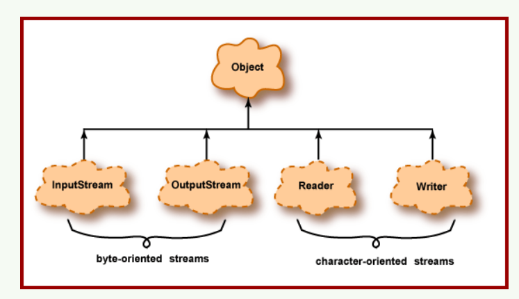

- Here, to specify stream that our source and destination will be java console , thats why we use `System.in` and `System.out`.
- Now when we use **Input/OutputStream** in case of Byte-oriented stream and **Reader/Writer** in case of character-oriented stream, don't you think processing byte/character one at a time will lead to slowness or performance issue in your program? it will also lead to increase in number of I/O operation which in turn increases CPU utilzation? thats why we have concept of **Buffer Stream**.

### Buffering in Streams

-**What is a Buffer?**
    - A buffer is a temporary storage area, usually in memory (RAM), used to hold data while it is being transferred between two places. In the context of I/O streams, buffers help manage data efficiently by reducing the number of direct interactions with the underlying data source or destination.

- Both byte-oriented and character-oriented streams use buffers to improve performance.
- Instead of handling data one byte or one character at a time, streams often read/write chunks of data into memory (a buffer) to reduce the number of I/O operations. A buffer is like a temporary storage area (an array) that stores multiple bytes/characters before they're processed.
- Default Buffer Sizes for `BufferedInputStream`, `BufferedOutputStream` , `BufferedReader` and `BufferedWriter` is 8 KB (8192 bytes).


- Simple Analogy
    - Imagine you are filling a bucket with water from a slow tap:
    - **Without Buffering**: You fill the bucket one cup of water at a time, running back and forth to the faucet each time.
    - **With Buffering**: You use a larger container (the buffer) to collect water in larger amounts. Once it’s full, you transport it all at once. This is more efficient and faster.

#### Byte-Oriented Buffered Stream Example

- Here we print out details as soon as user enters input.

```
import java.io.BufferedInputStream;
import java.io.BufferedOutputStream;
import java.io.IOException;
import java.io.InputStream;
import java.io.OutputStream;

public class ConsoleByteBufferedExample {
    public static void main(String[] args) {
        InputStream inputStream = System.in;
        OutputStream outputStream = System.out;

        // Wrap the streams with buffered streams
        BufferedInputStream bufferedInputStream = new BufferedInputStream(inputStream);
        BufferedOutputStream bufferedOutputStream = new BufferedOutputStream(outputStream);

        try {
            int byteData;
            // Read bytes from the console and write them to the console
            while (true) {
                byteData=bufferedInputStream.read();
                if(byteData==49)  // Press 1 to exit program
                    break;
                bufferedOutputStream.write(byteData);
                bufferedOutputStream.flush(); // Ensure the byte is immediately displayed
            }
        } catch (IOException e) {
            e.printStackTrace();
        } finally {
            try {
                bufferedInputStream.close();
                bufferedOutputStream.close();
            } catch (IOException ex) {
                ex.printStackTrace();
            }
        }
    }
}

Output:
Hi Hello
Hi Hello
How are you?
How are you?
1
```

- Here we take all the details in buffer and then print it.

```
import java.io.BufferedInputStream;
import java.io.BufferedOutputStream;
import java.io.IOException;
import java.io.InputStream;
import java.io.OutputStream;

public class ConsoleByteBufferedExample {
    public static void main(String[] args) {
        InputStream inputStream = System.in;
        OutputStream outputStream = System.out;

        // Wrap the streams with buffered streams
        BufferedInputStream bufferedInputStream = new BufferedInputStream(inputStream);
        BufferedOutputStream bufferedOutputStream = new BufferedOutputStream(outputStream);

        try {
            int byteData;
            // Read bytes from the console and write them to the console
            while (true) {
                byteData=bufferedInputStream.read();
                if(byteData==49)  // Press 1 to exit program
                    break;
                bufferedOutputStream.write(byteData);
            }
            bufferedOutputStream.flush(); // Ensure the byte is immediately displayed
        } catch (IOException e) {
            e.printStackTrace();
        } finally {
            try {
                bufferedInputStream.close();
                bufferedOutputStream.close();
            } catch (IOException ex) {
                ex.printStackTrace();
            }
        }
    }
}


Output:
Hi Hello
Hey
1
Hi Hello
Hey
```

#### Character-Oriented Buffered Stream Example

- Here is the code for accepting input from buffer reader and writer.

```
import java.io.BufferedReader;
import java.io.BufferedWriter;
import java.io.IOException;
import java.io.InputStreamReader;
import java.io.OutputStreamWriter;
import java.io.Reader;
import java.io.Writer;

public class ConsoleCharBufferedExample {
    public static void main(String[] args) {
        Reader reader = new InputStreamReader(System.in);
        Writer writer = new OutputStreamWriter(System.out);

        // Wrap the streams with buffered streams
        BufferedReader bufferedReader = new BufferedReader(reader);
        BufferedWriter bufferedWriter = new BufferedWriter(writer);

        try {
            String line;

            // Read lines from the console and write them to the console
            while (true) {
                line = bufferedReader.readLine();
                if(line.equals("1")) //Exit when press 1
                    break;
                bufferedWriter.write(line);
                bufferedWriter.newLine(); // Add a newline after each line
                bufferedWriter.flush();   // Ensure the line is immediately displayed
            }
        } catch (IOException e) {
            e.printStackTrace();
        } finally {
            try {
                bufferedReader.close();
                bufferedWriter.close();
            } catch (IOException ex) {
                ex.printStackTrace();
            }
        }
    }
}

Output:
Hi
Hi
Hello
Hello
1
```

### Closing Resources

- Whats the purpose of `.close()`? lets understand this via analogy.
- Imagine you’re borrowing a library book.
    - When you borrow a book from the library, you need a library card and the library sets aside that book for you. Similarly, when you open a file or a connection in a program for taking input (like `FileInputStream` or `FileOutputStream`), the system sets up resources (like a file handle or network connection) for you to use.
    - While you have the book, you can read it. This is like using the stream to read or write data.
    - When you’re done with the book, you return it to the library. This lets the library know that the book is available for others and releases the resources associated with it. Similarly, when you call `.close()` on a stream, you’re telling the system that you’re done using the resource (like the file or network connection). This releases the resource so it can be used by others or cleaned up properly.
- All the streams implements `Closeable` interface.

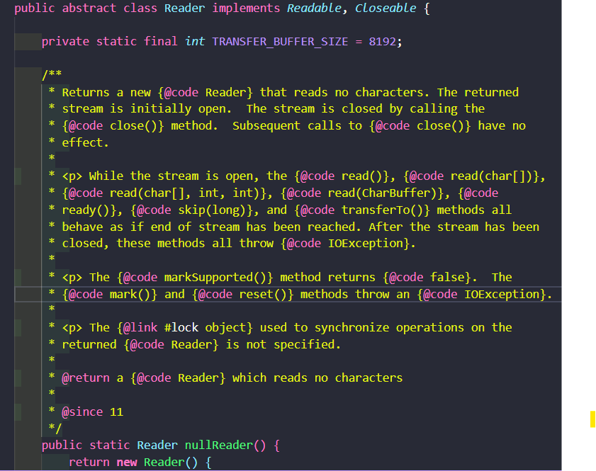

- **Why Close a Stream?**
    - If you don’t close the stream, it’s like keeping the library book without returning it. The system might not be able to use that resource for other tasks or could run out of resources over time.
    - The system has limited resources like file handles or network connections. Closing a stream ensures these resources are released and available for other operations.

## Difference between Byte-Oriented and Character-Oriented Stream


| **Feature**               | **Byte Streams**                          | **Character Streams**                    |
|---------------------------|-------------------------------------------|------------------------------------------|
| **Base Classes**          | `InputStream`, `OutputStream`                 | `Reader`, `Writer`                           |
| **Data Handling**         | Handles raw binary data (bytes)           | Handles unicode character data (text)            |
| **Operation Granularity** | Reads and writes one byte at a time       | Reads and writes one character at a time |
| **Data Representation**   | Byte-oriented (8-bit)                     | Character-oriented (16-bit Unicode)      |
| **Encoding**              | No encoding, handles raw bytes            | Handles character encoding (e.g., UTF-8) |
| **Usage**                 | Suitable for binary files (images, audio) | Suitable for text files                  |

- The `InputStream`, `OutputStream`, `Reader` and `Writer` all are abstract class which has multiple implement for various types of input and output, like for File related operations we have `FileInputStream`, `FileReader` and so on.

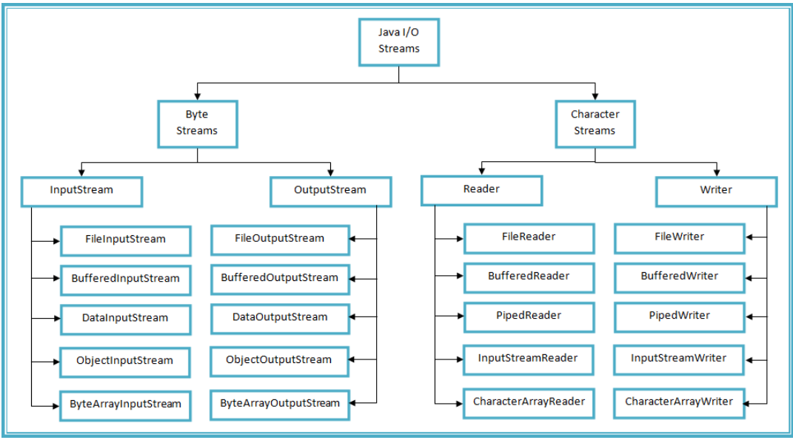

>[!TIP]
> - Depending on the type of resource or operation you need to work with, you'll choose the appropriate stream.
> - For example:
>   - If you're reading text from a file, you'd typically use a FileReader.
>   - If you're saving an object to a file, you'd use an ObjectOutputStream.
>   - If you want better performance by minimizing the number of reads/writes to the disk, you could add buffering with BufferedReader or BufferedOutputStream.

- Which stream does `System.out.println()` uses? it uses **PrintStream**.

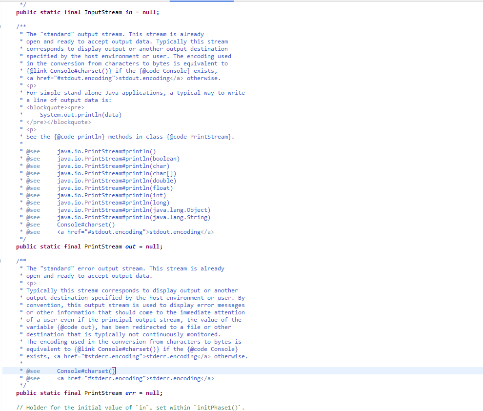

## Scanner

- When we use `bufferedReader()`, the method returns input in string datatype. Incase if you use `bufferedInputStream()` you will get and integer value which is UTF-8 encoding format. Now in both the scenario , if you wanna perform any operations like mathematical or any calculation, you need to explicitly convert them into their respective primitive data type using wrapper classes. What if this all things is handle by `Scanner()`? lets see an example.

```
import java.util.*;

class HelloWorld {
    public static void main(String[] args) {
        Scanner scanner = new Scanner(System.in);
        System.out.println("Enter an integer:");
        int num = scanner.nextInt();
        System.out.println("You entered: " + num);
        scanner.close();
    }
}

Output:
Enter an integer:
12
You entered: 12
```

- **Scanner** handles parsing automatically. It reads the input (from the console, file, or another stream) and can automatically convert the input into primitive data types like int, double, etc., without needing to manually convert them yourself.
- With Scanner, you don’t need to worry about converting strings to numbers or handling raw bytes. It handles the parsing and conversion internally, so you can directly read the values as the types you need.

```
Scanner scanner = new Scanner(System.in);
int number = scanner.nextInt();  // Automatically reads and converts the input to an integer
double value = scanner.nextDouble();  // Automatically reads and converts to a double
```

- The main advantage of Scanner is that it simplifies input handling by removing the need for manual conversion using wrapper classes.
- Scanner is a utility class (`java.util`) primarily designed to parse and read input from various sources, such as user input (via the console), files, strings, etc. It's useful for handling primitive types (e.g., int, double) and strings, and it can split input based on delimiters (like spaces or newlines).
- **Scanner is not part of Java I/O Streams. It is a utility class that provides input parsing on top of only byte-oriented stream like `InputStream`**.

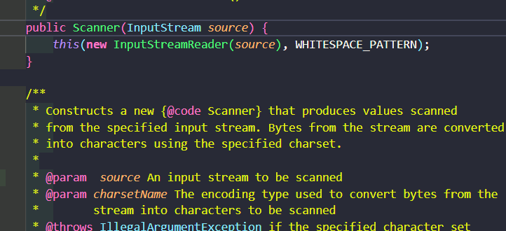

- Scanner cannot directly use a **Reader** (like `FileReader` or `InputStreamReader`) because Scanner operates on input sources that are either InputStream, File, or String. Scanner works with byte-oriented streams (like `InputStream`) and not directly with character-oriented streams (like `Reader` and `Writer`). However, you can convert character-oriented streams to byte-oriented streams (e.g., `InputStream`) and use them with Scanner.  Scanner is not compatible with `BufferedReader` because `BufferedReader` works with character streams, not byte streams.
- **You cannot print data using Scanner. The Scanner class is designed for reading and parsing input, not for output or printing data.**
- **Scanner is primarly designed to parse primitive types and strings from text-based input.**
- Scanner supports reading from files using the File or FileInputStream classes. However, it is limited to text files. If you need to read binary data (like images or PDFs), Scanner is not suitable. While Scanner can read from an `InputStream`, including those coming from network sockets, it is primarily meant for textual data. If you are reading data from a network stream (like a socket) that includes non-textual data (binary data, compressed data, etc.), you should use more specialized classes like `BufferedInputStream` or `DataInputStream`.
- Even in scanner we need to close the resource `.close()`. When you create a Scanner object, it opens a connection to the input source. If the input source involves a resource (like a file or system input), it should be closed when you're done with it to release those resources. It implements **Closable** interface.

### Limitations of Scanner
- Text-Based Parsing: Scanner works well for parsing text and converting it to primitive types, but it is not suitable for handling raw binary data (e.g., image files, audio files).
- Lack of Advanced Stream Handling: While Scanner can read from an InputStream, **it doesn't provide the buffering and performance optimizations** that you get with classes like `BufferedReader` or `BufferedInputStream`. For large files or streams, BufferedReader is usually more efficient for reading lines of text.
- No Database Interaction: Scanner cannot interact with databases directly. For that, you would need a dedicated API like JDBC.
- Scanner does not directly support character-oriented streams (Reader, BufferedReader, etc.). Scanner works with byte-oriented streams (InputStream), files, and strings. It can wrap an InputStream that is linked to a character stream but cannot directly take a Reader object.

### When to Use Scanner vs. Other Stream Classes

- **Use Scanner**:
    - When you need to parse primitive data types or simple text from user input, files, or strings.
    - When you are working with formatted text and want easy parsing (e.g., numbers, tokens, booleans).
    - For simple, small-scale file or input handling tasks where performance is not a concern.

- **Use Other Stream Classes (BufferedReader, DataInputStream, ObjectInputStream, etc.)**:
    - When you need to handle large text files or binary data (e.g., reading images, audio, etc.).
    - When you're dealing with network streams, especially if they contain non-textual data.
    - When performance is critical, and you need efficient reading/writing of large datasets

### Difference Table

| Feature                   | Scanner                                                                         | Byte-Oriented Streams (InputStream)                            | Character-Oriented Streams (BufferedReader)                       |   |   |   |   |   |   |
|---------------------------|---------------------------------------------------------------------------------|----------------------------------------------------------------|-------------------------------------------------------------------|---|---|---|---|---|---|
| Purpose                   | Parsing text and primitive data types from input sources                        | Read raw bytes, suitable for binary data (e.g., files, images) | Reading large chunks or lines of text efficiently                 |   |   |   |   |   |   |
| Best for                  | Parsing formatted text (numbers, words) and primitive types (e.g., int, double) | Handling binary data, such as files or network data            | Efficient reading of large text files, line-by-line reading       |   |   |   |   |   |   |
| Input Sources Supported   | InputStream, File, String, System.in                                            | Files, network sockets, or other binary input sources          | Files, streams, or any Reader that provides character input       |   |   |   |   |   |   |
| Data Types                | Text, primitive types (int, double, boolean, etc.)                              | Binary data (byte arrays)                                      | Text (String, character data)                                     |   |   |   |   |   |   |
| Efficiency for Large Text | Less efficient for large text files; better for small-scale input               | Not suitable for text directly, needs conversion               | Highly efficient for reading large text files                     |   |   |   |   |   |   |
| Text Parsing Capabilities | Can directly parse and return primitive types (e.g., nextInt(), nextDouble())   | No text parsing, returns raw bytes                             | Does not parse primitives, but can read text for later conversion |   |   |   |   |   |   |
| Binary Data Handling      | Not suitable for binary data, focused on text                                   | Designed for binary data handling                              | Not suitable for binary data, focused on character streams        |   |   |   |   |   |   |
| Line-by-Line Reading      | Can read lines (nextLine()), but not as efficient as BufferedReader             | Not suitable for reading lines (returns bytes instead)         | Ideal for reading text line by line (readLine())                  |   |   |   |   |   |   |
| Use Cases                 | Simple console input from users                                               |     Reading raw data from files (e.g., images, audio). Working with network sockets for binary data                                                           |         Efficient reading of large text files. Text processing of large streams of data                                                          |


| **Feature**                     | **Scanner**    | **BufferedReader**     | **BufferedInputStream**   |
|---------------------------------|---------------------------------------------------------------------------------------------------------|-------------------------------------------------------------------------------|--------------------------------------------------------------------------------------------------------------|
| **Package**                     | java.util                                                                                               | java.io                                                                       | java.io                                                                                                      |
| **Stream Type**                 | Not a stream, but works with input sources (such as InputStream, File, String)                          | Character-Oriented Stream (Reader)                                            | Byte-Oriented Stream (InputStream)                                                                           |
| **Purpose**                     | Parses input and provides methods to read and convert primitive data types (e.g., int, double, boolean) | Efficient reading of large chunks of text, especially line-by-line            | Efficient reading of binary data (raw bytes) from files or input sources                                     |
| **Data Type**                   | Text and primitive types (e.g., int, double)                                                            | Text (characters and strings)                                                 | Binary data (bytes)                                                                                          |
| **Input Sources Supported**     | InputStream, File, System.in, String                                                                    | Files, streams, or any Reader (text-based)                                    | Files, network streams, or any binary data source (byte-based)                                               |
| **Best for** | Parsing numbers, words, tokens from text input. Simple formatted text input. Interactive console input | Reading large text files efficiently. Line-by-line reading of text (e.g., logs, CSV files) | Reading binary files (images, audio, videos). Efficient processing of binary data |
| **Performance with Large Text** | Less efficient for reading large text files, as it processes data token by token | Highly efficient for large text files, especially for line-by-line processing | Not suitable for text (works with bytes), but can be used with text files by converting bytes to characters |
| **Performance with Binary Data** | Not suitable for binary data | Not suitable for binary data | Highly efficient for reading binary data |
| **Text Parsing Capabilities** | Direct parsing of primitive types (e.g., `nextInt()`, `nextDouble()`) | Characters are converted but no direct primitive parsing | Cannot parse text, operates on raw byte data |
| **Buffering Efficiency** | No internal buffering, reads token by token | Buffered for efficient reading of large text files | Buffered for efficient reading of large binary files |
| **Primitive Data Parsing** | Directly parses input into primitive types (e.g., `int`, `double`, `boolean`) | Does not parse primitive data types; text needs manual conversion | Cannot parse primitive types, returns bytes |
| **Handling of End of Line** | Reads entire lines with `nextLine()`, but token-based reading is common | Reads full lines efficiently with `readLine()` | Handles data as bytes, so it doesn't consider lines; end of line must be managed manually if interpreting text |
| **Speed for Large Text Files** | Slower compared to `BufferedReader` due to no internal buffering | Faster than `Scanner` due to efficient buffering | Not used for text files; primarily for binary data | 
| **Speed for Binary Data** | Cannot handle binary data | Cannot handle binary data | Faster than both `Scanner` and `BufferedReader` for binary data due to efficient buffering |


## Try block with Resources

- The code in the **finally** block will always be executed after the try block completes, whether an exception was thrown or not. So when we use I/O streams, we need to close it whether the reading/writing was successfully done or not. So we can use the **try-catch-finally** block. Example

```
// Open IO stream
try{
    //Stream handling IO operations
}catch(IOException e){
    //Exception Statement
}finally{
    //Close IO stream
}
```

- Now as a developer, when you build an application, you will be writing multiple streams to accept input in your applications, you will also write database related connections. So you may forget to close any of these resources during coding. So to avoid such error-prone we have **try-with-resources**. Lets take an example

```
import java.io.BufferedReader;
import java.io.IOException;
import java.io.InputStreamReader;
import java.util.Scanner;

public class AboutResources {
    public static void main(String[] args) throws IOException {
        
        
        try(
            // Mention your resources related statements over here
            BufferedReader br = new BufferedReader(new InputStreamReader(System.in));
            Scanner sc = new Scanner(new InputStreamReader(System.in))
        ){
            System.out.println("Enter a input for Buffer Reader: ");
            int n1=Integer.parseInt(br.readLine());
            System.out.println("Enter a input for Scanner: ");
            int n2=sc.nextInt();
            System.out.println(n1+n2);
        }
    }
}

Output:
Enter a input for Buffer Reader: 
12
Enter a input for Scanner: 
12
24
```

- **try-with-resources** simplifies the code significantly. The resources are always closed in the right order without additional effort, reducing the chance of resource leaks.
- When you use **try-with-resources**, any object that implements the `AutoCloseable` or `Closeable` interface (like `InputStream`, `Reader`, etc.) is automatically closed at the end of the try block, even if an exception is thrown. You don’t need a finally block to handle cleanup.
- So you declare resources inside the **try declaration**.

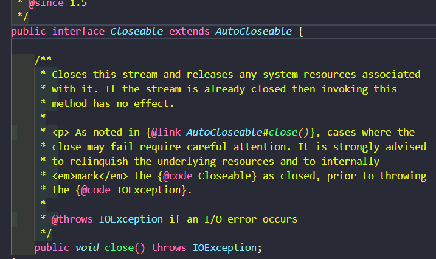

- You can also use **try-catch-with-resources**, to handle exception of your business code logic.

```
import java.io.BufferedReader;
import java.io.IOException;
import java.io.InputStreamReader;
import java.util.Scanner;

public class AboutResources {
    public static void main(String[] args) throws IOException {
        
        
        try(
            // Mention your resources related statements over here
            BufferedReader br = new BufferedReader(new InputStreamReader(System.in));
            Scanner sc = new Scanner(new InputStreamReader(System.in))
        ){
            System.out.println("Enter a input for Buffer Reader: ");
            int n1=Integer.parseInt(br.readLine());
            System.out.println("Enter a input for Scanner: ");
            int n2=sc.nextInt();
            System.out.println(n1+n2);
            throw new ArithmeticException();
        }catch(ArithmeticException e){
            System.out.println("Catch block");
        }
    }
}


Output:
Enter a input for Buffer Reader:
12
Enter a input for Scanner:
13
25
Catch block
```

- Lets create our own class which will act like a resource and lets see how our customize resource gets closed automatically. Now to implement auto closing of resources we need to implement **AutoCloseable**.

```
class CustomResource implements AutoCloseable {
    private boolean isClosed = false;

    public void doSomething() {
        if (isClosed) {
            throw new IllegalStateException("Resource is already closed!");
        }
        System.out.println("Doing something with the resource");
    }

    @Override
    public void close() {
        isClosed = true;
        System.out.println("Resource closed");
    }

    public boolean isClosed() {
        return isClosed;
    }
}
```

- Lets create a **try-with-resources** block for our customize class.

```
public class AboutResources {
    public static void main(String[] args) throws IOException {

        try (CustomResource custResource = new CustomResource();
            ) {
                custResource.doSomething();
        }catch(Exception e){
            System.out.println("Business Logic Exception");
        }
    }
}

Output:
Doing something with the resource
Resource closed
```

- Now what if , in your try statements somewhere your **custResource** got assigned as `null`? it would certainly raised to `NullPointerException` while auto closing at the end of try block right? , but it won't.

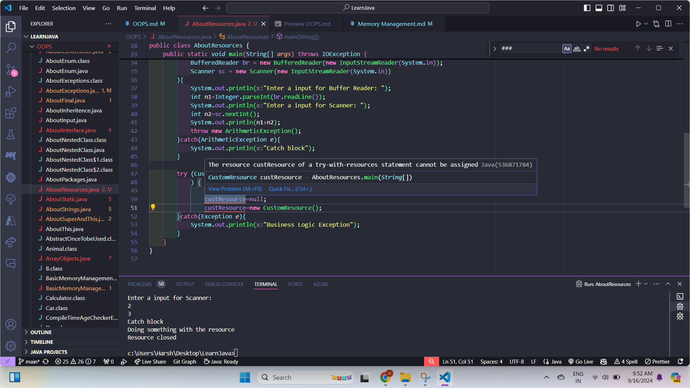

- This is because inside the try block statement **you cannot assigned the resource variables thus avoiding any kind of exception related to the resources variables**.
- However, making purposely `null` during initialzation will give you `NullPointerException`.

```

        try (CustomResource custResource = null
            ) {
                custResource.doSomething();
        }catch(Exception e){
            System.out.println("Business Logic Exception");
        }

Output:
Business Logic Exception
```

- But do you think, the resources threw exception due to `close()` closing it? nope it threw exception due to `custResource.doSomething()`.

```
        try (CustomResource custResource = null
        ) {
        }
        System.out.println("Code Executed");

Output:
Code Executed
```

- If you purposely assign `null` to a resource in a **try-with-resources** block, it will not throw a `NullPointerException` **when attempting to close it. The try-with-resources construct safely skips closing if the resource is null**. However, if you try to use the `null` resource inside the try block (e.g., calling a method on it like `custResource.doSomething()` ), then a `NullPointerException` will be thrown.

## Threads

- Imagine you have a team working on a project. Each team member can perform a task independently, like writing code, designing, or testing. All of them are part of the same project but work simultaneously on different parts to finish faster. 
- Similarly, a thread is an independent path of execution in a program that allows multiple tasks to run at the same time.
- If there is a process with five tasks and it takes 10 mins to complete sequentially, the process can complete within 2 mins by five parallel tasks. 

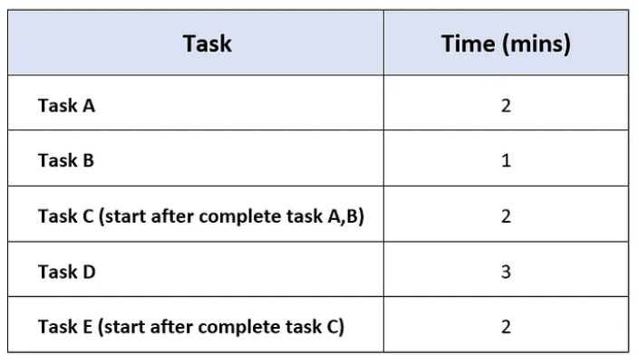

- When considering an enterprise-level application, there are hundreds of tasks and it will be more efficient if the programmer divides them into multiple threads properly.
- Technically, a Thread is a very light-weighted process, or we can say the smallest part of the process that allows a program to operate more efficiently by running multiple tasks simultaneously. All the tasks are executed without affecting the main program. In a program or process, all the threads have their own separate path for execution, so each thread of a process is independent.

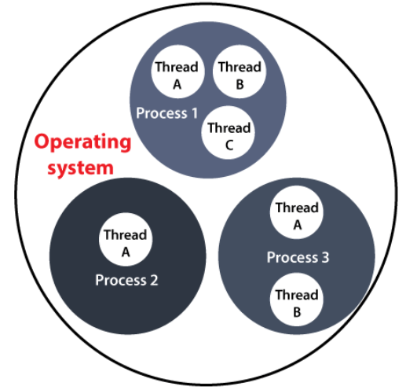

- Another benefit of using thread is that if a thread gets an exception or an error at the time of its execution, it doesn't affect the execution of the other threads. All the threads share a common memory and have their own stack, local variables etc.. When multiple threads are executed in parallel at the same time, this process is known as **Multithreading**.

### Lifecycle

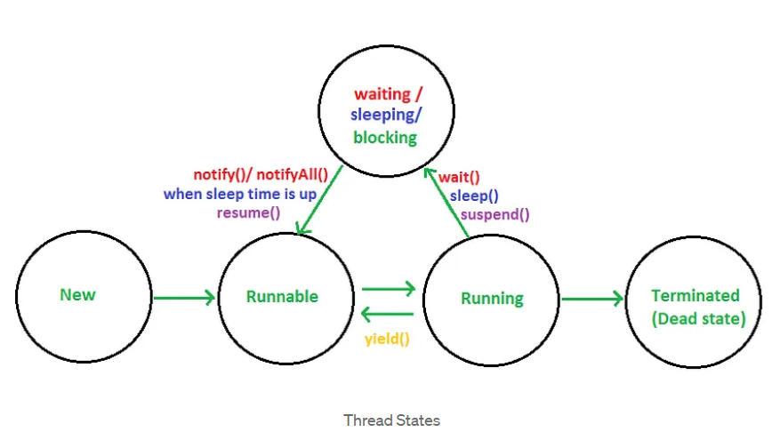

- The life cycle of the thread in java is controlled by JVM. There are five states a thread can stay from birth to death. Whenever a thread goes to the death state that cannot be revert.
    - **New** — The thread is created but hasn’t started yet.
    - **Runnable (Ready to Run)** — The thread is ready to run, but the **thread scheduler** has not selected it to be the running thread.
    - **Running** — The thread is in the running state if the thread scheduler has selected it.
    - **Waiting/Sleeping/Blocking** — This is the state when the thread is still alive but is currently not eligible to run.
    - **Terminated** — The thread has finished executing.

- Lets take a simple program to create a thread. Any Object class which must be treated as threads must **extends the class threads**. Now any class which extends **Thread** class , if they want to start thread execution , it must override the `run()` method of thread class.

```
class ThreadLifecycleDemo extends Thread {

    // Constructor - Thread is in the "New" state after creation
    public ThreadLifecycleDemo() {
        System.out.println("Thread created, but not started yet (NEW state).");
    }

    // The run() method defines the behavior of the thread when it's running
    @Override
    public void run() {
        try {
            // Thread is in "Runnable" state but not yet selected for running
            System.out.println("Thread is in Runnable state and may enter Running state soon.");

            // Simulate the thread entering "Running" state
            System.out.println("Thread is now Running.");

            // Simulate thread going to "Waiting/Sleeping/Blocking" state
            Thread.sleep(2000); // Thread will sleep for 2 seconds
            System.out.println("Thread is now in Sleeping/Waiting state for 2 seconds.");

        } catch (InterruptedException e) {
            System.out.println("Thread was interrupted.");
        }

        // Thread finishes execution and enters the "Terminated" state
        System.out.println("Thread has finished execution (TERMINATED state).");
    }

}

public class AboutThreads{
    public static void main(String[] args) {
        // Thread is in the "New" state when it's created
        ThreadLifecycleDemo thread = new ThreadLifecycleDemo();

        // Start the thread - It moves to "Runnable" state
        thread.start(); // This puts the thread in the Runnable state

        // After this point, the lifecycle is controlled by the JVM (from Runnable -> Running -> Waiting -> Terminated)
    }
}

Output:
Thread created, but not started yet (NEW state).
Thread is in Runnable state and may enter Running state soon.
Thread is now Running.
Thread is now in Sleeping/Waiting state for 2 seconds.
Thread has finished execution (TERMINATED state).
```

- If you see `start()` method is not present in the class **ThreadLifecycleDemo**, behind the scene it calls the `run()` method and these threads are managed using **Thread Schedular**.

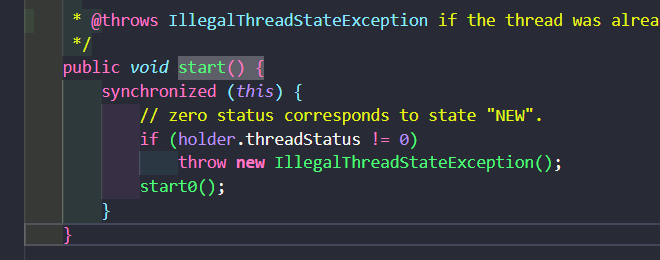

#### Thread scheduler

- The thread scheduler is managed by the JVM (Java Virtual Machine). Thread scheduler decides which thread to run or execute and which thread to wait is called a thread scheduler in Java. In Java, a thread is only chosen by a thread scheduler if it is in the runnable state. However, if there is more than one thread in the runnable state, it is up to the thread scheduler to pick one of the threads and ignore the other ones.
- There are some criteria that decide which thread will execute first. There are two factors for scheduling a thread i.e. **Priority** and **Time of arrival**.
    - **Priority**: Priority of each thread lies between **1** to **10**. If a thread has a higher priority, it means that thread has got a better chance of getting picked up by the thread scheduler.
    - **Time of Arrival**: Suppose two threads of the same priority enter the runnable state, then priority cannot be the factor to pick a thread from these two threads. In such a case, arrival time of thread is considered by the thread scheduler. A thread that arrived first gets the preference over the other threads.
- Now on the basis of above two factors, there are 3 types of policies/algorithms defined for thread scheduler.

##### First Come First Serve Scheduling (non-preemptive):

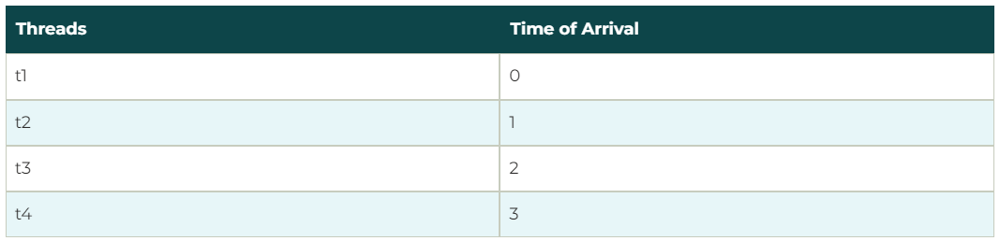

- In the above table, we can see that Thread t1 has arrived first, then Thread t2, then t3, and at last t4, and the order in which the threads will be processed is according to the time of arrival of threads. Hence, Thread t1 will be processed first, and Thread t4 will be processed last.


##### Time-slicing scheduling:

- Usually, the First Come First Serve algorithm is non-preemptive, which is bad as it may lead to infinite blocking (also known as starvation). To avoid that, some time-slices are provided to the threads so that after some time, the running thread has to give up the CPU. Thus, the other waiting threads also get time to run their job.

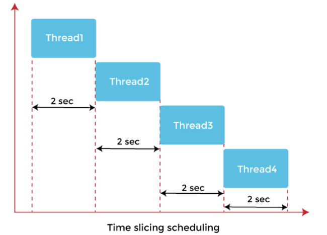

- In the above diagram, each thread is given a time slice of 2 seconds. Thus, after 2 seconds, the first thread leaves the CPU, and the CPU is then captured by Thread2. The same process repeats for the other threads too.

##### Preemptive-Priority Scheduling:

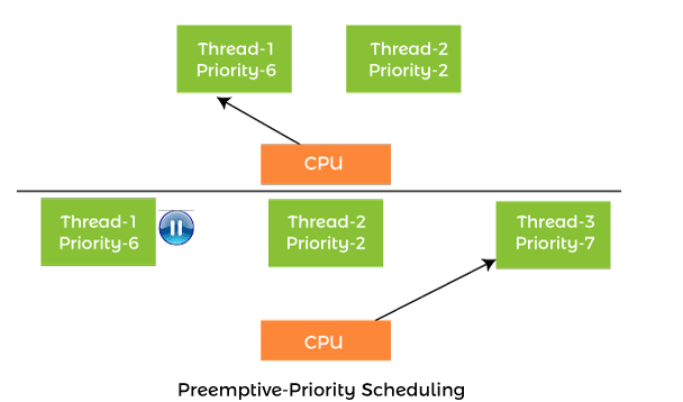

- Suppose there are multiple threads available in the runnable state. The thread scheduler picks that thread that has the highest priority. Since the algorithm is also preemptive, therefore, time slices are also provided to the threads to avoid starvation. Thus, after some time, even if the highest priority thread has not completed its job, it has to release the CPU because of preemption.

##### Working of the Java Thread Scheduler


- The JVM delegates thread scheduling to the underlying operating system. So, the behavior of thread scheduling may differ depending on the platform (Windows, Linux, etc.). Different systems may have different scheduling behavior based on their specific implementation.
- The JVM and the underlying operating system control the thread scheduler. You can influence thread execution by setting priorities or yielding execution, but there are no guarantees about the exact order of execution.
- However, different operating systems implement thread scheduling differently, so it's not always as predictable as it might seem, these scheduling policies are managed by the OS and may not be fully controlled by Java itself.

#### How Start method calls Run method In Thread class?


- When you create a Thread object (`ThreadLifecycleDemo thread = new ThreadLifecycleDemo();`). This thread is in the **NEW** state. It has been created but hasn't started executing yet.
- When you call `thread.start();`, the `start()` method does not directly run the `run()` method. Instead, it prepares the thread for execution and creates a new OS thread.
    - OS thread: The operating system itself creates and manages a thread at a lower level than Java. The JVM asks the OS to create a thread for it. Once the OS creates the thread, it runs independently of the main Java program. The OS manages this new thread alongside all other threads on your system (Java threads and non-Java threads alike).
- Inside `start()`, there's a check to make sure the thread hasn't already been started (`threadStatus != 0` ensures the thread is in the **NEW** state). If it has been started before, it throws an `IllegalThreadStateException`.
- After passing the check, the method calls `start0()`, which is a **native method**.
    - Native method: Native methods are methods written in a low-level language like C or C++, and they are platform-specific. This means that they interact directly with the underlying operating system. `start0()` is a native method that interacts with the operating system to create a new OS-level thread.
- Once the OS thread is running, the JVM automatically calls the `run()` method of your thread. If you’ve overridden `run()`, that method gets executed. If not, the default implementation of `run()` in the Thread class is called (which does nothing).
- If multiple threads are in the runnable state, the thread scheduler picks one based on factors like priority, arrival time, and OS-specific algorithms (like time-slicing or preemptive priority).
- The **synchronized** block is used to ensure that only one thread at a time can execute a specific section of code. It is used to handle concurrency issues by preventing multiple threads from accessing the same critical section simultaneously. This helps to prevent race conditions and ensures thread safety when accessing shared resources. When a thread enters a synchronized block, it acquires a lock on the object specified. Other threads trying to enter the same synchronized block (or any block synchronized on the same object) will be blocked until the lock is released.

### Multithreading

- Multithreading is a specific form of multitasking where a single process is divided into multiple threads that run simultaneously. These threads share the same memory space but perform different tasks independently. Threads are smaller units within a process. Unlike processes, threads within the same process share memory and resources, making communication between them easier and more efficient.
- Analogy, in a single kitchen, you have multiple chefs (threads) working on different tasks at the same time—one chef chopping vegetables, another boiling pasta, etc... They all share the same kitchen resources (like utensils and the stove).
- Lets take an example of Multithreading

```
class Thread1 extends Thread{

    @Override
    public void run(){
        for(int i=0;i<=100;i++){
            System.out.println("Thread 1");
        }
    }
}


class Thread2 extends Thread{

    @Override
    public void run(){
        for(int i=0;i<=100;i++){
            System.out.println("Thread 2");
        }
    }
}

public class AboutThreads{

    public static void main(String[] args) {

        Thread1 t1 = new Thread1();
        Thread2 t2 = new Thread2();
        t1.start();
        t2.start();
    }
}

Output:
Thread 1
Thread 1
Thread 2
Thread 2
Thread 2
Thread 2
Thread 2
Thread 2
Thread 1
Thread 1
Thread 2
Thread 2
Thread 2
...
```

- `t1` and `t2` are executing parallely. Here if you see the thread schedular is using Time-slicing scheduling. The JVM's thread scheduler will allocate CPU time to these thread. How to get the priority of `t1` and `t2`?

```
public class AboutThreads{

    public static void main(String[] args) {
        Thread1 t1 = new Thread1();
        Thread2 t2 = new Thread2();
        System.out.println("t1 - "+t1.getPriority()); // 5 - default priority assigned 
        System.out.println("t2 - "+t2.getPriority());
    }
}

Output:
t1 - 5
t2 - 5
```

- Can we change the priority of `t2` to 8? , you can do this using `t2.setPriority(8);` or `t2.setPriority(Thread.MAX_PRIORITY);` but you may don't get the expected output even after setting the priority.

```
Output:
Thread 1
Thread 1
Thread 1
Thread 1
Thread 1
Thread 2
Thread 2
...
```

- Thread priorities in Java range from 1 (lowest) to 10 (highest). The default priority is `Thread.NORM_PRIORITY` (5). By setting the priority of t2 to 8, you're indicating to the thread scheduler that `t2` should be given higher priority than threads with lower priority, such as `t1` ( it has the default priority).
- This is because the you are suggesting your OS schedular that this thread has the highest priority. Different OS has different schedular algorithms and multiple threads reaches out to the schedular so on the basis of priority or which thread is taking lowest time, the schedular runs those threads initially.
- Thread priority does not guarantee that the highest-priority thread will always run first or get more CPU time. Different operating systems handle thread scheduling differently. Some may honor thread priorities more strictly, while others may not. Hence, changing thread priority may not always produce the expected behavior.
- The OS scheduler uses its own internal logic to allocate CPU time to threads. It may consider factors like thread arrival time, CPU usage, or other system resources in addition to priority. Even though you've increased t2's priority, the scheduling algorithm may still switch between threads, or run threads with lower priority due to the time-slicing mechanism or other scheduling algorithms used by the OS.
- Now **Thread is a class**, if we wanted to make our class object as threads we need to extend this **Thread** class. But what if our class object is also extending another class? it would lead to multiple inheritence which is not supported by java right? in such cases we will use **Runnable**.

### Runnable

- We cannot do this.

```
class B extends A,Thread{
    // Not supported......
}
```

- But we can do this

```
class B extends A implements Runnable{
    //Statements
}
```

- If you see **Thread** class implements **Runnable**. Now inside the Runnable interface we have a method `run()`.

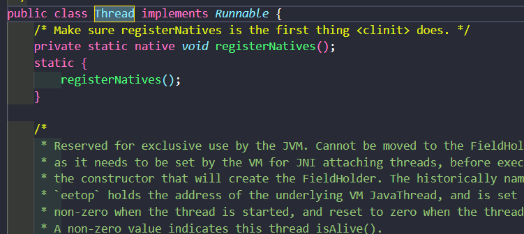

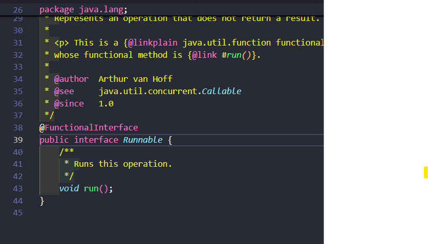

- If you see there is only one method, thus **Runnable** is a Functional Interface. But when we create a new thread (`new ThreadName()`) we use `start()` function right? it is not there inside **Runnable**? but what if we can pass the implementation of **Runnable** object while creating a thread? `new ThreadName(RunnableObjImpl)`.

```
class A{
    public void displayA(){
        System.out.println("In A");
    }
}

class B extends A implements Runnable{

    @Override
    public void run(){
        System.out.println("Running B Thread");
    }
}

public class AboutThreads{

    public static void main(String[] args) {
        B b = new B();  // B Class Object
        Thread tb = new Thread(b);  // Passing Runnable object to Thread since B class is implementation of Runnable
        tb.start();  // This will call the run() method of class B
        b.displayA();  // This will call the displayA() method inherited from class A
    }
}

Output:
In A
Running B Thread
```

### Synchronization

- Lets say you have a bank account which has 10K balance and suppose you are withdrawing money from ATM using your card (5K) and at the same time , at the same fraction of seconds you are also paying online of (6K) now this will lead to unstability wrto balance. In such case you may need to have priority and synchronize (sequentially execute) the request.
- Lets take an example **without synchronization**

```
class Counter{
    public static int i;
    public void increment(){
        i++;
    }
}

class C1 extends Thread{

    Counter c= new Counter();

    @Override
    public void run(){
        for(int i=0;i<=10000;i++){
            c.increment();
        }
    }
}

class C2 extends Thread{

    Counter c= new Counter();

    @Override
    public void run(){
        for(int i=0;i<=10000;i++){
            c.increment();
        }
    }
}

public class AboutThreads{

    public static void main(String[] args) {

        C1 c1 = new C1();
        c1.start();
        C2 c2 = new C2();
        c2.start();

        Counter c = new Counter();
        System.out.println(Counter.i);
    }
}
```

- So here we are expecting , the static variable `i` output will be **20002**. But it ain't. If you run several times the output you will get different values

```
Output:
1279

Output:
383

Output:
10001

Output:
1535

Output:
8312
```

- Why are we getting different values though? this is because when the main program execution is started, it creates two threads `c1` and `c2` and the job of main method is done. Then it prints the count of `i` , the main program does not waits for the execution of these two threads. So whatever the value will be of `i` update by these two threads during the time when the main program retrieve , that value is printed. So there are 3 threads, one for the main program, one for the `c1` and one for the `c2`.

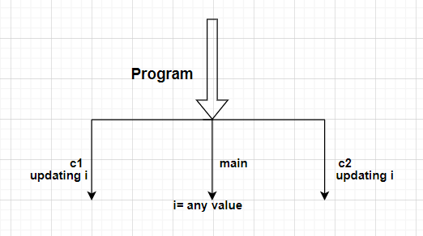

- So now we need to tell main program, that "Hey main program just wait for these two threads to finish their job , then your print it". We can do this using `join()`. `java.lang.Thread` class provides the `join()` method which allows one thread to wait until another thread completes its execution. `join()` method is a checked exception.

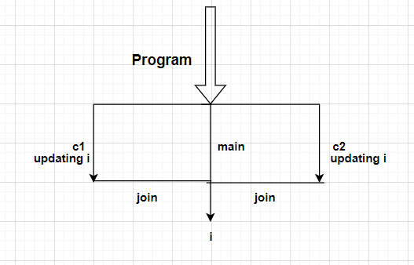

```
class Counter{
    public static int i;
    public void increment(){
        i++;
    }
}

class C1 extends Thread{

    Counter c= new Counter();

    @Override
    public void run(){
        for(int i=0;i<=10000;i++){
            c.increment();
        }
    }
}

class C2 extends Thread{

    Counter c= new Counter();

    @Override
    public void run(){
        for(int i=0;i<=10000;i++){
            c.increment();
        }
    }
}

public class AboutThreads{

    public static void main(String[] args) throws InterruptedException {
        C1 c1 = new C1();
        c1.start();
        C2 c2 = new C2();
        c2.start();

        c1.join();
        c2.join();

        Counter c = new Counter();
        System.out.println(Counter.i);
    }
}
```

- Post running lets check the output.

```
Output:
17646

Output:
20002

Output:
17498
```

- If you observe our output is not exact but it is getting closed, still why are we are not getting 20002 as output? this is because there are some possibilities where if `c1` has updated **i** value as 100 then `c2` might be also updating the value of **i** as 100 , thus 1 number got skipped. Now to prevent this lets used **Synchronization**.

```
class Counter{
    public static int i;
    public synchronized void increment(){
        i++;
    }
}

class C1 extends Thread{

    Counter c= new Counter();

    @Override
    public void run(){
        for(int i=0;i<=10000;i++){
            c.increment();
        }
    }
}

class C2 extends Thread{

    Counter c= new Counter();

    @Override
    public void run(){
        for(int i=0;i<=10000;i++){
            c.increment();
        }
    }
}

public class AboutThreads{

    public static void main(String[] args) throws InterruptedException {

        C1 c1 = new C1();
        c1.start();
        C2 c2 = new C2();
        c2.start();

        c1.join();
        c2.join();

        Counter c = new Counter();
        System.out.println(Counter.i);
    }
}

Output: (Always)
20002
```

- Java Synchronization is used to make sure by some synchronization method that only one thread can access the resource at a given point in time.
- When multiple threads access and modify shared data simultaneously, it can lead to inconsistent or incorrect results. Synchronization ensures that only one thread can access the critical section at a time, avoiding these issues. This is called as **Race condition**.
- Synchronization in Java is a mechanism used to control access to shared resources by multiple threads. It ensures that only one thread at a time can access a critical section of code or a shared resource, preventing race conditions and ensuring data consistency.
- **Synchronization keeps threads safe. By controlling the access to critical sections, synchronization helps prevent bugs like race conditions, deadlocks, and thread interference.**

#### Types of Synchronization

In Java, synchronization can be broadly classified into two types:

**1. Process Synchronization**
    - This deals with synchronization between different processes running on a machine. However, this is not directly supported by Java. Java primarily deals with Thread Synchronization, which happens within a single process (JVM).

**2. Thread Synchronization**
    - Thread synchronization is crucial when multiple threads are trying to access shared resources or perform tasks simultaneously, ensuring that only one thread can access the resource at a time.
    - It is further divided into Mutual Exclusion (Mutex) and Cooperation (Inter-thread communication in Java)

###### Mutual Exclusion (Mutex)

- This type of synchronization ensures that only one thread can access a critical section of code at any given time. It prevents race conditions by locking the resource so that other threads can't access it while the current thread is executing the synchronized code.
- Types of Mutual Exclusion:
1. Synchronized Method:

```
class Counter{
    public static int i;
    public synchronized void increment(){
        i++;
    }
}
```

2. Synchronized Block: A synchronized block is a smaller section of code that allows you to synchronize only a part of a method instead of the entire method. You can specify the object on which you want to synchronize.

```
class Counter {
    private int count = 0;

    public void increment() {
        // Synchronizing only this part of the method
        synchronized (this) {
            count++;
        }
    }

    public int getCount() {
        return count;
    }
}
```

3. Static synchronization: It means that when multiple threads try to access a static synchronized method, they all have to wait for one another because they are synchronized at the class level, not on individual objects. When you declare a method as synchronized (non-static), the lock is on the instance (object) of the class. Each object has its own lock. So, if you have multiple objects of the same class, different threads can call the synchronized method on different objects simultaneously, because each object has its own lock. When a method is declared static synchronized, the lock is on the class itself (shared across all instances of the class). No matter how many objects of the class are created, the static synchronized method can only be executed by one thread at a time for the entire class.

```
class SharedResource {
    private static int count = 0;

    // Static synchronized method locks the class, not the instance
    public static synchronized void increment() {
        count++;
    }
}
```

###### Cooperation (Inter-thread Communication)

- In Java, threads sometimes need to communicate with each other to work together efficiently. This is where the concept of cooperation comes in. It mainly revolves around methods like `wait()`, `notify()`, and `notifyAll()`, which help in thread communication and coordination. Types of Cooperation:

1. Wait and Notify (Inter-thread Communication):

- Imagine two workers sharing a task. Worker A can't proceed until Worker B finishes the first step. Worker A pauses (waits), and when Worker B is done, it lets Worker A know (notifies) to continue.
- The `wait()` and `notify()` methods are used for inter-thread communication. A thread that is waiting for a condition to be met can pause its execution using `wait()`, and another thread can resume its execution by calling `notify()`.

```
class SharedResource {
    private int number;
    private boolean ready = false;

    // Method called by Producer Thread
    public synchronized void produce(int value) throws InterruptedException {
        while (ready) {
            wait();  // Waits if ready (Thread 1 pauses here)
        }
        number = value;
        System.out.println("Produced: " + number);
        ready = true;
        notify();  // Notifies the Consumer Thread
    }

    // Method called by Consumer Thread
    public synchronized void consume() throws InterruptedException {
        while (!ready) {
            wait();  // Waits if not ready (Thread 2 pauses here)
        }
        System.out.println("Consumed: " + number);
        ready = false;
        notify();  // Notifies the Producer Thread
    }
}

class Producer extends Thread {
    SharedResource resource;

    Producer(SharedResource resource) {
        this.resource = resource;
    }

    public void run() {
        try {
            for (int i = 1; i <= 5; i++) {
                resource.produce(i);
            }
        } catch (InterruptedException e) {
            e.printStackTrace();
        }
    }
}

class Consumer extends Thread {
    SharedResource resource;

    Consumer(SharedResource resource) {
        this.resource = resource;
    }

    public void run() {
        try {
            for (int i = 1; i <= 5; i++) {
                resource.consume();
            }
        } catch (InterruptedException e) {
            e.printStackTrace();
        }
    }
}

public class WaitNotifyExample {
    public static void main(String[] args) {
        SharedResource resource = new SharedResource();

        // Create and start Producer and Consumer threads
        Producer producer = new Producer(resource);
        Consumer consumer = new Consumer(resource);

        producer.start();
        consumer.start();
    }
}

Output:
Produced: 1
Consumed: 1
Produced: 2
Consumed: 2
Produced: 3
Consumed: 3
Produced: 4
Consumed: 4
Produced: 5
Consumed: 5
```

2. Reentrant Lock:
-  Imagine you are in an office building, and you have a key (lock) to a specific meeting room. If you enter the room and lock it behind you, no one else can enter until you unlock the door.
- Now, if you leave the room to grab something and come back, you don't need to request the key again; you can use the same key to unlock the room multiple times while you're in control of it. This is because you already have access and are allowed to "re-enter" the room.
- This is similar to a Reentrant Lock: if a thread already holds the lock, it can enter the same lock-protected code again without needing to wait for the lock to be released and re-acquired.
- A Reentrant Lock allows one thread to lock a resource and ensures no other thread can access it until the lock is released. If a thread that has already locked a resource tries to lock it again (within the same method or a recursive method), it will be allowed to "re-enter" without being blocked.

```
import java.util.concurrent.locks.ReentrantLock;

class SharedResource {
    private int count = 0;
    private ReentrantLock lock = new ReentrantLock(); // Creating a ReentrantLock

    // Method to increment count safely using ReentrantLock
    public void increment() {
        lock.lock();  // Acquires the lock
        try {
            count++;
            System.out.println("Count: " + count);
        } finally {
            lock.unlock();  // Releases the lock
        }
    }
}

class IncrementThread extends Thread {
    SharedResource resource;

    IncrementThread(SharedResource resource) {
        this.resource = resource;
    }

    public void run() {
        for (int i = 0; i < 5; i++) {
            resource.increment();
        }
    }
}

public class ReentrantLockExample {
    public static void main(String[] args) {
        SharedResource resource = new SharedResource();

        // Create and start two threads that increment the shared count
        IncrementThread t1 = new IncrementThread(resource);
        IncrementThread t2 = new IncrementThread(resource);

        t1.start();
        t2.start();
    }
}


Output:
Count: 1
Count: 2
Count: 3
Count: 4
Count: 5
Count: 6
Count: 7
Count: 8
Count: 9
Count: 10
```

### Difference between Sleep, Wait and Block

- Imagine you're at a train station with multiple passengers (threads), each waiting for their train (task or resource).

1. **Sleep**:
    - A passenger decides to take a nap on the bench for a specific amount of time, setting an alarm. During this time, they are not waiting for anything specific (like a train or a signal); they just voluntarily rest for a fixed period.
    - The thread is paused for a set amount of time, and after that time, it automatically wakes up and resumes. It doesn't release any locks or resources which it might hold during this time. Just like a pause.

2. **Wait**:
    - A passenger is waiting for a specific train or announcement. They sit quietly, but they cannot board until they hear the correct announcement. While waiting, they give up their place in line so others can board or move forward. When the announcement comes, they get ready to board (resume their task).
    - A thread calling `wait()` is waiting for a signal (called a notification). While waiting, it releases any locks it holds, allowing other threads to proceed. The thread will only wake up when another thread calls `notify()` or `notifyAll()`.

3. **Block**:
    - A passenger wants to board the train (access a resource), but the platform is already full of people. They can't proceed until the platform clears up. So, they are blocked and can't move forward until space is available.
    - A thread is blocked when it's waiting for a resource to become available.

```
public class AboutThreads2 {

    private static final Object lock = new Object();

    // Example of a thread using sleep (Taking a nap)
    static class SleepThread extends Thread {
        @Override
        public void run() {
            try {
                System.out.println("SleepThread: I'm going to take a nap for 2 seconds.");
                Thread.sleep(2000);  // Sleep for 2 seconds
                System.out.println("SleepThread: I'm awake now after sleeping.");
            } catch (InterruptedException e) {
                e.printStackTrace();
            }
        }
    }

    // Example of a thread using wait (Waiting for a train announcement)
    static class WaitThread extends Thread {
        @Override
        public void run() {
            synchronized (lock) {
                try {
                    System.out.println("WaitThread: I'm waiting for a notification (train announcement).");
                    lock.wait();  // Release the lock and wait for notification
                    System.out.println("WaitThread: I got the notification, time to proceed!");
                } catch (InterruptedException e) {
                    e.printStackTrace();
                }
            }
        }
    }

    // Example of a thread getting blocked (Waiting for a busy platform)
    static class BlockThread extends Thread {
        @Override
        public void run() {
            System.out.println("BlockThread: I'm trying to get on the platform (acquire the lock).");
            synchronized (lock) {
                System.out.println("BlockThread: I got on the platform (acquired the lock) and now I'm working.");
                try {
                    Thread.sleep(3000);  // Simulate work on the platform
                } catch (InterruptedException e) {
                    e.printStackTrace();
                }
                System.out.println("BlockThread: I'm done, releasing the platform.");
            }
        }
    }

    public static void main(String[] args) {
        // Start the SleepThread (takes a nap)
        SleepThread sleepThread = new SleepThread();
        sleepThread.start();

        // Start the BlockThread (tries to acquire the lock)
        BlockThread blockThread = new BlockThread();
        blockThread.start();

        // Wait a little to make sure BlockThread acquires the lock first
        try { Thread.sleep(100); } catch (InterruptedException e) { e.printStackTrace(); }

        // Start the WaitThread (waits for notification)
        WaitThread waitThread = new WaitThread();
        waitThread.start();

        // Notify the waiting thread after BlockThread is done
        try {
            blockThread.join();  // Wait for BlockThread to finish
            synchronized (lock) {
                System.out.println("MainThread: Sending the notification (train announcement).");
                lock.notify();  // Notify the WaitThread
            }
        } catch (InterruptedException e) {
            e.printStackTrace();
        }
    }
}


Output:
SleepThread: I'm going to take a nap for 2 seconds.
BlockThread: I'm trying to get on the platform (acquire the lock).
BlockThread: I got on the platform (acquired the lock) and now I'm working.
SleepThread: I'm awake now after sleeping.
BlockThread: I'm done, releasing the platform.
WaitThread: I'm waiting for a notification (train announcement).
MainThread: Sending the notification (train announcement).
WaitThread: I got the notification, time to proceed!
```

### Why are threads required?

- Threads allow multitasking via multithreading. They help in executing multiple tasks simultaneously, which improves the performance of programs, especially when dealing with tasks like handling multiple users, processing data, or performing background tasks without blocking the main operations.
- For example, if you're using a word processor, one thread can handle typing while another thread might save your document in the background. This makes the program more efficient and responsive.

### Types of Threads

**1. User Threads:**
    - User threads, also known as application threads, are threads that are explicitly created by the programmer to perform specific tasks. They play a direct role in the main functionality of the application. User threads continue executing until their task is completed or until the application explicitly terminates them.
    - They keep the application running as long as they are alive.
    - All above examples we have seen are user threads.
**2. Daemon Threads:**
    - Daemon threads are threads that provide support to user threads. They run in the background and are considered "service" threads. Unlike user threads, daemon threads do not prevent the JVM from exiting, even if they are still running. When all user threads have finished executing, the JVM terminates, abruptly stopping any remaining daemon threads.
    - Daemon threads are commonly used for tasks such as automatic memory management (garbage collection) or other housekeeping activities that should not delay the program's termination.

### String Builder are thread safe why?

- When we open its implementation, we get the **synchronized** keyword used against string operations.

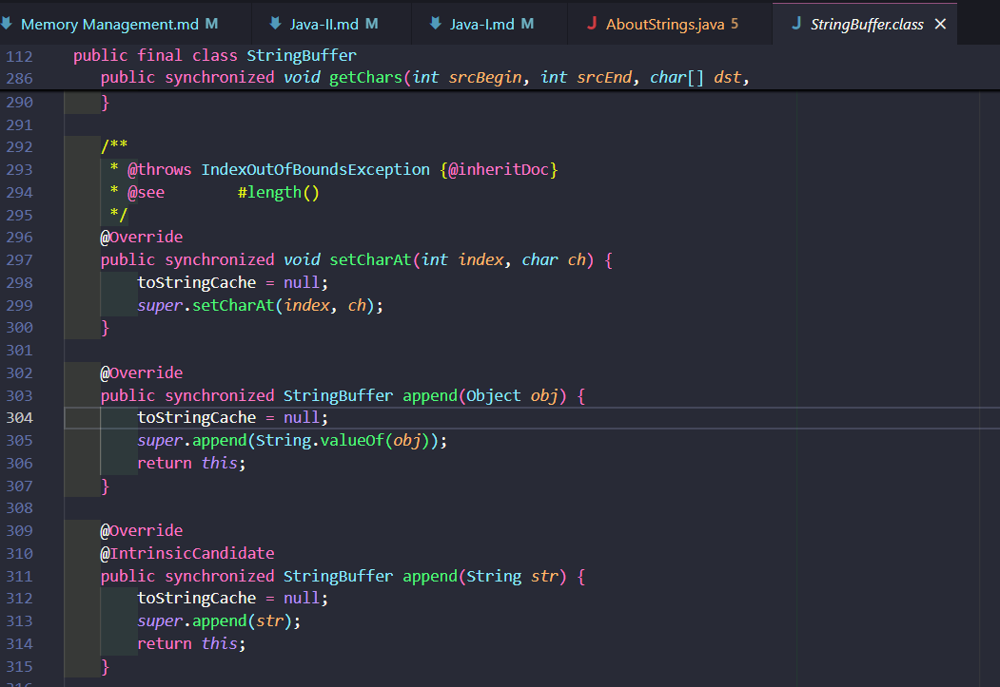

- Internally, StringBuffer uses a monitor (a lock) to ensure that only one thread can execute a method on the object at a time.
- When a thread calls a method on a StringBuffer, it acquires the lock.
- If another thread tries to access the same StringBuffer object while the lock is held, it will have to wait until the first thread releases the lock.
- This synchronization mechanism ensures that the internal state of the StringBuffer remains consistent even in a multithreaded environment.
- The synchronization overhead in StringBuffer makes it slower than StringBuilder, especially in single-threaded environments where thread safety is not a concern. If you're working in a single-threaded environment, using StringBuffer introduces unnecessary synchronization, which can impact performance.


## Finalize

- In Java, the `finalize()` method was part of the object cleanup process. It was called by the garbage collector before an object was removed from memory, giving the object a chance to release resources like file handles or network connections.
- The method was intended to allow an object to clean up resources before the object is destroyed by the garbage collector. For example, it could close files, release locks, or free memory for native resources.
- Just before destroying any object, the garbage collector always calls `finalize()` method to perform clean-up activities on that object. This process is known as Finalization in Java.
- However, it was not guaranteed when or even if the method would be called. The garbage collector decides when to perform garbage collection, and an object might not be finalized if the program exits before GC is triggered.
- **Finalize is not a keyword it is only a method under `java.lang.Object` class**. 
- Lets see an example by overriding `finalize()` , here we will manually release the resources which were taken by our object.

```

class Resource {
    public Resource() {
        System.out.println("Taken Resource for reading data from files");
    }

    // Override the finalize() method
    @Override
    protected void finalize() throws Throwable {
        try {
            System.out.println("Resource released explicitly in finalize(), read all the data from files");
        } finally {
            // Call the superclass finalize() method to ensure proper cleanup
            super.finalize();
        }
    }
}

public class AboutFinalize{

    public static void main(String args[]){
        Resource res = new Resource();
        res = null; // Make the object eligible for garbage collection

        System.out.println("Main method ends.");
    }
}


Output:
Taken Resource for reading data from files
Main method ends.
```

- If you see our the `finalize()` method is not called, why so? because the garbage collector is not called because when the garbage collector method is called then only the `finalize()` method will be invoked. How to called garbage collector? using `System.gc()`.

```

class Resource {
    public Resource() {
        System.out.println("Taken Resource for reading data from files");
    }

    // Override the finalize() method
    @Override
    protected void finalize() throws Throwable {
        try {
            System.out.println("Resource released explicitly in finalize(), read all the data from files");
        } finally {
            // Call the superclass finalize() method to ensure proper cleanup
            super.finalize();
        }
    }
}

public class AboutFinalize{

    public static void main(String args[]){
        Resource res = new Resource();
        res = null; // Make the object eligible for garbage collection

        // Requesting garbage collection (not guaranteed)
        System.gc();

        System.out.println("Main method ends.");
    }
}


Output:
Taken Resource for reading data from files
Resource released explicitly in finalize(), read all the data from files
Main method ends.
```

- Lets run the above program multiple times, and now you may get the below output.

```
Output:
Taken Resource for reading data from files
Main method ends.
Resource released explicitly in finalize(), read all the data from files
```

- Why so? like we saw above **`However, it was not guaranteed when or even if the method would be called. The garbage collector decides when to perform garbage collection, and an object might not be finalized if the program exits before GC is triggered`**. We get this output due to the **non-deterministic nature of the garbage collector in Java**.
- The garbage collector (GC) is managed by the JVM, and its execution timing is not predictable. It runs in the background, concurrently with the rest of your program. When you call `System.gc()`, you are only requesting the garbage collector to run, but there’s no guarantee that it will run immediately or even at all. The JVM decides when it's necessary to free memory. The garbage collection process may run on a separate thread, concurrently with the execution of your main thread (where the `main()` method is running).
So, your `main()` method might continue executing (printing "Main method ends.") while the JVM considers whether or not to perform garbage collection at that time.
- **Two Scenarios**:
    - When `Main method ends.` is printed before `Resource released explicitly in finalize(), read all the data from files`
        - This is the case when the `main()` method finishes executing before the garbage collector runs. You requested GC using `System.gc()`, but the JVM has not immediately responded to the request. 
    - When `Main method ends.` is printed after `Resource released explicitly in finalize(), read all the data from files`
        - In this case, the JVM decided to perform garbage collection promptly after the `System.gc()` call. As a result, the garbage collector calls `finalize()` before the `main()` method prints `Main method ends.` 

- Have you noticed the below snip in our above code?

```
finally {
            // Call the superclass finalize() method to ensure proper cleanup
            super.finalize();
        }
```

- We are already overriding `finalize()` method releasing our resources then why again calling `super.finalize()`?, lets say your class is extending another class , your base class or child class has clean up activities written inside your override finalize method, but your parent class does not, then in this case `super.finalize()` will help you to perform clean up activities of your parent class as well. Apart from that if you miss any of the clean up activity for a particular resource, `super.finalize()` will do the needful. 
- `super.finalize()` in the object class may include important cleanup operations which are part of JVM's default mechanism for object cleaning. So it is better to follow with this convection.

### Drawbacks of finalize

- It added overhead to garbage collection. Thus giving performance issue
- It was unreliable because there was no guarantee of timely execution. The garbage collector may delay the finalization, leading to resource leaks if not handled properly.

### Alternative `try-with-resource`

- **Starting from Java 9, the `finalize()` method was deprecated, and Java strongly discourages its use. The preferred way to manage resources now is through the `AutoCloseable` interface and the `try-with-resources` statement. It is always suggested that instead of finalize use `try-with-resource` block as it provides `AutoCloseable` interface, ensuring the resources are close immediately after the try block execution is finished**.


## File Handling

- In File handling, we will create, read, write/update and delete file. So now we need to use **Streams**, now there are two streams.

1. Byte Stream (`FileInputStream`, `FileOutputStream`) is preferred for handling binary files like images or videos.

2. Character Stream (`FileReader`, `FileWriter`) is preferred for handling text files, as they properly handle character encoding.

- Lets use first character stream, first we will create a new file, write contents in it, update contents in it then read the file . Post all operations we will delete that file. Here we will be creating text file which will consist of characters.

```
import java.io.File;
import java.io.FileReader;
import java.io.FileWriter;
import java.io.IOException;


public class AboutFileHandling {
    public static void main(String[] args) {
        String filePath = "characterStreamExample.txt";

        /**
         * Here we are using try-with-resource block to close resources
         */

        // Step 1: Create and Write initial content to the file
        try (FileWriter writer = new FileWriter(filePath)) {
            writer.write("Hello, world!\n");
            writer.write("This is the first content.\n");
            System.out.println("File created and initial content written.");
        } catch (IOException e) {
            e.printStackTrace();
        }

        // Step 2: Update the content of the file (append new content)
        try (FileWriter writer = new FileWriter(filePath, true)) { // 'true' enables appending
            writer.write("This is the updated content.\n");
            System.out.println("File updated with new content.");
        } catch (IOException e) {
            e.printStackTrace();
        }

        // Step 3: Read the content of the file
        try (FileReader reader = new FileReader(filePath)) {
            int data;
            System.out.println("Reading file content:");

            /**
             * When you read data using FileReader, the stream decodes the bytes from the file 
             * and converts them into their corresponding Unicode values (integers). 
             * This is why the FileReader.read() method returns an int — 
             * because it's returning the Unicode code point of the character, not the raw byte data.
             * 
             * Example: The byte sequence representing "A" in UTF-8 might be 0x41. 
             * When you read it using FileReader, it converts this byte into the Unicode value 65 
             * (which is the Unicode value for the character 'A').
             * 
             * Casting this int to a char gives you the actual character that corresponds to the Unicode code point
             * -1 is used in the read() method in Java is to signal the end of the file (EOF).
             * 
             * Why -1? 
             *  - Valid character/byte values (usually between 0 and 65535 for char values, or 0 to 255 for byte values).
             * -1 is used as a sentinel value to signal that there is no more data to read (i.e., you've reached the end of the file).
             */

            while ((data = reader.read()) != -1) {
                System.out.print((char) data);  // Output file content character by character
            }
        } catch (IOException e) {
            e.printStackTrace();
        }

        // Step 4: Delete the file
        File file = new File(filePath);
        if (file.delete()) {
            System.out.println("\nFile deleted successfully.");
        } else {
            System.out.println("\nFailed to delete the file.");
        }
    }
}


Output:
File created and initial content written.
File updated with new content.
Reading file content:
Hello, world!
This is the first content.
This is the updated content.

File deleted successfully.
```

- The purpose of using byte stream handling binary files like images or videos since it does not requires character conversion, though we can still use byte stream for text files , here we need to explicitly convert the bytes into unicode number then from unicode number to character.

```
import java.io.File;
import java.io.FileInputStream;
import java.io.FileOutputStream;
import java.io.FileReader;
import java.io.FileWriter;
import java.io.IOException;
import java.nio.charset.StandardCharsets;

public class AboutFileHandling {
    public static void main(String[] args) {
        String BytefilePath = "byteStreamExample.txt";
        
        // Step 1: Create and write initial content to the file using FileOutputStream
        try (FileOutputStream outputStream = new FileOutputStream(BytefilePath)) {
            String initialContent = "Hello, world..!\nThis is the first content.\n";
            outputStream.write(initialContent.getBytes(StandardCharsets.UTF_8));
            System.out.println("File created and initial content written.");
        } catch (IOException e) {
            e.printStackTrace();
        }

        // Step 2: Update the file (append new content)
        try (FileOutputStream outputStream = new FileOutputStream(BytefilePath, true)) { // 'true' enables appending
            String updatedContent = "This is the updated content.\n";
            outputStream.write(updatedContent.getBytes(StandardCharsets.UTF_8));
            System.out.println("File updated with new content.");
        } catch (IOException e) {
            e.printStackTrace();
        }

        // Step 3: Read the content of the file using FileInputStream
        try (FileInputStream inputStream = new FileInputStream(BytefilePath)) {
            byte[] data = new byte[inputStream.available()];
            int bytesRead = inputStream.read(data);
            if (bytesRead != -1) {
                String fileContent = new String(data, StandardCharsets.UTF_8);
                System.out.println("Reading file content:");
                System.out.println(fileContent);
            }
        } catch (IOException e) {
            e.printStackTrace();
        }

        // Step 4: Delete the file
        File bytefile = new File(BytefilePath);
        if (bytefile.delete()) {
            System.out.println("File deleted successfully.");
        } else {
            System.out.println("Failed to delete the file.");
        }
    }

}


Output:
File created and initial content written.
File updated with new content.
Reading file content:
Hello, world..!
This is the first content.
This is the updated content.
```


>[!NOTE]
> - Overwriting Behavior: `FileWriter` and `FileOutputStream` will overwrite an existing file without deleting it.
> - File Creation: If a file doesn't exist during a write or update operation, both streams will create a new file and write/update details
> - Deleting Non-existent File: `File.delete()` does not throw an exception if the file doesn't exist; it simply returns `false`.
> - Reading a Non-existent File: Trying to read from a non-existent file results in a `FileNotFoundException`.

