# Java Concepts

## Lambda Expression

- Lets say you have a Functional interface, and you implement this interface using anonymous class.

```
package Java2;

@FunctionalInterface
interface A{
    void show();
}


public class AboutLambdaExpression{
    public static void main(String[] args) {
        
        /**
         * Anonymous class
         */
        A a = new A() {
            public void show(){
                System.out.println("In A show");
            }
        };

        a.show();
    }
}

Output:
In A show
```

- You can reduce the above code to below code.

```
package Java2;

@FunctionalInterface
interface A{
    void show();
}


public class AboutLambdaExpression{
    public static void main(String[] args) {
        A a = () ->System.out.println("In A show");
        a.show();
    }
}

Output:
In A show
```

- This is an example of Lambda expression.
- The Lambda expression is used to provide the implementation of an interface which has functional interface or single abstract method interface. It saves a lot of code. In case of lambda expression, we don't need to define the method again (just like in anonymous class we had define `public void show()`) for providing the implementation. Here, we just write the implementation code.
- Lambda expression provides implementation of functional interface. Behind the scene , `()->` it is instantiating a `new A()`.
- Lets see how lambda expression works when there are parameters in your method.

```
@FunctionalInterface
interface B{
    void doubleTheValue(int i);
}

public class AboutLambdaExpression{
    public static void main(String[] args) {
        B b = (int val)->{
            System.out.println("Number entered : "+val);
            System.out.println("Doubled value is " +val*val);
        };
        b.doubleTheValue(5);
    }
}

Output:
Number entered : 5
Doubled value is 25
```

- Since we are using **one argument**, we can reduce the above implementation to below

```
        B b = val->{
            System.out.println("Number entered : "+val);
            System.out.println("Doubled value is " +val*val);
        };
        b.doubleTheValue(5);

Output:
Number entered : 5
Doubled value is 25
```

- Lambda expression not only makes your code concise and readable but also decrease your file size by eliminating **Anonymous class** `AboutLambdaExpression$1.class`. How but? when we compile a class which has anonymous class, check the size.

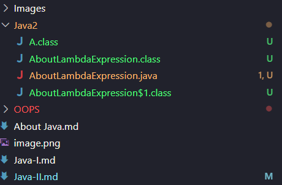

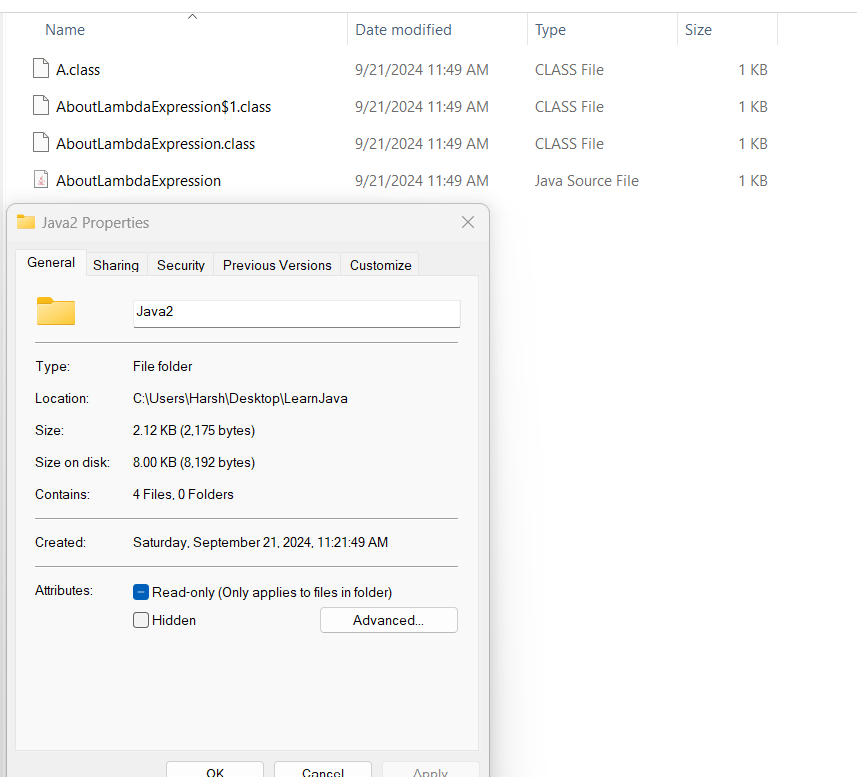

- When we use lambda expression.

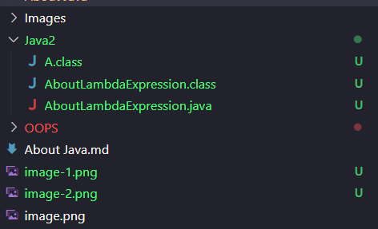

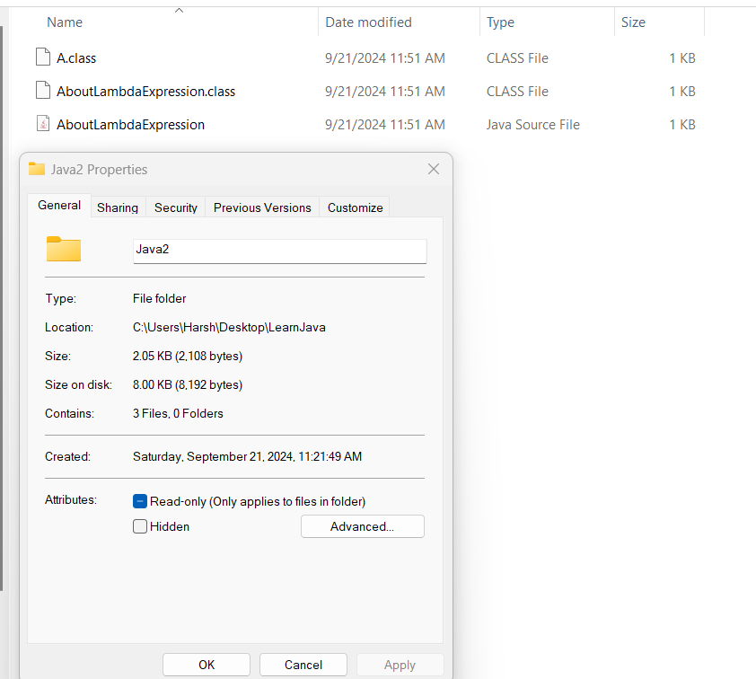

- See the difference in size and the file which got eliminated (`AboutLambdaExpression$1.class`) . 
- Thus, **Lambda expression don't generate .class files just like anonymous class**.
- If your functional interface have a method which returns something then in that case how to implement lambda expression?

```
@FunctionalInterface
interface Addition{
    int add(int n1,int n2);
}

public class AboutLambdaExpression{
    public static void main(String[] args) {
        Addition addvalues = (int i,int j) -> {
            return i+j;
        };
        System.out.println(addvalues.add(6, 5));
    }
}

Output:
11
```

- You can reduce the above code to below

```
        Addition addvalues = (int i,int j) ->  i+j;
        System.out.println(addvalues.add(6, 5));

Output:
11
```

- After `->` you don't need to add `return` keyword, the lambda expression handle that by itself.
- Lambda expression can only be used with functional interface because it only consist of one abstract method. Incase of multiple abstract methods it won't work because the statements of the lambda expression will wont't able to distinguish for which abstract method the implementation is written.


*There is a short hand of lambda expression called method reference which we will learn later*


## Generics

- Lets say you have a Box where you will keep numbers, string or float values. How can you implement this? since all these classes have their corresponding wrapper class, we can use **Object** has data type.

```

class Box{
    private Object item;

    public Object getItem() {
        return item;
    }

    public void setItem(Object item) {
        this.item = item;
    }

}
public class AboutGenerics{
    public static void main(String[] args) {
        
        Box b = new Box();
        b.setItem(123);
        int setNumber=(int)b.getItem(); // Type casting is required from Object (Parent class) to int
        System.out.println("Item set is "+setNumber);
    }
}

Output:
Item set is 123
```

- Now lets say you wanna store string value. Again you need to convert your value using `toString()`.

```

class Box{
    private Object item;

    public Object getItem() {
        return item;
    }

    public void setItem(Object item) {
        this.item = item;
    }

}
public class AboutGenerics{
    public static void main(String[] args) {
        
        Box b = new Box();
        b.setItem(123);
        int setNumber=(int)b.getItem(); // Type casting is required from Object (Parent class) to int
        System.out.println("Item set is "+setNumber);

        b.setItem("A String value");
        String setString=b.getItem().toString();
        System.out.println("Item set is "+setString);
    }
}

Output:
Item set is 123
Item set is A String value
```

- Similarly when you set any float values, you need to explicitly cast it. Now this approach has some drawbacks. 
- **It is not type safety, there is manual casting involved and when you compile your program without any editor, just by using CLI it will lead to compile time issues as well**
- So to overcome these drawbacks, we have concepts of **Generics**. Above in the code we made the Box class field as generic by using Object class. But now we will make the Box class itself as Generic.

```

class Box<T>{
    private T item;

    public T getItem() {
        return item;
    }

    public void setItem(T item) {
        this.item = item;
    }
}
public class AboutGenerics{
    public static void main(String[] args) {
        
        /**
         * Now we are specifying that our Box will be Integer (wrapper class of int)
         * This makes the Box fields as Type safe
         */
        Box<Integer> b = new Box<>(); // Or Box<Integer> b = new Box<Integer>();
        b.setItem(123);
        // int setNumber=(int)b.getItem(); // Type casting is required from Object (Parent class) to int (Without Generic)
        int setNumber=(int)b.getItem(); // No type casting is required
        System.out.println("Item set is "+setNumber);

        Box<String> bs = new Box<String>();
        bs.setItem("A String value");
        String setString=bs.getItem();
        System.out.println("Item set is "+setString);
    }
}

Output:
Item set is 123
Item set is A String value
```

- Generic types allow you to define a class, interface, or method with placeholders (type parameters) for the data types they will work with.
- This enables code reusability and type safety, as it allows you to create classes, interfaces, or methods that can operate on various types without needing to cast the value for each type.
- In simpler terms, generics allow you to write code that can work with any object type while ensuring type safety at compile time.
- A generic is defined with type parameters enclosed in angle brackets (`<>`). These parameters act as placeholders for the actual types that will be specified when creating instances of the class. Here when we used `<T>` , so instead of **T** we can use any other alphabets or group of it. Like below

```
class Box<G>{
    private G item;

    public G getItem() {
        return item;
    }

    public void setItem(G item) {
        this.item = item;
    }
}

OR

class Box<GENERIC>{
    private GENERIC item;

    public GENERIC getItem() {
        return item;
    }

    public void setItem(GENERIC item) {
        this.item = item;
    }
}
```

- Lets say you wanted to have a generic class that can have more than one type parameter. Suppose you wanted to define a pair which will have a key and its value.

```
// K - key, V - value
class Pair<K, V> {
    private K key;
    private V value;

    public Pair(K key, V value) {
        this.key = key;
        this.value = value;
    }

    public K getKey() {
        return key;
    }

    public V getValue() {
        return value;
    }
}


public class AboutGenerics{
    public static void main(String[] args) {
        Pair<String, Integer> pair = new Pair<>("Age", 30);
        System.out.println("Key: " + pair.getKey());   // Prints: Key: Age
        System.out.println("Value: " + pair.getValue()); // Prints: Value: 30
    }
}

Output:
Key: Age
Value: 30
```

- Here, the `Pair<K, V>` class has two type parameters `K` and `V`, and you can specify the types when you create an instance of `Pair`.

### Types of Generics

- Generic types allow you to define a class, interface, or method with placeholders (type parameters) for the data types they will work with.

#### Generic Classes

- All the above examples of generics belongs represents example of generic classes.
- Syntax:

```
public class ClassName<T> {
    private T type;

    public void setType(T type) {
        this.type = type;
    }

    public T getType() {
        return type;
    }
}
```

#### Generic Interfaces


- Interfaces can also be generic, allowing different implementations to specify the type parameters.

```
Interface Processor<T> {
    void process(T item);
}

class StringProcessor implements Processor<String> {
    @Override
    public void process(String item) {
        System.out.println("Processing: " + item);
    }
}

class NumberProcessor implements Processor<Integer>{
    @Override
    public void process(Integer item) {
        System.out.println("Processing: " + item);
    }
}

public class AboutGenerics{
    public static void main(String[] args) {
        StringProcessor sp= new StringProcessor();
        sp.process("String value '123'");
        NumberProcessor np= new NumberProcessor();
        np.process(123);
    }
}

Output:
Processing: String value '123'
Processing: 123
```

- Even you can make your interface implementation i.e class as generic parameter type but same parameter type.

```
interface Processor<T> {
    void process(T item);
}

class AnyProcessor<T> implements Processor<T>{
    @Override
    public void process(T item) {
        System.out.println("Processing: " + item);
    }
}
```

- Here we have a generic interface `Processor<T>`, and a generic class `AnyProcessor<T>` that implements the interface. `T` is a type parameter representing a placeholder for any type. The method `process(T item)` will accept an argument of type `T` when implemented by any class.
- Here **whatever the type is specified for the implementation class `AnyProcessor<T>` the same parameter type will go to the interface**. Thats why if we specify any other alphabet or word like `AnyProcessor<K>` this will lead to **error because `AnyProcessor<K>` is trying to introduce a new type parameter K instead of using the one that `Processor<T>` already provides.**
- The class `AnyProcessor<T>` already declares a type parameter `T`, and this parameter needs to match the type parameter `T` from `Processor<T>` that it implements. So, when you write `AnyProcessor<K>`, you are effectively trying to mismatch the generic type declared in the interface and the class.

#### Generic Methods

- Methods that introduce their own type parameters independent of the class's type parameters. Lets say you wanna print values inside the array of any data type. So you created a generic method.

```
class PrintUtility {
    public static <T> void printArray(T[] array) {
        for (T element : array) {
            System.out.println(element);
        }
    }
}

public class AboutGenerics{
    public static void main(String[] args) {


        // Using the generic method
        Integer[] intArray = {1, 2, 3};
        PrintUtility.printArray(intArray);

        String[] strArray = {"A", "B", "C"};
        PrintUtility.printArray(strArray);
    }
}

Output:
1
2
3
A
B
C
```

#### Generic Constructors

- Similarly like methods we can have generic constructor.

```
class PrintUtility {

    <T> PrintUtility(T item){
        System.out.println("Item is "+item);
    }

}

public class AboutGenerics{
    public static void main(String[] args) {
        PrintUtility pu = new PrintUtility("String");
    }
}

Output:
Item is String
```

#### Bounded Type Parameters

- You can restrict the parameter types that can be used as type arguments using bounded type parameters. So suppose lets say you wanna have a Box but only type it will accept is numbers like integer , float , double must be used not string , character or boolean data type. So you are bounding parameter or condition on your generic declaration.

```
// java.lang.Number is abstract class which is implemented by Wrapper classes like Integer , Float , Double.
class NumberBoundedBox<T extends Number>{

    public void process(T item){
        System.out.println("Processing item "+item);
    }
}


public class AboutGenerics{
    public static void main(String[] args) {

        NumberBoundedBox<Double> nbb= new NumberBoundedBox<>();
        nbb.process(5.6);

        /**
         * Implementing String will give compilation error
         * - Bound mismatch: The type String is not a valid substitute for the bounded 
         *   parameter <T extends Number> of the type NumberBoundedBox<T>
         */
        // NumberBoundedBox<String> nbb1= new NumberBoundedBox<>();
    }
}


Output:
Processing item 5.6
```

#### Multiple Bounded Type Parameters

- Lets say you have a interface (`SimpleInterface`) as well. You wanted to implement a Generic which **extends Number and implements SimpleInterface interface**. So such type of restrictions are multiple bounded parameters.

```
interface SimpleInterface{
    void process();
}

class SimpleClass{

}

class MyCustomClass extends SimpleClass implements SimpleInterface{

    public void process(){
        System.out.println("Processing..");
    }
}

class GenericMultipleBounded<T extends SimpleClass & SimpleInterface> {

    public void process(){
        System.out.println("In GenericMultipleBounded");
    }
}

public class AboutGenerics{
    public static void main(String[] args) {
        GenericMultipleBounded<MyCustomClass> gmb=new GenericMultipleBounded<>();
        gmb.process();
    }
}

Output:
In GenericMultipleBounded
```

- Another example

```
// Defining interfaces
interface Movable {
    void move();
}

interface Flyable {
    void fly();
}

// Generic class with multiple interface bounds
public class MultiBoundClass<T extends Movable & Flyable> {
    private T entity;

    public MultiBoundClass(T entity) {
        this.entity = entity;
    }

    public void performActions() {
        entity.move();
        entity.fly();
    }
}

// Class that implements both Movable and Flyable
class Bird implements Movable, Flyable {
    @Override
    public void move() {
        System.out.println("Bird is moving");
    }

    @Override
    public void fly() {
        System.out.println("Bird is flying");
    }
}
```

- You can specify multiple bounds for a generic type parameter using the `&` symbol (AND condition). Only interfaces and one class can be used with multiple bounds.
- **You cannot use the `||` (OR) condition. In Java generics, multiple bounds work with &, meaning the type must satisfy all the bounds.**


#### Upper Bounded Generic

- An upper-bound restricts the type parameter to be of a certain type or a subclass of that type. Consider below example

```
class UpperBoundExample<T extends Number> {
    private T value;

    public UpperBoundExample(T value) {
        this.value = value;
    }

    public void printValue() {
        System.out.println("Value: " + value);
    }
}

public class AboutGenerics{
    public static void main(String[] args) {
        UpperBoundExample<Integer> intObj = new UpperBoundExample<>(10);
        UpperBoundExample<Double> doubleObj = new UpperBoundExample<>(5.5);

        intObj.printValue();  // Output: Value: 10
        doubleObj.printValue();  // Output: Value: 5.5
    }
}

Output:
Value: 10
Value: 5.5
```

- `T extends Number` ensures that `T` can only be of type `Number` or its subclasses like `Integer`, `Double`, `Float`, etc.
In the main method, the UpperBoundExample class is instantiated with `Integer` and `Double` (both subclasses of `Number`)


#### Wildcards(?) in Generics

- Generics (`<T>`) define a type parameter that must be the same throughout the entire class, method, or interface.

```
class Box<T> {
    private T value;

    public void set(T value) {
        this.value = value;
    }

    public T get() {
        return value;
    }
}
```

- Here, when you instantiate the `Box<T>`, `T` could be `Integer`, `String`, or any other type, but the type remains the same for the entire object.
- So, `<T>` is a placeholder for a specific, fixed type. Now consider the below class and guess what will be the output?

```
class BoxWithoutWildCard<T> {
    public void inspect(BoxWithoutWildCard<T> item) {
        System.out.println(item);
    }
}

public class AboutGenerics{
    public static void main(String[] args) {
        BoxWithoutWildCard<Integer> integerBoxWithoutWild = new BoxWithoutWildCard<>();
        BoxWithoutWildCard<Double> doubleBoxWithoutWild = new BoxWithoutWildCard<>();
        /**
         * Compilation ERROR
         * The method inspect(BoxWithoutWildCard<Integer>) in the type BoxWithoutWildCard<Integer> 
         * is not applicable for the arguments (BoxWithoutWildCard<Double>)
         */
        integerBoxWithoutWild.inspect(doubleBoxWithoutWild);
    }
}

Compilation Error
```

- Here, `inspect(BoxWithoutWildCard<T> item)` forces the type to be the same. So, if you instantiate `BoxWithoutWildCard<Integer>`, the method will only accept `BoxWithoutWildCard<Integer>` objects, and it will reject any other type like `BoxWithoutWildCard<Double>`. **This is rigid.**
- Lets use wildcard (`?`) and check it.

```
class BoxWithWildCard<T> {
    public void inspect(BoxWithWildCard<?> item) {
        System.out.println(item);
    }
}

public class AboutGenerics{
    public static void main(String[] args) {
        BoxWithWildCard<Number> integerBoxWithWild = new BoxWithWildCard<>();
        BoxWithWildCard<Double> doubleBoxWithWild = new BoxWithWildCard<>();
        integerBoxWithWild.inspect(doubleBoxWithWild); // Accepts any parameter type.
    }
}

Output:
BoxWithWildCard@548c4f57
```

- Here, using `BoxWithWildCard<?>` tells the method that it doesn’t care if it’s `BoxWithWildCard<Integer>,` `BoxWithWildCard<Double>`, or any other type. **This way the type becomes unknown (?)**. Wildcard `?` provides flexibility because it don’t care about the exact type. It allows you to handle any type. Whereas `<T>` enforces consistency. It means that you are working with a specific type that is fixed throughout the code. You know the exact type at compile time (like `Integer`, `String`, etc.).
- You can also add bounded parameter like below

```
class BoxWithWildCard<T> {
    public void inspect(BoxWithWildCard<? extends Number> item) {
        System.out.println(item);
    }
}
```

- Wildcards (`?`) are typically used in method parameters or return types where you need flexibility. However, they cannot be used as type parameters for classes or interfaces themselves.
- Return type example

```
// Return a list that can contain any type of object
public List<?> getItems() {
    return new ArrayList<String>();
}
```

- Another example of wildcard generic

```
        ArrayList<?> aGenericList = new ArrayList<String>();
        aGenericList=new ArrayList<Integer>();
```

- Here instead we are able to change the collection type. This allows the variable to accept any type of ArrayList, **but you still can't add elements to it because the exact type remains unknown at compile-time.**

```
aGenericList.add("Hello");  // Compilation error!
aGenericList.add(42);       // Compilation error!
aGenericList.add(null);     // Allowed, because null can represent any type
```

- The reason you can't add items like "Hello" or 42 is because `aGenericList` is of type `ArrayList<?>`, and the exact type of `?` is unknown. The compiler cannot be sure whether it’s safe to add a String or an Integer because it doesn't know the real type of `?`.

>[!NOTE]
> - Consider below code
> ```
> class BoxWithWildCard<T> {
>    public void inspect(<?> item) { 
>       System.out.println(item);
>   }
> } // Compilation Error
> ```
> - Wildcard generic can't be used to declare a standalone parameter type like `<?> item`.
> - `T`  is a type parameter that represents a specific type, used for a generic class or method. `?` is a wildcard used with generic types (like `List<?>`, `BoxWithWildCard<?>` etc..)
> - **`Wildcards works with Generic, it does not operate independently`**.

#### Lower Bounded Generic

- A lower-bound restricts the type parameter to be of a certain type or a superclass of that type. Consider below example

```
class LowerBoundExample {

    public static void addNumbers(ArrayList<? super Integer> list) {
        for (int i = 1; i <= 5; i++) {
            list.add(i);
        }
    }
}

public class AboutGenerics{
    public static void main(String[] args) {
        ArrayList<Number> numberList = new ArrayList<>();
        LowerBoundExample.addNumbers(numberList);
        System.out.println(numberList); // Output: [1, 2, 3, 4, 5]
    }
}

Output:
[1, 2, 3, 4, 5]
```

- In this example, the `addNumbers` method accepts a list of any type that is a supertype of `Integer`. This means you can pass in a `ArrayList<Integer>`, a `ArrayList<Number>`, or even a `ArrayList<Object>`.

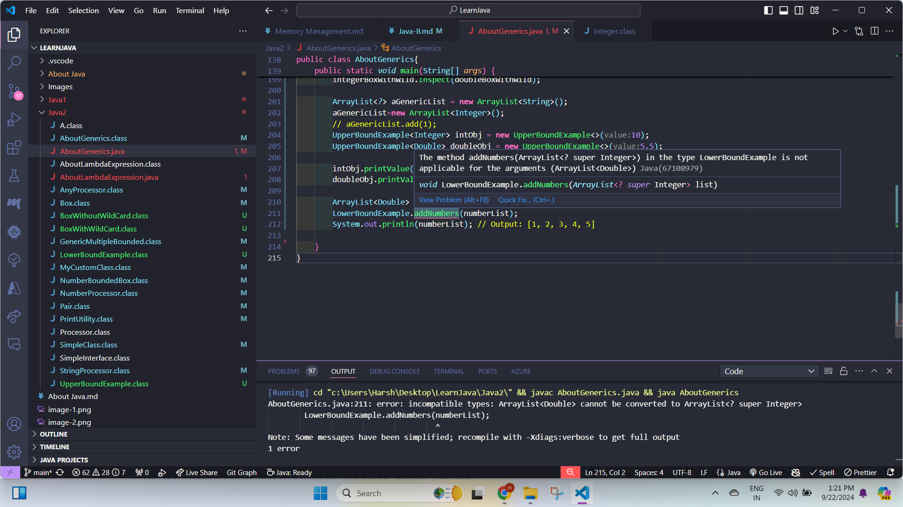

>[!NOTE]
> - Lower bounds (`<? super Something>`) are only valid with wildcards and are typically used in method parameters, not in class declarations.
> - Java doesn't allow `T super Something` in the type parameter definition in class or method.


## All About Collection

- Consider the example of a piggy bank. We all had it during our childhood where we used to store our coins. This piggy bank is called a Collection and the coins are nothing but objects.
- Technically, a collection is an object or a container that stores a group of other objects. A Collection in Java is an object which represents a group of objects, known as its elements.
- How these collections of data will be stored? , there are many ways to store or organize these data but below are the most prominent ways used by developers to store the elements.

**1. List**: In list, we can store elements in sequentially way in which they are added in the list. It can hold duplicates elements as well. Example, `[1,2,3]`, if we add `4` , then the list becomes `[1,2,3,4]`.


**2. Set**: In set, we can only store unique elements due to this collection displays unordered representation of elements. Example, `{1,2,3,4}` , if we add `4` , then the final result set may be any unordered elements `{2,4,3,1}` or `{3,1,2,4}` etc. But the elements will be unique


**3. Queue**: Imagine if you are standing to buy your movie tickets in queue, the first person to entered gets the first ticket, the last person gets the last ticket. So queue is one way of list where the elements are added at the tail of the list and remove from the front of the list. Thus in queue, Elements are added and removed in a FIFO (First-In-First-Out) order. Example `[1,2,3,4]`, adding `5`, the final queue become `[1,2,3,4,5]` , lets say we need to remove an element, so `1` which was is at the front of the list will be removed , so the final queue will be `[2,3,4,5]`.


**4. Map**: Lets take an example, each mobile number has a person or company name, now to store such type of data we require a collection which gonna perform some mapping like `{123456:"ABC",559450:"XYZ"}`. So such element collections is called Map.
- Now we got some idea how we will be storing our data. On it we can perform several operations like adding a new element, removing a new element, replacing a new element and so on. So there should be a standardize way to perform such operations on the **List**,**Set**,**Queue** and **Map**. These standardize way are define under an interface called Collections.

### Collection (Interface)

- The Collection interface acts like a blueprint or theory that defines what operations a collection should be able to perform. It specifies methods like `add()`, `remove()`, `size()`, but doesn't say how to implement these operations.

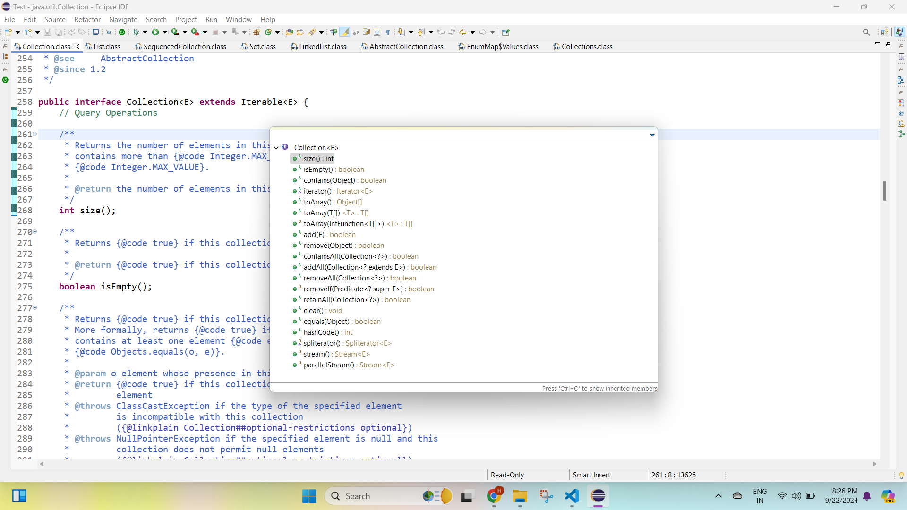

### List

- In Java, a List is an ordered collection of objects. This means that elements in a List have a specific sequence and can be accessed by their position (index).
- It can hold duplicate elements.
- Lets explore the **List.class** in java.

<video controls src="Images/java-2/20240922-1502-58.5039501.mp4" title="Title"></video>

- **List is an interface** which extends **SequencedCollection** , **SequencedCollection** extends **Collection** interface. If we checkout methods inside the list interface, it consist of method of SequencedCollection and Collection interface along with additional methods.
- SequencedCollection interface methods

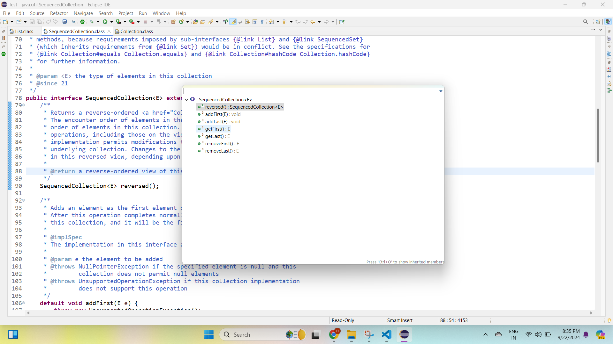

- List interface methods

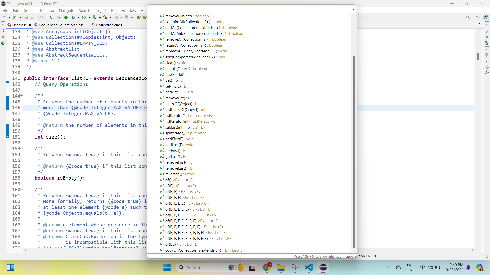

- Now list is an interface, we cannot work with interface we require classes to work with. Lets see the implementation of List.

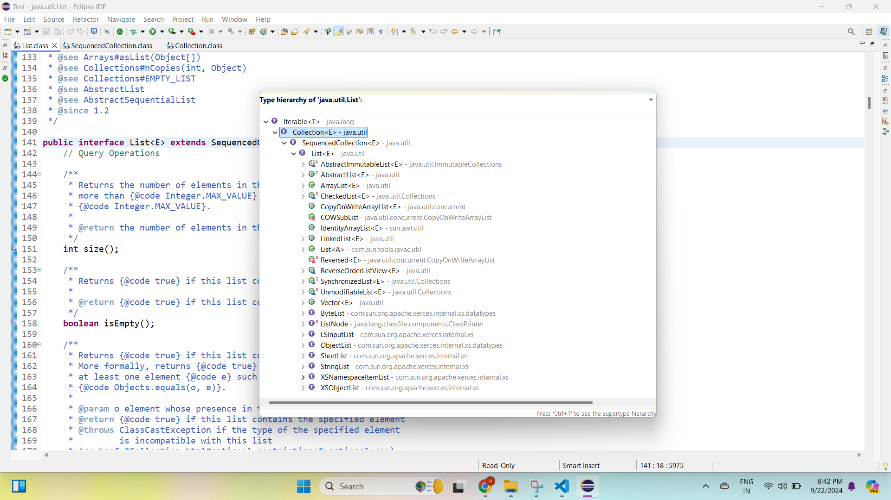

>[!NOTE]
> - We will not explore all its implementation, we will only explore the widely used implementation of list.

#### ArrayList

- We know what arrays are fixed size collections of elements. An ArrayList in Java is a dynamic array-based data structure that implements the List interface. It's resizable, meaning its size can grow or shrink as needed. It's efficient for random access of elements and provides methods for various operations.
- Lets see an example

```
import java.util.ArrayList;

public class AboutArrayList {
    public static void main(String[] args) {
        // 1. Create an ArrayList
        ArrayList<String> fruits = new ArrayList<>();

        // 2. Add elements to the ArrayList
        fruits.add("Apple");
        fruits.add("Banana");
        fruits.add("Orange");
        fruits.add("Grapes");
        System.out.println("Fruits: " + fruits);

        // 3. Get element by index
        String firstFruit = fruits.get(0);
        System.out.println("First Fruit: " + firstFruit);

        // 4. Update (set) an element at a particular index
        fruits.set(1, "Mango");
        System.out.println("Updated Fruits: " + fruits);

        // 5. Remove an element by index
        fruits.remove(2);
        System.out.println("Fruits after removing index 2: " + fruits);

        // 6. Check the size of the ArrayList
        int size = fruits.size();
        System.out.println("Size of the ArrayList: " + size);

        // 7. Iterate over the ArrayList
        System.out.println("Iterating over the ArrayList:");
        for (String fruit : fruits) {
            System.out.println(fruit);
        }

        System.out.println("Does list contain 'Mango'? " + fruits.contains("Mango"));


        // 8. Clear the ArrayList
        fruits.clear();
        System.out.println("Fruits after clearing: " + fruits);
    }
}


Output:
Fruits: [Apple, Banana, Orange, Grapes]
First Fruit: Apple
Updated Fruits: [Apple, Mango, Orange, Grapes]
Fruits after removing index 2: [Apple, Mango, Grapes]
Size of the ArrayList: 3
Iterating over the ArrayList:
Apple
Mango
Grapes
Does list contain 'Mango'? true
Fruits after clearing: []
```

##### Generics in ArrayList

- Consider the below code.

```
        ArrayList a1 = new ArrayList();
        a1.add("123");
        a1.add(123);
        a1.add(1.23);
        //Not Type Safe Array because manual casting is required
        String var=a1.get(0).toString();
```

- This declares a variable `a1` of type `ArrayList`. You are specifically using the `ArrayList` class to reference your list. Since you haven't specified a type within `< >,` this means you're using a raw type, which is not type-safe. You can add any type of object (like `String`, `Integer`, etc.), leading to potential issues at runtime.
- You might later try to retrieve an object assuming it's a String but encounter a `ClassCastException`.
- Thats why when we initialize an array list we need to declare the object type it gonna hold. Thus making it type safe.

```
ArrayList<String> a = new ArrayList<>();  // Type-safe, only allows Strings
a.add("Apple");  // This is valid
// a.add(100);   // Compile-time error! Can't add an integer
```

- Consider below code.

```
List<String> fruits = new ArrayList<>();
fruits.add("Apple");
fruits.add("Banana");
// fruits.add(100);  // Compile-time error, type safety enforced
```

- Here, you are declaring `fruits` as a `List` (the interface), but the actual implementation is still an `ArrayList`. This is good practice because you are programming to the interface (List), making your code more flexible (e.g., you could later switch to other implementation of list like `LinkedList` without changing the variable type). This is similar concept of dynamic method dispatch.

>[!NOTE]
> - `ArrayList` are not thread-safe. This means that if multiple threads try to access and modify the same `ArrayList` instance concurrently, it can lead to **inconsistent data**, **race conditions**, or **unexpected behavior**.


##### Internal Working of ArrayList

- Initial Capacity: When an ArrayList is created, it has a default capacity (usually 10).
- Growth: When you add elements beyond the current capacity, the ArrayList automatically increases its size by creating a new array (usually with 1.5 times the original size) and copying the old elements into the new array. The old array is discarded, and the new array becomes the underlying array of the ArrayList.
- Shrinking: While ArrayLists can grow dynamically, they don't automatically shrink when elements are removed. However, you can manually call the `trimToSize()` method to reduce the capacity of the ArrayList to the exact size of its current elements. This can be useful to optimize memory usage in cases where you know the final size of the list.

```
import java.util.ArrayList;

public class ArrayListExample {
    public static void main(String[] args) {
        ArrayList<Integer> list = new ArrayList<>();

        // Add elements
        for (int i = 0; i < 10; i++) {
            list.add(i);
        }
        
        System.out.println("Before Trim Capacity is: " + list.size());

        // Remove some elements
        list.remove(5);
        list.remove(7);
        
        // Shrink the array
        list.trimToSize();

        // Now the array capacity is exactly 8
        System.out.println("After Trim Capacity is: " + list.size());
    }
}

Output:
Before Trim Capacity is: 10
After Trim Capacity is: 8
```

##### Memory Management

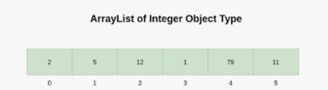

- Internally, an `ArrayList` uses a regular array (of type `Object[]`) to store the elements. The elements are placed in contiguous memory locations within this array.When an ArrayList is created, it allocates a continuous block of memory with a default initial capacity (usually 10). This means the memory for 10 elements is reserved, even if fewer elements are added initially.
- When the ArrayList exceeds its capacity (i.e., more than 10 elements), a new larger array is created, and the existing elements are copied into the new array. The new size is generally 1.5 times the previous size.
- The old array is discarded, and the new array occupies a new block of contiguous memory. The process of copying elements from the old array to the new one is known as "array resizing".
- The resizing operation involves memory allocation and copying, which can impact performance if it happens frequently. After resizing, there may be unused space (null slots) to accommodate future elements without resizing immediately. If the elements are not added then the space will be wasted.
- **If you are sure that there won't be more additions of element in future in your array list then go for `trimToSize()`, which will save your memory**.
- If you know the approximate number of elements you'll be adding to the ArrayList, you can use the `ensureCapacity()` method to improve performance by reducing the number of resize operations. This pre-allocates space to avoid frequent resizing.

```
ArrayList<Integer> numbers = new ArrayList<>();
numbers.ensureCapacity(100); // Pre-allocate space for 100 elements
```

#### LinkedList

- In Java, a `LinkedList` is a collection that implements the `List` interface and stores elements in a linear fashion. Unlike an `ArrayList`, which uses a dynamic array, a `LinkedList` uses a series of interconnected nodes to store its elements. Each node contains the data and references (or links) to the next nodes in the list.

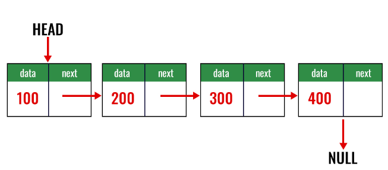

- **Node Structure**:
    - Data: The actual element being stored.
    - References: Pointers to the next node.
- Lets see an example

```
import java.util.LinkedList;
import java.util.List;

public class AboutLinkedList {
    public static void main(String[] args) {
        // Create a LinkedList of Strings
        LinkedList<String> list = new LinkedList<>();

        // 1. Adding elements to the LinkedList
        list.add("Apple");           // Add at the end
        list.addFirst("Banana");      // Add at the beginning
        list.addLast("Cherry");       // Add at the end
        list.add(2, "Date");          // Add at specific index

        System.out.println("Initial LinkedList: " + list);

        // 2. Accessing elements
        String firstElement = list.getFirst();     // Get first element
        String lastElement = list.getLast();       // Get last element
        String elementAtIndex = list.get(2);       // Get element at specific index

        System.out.println("First element: " + firstElement);
        System.out.println("Last element: " + lastElement);
        System.out.println("Element at index 2: " + elementAtIndex);

        // 3. Removing elements
        list.removeFirst();            // Remove first element
        list.removeLast();             // Remove last element
        list.remove(1);                // Remove element at index 1
        list.remove("Apple");          // Remove specific element

        System.out.println("After removals: " + list);

        // 4. Checking size of LinkedList
        int size = list.size();
        System.out.println("Size of LinkedList: " + size);

        // 5. Checking if an element exists
        boolean containsCherry = list.contains("Cherry");
        System.out.println("Contains 'Cherry'? " + containsCherry);

        // 6. Adding elements in bulk (using another List)
        List<String> newFruits = new LinkedList<>();
        newFruits.add("Elderberry");
        newFruits.add("Fig");

        list.addAll(newFruits);  // Add all elements from newFruits list
        System.out.println("After adding new fruits: " + list);

        // 7. Cloning the LinkedList
        LinkedList<String> clonedList = (LinkedList<String>) list.clone();
        System.out.println("Cloned LinkedList: " + clonedList);

        // 8. Iterating through LinkedList
        System.out.print("Iterating through LinkedList: ");
        for (String fruit : list) {
            System.out.print(fruit + " ");
        }
        System.out.println();

        // 9. Clearing the LinkedList
        list.clear();  // Remove all elements
        System.out.println("After clearing: " + list);

        // 10. Checking if LinkedList is empty
        boolean isEmpty = list.isEmpty();
        System.out.println("Is the LinkedList empty? " + isEmpty);
    }
}


Output:
Initial LinkedList: [Banana, Apple, Date, Cherry]
First element: Banana
Last element: Cherry
Element at index 2: Date
After removals: []
Size of LinkedList: 0
Contains 'Cherry'? false
After adding new fruits: [Elderberry, Fig]
Cloned LinkedList: [Elderberry, Fig]
Iterating through LinkedList: Elderberry Fig
After clearing: []
Is the LinkedList empty? true
```

- Just like in `ArrayList`, we can use generic concept to ensure type safety.

>[!NOTE]
> - When you want to use specific methods that are unique to `LinkedList`, it's best to declare your variables with their respective types instead of using the `List` interface. 
> - `LinkedList` provide additional methods compare to `List` interface, so if you wanna use those additional method then declare your variable type as `LinkedList`.


##### Memory Management

- Memory space is a shared resource among all programs. In a complex system environment, available memory can be dispersed throughout the memory space. We understand that the memory allocated for an array must be continuous. However, for very large arrays, finding a sufficiently large contiguous memory space might be challenging. This is where the flexible advantage of linked lists becomes evident.
- **Non-contiguous Memory**: Unlike an ArrayList, a LinkedList does not allocate a contiguous block of memory. Each node can be located anywhere in memory, and the nodes are linked using pointers.

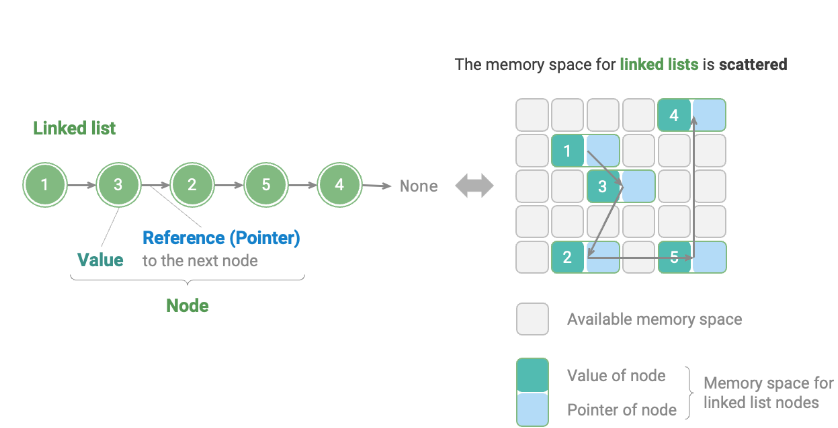

- Since `LinkedList` nodes are allocated as needed, the overall size of the list can grow or shrink dynamically based on the number of elements.

##### Internal Working of LinkedList

- When new elements are added to a `LinkedList`, new nodes are created and linked to the existing nodes. This can happen at either the head, tail, or any position in the list, depending on where you want to insert the new node.

```
LinkedList<String> list = new LinkedList<>();
list.addFirst("Apple");  // Adds "Apple" at the head
```

- When elements are removed, the corresponding nodes are unlinked and can be garbage collected if there are no references to them. The `LinkedList` dynamically shrinks as nodes are removed.

```
list.remove("Apple");  // Removes "Apple" from the list
```

#### Vector

- A `Vector` class implements the `List` interface. It is a legacy class.

<details> 

<summary> What is legacy class ? </summary>

- In simple terms, legacy classes are classes that were part of Java's earlier versions (before Java 2 or Java 1.2) and have since been replaced or updated by more modern and efficient alternatives introduced in the Java Collections Framework (JCF). These legacy classes were part of Java 1.0 and Java 1.1 and were used for data structures like lists, maps, sets, and vectors before Java's collections framework was introduced.
- Examples of Legacy Classes:
    - `Hashtable`
    - `Vector`
    - `Stack`
    - `Enumeration`

- **Why Were They Called Legacy**?
    - When Java 2 (Java 1.2) introduced the Java Collections Framework, it provided a more structured and flexible way to handle collections (like List, Set, Map). This framework offered better performance, flexibility, and easier ways to work with collections.
- Legacy classes, on the other hand, had several issues that made them outdated:

**1. Performance Overhead:**
    - Many legacy classes, such as `Vector` and `HashTable`, are synchronized by default. This means that every method is thread-safe, but this also introduces performance overhead.
    - In modern single-threaded or low-concurrency applications, this synchronization is unnecessary and slows down operations.


**2. Lack of Standard Interfaces:**
    - Before the Java Collections Framework, the legacy classes were not standardized. For instance, `Hashtable` and `Vector` didn’t implement a common interface like Map or List.
    - This made it hard to switch between different collection types or write flexible code that works with multiple types of collections.


**3. Enumerations:**
    - Instead of iterators, legacy classes used `Enumeration` for traversing elements. Enumeration was less convenient compared to the Iterator and ListIterator interfaces introduced with the collections framework.

**4. Type Safety:**
    - Legacy classes lacked `Generics`. This means they could store objects of any type, and you’d often have to cast objects when retrieving them, which could lead to runtime errors. For example:

- When Java introduced the Java Collections Framework in Java 1.2, many legacy classes were re-engineered to implement standard interfaces like `List`, `Set`, and `Map`. This means that the old classes were updated to work within the new collections framework, but without changing their core behavior.


</details>

- `Vector` is essentially a synchronized version of `ArrayList`. It provides the same functionality as `ArrayList` but is thread-safe, making it suitable for multi-threaded environments where multiple threads might access and modify the collection simultaneously.
- Lets see an example

```
import java.util.Vector;

public class AboutVector {
    public static void main(String[] args) {
        // Create a Vector
        Vector<String> vector = new Vector<>();

        // 1. Adding elements
        vector.add("Apple");           // Add at the end
        vector.add("Banana");          // Add at the end
        vector.add("Cherry");          // Add at the end
        vector.add(1, "Mango");        // Add at specific index
        System.out.println("Initial Vector: " + vector);

        // 2. Accessing elements
        String firstElement = vector.firstElement();  // Get first element
        String lastElement = vector.lastElement();    // Get last element
        String elementAtIndex = vector.get(2);        // Get element at index 2

        System.out.println("First element: " + firstElement);
        System.out.println("Last element: " + lastElement);
        System.out.println("Element at index 2: " + elementAtIndex);

        // 3. Checking size and capacity
        int size = vector.size();           // Get the size
        int capacity = vector.capacity();   // Get the capacity

        System.out.println("Size: " + size);
        System.out.println("Capacity: " + capacity);

        // 4. Removing elements
        vector.remove("Mango");            // Remove specific element
        vector.remove(1);                   // Remove element at index 1
        System.out.println("After removals: " + vector);

        // 5. Checking if an element exists
        boolean containsCherry = vector.contains("Cherry");
        System.out.println("Contains 'Cherry'? " + containsCherry);

        // 6. Index of elements
        int index = vector.indexOf("Banana");  // Get index of element
        System.out.println("Index of 'Banana': " + index);

        // 7. Cloning the Vector
        Vector<String> clonedVector = (Vector<String>) vector.clone();
        System.out.println("Cloned Vector: " + clonedVector);

        // 8. Iterating through the Vector
        System.out.print("Iterating through Vector: ");
        for (String fruit : vector) {
            System.out.print(fruit + " ");
        }
        System.out.println();

        // 9. Clearing the Vector
        vector.clear();  // Remove all elements
        System.out.println("After clearing: " + vector);

        // 10. Checking if Vector is empty
        boolean isEmpty = vector.isEmpty();
        System.out.println("Is the Vector empty? " + isEmpty);

        // 11. Adding all elements from another collection
        Vector<String> newFruits = new Vector<>();
        newFruits.add("Orange");
        newFruits.add("Grapes");

        vector.addAll(newFruits);  // Add all elements from newFruits
        System.out.println("After adding new fruits: " + vector);

        // 12. Replacing an element
        vector.set(0, "Kiwi");  // Replace element at index 0
        System.out.println("After replacing first element: " + vector);

        // 13. Trimming the capacity
        vector.trimToSize();  // Reduce capacity to current size
        System.out.println("Capacity after trim: " + vector.capacity());
    }
}


Output:
Initial Vector: [Apple, Mango, Banana, Cherry]
First element: Apple
Last element: Cherry
Element at index 2: Banana
Size: 4
Capacity: 10
After removals: [Apple, Cherry]
Contains 'Cherry'? true
Index of 'Banana': -1
Cloned Vector: [Apple, Cherry]
Iterating through Vector: Apple Cherry
After clearing: []
Is the Vector empty? true
After adding new fruits: [Orange, Grapes]
After replacing first element: [Kiwi, Grapes]
Capacity after trim: 2
```

- When we open `add()` method in `Vector` class we can see it uses **synchronized**. Not only `add()` all other method uses **synchronized**. Thus making it thread-safety.

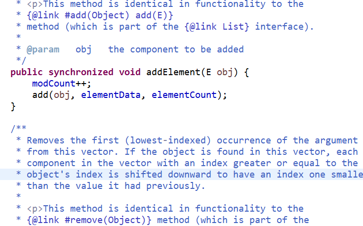

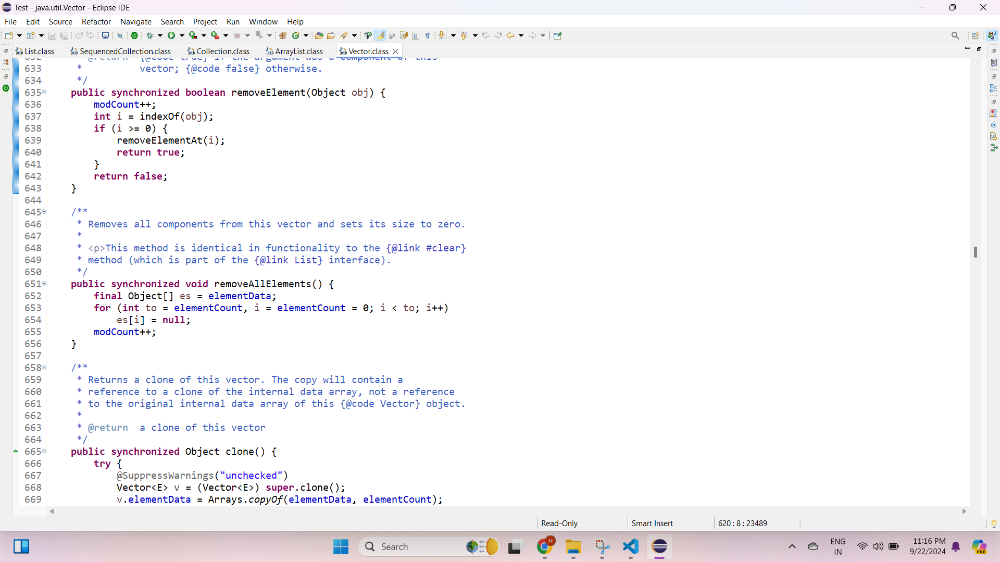


>[!NOTE]
> - When you want to use specific methods that are unique to `Vector`, it's best to declare your variables with their respective types instead of using the `List` interface. 
> - `Vector` provide additional methods compare to `List` interface, so if you wanna use those additional method then declare your variable type as `Vector`.

- Since `Vector` is a synchronized version of `ArrayList` so its internal memory representation as well as internal working is same as `ArrayList`.
- `Vector` methods are synchronized, making it thread-safe. This means that multiple threads can safely interact with a Vector without causing data inconsistency. `ArrayList` is not synchronized, so it is faster in single-threaded scenarios but requires external synchronization if accessed by multiple threads.
- Due to synchronization, `Vector` may have a performance overhead compared to `ArrayList` in scenarios where thread safety is not a concern.

##### Stack

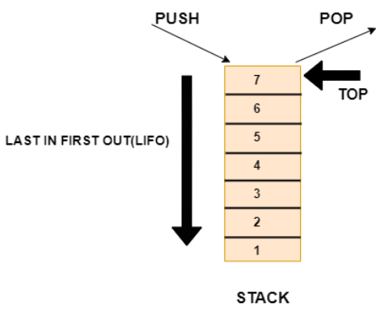

- A Stack in Java is a data structure that follows the Last-In-First-Out (LIFO) principle, meaning that the last element added to the stack is the first one to be removed. Imagine a cylinder closed at one end. So when you fill the cylinder will elements, once the cylinder is filled, and if you want to make it empty, you need to remove that element which was inserted at the last.
- It is implemented as a subclass of `Vector`.


- Stack Operations: The primary operations of a stack include:
    - Push: Add an element to the top of the stack.
    - Pop: Remove and return the top element of the stack.
    - Peek: Return the top element without removing it.
    - isEmpty: Check if the stack is empty.

- Lets see an example.

```
import java.util.Stack;

public class StackExample {
    public static void main(String[] args) {
        // Create a Stack
        Stack<String> stack = new Stack<>();

        // 1. Push elements onto the stack
        stack.push("Apple");
        stack.push("Banana");
        stack.push("Cherry");
        System.out.println("Stack after pushes: " + stack);

        // 2. Peek at the top element
        String topElement = stack.peek();
        System.out.println("Top element (Peek): " + topElement);

        // 3. Pop an element from the stack
        String poppedElement = stack.pop();
        System.out.println("Popped element: " + poppedElement);
        System.out.println("Stack after pop: " + stack);

        // 4. Check if the stack is empty
        boolean isEmpty = stack.isEmpty();
        System.out.println("Is the stack empty? " + isEmpty);

        // 5. Get the size of the stack
        int size = stack.size();
        System.out.println("Size of the stack: " + size);

        // 6. Search for an element
        int position = stack.search("Banana");  // Returns 1-based index
        System.out.println("Position of 'Banana': " + position);

        // 7. Clear the stack
        stack.clear();
        System.out.println("Stack after clearing: " + stack);
    }
}

Output:
Stack after pushes: [Apple, Banana, Cherry]
Top element (Peek): Cherry
Popped element: Cherry
Stack after pop: [Apple, Banana]
Is the stack empty? false
Size of the stack: 2
Position of 'Banana': 1
Stack after clearing: []
```

- The `Stack` class extends the `Vector` class, which means it inherits all the properties and methods of `Vector`, including its dynamic array behavior. Since `Vector` is synchronized, Stack also inherits this synchronization.
- If multiple threads are accessing a `Stack` at the same time (e.g., one thread pushing elements while another thread is popping elements), there is a risk of data inconsistency or corruption. For example, if two threads try to pop from an empty stack simultaneously, one thread might cause an exception or corrupt the state of the stack.
- Synchronization ensures that the operations on the stack (like push, pop, and peek) are atomic. This means that once a thread starts an operation, it will complete that operation without interruption from other threads. This is crucial to maintain the integrity of the stack's state. When a thread is executing a synchronized method, other threads attempting to access the same method will be blocked until the first thread finishes, which can affect the responsiveness of the application.
- Lets consider a scenario where the stack will be full by inserting one element, and two threads are trying to push the data simultaneously. This would lead to data inconsistency.
- While you can use an `ArrayList` to implement a stack (by adding and removing elements from the end of the list), using a `Stack` provides a clearer semantic meaning of LIFO behavior. The Stack class explicitly provides stack operations, making the code more readable and intuitive.


| **Feature**   | **ArrayList** | **LinkedList**  |**Vector**   |
|-----------------------------|---------------------------------------------------------------------------------|--------------------------------------------------------------------------------------------|--------------------------------------------------------------------|
| Implementation | Resizable array (dynamic array)                                                 | linked list (dynamic bases on nodes in memory)                                                                     | Resizable array (like `ArrayList`)                                   |
| Performance (Access)        | Fast random access (O(1))                                                       | Slower random access (O(n))                                                                | Fast random access (O(1))                                          |
| Performance (Insert/Remove) | Slower when inserting/removing elements in the middle (O(n))                    | Efficient insert/remove at the beginning or middle (O(1) if node is known, O(n) otherwise) | Slower when inserting/removing in the middle (O(n))                |
| Memory Usage                | Less memory overhead than LinkedList (only stores data)                         | More memory (stores data and links to previous/next nodes)                                 | Similar to `ArrayList`, uses a dynamic array                         |
| Thread Safety               | Not synchronized                                                                | Not synchronized                                                                           | Synchronized by default (thread-safe)                              |
| Grow Policy                 | Increases by 50% when full                                                      | Not applicable                                                                             | Increases by 100% (doubles size when full)                         |
| Iterator Type               | Fail-fast (throws `ConcurrentModificationException` if modified during iteration) | Fail-fast                                                                                  | Fail-safe (since it's synchronized)                                |
| Best Use Case               | When you need fast access to elements                                           | When you frequently insert/remove elements at both ends                                    | When you need thread-safe collection (legacy code)                 |


>[!NOTE]
> - Fail-fast is a mechanism in Java collections where an operation fails immediately if the structure of the collection is modified while it is being iterated. This is done to prevent unpredictable behavior during concurrent modifications.
> - Example consider below code, during iteration we are removing elements from `ArrayList`
> ```
> import java.util.ArrayList;
> public class FailFastExample {
>    public static void main(String[] args) {
>        ArrayList<String> list = new ArrayList<>();
>        list.add("A");
>        list.add("B");
>        list.add("C");
>
>        // Using enhanced for-loop
>        for (String element : list) {
>                // Directly modifying the list while iterating
>                list.remove(element);  // This will trigger a ConcurrentModificationException
>        }
>    }
> }
> 
> Output:
> ERROR!
> Exception in thread "main" java.util.ConcurrentModificationException
>	at java.base/java.util.ArrayList$Itr.checkForComodification(ArrayList.java:1043)
>	at java.base/java.util.ArrayList$Itr.next(ArrayList.java:997)
>	at FailFastExampleWithoutIterator.main(FailFastExampleWithoutIterator.java:11)
>```


>[!TIP]
> - Lets say there is company who has a storage system and has a application which is used by customer world wide, the storage system has huge memory space, the company wants to give a zero latency experience to their customer while accessing their information from the storage, you as a java developer wanted to use collection, so which collections class you will prefer? , note the company has a huge budget when if memory is completely exhausted then the company will increase it size without checking out memory prices? option give you is `ArrayList` or `LinkedList`?
> - `ArrayList` as it provides constant-time access (O(1)) to elements by index because it uses a dynamic array internally. This is ideal for scenarios where users access data frequently and expect minimal delay in retrieving information.


### Queue

- A `Queue` is a collection designed to hold elements prior to processing. It typically orders elements in a FIFO (First-In-First-Out) manner.

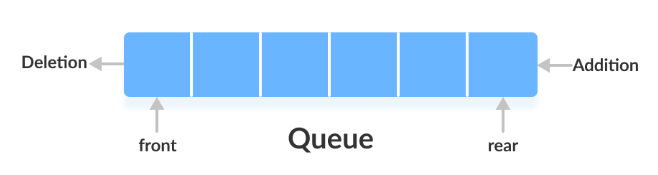

- Lets explore **Queue.class** in java.

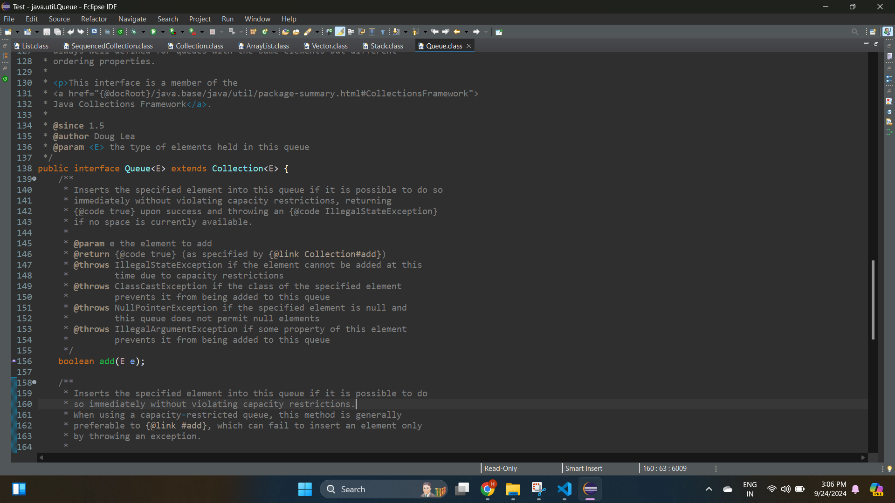

- If you see, `Queue` is an interface which extends another interface called `Collection`. Lets checkout implementations of `Queue`.

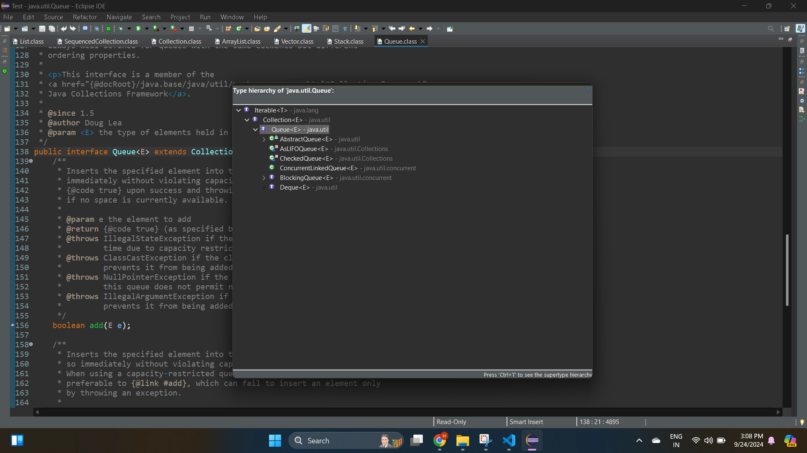

- Lets see method define for `Queue` interface.

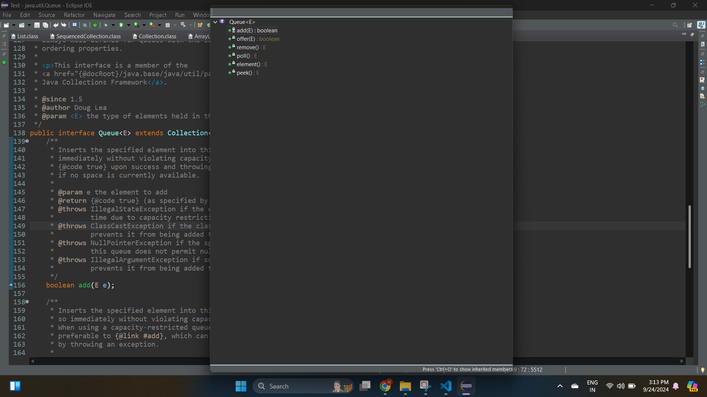

- Main operations:
    - `add(element)`: Adds an element to the rear of the queue. If the queue is full, it throws an exception.
    - `offer(element)`: Adds an element to the rear of the queue. If the queue is full, it returns false.
    - `remove()`: Removes and returns the element at the front of the queue. If the queue is empty, it throws an exception.
    - `poll()`: Removes and returns the element at the front of the queue. If the queue is empty, it returns null.
    - `element()`: Returns the element at the front of the queue without removing it. If the queue is empty, it throws an exception.
    - `peek()`: Returns the element at the front of the queue without removing it. If the queue is empty, it returns null.

- Now Queue is an interface, we cannot work with interface we require classes to work with. Lets see the implementation of Queue.

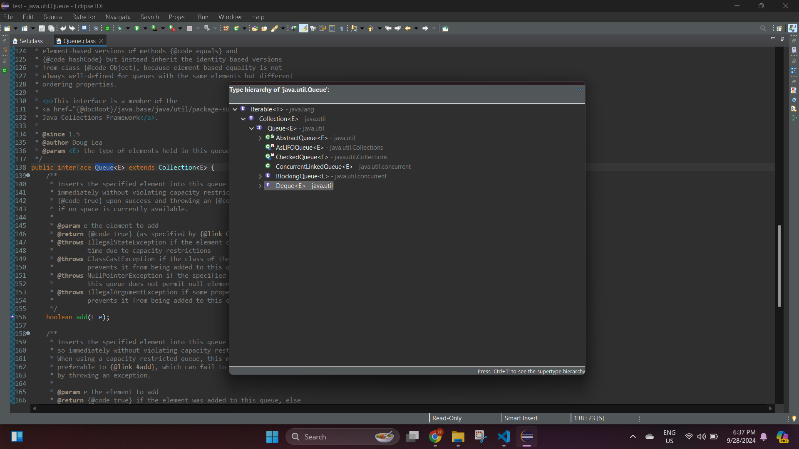

>[!NOTE]
> - We will not explore all its implementation, we will only explore the widely used implementation of Queue.

#### PriorityQueue

- Imagine you're at an airport where there are two security lines:
     - **Regular line**: People are processed on a first-come, first-served basis (like a typical queue).
    - **VIP line (Priority People)**: Here, passengers are processed based on their priority, not necessarily their arrival time. For example, passengers with first-class tickets (higher priority) get to move ahead of economy passengers, even if they arrived later.
- Likewise in the Priority Queue:
     - Each passenger (element) has a priority (for example, their class of ticket).
    - The security agents (queue operations) always serve the highest priority passengers first (the element, based on some criterion), regardless of the order in which they arrived.
    - So, just like how passengers with higher priority (first-class tickets) go through security first, elements with higher priority are served first in a Priority Queue, no matter the order of insertion.
- A PriorityQueue is used when the objects are supposed to be processed based on the priority. It is known that a Queue follows the First-In-First-Out algorithm, but sometimes the elements of the queue are needed to be processed according to the priority, that’s when the PriorityQueue comes into play.
- A PriorityQueue is a type of queue that arranges elements based on their priority values. Elements with higher priority values are typically retrieved or removed before elements with lower priority values. Each element has a priority value associated with it.
- What are the priorities values?
    - In a PriorityQueue, the priority values is a way to decide the importance of each element.
    - In a Priority Queue, **smaller numbers usually represent more urgent or higher-priority tasks**. This is just a convention, similar to how in sports rankings, being ranked 1st means you are the best. The queue always picks the element with the smallest value because it's considered the most important.
    - Example:
        - In a PriorityQueue containing these numbers: `[7, 2, 5]`. 2 has the highest priority because it's the smallest number.

- Lets see a code example.

```
import java.util.PriorityQueue;

public class AboutPriorityQueue {
    public static void main(String[] args) {
        // Creating a PriorityQueue for Integers (natural ordering: smallest value has the highest priority)
        PriorityQueue<Integer> intQueue = new PriorityQueue<>();

        // offer() / add() - Adding elements
        intQueue.offer(10);
        intQueue.add(20);
        intQueue.offer(30);
        intQueue.add(5);  // Highest priority since 5 is the smallest

        // peek() - Checking the front or head (element with highest priority)
        System.out.println("Peek (highest priority): " + intQueue.peek());  // Output: 5

        // poll() - Retrieving and removing the front or head
        System.out.println("Poll (removed): " + intQueue.poll());  // Output: 5 (smallest)
        
        // Check remaining elements in queue
        System.out.println("Peek (after poll): " + intQueue.peek());  // Output: 10

        // remove() - Removing a specific element
        intQueue.remove(10);
        System.out.println("After removing 10, Peek: " + intQueue.peek());  // Output: 20

        // contains() - Check if an element is present
        System.out.println("Contains 20? " + intQueue.contains(20));  // Output: true

        // size() - Get the size of the queue
        System.out.println("Size: " + intQueue.size());  // Output: 1

        // isEmpty() - Check if the queue is empty
        System.out.println("Is queue empty? " + intQueue.isEmpty());  // Output: false

        // clear() - Clear the queue
        intQueue.clear();
        System.out.println("Is queue empty after clear? " + intQueue.isEmpty());  // Output: true


        // Creating a PriorityQueue for Strings (natural ordering: lexicographical, alphabetically ordering)
        PriorityQueue<String> stringQueue = new PriorityQueue<>();

        // offer() - Adding elements
        stringQueue.offer("banana");
        stringQueue.offer("apple");  // This will have the highest priority (alphabetically smallest)
        stringQueue.offer("cherry");

        // peek() - Checking the head
        System.out.println("Peek (highest priority): " + stringQueue.peek());  // Output: apple

        // poll() - Retrieving and removing the head
        System.out.println("Poll (removed): " + stringQueue.poll());  // Output: apple

        // Check remaining elements in queue
        System.out.println("Peek (after poll): " + stringQueue.peek());  // Output: banana

        // remove() - Removing a specific element, returns true of false if element found was removed or not
        stringQueue.remove("banana");
        System.out.println("After removing 'banana', Peek: " + stringQueue.peek());  // Output: cherry

        // contains() - Check if an element is present
        System.out.println("Contains 'cherry'? " + stringQueue.contains("cherry"));  // Output: true

        // size() - Get the size of the queue
        System.out.println("Size: " + stringQueue.size());  // Output: 1

        // isEmpty() - Check if the queue is empty
        System.out.println("Is queue empty? " + stringQueue.isEmpty());  // Output: false

        // clear() - Clear the queue
        stringQueue.clear();
        System.out.println("Is queue empty after clear? " + stringQueue.isEmpty());  // Output: true
    }
}


Output:
Peek (highest priority): 5
Poll (removed): 5
Peek (after poll): 10
After removing 10, Peek: 20
Contains 20? true
Size: 2
Is queue empty? false
Is queue empty after clear? true
Peek (highest priority): apple
Poll (removed): apple
Peek (after poll): banana
After removing 'banana', Peek: cherry
Contains 'cherry'? true
Size: 1
Is queue empty? false
Is queue empty after clear? true
```


>[!IMPORTANT]
> - `PriorityQueue` does not allow `null` elements. If you try to add null, it will throw a `NullPointerException`.
> - By default, `PriorityQueue` orders its elements using natural ordering (numbers by ascending value, strings lexicographically). You can customize the order by providing a `Comparator` when creating the queue.
> - `PriorityQueue` is unbounded, meaning it can grow dynamically as more elements are added. However, the underlying array can be resized when needed.
> - **Random access is not available in a `PriorityQueue` in Java**. Like in `ArrayList` we have `getIndex()` method there is no such method for `PriorityQueue` as `Queue` are designed to specifically retrieve elements based on FIFO or priority principles and not for random access.
> - `PriorityQueue` does not have trimming methods, there's no method to shrink their internal structures. It can be handle explicitly by manually create a new `PriorityQueue` and copy elements into it.
> - `PriorityQueue` is not thread-safe. Java provides `PriorityBlockingQueue`, which is a thread-safe variant of `PriorityQueue`.
> - Duplicate elements are allowed in `PriorityQueue`. If two elements are equal in priority, they can both exist in the queue.
> - `PriorityQueue` does not guarantee ordering stability. This means that if two elements are considered "equal" in priority, their relative order in the queue may not be maintained. The internal **heap** structure decides the relative order of equal-priority elements. If you insert two elements with the same priority, there is no guarantee which of them will be retrieved first, as `FIFO` is not a property of `PriorityQueue` for elements of equal priority.
> - To give custom priorities we can use `comparator` (we will see this later).


- Just like `ArrayList`, we can use generic concept for `PriorityQueue` as well , `PriorityQueue intQueue = new PriorityQueue();`.


##### Internal Working of PriorityQueue

- Internally, `PriorityQueue` uses a **heap (binary heap)**, which allows efficient insertion (`O(log n)`) and removal of the element with the highest priority.
- The elements are stored in an array-based structure where the smallest element (according to natural ordering or a custom comparator) is always at the root.
- Time complexity:
    - Insertion: `O(log n)`
    - Removal (`poll`): `O(log n)`
    - Peek: `O(1)`
- A heap is a specialized tree-based data structure that satisfies the heap property. `PriorityQueue` default uses **min-heap** property which is the smallest element is always at the root of the tree (or at index 0 of the internal array) and for any parent node, its children will always have larger or equal values.
- **To be specific `PriorityQueue` uses balanced binary heap**.

##### Memory Management

- When you create a `PriorityQueue` in Java without specifying an initial capacity, it creates an internal array with a default size of **11**. As elements are added, the queue automatically grows in size to accommodate more elements.

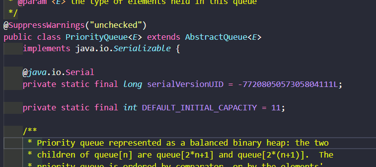

- The internal array would look in memory after several elements are added

```
[1, 2, 8, 5, 3, null, null, null, null, null, null]
```

- By default, the internal array has a size of 11. You can also specify a custom initial capacity by passing an integer value in the constructor, `new PriorityQueue<>(capacity)`.
- When the number of elements exceeds the current capacity, the internal array grows by **50%** (double of current size, similar to `ArrayList` behavior). This ensures that adding new elements remains efficient as the queue grows.

#### Deque (Double Ended Queue)

- A Deque (Double Ended Queue) in Java is a linear data structure that allows insertion and deletion of elements from both ends. Unlike a Queue that only allows operations at one end (FIFO: First-In-First-Out), a Deque supports operations at both the front and rear.


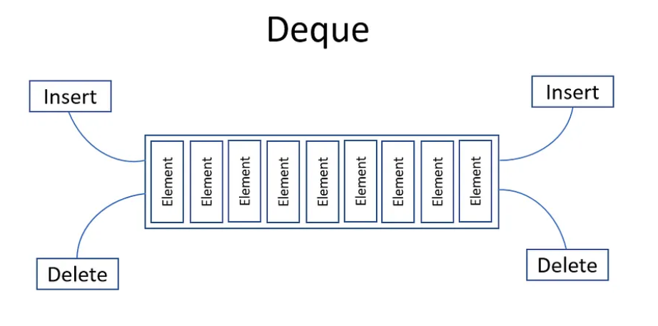

- The **interface** called Deque is present in `java.util` package. It is the subtype of the interface queue. The Deque supports the addition as well as the removal of elements from both ends of the data structure. Therefore, a deque can be used as a `Stack` or a `Queue`. We know that the stack supports the Last In First Out (LIFO) operation, and the operation First In First Out is supported by a queue. As a deque supports both, either of the mentioned operations can be performed on it

>[!NOTE]
> - `LinkedList` implements **`Deque` (`Queue` interface)** to give doubly linked list collection which allows insertion and deletion of elements from both ends (head and tail) of the linked list.

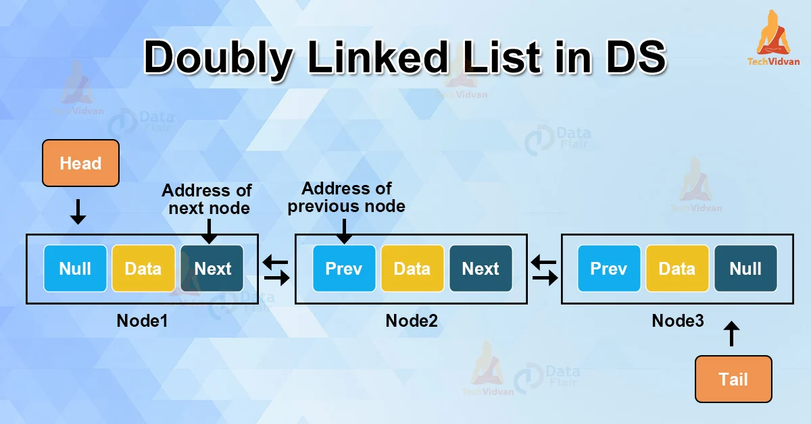

##### ArrayDeque

- `ArrayDeque` is a resizable array implementation of the `Deque` interface. It is part of Java's `java.util` package and is generally more efficient than `LinkedList` for Deque operations.
- Lets see an example

```
import java.util.ArrayDeque;
import java.util.Deque;

public class AboutArrayDeque {
    public static void main(String[] args) {
        // Creating an ArrayDeque instance
        Deque<Integer> deque = new ArrayDeque<>();

        // Insertion operations
        deque.addFirst(10);  // [10]
        deque.addLast(20);   // [10, 20]
        deque.offerFirst(5); // [5, 10, 20]
        deque.offerLast(25); // [5, 10, 20, 25]

        System.out.println("Deque after insertions: " + deque);

        // Access and retrieval operations
        System.out.println("First element (getFirst): " + deque.getFirst());  // Output: 5
        System.out.println("Last element (getLast): " + deque.getLast());     // Output: 25
        System.out.println("First element (peekFirst): " + deque.peekFirst()); // Output: 5
        System.out.println("Last element (peekLast): " + deque.peekLast());    // Output: 25

        // Removal operations
        System.out.println("Removed first element (removeFirst): " + deque.removeFirst()); // Removes 5
        System.out.println("Removed last element (removeLast): " + deque.removeLast());   // Removes 25
        System.out.println("Deque after removals: " + deque);

        // Polling operations
        System.out.println("Polled first element (pollFirst): " + deque.pollFirst()); // Removes 10
        System.out.println("Polled last element (pollLast): " + deque.pollLast());   // Removes 20
        System.out.println("Deque after polling: " + deque);  // Empty deque
    }
}


Output:
Deque after insertions: [5, 10, 20, 25]
First element (getFirst): 5
Last element (getLast): 25
First element (peekFirst): 5
Last element (peekLast): 25
Removed first element (removeFirst): 5
Removed last element (removeLast): 25
Deque after removals: [10, 20]
Polled first element (pollFirst): 10
Polled last element (pollLast): 20
Deque after polling: []
```

- Just like `ArrayList`, we can use generic concept for `ArrayDeque` as well , `Deque deque = new ArrayDeque();`.


>[!IMPORTANT]
> - No `null` elements are allowed , it will throw `java.lang.NullPointerException`.
> - `ArrayDeque` is unbounded, so its size grows as needed. It dynamically resizes to accommodate additional elements.
> - It provides constant-time performance for adding and removing elements at both ends.
> - It is not Thread-Safe.
> - `ArrayDeque` in Java does not have any explicit `trim()` methods to shrink its internal array. Once the array grows, it does not automatically shrink when elements are removed. It can be handle explicitly by manually create a new `ArrayDeque` and copy elements into it.
> - **No Random Access is not supported by `ArrayDeque`**. Like in `ArrayList` we have `getIndex()` method there is no such method for `ArrayDeque` as `Queue` are designed to specifically retrieve elements based on FIFO or priority principles and not for random access.

###### Internal Working of ArrayDeque

- `ArrayDeque` uses an internal array to store elements, but it **does not use `ArrayList`**. It maintains a **circular buffer or ring buffer** to efficiently manage both ends of the deque.
- It maintains two pointers, `head` and `tail`, to track the front and rear of the deque, respectively.
- Lets visualize that referring below images, when we declare a `ArrayDeque` , internally it maintains an array of 16 elements.

```
+---+---+---+---+---+---+---+---+---+---+---+---+---+---+---+---+
|   |   |   |   |   |   |   |   |   |   |   |   |   |   |   |   |
+---+---+---+---+---+---+---+---+---+---+---+---+---+---+---+---+
```

- Initially, `head` and `tail` points to the start of the array.

```
head
  |
  v
+---+---+---+---+---+---+---+---+---+---+---+---+---+---+---+---+
|   |   |   |   |   |   |   |   |   |   |   |   |   |   |   |   |
+---+---+---+---+---+---+---+---+---+---+---+---+---+---+---+---+
  ^
  |
 tail
```

- Lets add one element using `addFirst()` at the front of the `ArrayDeque`.

```
                                                             head
                                                              |
                                                              v
+---+---+---+---+---+---+---+---+---+---+---+---+---+---+---+---+
|   |   |   |   |   |   |   |   |   |   |   |   |   |   |   | X |
+---+---+---+---+---+---+---+---+---+---+---+---+---+---+---+---+
  ^
  |
 tail
```

- Let add one element at rear of the `ArrayDeque` using `addLast()`.

```
                                                            head
                                                              |
                                                              v
+---+---+---+---+---+---+---+---+---+---+---+---+---+---+---+---+
| X |   |   |   |   |   |   |   |   |   |   |   |   |   |   | X |
+---+---+---+---+---+---+---+---+---+---+---+---+---+---+---+---+
      ^
      |
     tail
```

- Lets add some more elements on the front and rear of `ArrayDeque`.

```
                                                    head
                                                      |
                                                      v
+---+---+---+---+---+---+---+---+---+---+---+---+---+---+---+---+
| X |   |   |   |   |   |   |   |   |   |   |   |   | X | X | X |
+---+---+---+---+---+---+---+---+---+---+---+---+---+---+---+---+
      ^
      |
     tail


                                                    head
                                                      |
                                                      v
+---+---+---+---+---+---+---+---+---+---+---+---+---+---+---+---+
| X | X | X |   |   |   |   |   |   |   |   |   |   | X | X | X |
+---+---+---+---+---+---+---+---+---+---+---+---+---+---+---+---+
              ^
              |
            tail
```

- Eventually, the two pointers will meet in the middle. When that happens, we create a brand-new array that's larger than the original one (usually, **150%** bigger), then copy the elements over into the new array to free up some space.


###### Memory Management

- `ArrayDeque` allocates memory dynamically. The default initial size is **16**. When the internal array becomes full, a new array with 1.5 times the capacity is allocated, and elements are copied to it.
- The array does not shrink unless explicitly handled by creating a new deque with fewer elements (no automatic shrinking).

#### BlockingQueue

- A `BlockingQueue` in Java is a type of queue that supports thread-safe operations and provides blocking operations for adding and retrieving elements. It is an interface which extends `Queue` interface.

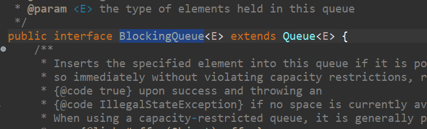

- Lets take a simple analogy of `BlockingQueue`.
- Imagine a mailbox where:
    - People (producers) come to put letters in the mailbox.
    - Mail carriers (consumers) come to take letters from the mailbox.
- But there's a rule:
    - The mailbox has limited space (e.g., can hold only 2 letters).
    - If the mailbox is full, the next person who wants to put a letter has to wait until a mail carrier comes and takes one out.
    - If the mailbox is empty, the mail carrier has to wait until someone drops a letter in.
- The blocking operations ensure that producers and consumers don’t overwhelm each other. Producers block when the queue is full, and consumers block when it’s empty.
- **Key Concepts**:
    - **Producer**: People who drop letters (items) in the mailbox (queue).
    - **Consumer**: The mail carrier who picks up letters from the mailbox (queue).
    - **Blocking**: If a producer comes when the mailbox is full, they have to wait (they are blocked from adding more letters). If the mail carrier comes when the mailbox is empty, they have to wait too (they are blocked from picking up letters).
- So in scenario of concurrent or parallel programming, a producer-consumer scenario, multiple threads may be producing items (tasks, messages, data) while other threads are consuming them. The BlockingQueue helps manage this situation efficiently by:
    - **Preventing overflow**: If the producer is too fast, it waits for the consumer to catch up.
    - **Preventing unnecessary CPU usage**: Instead of constantly checking, threads block until they can act (e.g., waiting to put or take an item).

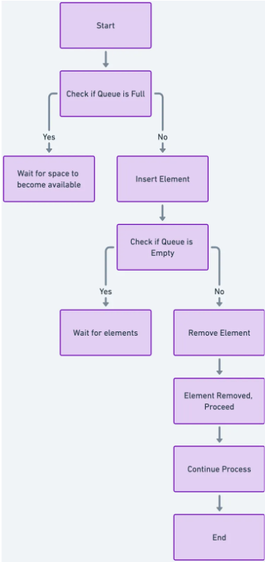

- In multi-threaded programs, threads need to safely communicate and coordinate when sharing data, like tasks or messages.  `BlockingQueue` ensures that multiple threads can safely add and remove elements without corrupting the data structure.
- It provides mechanisms to block the producer thread if the queue is full or the consumer thread if the queue is empty, which prevents busy waiting (where threads keep checking the queue in a loop, consuming CPU unnecessarily).

<details>

<summary> Difference between wait state and busy waiting and how they impact CPU usage </summary>


1.  **Wait State (Blocking/Non-CPU-consuming)**:
    - Wait state is when a thread is blocked and not actively using the CPU. It happens when a thread calls a method like `wait()`, `take()` on a `BlockingQueue`, or `sleep()`, or is waiting for a condition to be met.
    - In this state, the operating system puts the thread to sleep, meaning the thread is essentially paused, and no CPU cycles are used by this thread while it waits for something to happen (e.g., an element added to a queue or a lock to be released).
    - CPU is free to perform other tasks while this thread is blocked.

2. **Busy Waiting (CPU-consuming)**:
    - In busy waiting, a thread continuously checks a condition in a loop. The thread is active and consumes CPU cycles while repeatedly checking whether the condition has changed.
    - Busy waiting wastes CPU resources because the thread is doing unnecessary work, checking for a condition (like polling a queue to see if it's empty) instead of waiting for the condition to change.

</details>

- `BlockingQueue` is part of `java.util.concurrent` package. All queuing methods are atomic in nature and use internal locks or other forms of concurrency control.

1. `put(E e)`: This method is used to insert elements to the queue. If the queue is full, it waits for the space to be available.

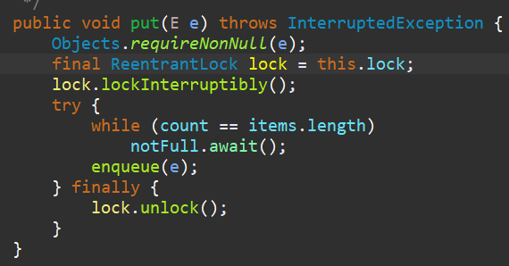

2. `E take()`: This method retrieves and remove the element from the head of the queue. If queue is empty it waits for the element to be available.

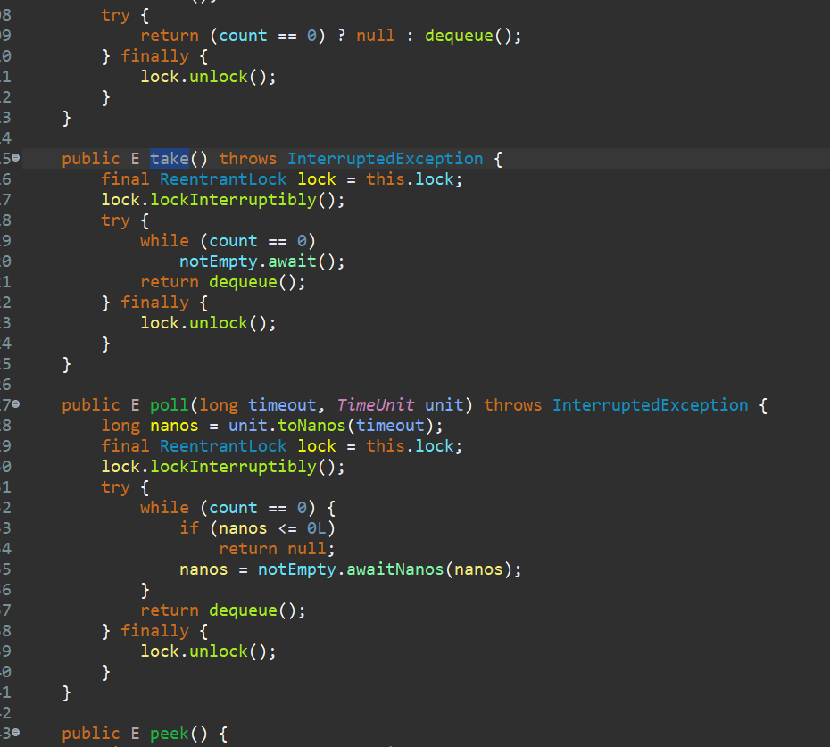

##### ArrayBlockingQueue

- `ArrayBlockingQueue` class is a bounded blocking queue backed by an array. By bounded, it means that the size of the Queue is fixed. Once created, the capacity cannot be changed.
- It's useful in producer-consumer scenarios where a fixed buffer size is required.
- Lets see an example.

```
import java.util.concurrent.ArrayBlockingQueue;

public class AboutArrayBlockingQueue {
    public static void main(String[] args) throws InterruptedException {
        // Create a fixed size ArrayBlockingQueue with capacity of 3
        ArrayBlockingQueue<String> queue = new ArrayBlockingQueue<>(3);
        
        // Add elements to the queue
        System.out.println("Adding elements:");
        queue.add("A");  // Successful add
        queue.offer("B"); // Successful offer
        queue.put("C");   // Successful put (blocks if full)
        
        System.out.println("Queue after adding: " + queue);  // [A, B, C]
        
        // Attempting to add more elements (queue is full)
        System.out.println("Trying to add when queue is full:");
        try {
            queue.add("D");  // Throws IllegalStateException (queue is full)
        } catch (IllegalStateException e) {
            System.out.println("Exception in add(): " + e.getMessage());
        }
        
        boolean offerSuccess = queue.offer("E"); // Returns false (queue is full)
        System.out.println("Offer result: " + offerSuccess);
        
        // Removing elements from the queue
        System.out.println("Removing elements:");
        System.out.println("Removed: " + queue.remove());  // Removes "A"
        System.out.println("Polled: " + queue.poll());      // Removes "B"
        
        // Blocking call - takes an element (will block if empty)
        String takenElement = queue.take();  // Removes "C"
        System.out.println("Taken: " + takenElement);
        
        // Attempting to remove when queue is empty
        System.out.println("\nTrying to remove when queue is empty:");
        System.out.println("Polled: " + queue.poll());  // Returns null (queue is empty)
        
        // Checking size and remaining capacity
        System.out.println("\nSize: " + queue.size());  // 0 (since it's empty)
        System.out.println("Remaining Capacity: " + queue.remainingCapacity());  // 3 (max capacity - current size)
        
        // Peeking at the head (will return null since queue is empty)
        System.out.println("\nPeek: " + queue.peek());  // Returns null
        
        // Add again and see fairness in action (Optional feature)
        queue.put("X");
        queue.put("Y");
        System.out.println("Queue after adding more elements: " + queue);  // [X, Y]
    }
}


Output:
Adding elements:
Queue after adding: [A, B, C]

Trying to add when queue is full:
Exception in add(): Queue full
Offer result: false

Removing elements:
Removed: A
Polled: B
Taken: C

Trying to remove when queue is empty:
Polled: null

Size: 0
Remaining Capacity: 3

Peek: null
Queue after adding more elements: [X, Y]
```

- **Key Characteristics**:
    - **Fixed capacity**: You define the maximum size when creating the queue. It can't grow beyond this.
    - **Blocking behavior**: Threads are blocked when trying to add to a full queue or remove from an empty one.
    - **Optional fairness**: When multiple threads are waiting, fairness ensures they are served in the order they arrived (first-come, first-served).

- Just like `ArrayList`, we can use generic concept for `ArrayBlockingQueue` as well , `ArrayBlockingQueue queue = new ArrayBlockingQueue(3);`.

>[!IMPORTANT]
> - `ArrayBlockingQueue` does not allow null elements. If you try to add a null element, a `NullPointerException` will be thrown.
> - `ArrayBlockingQueue` is a fixed-size queue. You define its capacity when you create the queue. For example, if you initialize it with a capacity of 10, the queue can hold up to 10 elements. The size doesn't grow or shrink dynamically, unlike some other data structures. If you attempt to add elements beyond this capacity, the operation will block or return false (for `offer()`), or throw an exception (for `add()`). If the queue is full (i.e., it has reached its maximum capacity), any attempt to add more elements (like using `put()` or `offer()`) will cause the calling thread to wait until there is space in the queue. However, not all `BlockingQueues` have capacity limits. Some implementations, like `LinkedBlockingQueue` with no specified size, are virtually unbounded (they can hold a huge number of elements). In such cases, the maximum capacity is considered `Integer.MAX_VALUE`.
> - BlockingQueue is mainly used in producer-consumer scenarios, where one set of threads (producers) adds elements to the queue, and another set (consumers) removes them. But, since BlockingQueue also follows the Java Collection interface, it supports other operations like: `remove(x)`: To remove a specific element. However, such operations are not the primary purpose of BlockingQueue and may not be executed as efficiently. They are intended for occasional use, such as cancelling a previously queued task.
> - `ArrayBlockingQueue` has an optional fairness policy. When multiple threads are waiting to either add or remove elements, fairness ensures that threads are served in the order they requested access (first-in-first-out for waiting threads). You can specify fairness when you create the queue by passing true for the fairness parameter:` new ArrayBlockingQueue<>(10, true)`. If fairness is set to false (the default), threads are scheduled in an unpredictable order, which could provide better throughput but might result in starvation for some threads. (Starvation occurs when a thread is perpetually delayed or prevented from accessing a resource it needs because other threads are continuously given priority, even though the starving thread is ready to proceed.)
> - `BlockingQueue` is thread-safe, meaning it ensures that multiple threads can add or remove elements without any issues. It uses locks or other mechanisms to make sure that when one thread is adding or removing an element, no other thread can interfere at that moment. However, operations that involve multiple elements (like `addAll`, `removeAll`) may not be atomic. This means if something goes wrong during those operations, they might be partially completed. For example, `addAll(c)` might add some elements but fail to add the rest if an exception occurs.
> - Unlike many other concurrent collections, `BlockingQueue` does not have a built-in mechanism to signal that no more items will be added, effectively “closing” the queue. The approach to handling such scenarios is often left to the specific implementation or usage pattern. A common strategy involves the insertion of distinct end-of-stream or “poison” objects, which consumers recognize as signals to stop processing further elements. Basically adding `-1` or `INTEGER.MIN_VALUE` (for Integer based queue) giving indication to the consumer that there won't be more items added by the producer.

###### Internal Working of ArrayBlockingQueue

- The internal implementation of `ArrayBlockingQueue` in Java uses a **circular buffer**, which is also known as a **ring buffer**. The size of circular buffer is fixed array size. The queue maintains two pointers:
    - `takeIndex`: This pointer points to the next element to be removed from the queue.
    - `putIndex`: This pointer points to the next position where an element can be inserted into the queue.
- During `put()` and `take()` operations in `ArrayBlockingQueue`, locks are applied to ensure thread safety. Internally, the queue uses a single **ReentrantLock** to control access to the circular buffer. When adding (`put()`) or removing (`take()`) elements, irrespective of queue is completely filled or not, the lock ensures that only one thread can modify the queue at a time, preventing concurrent access issues.

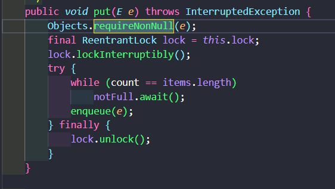

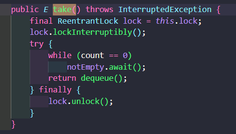

- Lets see an example how does it works internally. Lets consider a a `ArrayBlockingQueue` of size 8 , initially it is empty. So **`putIndex`** = 0 and **`takeIndex`** = 0.

```
index is starting with 0
  0   1   2   3   4   5   6   7
+---+---+---+---+---+---+---+---+
|   |   |   |   |   |   |   |   |  (Empty slots)
+---+---+---+---+---+---+---+---+
```

- Lets add 1 element into it using `put()` method. So **`putIndex`** = 1 (points to next index) and **`takeIndex`** = 0. (Since no request for removing elements).

```
+---+---+---+---+---+---+---+---+
| A |   |   |   |   |   |   |   |
+---+---+---+---+---+---+---+---+
```

- Now lets add more 2 element into it using `put()` method. So **`putIndex`** = 4 (points to next index) and **`takeIndex`** = 0. (Since no request for removing elements).

```
+---+---+---+---+---+---+---+---+
| A | B | C | D |   |   |   |   |
+---+---+---+---+---+---+---+---+
```

- Lets remove 1 element from the queue using `take()` method. So currently **`takeIndex`** = 0 points at 0th index , means element `A` will be removed from the queue. Post removing the **`takeIndex`** will point to `B` element which has 1st index, so **`takeIndex`** = 1. **`putIndex`** = 4 as not request for adding elements.

```
+---+---+---+---+---+---+---+---+
|   | B | C | D |   |   |   |   |
+---+---+---+---+---+---+---+---+
```

- Lets remove 1 more element from the queue using `take()` method. So **`takeIndex`** = 2 and **`putIndex`** = 4.

```
+---+---+---+---+---+---+---+---+
|   |   | C | D |   |   |   |   |
+---+---+---+---+---+---+---+---+
```

- Lets consider the scenario where the queue is filled with all elements. The **`takeIndex`** and **`putIndex`** will wrap around and thus return to initial position. So **`putIndex`** = 0 and **`takeIndex`** = 0.

```
+---+---+---+---+---+---+---+---+
| X | Y | Z | P | Q | R | S | T |
+---+---+---+---+---+---+---+---+
```

- If the queue is full, the `put()` method will block until space becomes available (an element is removed). If the queue is empty, the `take()` method will block until an element becomes available (an element is added).
- This circular buffer allows for efficient use of the array, ensuring that space is reused instead of constantly shifting elements.

###### Memory Management

- **Fixed Memory Allocation**:
    - When an `ArrayBlockingQueue` is created, the array backing the queue is allocated a fixed size. This means the memory for the array is allocated upfront based on the specified capacity.
    - There is no dynamic resizing of the internal array (unlike `ArrayList` or `PriorityQueue`), so the memory usage is fixed throughout the queue's lifetime.
    - If you need to change the size of the queue, you'll have to create a new `ArrayBlockingQueue` instance with the desired capacity you required. This involves copying the elements from the old queue to the new one.
- By using a circular buffer, `ArrayBlockingQueue` ensures that the array is efficiently utilized, reusing space as items are added and removed. However, the overall memory consumption does not grow or shrink since the array size is fixed.

##### LinkedBlockingQueue

- `LinkedBlockingQueue` is another implementation of a bounded blocking queue in Java, similar to `ArrayBlockingQueue`. However, unlike `ArrayBlockingQueue` which uses a fixed-size array, `LinkedBlockingQueue` uses a linked list to store elements. This allows for more flexibility in terms of resizing and performance characteristics.
- `LinkedBlockingQueue` uses a linked-list structure, which allows it to grow dynamically. `LinkedBlockingQueue` are thread-safe and support concurrent access.
- `LinkedBlockingQueue` can be bounded (if you set a maximum size) or unbounded (The capacity, if unspecified, is equal to `Integer.MAX_VALUE`).
- Lets see an example.

```
import java.util.concurrent.LinkedBlockingQueue;

public class AboutLinkedBlockingQueue {
    public static void main(String[] args) throws InterruptedException {
        
        // Create a LinkedBlockingQueue with capacity 5
        LinkedBlockingQueue<String> queue = new LinkedBlockingQueue<>(5);

        // Adding elements using offer (uses ReentrantLock)
        queue.offer("Apple");
        queue.offer("Banana");
        queue.offer("Cherry");
        
        // Adding elements using put (uses ReentrantLock)
        queue.put("Date");
        queue.put("Elderberry");

        System.out.println(queue);

        // offer
        boolean isAdded = queue.offer("Fig");  // Will fail as queue is full
        System.out.println("Was Fig added? " + isAdded);
        System.out.println(queue);

        // Retrieve elements from the queue
        System.out.println("Head of the queue (using peek): " + queue.peek());  // Non-blocking
        
        // Removing elements using take (blocking if empty)
        System.out.println("Removed element: " + queue.take());  // Removes "Apple"
        
        // Removing elements using poll (non-blocking)
        System.out.println("Removed element: " + queue.poll());  // Removes "Banana"
        
        // poll
        String removedElement = queue.poll();  // Removes "Cherry"
        System.out.println("Removed: " + removedElement);
        
        // Remaining queue size
        System.out.println("Queue size: " + queue.size());

        // Check if queue contains an element
        System.out.println("Does queue contain 'Date'? " + queue.contains("Date"));

        // Add multiple elements at once
        queue.addAll(java.util.Arrays.asList("Grapes", "Honeydew"));

        // Remove specific element
        queue.remove("Honeydew");

        // Drain all elements into another collection
        java.util.List<String> drainedElements = new java.util.ArrayList<>();
        queue.drainTo(drainedElements);
        System.out.println("Drained elements: " + drainedElements);

        // Final queue size after draining
        System.out.println("Queue size after draining: " + queue.size());
    }
}


Output:
[Apple, Banana, Cherry, Date, Elderberry]
Was Fig added? false
[Apple, Banana, Cherry, Date, Elderberry]
Head of the queue (using peek): Apple
Removed element: Apple
Removed element: Banana
Removed: Cherry
Queue size: 2
Does queue contain 'Date'? true
Drained elements: [Date, Elderberry, Grapes]
Queue size after draining: 0
```

>[!IMPORTANT]
> - `ArrayBlockingQueue` generally has better performance for small queues, while `LinkedBlockingQueue` can be more efficient for larger queues or when frequent insertions and removals are expected.
> - If you need to dynamically increase or decrease the capacity of the queue, `LinkedBlockingQueue` is a better choice.
> - If you need an unbounded queue that can grow to accommodate any number of elements, `LinkedBlockingQueue` can be used.
> - When fetching or removing an element, the queue always traverses from the head of the queue. There's no random access to elements. To fetch or remove an element, it starts at the head and follows the pointers to the next nodes.
>
> 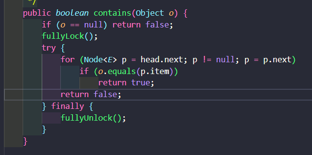

###### Internal Working of LinkedBlockingQueue

- `LinkedBlockingQueue` internally uses a linked list data structure rather than an array, which is why its behavior differs from `ArrayBlockingQueue`.
- Since its follows a linked list data structure, each element in the `LinkedBlockingQueue` is wrapped inside a **Node** object.
These Node objects are linked together, forming a **singly linked list**. It maintains two pointers
    - **Head**: Points to the node that contains the first (oldest) element.
    - **Tail**: When a new element is added, a new node is created, and the tail pointer moves to point to that new node (the one holding the new element)

>[!NOTE]
> - It consist of Tail pointer but the it does not follow doubly linked list, as the purpose of tail pointer in `LinkedBlockingQueue` is to point the last element of singly linked list.

- Lets see an example. Lets create a queue of 4 as its bounded size, initially is empty

```
Head -> Tail (Both point to the same node, representing an empty state)
```

- When we add first element using `put()`.

```
Head -> | 1 | -> Tail
```

- Keep adding elements until it reaches the capacity.

```
Head -> | 1 | -> | 2 | -> | 3 | -> | 4 | -> Tail (End of List)
```

- Head points to the node with 1. Tail points to the node with 4.

###### Memory Management

- Each element inserted into the queue is wrapped inside a Node object, which contains a reference to the next node (linked list). Memory is allocated for each new node.
- When elements are removed, the references are updated, and the unlinked nodes (no longer referenced) become eligible for garbage collection.
- **Bounded Queue**: If the maximum capacity is reached, no more elements can be added until space becomes available.
- **Unbounded Queue**: It grows dynamically as new elements are added. It doesn't shrink automatically, so memory consumption will grow as long as elements are added without being removed.

#### When to Use Queue vs Dequeue vs BlockingQueue

- **Key Considerations**

| **Type**          | **Important Considerations**                                                |
|-------------------|-----------------------------------------------------------------------------|
| **Queue**         | - `Queue` doesn’t support blocking or thread-safety by default.             |
| **Deque**         | - Useful for double-ended operations, allowing both queue and stack behaviors.<br>- Provides more flexibility than `Queue` but with similar performance. |
| **BlockingQueue** | - Thread-safe and avoids busy waiting.<br>- Ideal for producer-consumer patterns.<br>- Can be bounded or unbounded depending on the use case.<br>- Operations like `addAll()`, `containsAll()`, and `removeAll()` might not be atomic. |

- **Examples of When to Use**

    - **Queue**: Use in simple task queues like handling web requests in the order they arrive.
    - **Deque**: Use when you need the flexibility to work with elements at both ends, such as in navigation history (browser back/forward buttons).
    - **BlockingQueue**: Use when you have producer-consumer threads where one or more threads produce tasks (like file processing) and others consume tasks (process them). The thread-safe nature avoids race conditions. Example like Multi-user Gaming Server , the server processes gamer actions in the order they are received. If the action queue is full (too many simultaneous actions), new actions from players will block until space is available, maintaining game integrity.


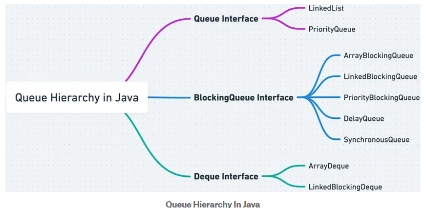

### Map

- In a classroom, each students has a unique roll number. All the roll numbers are mapped against the student name. Thats where we use **Map**.
- Each entry in the map store the data in a key and its corresponding value. The `Map` interface in java is present under `java.util` package.
- A key can only appear once in a map (no duplicate keys). However, multiple keys can map to the same value.
- Maps provide fast access to elements based on their keys. This is especially useful when you need to retrieve an element quickly given a unique identifier.
- Maps are perfect for storing data where each element has a corresponding value.
- Each key in a map must be unique, ensuring that you can always find the corresponding value without ambiguity.
- A key is an object that you use to access the value later, it is associated with a single value. A map is used when you need to search, edit, or remove elements based on a key.
- Now `Map` is an interface, we cannot work with interface we require classes to work with. Lets see the implementation of map.

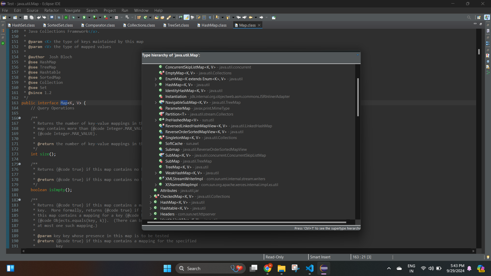

>[!NOTE]
> - We will not explore all its implementation, we will only explore the widely used implementation of map.

#### HashMap

- It is a widely used implementation of the `Map` interface.
- A `HashMap` is a data structure in Java used to store key-value pairs, where each key maps to a specific value. Think of it like a dictionary where you have words (keys) and their meanings (values).
- Lets see a code example.

```
import java.util.HashMap;
import java.util.Map;

public class AboutHashMap {
    public static void main(String[] args) {
        // Creating a HashMap
        HashMap<String, Integer> map = new HashMap<>();

        // 1. put() - Adding key-value pairs (fruits-price)
        map.put("Apple", 10);
        map.put("Banana", 20);
        map.put("Orange", 30);

        // 2. get() - Retrieving value by key
        System.out.println("Apple Count: " + map.get("Apple")); // Output: 10

        // 3. containsKey() - Check if a key exists, returns true or false
        if (map.containsKey("Banana")) {
            System.out.println("Banana exists in the map.");
        }

        // 4. containsValue() - Check if a value exists, returns true or false
        if (map.containsValue(30)) {
            System.out.println("A value of 30 exists in the map.");
        }

        // 5. remove() - Remove an entry by key
        map.remove("Banana");
        System.out.println("After removing Banana: " + map);

        // 6. size() - Get the number of entries in the map
        System.out.println("Map Size: " + map.size()); // Output: 2

        // 7. isEmpty() - Check if the map is empty
        if (map.isEmpty()) {
            System.out.println("Map is empty.");
        } else {
            System.out.println("Map is not empty.");
        }

        // 8. keySet() - Get all the keys
        System.out.println("Keys: " + map.keySet());

        // 9. values() - Get all the values
        System.out.println("Values: " + map.values());

        // 10. entrySet() - Iterate over key-value pairs
        for (Map.Entry<String, Integer> entry : map.entrySet()) {
            System.out.println("Key: " + entry.getKey() + ", Value: " + entry.getValue());
        }

        // 11. putIfAbsent() - Adds the key-value pair if the key does not already exist
        map.putIfAbsent("Orange", 40); // Won't add since "Orange" already exists
        map.putIfAbsent("Grapes", 50); // Adds because "Grapes" doesn't exist
        System.out.println("After putIfAbsent: " + map);

        // 12. replace() - Replace a value for a specific key
        map.replace("Apple", 100);
        System.out.println("After replacing Apple: " + map);

        // 13. clear() - Remove all entries
        map.clear();
        System.out.println("Map after clearing: " + map);

        //14. Adding Null key
        map.put(null, -1);
        System.out.println("Added null key: "+map);
    }
}


Output:
Apple Count: 10
Banana exists in the map.
A value of 30 exists in the map.
After removing Banana: {Apple=10, Orange=30}
Map Size: 2
Map is not empty.
Keys: [Apple, Orange]
Values: [10, 30]
Key: Apple, Value: 10
Key: Orange, Value: 30
After putIfAbsent: {Apple=10, Grapes=50, Orange=30}
After replacing Apple: {Apple=100, Grapes=50, Orange=30}
Map after clearing: {}
Added null key: {null=-1}
```

- Just like in `ArrayList`, we can use generic concept to ensure type safety in `HashMap`.

>[!IMPORTANT]
> - `HashMap` allows one null key and multiple null values. Example: You can put `(null, "value")` in the map, but there can be only one null key.
> - `HashMap` is not thread-safe. If multiple threads access a `HashMap` concurrently and at least one thread modifies it, it must be synchronized externally. For thread-safe alternatives, use `ConcurrentHashMap`.
> - `HashMap` does not guarantee the order of its elements (insertion order is not preserved).
> - Time complexity for basic operations like `get()`, `put()`, `remove()` is **O(1)** on average, assuming proper distribution of keys (due to hashing).

##### Internal Working of HashMap

- `HashMap` works on the principle of hashing. It uses an internal data structure called a bucket array (an array of linked lists or tree nodes) to store key-value pairs.
- **Hashing Technique**:
    - Hashing is the process of converting an object (key) into a fixed-size integer using a hash function. The resulting hash code determines where the key-value pair will be stored in the bucket array.
    - The method `hashCode()` is called on the key to generate the hash, and this hash is used to calculate the index in the bucket array.

```
class HashCodeExample {
    public static void main(String[] args) {
        System.out.println("Apple".hashCode());
        System.out.println("apple".hashCode());
        System.out.println("APPLE".hashCode());
    }
}

Output:
63476538
93029210
62491450
```

- Internally, it uses an array of these buckets (a bucket is either null, an entry key-pair, a linked list, or a balanced tree).
- Lets see an example to understand how `HashMap` works internally. Let’s say you are inserting these key-value pairs:
    - "Apple", 1
    - "Banana", 2
    - "Grapes", 3


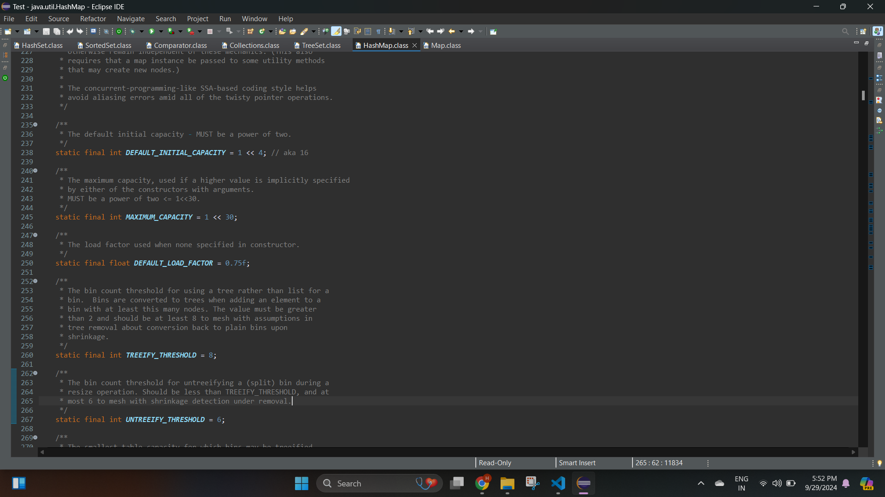


- When we create a `HashMap`, the default initial capacity of a `HashMap` is 16. So an bucket array of 16 size is created.

```
Index in Bucket Array:     0         1         2         3         4            15
                      |---------|---------|---------|---------|---------|...|---------|
Bucket Array          |   null  |   null  |   null  |   null  |   null  |      null   |
                      |---------|---------|---------|---------|---------|...|---------|
```

- Hashing technique is used using `hashCode()`. So each keys ("Apple","Banana","Grapes") hashCode is computed. For time being lets consider below hashCodes
    - "Apple", HashCode=1024
    - "Banana", HashCode=1025
    - "Grapes", HashCode=1026
- Using hashing technique, a hashing algorithm is applied where the hashCode is divided by the bucket capacity and the output result becomes the index in bucket array. (HashCode%BucketCapacity)
    - "Apple" , 1024%16=0th index
    - "Banana", 1025%16=1st index
    - "Grapes", 1026%16=2nd index

```
Index in Bucket Array:     0             1            2         3         4            15
                      |-----------|------------|------------|---------|---------|...|---------|
Bucket Array          |("Apple",1)|("Banana",2)|("Grapes",3)|   null  |   null  |      null   |
                      |-----------|------------|------------|---------|---------|...|---------|
```
- **Hashing Collision**: When multiple keys map to the same bucket index (due to the nature of hashing), it's called a hash collision. To handle this, `HashMap` uses linked lists or trees within buckets.
- Lets say we wanted to insert ("Orange",4), the hashCode computed is 1024 which is same hashCode of "Apple". So now as per hashing algorithm (1024%16=0) "Orange" will be stored at 0th index but using linked list. So ("Apple",1) becomes a node value which will point another node ("Orange",4) using linked list.

```
Index in Bucket Array:     0                             1            2         3         4            15
                      |---------------------------|------------|------------|---------|---------|...|---------|
Bucket Array          |("Apple",1) -> ("Orange",4)|("Banana",2)|("Grapes",3)|   null  |   null  |      null   |
                      |---------------------------|------------|------------|---------|---------|...|---------|
```

- Suppose the hashing collision increases, then the length of the linked list will also increase. If the number of elements in a bucket exceeds a threshold (typically 8), `HashMap` converts the linked list into a balanced tree (a Red-Black Tree) to improve search efficiency from **O(n)** to **O(log n)**.
- A linked list search is **O(n)**, meaning the search time increases linearly with the number of elements in the list. Converting the list into a balanced tree ensures that the search time remains efficient (**O(log n)**).

>[!NOTE]
> - Before Java 8: It used a simple linked list in each bucket to handle collisions.
> - From Java 8 Onward: When the number of elements in a bucket exceeds a certain threshold (8 elements), the linked list is converted into a balanced tree to improve search efficiency from **O(n)** to **O(log n)**.

##### Memory Management


- The default capacity of `HashMap` is 16. So it creates a bucket array of 16 size. Each `HashMap` has a load factor which is **0.75 or 75%**. 
- The load factor determines when the `HashMap` will grow to avoid too many collisions. The default load factor is **0.75**, which means the `HashMap` will resize itself when the number of elements exceeds **75%** of the total capacity. In a default `HashMap` with 16 buckets, 0.75 * 16 = 12. So, when the 13th element is added, the `HashMap` will automatically resize (double its capacity).
- When the `HashMap` reaches the threshold defined by the load factor (e.g., 12 elements in a set with 16 buckets), it triggers a **rehashing operation** to grow the bucket array. The size of the bucket array is doubled to reduce collisions and distribute the elements more evenly.
- In this rehashing operation:
    - It creates a new larger array of size 32 (if the earlier size was of 16).
    - After the new array is created, the existing elements from the old array are rehashed (i.e., their hash codes are recalculated (**`hashCode()`%32**) relative to the new array size). The elements are then reinserted into the new array, with the proper bucket index based on the new capacity.
    - This new array is allocated in memory, and it will replace the old one as the primary storage for the `HashMap` elements. The old array, which was smaller, is no longer referenced and becomes eligible for garbage collection.

```
Initial array (size 16):
|--- Bucket[0] ---|--- Bucket[1] ---|--- Bucket[2] ---| ... |--- Bucket[15] ---|
| Element1        |                 | Element2        |     | Element3         |


New array (size 32):
|--- Bucket[0] ---|--- Bucket[1] ---|--- Bucket[2] ---| ... |--- Bucket[31] ---|
|      Element1   |                 |      Element2   |     |   Element3       |
```

- The maximum capacity of a `HashMap` depends on memory availability and the JVM. There's no explicit maximum size, but it resizes when it grows beyond a certain point.  Unlike `ArrayList`, `HashMap` does not shrink automatically when entries are removed. There is no `trimToSize()` method in `HashMap` (unlike `ArrayList`). However, you can create a new smaller `HashMap` and transfer the entries if you want to reduce memory usage.
- You can also provide your own capacity and load factor while initializing `HashMap`.

```
import java.util.HashMap;

public class HashMapExample {
    public static void main(String[] args) {
        // Creating a HashMap with initial capacity 32 and load factor 0.5
        HashMap<String, Integer> map = new HashMap<>(32, 0.5f);

        // Adding elements to the HashMap
        map.put("Apple", 1);
        map.put("Banana", 2);
        map.put("Orange", 3);

        // Iterating over the elements
        for (String key : map.keySet()) {
            System.out.println(key + " => " + map.get(key));
        }
    }
}
```

- When elements are removed from a `HashMap`, the capacity of the internal bucket array does not change automatically. The bucket array maintains its capacity even if the number of elements decreases. The load factor threshold determines when to resize (grow) the bucket array, but it does not shrink.
- If the element is part of a linked list (in a bucket with fewer than 8 elements), it is removed from the linked list without changing the structure of the bucket.
- If the element is part of a tree (in a bucket with 8 or more elements), it is removed from the tree.
- If the number of elements in that bucket falls below the threshold (i.e., less than 6 after a removal), the structure will revert from a tree back to a linked list. This maintains efficiency and prevents excessive memory usage.
- This design helps `HashMap` maintain efficient performance while managing memory effectively.


#### LinkedHashMap


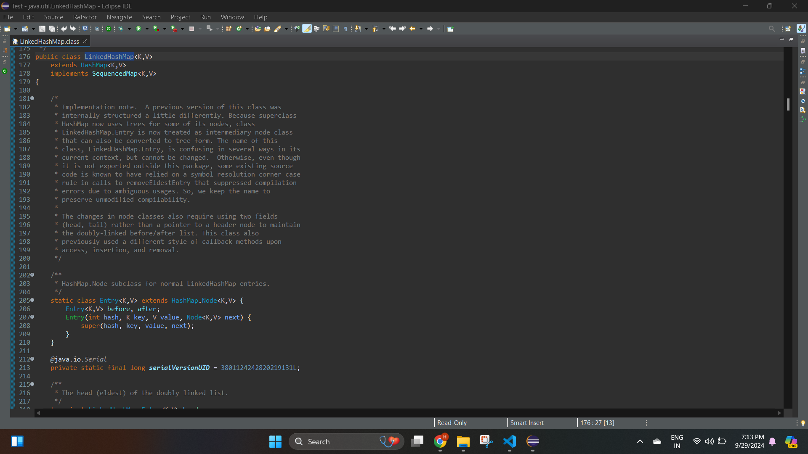

- As the name suggested it uses the implementation of `HashMap`. Then whats the difference? `LinkedHashMap` is a subclass of `HashMap` in Java, but with an important difference—it maintains the insertion order of elements. This means that when you iterate over a `LinkedHashMap`, the elements are returned in the order they were inserted, unlike `HashMap`, which does not guarantee any specific order.
- Lets see an example.

```
import java.util.LinkedHashMap;
import java.util.Map;

public class AboutLinkedHashMap {
    public static void main(String[] args) {
        // Creating LinkedHashMap with initial capacity 4 and load factor 0.75
        LinkedHashMap<String, Integer> map = new LinkedHashMap<>(4, 0.75f);
        
        // Adding elements to LinkedHashMap (Insertion order maintained)
        map.put("Apple", 1);
        map.put("Banana", 2);
        map.put("Grapes", 3);
        map.put("Orange", 4);

        System.out.println(map);

        // Accessing the elements using key (Order remains the same)
        System.out.println("Value for 'Banana': " + map.get("Banana"));

        // Iterating over the LinkedHashMap
        System.out.println("Original Order:");
        for (Map.Entry<String, Integer> entry : map.entrySet()) {
            System.out.println(entry.getKey() + " => " + entry.getValue());
        }

        // Removing an element
        map.remove("Grapes");
        System.out.println("\nAfter Removing 'Grapes':");
        for (Map.Entry<String, Integer> entry : map.entrySet()) {
            System.out.println(entry.getKey() + " => " + entry.getValue());
        }

        // Replacing a value
        map.replace("Apple", 5);
        System.out.println("\nAfter Replacing 'Apple' value:");
        for (Map.Entry<String, Integer> entry : map.entrySet()) {
            System.out.println(entry.getKey() + " => " + entry.getValue());
        }

        // Check if a key exists
        if (map.containsKey("Orange")) {
            System.out.println("\nLinkedHashMap contains 'Orange'");
        }

        // Check if a value exists
        if (map.containsValue(4)) {
            System.out.println("LinkedHashMap contains value 4");
        }

        // Clearing all elements
        map.clear();
        System.out.println("\nAfter Clearing LinkedHashMap: " + map);
    }
}


Output:
{Apple=1, Banana=2, Grapes=3, Orange=4}
Value for 'Banana': 2
Original Order:
Apple => 1
Banana => 2
Grapes => 3
Orange => 4

After Removing 'Grapes':
Apple => 1
Banana => 2
Orange => 4

After Replacing 'Apple' value:
Apple => 5
Banana => 2
Orange => 4

LinkedHashMap contains 'Orange'
LinkedHashMap contains value 4

After Clearing LinkedHashMap: {}
```

- Just like in `ArrayList`, we can use generic concept to ensure type safety in `LinkedHashMap`.

>[!IMPORTANT]
> - By default, maintains insertion order.
> - Works similarly to `HashMap` in terms of initial capacity and load factor. The default capacity is **16**, and the default load factor is **0.75**.
> - Allows one `null` key and multiple `null` values, just like `HashMap`.
> - It is not thread-safe. You must manually synchronize it.
> - Uses extra memory compared to `HashMap` because each entry maintains references to both next and previous elements in the doubly-linked list.
> - Slightly slower than `HashMap` due to the overhead of maintaining order in the doubly-linked list.

###### Internal Working of LinkedHashMap

- The internal working of `LinkedHashMap` is largely the same as `HashMap`, meaning it still uses the bucket array, hashing, and linked list (or tree in case of collisions). The key difference is that `LinkedHashMap` maintains a doubly linked list that keeps track of the insertion order (or access order if configured).
- The doubly linked list in `LinkedHashMap` stores both the key-value pairs (entries). Each node in the doubly linked list has pointers to the next and previous entries, which allows for maintaining the order of elements.


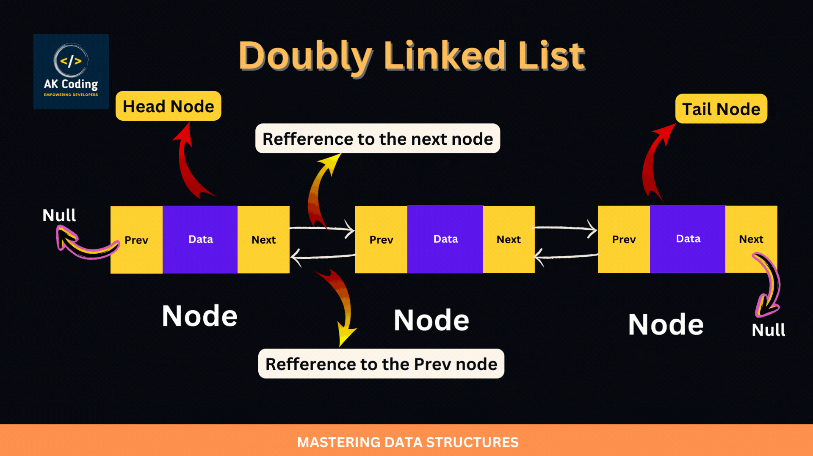

- Both Data Structures (`HashMap` and doubly linked list) Work Together:
    - The bucket array handles the normal HashMap functionality (finding, inserting, and removing key-value pairs based on the hash).
    - The doubly linked list maintains the order of these entries, either by insertion order or access order (if configured).
- Since `LinkedHashMap` uses a doubly linked list, each entry in the `LinkedHashMap` contains:
    - Key (from `HashMap`).
    - Value (from `HashMap`).
    - Pointers to the next and previous nodes in the doubly linked list.
- This results in higher memory consumption compared to `HashMap`. So, `LinkedHashMap` needs additional memory for maintaining the doubly linked list pointers
- The presence of the doubly linked list adds a slight overhead in terms of performance because the map must also update the pointers in the doubly linked list each time a new entry is inserted, accessed (in access-order mode), or removed.
- The operations (like `put()`, `get()`, `remove()`) are still **O(1)** on average, but due to the additional pointer management in the doubly linked list, it’s slower than `HashMap`.
- Like `HashMap`, `LinkedHashMap` also rehashes its bucket array when the number of elements exceeds the threshold determined by the load factor. This ensures that the time complexity of operations remains **O(1)** on average.


###### Memory Management

- `LinkedHashMap` grows dynamically like `HashMap` when the number of entries exceeds the threshold set by the load factor. It continues to grow until the JVM runs out of memory (leading to an `OutOfMemoryError`).
- You can remove entries from `LinkedHashMap`, and the size will decrease (just like in `HashMap`). However, the capacity of the underlying bucket array remains the same. If you remove a lot of elements, the doubly linked list size will shrink, but the bucket array won’t shrink automatically.
- Unlike `ArrayList`, there is no trim method to reduce the capacity of the internal bucket array. However, the doubly linked list is adjusted as elements are removed.
- The bucket array’s capacity in `LinkedHashMap` (just like `HashMap`) is not fixed; it dynamically increases (resizes) when needed. The initial capacity can be set, and rehashing occurs when the load factor threshold is met, leading to an increase in capacity.
- However, the bucket array does not shrink automatically. Once it grows, it stays the same size even if many entries are removed. Only the doubly linked list size decreases as entries are removed.

#### HashTable

- `HashTable` is same as `HashMap`, its internal working and memory management is same as `HashMap`. It is a legacy class.
- Below are the difference between `HashTable` and `HashMap`.

**1. Synchronized:** 
    - `HashTable` is thread-safe, meaning that multiple threads can access it without corrupting its state. However, this comes with a performance cost due to the overhead of synchronization.
    - `HashMap` is not thread-safe, making it faster in single-threaded scenarios. If you need thread safety, you should use `ConcurrentHashMap`.

**2. Null Keys and Values:**
    - `Hashtable` does not allow null keys or null values. Attempting to add a null key or value will throw a `NullPointerException`.
    - `HashMap` allows one `null` key and multiple `null` values.

**3. Performance:**
    - Due to synchronized nature, `HashTable` tends to be slower than HashMap.
    - Because of unsynchronized, `HashMap` typically provides better performance.

**4. Iteration:**
    - `Hashtable` uses an `Enumerator` to iterate through the keys and values, which is considered legacy.
    - `HashMap` uses an iterator for iteration, which is more modern and preferable in Java.

**5. Legacy Status:**
    - `Hashtable` has been part of Java since version 1.0 and is considered a legacy class. It is generally recommended to use newer classes from the Java Collections Framework, like `HashMap`.
    - `HashMap` is part of the Java Collections Framework introduced in Java 2 (Java 1.2) and is the preferred implementation for a hash table.

**6. Default Capacity and Load Factor:**
    - `Hashtable` default capacity is 11, with a load factor of 0.75.
    - `HashMap` default capacity is 16, with a load factor of 0.75.
- Lets see an example code for `HashTable`.

```
import java.util.Hashtable;

public class AboutHashTable {
    public static void main(String[] args) {
        // Creating a Hashtable
        Hashtable<String, Integer> hashtable = new Hashtable<>();

        // Adding key-value pairs
        hashtable.put("Apple", 1);
        hashtable.put("Banana", 2);
        hashtable.put("Grapes", 3);

        // Displaying the Hashtable
        System.out.println("Hashtable: " + hashtable);

        // Accessing a value
        int value = hashtable.get("Banana");
        System.out.println("Value for key 'Banana': " + value);

        // Removing a key-value pair
        hashtable.remove("Grapes");
        System.out.println("Hashtable after removing 'Grapes': " + hashtable);

        // Checking if a key exists
        boolean hasKey = hashtable.containsKey("Apple");
        System.out.println("Does 'Apple' exist? " + hasKey);

        // Displaying the size of the Hashtable
        int size = hashtable.size();
        System.out.println("Size of Hashtable: " + size);
    }
}


Output:
Hashtable: {Grapes=3, Apple=1, Banana=2}
Value for key 'Banana': 2
Hashtable after removing 'Grapes': {Apple=1, Banana=2}
Does 'Apple' exist? true
Size of Hashtable: 2
```


#### SortedMap

- A `SortedMap` is a subtype of the `Map` interface in Java that maintains its entries in a sorted order based on the keys. The ordering is either the natural order of the keys (if they implement `Comparable`) or a custom order defined by a `Comparator` provided at map creation.

*We will learn about Comparable and Comparator interfaces later*

- Unlike a regular `HashMap`, which doesn't guarantee the order of its keys, a `SortedMap` ensures that keys are always in sorted ordered.
- Some additional methods, like getting subsets (`subMap`, `headMap`, `tailMap`), can be used to navigate through the map.

##### TreeMap

- `TreeMap` is the most common implementation of the `SortedMap` interface in Java.
- The keys in a `TreeMap` are always sorted, either in their natural order (if keys are numeric) or alphabetically (if keys are in String format) or according to a custom `Comparator` which is a custom sorting logic defined.
- Lets see a simple `TreeMap` example.

```
import java.util.SortedMap;
import java.util.TreeMap;

public class AboutTreeMap {
    public static void main(String[] args) {
        // Creating a TreeMap instance
        TreeMap<Integer, String> treeMap = new TreeMap<>();

        // Adding key-value pairs to the TreeMap
        treeMap.put(3, "Apple");
        treeMap.put(1, "Banana");
        treeMap.put(4, "Cherry");
        treeMap.put(2, "Date");

        // Displaying the TreeMap
        System.out.println("TreeMap: " + treeMap);

        // Accessing entries
        /**
         * Returns the smallest (first) and largest (last) key in the map
         */
        System.out.println("First Key: " + treeMap.firstKey());
        System.out.println("Last Key: " + treeMap.lastKey());
        
        /**
         * Returns the entry (key-value pair) with the smallest and largest key.
         */
        System.out.println("First Entry: " + treeMap.firstEntry());
        System.out.println("Last Entry: " + treeMap.lastEntry());

        // Navigating through the TreeMap
        System.out.println("Lower Key (less than 3): " + treeMap.lowerKey(3));
        System.out.println("Higher Key (greater than 3): " + treeMap.higherKey(3));

        // SubMap example
        /**
         * Returns a view of the portion of the map whose keys range from fromKey (inclusive) to toKey (exclusive).
         */
        SortedMap<Integer, String> subMap = treeMap.subMap(2, 4);
        System.out.println("SubMap (from key 2 to 4): " + subMap);

        // HeadMap and TailMap
        /**
         * Returns a view of the portion of the map whose keys are strictly less than (headMap) or greater than or equal to (tailMap) the specified key.
         */
        System.out.println("HeadMap (keys < 3): " + treeMap.headMap(3));
        System.out.println("TailMap (keys >= 3): " + treeMap.tailMap(3));

        // Removing an entry
        treeMap.remove(2);
        System.out.println("After Removing Key 2: " + treeMap);

        // Updating a value
        treeMap.put(3, "Apricot");
        System.out.println("After Updating Key 3: " + treeMap);

        //Inserting Null
        /**
         * Throws java.lang.NullPointerException
         */
        //treeMap.put(null,null);
    }
}


Output:
TreeMap: {1=Banana, 2=Date, 3=Apple, 4=Cherry}
First Key: 1
Last Key: 4
First Entry: 1=Banana
Last Entry: 4=Cherry
Lower Key (less than 3): 2
Higher Key (greater than 3): 4
SubMap (from key 2 to 4): {2=Date, 3=Apple}
HeadMap (keys < 3): {1=Banana, 2=Date}
TailMap (keys >= 3): {3=Apple, 4=Cherry}
After Removing Key 2: {1=Banana, 3=Apple, 4=Cherry}
After Updating Key 3: {1=Banana, 3=Apricot, 4=Cherry}
```

- Lets say you wanna do some custom sorting, you can do it using `Comparator` interface.

```
import java.util.*;

public class TreeMapExample {
    public static void main(String[] args) {
        // Custom comparator to sort keys in descending order
        TreeMap<Integer, String> treeMap = new TreeMap<>(Comparator.reverseOrder());

        treeMap.put(1, "Banana");
        treeMap.put(2, "Apple");
        treeMap.put(3, "Cherry");

        // Display TreeMap
        System.out.println("TreeMap: " + treeMap);

        // Checking if null keys can be inserted
        try {
            treeMap.put(null, "Grapes");
        } catch (NullPointerException e) {
            System.out.println("Null keys are not allowed in TreeMap.");
        }

        // Navigating the TreeMap
        System.out.println("First Entry: " + treeMap.firstEntry());
        System.out.println("Last Entry: " + treeMap.lastEntry());
    }
}


Output:
TreeMap: {3=Cherry, 2=Apple, 1=Banana}
Null keys are not allowed in TreeMap.
First Entry: 3=Cherry
Last Entry: 1=Banana
```

- Lets define our own sorting logic using `Comparator`. Here we will sort based on string length.

```
import java.util.*;

class LengthComparator implements Comparator<String> {
    @Override
    public int compare(String str1, String str2) {
        // Sort strings by length. If lengths are equal, sort by natural order (alphabetical).
        int lenCompare = Integer.compare(str1.length(), str2.length());
        return (lenCompare != 0) ? lenCompare : str1.compareTo(str2);
    }
}

public class CustomTreeMapSorting {
    public static void main(String[] args) {
        // Create a TreeMap with a custom comparator
        TreeMap<String, Integer> treeMap = new TreeMap<>(new LengthComparator());

        // Add elements to TreeMap
        treeMap.put("Banana", 1);
        treeMap.put("Apple", 2);
        treeMap.put("Cherry", 3);
        treeMap.put("Date", 4);

        // Display TreeMap sorted by the custom comparator (by length of the string)
        System.out.println("TreeMap sorted by custom comparator (length of keys):");
        for (Map.Entry<String, Integer> entry : treeMap.entrySet()) {
            System.out.println("Key: " + entry.getKey() + ", Value: " + entry.getValue());
        }
    }
}


Output:
TreeMap sorted by custom comparator (length of keys):
Key: Date, Value: 4
Key: Apple, Value: 2
Key: Banana, Value: 1
Key: Cherry, Value: 3
```

- `TreeMap` requires that all keys be `Comparable`, meaning they must either implement the `Comparable` interface or be comparable using a custom `Comparator`. If the keys are not comparable, `TreeMap` will throw a `ClassCastException` at runtime.

```
import java.util.*;

public class ClassCastExceptionExample {
    public static void main(String[] args) {
        TreeMap<Object, String> treeMap = new TreeMap<>();

        // Adding keys of different types (Integer and String), which are not comparable
        try {
            treeMap.put(1, "One");
            treeMap.put("Two", "Two");  // This will throw ClassCastException
        } catch (ClassCastException e) {
            System.out.println("ClassCastException: Cannot compare keys of different types (Integer and String).");
        }
    }
}

Output:
ClassCastException: Cannot compare keys of different types (Integer and String).
```

- Just like in `ArrayList`, we can use generic concept to ensure type safety in `TreeMap`.

>[!IMPORTANT]
> - `TreeMap` does not allow `null` keys. If you try to insert a `null` key, it will throw a `NullPointerException`. It allows `null` values, meaning the values in the map can be `null`, but the keys cannot be `null`.
> - `TreeMap` is not thread-safe by default. You need to manually synchronized it. Alternatively, use `ConcurrentSkipListMap` for a thread-safe sorted map implementation.
> - `TreeMap` throws a `ClassCastException` if the keys are not comparable, i.e., if you insert keys of different types that do not follow a common comparison rule.
> - `TreeMap` implements the `NavigableMap` interface, which provides additional methods to navigate through the map like `lowerKey()`, `higherKey()`, `firstKey()`, `lastKey()`.
> - Internally, `TreeMap` is backed by a Red-Black Tree, which is a self-balancing binary search tree. This ensures that all operations such as insertions, deletions, and lookups have a time complexity of **O(log n)**.

###### Internal Working of TreeMap

- `TreeMap` is a self-balancing binary search tree that maintains its elements (key-value pairs) in sorted order. Internally, it is **implemented using a Red-Black Tree**, which ensures the tree remains balanced, so that basic operations (insertion, deletion, search) take **O(log n)** time.
- It uses a binary search tree (Red-Black Tree) where each node contains a key-value pair.
- The nodes are organized based on the natural order of keys or a custom comparator.
- Unlike a hash-based structure, TreeMap grows dynamically as elements are added. There is no predefined capacity, but the number of nodes grows as the tree grows.
- The tree is kept balanced using coloring rules (Red-Black Tree properties) to prevent it from becoming a skewed tree, ensuring efficient performance.
- When elements are removed, the size of the tree is reduced, and nodes can be rebalanced as necessary.
- Lets see an example when we add elements inside the `TreeMap`.

```
Initial TreeMap after inserting [10]:
        [10]
------------------------------------
After inserting [20]:
        [10]
          \
          [20]
------------------------------------
After inserting [30], tree re-balances:
        [20]
       /    \
     [10]  [30]
------------------------------------
After inserting [40]:
        [20]
       /    \
     [10]  [30]
              \
              [40]
------------------------------------
After inserting [50]:
        [20]
       /    \
     [10]  [30]
              \
              [40]
                \
                [50]
```

###### Memory Management

- Unlike `HashMap`, `TreeMap` doesn't use an internal array that expands or shrinks in size. Instead, as more nodes (key-value pairs) are added to the tree, the tree grows by adding new nodes, which results in more memory usage.
- `TreeMap` grows dynamically with no predefined capacity. As more elements are added, the number of nodes increases.
- When elements are removed, the nodes are deleted, and the size decreases accordingly.
- After insertions or deletions, if the tree becomes unbalanced, it re-balances itself using Red-Black tree properties (rotations).
- This makes `TreeMap` ideal for scenarios where you need sorted data but are okay with a bit of overhead compared to hash-based maps.

#### Why Map does not extends Collection interface?

- The `Map` interface stores value in form of Key/Value pairs whereas the `Collection` interface stores a specific element.
- In `Collection` interface, to add any element in a collection we have a `add(E e)` method. The method `add(E e)` does not supports storing value in key-value pair format like for `Map` interface we have `put(K,V)`. Similarly all other methods in the `Collection` interface works with specific element and not with key-value pair.
- Thats why `Map` does not extends `Collection` interface but it is part of **Collections Framework**.

### Set

- Set is a collection of elements (Or objects) that contains no duplicate elements. Java Set is an **interface** that extends **Collection interface**. Unlike List, Java Set is NOT an ordered collection, it’s elements does NOT have a particular order.

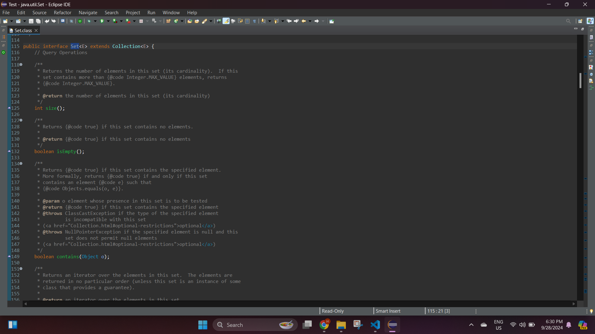

- Now Set is an interface, we cannot work with interface we require classes to work with. Lets see the implementation of set.

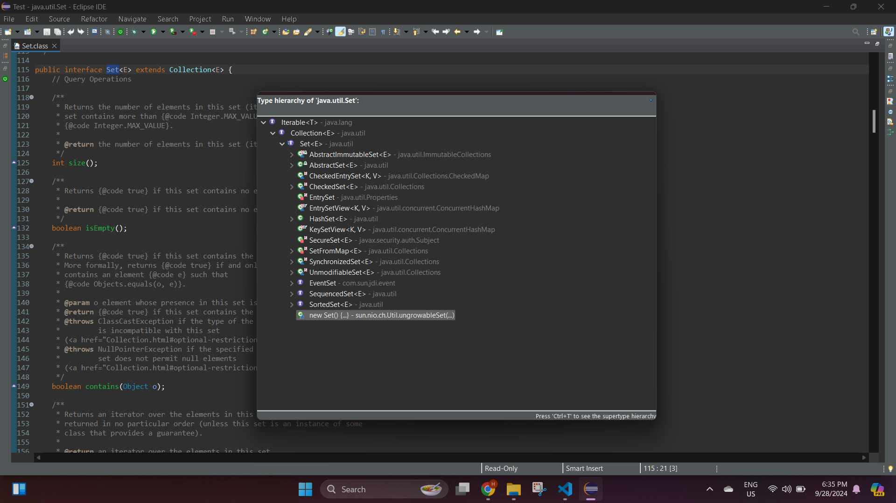

>[!NOTE]
> - We will not explore all its implementation, we will only explore the widely used implementation of set.

#### HashSet

- In Java, `HashSet` is part of the Set interface and is used to store unique elements. It doesn't allow duplicate entries, and the order of elements is not guaranteed.
- Lets see an example

```
import java.util.HashSet;
import java.util.Iterator;

public class AboutHashSet {
    public static void main(String[] args) {
        // Creating a HashSet
        HashSet<String> set = new HashSet<>();

        // Adding elements
        set.add("Apple");
        set.add("Banana");
        set.add("Cherry");
        set.add("Date");
        
        // Duplicate elements are ignored
        set.add("Apple");

        //Adding null elements.
        set.add(null);

        // Displaying the HashSet
        System.out.println("HashSet: " + set); // Elements may not be in insertion order

        // Checking for an element
        System.out.println("Contains 'Banana': " + set.contains("Banana"));

        // Removing an element
        set.remove("Date");
        System.out.println("After removing 'Date': " + set);

        // Iterating over the elements
        System.out.println("Iterating over HashSet:");
        Iterator<String> it = set.iterator();
        while (it.hasNext()) {
            System.out.println(it.next());
        }

        // Checking size
        System.out.println("Size of HashSet: " + set.size());

        // Checking if empty
        System.out.println("Is HashSet empty? " + set.isEmpty());

        // Cloning the HashSet
        HashSet<String> clonedSet = (HashSet<String>) set.clone();
        System.out.println("Cloned HashSet: " + clonedSet);

        // Clearing the HashSet
        set.clear();
        System.out.println("HashSet after clearing: " + set);
    }
}

Output:
HashSet: [null, Apple, Cherry, Date, Banana]
Contains 'Banana': true
After removing 'Date': [null, Apple, Cherry, Banana]
Iterating over HashSet:
null
Apple
Cherry
Banana
Size of HashSet: 4
Is HashSet empty? false
Cloned HashSet: [null, Apple, Cherry, Banana]
HashSet after clearing: []
```

- Just like in `ArrayList`, we can use generic concept to ensure type safety in `HashSet`.

>[!IMPORTANT]
> - `HashSet` allows a single `null` element. If you try to add more than one `null`, the subsequent additions will be ignored.
> - Unlike List and arrays, Set does NOT support indexes or positions of it’s elements.
> - The elements in a `HashSet` are not stored in any particular order. The order of insertion or retrieval may change over time, and `HashSet` does not guarantee any consistent iteration order.
> - The basic operations like `add()`, `remove()`, `contains()`, and `size()` have an average time complexity of **O(1)**. (assuming the hash function disperses elements properly among the buckets)
> - `HashSet` is **not synchronized**, meaning it is not thread-safe for concurrent access. If multiple threads are accessing a `HashSet` simultaneously, you should manually synchronize or consider using `ConcurrentHashMap`.
> - `HashSet` can grow or shrink based on the number of elements.

##### Internal Working of HashSet

- `HashSet` in Java internally uses a `HashMap` to store its elements.

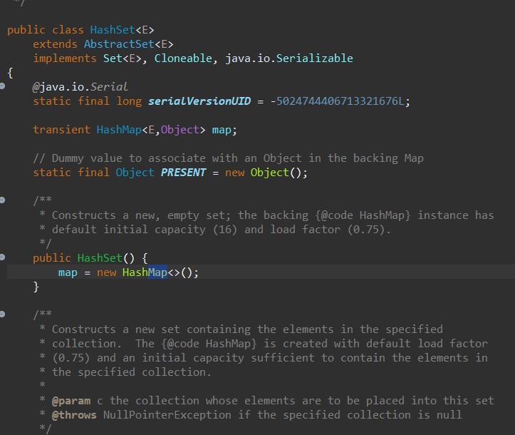

- Whenever you create a `HashSet` object, one `HashMap` object associated with it is also created. This `HashMap` object is used to store the elements you enter in the `HashSet`.
- When you add an element to a HashSet, it first computes a hash code (a unique integer) using the element’s `hashCode()` method.
- The elements you add into `HashSet` are stored as keys of this `HashMap` object. The value associated with those keys will be a constant object called `PRESENT` (since a `HashSet` doesn't need values). This is why `HashSet` provides fast lookups, additions, and deletions—because it’s leveraging `HashMap`.

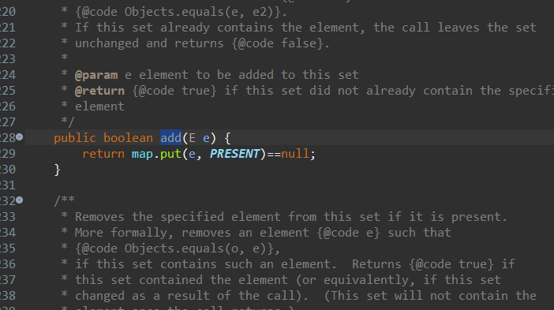

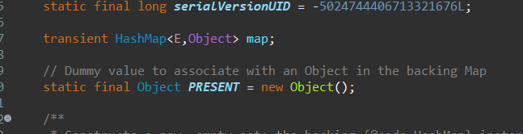

- Consider the below image, which shows how `HashSet` internally uses `HashMap`.

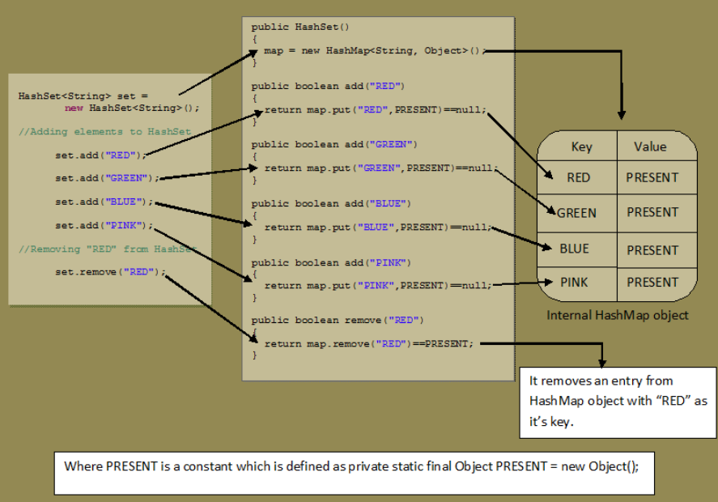

- In `HashMap`, which backs the `HashSet`, a bucket or array concept is used. The number of buckets (the size of the array) is determined by the capacity of the `HashMap`. `HashMap` (and therefore `HashSet`) starts with **16** buckets. This initial capacity is the default, but it can increase dynamically as more elements are added (this process is called **rehashing**).
- The capacity of the bucket array is always a power of two (16, 32, 64, etc.) for efficient indexing and memory management.

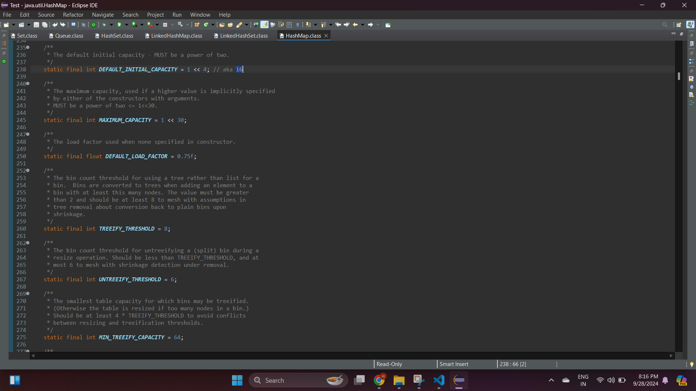

- These buckets are basically array based, so it will have indexes starting from 0-15 initially, so how does the elements of set is placed inside these buckets? this is by using a simple mathematical hashing algorithm (`hashCode()`% capacity (16)). Every object in Java inherits the `hashCode()` method from the `Object` class. Once the `hashCode()` is generated, `HashMap` further processes it using a hashing function to distribute the hash values evenly across the buckets. The typical operation involves **bit manipulation** to ensure a more uniform distribution across buckets.
- Lets see an example. Suppose you need to add 3 elements in your `HashSet`.
- Each element is passed through a hash function to generate a hash code (a number). Consider below a sample hashCode for the elements.
    - "Apple" -> hashCode: 1024
    - "Banana" -> hashCode: 1025
    - "Cherry" -> hashCode: 1026
- Initially , there are 16 buckets or the array size is 16.

```
|--- Bucket[0] ---|--- Bucket[1] ---|--- Bucket[2] ---|...|--- Bucket[15] ---|
|                 |                 |                 |...|                  |
```

- Now based on the hashing algorithm , each hashCode is divided by the capacity, 
    - "Apple" -> hashCode: 1024 % 16 = 0th index - goes to Bucket[0]
    - "Banana" -> hashCode: 1025 % 16 = 1st index - goes to Bucket[1]
    - "Cherry" -> hashCode: 1026 % 16 = 2nd index - goes to Bucket[2]

```
|--- Bucket[0] ---|--- Bucket[1] ---|--- Bucket[2] ---|...|--- Bucket[15] ---|
|   "Apple"       |   "Banana"      |   "Cherry"      |...|                  |
```

- Before adding an element, `HashSet` checks if there is already an element with the same hash code and equal content using the `equals()` method. If so, the element won’t be added, ensuring no duplicates.
- Suppose , another element lets say "Grapes" has a same hashCode which is 1024, so again post applying hash algorithm using capacity, it will get again get the same Bucket[0], now already inside the Bucket[0] there is an element "Apple", now "Apple" and "Grapes" are putted together in **LinkedList**.


```
|--- Bucket[0] ---|--- Bucket[1] ---|--- Bucket[2] ---|...|--- Bucket[15] ---|
| "Apple" -> "Grapes" | "Banana"    | "Cherry"        |...|                  |
```

- When two or more elements has same hashCode , this is called a **hashing collision**. This will happens sometimes and such elements will end up in the same bucket.

>[!NOTE]
> - Before Java 8: It used a simple linked list in each bucket to handle collisions.
> - From Java 8 Onward: When the number of elements in a bucket exceeds a certain threshold (8 elements), the linked list is converted into a balanced tree to improve search efficiency from **O(n)** to **O(log n)**.

- So when you search for an element like "Grapes", Java first uses the `hashCode()` to find the bucket (e.g., Bucket[0]), then traverses the linked list inside that bucket. It checks each node (like "Apple") using the `equals()` method to find the correct element.

######  Why is the HashSet is Unordered?

- The order in a HashSet is based on the hash codes and the bucket index they map to, not the insertion order of the elements. Elements are placed in a bucket depending on their hash code. Since different elements may have different hash codes, they are stored in different buckets. For example, "Apple" might go into Bucket[0], "Banana" into Bucket[1], "Cherry" into Bucket[2]. Their order depends on how their hash codes map to the available buckets. Hence, the iteration order when retrieving elements from the `HashSet` will appear unordered.

##### Memory Management

- Capacity refers to the size of the bucket array (i.e., the number of available slots for elements). By default, a `HashSet` starts with an initial capacity of **16** buckets. This means that when you create a `HashSet` and begin adding elements, they are initially distributed across these 16 slots.
- The load factor determines when the `HashSet` (or `HashMap`) will grow to avoid too many collisions. The default load factor is **0.75**, which means the `HashSet` will resize itself when the number of elements exceeds **75%** of the total capacity. In a default `HashSet` with 16 buckets, 0.75 * 16 = 12. So, when the 13th element is added, the `HashSet` will automatically resize (double its capacity).
- When the `HashSet` reaches the threshold defined by the load factor (e.g., 12 elements in a set with 16 buckets), it triggers a **rehashing operation** to grow the bucket array. The size of the bucket array is doubled to reduce collisions and distribute the elements more evenly.
- In this rehashing operation:
    - It creates a new larger array of size 32 (if the earlier size was of 16).
    - After the new array is created, the existing elements from the old array are rehashed (i.e., their hash codes are recalculated (**`hashCode()`%32**) relative to the new array size). The elements are then reinserted into the new array, with the proper bucket index based on the new capacity.
    - This new array is allocated in memory, and it will replace the old one as the primary storage for the `HashSet` elements. The old array, which was smaller, is no longer referenced and becomes eligible for garbage collection.

```
Initial array (size 16):
|--- Bucket[0] ---|--- Bucket[1] ---|--- Bucket[2] ---| ... |--- Bucket[15] ---|
| Element1        |                 | Element2        |     | Element3         |


New array (size 32):
|--- Bucket[0] ---|--- Bucket[1] ---|--- Bucket[2] ---| ... |--- Bucket[31] ---|
|      Element1   |                 |      Element2   |     |   Element3       |
```


- If any elements remove, the size gets shrink in `HashSet`? No, Unlike `ArrayList`, `HashSet` does not shrink automatically when elements are removed. Once the bucket array grows, it stays that size until the `HashSet` is discarded. This is because shrinking the array could result in too many collisions again, making the performance inefficient. To avoid frequent resizing (both up and down), `HashSet` only grows when necessary and does not shrink by itself.

#### LinkedHashSet 

- `LinkedHashSet` is a subclass of `HashSet` in Java that maintains a linked list of the entries in the set. This means it preserves the insertion order of the elements, unlike `HashSet`, which does not guarantee any order.

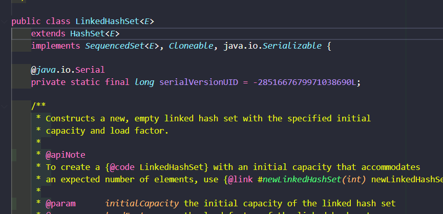

- In short:
    - `HashSet` is unordered.
    - `LinkedHashSet` is ordered based on insertion order.
- Like all sets, `LinkedHashSet` does not allow duplicate elements.
- Lets see an example

```
import java.util.LinkedHashSet;

public class AboutLinkedHashSet {
    public static void main(String[] args) {
        LinkedHashSet<String> lhs = new LinkedHashSet<>();
        
        // Adding elements
        lhs.add("Apple");
        lhs.add("Banana");
        lhs.add("Grapes");
        lhs.add("Orange");

        // Adding duplicate value
        lhs.add("Apple");
        
        System.out.println("LinkedHashSet: " + lhs);  // Preserves insertion order
        
        // Checking if element exists
        System.out.println("Contains Banana? " + lhs.contains("Banana"));

        // Removing an element
        lhs.remove("Grapes");
        System.out.println("After removal: " + lhs);

        // Iterating over LinkedHashSet
        System.out.println("Iterating:");
        for (String fruit : lhs) {
            System.out.println(fruit);
        }
        
        // Getting size
        System.out.println("Size of LinkedHashSet: " + lhs.size());

        // Clearing the LinkedHashSet
        lhs.clear();
        System.out.println("After clearing: " + lhs);
    }
}


Output:
LinkedHashSet: [Apple, Banana, Grapes, Orange]
Contains Banana? true
After removal: [Apple, Banana, Orange]
Iterating:
Apple
Banana
Orange
Size of LinkedHashSet: 3
After clearing: []
```

- Just like in `ArrayList`, we can use generic concept to ensure type safety in `LinkedHashSet`.

>[!IMPORTANT]
> - `LinkedHashSet` preserves the order in which elements are added. When iterating, elements are retrieved in the order they were inserted.
> - `LinkedHashSet` allows one `null` element. This is similar to HashSet, which also allows `null`.
> - The performance for basic operations (add, remove, contains) is generally **O(1)**, similar to `HashSet`, but slightly slower due to the overhead of maintaining the linked list.
> - `LinkedHashSet` is not synchronized.

##### Internal Working of LinkedHashSet

- `LinkedHashSet` combines the features of a `HashSet` and a **doubly linked list** to maintain both uniqueness and insertion order. `LinkedHashSet` is backed by a HashMap where the elements are stored as keys. Each key maps to a constant dummy value (`true`).

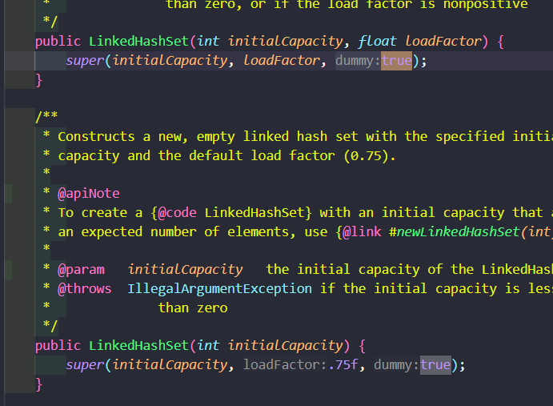

- In addition to the hash table structure, `LinkedHashSet` maintains a doubly linked list that keeps track of the insertion order of the elements. Each node in the doubly linked list contains a reference to the next and previous nodes, allowing efficient iteration in the order of insertion.


- When an element is added, it is first checked for uniqueness (using the hash code and equality check via the `HashMap`).
If the element is unique, it is added to the hash table (as a key in the `HashMap`) and also inserted into the doubly linked list at the end. When an element is removed, it is removed from both the hash table and the linked list. The references in the doubly linked list are updated to maintain the order.
- Doubly linked list structure

```
[Apple] <-> [Banana] <-> [Grapes]
```

- `HashMap` structure with bucket concept similarly in `HashSet`.

```
|--- Bucket[0] ---|--- Bucket[1] ---|--- Bucket[2] ---|...|--- Bucket[15] ---|
| "Apple" -> "Grapes" | "Banana"    | "Cherry"        |...|                  |
```

- `LinkedHashSet` efficiently combines the strengths of a `HashSet` (for fast lookups and uniqueness) and a **doubly linked list** (for maintaining insertion order). The two structures work together to provide a unique, ordered collection with O(1) average time complexity for basic operations. `LinkedHashSet`, the buckets and the doubly linked list are maintained separately, but they work together to provide the functionalities of both a HashSet and an ordered collection.
- Buckets (Array of HashMap):
    - The `LinkedHashSet` uses an underlying HashMap to store its elements. This is where the buckets come into play. Each bucket corresponds to an index in an array, which is calculated based on the hash code of the elements.
    - Buckets are used for:
        - Storage: Holding the actual elements (as keys) along with their dummy values.
        - Fast Access: Providing **O(1)** average time complexity for operations like add, remove, and contains.
- Doubly Linked List:
    - The doubly linked list is used to maintain the order of the elements based on the sequence they were added. Each element in the linked list points to the next and previous elements, allowing for easy traversal in both directions.

##### Memory Management

- The memory management of a `LinkedHashSet` is closely tied to its underlying data structure, which consists of a HashMap for storing elements and a doubly linked list for maintaining the order of insertion.

**1. Initial Capacity and Load Factor**

- Initial Capacity: When you create a `LinkedHashSet`, it has a default initial capacity of **16**. This is the number of buckets in the underlying HashMap.
- Load Factor: The default load factor is **0.75**, which means that when **75%** of the current capacity is filled (in this case, after 12 elements), the `LinkedHashSet` will resize itself.


**2. Growth Mechanism**

- Rehashing: When the number of elements in the LinkedHashSet exceeds the threshold (calculated as capacity * load factor), a rehash occurs:
- A new internal array of buckets is created with double the size of the original.
- All existing elements from the old buckets are rehashed and placed into the new buckets based on the new size.
- The doubly linked list structure remains unchanged, preserving the insertion order.


**3. Shrinking Mechanism**

- `LinkedHashSet` does not automatically shrink its size when elements are removed. This means that once the capacity has increased due to rehashing, it stays at the larger size even if many elements are removed.
- When an element is removed from the `LinkedHashSet`, the corresponding node in the doubly linked list is removed. The links (pointers) of the neighboring nodes are updated to maintain the list’s integrity. The memory occupied by the removed node is released. The memory that was being used by the removed node is freed, so it is no longer occupying space.


#### Sorted Set

- `SortedSet` is an interface in the Java Collections Framework that extends the `Set` interface and ensures that the elements are stored in a sorted order. It guarantees that the elements in the set are arranged either in their natural ordering or by a custom comparator (if provided).

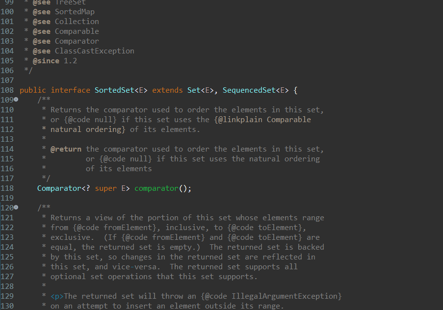

##### TreeSet

- `TreeSet` is a concrete implementation of the `SortedSet` interface. 
- By default, `TreeSet` uses natural ordering to sort the elements. This means elements are sorted based on their natural comparison like numbers are sorted in ascending order and string are sorted alphabetically. This is done using `Comparable` interface.
- You can also provide a custom comparator when creating the `TreeSet`. This allows you to define your own sorting logic. This is done using `Comparator` interface.

*We will learn about Comparable and Comparator interfaces later*

- `TreeSet` implements the `NavigableSet` interface, so you can perform these navigation operations efficiently. These methods are helpful when you want to traverse the set or find elements based on proximity to a given value. `NavigableSet` is a sub interface of `SortedSet` that provides navigation methods to return elements relative to a given value. It extends the capabilities of SortedSet by allowing for efficient searching, retrieving, and manipulating of elements in the set.
- Lets see an example how does `TreeSet` does sorting.

```
import java.util.Comparator;
import java.util.TreeSet;

public class AboutTreeSet {

    // Custom Comparator to sort integers based on sum of digits
    static class SumOfDigitsComparator implements Comparator<Integer> {
        @Override
        public int compare(Integer num1, Integer num2) {
            int sum1 = getDigitSum(num1);
            int sum2 = getDigitSum(num2);
            
            if (sum1 != sum2) {
                return sum1 - sum2; // Compare by digit sum
            } else {
                return num1 - num2; // If digit sums are equal, compare naturally
            }
        }
        
        // Helper method to calculate the sum of digits
        private int getDigitSum(int num) {
            int sum = 0;
            while (num != 0) {
                sum += num % 10;
                num /= 10;
            }
            return sum;
        }
    }

    public static void main(String[] args) {
        // Natural sorting (default)
        TreeSet<Integer> naturalSortSet = new TreeSet<>();
        naturalSortSet.add(10);
        naturalSortSet.add(5);
        naturalSortSet.add(20);
        naturalSortSet.add(15);
        System.out.println("Natural Sorting: " + naturalSortSet);

        // Custom sorting (descending order)
        TreeSet<Integer> customSortSet = new TreeSet<>(Comparator.reverseOrder());
        customSortSet.add(10);
        customSortSet.add(5);
        customSortSet.add(20);
        customSortSet.add(15);
        System.out.println("Custom Sorting (Descending): " + customSortSet);

        //Define Custom Sorting method using Comparator
        /**
         * sort integers based on the sum of their digits. 
         * If two integers have the same digit sum, they are ordered in natural order.
         */
        // TreeSet with custom sorting logic (based on sum of digits)
        TreeSet<Integer> customSortedSet = new TreeSet<>(new SumOfDigitsComparator());
        customSortedSet.add(45);
        customSortedSet.add(12);
        customSortedSet.add(102);
        customSortedSet.add(56);
        customSortedSet.add(93);

        // Display the TreeSet with custom sorting logic
        System.out.println("TreeSet with Custom Sorting (Sum of Digits): " + customSortedSet);
        
        // Using TreeSet Methods:
        System.out.println("First Element: " + customSortedSet.first()); // First element in set
        System.out.println("Last Element: " + customSortedSet.last());   // Last element in set
        
        // Using NavigableSet Methods
        System.out.println("Lower than 56: " + customSortedSet.lower(56));   // Element just below 56
        System.out.println("Floor of 57: " + customSortedSet.floor(57));     // Element less than or equal to 57
        System.out.println("Ceiling of 12: " + customSortedSet.ceiling(12)); // Element greater than or equal to 12
        System.out.println("Higher than 56: " + customSortedSet.higher(56)); // Element just above 56

        // Polling Methods (removes first and last elements)
        System.out.println("Poll First Element: " + customSortedSet.pollFirst()); // Removes first element
        System.out.println("Poll Last Element: " + customSortedSet.pollLast());   // Removes last element
        
        // Remaining elements after polling
        System.out.println("TreeSet After Polling: " + customSortedSet);
    }
}


Output:
Natural Sorting: [5, 10, 15, 20]
Custom Sorting (Descending): [20, 15, 10, 5]
TreeSet with Custom Sorting (Sum of Digits): [12, 102, 45, 56, 93]
First Element: 12
Last Element: 93
Lower than 56: 45
Floor of 57: 56
Ceiling of 12: 12
Higher than 56: 93
Poll First Element: 12
Poll Last Element: 93
TreeSet After Polling: [102, 45, 56]
```

- Just like in `ArrayList`, we can use generic concept to ensure type safety in `TreeSet`.
- Consider below code.

```
import java.util.TreeSet;

class Animal {
    String name;

    Animal(String name) {
        this.name = name;
    }
}

public class TreeSetClassCastExceptionExample {
    public static void main(String[] args) {
        // Attempt to create a TreeSet without providing a Comparator
        TreeSet<Animal> animalsSet = new TreeSet<>();
        animalsSet.add(new Animal("Cat"));
        animalsSet.add(new Animal("Dog"));
        
        // This will throw a ClassCastException because Animal does not implement Comparable
    }
}

Output:
Exception in thread "main" java.lang.ClassCastException: Animal cannot be cast to Comparable
```

- The `Animal` class doesn't implement `Comparable`, and no `Comparator` is provided, so the `TreeSet` cannot determine how to order the `Animal` objects. To fix this, you either need to make `Animal` implement `Comparable` or provide a `Comparator` when creating the `TreeSet`. 

```
Using Comparable
class Animal implements Comparable<Animal> {
    String name;

    Animal(String name) {
        this.name = name;
    }

    @Override
    public int compareTo(Animal other) {
        return this.name.compareTo(other.name); // Natural sorting based on name
    }

    @Override
    public String toString() {
        return this.name;
    }
}

public class TreeSetComparableExample {
    public static void main(String[] args) {
        TreeSet<Animal> animalsSet = new TreeSet<>();
        animalsSet.add(new Animal("Cat"));
        animalsSet.add(new Animal("Dog"));
        animalsSet.add(new Animal("Elephant"));

        System.out.println("TreeSet with Comparable: " + animalsSet);
    }
}

Output:
TreeSet with Comparable: [Cat, Dog, Elephant]


Using Comparator
import java.util.Comparator;
import java.util.TreeSet;

class Animal {
    String name;

    Animal(String name) {
        this.name = name;
    }

    @Override
    public String toString() {
        return this.name;
    }
}

public class TreeSetComparatorExample {
    public static void main(String[] args) {
        // Providing a custom Comparator for Animal class
        TreeSet<Animal> animalsSet = new TreeSet<>(new Comparator<Animal>() {
            @Override
            public int compare(Animal a1, Animal a2) {
                return a1.name.compareTo(a2.name); // Sorting by name
            }
        });
        
        animalsSet.add(new Animal("Cat"));
        animalsSet.add(new Animal("Dog"));
        animalsSet.add(new Animal("Elephant"));

        System.out.println("TreeSet with Comparator: " + animalsSet);
    }
}

Output:
TreeSet with Comparator: [Cat, Dog, Elephant]
```

- **In a `TreeSet`, elements must be comparable to each other because the `TreeSet` relies on comparisons to sort the elements. If you attempt to insert elements that do not implement the `Comparable` interface and also don't provide a `Comparator`, the `TreeSet` won't know how to order the elements, and it will throw a `ClassCastException`**.

>[!IMPORTANT]
> - `Null` elements are not allowed in a TreeSet. If you try to insert a null element, it will throw a `NullPointerException` at runtime.
> - The default sorting order is natural for elements implementing `Comparable`. You can use a custom `Comparator` for your own sorting logic.
> - Like other Set implementations, `TreeSet` does not allow duplicate elements.
> - `TreeSet` implements the `NavigableSet` interface, which provides methods to navigate through the set like `higher()`, `lower()`, `ceiling()`, and `floor()`.
> - If you try to create a `TreeSet` with elements that are not comparable, you’ll get a `ClassCastException` unless you provide a comparator.
> - `TreeSet` is **not thread-safe**. It is not synchronized, which means that if multiple threads access a `TreeSet` concurrently, and at least one of them modifies the set, you must manually synchronize the access to avoid race conditions.
> - The time complexity for basic operations like `add()`, `remove()`, and `contains()` in a `TreeSet` is **O(log n)** because it is implemented using a Red-Black tree (a balanced binary search tree).

###### Internal Working of TreeSet

- The `TreeSet` is much similar to the `HashSet` class. The major difference between both classes is used data structure between them. The `HashSet` uses a Hashtable, and the `TreeSet` uses a self-balancing tree.

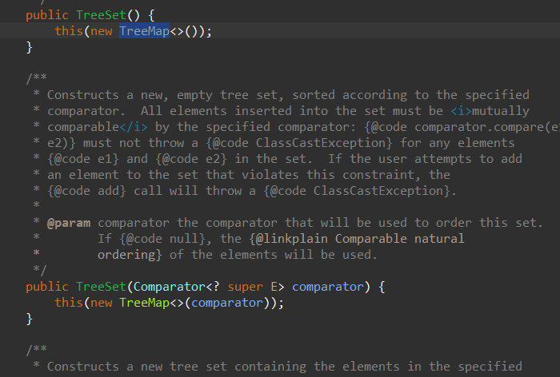

- The `TreeSet` in Java is implemented internally using a `TreeMap`, which is a **Red-Black Tree**. A **Red-Black Tree** is a type of **self-balancing binary search tree**, ensuring that all basic operations like insertion, deletion, and search take **O(log n)** time. The key feature of a `TreeSet` is that it automatically sorts the elements in natural order or based on a custom comparator.
- Imagine each element as a node in a binary tree, where smaller elements go to the left, and larger elements go to the right. Here's how a `TreeSet` might look internally when elements are added. For example, adding the elements 50, 30, 70, 20, 40, 60, and 80 to a `TreeSet`.

```
           50
          /  \
        30    70
       /  \   /  \
      20  40 60  80
```

1. The root node is 50.

2. 30 is smaller than 50, so it goes to the left.

3. 70 is larger than 50, so it goes to the right.

4. 20 is smaller than both 50 and 30, so it goes to the left of 30, and so on.

- But where are the corresponding values of the keys are maintained? , itself in the node of the red-black tree.

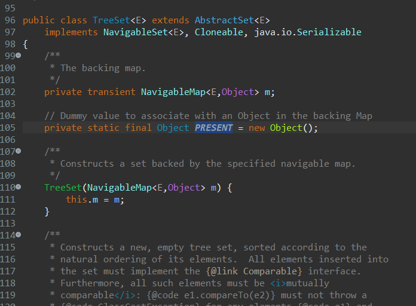

- Lets say you are inserting fruit names like "apple", "mango", and "date" into a `TreeSet`.
    - The keys are the strings: "apple", "mango", "date".
    - The values are a dummy object (e.g., `PRESENT`).

```
           "date" (PRESENT)
          /                \
   "apple" (PRESENT)     "mango" (PRESENT)
```

- "apple", "date", and "mango" are the keys (the fruit names). `PRESENT` is the dummy value for each key, just a placeholder object that `TreeSet` doesn't care about, but `TreeMap` needs for its key-value pair structure.
-  Since `TreeMap` does not allow duplicate keys, `TreeSet` ensures that no duplicate fruit names (or elements) can be added. The fruit names will be stored in sorted order (alphabetically in this case) because the `TreeSet` is backed by the Red-Black Tree structure from `TreeMap`.
- This key-value pair is stored in every node, and the tree organizes itself based on the key for sorting.
- `TreeSet` does not rely on hashing mechanism and does not have a bucket concept just like in `HashSet`, it purely relies on binary search tree concept.

###### Memory Management

- Memory management in TreeSet is handled by the Red-Black Tree structure. Each element in the `TreeSet` is stored as a node in the tree. Each node stores:
    - The element (key) itself and a dummy value (`PRESENT`)
    - Pointers to the left and right child nodes.
    - A color (Red or Black) to maintain the balance of the tree (since it's a Red-Black Tree).
- As elements are added or removed, the tree is rebalanced automatically to maintain its self-balancing property, ensuring that no branch of the tree becomes too long, which would slow down operations.
- Memory usage in a `TreeSet` increases as the number of elements grows. Each element takes additional memory because the tree has to store references to child nodes and color information. However, this structure ensures efficient sorting and searching with a time complexity of **O(log n)**.

### Collection with Wrapper Classes

- If you observer carefully, wherever we defined collections, we always used Wrapper class. When working with collections in Java, you need to use wrapper classes for primitive data types. Java collections like `ArrayList`, `HashMap`, and `HashSet` are designed to store objects, not primitive types like `int`, `double`, or `boolean`. Wrapper classes represent primitives as objects. Wrapper classes like `Integer`, `Double`, and `Boolean` provide a way to encapsulate primitive values within objects, allowing you to store them in collections.
- You cannot directly work with primitive data types in the Java Collection Framework. The collections framework is designed to work with objects, and primitive types (like `int`, `double`, `boolean`, etc.) are not objects in Java.
- Now consider below code

```
public class WrapperExample {
 
    public static void main(String[] args) {
        
        /**
         * Arrays used with primitive datatype
         */
        int a[] = new int[5];
        for(int i=0;i<5;i++){
            a[i]=i*5;
            System.out.println("Item: "+a[i]);
        }
        
        /**
         * Arrays used with Wrapper classes
         */
        Integer b[] = new Integer[5];
        for(int i=0;i<5;i++){
            b[i]=i*-5;
            System.out.println("Item: "+b[i]);
        }
    }

}

Output:
Item: 0
Item: 5
Item: 10
Item: 15
Item: 20
Item: 0
Item: -5
Item: -10
Item: -15
Item: -20
```

- If you see **Arrays** can work with primitive datatype as well as with Wrapper classes. **Arrays** are a fundamental part of the Java language itself and have specific optimizations that allow them to store primitive types directly in memory, ensuring efficiency and when you create an array of objects (e.g., `Integer[]`), the array stores references to those objects. This works for wrapper classes or any other object. In contrast, collections are part of the Java Collections Framework, which is designed to work with objects and requires references, so it doesn’t support primitive types directly. Java collections leverage generics, which only work with objects because they rely on type parameters, which need to reference classes (i.e., objects). Primitive types, being lower-level than objects, are not compatible with this generic-based system.
 
### Collection Framework Class Hierarchy
 

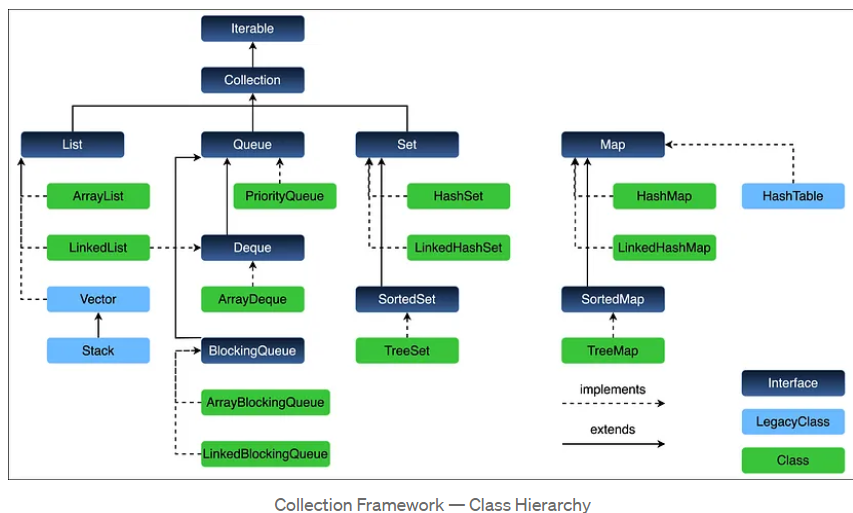


#### Iterable Interface

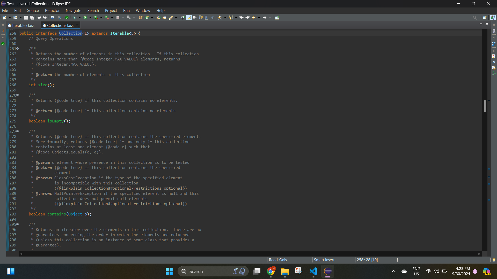

- If you see `Collection` interface **extends Iterable** interface. What is it ? and why does the `Collection` interface extends `Iterable` interface? , if you remember about the enhanced for loop we learned

```
        /**
         * Enhanced for loop
         */
        for(int i: fixedSizeArray){
            System.out.println(i);
        }

Output:
10
20
10
```

- The enhanced for-loop (also known as the "for-each" loop) is part of the `Iterable` interface.

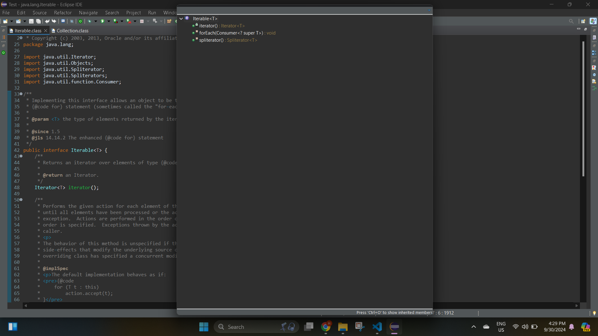


- You won't be able to see the enhanced for-loop directly in the interface, because the enhanced for-loop (`for (ElementType element : collection)`) is a syntactic construct introduced in Java 5 to simplify iteration over collections or arrays. It doesn't directly correspond to any method in the `Iterable` interface, but it implicitly uses the `iterator()` method to perform the iteration.
-  Extending `Iterable` allows any collection (like `List`, `Set`, etc.) to be traversed. This simplifies iteration and makes the code more readable. It provides a standardized way for traversing collections. By implementing `Iterable`, any collection class can provide its own custom logic for how the elements should be iterated over.
- There are three ways in which elements can be iterated in Java, the enhanced for loop, the `forEach()` method, and the `iterator()` method.

##### forEach

- Lets see the `forEach()` method.

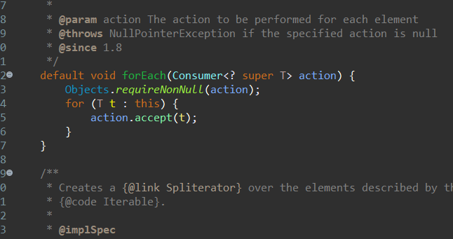

- The `forEach()` method requires input as `Consumer`. What is it? lets open `Consumer`.

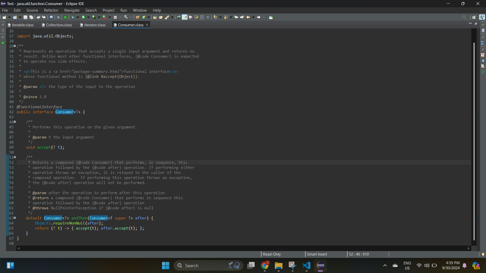

- It a generic interface, which requires a type parameter (`T`). So lets implement this interface and use `forEach()` for iteration.

```

import java.util.ArrayList;
import java.util.List;
import java.util.function.Consumer; 

class MyConsumer implements Consumer<String>{

    @Override
    public void accept(String t) {
        System.out.println("City Name - "+t);
    }
    
}

public class AboutForEach {
    public static void main(String[] args) {
        List<String> data = new ArrayList<>(); 
        data.add("New Delhi"); 
        data.add("New York"); 
        data.add("Mumbai"); 
        data.add("London");


        MyConsumer con = new MyConsumer();
        data.forEach(con);
    }
}

Output:
City Name - New Delhi
City Name - New York
City Name - Mumbai
City Name - London
```

- Since we are using `MyConsumer` class only once, we can modified our code and make `MyConsumer` class as anonymous class.

```

import java.util.ArrayList;
import java.util.List;
import java.util.function.Consumer; 

public class AboutForEach {
    public static void main(String[] args) {
        List<String> data = new ArrayList<>(); 
        data.add("New Delhi"); 
        data.add("New York"); 
        data.add("Mumbai"); 
        data.add("London");

        /**
        * Anonymous class
        */
        data.forEach(new Consumer<String>() {
            @Override
            public void accept(String t)
            { 
                System.out.println("City Name - "+t);
            }
     } );
    }
}


Output:
City Name - New Delhi
City Name - New York
City Name - Mumbai
City Name - London
```

- Now when we learned about **lambda** expression, when there is one class we can simplify our code more like below

```

import java.util.ArrayList;
import java.util.List;
import java.util.function.Consumer; 

class MyConsumer implements Consumer<String>{

    @Override
    public void accept(String t) {
        System.out.println("City Name - "+t);
    }
    
}

public class AboutForEach {
    public static void main(String[] args) {

        List<String> data = new ArrayList<>(); 
        data.add("New Delhi"); 
        data.add("New York"); 
        data.add("Mumbai"); 
        data.add("London");

        /**
         * Lambda Expression
         */
        data.forEach(i -> System.out.println("City Name - "+i));
    }
}


Output:
City Name - New Delhi
City Name - New York
City Name - Mumbai
City Name - London
```

- This is how we can use `forEach()` method with lambda expression to iterate over elements.
- Lets see some more ways to use `forEach()`.

```

import java.util.ArrayList;
import java.util.List;
import java.util.function.Consumer; 

class MyConsumer implements Consumer<String>{

    @Override
    public void accept(String t) {
        System.out.println("City Name - "+t);
    }
    
}

public class AboutForEach {
    public static void main(String[] args) {
        List<String> data = new ArrayList<>(); 
        data.add("New Delhi"); 
        data.add("New York"); 
        data.add("Mumbai"); 
        data.add("London");

         // Using forEach() with a method reference
         System.out.println("\nUsing forEach with method reference:");
         data.forEach(System.out::println);
 
         // Using forEach() with a custom Consumer
         System.out.println("\nUsing forEach with custom Consumer:");
         Consumer<String> consumer = item -> System.out.println("City Name: " + item);
         data.forEach(consumer);
    }
}


Output:
Using forEach with method reference:
New Delhi
New York
Mumbai
London

Using forEach with custom Consumer:
City Name: New Delhi
City Name: New York
City Name: Mumbai
City Name: London
```

- The lambda expression works with functional interface, so **Consumer** is a functional interface. But if you notice there is one default method with name `andThen()`.


- A functional interface in Java is an interface that contains **exactly one abstract method**. **The presence of default and static methods does not change the fact that an interface is a functional interface**. As long as the interface has exactly one abstract method, it qualifies as a functional interface.
- What the purpose of `andThen()` method?

```

import java.util.ArrayList;
import java.util.List;
import java.util.function.Consumer; 

public class AboutForEach {
    public static void main(String[] args) {
        List<String> data = new ArrayList<>(); 
        data.add("New Delhi"); 
        data.add("New York"); 
        data.add("Mumbai"); 
        data.add("London");

         // First Consumer: Prints the City name
        Consumer<String> printConsumer = (String item) -> System.out.println("City Name: " + item);

        // Second Consumer: Prints the length of the City name
        Consumer<String> lengthConsumer = (String item) -> System.out.println("Length: " + item.length());

        // Chain both Consumers using andThen
        Consumer<String> combinedConsumer = printConsumer.andThen(lengthConsumer);

        // Apply the combined Consumer on each element of the list
        data.forEach(combinedConsumer);
    }
}


Output:
City Name: New Delhi
Length: 9
City Name: New York
Length: 8
City Name: Mumbai
Length: 6
City Name: London
Length: 6
```

- The `andThen()` method chains these two consumers together. The first consumer is executed, followed by the second. Finally, we use `forEach()` to apply the combined consumer on each element of the list.

##### Iterator Interface

- The `Iterable` interface represents a collection that can be iterated over. It has a method, `iterator()`, which returns an `Iterator`. This method must be implemented by any class that implements `Iterable` or `Collection` interface.
- The `Iterator` interface is the actual mechanism used to iterate over elements in a collection, one element at a time. An `Iterator` object provides methods to traverse the collection:
    - `hasNext()`: Returns true if there are more elements to iterate over.
    - `next()`: Returns the next element in the iteration.
    - `remove()`: Removes the current element from the collection (optional operation).
- Lets see example of `Iterator` interface.

```
import java.util.ArrayList;
import java.util.Iterator;

public class AboutIterator {
    public static void main(String[] args) {
        // Create an ArrayList (which implements the Iterable interface)
        ArrayList<String> list = new ArrayList<>();
        list.add("Java");
        list.add("Python");
        list.add("C++");
        list.add("Ruby");

        // Obtain an iterator from the list
        Iterator<String> iterator = list.iterator();

        System.out.println("Using hasNext() and next() methods:");
        // Use hasNext() and next() to iterate through the list
        while (iterator.hasNext()) {
            // hasNext() checks if there are more elements
            String element = iterator.next(); // next() retrieves the next element
            System.out.println(element);
        }

        // Obtain another iterator to demonstrate remove()
        iterator = list.iterator();
        System.out.println("\nRemoving elements using remove():");
        
        // Traverse and remove "Python" from the list
        while (iterator.hasNext()) {
            String element = iterator.next();
            if (element.equals("Python")) {
                iterator.remove(); // remove the current element ("Python")
                System.out.println("Removed: " + element);
            }
        }

        // Verify that "Python" was removed from the list
        System.out.println("\nFinal list after removal:");
        for (String language : list) {
            System.out.println(language);
        }
    }
}


Output:
Using hasNext() and next() methods:
Java
Python
C++
Ruby

Removing elements using remove():
Removed: Python

Final list after removal:
Java
C++
Ruby
```

- If you observed carefully, the `remove()` method , removes the element during the iteration, but still it does not throws `ConcurrentModificationException` why? a `ConcurrentModificationException` is typically thrown when a collection is modified structurally (e.g., adding or removing elements) while iterating over. This happens because the Iterator expects that the collection remains unchanged during the iteration.
-  `Iterator.remove()` is a safe way to modify the collection while iterating. Since the Iterator keeps track of the iteration process (like the current element and its position in the collection), when you use `remove()`, it updates its internal state accordingly. This prevents inconsistencies that could arise from modifying the collection directly while iterating.
- The enhanced for-loop internally uses `Iterator` interface. So do you think it won't throw `ConcurrentModificationException`. Lets see the code.

```
import java.util.ArrayList;
import java.util.Iterator;

public class AboutIterator {
    public static void main(String[] args) {
        // Create an ArrayList (which implements the Iterable interface)
        ArrayList<String> list = new ArrayList<>();
        list.add("Java");
        list.add("Python");
        list.add("C++");
        list.add("Ruby");

        /**
         * Enhanced for loop
         */
        for(String i: list){
            System.out.println(i);
            list.remove(i);
        }
    }
}


Output:
Exception in thread "main" java.util.ConcurrentModificationException
        at java.base/java.util.ArrayList$Itr.checkForComodification(ArrayList.java:1095)
        at java.base/java.util.ArrayList$Itr.next(ArrayList.java:1049)
        at AboutIterator.main(AboutIterator.java:43)
```

- when you use the for-each loop in Java (e.g., `for (String item : list)`), Java automatically uses an iterator behind the scenes to traverse the elements of the collection. You don’t explicitly create or manage the Iterator object. You don’t see or control the Iterator, but the Java compiler automatically converts the for-each loop into an iterator-based loop.
- Then why we got exception? because the for-each loop doesn't allow direct modification of the collection (like removing an element), because it **doesn't give you direct access to the Iterator**. In contrast, when you use an explicit iterator (like the `Iterator<String>` above), you have access to the `remove()` method of the Iterator. That’s why you must use the `Iterator.remove()` method if you want to safely remove elements while iterating.
- For-each loop uses an implicit iterator, meaning you don’t see or manage the iterator, but it’s there working under the hood. You can’t call `remove()` inside a for-each loop because you don’t have access to the iterator directly.

##### spliterator

- The `Spliterator` is a special type of iterator in Java that is used to split a collection or data structure into multiple parts that can be processed in parallel. It’s most commonly used to improve performance by splitting tasks across multiple threads.
- In simple terms, think of it as:
    - An iterator that can split a collection into smaller chunks.
    - It helps make large tasks more manageable by allowing parallel processing.

```
import java.util.ArrayList;
import java.util.List;
import java.util.Spliterator;
import java.util.function.Consumer;

public class AboutSpliterator {
    public static void main(String[] args) {
        // Creating a list of strings
        List<String> list = new ArrayList<>();
        list.add("Java");
        list.add("Python");
        list.add("C++");
        list.add("JavaScript");
        list.add("Ruby");
        list.add("Go");

        // Getting a Spliterator from the list
        /**
         * A Spliterator is an object that knows how to traverse (iterate over) the elements in the list, 
         * but it can also split the list for parallel processing.
         */
        Spliterator<String> spliterator = list.spliterator();

        // Using tryAdvance() method to process elements one by one
        /**
         * This method processes only the next element in the list (starting from the first element) 
         * and then moves to the next element.
         * If an element exists, it runs the code in the accept() method (in this case, it prints the element).
         * only prints the first element because it's designed to move forward one step at a time.
         */
        System.out.println("Using tryAdvance():");
        spliterator.tryAdvance(new Consumer<String>() {
            @Override
            public void accept(String s) {
                System.out.println(s);
            }
        });

        // Using forEachRemaining() to process remaining elements
        /**
         * This method processes all remaining elements from where the Spliterator left off. 
         * It keeps moving through the list and applies the code (here, printing) to every remaining element.
         */
        System.out.println("\nUsing forEachRemaining():");
        spliterator.forEachRemaining(new Consumer<String>() {
            @Override
            public void accept(String s) {
                System.out.println(s);
            }
        });

        // Splitting the list into two parts using trySplit()
        Spliterator<String> spliterator2 = list.spliterator();

        /**
         * List Size//2 , the list is split roughly in half
         */
        Spliterator<String> spliteratorPart = spliterator2.trySplit();

        if (spliteratorPart != null) {
            System.out.println("\nFirst half:");
            spliteratorPart.forEachRemaining(System.out::println); // Processing first part
        }

        System.out.println("\nSecond half:");
        spliterator2.forEachRemaining(System.out::println); // Processing second part
    }
}


Output:
Using tryAdvance():
Java

Using forEachRemaining():
Python
C++
JavaScript
Ruby
Go

First half:
Java
Python
C++

Second half:
JavaScript
Ruby
Go
```

- When using parallel streams, the `Spliterator` divides a large collection into smaller chunks so that each chunk can be processed by different threads, which improves performance.

### Collections (Utility Class)

- We have saw about **Collection interface**, now there is a class with name **Collections**.

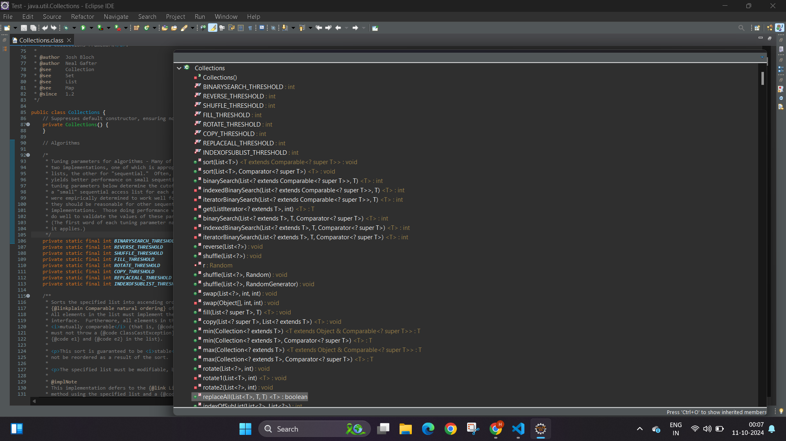

- If we explore methods inside the **Collections** class. We could all the methods are **static**.

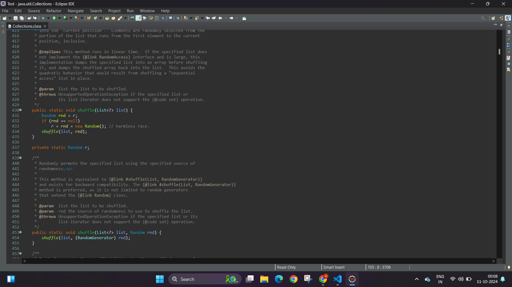

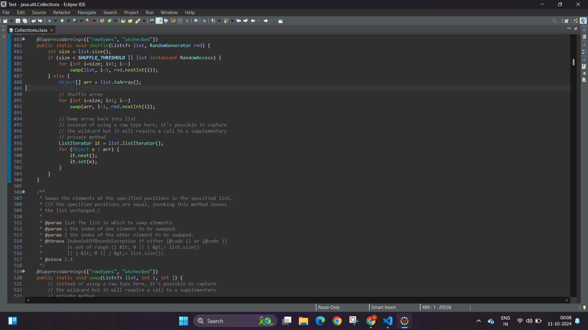

- What is this **Collections** class? , Before understanding it lets consider a example where we wanted to sort elements in an array. You can use a bubble sort algorithm and write down the code from scratch for it.

```
import java.util.*;
import java.util.Arrays;

public class AboutCollectionsUtilityClass{
    public static void main(String[] args) {
        
        //Without Collections class Sorting
        List<Integer> ArraysOfIntegers = new ArrayList<>(Arrays.asList(1000,34,55,77,88, 23,11));
        for(int i=0;i<ArraysOfIntegers.size();i++){
            for(int j=i+1;j<ArraysOfIntegers.size();j++){
                if(ArraysOfIntegers.get(i)>ArraysOfIntegers.get(j)){
                    int temp =ArraysOfIntegers.get(i);
                    ArraysOfIntegers.set(i, ArraysOfIntegers.get(j));
                    ArraysOfIntegers.set(j,temp);
                }
            }
        } 
       for (int i = 0; i < ArraysOfIntegers.size(); i++)
        System.out.println(ArraysOfIntegers.get(i));  

    }
}

Output:
11
23
34
55
77
88
1000
```

- The **Collections class** provides a in-built method to sort the array, check below.

```
import java.util.*;
import java.util.Arrays;

public class AboutCollectionsUtilityClass{
    public static void main(String[] args) {

        //With Collections
        Collections.sort(ArraysOfIntegers);
        for(int i: ArraysOfIntegers){
            System.out.println(i);
        }
    }
}


Output:
11
23
34
55
77
88
1000
```

- The `Collections` class in Java is a utility class in the **java.util** package that **provides bunch of static methods** to operate on or return collections. These methods help in manipulating and working with Collection-type data structures (like `List`, `Set`, `Map`, etc.) by offering functionalities like sorting, searching, synchronizing, and making collections immutable.
- The purpose of the **Collections** class is to provide utility methods that perform common operations on collection. Some of these operations include:
    - Sorting elements in a collection.
    - Searching for elements in a collection.
    - Making collections immutable or thread-safe.
    - Bulk operations like adding multiple elements at once, filling a collection with a specific value, etc.
- Lets see some other methods provided by **Collections class**.

```
import java.util.*;
import java.util.Arrays;

public class AboutCollectionsUtilityClass{
    public static void main(String[] args) {
        
        //Without Collections class Sorting
        List<Integer> ArraysOfIntegers = new ArrayList<>(Arrays.asList(1000,34,55,77,88, 23,11));
        for(int i=0;i<ArraysOfIntegers.size();i++){
            for(int j=i+1;j<ArraysOfIntegers.size();j++){
                if(ArraysOfIntegers.get(i)>ArraysOfIntegers.get(j)){
                    int temp =ArraysOfIntegers.get(i);
                    ArraysOfIntegers.set(i, ArraysOfIntegers.get(j));
                    ArraysOfIntegers.set(j,temp);
                }
            }
        } 
        System.out.println("Sorted List Using Manual Logic: "+ArraysOfIntegers);


        //With Collections
        Collections.sort(ArraysOfIntegers);
        System.out.println("Sorted List Using Collections.sort: "+ArraysOfIntegers);

        //Reversing
        Collections.reverse(ArraysOfIntegers);
        System.out.println("Reversed Array - "+ArraysOfIntegers);

        //Randomly Shuffles the elements
        Collections.shuffle(ArraysOfIntegers);
        System.out.println("Shuffling: " + ArraysOfIntegers);

        //Find Minium Element
        int min = Collections.min(ArraysOfIntegers);
        System.out.println("Minimum: " + min);


        //Find Maximum Element
        int max = Collections.max(ArraysOfIntegers);
        System.out.println("Maximum: " + max);

        //Binary Search Algorithm (Searches the list for the specified object using the binary search algorithm. The list must be sorted.)
        Collections.sort(ArraysOfIntegers);
        System.out.println("Current Integer List: "+ArraysOfIntegers);
        int index = Collections.binarySearch(ArraysOfIntegers, 23); //Return index value if found else -1
        System.out.println("Index of 23: " + index);
        System.out.println("Index of Element if not found: "+Collections.binarySearch(ArraysOfIntegers, 1));
        
        //Rotation of Elements
        /**
         * Rotates the elements in the specified list by a certain distance. For example, if the distance is positive, 
         * elements are shifted to the right; if negative, they shift to the left.
         */
        System.out.println("Before rotation: " + ArraysOfIntegers);
        Collections.rotate(ArraysOfIntegers, 2);
        System.out.println("After rotating by 2: " + ArraysOfIntegers);
        Collections.rotate(ArraysOfIntegers, -1);
        System.out.println("After rotating by -1: " + ArraysOfIntegers);

        //Swapping two elements by giving index value
        System.out.println("Before swap: " + ArraysOfIntegers);
        Collections.swap(ArraysOfIntegers, 0,6);
        System.out.println("After swap: " + ArraysOfIntegers);

        //Replaces all occurrences of one value with another in the specified list.
        ArraysOfIntegers.add(1000);
        System.out.println("Current Element - "+ArraysOfIntegers);
        Collections.replaceAll(ArraysOfIntegers,1000, 2000);
        System.out.println("Post Replacing elements - "+ArraysOfIntegers);

        //Replaces all elements of the list with the specified value.
        Collections.fill(ArraysOfIntegers, 9);
        System.out.println("Fill: " + ArraysOfIntegers);

        //Count Frequency of a particular Element
        System.out.println("Frequency of Element 9: "+Collections.frequency(ArraysOfIntegers,9));
    }
}

Output:
Sorted List Using Manual Logic: [11, 23, 34, 55, 77, 88, 1000]
Sorted List Using Collections.sort: [11, 23, 34, 55, 77, 88, 1000]
Reversed Array - [1000, 88, 77, 55, 34, 23, 11]
Shuffling: [55, 23, 1000, 77, 11, 34, 88]
Minimum: 11
Maximum: 1000
Current Integer List: [11, 23, 34, 55, 77, 88, 1000]
Index of 23: 1
Index of Element if not found: -1
Before rotation: [11, 23, 34, 55, 77, 88, 1000]
After rotating by 2: [88, 1000, 11, 23, 34, 55, 77]
After rotating by -1: [1000, 11, 23, 34, 55, 77, 88]
Before swap: [1000, 11, 23, 34, 55, 77, 88]
After swap: [88, 11, 23, 34, 55, 77, 1000]
Current Element - [88, 11, 23, 34, 55, 77, 1000, 1000]
Post Replacing elements - [88, 11, 23, 34, 55, 77, 2000, 2000]
Fill: [9, 9, 9, 9, 9, 9, 9, 9]
Frequency of Element 9: 8
```

- Some more examples of **Collections** methods

```
import java.util.*;
import java.util.Arrays;

public class AboutCollectionsUtilityClass{
    public static void main(String[] args) {

        //nCopies
        //Returns an immutable list consisting of n copies of the specified object.
        List<String> repeated = Collections.nCopies(5, "Hello"); //Immutable list
        System.out.println("Repeated elements: " + repeated);
        // Uncommenting below will throw UnsupportedOperationException:
        // repeated.add("Hello");

        //Copying Elements
        /**
         * To Copy Elements first we need to create the dummy value of elements in the list.
         * The number of dummy value of elements will be equal to the size of the array list 
         * for which we are performing copying operation.
         * 
         * new ArrayList<>(10) //Will not create dummy value of elements, instead it creates a 
         * space size of 10 inside memory.
         */
        List<String> dest = new ArrayList<>(Collections.nCopies(repeated.size(), "0"));
        System.out.println("Current String List: "+dest);
        Collections.copy(dest, repeated);
        System.out.println("Destination after copy: " + dest);

        //unmodifiableList
        /** Returns an unmodifiable view of the specified list. Any attempt to modify this view will result in an UnsupportedOperationException. */
        List<String> repeatedUnmodifiableList = Collections.unmodifiableList(repeated);
        System.out.println("Unmodifiable List: "+repeatedUnmodifiableList);
        // Attempting to modify will throw an exception:
        //repeatedUnmodifiableList.add("Hello"); // Throws UnsupportedOperationException


        //CheckList
        /**
         * The checkedList() method in Java Collections is used to create a dynamically type-safe view of a list. This means that if you try to add an element of the wrong type to the checked list, it will first give compile time error and even if the code is executed it will throw a ClassCastException at runtime
         */
        List<String> safeList = Collections.checkedList(new ArrayList<>(), String.class);
        safeList.add("Hello");
        // Uncommenting the line below would cause a compile-time error:
        //safeList.add(123);  // Error: incompatible types
        System.out.println("Checked list: " + safeList);

        //SingletonList
        // It creates an immutable list containing only one specified element.
        String element = "Hello";

        // Create a singleton list
        List<String> singletonList = Collections.singletonList(element);

        // Print the list
        System.out.println("Singleton List: "+singletonList);

        // Try to modify the list (will throw a java.lang.UnsupportedOperationException)
        //singletonList.add("World"); 

        //SingletonMap (similarly like SingletonList)
        /** The map returned by singletonMap() is immutable, meaning you cannot add, remove, or modify its entries.
         * It can only hold one key-value pair. */
        // Create a singleton map
        Map<String, Integer> map = Collections.singletonMap("key", 10);

        // Access the value
        System.out.println(map.get("key")); // Output: 10

        // Try to modify the map (will throw an exception)
        // map.put("newKey", 20); // UnsupportedOperationException

        //Disjoint
        //Returns true if the two specified collections have no elements in common.
        List<Integer> list1 = Arrays.asList(1, 2, 3);
        List<Integer> list2 = Arrays.asList(4, 5, 6);
        List<Integer> list3 = Arrays.asList(3, 4, 5);

        boolean disjoint1 = Collections.disjoint(list1, list2); // True, no common elements
        boolean disjoint2 = Collections.disjoint(list1, list3); // False, they share '3'

        System.out.println("Is list1 disjoint with list2? " + disjoint1);
        System.out.println("Is list1 disjoint with list3? " + disjoint2);
    }
}


Output:
Repeated elements: [Hello, Hello, Hello, Hello, Hello]
Current String List: [0, 0, 0, 0, 0]
Destination after copy: [Hello, Hello, Hello, Hello, Hello]
Unmodifiable List: [Hello, Hello, Hello, Hello, Hello]
Checked list: [Hello]
Singleton List: [Hello]
10
Is list1 disjoint with list2? true
Is list1 disjoint with list3? false
```

- If you remember when we learned about `ArrayList`, we learned that `Arraylist` are **not thread-safe**. Using `Collections.synchronizedList()` we can make an `ArrayList` (or any `List` implementation) thread-safe by **wrapping it in a synchronized version**. This ensures that all operations on the list are performed in a thread-safe manner by synchronizing the methods that access the list.

```
import java.util.*;
import java.util.Arrays;

public class AboutCollectionsUtilityClass{
    public static void main(String[] args) {

        // Creating a non-thread-safe ArrayList
        List<Integer> list = new ArrayList<>();
        list.add(1);
        list.add(2);

        // Making the list thread-safe
        List<Integer> synchronizedList = Collections.synchronizedList(list);

        // Thread-safe operations on the synchronized list
        synchronized (synchronizedList) { // Explicit synchronization when iterating
            for (Integer number : synchronizedList) {
                System.out.println(number);
            }
        }

        // Add, remove, or modify elements without worrying about synchronization
        synchronizedList.add(3);
        System.out.println("Updated list: " + synchronizedList);
    }
}

Output:
1
2
Updated list: [1, 2, 3]
```

- When you use methods like `add()`, `remove()`, etc., on the synchronized list, they are automatically synchronized. This means each of these individual operations is protected from being interrupted by other threads, so they won't cause data corruption or inconsistency. **Each method call is safe**.
- Then why this block is used?

```
        // Thread-safe operations on the synchronized list
        synchronized (synchronizedList) { // Explicit synchronization when iterating
            for (Integer number : synchronizedList) {
                System.out.println(number);
            }
        }
```

- Lets consider what gonna happen if you don't use **synchronized** block and use normal for loop

```
for (Integer num : synchronizedList) {
    System.out.println(num);
}
```

- The for loop is making multiple method calls:
    - Get the iterator for the list.
    - Check if there's a next element.
    - Move to the next element.
    - Access the element and print it.
    - Repeat until all elements are accessed

- These actions are not a single step but a sequence of steps. Even if the list itself is synchronized, other threads can still modify the list while the iteration is in progress. Imagine one thread is iterating through the list and another thread is modifying it (e.g., adding or removing elements) at the same time. This can cause unexpected behavior, like the `ConcurrentModificationException`, or the iterator might miss elements or show incorrect data.
- By wrapping the iteration inside a synchronized block like this

```
        // Thread-safe operations on the synchronized list
        synchronized (synchronizedList) { // Explicit synchronization when iterating
            for (Integer number : synchronizedList) {
                System.out.println(number);
            }
        }
```

- You ensure that no other thread can modify the list while your thread is iterating through it. The entire process of iteration (from start to finish) is protected from interference by other threads, making it safe.
- **Synchronization can be applied to `Map`  Java** using the `Collections.synchronizedMap()`.

```
import java.util.Collections;
import java.util.HashMap;
import java.util.Map;

public class SynchronizedMapExample {
    public static void main(String[] args) {
        // Create a regular HashMap
        Map<String, Integer> map = new HashMap<>();
        map.put("One", 1);
        map.put("Two", 2);

        // Make the HashMap thread-safe
        Map<String, Integer> synchronizedMap = Collections.synchronizedMap(map);

        // Perform thread-safe operations
        synchronized (synchronizedMap) {
            for (Map.Entry<String, Integer> entry : synchronizedMap.entrySet()) {
                System.out.println(entry.getKey() + ": " + entry.getValue());
            }
        }
    }
}

Output:
One: 1
Two: 2
```

- For `Queue` you can use `BlockingQueue` or `ConcurrentLinkedQueue` (A thread-safe non-blocking queue based on linked nodes. Ideal for high-throughput scenarios). For `Map` there is a built-in thread safe **Collection class** called `ConcurrentHashMap`.


### Comparable & Comparator

- Imagine the library there are two sections,

    **1. Comparable Section:** - In this section the books are always sorted in the default order i.e by the book title names, so alphabetically the names of these books are added.

    **2. Comparator Section:** - In this section, some of the books are sorted based on title names, some of the books are sorted based on page number wise, some of the books are sorted based on author names. So here the default criteria of sorting the books i.e based on title name is not necessary, a custom sorting approach is used.
- Comparable is like the book having a built-in, default sorting rule – "I should always be sorted by title." and Comparator is providing a new sorting rule when you need to order books in a different way.
- Comparable is for when you have a default, natural ordering for an object (e.g., sorting books by title). Comparator is for when you need flexibility, so you can sort the same object in different ways (e.g., by author, by page number, etc.), without changing the original sorting rule.
- Lets open up `Comparable` and `Comparator` interface.

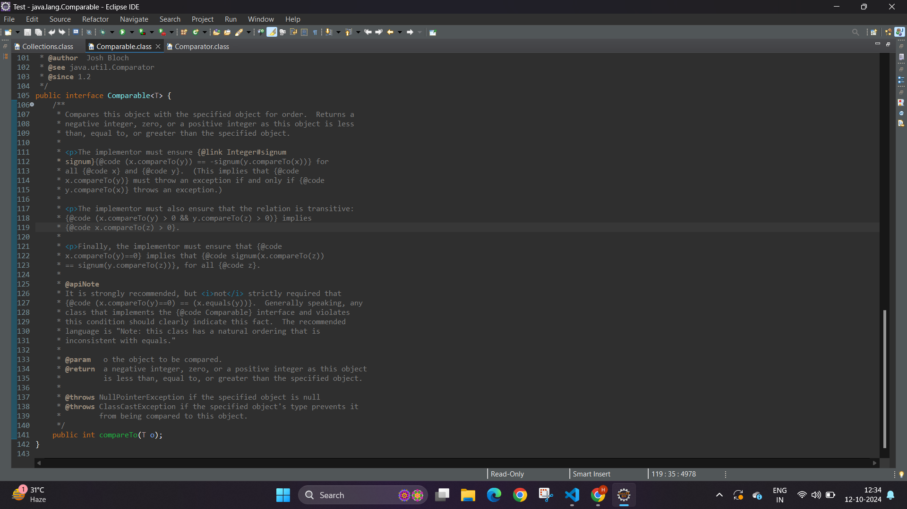

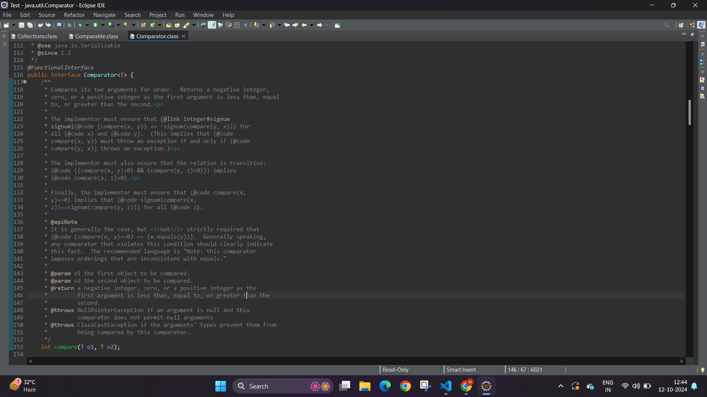

- Both interfaces are **Functional Interface**. But if you see only `Comparator` interface is annotated with **`@FunctionalInterface`**? why so, `Comparable` was **introduced in Java 1.2**, long before the `@FunctionalInterface` **annotation was added in Java 8**. At that time, the concept of a functional interface didn’t exist in the language. Even though `Comparable` is not annotated with `@FunctionalInterface`, it is still a valid functional interface because, it has only one abstract method `compareTo()`.
- Under `Comparator` interface there are bunch of default and static methods. A functional interface in Java is an interface that contains exactly one abstract method. **It can have any number of default or static methods or object methods**, but only one method needs to be implemented by any implementing class or lambda expression.

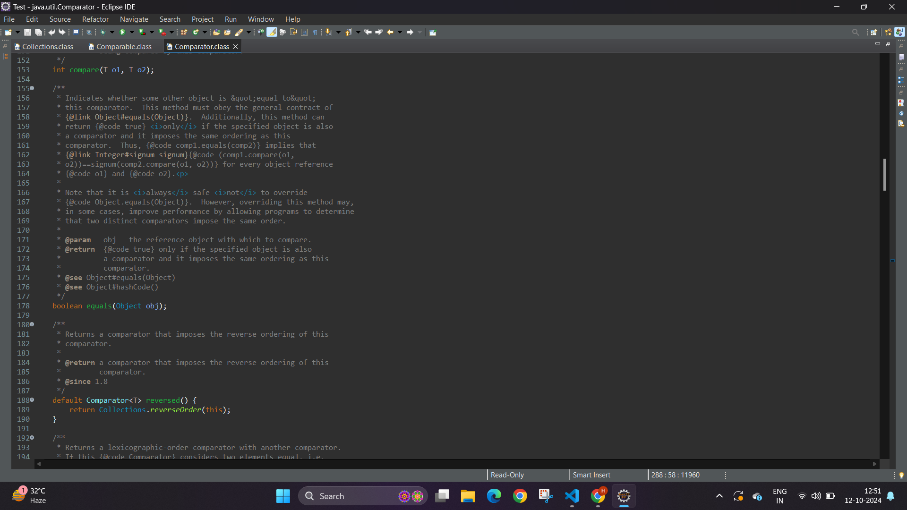

- If you see, along with `compare()` method there is an `equals()` method. The `equals()` method is from `Object` class. This means that `equals()` does not count as an abstract method in the `Comparator` interface, and only `compare()` is considered.
- Comparable and Comparator both are part of **Collection Framework**.

#### Comparable

- Lets see some examples of `Comparable`.

```
import java.util.Collections;
import java.util.List;
import java.util.Arrays;

public class AboutComparable {
    public static void main(String[] args) {
        List<Integer> numbers = Arrays.asList(5, 2, 8, 1, 3);
        Collections.sort(numbers); // Uses the natural ordering (ascending)
        System.out.println("Sorted Numbers: " + numbers);
        
        List<String> strings = Arrays.asList("banana", "apple", "orange");
        Collections.sort(strings); // Uses the natural ordering (lexicographical)
        System.out.println("Sorted Strings: " + strings);
    }
}

Output:
Sorted Numbers: [1, 2, 3, 5, 8]
Sorted Strings: [apple, banana, orange]
```

- The `Collections.sort()` leverages `Comparable` interface.

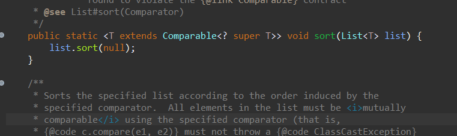

- Lets define a `Student` class.

```
class Student {
    String name;
    int grade;

    public Student(String name, int grade) {
        this.name = name;
        this.grade = grade;
    }

    @Override
    public String toString() {
        return name + " (" + grade + ")";
    }
}
```

- Now lets say you wanted to sort based on roll numbers you need to implement `Comparable` interface and define your logic under the `compareTo()` method.

```
class Student implements Comparable<Student> {
    String name;
    int rollNo;

    public Student(String name, int rollNo) {
        this.name = name;
        this.rollNo = rollNo;
    }

    @Override
    public int compareTo(Student other) {
        return Integer.compare(this.rollNo, other.rollNo); // Sort by roll number
    }

    @Override
    public String toString() {
        return name + " (Roll No: " + rollNo + ")";
    }
}
```

- Lets try to perform sort operation by adding some students information. Here we will sort students based on roll numbers.

```
import java.util.Collections;
import java.util.List;
import java.util.ArrayList;
import java.util.Arrays;

class Student implements Comparable<Student> {
    String name;
    int rollNo;

    public Student(String name, int rollNo) {
        this.name = name;
        this.rollNo = rollNo;
    }

    @Override
    public int compareTo(Student other) {
        return Integer.compare(this.rollNo, other.rollNo); // Sort by roll number
    }

    @Override
    public String toString() {
        return name + " (Roll No: " + rollNo + ")";
    }
}

public class AboutComparableInterface{
    public static void main(String[] args) {

        List<Student> students = new ArrayList<>();
        students.add(new Student("John", 5));
        students.add(new Student("Alice", 2));
        students.add(new Student("Bob", 8));
        System.out.println("Before Sorting Students: " + students);

        Collections.sort(students); // Sorts using the compareTo method
        System.out.println("Sorted Students: " + students);
    }
}

Output:
Before Sorting Students: [John (Roll No: 5), Alice (Roll No: 2), Bob (Roll No: 8)]
Sorted Students: [Alice (Roll No: 2), John (Roll No: 5), Bob (Roll No: 8)]
```

- Lets say you wanna sort the students based on their names alphabetically.

```
import java.util.Collections;
import java.util.List;
import java.util.ArrayList;
import java.util.Arrays;

class Student implements Comparable<Student> {
    String name;
    int rollNo;

    public Student(String name, int rollNo) {
        this.name = name;
        this.rollNo = rollNo;
    }

    @Override
    public int compareTo(Student other) {
        // return Integer.compare(this.rollNo, other.rollNo); // Sort by roll number
        return String.CASE_INSENSITIVE_ORDER.compare(this.name,other.name); // Sort by name alphabetically
    }

    @Override
    public String toString() {
        return name + " (Roll No: " + rollNo + ")";
    }
}

public class AboutComparableInterface{
    public static void main(String[] args) {

        List<Student> students = new ArrayList<>();
        students.add(new Student("John", 5));
        students.add(new Student("Alice", 2));
        students.add(new Student("Bob", 8));
        System.out.println("Before Sorting Students: " + students);

        Collections.sort(students); // Sorts using the compareTo method
        System.out.println("Sorted Students: " + students);
    }
}


Output:
Before Sorting Students: [John (Roll No: 5), Alice (Roll No: 2), Bob (Roll No: 8)]
Sorted Students: [Alice (Roll No: 2), Bob (Roll No: 8), John (Roll No: 5)]
```

- Now how this `compareTo()` method , does the sorting? during sorting iteration which elements becomes `this` and which element becomes `other`? the `compareTo()` method is used to compare the current object (`this`) with other object (`other`). It defines the natural ordering of the objects.
- The `compareTo()` method returns:
    - **A negative integer** if `this` object is less than `other`.
    - 0 if `this` object is equal to `other`.
    - **A positive integer** if `this` object is greater than `other`.
- Consider below code to understand `this` and `other` reference.

```
class MyNumber implements Comparable<MyNumber> {
    int value;

    public MyNumber(int value) {
        this.value = value;
    }

    @Override
    public int compareTo(MyNumber other) {
        return Integer.compare(this.value, other.value); // Compare based on value
    }

    @Override
    public String toString() {
        return String.valueOf(value);
    }
}

public class CompareToExample {
    public static void main(String[] args) {
        MyNumber num1 = new MyNumber(5);
        MyNumber num2 = new MyNumber(10);
        MyNumber num3 = new MyNumber(5);

        System.out.println(num1.compareTo(num2)); 
        System.out.println(num2.compareTo(num1)); 
        System.out.println(num1.compareTo(num3));
    }
}

Output:
-1
1
0
```
- `this` refers to the current object on which the `compareTo` method is called. `other` refers to the object passed as an argument to the `compareTo` method, which is being compared with the current object.
- When you sort a list of objects using `Collections.sort()`, the sorting algorithm will repeatedly call `compareTo()` to determine the order of the elements. The sorting algorithm will start by comparing the first two elements (`John (Roll No: 5)` and `Alice (Roll No: 2)`), consider the sorting logic is based on roll number , the `compareTo` method will return positive value (`this=5 > other=2`), then it compares the next element (`John (Roll No: 5)` and `Bob (Roll No: 8)`). It will keep iterating and comparing elements based on the result of `compareTo()` until it has ordered all elements.
- Lets say you wanna sort based on all even roll numbers before all the odd roll numbers for which the ordering of numbers does not matter.

```
import java.util.Collections;
import java.util.List;
import java.util.ArrayList;
import java.util.Arrays;

class Student implements Comparable<Student> {
    String name;
    int rollNo;

    public Student(String name, int rollNo) {
        this.name = name;
        this.rollNo = rollNo;
    }

    @Override
    public int compareTo(Student other) {
        // return Integer.compare(this.rollNo, other.rollNo); // Sort by roll number
        // return String.CASE_INSENSITIVE_ORDER.compare(this.name,other.name); // Sort by name alphabetically
        if(other.rollNo%2==0){ //Sort by Even roll number
            return 1;
        }
        return -1;
    }

    @Override
    public String toString() {
        return name + " (Roll No: " + rollNo + ")";
    }
}

public class AboutComparableInterface{
    public static void main(String[] args) {
        List<Student> students = new ArrayList<>();
        students.add(new Student("John", 5));
        students.add(new Student("Alice", 2));
        students.add(new Student("Bob", 8));
        students.add(new Student("Jane", 7));
        System.out.println("Before Sorting Students: " + students);

        Collections.sort(students); // Sorts using the compareTo method
        System.out.println("Sorted Students: " + students);
    }
}


Output:
Before Sorting Students: [John (Roll No: 5), Alice (Roll No: 2), Bob (Roll No: 8), Jane (Roll No: 7)]
Sorted Students: [Alice (Roll No: 2), Bob (Roll No: 8), Jane (Roll No: 7), John (Roll No: 5)]
```

- If two objects are considered equal (i.e., **`compareTo()` returns 0**), their order in the list remains the same as before sorting. This is known as stability in sorting.

#### Comparator

- Lets see example of `Comparator`.

```
import java.util.*;

class Student {
    String name;
    int rollNo;

    public Student(String name, int rollNo) {
        this.name = name;
        this.rollNo = rollNo;
    }

    @Override
    public String toString() {
        return name + " (Roll No: " + rollNo + ")";
    }
}

class RollNoComparator implements Comparator<Student> {
    @Override
    public int compare(Student s1, Student s2) {
        return Integer.compare(s1.rollNo, s2.rollNo); // Sort by roll number
    }
}

class NameComparator implements Comparator<Student> {
    @Override
    public int compare(Student s1, Student s2) {
        return s1.name.compareTo(s2.name); // Sort by name
    }
}

public class AboutComparatorInterface {
    public static void main(String[] args) {
        List<Student> students = new ArrayList<>();
        students.add(new Student("John", 5));
        students.add(new Student("Alice", 2));
        students.add(new Student("Bob", 8));

        System.out.println("Before Sorting: "+students);

        // Sort by roll number using the RollNoComparator
        Collections.sort(students, new RollNoComparator());
        System.out.println("Sorted Students by Roll No: " + students);

        // Sort by name using the NameComparator
        Collections.sort(students, new NameComparator());
        System.out.println("Sorted Students by Name: " + students);
    }
}


Output:
Before Sorting: [John (Roll No: 5), Alice (Roll No: 2), Bob (Roll No: 8)]
Sorted Students by Roll No: [Alice (Roll No: 2), John (Roll No: 5), Bob (Roll No: 8)]
Sorted Students by Name: [Alice (Roll No: 2), Bob (Roll No: 8), John (Roll No: 5)]
```

- Lets say you wanna sort roll numbers as primary sorting and secondary sorting as names alphabetically.

```
import java.util.*;

class Student {
    String name;
    int rollNo;

    public Student(String name, int rollNo) {
        this.name = name;
        this.rollNo = rollNo;
    }

    @Override
    public String toString() {
        return name + " (Roll No: " + rollNo + ")";
    }
}


class RollNoNameComparator implements Comparator<Student>{


    @Override
    public int compare(Student s1, Student s2) {
        // Primary comparison by roll number
        int rollComparison = Integer.compare(s1.rollNo, s2.rollNo);
        // Secondary comparison by name if roll numbers are equal
        if (rollComparison == 0) {
            return s1.name.compareTo(s2.name); // Sort by name
        }
        return rollComparison;
    }
    
}

public class AboutComparatorInterface {
    public static void main(String[] args) {
        List<Student> students = new ArrayList<>();
        students.add(new Student("John", 5));
        students.add(new Student("Alice", 2));
        students.add(new Student("Bob", 8));
        students.add(new Student("Ali", 8));

        System.out.println("Before Sorting: "+students);

        // Sort by roll number first, if numbers are same then sort by name
        Collections.sort(students, new RollNoNameComparator());
        System.out.println("Sorted Students by Name: " + students);     

    }
}

Output:
Sorted Students by Name: [Alice (Roll No: 2), John (Roll No: 5), Ali (Roll No: 8), Bob (Roll No: 8)]
```

- `Comparator` allows you to define custom sorting logic, enabling different sorting criteria. You can define how to handle equal elements, including additional logic for secondary sorting.
- Even `Comparable` helps to define custom logic, then whats the actual difference between `Comparable` and `Comparator`?
- When we use `Comparable`
    - **Natural Ordering:** The object has a natural order that makes sense across your application. For example, numbers have a natural order (1 comes before 2, etc.), and strings can be ordered alphabetically.
    - **Single Sorting Criteria:** You only need one way to compare objects of that class, and `this` logic is closely tied to the object itself.
    - **Tight Coupling:** You are okay with embedding the sorting logic inside the class, meaning the class itself knows how to compare its instances.
- Implementing `Comparable` like `Comparator` will throw you error

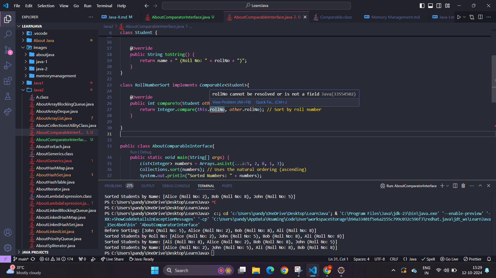
- When we use `Comparator`
    - **Multiple Sorting Criteria:** You need to compare objects in different ways depending on the situation. For example, sometimes you might want to sort by name, other times by roll number, or even by both.
    - **External Sorting Logic:** The sorting logic doesn’t belong inside the class. This way, you can keep the class simple and flexible, allowing different ways to sort the same objects.
    - **Loose Coupling:** You prefer to separate the comparison logic from the class itself, making it more modular.

- **Both Comparator and Comparable interface uses generics**, `Comparable<T>` and `Comparator<T>` where T is a type parameter. This means you can specify the type of objects that the comparator will compare.


| **Feature**            | **Comparable**                                                     | **Comparator**                                                       |
|------------------------|--------------------------------------------------------------------|----------------------------------------------------------------------|
| **Where to Implement** | Inside the class being compared.                                   | In a separate class (outside of the class being compared).           |
| **Method**             | `compareTo()` (single method). (Different method name)                                    | `compare()` (can be implemented in multiple ways).   (Different method name)                  |
| **Custom Sorting**     | Defines natural ordering within the class itself.                  | Allows for multiple sorting orders outside the class.                |
| **Modifiability**      | Can only have one sort logic per class.                            | Can have multiple comparators for different sorting logic.           |
| **Coupling**           | Tight coupling: The class is responsible for its comparison logic. | Loose coupling: The comparison logic is separated from the class.    |
| **Usage**              | Used when objects have a natural order (e.g., numbers, strings).   | Used for custom or multiple sorting criteria, external to the class. |
| **Package** | Comparable is present in `java.lang` package. | A Comparator is present in the `java.util` package. |
| **Syntax** |  We can sort the list elements of Comparable type by `Collections.sort(List)` method. | We can sort the list elements of Comparator type by `Collections.sort(List, Comparator)` method. |


### Collections Framework

- If you see `Map` is not a part of **Collection**. If we open `Map` interface it does not extends **Collection** interface whereas `List`, `Set` and `Queue` extends **Collection**.

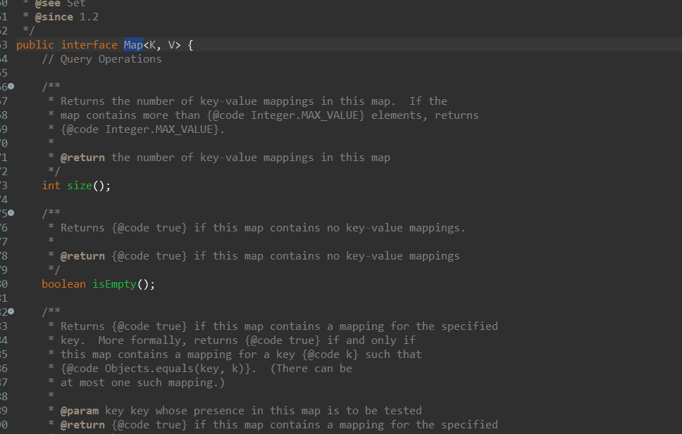

- **Collection (Interface)**
    - It is a root interface in the Collections Framework that represents a group of objects known as elements. Various data structures like `List`, `Set`, and `Queue` extend this interface. It is part of `java.util` package.
    - `Collection` is the foundation for `List`, `Set`, and `Queue`, but `Map` is not part of this hierarchy.

-  **Collections (Utility Class)**
    - `Collections` is a utility class in Java that provides static methods to operate on or return collections. It is used for tasks like sorting, searching, or synchronizing collections. It is part of the `java.util` package.
    - This class is just a helper to perform algorithms on collections such as sorting or searching. It has methods like `Collections.sort()`, `Collections.shuffle()`, and more.

- **Collection API**
    - The entire set of interfaces and classes for working with collections.
    - It supports different types of collections like lists, sets, queues, and maps.
    - It provides methods for manipulating data structures, such as adding, removing, searching, and sorting.
    - It includes generic support, allowing type-safe collections.

- **Collection Framework**
    -  It is a unified architecture for representing and manipulating collections apis.
    - **Collection API** is the set of interfaces, classes, and methods provided by the Java Collections Framework to enable developers to work with collections of data efficiently. It covers a wide range of data structures and operations, making it one of the most powerful parts of Java's standard library.


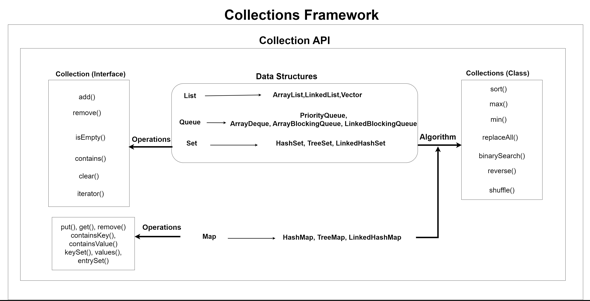

### Fail-Fast vs Fail-Safe

- In Java Collections, the terms fail-fast and fail-safe refer to different behaviors of iterators when a collection is modified during iteration.
- A fail-fast iterator immediately throws a `ConcurrentModificationException` if it detects any structural modification of the collection after the iterator was created. This behavior is designed to prevent unpredictable behavior during iteration. Most of Java's core collection classes like `ArrayList`, `HashSet`, and `HashMap` use fail-fast iterators.

```
import java.util.ArrayList;
import java.util.Iterator;
import java.util.List;

public class FailFastExample {
    public static void main(String[] args) {
        List<String> list = new ArrayList<>();
        list.add("A");
        list.add("B");
        list.add("C");

        Iterator<String> iterator = list.iterator();
        while (iterator.hasNext()) {
            System.out.println(iterator.next());
            // Attempting to modify the list during iteration
            list.add("D"); // This will cause ConcurrentModificationException
        }
    }
}

Output:
A
ERROR!
Exception in thread "main" java.util.ConcurrentModificationException
	at java.base/java.util.ArrayList$Itr.checkForComodification(ArrayList.java:1043)
	at java.base/java.util.ArrayList$Itr.next(ArrayList.java:997)
	at FailFastExample.main(FailFastExample.java:14)
```

- A fail-safe iterator, on the other hand, does not throw an exception if the collection is modified during iteration. Instead, it works on a "clone" or "snapshot" of the original collection, allowing modifications without affecting the ongoing iteration. Fail-safe iterators are typically found in concurrent collections like `CopyOnWriteArrayList` and `ConcurrentHashMap`.

```
import java.util.Iterator;
import java.util.concurrent.CopyOnWriteArrayList;

public class FailSafeExample {
    public static void main(String[] args) {
        CopyOnWriteArrayList<String> list = new CopyOnWriteArrayList<>();
        list.add("A");
        list.add("B");
        list.add("C");

        Iterator<String> iterator = list.iterator();
        while (iterator.hasNext()) {
            System.out.println(iterator.next());
            // Attempting to modify the list during iteration
            list.add("D"); // No exception will be thrown
        }

        System.out.println("List after iteration: " + list);
    }
}


Output:
A
B
C
List after iteration: [A, B, C, D, D, D]
```

### Synchronize vs Concurrent Collections

- In Java, synchronized collections and concurrent collections both aim to handle multi-threaded access, but they do so in different ways and with different trade-offs.
- Synchronized collections are part of the `java.util.Collections` class and provide basic synchronization for thread safety. When a synchronized collection is accessed, it locks the entire collection, meaning only one thread can access or modify it at a time. This approach is simpler but can lead to reduced performance due to extensive locking, especially in highly concurrent situations.
- Example

```
import java.util.Collections;
import java.util.List;
import java.util.ArrayList;

public class SynchronizedCollectionExample {
    public static void main(String[] args) {
        List<String> list = Collections.synchronizedList(new ArrayList<>());
        
        // Adding elements to the synchronized list
        list.add("A");
        list.add("B");

        // Iterating through the synchronized list
        synchronized (list) { // Explicit synchronization is still required during iteration
            for (String item : list) {
                System.out.println(item);
            }
        }
    }
}


Output:
A
B
```

- Concurrent collections, introduced in `java.util.concurrent` package, are designed specifically for multi-threaded access. Instead of locking the entire collection, these classes use advanced concurrency control mechanisms like internal **locking on specific segments or even lock-free algorithms**. This design allows higher performance and finer-grained locking, meaning multiple threads can work on different parts of the collection concurrently.
- Example

```
import java.util.concurrent.ConcurrentHashMap;

public class ConcurrentCollectionExample {
    public static void main(String[] args) {
        ConcurrentHashMap<String, String> map = new ConcurrentHashMap<>();

        // Adding elements to the concurrent map
        map.put("1", "A");
        map.put("2", "B");

        // Iterating through the concurrent map
        for (String key : map.keySet()) {
            System.out.println(key + " -> " + map.get(key));
            // We can safely modify the map during iteration
            map.put("3", "C"); // No exception will be thrown
        }
    }
}


Output:
1 -> A
2 -> B
3 -> C
```

- **Drawbacks of Synchronized Collections**:
    - Low performance under high concurrency because it locks the entire collection.
    - Needs explicit synchronization when iterating to prevent ConcurrentModificationException.
- **Advantages of Concurrent Collections**:
    - Better performance and scalability in high-concurrency scenarios.
    - Safe for concurrent modification without additional synchronization.

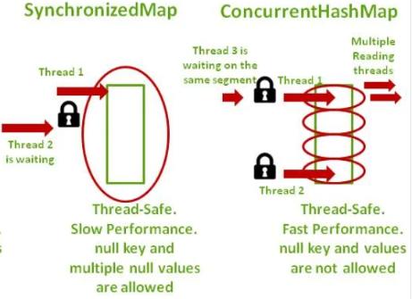

### Miscellaneous

- Consider below code, and guess what will be the output?

```
import java.util.*;

class Main {
    public static void main(String[] args) {
        Map<Object,Object> m = new HashMap<>();
        List<Object> l = new ArrayList<>();
        
        l.add(1);
        l.add("1");
        l.add(true);
        
        System.out.println(l);            // Outputs: [1, "1", true]
        
        m.put("Key1",l);
        System.out.println(m.get("Key1")); // Outputs: [1, "1", true]
        
        l.clear();                        // Clears the list
        
        System.out.println(m.get("Key1")); // Outputs: []
    }
}

Output:
[1, 1, true]
[1, 1, true]
[]
```

- In above code, when you add an object (like a `List`) to a `Map`, the map **stores a reference to that object rather than creating a copy of it**. This means that any changes made to the original object (in this case, the list `l`) will reflect in the map as well because both the map and the variable `l` point to the same object in memory.
- When you use `l.clear()`, it empties the list `l`, which also affects the value stored in the map under `"Key1"` because `m` is holding a reference to the same list object `l`. Since `m` holds a reference, not a copy, the cleared list is also reflected in the map. Hence, after `l.clear()`, `m.get("Key1")` also returns an empty list `[]`.
- This behavior applies to all types of Java collections, not just `Map`. Collections in Java (such as `List`, `Set`, `Map`, etc.) all store references to the objects they contain, rather than creating copies of those objects.
- Now consider below code

```
import java.util.*;

class Main {
    public static void main(String[] args) {
        Map<Object,Object> m = new HashMap<>();
        List<Object> l = new ArrayList<>();
        
        l.add(1);
        l.add("1");
        l.add(true);
        
        System.out.println(l);            // Outputs: [1, "1", true]
        
        m.put("Key1",l);
        System.out.println(m.get("Key1")); // Outputs: [1, "1", true]
        
        l = null;                         // Sets `l` to null
        
        System.out.println(m.get("Key1")); // Outputs: [1, "1", true]
    }
}

Output:
[1, 1, true]
[1, 1, true]
[1, 1, true]
```

- When you set `l` to null, you're only changing the variable `l` to reference `null`, but it does not affect the actual list object that was stored in the map. `m.get("Key1")` still returns the original list `[1, "1", true]` because `m` still holds a reference to the original list object. This means the `null` assignment to `l` only disconnects the variable `l` from that list object, but the map `m` still retains the reference.

## Equals and HashCode Contract

### `equals()` contract

- Now lets take a scenario where we have an `Employee` class and two object which has same attributes values

```
class Employee{
    String name;
    int salary;

    public Employee(String name, int salary){
        this.name=name;
        this.salary=salary;
    }
}


public class AboutEqualsHashCodeContract {
    public static void main(String[] args) {
        Employee e1=new Employee("ABC", 1000);
        Employee e2=new Employee("ABC", 1000);

        /** Shallow Comparison */
        System.out.println(e1==e2); // false
        
    }
}

Output:
false
```

- Now why we got `false`? it is because when we used `new` keyword we are create two different objects which has different memory address. The `==` operator **perform shallow comparison by just checking whether if two objects point to the same memory address or not**. When we try to print the `hashCode()` we get two different memory addresses thats why it result in `false`.

```
        Employee e1=new Employee("ABC", 1000);
        Employee e2=new Employee("ABC", 1000);
        
        System.out.println(e1.hashCode());
        System.out.println(e2.hashCode());

Output:
925858445
798154996
```

- So lets use the in-built `equals()` method provided by `Object` class. 
- The method definition for equals looks like as mentioned below. The default implementation of the `equals()` method checks for **referential equality or simply checks if two objects’ references point to the same memory address**. Again it performs shallow comparison.

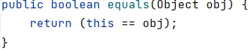

- Ideally, `e1` and `e2` should be same as they have same attributes values (`ABC,1000`), so here we need to override the `equals()` method.

```
class Employee{
    String name;
    int salary;

    public Employee(String name, int salary){
        this.name=name;
        this.salary=salary;
    }

    @Override
    public boolean equals(Object o){
        /**
         * Comparing two object, e1.equals(e2)
         * e1-> refers 'this' or current object
         * e2-> refers 'o' the second object
         */
        if (this == o) return true; //e1==e1
        if (o == null || getClass() != o.getClass()) return false;
        Employee e2 = (Employee) o;
        /** Deep Comparison */
        /** the below return can be also re-written as (salary==e2.salary && name.equals(e2.name)) */
        return (this.salary==e2.salary && this.name.equals(e2.name));
    }
}


public class AboutEqualsHashCodeContract {
    public static void main(String[] args) {
        Employee e1=new Employee("ABC", 1000);
        Employee e2=new Employee("ABC", 1000);

        /** Shallow Comparison */
        System.out.println(e1==e2); // false

        /** Deep Comparison by overriding default equals method */
        System.out.println(e1.equals(e2)); // true
    }
}


Output:
false
true
```

- When we override the `equals()` method **it not only considers referential equality (objects’ references point to the same memory address) but also the value of the attributes for comparison**. 
- **Principles of equals() method or equals() Contract**
    1. Reflexive: For any reference value `x`, `x.equals(x)` must be `true`.

    2. Symmetric: For any reference values `x` and `y`, `x.equals(y)` must return the same value as `y.equals(x)`.

    3. Transitive: For any reference values `x`, `y` and `z`, if `x.equals(y)` and `y.equals(z)`, then `x.equals(z)`.

    4. Consistent: For any reference values `x` and `y`, results of `x.equals(y)` must remain the same provided no modification is made to the `equals` method.

- Now if we add both objects `e1` and `e2` in a `Set` collection we are expecting that it the collection must consist only 1 item because now `e1` and `e2` are same right?

```
import java.util.HashSet;
import java.util.Set;


class Employee{
    String name;
    int salary;

    public Employee(String name, int salary){
        this.name=name;
        this.salary=salary;
    }

    @Override
    public boolean equals(Object o){
        /**
         * Comparing two object, e1.equals(e2)
         * e1-> refers 'this' or current object
         * e2-> refers 'o' the second object
         */
        if (this == o) return true; //e1==e1
        if (o == null || getClass() != o.getClass()) return false;
        Employee e2 = (Employee) o;
        /** Deep Comparison */
        /** the below return can be also re-written as (salary==e2.salary && name.equals(e2.name)) */
        return (this.salary==e2.salary && this.name.equals(e2.name));
    }
}


public class AboutEqualsHashCodeContract {
    public static void main(String[] args) {
        Employee e1=new Employee("ABC", 1000);
        Employee e2=new Employee("ABC", 1000);

        /** Shallow Comparison */
        System.out.println(e1==e2); // false

        /** Deep Comparison by overriding default equals method */
        System.out.println(e1.equals(e2)); // true

        Set<Employee> empSet= new HashSet<>();

        empSet.add(e1);
        empSet.add(e2);
        System.out.println(empSet);
        
        System.out.println(e1.hashCode());
        System.out.println(e2.hashCode());

    }
}


Output:
false
true
[Employee@372f7a8d, Employee@2f92e0f4]
925858445
798154996
```

- In the collections we can still see two object why so? because both object `e1` and `e2` has different hashCode.

### `hashCode()` contract

- A hash code is an integer value of an object. This hash code is unique to an object and generated using a hashing function.

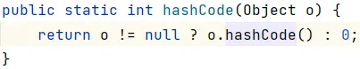

- By overriding `equals()` method we make objects equals, but the hashCode yield by the object having same attributes must also be same right? so we need to also override `hashCode()`.

```
import java.util.HashSet;
import java.util.Set;
import java.util.Objects;


class Employee{
    String name;
    int salary;

    public Employee(String name, int salary){
        this.name=name;
        this.salary=salary;
    }

    @Override
    public boolean equals(Object o){
        /**
         * Comparing two object, e1.equals(e2)
         * e1-> refers 'this' or current object
         * e2-> refers 'o' the second object
         */
        if (this == o) return true; //e1==e1
        if (o == null || getClass() != o.getClass()) return false;
        Employee e2 = (Employee) o;
        /** Deep Comparison */
        /** the below return can be also re-written as (salary==e2.salary && name.equals(e2.name)) */
        return (this.salary==e2.salary && this.name.equals(e2.name));
    }

    @Override
    public int hashCode() {
        return Objects.hash(name, salary);
    }
}


public class AboutEqualsHashCodeContract {
    public static void main(String[] args) {
        Employee e1=new Employee("ABC", 1000);
        Employee e2=new Employee("ABC", 1000);

        /** Shallow Comparison */
        System.out.println(e1==e2); // false

        /** Deep Comparison by overriding default equals method */
        System.out.println(e1.equals(e2)); // true

        Set<Employee> empSet= new HashSet<>();

        empSet.add(e1);
        empSet.add(e2);
        System.out.println(empSet);

        System.out.println(e1.hashCode());
        System.out.println(e2.hashCode());

    }
}


Output:
false
true
[Employee@1e93a7]
2003879
2003879
```

- By overriding `hashCode()` method, it ensure that all the object which has same attribute values has same hashCode, thus maintaining consistency.
- **Principles of hashCode() method or hashCode() contract**
    1. Hash Consistency: The value of the hash code must remain the same provided no modification is made to the `equals()` method. Also

    2. Equals Consistency: If two objects are equal according to the `equals()` method, then the `hashCode()` method must return the same value for them.

    3. Hash Collision: If two objects are unequal according to the `equals()` method, it not necessarily means that the hash code for these objects has to be different. In other words, unequal objects may have the same hash codes. But this can adverse impact on the performance of hashing due to collisions.

- In general, we would want to override either both `equals()` and `hashCode()` method or neither. Both these methods co-exist and without one other would result in errors specifically when we working with custom objects within large-scale applications. In summary,
    - If two objects are equal, they must have the same hash code.
    - If two objects have the same hash code, it does not necessarily mean they are equal.
    - Overriding the `equals()` method alone would fail with hashing data structures like `Map`, `Set`, etc.
    - Overriding the `hashCode()` method alone would not help in comparing objects.

## Method Reference

- Method references provide a shorthand notation for lambda expressions that only call a single method. Method references can be used to simplify the code and make it more readable.
- Lets see example of iterating `ArrayList` using Anonymous class

```
import java.util.ArrayList;
import java.util.*;
import java.util.Arrays;
import java.util.function.Consumer;

public class AboutMethodReference{
    public static void main(String[] args) {

        List<String> ArrayOfNumbers=Arrays.asList("Hi","Hello","World");

        //Using Anonymous class
        ArrayOfNumbers.forEach(new Consumer<String>() {
            @Override
            public void accept(String t) {
                System.out.println(t);
            }
        });
    }
}

Output:
Hi
Hello
World
```

- Lets see example of iterating `ArrayList` using lambda expression

```
import java.util.ArrayList;
import java.util.*;
import java.util.Arrays;

public class AboutMethodReference{
    public static void main(String[] args) {
     
        List<String> ArrayOfNumbers=Arrays.asList("Hi","Hello","World");
        //Lambda Expression
        ArrayOfNumbers.forEach(i->System.out.println(i));
    }
}

Output:
Hi
Hello
World
```

- Lets see example of iterating `ArrayList` using method reference

```
import java.util.ArrayList;
import java.util.*;
import java.util.Arrays;

public class AboutMethodReference{
    public static void main(String[] args) {
     
        List<String> ArrayOfNumbers=Arrays.asList("Hi","Hello","World");
        //Method Reference
        ArrayOfNumbers.forEach(System.out::println);
    }
}

Output:
Hi
Hello
World
```

- Lambda expression allows you to reduce code compared to an anonymous class to pass behaviors to methods, method reference goes one step further. It reduces code written in a lambda expression to make it even more readable and concise.

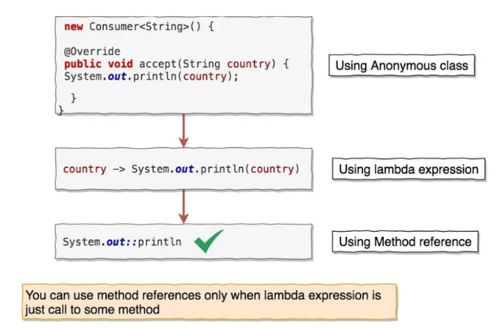

- General syntax of method reference is `object::methodName`
- Now lets say you wanna perform multiple operation on your `ArrayList` like to make your `String` elements into upper case and then you wanted to print it out. In such scenario **you cannot use method reference**. So if the action involves multiple steps for only one method it is better to use lambda expression.

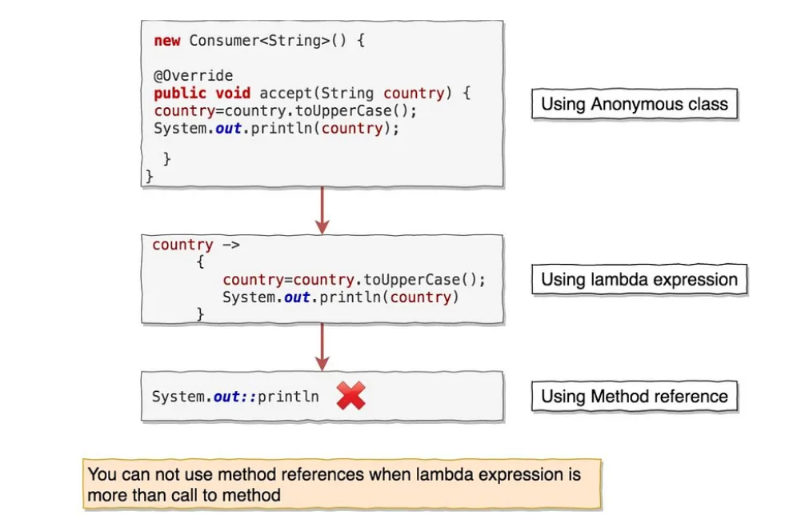

- **Method references are just syntactic sugar for lambda expressions**. Wherever a lambda expression is used, if that lambda matches a method's signature, you can replace the lambda with a method reference.


>[!NOTE]
> - Method references are mainly about readability. They don’t directly impact performance much compared to lambdas. However, they can make your code more concise and understandable.

### Types of Method References

#### 1. Reference to static method

- When you have lambda expression which calls to static method, then you can method reference to static method. A static method reference refers to the static method for a class. We can use a method reference to directly call the static methods. Syntax `className::staticMethod`
- Below is an example of Lambda expression 

```
// Lambda expression to find the maximum of two numbers using Math.max()
    BiFunction<Integer, Integer, Integer> maxFunction = (a, b) -> Math.max(a, b);
    int result = maxFunction.apply(10, 20);
    System.out.println(result);  // Output: 20
```

- For the above lambda expression, below is the code for **Static method reference**

```
// Method reference to Math.max() static method
BiFunction<Integer, Integer, Integer> maxFunction = Math::max;
int result = maxFunction.apply(10, 20);
System.out.println(result);  // Output: 20
```


<br>
<details>

<summary> About BiFunction Interface </summary>

- **BiFunction is a functional interface**.

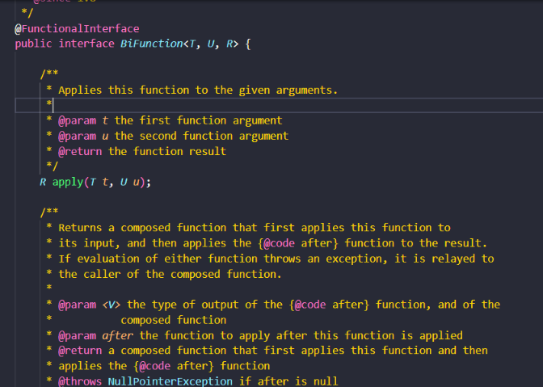

- It is a part of the `java.util.function` package which has been introduced since Java 8, to implement functional programming in Java. It takes two arguments and produces a result.

```
R apply(T t, U u);
```

- `T` is the type of the first argument.
- `U` is the type of the second argument.
- `R` is the type of the result.
- Consider below example

```
import java.util.function.BiFunction;

public class BiFunctionExample {

    public static void main(String[] args) {
        
        // Create a BiFunction to add two integers, fetching result in Integer format
        BiFunction<Integer, Integer, Integer> add = (x, y) -> x+y;
        
        int result=add.apply(10,11);
        System.out.println(result); 
        
        // Create a BiFunction to add two integers, fetching result in String format
        BiFunction<Integer, Integer, String> add1 = (x, y) -> Integer.valueOf((x+y)).toString();
        
        String result1=add1.apply(10,11);
        System.out.println(result1);


    }
}

Output:
21
21
```

- `BiFunction` uses generic interface.

</details>
<br>

#### 2. Reference to an Instance Method of a Particular Object

- This type refers to an **instance method of a specific object that has already been created**. **The method is tied to that one particular object**, and it works directly on it.
- When you have lambda expression where instance of object is passed and calls to an instance method with/without parameters, then you can use method reference to an instance method with object type. Syntax `object::staticMethodName`.
- Below is an example of Lambda expression 

```
// Lambda expression to convert a string to uppercase using a specific instance
String str = "hello";
Supplier<String> toUpperCase = () -> str.toUpperCase();
System.out.println(toUpperCase.get());  // Output: HELLO
```

- Here `str` is an instance object which uses method `toUpperCase()`.
- For the above lambda expression, below is the code using method reference only **on a particular object reference (`hello`)**

```
// Method reference to str.toUpperCase() instance method
String str = "hello";
Supplier<String> toUpperCase = str::toUpperCase;
System.out.println(toUpperCase.get());  // Output: HELLO
```

- In this case, the method `toUpperCase()` is tied to the specific object `str` (`hello`). The method reference `str::toUpperCase` refers to the `toUpperCase()` method of the already existing object `str`.

#### 3. Reference to an Instance Method of an Arbitrary Object of a Particular Type

- This type refers to an instance method of any object of a particular type. Instead of being tied to one specific object, the method can be called on any instance of that class.
- Below is an example of Lambda expression 

```
Function<String, Integer> lengthFunction = (s) -> s.length();
System.out.println(lengthFunction.apply("hello"));  // Output: 5
System.out.println(lengthFunction.apply("world"));  // Output: 5
```

- For the above lambda expression, below is the code for using method reference **on multiple type of object reference (`hello`,`world`)**

```
Function<String, Integer> lengthFunction = String::length;
System.out.println(lengthFunction.apply("hello"));  // Output: 5
System.out.println(lengthFunction.apply("world"));  // Output: 5
```

- Here, the method reference `String::length` refers to the `length()` method of any String object. It can be called on different instances of String, such as `hello` and `world`. The method reference is tied to the class (`String`), not a specific instance of the class like earlier it was tied up with only reference object (`hello`).
- The key difference between `Reference to an Instance Method of a Particular Object` and `Reference to an Instance Method of an Arbitrary Object of a Particular Type` is that, `Reference to an Instance Method of a Particular Object` refers to the method of a specific object. In this case, the method reference is tied to one specific object, like `str::toUpperCase` where `str` is a known, single object.

```
String str = "hello";
Supplier<String> toUpperCase = str::toUpperCase;
// `str` is a specific object
```

- Whereas `Reference to an Instance Method of an Arbitrary Object of a Particular Type` refers to the method of any object of a given type (like String). The method can be called on multiple different instances.

```
Function<String, Integer> lengthFunction = String::length;
// Can be used with any String instance
```


<br>
<details>

<summary> About Function Interface </summary>

- **Function Interface is a Functional Interface similarly like BiFunctional interface**.

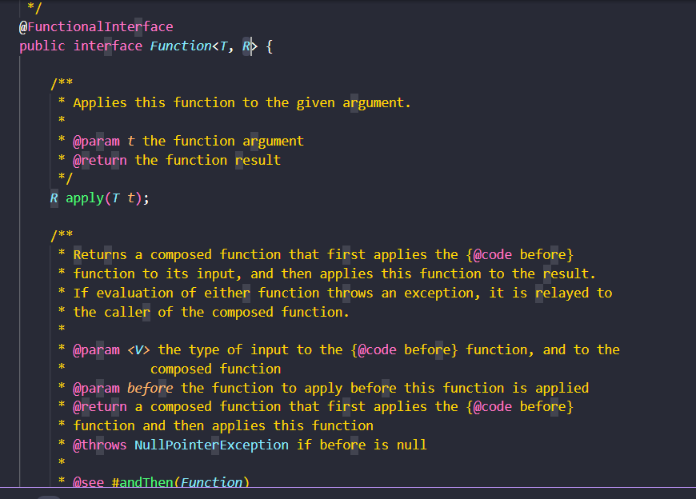

- In `BiFunction` there we two input arguments passed to `apply` method whereas in `Function` only one input argument is passed. 

```
import java.util.function.Function;

public class MainClass {

    public static void main(String args[])
    {
        // Function which takes in a number
        // and returns half of it
        Function<Integer, Double> half = a -> a / 2.0;

        // Applying the function to get the result
        System.out.println(half.apply(10));
    }
}

Output:
5.0
```

- It uses generic interfaces.

</details>
<br>


#### 4. Reference to a Constructor

- When lambda expression is used to create new object with/without parameters, then you can use reference method constructor.
- Consider below code

```
// Java Program to Illustrate Functional Interface
// Via apply() method

import java.util.ArrayList;
import java.util.HashSet;
import java.util.List;
import java.util.Set;
import java.util.function.Function;

public class MainClass {

    public static void main(String args[])
    {		
        ArrayList<String> list=new ArrayList<>();
		list.add("Rohan");
		list.add("Andy");
		list.add("Sneha");
		list.add("Rohan");
        
        // Using lambda expression
		Function<List<String>,Set<String>> f2 = (nameList) -> new HashSet<>(nameList);
		Set<String> set2 = f2.apply(list);
		System.out.println(set2); //Output: [Sneha, Andy, Rohan]
		
		// Using Method reference
		Function<List<String>,Set<String>> f3= HashSet::new;
		Set<String> set = f3.apply(list);
		System.out.println(set); //Output: [Sneha, Andy, Rohan]
    }
}
```

- The lambda expression return a new object (`new HashSet<>()`) which is a constructor.


>[!TIP]
> #### How Method Reference and Lambda Expression does not generate .class files?
> - Before Java 8, functional programming features like lambdas didn't exist, so you had to use anonymous inner classes. When you used anonymous classes, Java would generate a separate class for each anonymous class during compilation. This led to more memory usage and performance overhead because **each anonymous class was treated as a separate class file**.
> - **Lambda expressions and method references were both introduced in Java 8.** With Java 8, instead of generating anonymous classes for lambdas and method references, the Java compiler generates more efficient bytecode using **`invokedynamic`**. This is a JVM instruction that allows method references and lambdas to be linked dynamically at runtime, rather than creating a new class file for each lambda or method reference. 
> - This avoids the need to create separate anonymous classes and makes the code more memory efficient. This approach reduces memory overhead and improves performance compared to older anonymous classes.


### Custom Method References

- Consider below code

```
@FunctionalInterface
interface MethodReferenceDemo{

    void display();
}

class DisplayMethodImpl{
    public static void implDisplay(){
        System.out.println("Display");
    }
}


public class AboutMethodReference{
    public static void main(String[] args) {
     
        MethodReferenceDemo mrd = DisplayMethodImpl::implDisplay;
        mrd.display();

    }
}

Output:
Display
```

- So here we have a functional interface `MethodReferenceDemo` which has only one method `display()`, we have a class `DisplayMethodImpl` which has a static method `implDisplay()`. So here we are telling java that to get the implementation of interface `MethodReferenceDemo` , `display()` method please refer the class `DisplayMethodImpl` which has a method called `implDisplay()` (`MethodReferenceDemo mrd = DisplayMethodImpl::implDisplay`). **This makes the code reusable**.
- This is an example of **reference to a static method**.

## Optional

- Every Java Programmer is familiar with `NullPointerException`. It can crash your code. And it is very hard to avoid it without using too many null checks. So, to overcome this, Java 8 has introduced a new class `Optional` in `java.util package`. It can help in writing a neat code without using too many null checks. By using Optional, we can specify alternate values to return or alternate code to run.
- Without Optional

```
public class OptionalDemo {
    public static void main(String[] args)
    {
        String[] words = new String[10];
        String word = words[5].toLowerCase();
        System.out.print(word);
    }
}

Output:
Exception in thread "main" java.lang.NullPointerException
```

- With Optional

```
import java.util.Optional;

// Driver Class
public class OptionalDemo {
      // Main Method
    public static void main(String[] args)
    {
        String[] words = new String[10];
        
          Optional<String> checkNull = Optional.ofNullable(words[5]);
          if (checkNull.isPresent()) {
            String word = words[5].toLowerCase();
            System.out.print(word);
        }
        else
            System.out.println("word is null");
    }
}


Output:
word is null
```

- In Java, `Optional<T>` is a container object that represents the presence or absence of a value of type `T`. When we open `Optional` class we get several methods.

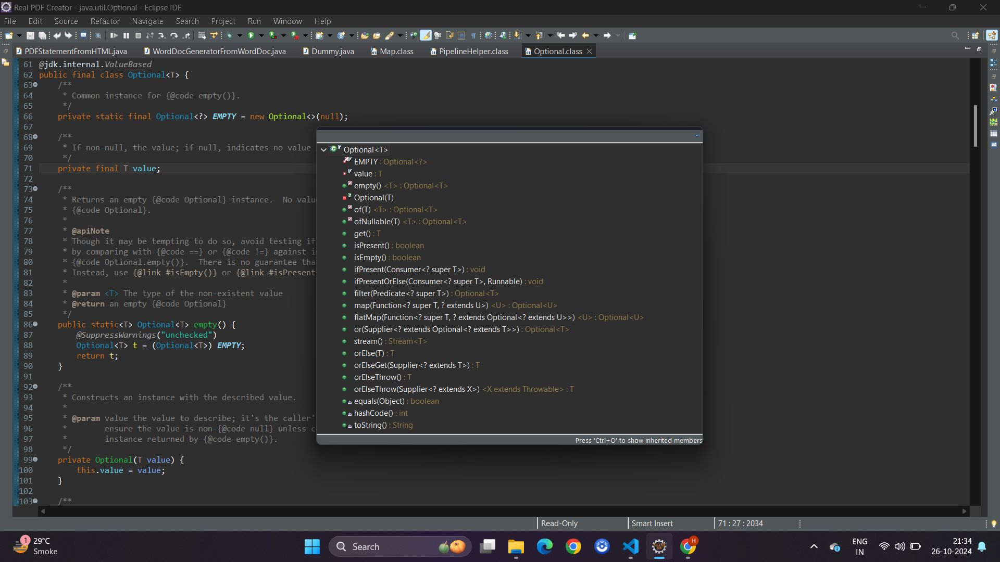

- By using `Optional`, you make it clear to other developers that a method might return a value or nothing at all, improving readability and understanding of the code.
- **Optional Encourages Functional Programming**.
- Some more examples of `Optional` class

```
import java.util.Optional;


public class AboutOptional {
    public static void main(String[] args) {

        Optional<String> nonEmptyOpt = Optional.of("Hello");          // Contains "Hello"
        Optional<String> nullableOpt = Optional.ofNullable(null);     // Contains no value
        Optional<String> emptyOpt = Optional.empty();                 // Contains no value
        
        if (nonEmptyOpt.isPresent()) {
            System.out.println("Value is present: " + nonEmptyOpt.get()); // Prints "Hello"
        }
        
        if (nullableOpt.isEmpty()) {
            System.out.println("No value present"); // Prints this because nullableOpt is empty
        }

        if(emptyOpt.isEmpty()){
            System.out.println("Value is Empty");
        }

        //Retrieve value
        System.out.println(nonEmptyOpt.get()); // Prints "Hello"

        //Providing Default Value

        /**
         * Returns the value if present, or the specified default value if empty.
         */
        String result = nullableOpt.orElse("Default Value"); // Returns "Default Value" because nullableOpt is empty
        System.out.println(result);

        //result = emptyOpt.orElseThrow(() -> new IllegalStateException("No value")); // Returns "Hello" or throws
        /**
         * Exception in thread "main" java.lang.IllegalStateException: No value
        at AboutOptional.lambda$1(AboutOptional.java:38)
        at java.base/java.util.Optional.orElseThrow(Optional.java:403)
        at AboutOptional.main(AboutOptional.java:38)
         */

        // Perform some actions based on the values
        /**
         * Executes the given action with the value if it’s present.
         */
        nonEmptyOpt.ifPresent(value -> System.out.println("Found: " + value)); // Prints "Found: Hello"

        /**
         * Executes the given action with the value if it’s present; otherwise, runs the empty action.
         */
        nullableOpt.ifPresentOrElse(
            value -> System.out.println("Found: " + value),
            () -> System.out.println("Value is absent") // Prints "Value is absent" because nullableOpt is empty
        );

    }
}

Output:
Value is present: Hello
No value present
Value is Empty
Hello
Default Value
Found: Hello
Value is absent
```

>[!NOTE]
> - The feature provided by `Optional` class can be done explicitly by writing more lines of code. Since `Optional` provides functional programming style it makes those lines of code clearer and less error-prone.
> - `Optional` gives us methods to handle the value safely without writing if statements every time. If many parts of your code need to check for `null`, it can get messy and harder to read. Plus, `null` doesn’t tell us why something is missing, it just indicates an absence of a value.
> - If you are using database resources, and executing queries , you might encounter `null` values.
> - Without `Optional`
>
> ```
> public String findUserNameById(int userId) {
>     User user = database.findUserById(userId);
>     if (user != null) {
>         return user.getName();
>     } else {
>         return "Unknown User";
>     }
> }
> ```
> - With `Optional`
> 
> ```
> // To use it
> String userName = Optional.ofNullable(database.findUserById(123)).orElse("Unknown User").toString();
> ```
>
> - **Optional returns Object value which requires type conversion**.


## Stream API

- **Stream API was introduce in Java 8**. Lets understand what it is.
- Suppose you have an integer array and you want to find all of the elements in that array that are even numbers. Essentially, you'd need to iterate through the list and check if each number is even. If so, you'll need to add this information to an output list or your new array list.

```
import java.util.ArrayList;
import java.util.List;
import java.util.Arrays;

public class AboutStreamApi{
    public static void main(String[] args) {
        
        //Without Stream API

        List<Integer> aListWSP = Arrays.asList(6,88,23,14,17,12,32,51,79,94);
        List<Integer> evenNumbersListWSP = new ArrayList<Integer>();
        for(int num:aListWSP){
            if(num %2 == 0)
            evenNumbersListWSP.add(num);
        }
        System.out.println(evenNumbersListWSP);
    }
}

Output:
[6, 88, 14, 12, 32, 94]
```

- The above code is the scenario without Stream API. Lets understand the same example with Stream API

```
import java.util.ArrayList;
import java.util.List;
import java.util.stream.Collectors;
import java.util.Arrays;

public class AboutStreamApi{
    public static void main(String[] args) {

        //With Stream API
        List<Integer> aListSP = Arrays.asList(6,88,23,14,17,12,32,51,79,94);
        List<Integer> evenNumbersListSP = aListSP.stream().filter(num -> num %2 == 0).collect(Collectors.toList());
        System.out.println(evenNumbersListSP);
    }
}


Output:
[6, 88, 14, 12, 32, 94]
```

- Compared to the pre-Java 8 code, the code using Streams is far more concise. The stream API allows you to perform operations on collections without external iteration. In this case, we’re performing a filter operation which will filter the input collection based on the condition specified. The filtered values are collected and stored into a list.
- Lets take another example where we need to process parallel data. Lets say you wanna sum up a huge amount of integer elements inside the array list.
- Without Stream API you need to manually create multi-threads and perform processing or sum of element for specific set of range inside the array list

```
import java.util.ArrayList;
import java.util.List;
import java.util.stream.Collectors;
import java.util.Arrays;

// Task class that sums a part of the list
class SumTask implements Runnable {
    private List<Integer> numbers;
    private int sum;

    public SumTask(List<Integer> numbers) {
        this.numbers = numbers;
    }

    public int getSum() {
        return sum;
    }

    @Override
    public void run() {
        for (int number : numbers) {
            sum += number;
        }
    }
}


public class AboutStreamApi{
    public static void main(String[] args) throws InterruptedException {

        // Without Stream API
        List<Integer> numbersWithoutSA = Arrays.asList(1, 2, 3, 4, 5, 6, 7, 8, 9, 10);

        // Create two threads to split the work
        SumTask task1 = new SumTask(numbersWithoutSA.subList(0, 5)); // First half
        SumTask task2 = new SumTask(numbersWithoutSA.subList(5, 10)); // Second half

        Thread thread1 = new Thread(task1);
        Thread thread2 = new Thread(task2);

        // Start both threads
        thread1.start();
        thread2.start();

        // Wait for both threads to finish
        thread1.join();
        thread2.join();

        // Sum the results of both threads
        int totalSum = task1.getSum() + task2.getSum();
        System.out.println("Total sum: " + totalSum);  // Output: 55
    }
}

Output:
Total sum: 55
```

- So without stream api, we manually split the list of numbers into two parts (first half and second half). We created two threads, each responsible for summing a part of the list. After both threads finished their work, we combined their results to get the total sum.
- Now lets achieve the same using **parallel Stream API**.

```
public class AboutStreamApi{
    public static void main(String[] args) throws InterruptedException {
        List<Integer> numbersWithSA = Arrays.asList(1, 2, 3, 4, 5, 6, 7, 8, 9, 10);

        // Parallel stream to sum the numbers
        int totalSumWithSA = numbersWithSA.parallelStream()
                              .mapToInt(Integer::intValue)
                              .sum();

        System.out.println("Total sum: " + totalSumWithSA);  // Output: 55
    }
}

Output:
Total sum: 55
```

- We simply called `parallelStream()`, which automatically divides the data and processes it in parallel. The `mapToInt()` method converts the `Integer` objects to `int` for summing.
- So now before stream api, 
    - Writing iterative loops (`for` or `while` loops) to perform operations on collections resulted in verbose (too many unnecessary codes).
    - Achieving parallelism in traditional loop-based code requires explicit management of threads, leading to complexity and potential bugs.
    - It was challenging to compose a chain of multiple operations (e.g., `filter`, `map`, and `sum`) in a concise and readable manner.
- After using stream api,
    - Code becomes more concise and easier to understand, especially for complex data manipulations.
    - It provides a rich set of operations for filtering, mapping, reducing, and more which leads to chain of multiple operations.
    - It makes easier to parallelize data processing tasks, potentially improving performance.
    - It encourage a **functional programming style**, leading to more expressive and maintainable code.

### Functional Programming Style in Stream API

- Wait what does **functional programming style** means? when we say streams encourage a functional programming style, it means that instead of writing code in a traditional imperative way (with loops, variables, and state changes), we can use functional programming concepts like
    - **Pure functions**: Functions that don’t change the existing data but rather return a new results.
    - **Declarative style**: Describing what you want to do, rather than how to do it.
    - **Immutability**: Avoiding changes to the original data, making code safer and easier to maintain.
    - **Utilizes higher-level functions** : A functions could take functions as inputs and returning functions as well.
- In traditional Java programming (imperative style), you would process data with loops and manually track the state. 

```
import java.util.*;

public class ImperativeExample {
    public static void main(String[] args) {
        List<Integer> numbers = Arrays.asList(1, 2, 3, 4, 5, 6, 7, 8, 9, 10);
        List<Integer> evenDoubled = new ArrayList<>();
        
        // Imperative loop: manually iterating, checking, and modifying
        for (Integer number : numbers) {
            if (number % 2 == 0) {
                evenDoubled.add(number * 2);  // Check if even, then double it
            }
        }
        
        System.out.println("Even numbers doubled: " + evenDoubled);
    }
}


Output:
Even numbers doubled: [4, 8, 12, 16, 20]
```

- We manually iterate over the list with a `for` loop. We use conditional logic (`if` statement) to check each number. We mutate the `evenDoubled` list by adding every time the doubled value of an even number.
- With functional programming style

```
import java.util.*;
import java.util.stream.*;

public class FunctionalExample {
    public static void main(String[] args) {
        List<Integer> numbers = Arrays.asList(1, 2, 3, 4, 5, 6, 7, 8, 9, 10);
        
        // Functional style with streams: filtering and mapping
        List<Integer> evenDoubled = numbers.stream()
                                           .filter(n -> n % 2 == 0)   // Filter even numbers
                                           .map(n -> n * 2)           // Double them
                                           .collect(Collectors.toList()); // Collect to list
        
        System.out.println("Even numbers doubled: " + evenDoubled);
    }
}

Output:
Even numbers doubled: [4, 8, 12, 16, 20]
```

-  We filter the even numbers using a pure function (`filter()`). We transform (double) the numbers using another pure function (`map()`). We collect the results (`collect()`) into a new list (without changing the original list). Here, `filter()` and `map()` accept lambda expressions (functions) as arguments, which is a functional programming concept.
- **Here in functional programming style, instead of telling Java how to do it (loops, conditions), you describe what you want (filter even numbers, double them).** 
- **You don't write down logic for filtering, map and collecting, java knows that part, you ask java that you want filter, you want to collect or map etc. You don't write code for loop making instead you use `forEach` which manages your iteration making it less error-prone (if you forgot to increment your iterator value or similarly silly mistakes)** 
- **The original list `numbers` is not changed.**
- **The code is more readable and focused on the data transformation, not on the control flow (like loops and conditionals).**
- **Since you don't manage state of each methods like `filter()`, `map()` etc.. or mutability yourself, there's less risk of introducing bugs related to mutable data or incorrect logic.**
- A Non-Functional Style

```
List<String> strList = Arrays.asList("Functional", "Programming", "in", "Java", "Not", "Javascript");
for (int i = 0; i < strList.size(); i++) {
System.out.print(strList.get(i) +” “);
}
```

- A Functional Style

```
List<String> strList = Arrays.asList("Functional", "Programming", "in", "Java", "Not", "Javascript");
System.out.print(strList.stream().collect(Collectors.joining(""))); //Joining Elements
```

### Exploring `stream()`

- Lets open the `stream()` method, we see **`stream()` method is part of Collection Interface**.

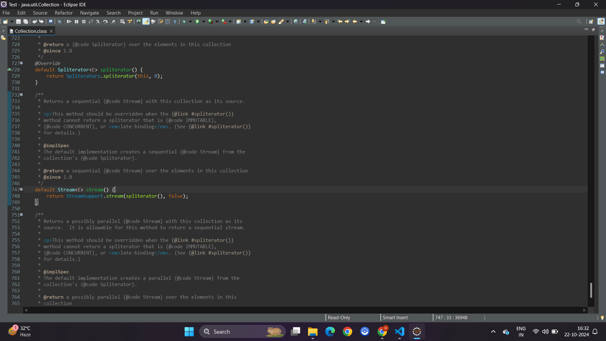

- When we click on `Stream<E>`, we can see it an interface.

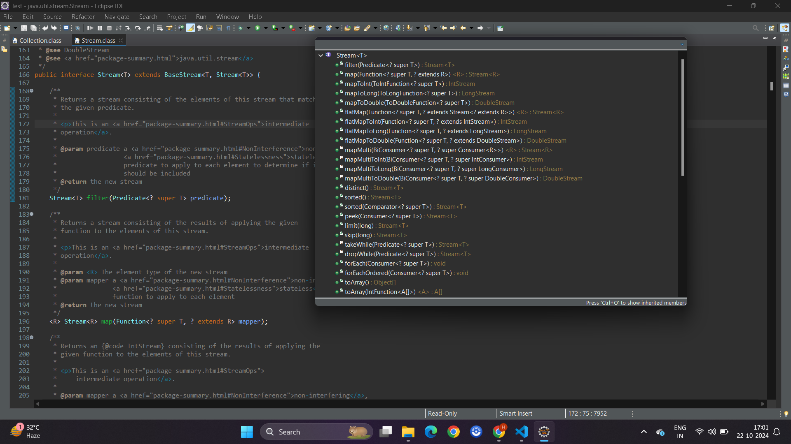

- There are several methods provided in the `Stream` interface. The `Stream` interface extends `BaseStream<T, Stream<T>>` interface.

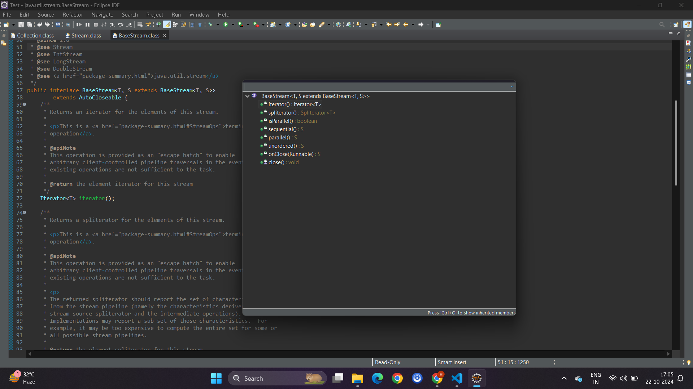

- The `BaseStream` interface is the super interface for all types of streams in Java, including:
    - `Stream<T>` (for regular object streams)
    - `IntStream`, `LongStream`, `DoubleStream` (for primitive types)

*We will learn about Stream of primitive later*

- `BaseStream` provides the common operations that are shared by all these types of streams, like:
    - Managing the stream lifecycle (e.g., `close()` for closing a stream or a resource hence we can see it also extends `AutoClosable`).
    - Indicating whether the stream is sequential or parallel.
- `BaseStream` provides the foundation on which different types of streams are built. It ensures that all streams share certain core functionalities, such as:
    - Being able to switch between sequential and parallel execution.
    - Ensuring that streams can be closed properly, especially in cases where they are working with external resources (like files).

- Lets understand Stream by an analogy. You can think of the Stream API as a conveyor belt on a fishing vessel
    - **Data Source**: The river, full of various sea creatures, symbolizes the raw data we are going to process.
    - **Filter**: This is like the fishermen who pick only the desired types of fish from the catch, excluding unwanted species. In code, this corresponds to filtering elements using the `filter()` method.
    - **Map**: This step is similar to packing the fish into containers. It transforms the elements (fish) into another form of data—“packages.” In the Stream API, this is done using the `map()` method.
    - **Collect**: This is the stage where all the packed fish are loaded onto a truck for further transportation. In the Stream API, this is the final `collect()` operation, which gathers all the results into a final data structure.


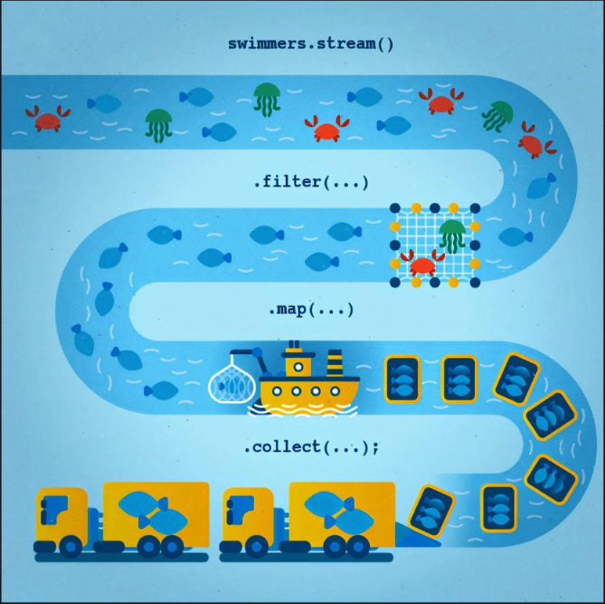

- Thus, the Stream API creates a “flow” where each element passes through specific stages, much like on a conveyor belt, making the process efficient and consistent.

#### Components of the Stream API

- The main components of the Stream API work together to organize an efficient and declarative data processing workflow.

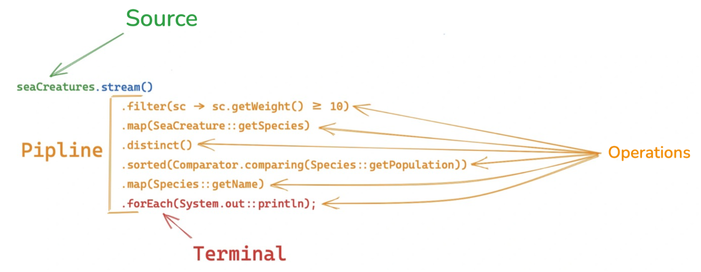

1. **Source**: This is the starting point from which data is fed into the processing stream. A source can be a collection, array, string, file, generator, or another data source.
2. **Stream**: A sequence of elements to be processed. The stream can be processed either in a **single-threaded or multi-threaded manner**.
3. **Operations**: These are transformations and/or manipulations performed on the data in the stream, categorized into **intermediate** and **terminal** operations.
4. **Pipeline**: A **chain of intermediate operations applied to the data**, forming a sequence of transformations.
5. **Terminal**: The final operation that closes the stream, **producing output or converting the data into a final structure**.


- What are these **intermediate** and **terminal** operations ?

**1. Intermediate Operations**: An intermediate operation is an operation that transforms a stream into another stream. Intermediate operations are evaluated sequentially for each element, one after the other. The intermediate operations like `map()`, `filter()`, etc., execute in the exact sequence you define them in. These intermediate operations can be chain together, allow you to chain multiple operations together in a readable, declarative manner.


**2. Terminal Operations**: A terminal operation is an operation that produces a result or a side-effect, and it marks the end of the stream pipeline. They can also perform actions like printing to the console or writing to a file. Terminal operations complete the stream processing and return a result. They may involve actions such as counting, collecting into a collection, searching, or iterating over the elements. **Terminal operations are mandatory if you want to execute the stream operations and produce a result. Without a terminal operation, the stream will not process the data, as the stream operates in a lazy manner. It is the terminal operation that triggers the execution of the stream. Once it is called, the operations in the pipeline are analyzed, and an efficient execution strategy is determined.**. 

>[!NOTE]
> - Stream operations are either intermediate or terminal. The terminal operations return a result of a certain type, and intermediate operations return the stream itself so we can chain multiple methods in a row to perform the operation in multiple steps.


- Now consider below code snip

```
List<String> list = Arrays.asList("one", "two", "three");
Stream<String> streamFromList = list.stream();
System.out.println(streamFromList);

Output:
java.util.stream.ReferencePipeline$Head@1e4a7dd4
```

- Here, we are taking a L`ist<String>` (a list of strings) and calling `.stream()` on it, which creates a `Stream<String>`. The type `Stream<String>` means that this stream will process strings ("one", "two", "three"). However, at this point, no data has been processed yet because no terminal operation (like `collect()` or `forEach()`) has been called.
- When you create a stream (using `.stream()` or `.parallelStream()`), the stream object represents a pipeline of data operations. But without a terminal operation, it’s just a "blueprint" of how data will be processed. The stream itself does not "collect" data, it just:
    - References the source (like a list or array).
    - Holds a set of intermediate operations (if you chain things like `filter()` or `map()`).
    - Waits for a terminal operation to trigger the execution of those operations.
- The stream just defines the sequence of operations to be performed on the source (list or array). The data remains in the original source (the list or array), and the stream is just a wrapper or pipeline around it, waiting for a terminal operation to actually trigger any work.


##### Analogy

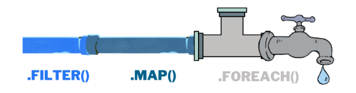

- Think of a stream like a pipeline that allows objects to flow through it. Intermediate operations are like valves or filters that can be used to modify the objects in
 the pipeline. You can use these operations to perform transformations on the objects, such as mapping them to a new value or filtering out certain objects based on some condition.
- Once you've made all the adjustments you want with intermediate operations, you can use a terminal operation to get a final result from the pipeline. Terminal operations are like the tap at the end of the pipeline that allows you to get the final output you want. When you turn on the tap (terminal operation) you get the water (data getting from source and are filtered/mapped)

#### Lazy Evaluation

- *Operations like `map()` and `filter()` are lazy, they are executed in the order they appear when the terminal operation is called.* what does this means?
- Intermediate operations are lazy, meaning they only define the transformation and don't actually do anything until a terminal operation (like `collect()`, `forEach()`) is called.
- When the terminal operation is invoked, the entire pipeline is executed for each element in sequence.
- **Even though the terminal operation triggers the processing, each element flows through all the intermediate operations in the exact sequence they are defined in the chain. This happens on each one of the element at a time. It’s as if each element enters a pipeline, gets processed by every operation in the chain, and then goes to the terminal operation.**
- Lets understand this via code

```
public static void main(String[] args) {
    final List<String> list = List.of("one", "two", "three");

    list.stream()
            .filter(s -> {
                System.out.println("filter: " + s);
                return s.length() <= 3;
            })
            .map(s1 -> {
                System.out.println("map: " + s1);
                return s1.toUpperCase();
            })
            .forEach(x -> {
                System.out.println("forEach: " + x);
            });
}
```

- In this example, three operations are applied in sequence:
    - `filter()` — filters strings whose length is less than or equal to 3 characters.
    - `map()` — converts the remaining strings to uppercase.
    - `forEach()` — prints each element to the console.
- At first glance, it might seem that the entire list is first filtered, then transformed, and finally printed to the console. However, thanks to lazy processing, this is not the case. Instead of processing all elements at each stage, the Stream API processes each element step-by-step through the entire pipeline.


```
Output:
filter: one
map: one
forEach: ONE
filter: two
map: two
forEach: TWO
filter: three
```

- This output shows the following:
    - The first element, "one", passes through the `filter()` method, then gets converted to uppercase via `map()`, and finally is printed to the console.
    - The second element, "two", is processed similarly: filtering, transformation, and printing.
    - The third element, "three", does not pass the filter **because its length is greater than 3**, so its processing stops after the `filter()` call.
- Even though the terminal operation (`forEach()`) triggers the execution, each element flows through the entire sequence of intermediate operations (`map()` -> `filter()`) in the order they are defined. Intermediate operations are evaluated sequentially for each element, one after the other. The terminal operation (`forEach()`, `collect()`, etc.) simply signals when to start processing and defines what to do with the final result.


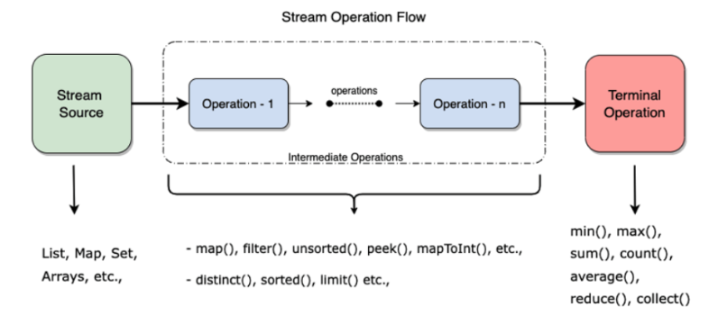


>[!NOTE]
> - The Stream API supports many types of data sources. A stream can be created from collections, arrays, strings, files, and other structures. For example:
> ```
> List<String> list = Arrays.asList("one", "two", "three");
> Stream<String> streamFromList = list.stream();
> 
> String[] array = {"one", "two", "three"};
> Stream<String> streamFromArray = Arrays.stream(array);
> ```
>
> - **The source data remains unchanged during stream processing—every transformation occurs in a new stream, and the result is saved in a new data structure**.


- Now the question arise that if the existing collection is unchanged, the intermediate operation takes up memory for each of its chain method? when you chain methods in a stream (like `filter()`, `map()`), the intermediate steps do not create new collections or data structures. Streams process one element at a time. Each element is passed through the pipeline, and the intermediate results are not stored in memory unless you explicitly ask for it using a terminal operation like `collect().`
- Streams are particularly useful for large datasets because they are lazy and only process data when necessary. If you had to manually create new lists at each step (filtering, mapping, etc.), it would take up a lot more memory.
- If you had a huge dataset of millions of elements and used a loop to filter and map them, you'd have to create temporary collections at each stage. Streams avoid this by not creating intermediate collections.
- Terminal operations like `collect()` do create new collections or data structures (like lists or sets), and that’s where memory comes into play.
- If you use parallel streams, the work is split across multiple threads, and some additional memory overhead is involved due to thread management, but streams themselves are still memory-efficient because of the same lazy evaluation.


#### Stream can be used once

- **Streams in Java can only be used once**. Once you perform a terminal operation (like `forEach()`, `collect()`, etc.), the stream is consumed or closed, and it cannot be reused.
- Consider below code

```
import java.util.Arrays;
import java.util.List;
import java.util.stream.Stream;

public class StreamExample {
    public static void main(String[] args) {
        List<String> list = Arrays.asList("one", "two", "three");

        // Create a stream from the list
        Stream<String> stream = list.stream();

        // First use of the stream (valid)
        stream.forEach(System.out::println);

        // Trying to use the stream again (invalid, will throw an exception)
        stream.forEach(System.out::println);  // This will cause an error!
    }
}

Output:
Output:

one
two
three

Exception in thread "main" java.lang.IllegalStateException: stream has already been operated upon or closed
	at java.base/java.util.stream.AbstractPipeline.sourceStageSpliterator(AbstractPipeline.java:279)
	at java.base/java.util.stream.ReferencePipeline$Head.forEach(ReferencePipeline.java:762)
	at StreamExample.main(StreamExample.java:16)
```

- This error occurs because the stream has been consumed after the first forEach(), and streams can’t be reused once they are closed. If you want to again use the same collection you need to create a new stream.

```
import java.util.Arrays;
import java.util.List;

public class StreamExample {
    public static void main(String[] args) {
        List<String> list = Arrays.asList("one", "two", "three");

        // First stream usage
        list.stream().forEach(System.out::println);

        // Second stream usage (new stream created)
        list.stream().forEach(System.out::println);
    }
}


Output:
one
two
three
one
two
three
```

- Once you’ve performed the operations on the data and reached a result (via a terminal operation), the stream is closed. This design prevents accidental reuse of streams, which could lead to unexpected behaviors in data processing.
- **Thats why it implements AutoClosable interface**. The reason a stream in Java implements the `AutoCloseable` interface is related to this "one-time-use" nature of streams and their ability to release resources after being used.
- Streams, especially those working with I/O resources (like files or sockets), may require explicit resource management. After processing, streams can hold resources (like open file handles, database connections, or network resources), and these need to be properly closed to avoid memory leaks or resource exhaustion.
- Since streams can be used only once, they implement `AutoCloseable`, which allows them to automatically release resources after they're consumed, especially when used in a `try-with-resources` block.

```
import java.nio.file.Files;
import java.nio.file.Paths;
import java.util.stream.Stream;

public class AutoCloseableStreamExample {
    public static void main(String[] args) {
        // Try-with-resources ensures the stream is closed automatically after use
        try (Stream<String> lines = Files.lines(Paths.get("example.txt"))) {
            // Processing the file content
            lines.forEach(System.out::println);
        } catch (Exception e) {
            e.printStackTrace();
        }
    }
}
```

#### Stateless and Stateful Operations

**1. Stateless Operations**:
    - Stateless means that each element in the stream is processed independently of the others.
    - The operation doesn't need to know about other elements to do its job.
    - These operations can easily be parallelized because they don’t need to keep track of the whole stream.
    - Example, `map()` and `filter()` are stateless.

```
import java.util.Arrays;
import java.util.List;

public class StatelessExample {
    public static void main(String[] args) {
        List<Integer> numbers = Arrays.asList(1, 2, 3, 4, 5);

        // Stateless operations: map and filter
        numbers.stream()
               .filter(n -> n > 2)    // Filters each element independently (no need to know other elements)
               .map(n -> n * 2)       // Multiplies each element independently by 2
               .forEach(System.out::println);  // Terminal operation to print elements
    }
}


Output:
6
8
10
```

**2. Stateful Operations**:
    - Stateful means that the operation needs to know about other elements in the stream to do its job.
    - These operations cannot begin to return results until they process part or all of the stream. 
    - These operations require more memory and processing because they can’t work element by element — they need to look at part or all of the stream before producing results.
    - Example, `sorted()`, `distinct()`, and `limit()` are stateful.

```
import java.util.Arrays;
import java.util.List;

public class StatefulExample {
    public static void main(String[] args) {
        List<Integer> numbers = Arrays.asList(5, 1, 4, 2, 3);

        // Stateful operation: sorted
        numbers.stream()
               .sorted()  // Needs to look at all elements first to sort them
               .forEach(System.out::println);  // Terminal operation to print sorted elements
    }
}

Output:
1
2
3
4
5
```

- Stateless operations (like `map()` and `filter()`) are generally faster and easier to parallelize because they process each element independently. Stateful operations (like `sorted()` and `distinct()`) are usually slower and use more memory because they need to keep track of the whole stream or part of it before producing results.
- If the pipeline consists only of stateless operations, the stream can be processed `in one pass`, which makes the execution fast and efficient. However, when stateful operations are added along with it, the stream is divided into sections, and each section must complete its processing before the next one can begin.

```
public static void main(String[] args) {
    final List<String> list = List.of("one", "two", "three");

    list.stream()
            .filter(s -> {
                System.out.println("filter: " + s);
                return s.length() <= 3;
            })
            .map(s1 -> {
                System.out.println("map: " + s1);
                return s1.toUpperCase();
            })
            .sorted()
            .forEach(x -> {
                System.out.println("forEach: " + x);
            });
}

Output:
filter: one
map: one
filter: two
map: two
filter: three
forEach: ONE
forEach: TWO
```

- After filtering, the stream gathers all the elements that passed the check. Only after that does the sorting occur, followed by the execution of `map()` for each element. The order of output in the `forEach()` method changes according to the result of the sorting.
- Thus, the `sorted()` operation creates a **`synchronization point`**, where all elements must be processed first before the pipeline can complete. This can be useful in some cases but may also slow down processing, especially for large datasets.

#### Parallel Stream

- In Java 8, parallel streaming allows you to parallelize the processing of streams. Parallel streaming refers to the ability to process elements of a stream concurrently, leveraging multiple threads to improve the performance of processors.
- A parallel stream breaks the stream's data into smaller chunks and processes them in parallel using multiple threads. It takes advantage of the multiple cores in your CPU to process data faster. The idea is that instead of processing data sequentially (one by one), parallel streams process multiple chunks of data at the same time, in different threads.
- This is achieved by invoking the `stream().parallel()` or `.parallelStream()` method on a stream.
- Lets see example of `parallelStream()`.

```
import java.util.ArrayList;
import java.util.List;
import java.util.stream.Collectors;
import java.util.stream.Stream;
import java.util.Arrays;


public class AboutStreamApi{
    public static void main(String[] args) throws InterruptedException {

        List<String> names = Arrays.asList("John", "Jane", "Mike", "Emily", "Chris");

        // Parallel stream
        names.parallelStream().forEach(name -> {
            System.out.println(name + " - processed by " + Thread.currentThread().getName());
        });
    }
}
```

- When we run the code multiple times we see that we order of names which are getting printed keeps varying.

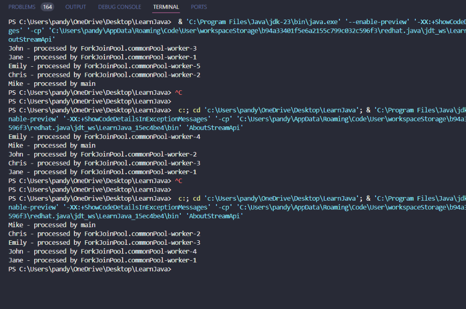

- `parallelStream()` splits the list of names and processes them in parallel across multiple threads. Each element is handled by a different thread (e.g., `ForkJoinPool.commonPool-worker-1`, `worker-2`, etc.). The result is that elements are processed in parallel, not in the order they appear in the list.

>[!TIP]
> - Parallel Stream internally, it uses the `Fork/Join` framework in Java, which is designed for parallel task execution.
> - Java uses the `ForkJoinPool` to distribute tasks for parallel streams. This is a common thread pool where tasks are broken down into smaller fragments and distributed across threads.

- Some more examples of Parallel stream

```
import java.util.HashMap;
import java.util.Map;

public class ParallelStreamWithMap {
    public static void main(String[] args) {
        Map<String, String> nameToCity = new HashMap<>();
        nameToCity.put("Alice", "New York");
        nameToCity.put("Bob", "Los Angeles");
        nameToCity.put("Charlie", "Chicago");
        nameToCity.put("Diana", "Houston");
        nameToCity.put("Eve", "Phoenix");

        // Process each entry in parallel
        nameToCity.entrySet().parallelStream()
                .forEach(entry -> {
                    System.out.println(entry.getKey() + " (name length: " + entry.getKey().length() +
                            "), City: " + entry.getValue() + " (city length: " + entry.getValue().length() +
                            ") - processed by " + Thread.currentThread().getName());
                });
    }
}


Output:
Bob (name length: 3), City: Los Angeles (city length: 11) - processed by main
Eve (name length: 3), City: Phoenix (city length: 7) - processed by main
Alice (name length: 5), City: New York (city length: 8) - processed by main
Charlie (name length: 7), City: Chicago (city length: 7) - processed by main
Diana (name length: 5), City: Houston (city length: 7) - processed by ForkJoinPool.commonPool-worker-3
```

- Filter prime numbers

```
import java.util.Set;
import java.util.HashSet;
import java.util.stream.Collectors;

public class ParallelStreamWithSet {
    public static void main(String[] args) {
        Set<Integer> numbers = new HashSet<>();
        for (int i = 2; i <= 50; i++) {
            numbers.add(i);
        }

        // Find prime numbers using parallel stream
        Set<Integer> primes = numbers.parallelStream()
                .filter(ParallelStreamWithSet::isPrime)
                .collect(Collectors.toSet());

        System.out.println("Prime numbers: " + primes);
    }

    // Helper method to check if a number is prime
    public static boolean isPrime(int number) {
        if (number <= 1) return false;
        for (int i = 2; i <= Math.sqrt(number); i++) {
            if (number % i == 0) return false;
        }
        return true;
    }
}


Output:
Prime numbers: [2, 3, 5, 37, 7, 41, 11, 43, 13, 47, 17, 19, 23, 29, 31]
```

```
import java.util.List;
import java.util.Random;
import java.util.stream.Collectors;

public class ParallelStreamLargeData {
    public static void main(String[] args) {
        // Generating a large list of random numbers
        List<Double> numbers = new Random().doubles(1_000_000, 1, 1000)
                .boxed()
                .collect(Collectors.toList());

        // Parallel stream to compute square roots and filter
        long count = numbers.parallelStream()
                .map(Math::sqrt)              // Compute square root
                .filter(sqrt -> sqrt < 5)     // Filter square roots below 5
                .count();                     // Count the remaining elements

        System.out.println("Count of square roots below 5: " + count);
    }
}

Output:
Count of square roots below 5: 23954
```

- Let’s say we have a list of people with their names and ages, and we want to filter, transform, and collect only those who are over 18, with their names in uppercase.

```
import java.util.Arrays;
import java.util.List;
import java.util.Map;
import java.util.stream.Collectors;

class Person {
    String name;
    int age;

    Person(String name, int age) {
        this.name = name;
        this.age = age;
    }

    public String getName() {
        return name;
    }

    public int getAge() {
        return age;
    }
}

public class ComplexParallelStreamExample {
    public static void main(String[] args) {
        List<Person> people = Arrays.asList(
                new Person("Alice", 23),
                new Person("Bob", 15),
                new Person("Charlie", 30),
                new Person("Diana", 17),
                new Person("Eve", 25)
        );

        // Parallel stream to filter, map, and collect
        Map<String, Integer> adults = people.parallelStream()
                .filter(person -> person.getAge() > 18)             // Filter only adults
                .collect(Collectors.toConcurrentMap(
                        person -> person.getName().toUpperCase(),  // Convert name to uppercase
                        Person::getAge                            // Keep age as value
                ));

        System.out.println("Adults (name in uppercase and age): " + adults);
    }
}


Output:
Adults (name in uppercase and age): {EVE=25, ALICE=23, CHARLIE=30}
```

### Internal Working of Stream

- When you create a stream from a collection, like `List<String> list = Arrays.asList("a", "b", "c"); Stream<String> stream = list.stream();`, Java wraps the collection into a stream. This wrapper provides methods like `filter`, `map`, etc., without altering the original collection.
-  A `Spliterator` is a special iterator used in streams to split the source data for processing. It makes it possible for the stream to divide data into smaller parts when processing in parallel and handles traversing the source in a way that supports both sequential and parallel processing.
- When you invoke `.stream()` or `.parallelStream()` on a collection, a `Spliterator` for that collection is created. If the stream is sequential, the `Spliterator` processes elements one by one. If the stream is parallel, it divides the source into chunks, with each part processed by a separate thread.
- Now we know that how stream works, by iterating or processing each element or chunks (in parallel stream) into several pipelines or different functions but how these functions are connected? **it uses function composition**. Consider below snip

```
import java.util.function.Function;

public class FunctionComposition {

    public static void main(String[] args) {
        Function<Integer, Integer> doubleIt = n -> n * 2;
        Function<Integer, Integer> squareIt = n -> n * n;

        Function<Integer, Integer> composedFunction = doubleIt.andThen(squareIt);

        int result = composedFunction.apply(3); // (3*2)=6 --> 6*6=36

        System.out.println(result);
    }
}

Output:
36
```

- Function composition in Java Streams can be achieved by chaining multiple intermediate operations together. Each intermediate operation transforms the stream in some way, and the final result is produced.
- `PipelineHelper` is an internal component that manages the pipeline of operations in a stream, ensuring each intermediate operation is applied to each element. It maintains the **composition of functions**, coordinating the sequence of each map, filter, and other operations.
- `PipelineHelper` is invoked when the terminal operation is triggered, and it handles each element in the pipeline by applying all the intermediate operations before passing the result to the terminal step. This is key to the function composition concept because it "chains" all intermediate steps together for each element.
- The `forEachRemaining` method is defined in `Iterator` and `Spliterator`. It’s used to apply a function to each remaining element in the stream pipeline, one by one, as they flow through the intermediate operations until reaching a terminal operation.
- When the terminal operation is called, `forEachRemaining` (for sequential streams) or an equivalent mechanism in parallel streams iterates over each element in the source data.

```
import java.util.Arrays;
import java.util.List;

public class StreamExample {
    public static void main(String[] args) {
        List<Integer> numbers = Arrays.asList(1, 2, 3, 4, 5);

        // Stream pipeline with multiple stages
        numbers.stream() // Spliterator created for list
            .filter(n -> n % 2 == 0) // Intermediate operation, using PipelineHelper
            .map(n -> n * n)         // Another intermediate operation, chained functionally
            .forEach(System.out::println); // Terminal operation, invoking forEachRemaining
    }
}

Output:
4
16
```

### More Examples

- Lets see some more example of Stream API

#### Filter 

- Filtering your elements 

```
import java.util.*;
import java.util.stream.*;

public class FilterExample {
    public static void main(String[] args) {
        List<String> names = Arrays.asList("John", "Jane", "Jack", "Doe");

        List<String> filteredNames = names.stream()
            .filter(name -> name.startsWith("J"))
            .collect(Collectors.toList());

        System.out.println(filteredNames);  // Output: [John, Jane, Jack]
    }
}

Output:
[John, Jane, Jack]
```

#### Map 

- Transforms each element using a function.

```
import java.util.*;
import java.util.stream.*;

public class MapExample {
    public static void main(String[] args) {
        List<Integer> numbers = Arrays.asList(1, 2, 3, 4, 5);

        List<Integer> squaredNumbers = numbers.stream()
            .map(n -> n * n)
            .collect(Collectors.toList());

        System.out.println(squaredNumbers);  // Output: [1, 4, 9, 16, 25]
    }
}

Output:
[1, 4, 9, 16, 25]
```

#### FlatMap 

- Imagine we have a bunch of boxes, and each box contains some items. Now, we want to take out all those items from the boxes and put them in a single box. That's what `flatMap()` does with a stream. In layman's terms, flattening is referred to as merging nested collections/arrays into one. Consider the following example.

```
Before flattening 	: [[1, 2, 3], [4, 5], [6, 7, 8]]
After flattening 	: [1, 2, 3, 4, 5, 6, 7, 8]
```

- Code example 

```
import java.util.*;
import java.util.stream.*;

public class FlatMapExample {
    public static void main(String[] args) {
        List<List<String>> namesList = Arrays.asList(
            Arrays.asList("John", "Jane"),
            Arrays.asList("Jack", "Doe")
        );

        List<String> flatList = namesList.stream()
            .flatMap(Collection::stream)
            .collect(Collectors.toList());

        System.out.println(flatList);
    }
}
```

#### Reduce

- Performs a reduction on the elements of the stream (e.g., summing numbers).


```
import java.util.*;
import java.util.stream.*;

public class ReduceExample {
    public static void main(String[] args) {
        List<Integer> numbers = Arrays.asList(1, 2, 3, 4, 5);

        int sum = numbers.stream()
            .reduce(0, Integer::sum);

        System.out.println(sum);  // Output: 15
    }
}
```

#### Collect

- Collects the elements of a stream into a collection or another form.

```
import java.util.*;
import java.util.stream.*;

public class CollectExample {
    public static void main(String[] args) {
        List<String> names = Arrays.asList("John", "Jane", "Jack");

        // Collecting names into a comma-separated string
        String result = names.stream()
            .collect(Collectors.joining(", "));

        System.out.println(result);  // Output: John, Jane, Jack
    }
}
```

#### Sorted

- Sorts the elements in natural or custom order.

```
import java.util.*;
import java.util.stream.*;

public class SortedExample {
    public static void main(String[] args) {
        List<String> names = Arrays.asList("John", "Jane", "Jack", "Doe");

        List<String> sortedNames = names.stream()
            .sorted()
            .collect(Collectors.toList());

        System.out.println(sortedNames);  // Output: [Doe, Jack, Jane, John]
    }
}
```

#### Limit and Skip

- `limit()` limits the number of elements in the stream. `skip()` skips the first `N` elements.

```
import java.util.*;
import java.util.stream.*;

public class LimitSkipExample {
    public static void main(String[] args) {
        List<Integer> numbers = Arrays.asList(1, 2, 3, 4, 5, 6, 7, 8, 9, 10);

        List<Integer> limited = numbers.stream()
            .limit(5)
            .collect(Collectors.toList());

        List<Integer> skipped = numbers.stream()
            .skip(5)
            .collect(Collectors.toList());

        System.out.println(limited);  // Output: [1, 2, 3, 4, 5]
        System.out.println(skipped);  // Output: [6, 7, 8, 9, 10]
    }
}
```

#### Distinct

- Returns a stream with distinct elements (removes duplicates).

```
import java.util.*;
import java.util.stream.*;

public class DistinctExample {
    public static void main(String[] args) {
        List<Integer> numbers = Arrays.asList(1, 2, 2, 3, 4, 4, 5);

        List<Integer> distinctNumbers = numbers.stream()
            .distinct()
            .collect(Collectors.toList());

        System.out.println(distinctNumbers);  // Output: [1, 2, 3, 4, 5]
    }
}
```

#### AnyMatch, NoneMatch and AllMatch

- `anyMatch()` determines if at least one element meets a condition. `allMatch()` determines if all elements meet a condition. `noneMatch()` determines if none of the elements meet a condition

```
import java.util.*;
import java.util.stream.*;

public class MatchExample {
    public static void main(String[] args) {
        List<Integer> numbers = Arrays.asList(1, 2, 3, 4, 5);

        boolean anyMatch = numbers.stream().anyMatch(n -> n > 3);
        boolean allMatch = numbers.stream().allMatch(n -> n < 10);
        boolean noneMatch = numbers.stream().noneMatch(n -> n < 0);

        System.out.println(anyMatch);   // Output: true
        System.out.println(allMatch);   // Output: true
        System.out.println(noneMatch);  // Output: true
        
        anyMatch = numbers.stream().anyMatch(n -> n > 20);
        allMatch = numbers.stream().allMatch(n -> n < 0);
        noneMatch = numbers.stream().noneMatch(n -> n < 4);
        
        System.out.println(anyMatch);   // Output: false
        System.out.println(allMatch);   // Output: false
        System.out.println(noneMatch);  // Output: false
    }
}
```

#### Peek

- Used to perform an action on each element without changing the stream.

```
import java.util.*;
import java.util.stream.*;

public class PeekExample {
    public static void main(String[] args) {
        List<Integer> numbers = Arrays.asList(1, 2, 3, 4, 5);

        List<Integer> processedNumbers = numbers.stream()
            .peek(n -> System.out.println("Processing: " + n))
            .map(n -> n * 2)
            .collect(Collectors.toList());

        System.out.println(processedNumbers);  // Output: [2, 4, 6, 8, 10]
    }
}
```

#### FindFirst and FindAny

- `findFirst()` and `findAny()` are both terminal operations in the Stream API that find an element in a stream and return a single element.
- `findFirst()` returns the first element in a stream, if one is available. It's useful when you need to find the first matching element in a deterministic way. 
- `findAny()` returns any element from a stream, but it's non-deterministic, meaning the value returned may be different each time. It's useful when you don't need a specific element, just any one.
- `findFirst()`

```


import java.util.Arrays;
import java.util.List;
import java.util.Optional;

public class Java8FindFirstExample1 {

    public static void main(String[] args) {

        List<Integer> list = Arrays.asList(1, 2, 3, 2, 1);

        Optional<Integer> first = list.stream().findFirst();
        if (first.isPresent()) {
            Integer result = first.get();
            System.out.println(result);       //Output: 1
        } else {
            System.out.println("no value?");
        }

        Optional<Integer> first2 = list
                .stream()
                .filter(x -> x > 1).findFirst();

        if (first2.isPresent()) {
            System.out.println(first2.get()); //Output: 2
        } else {
            System.out.println("no value?");
        }
    }

}
```

- `findAny()`

```
import java.util.Arrays;
import java.util.List;
import java.util.Optional;

public class Java8FindAnyExample1 {

    public static void main(String[] args) {

        List<Integer> list = Arrays.asList(1, 2, 3, 4, 5, 6, 7, 8, 9, 10);

        Optional<Integer> any = list.stream().filter(x -> x > 1).findAny();
        if (any.isPresent()) {
            Integer result = any.get();
            System.out.println(result);
        }

    }

}

Output:
2 // no guaranteed
```

### Stream Types

- Java's Stream API provides specialized stream types like `IntStream`, `DoubleStream`, and `LongStream` to work specifically with primitive data types (`int`, `double`, and `long`, respectively). These types are similar to the generic `Stream<T>`, but they’re optimized for primitive values, **avoiding the overhead of boxing/unboxing that occurs** when using `Stream<Integer>`, `Stream<Double>`, or `Stream<Long>`.
- Consider example of `IntStream`

```
import java.util.stream.IntStream;

public class IntStreamExample {
    public static void main(String[] args) {
        // Generating an IntStream
        IntStream intStream = IntStream.range(1, 5); // 1, 2, 3, 4

        // Using IntStream methods
        int sum = intStream.sum();
        System.out.println("Sum: " + sum); // Output: Sum: 10

        // Using another IntStream with intermediate operations
        IntStream.range(1, 10)
                .filter(n -> n % 2 == 0) // Filter even numbers
                .forEach(System.out::println); // Output: 2, 4, 6, 8
    }
}
```

- Consider example of `DoubleStream`

```
import java.util.stream.DoubleStream;

public class DoubleStreamExample {
    public static void main(String[] args) {
        // Creating a DoubleStream from an array
        double[] values = {1.2, 2.3, 3.4};
        DoubleStream doubleStream = DoubleStream.of(values);

        // Calculate average
        double avg = doubleStream.average().orElse(0.0);
        System.out.println("Average: " + avg); // Output: Average: 2.3

        // Creating a range of random doubles
        DoubleStream.generate(Math::random)
                    .limit(3) // Only generate 3 random doubles
                    .forEach(System.out::println);
    }
}
```

- Consider example of `LongStream`

```
import java.util.stream.LongStream;

public class LongStreamExample {
    public static void main(String[] args) {
        // Creating a LongStream from a range
        LongStream longStream = LongStream.rangeClosed(1, 5); // Includes 5

        // Calculate the product of the numbers
        long product = longStream.reduce(1, (a, b) -> a * b);
        System.out.println("Product: " + product); // Output: Product: 120

        // Using another LongStream with intermediate operations
        LongStream.range(1, 10)
                  .filter(n -> n % 2 != 0) // Filter odd numbers
                  .forEach(System.out::println); // Output: 1, 3, 5, 7, 9
    }
}
```

- When you use `Stream<T>`, where `T` is a wrapper class like `Integer`, `Double`, or `Long`, Java performs boxing and unboxing between the primitive and wrapper types. **This can lead to overhead in terms of both memory and processing**. The specialized streams (`IntStream`, `DoubleStream`, and `LongStream`) handle primitives directly, making them more efficient for large data sets or computations.


| **Feature**                     | **`Stream<T>`** | **`IntStream`, `DoubleStream`, `LongStream`** |
|---------------------------------|---------------|-----------------------------------------|
| **Works with**                  | Objects       | Primitive types                         |
| **Supports boxing/unboxing**    | Yes           | Not required                            |
| **Specialized numeric methods** | No            | Yes (sum, average, etc.)                |


## Reflection API or Reflection

- Ever wonder whenever you create a method in interface , classes etc.. , how does your IDE (Eclipse, VSCode, NetBeans etc..) auto-suggest you methods when you create an instance? How does Java frameworks like SpringBoot, Hibernate etc.. analyzes annotation, invoke methods or instantiate classes based on configurations rather than hardcoded values? **all this is due to reflection api**.
- As far we know, `java.lang.Object` is the parent class, but you know, there is a class which name is `Class` (`java.lang.Class`) and there is another class name `Method` (`java.lang.reflect.Method`)?


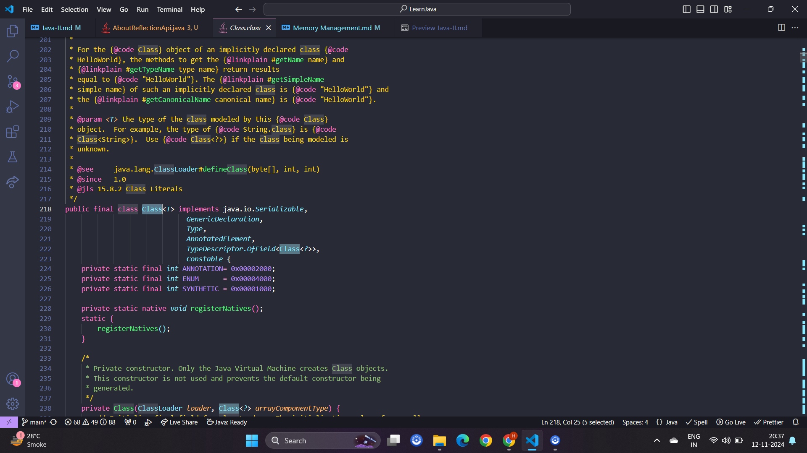

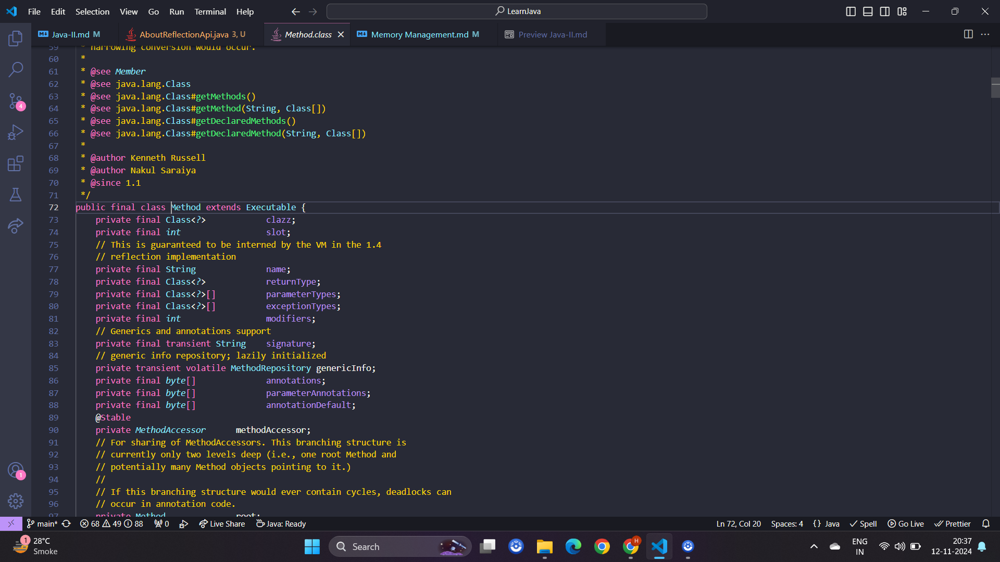

- Based on this, lets try to mimic any IDE. Suppose a user is creating a class `UserDefinedClass`.

```
class UserDefinedClass{
    public String name;
    private int Salary;
    public static String companyName="GOOGLE";

    public UserDefinedClass(){
        System.out.println("UserDefinedClass default constructor");
    }

    public UserDefinedClass(String name,int Salary){
        this.name=name;
        this.Salary=Salary;
    }

    public String getName() {
        return name;
    }

    public void setName(String name) {
        this.name = name;
    }

    public int getSalary() {
        return Salary;
    }

    public void setSalary(int salary) {
        Salary = salary;
    }

}
```

- Now here, the user using our newly IDE has written some methods, some fields and some constructors. Now as an IDE, we need to auto suggest them, now the first we need to check whether the given user has created a class or interface?

```
public class AboutReflectionApi {
    public static void main(String[] args) throws ClassNotFoundException {

        Class checkClass = Class.forName("UserDefinedClass");
        System.out.println(checkClass);
        
    }
}

Output:
class UserDefinedClass
```

- Okay, so it seems the user has written a class and not any interface. The `Class.forName` check whether the class is of type `Class` and if not then it throws a checked exception `ClassNotFoundException`.

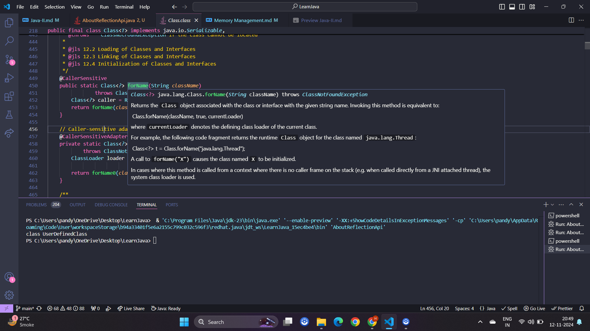

- Now using the `Class checkClass` we can see all its internal implementation written. Now to see the written implementation reflection api provides built-in methods, lets say now as an IDE we need to get all the constructor from the `UserDefinedClass`. 

```
import java.lang.reflect.Constructor;
import java.lang.reflect.Method;

public class AboutReflectionApi {
    public static void main(String[] args) throws ClassNotFoundException {

        Class checkClass = Class.forName("UserDefinedClass");
        System.out.println(checkClass);

        Constructor[] getAllConstructors=checkClass.getConstructors();
        for(Constructor i: getAllConstructors){
            System.out.println(i); // Prints out fully qualified name of Constructor
        }
        
    }
}

Output:
class UserDefinedClass
public UserDefinedClass(java.lang.String,int)
public UserDefinedClass()
```

- The `getConstructors` returns a array of `Constructor` which consist of all the **public constructors**. If any of the constructor is `private`, `default` or `protected`, we need to use `getDeclaredConstructors()` method to retrieve those constructor. 

```
import java.lang.reflect.Constructor;
import java.lang.reflect.Method;


class UserDefinedClass{
    public String name;
    private int Salary;
    public static String companyName="GOOGLE";

    UserDefinedClass(){
        System.out.println("UserDefinedClass default constructor");
    }

    protected UserDefinedClass(int Salary){
        this.name="NOT PROVIDED";
        this.Salary=Salary;
    }

    private UserDefinedClass(String name){
        this.name=name;
        this.Salary=0;
    }

    public UserDefinedClass(String name,int Salary){
        this.name=name;
        this.Salary=Salary;
    }

    public String getName() {
        return name;
    }

    public void setName(String name) {
        this.name = name;
    }

    public int getSalary() {
        return Salary;
    }

    public void setSalary(int salary) {
        Salary = salary;
    }

}

public class AboutReflectionApi {
    public static void main(String[] args) throws ClassNotFoundException {

        Class checkClass = Class.forName("UserDefinedClass");
        System.out.println(checkClass);

        Constructor[] getAllConstructors=checkClass.getDeclaredConstructors();
        for(Constructor i: getAllConstructors){
            System.out.println(i); // Prints out fully qualified name of Constructor
        }
        
    }
}


Output:
class UserDefinedClass
public UserDefinedClass(java.lang.String,int)
private UserDefinedClass(java.lang.String)
protected UserDefinedClass(int)
UserDefinedClass()
```


- Now based on this, our IDE will suggest available constructor to the user who is user our IDE. Lets retrieve some methods and fields.

```
import java.lang.reflect.Constructor;
import java.lang.reflect.Field;
import java.lang.reflect.Method;

public class AboutReflectionApi {
    public static void main(String[] args) throws ClassNotFoundException {

        Class checkClass = Class.forName("UserDefinedClass");
        System.out.println(checkClass);

        System.out.println("All Constructors");
        Constructor[] getAllConstructors=checkClass.getDeclaredConstructors();
        for(Constructor i: getAllConstructors){
            System.out.println(i); // Prints out fully qualified name of Constructor
        }

        System.out.println("All Fields");
        Field[] getAllFields=checkClass.getDeclaredFields();
        for(Field i: getAllFields){
            System.out.println(i); // Prints out fully qualified field name
        }

        System.out.println("All Methods");
        Method[] getAllMethods=checkClass.getDeclaredMethods();
        for(Method i:getAllMethods){
            System.out.println(i); // Prints out fully qualified method name
        }        
    }
}


Output:
class UserDefinedClass
All Constructors
public UserDefinedClass(java.lang.String,int)
private UserDefinedClass(java.lang.String)
protected UserDefinedClass(int)
UserDefinedClass()
All Fields
public java.lang.String UserDefinedClass.name
private int UserDefinedClass.Salary
public static java.lang.String UserDefinedClass.companyName
All Methods
public java.lang.String UserDefinedClass.getName()
public void UserDefinedClass.setName(java.lang.String)
public int UserDefinedClass.getSalary()
public void UserDefinedClass.setSalary(int)
```

- Now suppose we have a class which as a private method.

```
class PrivateMethods{
    private void display(){
        System.out.println("Private Method display()");
    }
}
```

- In java, we cannot access the private methods. But using **reflection api** we can.

```
import java.lang.reflect.Constructor;
import java.lang.reflect.Field;
import java.lang.reflect.Method;

class PrivateMethods{
    private void display(){
        System.out.println("Private Method display()");
    }
}

public class AboutReflectionApi {
    public static void main(String[] args) throws ClassNotFoundException, InstantiationException, IllegalAccessException, NoSuchMethodException, SecurityException,Exception {
        // Loading the Class
        Class privateMethodClass = Class.forName("PrivateMethods");

        // Creating a new instance of the class
        PrivateMethods pm=(PrivateMethods)privateMethodClass.newInstance();

        // Getting the private method by passing method name
        Method displayM=privateMethodClass.getDeclaredMethod("display");

        // Making private method accessible
        displayM.setAccessible(true);

        // Calling method based on the instance created.
        displayM.invoke(pm);
    }
}

Output:
Private Method display()
```

- `Class.forName("PrivateMethods")` dynamically loads the `PrivateMethods` class at runtime. `Class.forName` is useful when the class name is not known at compile time or when loading classes dynamically. `privateMethodClass.newInstance()` creates a new instance of the `PrivateMethods` class. `newInstance()` calls the default constructor (no-argument constructor) of `PrivateMethods` to create an object. The result is cast to `PrivateMethods` and stored in `pm`.

>[!NOTE]
> - Starting with Java 9, `newInstance()` is considered outdated and can be replaced with `GivenClassName.getDeclaredConstructor().newInstance()` ( e.g `privateMethodClass.getDeclaredConstructor().newInstance()` ) for better exception handling.

- `privateMethodClass.getDeclaredMethod("display")` retrieves the display method from `PrivateMethods`, regardless of its access level. `getDeclaredMethod` is used here because it can access private, protected, and public methods. `displayM` now holds a reference to the display method, which is private in this case.

```
displayM.setAccessible(true);
```

- `displayM.setAccessible(true)` allows access to the private method by bypassing Java’s access control checks. This is necessary because the display method is private and cannot be called directly from outside its class. Reflection allows us to override this restriction.
- `displayM.invoke(pm)` calls the display method on the `pm` instance of `PrivateMethods`. It requires the instance name as there could be multiple instance which will have the `display` method, so on which instance we need to invoke it? so it requires the name or instance name.
- Now lets say the `display` method now accepts an integer. So now when you invoke it you need to pass an integer value.

```
import java.lang.reflect.Constructor;
import java.lang.reflect.Field;
import java.lang.reflect.Method;

class PrivateMethods{
    private void display(int i){
        System.out.println("Private Method display() , integer value - "+i);
    }
}

public class AboutReflectionApi {
    public static void main(String[] args) throws ClassNotFoundException, InstantiationException, IllegalAccessException, NoSuchMethodException, SecurityException,Exception {

        // Loading the Class
        Class privateMethodClass = Class.forName("PrivateMethods");

        // Creating a new instance of the class
        PrivateMethods pm=(PrivateMethods)privateMethodClass.getDeclaredConstructor().newInstance();

        // Getting the private method by passing method name
        Method displayM=privateMethodClass.getDeclaredMethod("display",int.class); // Another parameter is variable arguments which representing the types of the method's argument required for the method.

        // Making private method accessible
        displayM.setAccessible(true);

        // Calling method based on the instance created.
        displayM.invoke(pm,30); // Passing value
    }
}


Output:
Private Method display() , integer value - 30
```

- The Java Reflection API allows a program to examine or "reflect" on itself, meaning it can inspect classes, methods, fields, and interfaces at runtime (while the program is running). Using Reflection, Java code can:
    - Discover and manipulate methods, fields, and constructors of a class dynamically.
    - Call methods or access fields that may not be directly accessible or known at compile time.


>[!WARNING]
> - **Avoid using Reflection API implementation on Production as it may create unexpected behaviors, it can be useful for trouble shooting purpose**.
> - Using reflection bypasses many of Java’s security and design features:
>   - **Encapsulation**: Reflection can access private members of a class, potentially breaking the encapsulation principle of object-oriented programming. (As we were able to access private fields)
>   - **Performance**: Reflective operations are generally slower due to their dynamic nature. They involve various runtime checks and lookups, making them more computationally intensive than their non-reflective counterparts.
>   - **Security**: Malicious code might exploit reflection to access or modify private fields and methods, leading to security risks.
> - While the Reflection API is an indispensable tool, it’s essential to use it judiciously. Developers must strike a balance between the dynamic capabilities reflection offers and the design principles Java promotes. When used with care, reflection can help create robust, flexible, and extensible applications without compromising the system’s integrity.

- All Java objects inherit the `getClass()` method from the `java.lang.Object` class. This method returns a `Class` **object representing the runtime class of the instance**. It's an easy and direct approach when you have an object instance.

```
String s = "Hello, Reflection!";
Class<?> clazz = s.getClass();
System.out.println(clazz.getName()); // prints "java.lang.String"
```

- Sometimes, you might want to get the `Class` **object without instantiating an object**. In such cases, using .class syntax on class names or primitive data types provides a straightforward solution.

```
Class<?> intClass = int.class;
Class<?> listClass = java.util.ArrayList.class;
System.out.println(intClass.getName()); // prints "int"
System.out.println(listClass.getName()); // prints "java.util.ArrayList"

try {
    Class<?> dynamicClass = Class.forName("java.util.HashMap");
    System.out.println(dynamicClass.getSimpleName()); // prints "HashMap"
} catch (ClassNotFoundException e) {
    e.printStackTrace();
}
```

- Lets take a example of interface.

```
import java.lang.reflect.Method;

// Define a user-defined interface
interface Animal {
    void sound(); // Method to be implemented by classes
}

// Implementation class for the Animal interface
class Dog implements Animal {
    // Implementing the sound() method for Dog
    public void sound() {
        System.out.println("Dog barks!");
    }
}

public class Main {
    public static void main(String[] args) {
        try {

            // Get the class object for the Dog class
            Class<?> dogClass = Class.forName("Dog");

            // Check if the Dog class implements the Animal interface
            if (Animal.class.isAssignableFrom(dogClass)) {
                System.out.println(dogClass.getName() + " implements Animal");

                // Get the methods of the Animal interface
                Method[] animalMethods = Animal.class.getDeclaredMethods();

                // Iterate through each method in the Animal interface
                for (Method method : animalMethods) {
                    System.out.println("Method in Animal interface: " + method.getName());

                    // Set the method accessible if needed (not required here since it's public)
                    method.setAccessible(true);

                    // Invoke the method on the Dog instance using reflection
                    method.invoke(dog);  // This will call Dog's implementation of sound()
                }
            } else {
                System.out.println(dogClass.getName() + " does not implement Animal");
            }
        } catch (Exception e) {
            e.printStackTrace();
        }
    }
}

Output:
Dog implements Animal
Method in Animal interface: sound
Dog barks!
```


## Serialization & Deserialization

- Imagine you are playing one of the popular game **BGMI (PUB-G)**. You choose one character based on gender and accordingly you pick up dressing style for your character. Now apart from that your character killing score, its stats, matches played etc.. all this details are store somewhere in your mobile app. So when you open again, those details are still present, it does not get vanished.
- Apart from that, when a player shoots another player, the shooting action by the player gets reflected on the screen of another player. This will only happen via network. So your shooting data is transmitted over the network which is been caught by the same app installed on another player mobile.
- In java, serialization and deserialization works similarly.
- **Serialization:** Java Serialization is a mechanism by which Java objects can be converted into a byte stream. This byte stream data can be saved to a file, sent over a network or stored in memory.
- **Deserialization:** Java Deserialization is a mechanism by which byte stream (0's and 1's) fetched over the network, memory or file can be converted back again to its original java objects.
- Serialization and deserialization in Java are processes that allow objects to be converted to a format that can be easily stored or transmitted, and then reconstructed back into objects. This is particularly useful for saving objects to files, sending them over a network, or caching data.

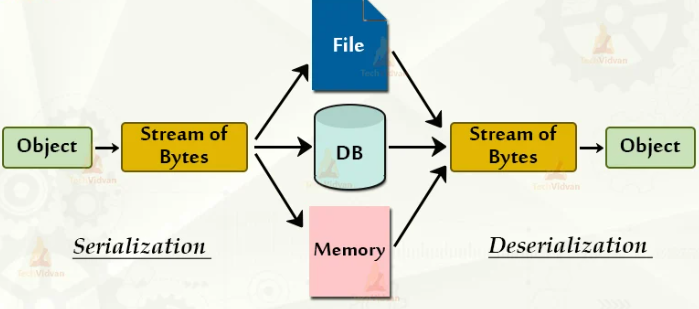

- In java if a class implements **java.io.Serializable**, then those classes object can serialize and deserialize. Lets see an example.

```
import java.io.Serializable;
import java.io.FileOutputStream;
import java.io.ObjectOutputStream;
import java.io.IOException;

class Person implements Serializable {
    private static final long serialVersionUID = 1L;

    String name;
    int age;
    String password;
    
    public Person(String name, int age, String password) {
        this.name = name;
        this.age = age;
        this.password = password;
    }
    
    @Override
    public String toString() {
        return "Person{name='" + name + "', age=" + age + ", password='" + password + "'}";
    }
}


public class AboutSerialization {
    public static void main(String[] args) {
        Person person = new Person("Alice", 30, "secretPassword");
        
        try (FileOutputStream fileOut = new FileOutputStream("person.ser");
             ObjectOutputStream out = new ObjectOutputStream(fileOut)) {
             
            out.writeObject(person);  // Serialize the object
            System.out.println("Person object serialized to person.ser file.");
        } catch (IOException e) {
            e.printStackTrace();
        }
    }
}

Output:
Person object serialized to person.ser file.
```

- To make a class serializable, it needs to implement the **Serializable** interface. **This is a marker interface, meaning it doesn’t have any methods to implement—it simply indicates that the class can be serialized.**. If you see there is one `person.ser` file generated. This is a binary file.

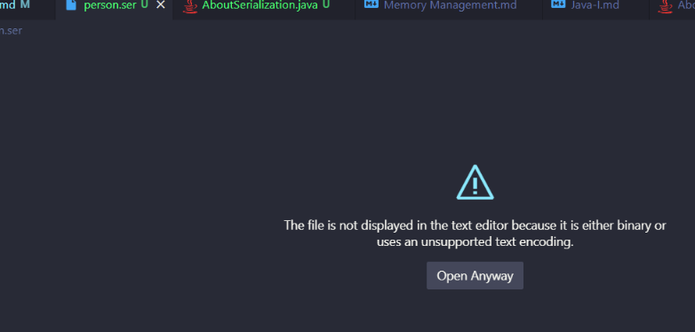

- Now lets try to deserialize the file `person.ser`. 

```
import java.io.FileInputStream;
import java.io.IOException;
import java.io.ObjectInputStream;

public class AboutDeserialization {
    public static void main(String[] args) {
        try (FileInputStream fileIn = new FileInputStream("person.ser");
             ObjectInputStream in = new ObjectInputStream(fileIn)) {
             
            Person person = (Person) in.readObject();  // Deserialize the object
            System.out.println("Deserialized Person: " + person);
        } catch (IOException | ClassNotFoundException e) {
            e.printStackTrace();
        }
    }
}


Output:
Deserialized Person: Person{name='Alice', age=30, password='secretPassword'}
```

- Lets say , you wanted to exclude some certain fields from being serialized. In that case you can use **`transient`** keyword.
- Updated Serialization Code

```
import java.io.Serializable;
import java.io.FileOutputStream;
import java.io.ObjectOutputStream;
import java.io.IOException;

class Person implements Serializable {
    private static final long serialVersionUID = 1L;

    String name;
    int age;
    transient String password;  // This field will not be serialized
    
    public Person(String name, int age, String password) {
        this.name = name;
        this.age = age;
        this.password = password;
    }
    
    @Override
    public String toString() {
        return "Person{name='" + name + "', age=" + age + ", password='" + password + "'}";
    }
}


public class AboutSerialization {
    public static void main(String[] args) {
        Person person = new Person("Alice", 30, "secretPassword");
        
        try (FileOutputStream fileOut = new FileOutputStream("person.ser");
             ObjectOutputStream out = new ObjectOutputStream(fileOut)) {
             
            out.writeObject(person);  // Serialize the object
            System.out.println("Person object serialized to person.ser file.");
        } catch (IOException e) {
            e.printStackTrace();
        }
    }
}

Output:
Person object serialized to person.ser file.
```

- Deserialize code remains same, but in the output we see that the `password` field value is `null`

```
Output:
Deserialized Person: Person{name='Alice', age=30, password='null'}
```

- The `transient` keyword is used to **mark fields that should not be serialized**. For example, if an object has a sensitive field like a `password`, marking it as `transient` will prevent it from being written to the byte stream.
- Do we need to use always `.ser` file extension? no, it is not mandatory to use the `.ser` extension for serialized files in Java. You can use any file extension ( ` .data`, `.bin`, `.txt` etc..) or even no extension at all. The .ser extension is just a convention that helps indicate that the file contains serialized data, but it doesn’t impact the serialization or deserialization process.

### SerialVersionUID

- The `serialVersionUID` is a unique identifier for Serializable classes. This ID is used during deserialization to verify that the sender and receiver of a serialized object have loaded classes for that object that are compatible with respect to serialization.
- It's considered good practice to always explicitly define it to avoid potential issues with deserialization if you modify the class structure in the future.
- If you don't explicitly declare `serialVersionUID`, Java will automatically generate one based on your class definition. However, this generated ID can change if you make even minor modifications to your class, causing deserialization errors when trying to load older serialized data.

### Internal Working

- Now if Serialization is marker interface which has no method then how does it work ? how does it serialize things? since there is no method in it? the Serializable interface acts like a "flag" or "marker" that tells the Java Virtual Machine (JVM) that an object of this class can be serialized. When you mark a class with implements `Serializable`, you’re essentially "opting in" to the serialization process, **allowing Java’s built-in serialization mechanisms to take over**.
- Java has built-in code in its standard library (inside `ObjectOutputStream` and `ObjectInputStream`) that knows how to:
    - Access the fields of an object.
    - Convert each field into a series of bytes that represent the object’s data.
    - Store the class metadata, so that the object can be correctly reconstructed during deserialization.
- The actual work of serialization is handled by Java’s I/O classes, `ObjectOutputStream` (for writing objects) and `ObjectInputStream` (for reading objects). When you call `out.writeObject(object)`, the `ObjectOutputStream` checks if the object’s class implements `Serializable`. If the object’s class implements `Serializable`, `ObjectOutputStream` then serializes the object’s fields (attributes) by converting them into a byte stream. If the class does not implement `Serializable`, the `ObjectOutputStream` will throw a `NotSerializableException`, preventing the object from being written.

## Logging

- Logging in Java is the process of recording information about an application's execution, typically to help with debugging, monitoring, and troubleshooting. Logs capture details about an application’s behavior, errors, or performance, and can provide valuable insights into what is happening "behind the scenes" at runtime.
- Java provides built-in support for logging through the `java.util.logging` (JUL) package, and there are also popular external logging frameworks like `Log4j` and `SLF4J`.
- Lets see an example

```
import java.util.logging.Level;
import java.util.logging.Logger;

public class AboutLogging {

    // Create a logger instance
    private static final Logger logger = Logger.getLogger(AboutLogging.class.getName());

    public static void main(String[] args) {
        logger.log(Level.INFO,"This is an INFO message");
    }
}


Output:
Nov 10, 2024 10:43:18 PM AboutLogging main
INFO: This is an INFO message
```

- A Logger is the main class in JUL used to log messages. It's like a “channel” through which you send log messages. Each Logger is associated with a unique name, often structured like the class or package name. For example, you can create a logger with a name `com.myapp.logger` to represent logging for a specific module. The Logger names must be based on the class or the package name of the logged component.

### Logging Components

- The Java logging components help the developer to create logs, pass the logs to the respective destination and maintain a proper format. The following are the three components:

    - Loggers — Responsible for capturing log records and passing them to the corresponding Appender.
    - Appenders or Handlers — They are responsible for recording log events to a destination. Appenders format events with the help of Layouts, before sending outputs. A Handler (or Appender in other frameworks) is responsible for specifying where to send log messages, such as to the console, file, or a remote server. Common handlers include.
        - `ConsoleHandler`: Logs messages to the console.
        - `FileHandler`: Logs messages to a file.
        - `SocketHandler`: Sends log records to a network socket
    - Layouts or Formatters — Responsible to determine how data looks when it appears in the log entry. A Formatter controls the format of log messages. JUL has built-in formatters such as:
        - `SimpleFormatter`: Formats log messages in a simple text format.
        - `XMLFormatter`: Outputs log messages in XML format

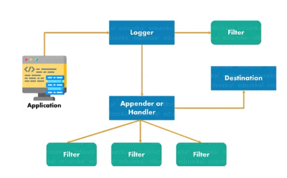

- Events are created by calling methods like `info()`, `warning()`, `severe()`, etc., on a Logger instance. These methods generate log records that are processed by Handlers.
- When an application makes a logging call, the Logger component records the event in a LogRecord and forwards it to the appropriate Appender. Then it formatted the record using the Layout according to the required format. Apart from this, you can also use more than one Filters to specify which Appenders should be used for events.

### Logging Levels

- Logging frameworks support various logging levels to categorize messages based on their importance or severity. This lets you filter logs so you only see relevant information. Common logging levels in Java (and their purposes) are:

**1. SEVERE (or ERROR)**: Indicates a critical issue or failure. This level is used when something goes wrong that requires immediate attention, such as application crashes or database connection failures.

**2. WARNING**: Indicates a potential problem or something that should be watched. It doesn’t stop the application but might need fixing to avoid future issues, like low disk space or deprecated API usage.

**3. INFO**: Used to log general information about the application's execution. It provides useful but non-essential information, like application startup, shutdown, or configuration settings.

**4. CONFIG**: Logs configuration details or initialization of resources. This level is specific to java.util.logging and can help with debugging configuration-related issues.

**5. FINE (or DEBUG)**: Provides detailed information useful for debugging. This includes intermediate steps in processing, or more information about the state of the application at a specific point.

**6. FINER**: Even more detailed than FINE. Often used in development to trace the flow through methods and classes.

**7. FINEST (or TRACE)**: The most detailed logging level. This can log nearly everything, including enter/exit for every method and very low-level details, which is useful for in-depth troubleshooting.


```
SERVER > WARNING > INFO > CONFIG > FINE > FINER > FINEST
```

```
import java.util.logging.*;

public class AboutLoggers {
    private static final Logger logger = Logger.getLogger(AboutLoggers.class.getName());

    public static void main(String[] args) {
        try {

            // ConsoleHandler with SimpleFormatter
            ConsoleHandler consoleHandler = new ConsoleHandler();

            consoleHandler.setFormatter(new SimpleFormatter());
            logger.addHandler(consoleHandler);

            // FileHandler with XMLFormatter
            FileHandler fileHandler = new FileHandler("app.log");
            fileHandler.setFormatter(new SimpleFormatter());
            logger.addHandler(fileHandler);

            // Logging events at different levels
            logger.severe("This is a severe error message");
            logger.warning("This is a warning message");
            logger.info("This is an info message");
            logger.config("This is a config message");
            logger.fine("This is a fine message");
            logger.finer("This is a finer message");
            logger.finest("This is a finest message");


        } catch (Exception e) {
            logger.severe("Failed to initialize handlers: " + e.getMessage());
        }
    }
}


Output: (On Console)
Nov 12, 2024 7:26:06 PM AboutLoggers main
SEVERE: This is a severe error message
Nov 12, 2024 7:26:06 PM AboutLoggers main
SEVERE: This is a severe error message
Nov 12, 2024 7:26:06 PM AboutLoggers main
WARNING: This is a warning message
Nov 12, 2024 7:26:06 PM AboutLoggers main
WARNING: This is a warning message
Nov 12, 2024 7:26:06 PM AboutLoggers main
INFO: This is an info message
Nov 12, 2024 7:26:06 PM AboutLoggers main
INFO: This is an info message

Output: (In app.log file)
Nov 12, 2024 7:26:06 PM AboutLoggers main
SEVERE: This is a severe error message
Nov 12, 2024 7:26:06 PM AboutLoggers main
WARNING: This is a warning message
Nov 12, 2024 7:26:06 PM AboutLoggers main
INFO: This is an info message
```

- Wait why are we getting double output on console. The duplicate log entries are likely due to the root `Logger` already having a default `ConsoleHandler` attached, and when you add another `ConsoleHandler` manually, it results in two handlers processing the same log messages.
- To resolve this, you can remove all existing handlers from the Logger before adding your custom `ConsoleHandler`

```
import java.util.logging.*;

public class AboutLoggers {
    private static final Logger logger = Logger.getLogger(AboutLoggers.class.getName());

    public static void main(String[] args) {
        try {
            Logger rootLogger = Logger.getLogger("");
            for ( Handler handler : rootLogger.getHandlers()) {
                rootLogger.removeHandler(handler);
            }
    
            // ConsoleHandler with SimpleFormatter
            ConsoleHandler consoleHandler = new ConsoleHandler();

            consoleHandler.setFormatter(new SimpleFormatter());
            logger.addHandler(consoleHandler);

            // FileHandler with XMLFormatter
            FileHandler fileHandler = new FileHandler("app.log");
            fileHandler.setFormatter(new SimpleFormatter());
            logger.addHandler(fileHandler);

            // Logging events at different levels
            logger.severe("This is a severe error message");
            logger.warning("This is a warning message");
            logger.info("This is an info message");
            logger.config("This is a config message");
            logger.fine("This is a fine message");
            logger.finer("This is a finer message");
            logger.finest("This is a finest message");


        } catch (Exception e) {
            logger.severe("Failed to initialize handlers: " + e.getMessage());
        }
    }
}

Output: (On Console)
Nov 12, 2024 7:29:42 PM AboutLoggers main
SEVERE: This is a severe error message
Nov 12, 2024 7:29:42 PM AboutLoggers main
WARNING: This is a warning message
Nov 12, 2024 7:29:42 PM AboutLoggers main
INFO: This is an info message
```

- But wait, the `fine`, `finer`, `finest` and `config` are not getting printed? this is because in Java Util Logging (JUL), we need to set the level on the Logger to get `FINE`, `FINER`, or `FINEST` level messages printed to the console or file. Each Handler attached to the Logger also has its own logging level, **and by default, `ConsoleHandler` is set to `INFO`**.  To ensure that messages at `FINE` level or lower are logged, you need to:
    - Set the level of both the Logger and the Handler to `FINE` (or lower).
    - Add the handler to the logger after setting the levels.

```
import java.util.logging.*;

public class AboutLoggers {
    private static final Logger logger = Logger.getLogger(AboutLoggers.class.getName());

    public static void main(String[] args) {
        try {
            Logger rootLogger = Logger.getLogger("");
            for ( Handler handler : rootLogger.getHandlers()) {
                rootLogger.removeHandler(handler);
            }

            /**
             * Setting Level Of Logger
             */
            logger.setLevel(Level.FINEST);

            // ConsoleHandler with SimpleFormatter
            ConsoleHandler consoleHandler = new ConsoleHandler();
            consoleHandler.setFormatter(new SimpleFormatter());

            /**
             * Setting Level of ConsoleHandler
             */
            consoleHandler.setLevel(Level.FINEST);
            logger.addHandler(consoleHandler);

            // FileHandler with XMLFormatter
            FileHandler fileHandler = new FileHandler("app.log");
            fileHandler.setFormatter(new SimpleFormatter());

            /**
             * Setting Level of FileHandler
             */
            fileHandler.setLevel(Level.FINEST);
            logger.addHandler(fileHandler);

            // Logging events at different levels
            logger.severe("This is a severe error message");
            logger.warning("This is a warning message");
            logger.info("This is an info message");
            logger.config("This is a config message");
            logger.fine("This is a fine message");
            logger.finer("This is a finer message");
            logger.finest("This is a finest message");


        } catch (Exception e) {
            logger.severe("Failed to initialize handlers: " + e.getMessage());
        }
    }
}


Output: (On Console)
Nov 12, 2024 7:36:59 PM AboutLoggers main
SEVERE: This is a severe error message
Nov 12, 2024 7:36:59 PM AboutLoggers main
WARNING: This is a warning message
Nov 12, 2024 7:36:59 PM AboutLoggers main
INFO: This is an info message
Nov 12, 2024 7:36:59 PM AboutLoggers main
CONFIG: This is a config message
Nov 12, 2024 7:36:59 PM AboutLoggers main
FINE: This is a fine message
Nov 12, 2024 7:36:59 PM AboutLoggers main
FINER: This is a finer message
Nov 12, 2024 7:36:59 PM AboutLoggers main
FINEST: This is a finest message

Output: (In app.log file)
Nov 12, 2024 7:36:59 PM AboutLoggers main
SEVERE: This is a severe error message
Nov 12, 2024 7:36:59 PM AboutLoggers main
WARNING: This is a warning message
Nov 12, 2024 7:36:59 PM AboutLoggers main
INFO: This is an info message
Nov 12, 2024 7:36:59 PM AboutLoggers main
CONFIG: This is a config message
Nov 12, 2024 7:36:59 PM AboutLoggers main
FINE: This is a fine message
Nov 12, 2024 7:36:59 PM AboutLoggers main
FINER: This is a finer message
Nov 12, 2024 7:36:59 PM AboutLoggers main
FINEST: This is a finest message
```

- When we change the level to `INFO` or any other criteria, only the corresponding and its upper level are printed. For example incase when level is set to `INFO`, `WARNING` and `SEVERE` logs are printed out.
- Logging is useful for:

    1. Debugging: To track down errors or unexpected behavior.

    2. Monitoring: To keep track of application performance and resource usage.

    3. Audit: To maintain records of specific actions or events (e.g., logins, transactions).

    4. Troubleshooting: To analyze issues after they occur in production.


## Volatile 

- n Java, the `volatile` keyword is used to make sure that changes to a variable are always visible to other threads. When a variable is declared as volatile, it tells the JVM that the variable's value will be directly read from and written to the main memory (instead of each thread keeping a copy of it in their own CPU cache).
- **This ensures that if one thread changes the value of a volatile variable, other threads immediately see the updated value**.

### Without Volatile

- Lets understand an example consider a scenario without volatile. Suppose you have a background thread that performs some work, and you want to be able to stop it gracefully from another thread (like the main thread). You could use a boolean flag to control when the background thread should stop. Without `volatile`, the background thread may not see updates to this flag immediately, which could cause it to continue running even after you intend for it to stop.

```
class Worker implements Runnable {
    private boolean running = true;

    public void run() {
        while (running) {
            // Simulate doing some work
            System.out.println("Working...");
            try {
                Thread.sleep(100);
            } catch (InterruptedException e) {
                Thread.currentThread().interrupt();
            }
        }
        System.out.println("Worker stopped.");
    }

    public void stop() {
        running = false;
    }
}

public class Main {
    public static void main(String[] args) throws InterruptedException {
        Worker worker = new Worker();
        Thread thread = new Thread(worker);
        thread.start();

        // Let the worker thread run for a while
        Thread.sleep(500);

        // Stop the worker thread
        worker.stop();
        System.out.println("Request sent to stop the worker.");

        thread.join();
        System.out.println("Main thread finished.");
    }
}

Output:
(Worst Scenario, where the variable value is picked up from the cache)
Working...
Working...
Working...
Working...
Working...
Request sent to stop the worker.
Worker stopped.
Main thread finished.
Working...
Working...
Working...
Working...
... (continues for some time, and then eventually stops)
```

- Without `volatile`, the background Worker thread could continue to loop even after the main thread has set running to false. This happens because the Worker thread may keep reading a cached version of running, not realizing that the main thread has updated it.
- This happens because the `Worker` thread's local CPU cache might keep the running flag's value as `true` for a while. This means that the thread may keep reading an old value of running (in its cache) and may not see the update made by the `stop()` method in the main thread. As a result, the Worker thread may not stop immediately and could even keep running indefinitely. 
- Eventually, due to the CPU's memory consistency mechanisms or other system events, the cached value might be refreshed, and the `Worker` thread will finally see running as `false`, allowing it to stop. However, this can take an unpredictable amount of time, leading to unreliable behavior.

### With Volatile

- For the same code when we write the flag with `volatile` keyword

```
class Worker implements Runnable {
    private volatile boolean running = true;

    public void run() {
        while (running) {
            // Simulate doing some work
            System.out.println("Working...");
            try {
                Thread.sleep(100);
            } catch (InterruptedException e) {
                Thread.currentThread().interrupt();
            }
        }
        System.out.println("Worker stopped.");
    }

    public void stop() {
        running = false;
    }
}


public class AboutVolatile{
    public static void main(String[] args) throws InterruptedException {
        Worker worker = new Worker();
        Thread thread = new Thread(worker);
        thread.start();

        // Let the worker thread run for a while
        Thread.sleep(500);

        // Stop the worker thread
        worker.stop();
        System.out.println("Request sent to stop the worker.");

        thread.join();
        System.out.println("Main thread finished.");
    }
}

Output: (Fix)
Working...
Working...
Working...
Working...
Working...
Request sent to stop the worker.
Worker stopped.
Main thread finished.
```

- In this version, running is marked as `volatile`, so changes to it will always be visible across all threads. When the main thread calls `stop()` and sets running to `false`, the `Worker` thread will immediately see the updated value and stop running.
- When running is declared as `volatile`, every read and write goes to main memory. This means that as soon as `stop()` sets running to `false`, the `Worker` thread will immediately read the updated value from main memory instead of relying on a potentially stale value from its cache.
- Using `volatile` here ensures the `Worker` thread sees the latest running flag state right away, preventing it from unintentionally continuing after the stop request.
- **Volatile does not guarantee atomicity**. What does it means? For example, incrementing a volatile variable involves three steps: read, modify, and write back. If multiple threads attempt to increment the variable at the same time, they might read the same value, increment it, and write it back, resulting in only one increment being recorded instead of two.
- Consider below code

```
class Counter {
    private volatile int count = 0;
    
    public void increment() {
        count++;
    }
    
    public int getCount() {
        return count;
    }
}

public class TestCounter {
    public static void main(String[] args) {
        Counter counter = new Counter();
        
        // Creating two threads that increment the count
        Thread t1 = new Thread(() -> {
            for (int i = 0; i < 1000; i++) {
                counter.increment();
            }
        });

        Thread t2 = new Thread(() -> {
            for (int i = 0; i < 1000; i++) {
                counter.increment();
            }
        });

        t1.start();
        t2.start();
        
        try {
            t1.join();
            t2.join();
        } catch (InterruptedException e) {
            e.printStackTrace();
        }
        
        System.out.println("Final count: " + counter.getCount());
    }
}

Output:
(Will vary on each execution)
```

- However, just using `volatile` does not make the increment method thread-safe. This is because `count++` is not atomic. An atomic operation is an operation that happens in one step, and `count++` actually consists of three steps internally:
    - Reading count.
    - Incrementing the value.
    - Writing the incremented value back.
- Since these steps are not atomic, if two threads try to execute `count++` at the same time, they might read the same initial value and end up overwriting each other's updates.
- Thats why **volatile does not guarantee atomicity**. You need `synchronized` or other concurrency mechanisms for that.

## Record Classes (Introduced in Java 14, finalized in Java 16)

- Java Record Classes significantly reduce boilerplate code for simple data carrier classes by automatically providing constructors, accessors, equals, hashCode, and toString methods. They encourage immutability, enriching the Java language by making code more concise and readable.
- Consider example without record class.

```
import java.util.Objects;

public class Person {
    private String name;
    private int age;

    public Person(String name, int age) {
        this.name = name;
        this.age = age;
    }

    public String getName() {
        return name;
    }

    public int getAge() {
        return age;
    }

    @Override
    public String toString() {
        return "Person{" +
                "name='" + name + '\'' +
                ", age=" + age +
                '}';
    }

    @Override
    public int hashCode() {
        return Objects.hash(name, age);
    }

    @Override
    public boolean equals(Object obj) {
        if (this == obj) return true;
        if (obj == null || getClass() != obj.getClass()) return false;
        Person person = (Person) obj;
        return age == person.age && Objects.equals(name, person.name);
    }
}
```

- Now with record class.

```
public record Person(String name, int age) {
    // No need to explicitly declare constructors, getters, toString, hashCode, or equals.
}
```

- **A record is an immutable transparent carrier for a fixed set of values known as the record components. Each component gives rise to a final field that holds the provided value and an accessor method to retrieve the value**. Consider below code.

```
record Person(int age,String name){

}

public class AboutRecordClass {
    public static void main(String[] args) {
        
        Person p = new Person(20, "ABC");
        System.out.println("Name: "+p.name());

    }
}

Output:
Name: ABC
```

- Once the object is created we cannot change the field value thats why record is an immutable component.
- It shows suggestion for all the final fields created.

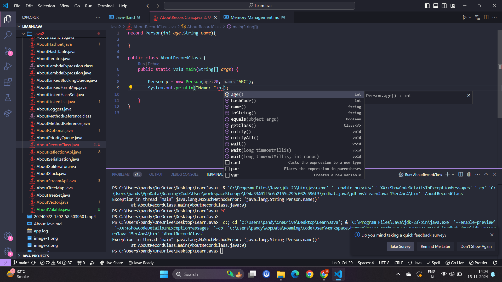

- The compiler has automatically generated all the necessary methods like `hashcode`, `equals` and others. You also might notice that class `Person` extends a `java.lang.Record` class. This class ‘Record’ is applied only by the compiler, the developers can not directly extend it into a Java class as the compiler does not allow it and will fail the compilation.

```
record Person(int age,String name){ }
```

- From this one line of code, the compiler generates the following:
    - final fields with a `String name` and `int age`
    - A constructor which sets both the fields with the value (‘canonical constructor)
    - the accessor methods `name()` and `age()`
    - an `equals()` method that evaluates if two instances are the same if `name` and `age` values are the same for both instances
    - a `hashcode()` method returns the same `hashcode` for two same instances
    - a `toString()` method
- We learned about **equals and hashed contract** where we implemented by using our custom logic. Even those are automatically handled by record classes.

```
record Person(int age,String name){

}

public class AboutRecordClass {
    public static void main(String[] args) {
        
        Person p = new Person(20, "ABC");
        System.out.println("Name: "+p.name());
        Person p1=new Person(20,"ABC");

        // Equals Contract
        if(p.equals(p1)) {
            System.out.println("Objects are equal");
        }

        // Hashed Contract
        System.out.println(p.hashCode());
        System.out.println(p1.hashCode());
    }
}


Output:
Name: ABC
Objects are equal
65198
65198
```

- We cannot perform direct assignment in record classes

```
record Person(int age,String name){
    Person() {
        // Direct assignments like this are not allowed.
        age = 20;
        name = "Doe";
    }
}
```

- To assign default values you can do it like below

```
record Person(int age,String name){
    Person() {
        this(2,"ABC");
    }
}

public class Main {
    public static void main(String[] args) {
        
        Person p = new Person();
        System.out.println(p.toString());
        
        Person p1= new Person(20,"CYZ"); // If values provided then it will be override with default values
        System.out.println(p1.toString());

        
    }
}

Output:
Person[age=2, name=ABC]
Person[age=20, name=CYZ]
```

- In Record classes we can define static and non-static methods/fields.

```
record Person(int age,String name){
    Person() {
        this(2,"ABC");
    }

    static int count=0;

    public void display(){
        System.out.println(count);
    }
}
```

- Records can implement interfaces but cannot extend classes

```
/** Implementing an interface */
public interface Base {
  int age();
}
public record Person(String name, int age) implements Base {
}
```

### When should we use Records or JavaBeans?

- Records can not necessarily replace existing JavaBeans code, since JavaBeans are mutable but records are immutable, as well as the conventions for their accessors are different, JavaBeans accessors are known as Getters/Setters with prefixes get or set but in Java Records, accessors do not follow the same convention and are as same name as fields.

## Sealed Classes and Interfaces (Introduced in Java 15, finalized in Java 17)

- Sealed classes in Java allow you to restrict which classes can extend or implement them. This gives you more control over the inheritance hierarchy and can make your code more secure and maintainable.

```
public sealed class Shape permits Circle, Rectangle, Square {
    // ...
}
```

- The `sealed` keyword indicates that only the specified subclasses can extend this class. The `permits` clause lists the allowed subclasses. These permitted subclasses must be located in the same module or package as the sealed class.
- Example

```
sealed class Shape permits Circle, Rectangle {
    public double getArea() {
        return 0; // Default implementation, subclasses must override.
    }
}

final class Circle extends Shape {
    private double radius;

    public Circle(double radius) {
        this.radius = radius;
    }

    @Override
    public double getArea() {
        return 3.14 * radius * radius;
    }
}

final class Rectangle extends Shape {
    private double width;
    private double length;

    public Rectangle(double width, double length) {
        this.width = width;
        this.length = length;
    }

    @Override
    public double getArea() {
        return width * length;
    }
}

public class AboutSealedClass {
    public static void main(String[] args) {
        Shape s1 = new Circle(10);
        System.out.println("Area of Circle: " + s1.getArea());

        Shape s2 = new Rectangle(5, 7);
        System.out.println("Area of Rectangle: " + s2.getArea());
    }
}

Output:
Area of Circle: 314.0
Area of Rectangle: 35.0
```

- Direct subclasses of a sealed class must be one of the following:
    - `final`: No further subclasses are allowed.
    - `sealed`: Further restrictions are applied to its subclasses. Controls which specific classes can extend a base class. Enforces strict design and helps model clear hierarchies.
    - `non-sealed`: Allows unrestricted inheritance. Removes restrictions on inheritance, allowing any class to extend it.

```
sealed class Shape permits Circle, Rectangle, Triangle {
    public double getArea() {
        return 0; // Default implementation
    }
}

// `final` subclass: No further subclasses allowed
final class Circle extends Shape {
    private double radius;

    public Circle(double radius) {
        this.radius = radius;
    }

    @Override
    public double getArea() {
        return 3.14 * radius * radius;
    }
}

// `sealed` subclass: Restricts further subclassing
sealed class Rectangle extends Shape permits Square {
    private double width;
    private double length;

    public Rectangle(double width, double length) {
        this.width = width;
        this.length = length;
    }

    @Override
    public double getArea() {
        return width * length;
    }
}

// Subclass of `Rectangle`: Allowed because Rectangle is sealed
final class Square extends Rectangle {
    public Square(double side) {
        super(side, side); // A square is a rectangle with equal sides
    }
}

// `non-sealed` subclass: Allows unrestricted inheritance
non-sealed class Triangle extends Shape {
    private double base;
    private double height;

    public Triangle(double base, double height) {
        this.base = base;
        this.height = height;
    }

    @Override
    public double getArea() {
        return 0.5 * base * height;
    }
}

// Subclass of `non-sealed` Triangle: Allowed because Triangle is non-sealed
class RightAngledTriangle extends Triangle {
    public RightAngledTriangle(double base, double height) {
        super(base, height);
    }
}


public class AboutSealedClass {
    public static void main(String[] args) {
        Shape circle = new Circle(10);
        System.out.println("Area of Circle: " + circle.getArea());

        Shape rectangle = new Rectangle(5, 7);
        System.out.println("Area of Rectangle: " + rectangle.getArea());

        Shape square = new Square(4);
        System.out.println("Area of Square: " + square.getArea());

        Shape triangle = new Triangle(6, 8);
        System.out.println("Area of Triangle: " + triangle.getArea());

        Shape rightTriangle = new RightAngledTriangle(6, 8);
        System.out.println("Area of Right-Angled Triangle: " + rightTriangle.getArea());
    }
}


Output:
Area of Circle: 314.0
Area of Rectangle: 35.0
Area of Square: 16.0
Area of Triangle: 24.0
Area of Right-Angled Triangle: 24.0
```

- **Whats the difference between final class, sealed class and non-sealed class?**
    - Final: A subclass that is final cannot be extended any further. This ensures that the sealed class will not have any additional subclasses.
    - Sealed: A subclass that is sealed can define its own sealed subclasses.
    - Non-sealed: A subclass that is non-sealed can be extended by other classes.

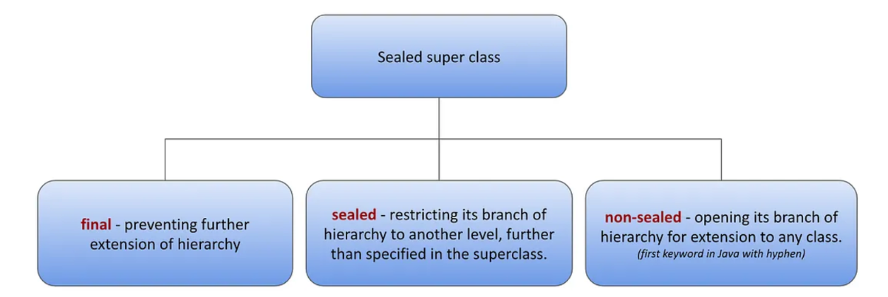

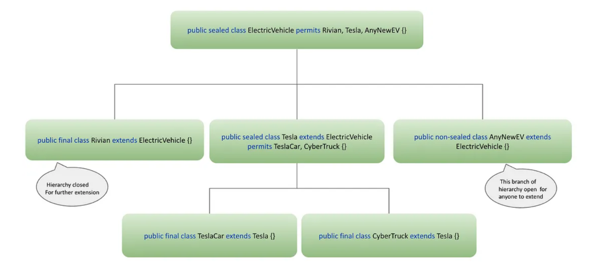

- Similarly the concept of classes are also applicable for interfaces.

## Pattern Matching for `instanceof` (ntroduced in Java 16)

- Pattern matching simplifies the use of `instanceof`. You no longer need to cast the variable after checking its type.
- Before pattern matching

```
Object obj = "Hello, Java!";
if (obj instanceof String) {
    String str = (String) obj;
    System.out.println(str.toUpperCase());
}
```

- After pattern matching

```
Object obj = "Hello, Java!";
if (obj instanceof String str) {
    System.out.println(str.toUpperCase());
}
```

- Removes redundant type casting. Cleaner and more readable code.

## Text Blocks (Introduced in Java 13, finalized in Java 15)

- Text blocks simplify working with multi-line strings by allowing you to use triple double-quotes (`"""`). They preserve the formatting of the string.
- Before text blocks

```
String json = "{\n" +
              "  \"name\": \"John\",\n" +
              "  \"age\": 30\n" +
              "}";
```

- After text blocks

```
String json = """
    {
      "name": "John",
      "age": 30
    }
    """;
```

- Easier to write and read multi-line strings. Automatically formats the text for you.

## Local Variable Type Inference (`var`) (Introduced in Java 10)

- With `var`, you can declare variables without explicitly specifying their type. The compiler infers the type from the assigned value.
- Before `var`

```
String message = "Hello, Java!";
```

- With `var`

```
var message = "Hello, Java!";
```

## Asynchronous Programming 

- Synchronous and asynchronous, also known as sync and async, are two types of programming models. At an abstract level, programming models define how software is designed and executed.
- The basic programming models are synchronous, but asynchronous models are critical for performance reasons and to more efficiently use computing resources.

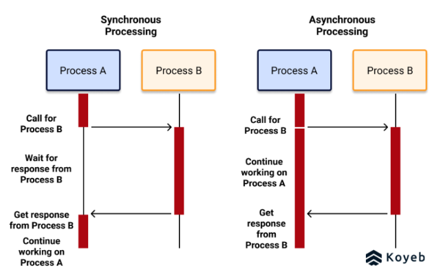

- Synchronous programming, also known as blocking or sequential programming, executes the tasks in a predetermined order, where each operation waits for the previous one to complete before proceeding. This approach ensures deterministic behaviour and provides simplicity in code execution, making it suitable for scenarios where tasks have dependencies or require sequential processing. However, synchronous programming may lead to reduced responsiveness and performance in applications with time-consuming operations.
- Asynchronous programming is a programming model that allows multiple operations to run simultaneously, without waiting for other tasks to finish. It's also known as nonblocking code. Asynchronous programming allows multiple related operations to run concurrently. Unlike synchronous programming, where each task waits for the previous one to complete, asynchronous tasks can run concurrently, utilizing resources more efficiently and enhancing responsiveness in applications.

### CompletableFuture (Java 8)

- `CompletableFuture` is a class introduced in Java 8 that allows us to write asynchronous, non-blocking code. It is a powerful tool that can help us write code that is more efficient and responsive. Instead of waiting for a task to finish (blocking), `CompletableFuture` lets your program continue doing other things and provides tools to process the result when the task is done.
- Lets see an example

```
import java.util.concurrent.CompletableFuture;

public class Main {

    public static void main(String[] args) {
        CompletableFuture<String> future = CompletableFuture.supplyAsync(() -> {
            System.out.println("Asynchronous task running...");
            // Perform a time-consuming task
            try {
                Thread.sleep(5000);
                System.out.println("Asynchronous task Completed, returning result");
            } catch (InterruptedException e) {
                e.printStackTrace();
            }
            return "Result from asynchronous task";
        });

        future.thenAccept(result -> {
            System.out.println("Result: " + result);
        });

        System.out.println("Main thread continuing...");
    }
}

Output:
Asynchronous task running...
Main thread continuing...
Asynchronous task Completed, returning result
Result: Result from asynchronous task
```

- In the example above, we’re creating a `CompletableFuture` that will supply a result in the `future`. We're passing a lambda expression that simulates a long-running operation by sleeping for 5 seconds. After the operation is complete, it will return the string `"Result from asynchronous task"`.
- We’re then calling the `thenAccept()` method on the `CompletableFuture` object (`future`) to specify what to do when the operation is complete. In this case, we're passing a lambda expression that simply prints the result to the console.
- When we run this code, it will print `Result from asynchronous task` to the console after a delay of 5 seconds.
- `supplyAsync` runs a task asynchronously and returns a result. `thenAccept` consumes the result (does something with it but doesn’t return anything).
- There are other methods also provided `CompletableFuture`
- `thenApply`: Transforms the result of a task.

```
CompletableFuture<String> future = CompletableFuture.supplyAsync(() -> "Hello")
        .thenApply(result -> result + ", World!");
future.thenAccept(System.out::println); // Prints: Hello, World!
```

- `thenRun`: Runs a task after another, but doesn’t care about the result of the first.

```
CompletableFuture.supplyAsync(() -> "Hello")
        .thenRun(() -> System.out.println("Task finished!"));
// Prints: Task finished!
```

- `thenCombine`: Combines the results of two tasks.

```
CompletableFuture<String> future1 = CompletableFuture.supplyAsync(() -> "Hello");
CompletableFuture<String> future2 = CompletableFuture.supplyAsync(() -> "World");

future1.thenCombine(future2, (result1, result2) -> result1 + " " + result2)
        .thenAccept(System.out::println); // Prints: Hello World
```

- `exceptionally`:Handles errors in tasks.

```
CompletableFuture<String> future = CompletableFuture.supplyAsync(() -> {
    throw new RuntimeException("Oops!");
}).exceptionally(ex -> "Error: " + ex.getMessage());

future.thenAccept(System.out::println); // Prints: Error: Oops!
```

- `allOf`: Waits for all tasks to complete.

```
CompletableFuture<String> future1 = CompletableFuture.supplyAsync(() -> "Task 1");
CompletableFuture<String> future2 = CompletableFuture.supplyAsync(() -> "Task 2");

CompletableFuture<Void> allTasks = CompletableFuture.allOf(future1, future2);

allTasks.thenRun(() -> System.out.println("All tasks completed!")); 
// Prints: All tasks completed!
```

- `anyOf`: Returns as soon as any task completes.

```
CompletableFuture<String> future1 = CompletableFuture.supplyAsync(() -> {
    try { Thread.sleep(1000); } catch (InterruptedException e) { }
    return "Task 1 finished";
});

CompletableFuture<String> future2 = CompletableFuture.supplyAsync(() -> "Task 2 finished");

CompletableFuture<Object> anyTask = CompletableFuture.anyOf(future1, future2);

anyTask.thenAccept(System.out::println); // Prints: Task 2 finished
```

- Lets way you wanna `join` all your future task and wait for all the task to be completed.

```
import java.util.concurrent.CompletableFuture;
import java.util.concurrent.ExecutionException;

public class Main {

    public static void main(String[] args) {
        // Define two asynchronous tasks
        CompletableFuture<String> task1 = CompletableFuture.supplyAsync(() -> {
            simulateDelay(2000);
            return "Result from Task 1";
        });

        CompletableFuture<String> task2 = CompletableFuture.supplyAsync(() -> {
            simulateDelay(5000);
            return "Result from Task 2";
        });

        // Wait for both tasks to complete using allOf
        CompletableFuture<Void> allTasks = CompletableFuture.allOf(task1, task2);

        // Block until all tasks complete
        allTasks.join(); // Ensures main thread waits for task completion

        // Retrieve results of individual tasks
        try {
            String result1 = task1.get(); // Get result from Task 1
            String result2 = task2.get(); // Get result from Task 2

            // Use results in separate variables
            System.out.println("Task 1 Result: " + result1);
            System.out.println("Task 2 Result: " + result2);

            // Further processing
            String combinedResult = result1 + " & " + result2;
            System.out.println("Combined Result: " + combinedResult);

        } catch (InterruptedException | ExecutionException e) {
            e.printStackTrace();
        }
    }

    // Simulate a delay for task
    private static void simulateDelay(int millis) {
        try {
            Thread.sleep(millis);
        } catch (InterruptedException e) {
            Thread.currentThread().interrupt();
        }
    }
}

Output:
Task 1 Result: Result from Task 1
Task 2 Result: Result from Task 2
Combined Result: Result from Task 1 & Result from Task 2
```
