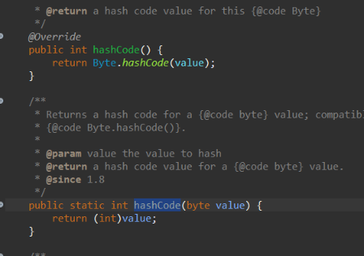
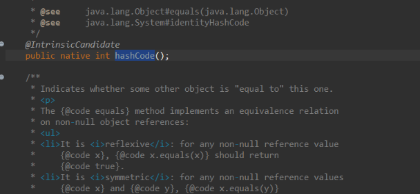
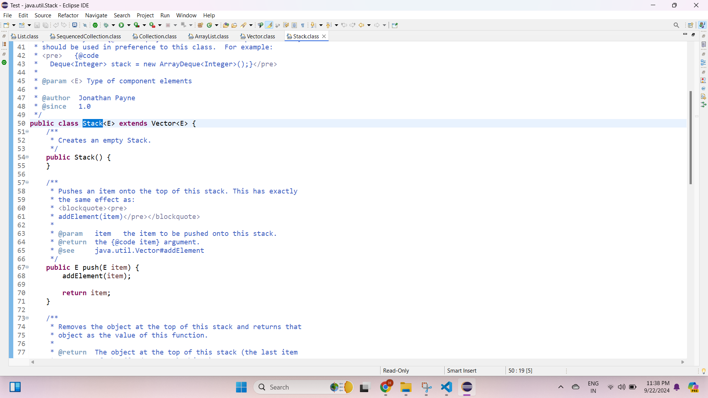

# Java Concepts

## Lambda Expression

- Lets say you have a Functional interface, and you implement this interface using anonymous class.

```
package Java2;

@FunctionalInterface
interface A{
    void show();
}


public class AboutLambdaExpression{
    public static void main(String[] args) {
        
        /**
         * Anonymous class
         */
        A a = new A() {
            public void show(){
                System.out.println("In A show");
            }
        };

        a.show();
    }
}

Output:
In A show
```

- You can reduce the above code to below code.

```
package Java2;

@FunctionalInterface
interface A{
    void show();
}


public class AboutLambdaExpression{
    public static void main(String[] args) {
        A a = () ->System.out.println("In A show");
        a.show();
    }
}

Output:
In A show
```

- This is an example of Lambda expression.
- The Lambda expression is used to provide the implementation of an interface which has functional interface or single abstract method interface. It saves a lot of code. In case of lambda expression, we don't need to define the method again (just like in anonymous class we had define `public void show()`) for providing the implementation. Here, we just write the implementation code.
- Lambda expression provides implementation of functional interface. Behind the scene , `()->` it is instantiating a `new A()`.
- Lets see how lambda expression works when there are parameters in your method.

```
@FunctionalInterface
interface B{
    void doubleTheValue(int i);
}

public class AboutLambdaExpression{
    public static void main(String[] args) {
        B b = (int val)->{
            System.out.println("Number entered : "+val);
            System.out.println("Doubled value is " +val*val);
        };
        b.doubleTheValue(5);
    }
}

Output:
Number entered : 5
Doubled value is 25
```

- Since we are using **one argument**, we can reduce the above implementation to below

```
        B b = val->{
            System.out.println("Number entered : "+val);
            System.out.println("Doubled value is " +val*val);
        };
        b.doubleTheValue(5);

Output:
Number entered : 5
Doubled value is 25
```

- Lambda expression not only makes your code concise and readable but also decrease your file size by eliminating **Anonymous class**. How but? when we compile a class which has anonymous class, check the size.


- When we use lambda expression.




- See the difference in size.
- If your functional interface have a method which returns something then in that case how to implement lambda expression?

```
@FunctionalInterface
interface Addition{
    int add(int n1,int n2);
}

public class AboutLambdaExpression{
    public static void main(String[] args) {
        Addition addvalues = (int i,int j) -> {
            return i+j;
        };
        System.out.println(addvalues.add(6, 5));
    }
}

Output:
11
```

- You can reduce the above code to below

```
        Addition addvalues = (int i,int j) ->  i+j;
        System.out.println(addvalues.add(6, 5));

Output:
11
```

- After `->` you don't need to add `return` keyword, the lambda expression handle that by itself.
- Lambda expression can only be used with functional interface because it only consist of one abstract method. Incase of multiple abstract methods it won't work because the statements of the lambda expression will wont't able to distinguish for which abstract method the implementation is written.

## Generics

- Lets say you have a Box where you will keep numbers, string or float values. How can you implement this? since all these classes have their corresponding wrapper class, we can use **Object** has data type.

```

class Box{
    private Object item;

    public Object getItem() {
        return item;
    }

    public void setItem(Object item) {
        this.item = item;
    }

}
public class AboutGenerics{
    public static void main(String[] args) {
        
        Box b = new Box();
        b.setItem(123);
        int setNumber=(int)b.getItem(); // Type casting is required from Object (Parent class) to int
        System.out.println("Item set is "+setNumber);
    }
}

Output:
Item set is 123
```

- Now lets say you wanna store string value. Again you need to convert your value using `toString()`.

```

class Box{
    private Object item;

    public Object getItem() {
        return item;
    }

    public void setItem(Object item) {
        this.item = item;
    }

}
public class AboutGenerics{
    public static void main(String[] args) {
        
        Box b = new Box();
        b.setItem(123);
        int setNumber=(int)b.getItem(); // Type casting is required from Object (Parent class) to int
        System.out.println("Item set is "+setNumber);

        b.setItem("A String value");
        String setString=b.getItem().toString();
        System.out.println("Item set is "+setString);
    }
}

Output:
Item set is 123
Item set is A String value
```

- Similarly when you set any float values, you need to explicitly cast it. Now this approach has some drawbacks. 
- **It is not type safety, there is manual casting involved and when you compile your program without any editor, just by using CLI it will lead to compile time issues as well**
- So to overcome these drawbacks, we have concepts of **Generics**. Above in the code we made the Box class field as generic by using Object class. But now we will make the Box class itself as Generic.

```

class Box<T>{
    private T item;

    public T getItem() {
        return item;
    }

    public void setItem(T item) {
        this.item = item;
    }
}
public class AboutGenerics{
    public static void main(String[] args) {
        
        /**
         * Now we are specifying that our Box will be Integer (wrapper class of int)
         * This makes the Box fields as Type safe
         */
        Box<Integer> b = new Box<>(); // Or Box<Integer> b = new Box<Integer>();
        b.setItem(123);
        // int setNumber=(int)b.getItem(); // Type casting is required from Object (Parent class) to int (Without Generic)
        int setNumber=(int)b.getItem(); // No type casting is required
        System.out.println("Item set is "+setNumber);

        Box<String> bs = new Box<String>();
        bs.setItem("A String value");
        String setString=bs.getItem();
        System.out.println("Item set is "+setString);
    }
}

Output:
Item set is 123
Item set is A String value
```

- Generic types allow you to define a class, interface, or method with placeholders (type parameters) for the data types they will work with.
- This enables code reusability and type safety, as it allows you to create classes, interfaces, or methods that can operate on various types without needing to cast the value for each type.
- In simpler terms, generics allow you to write code that can work with any object type while ensuring type safety at compile time.
- A generic is defined with type parameters enclosed in angle brackets (`<>`). These parameters act as placeholders for the actual types that will be specified when creating instances of the class. Here when we used `<T>` , so instead of **T** we can use any other alphabets or group of it. Like below

```
class Box<G>{
    private G item;

    public G getItem() {
        return item;
    }

    public void setItem(G item) {
        this.item = item;
    }
}

OR

class Box<GENERIC>{
    private GENERIC item;

    public GENERIC getItem() {
        return item;
    }

    public void setItem(GENERIC item) {
        this.item = item;
    }
}
```

- Lets say you wanted to have a generic class that can have more than one type parameter. Suppose you wanted to define a pair which will have a key and its value.

```
// K - key, V - value
class Pair<K, V> {
    private K key;
    private V value;

    public Pair(K key, V value) {
        this.key = key;
        this.value = value;
    }

    public K getKey() {
        return key;
    }

    public V getValue() {
        return value;
    }
}


public class AboutGenerics{
    public static void main(String[] args) {
        Pair<String, Integer> pair = new Pair<>("Age", 30);
        System.out.println("Key: " + pair.getKey());   // Prints: Key: Age
        System.out.println("Value: " + pair.getValue()); // Prints: Value: 30
    }
}

Output:
Key: Age
Value: 30
```

- Here, the `Pair<K, V>` class has two type parameters `K` and `V`, and you can specify the types when you create an instance of `Pair`.

### Types of Generics

- Generic types allow you to define a class, interface, or method with placeholders (type parameters) for the data types they will work with.

#### Generic Classes

- All the above examples of generics belongs represents example of generic classes.
- Syntax:

```
public class ClassName<T> {
    private T type;

    public void setType(T type) {
        this.type = type;
    }

    public T getType() {
        return type;
    }
}
```

#### Generic Interfaces


- Interfaces can also be generic, allowing different implementations to specify the type parameters.

```
nterface Processor<T> {
    void process(T item);
}

class StringProcessor implements Processor<String> {
    @Override
    public void process(String item) {
        System.out.println("Processing: " + item);
    }
}

class NumberProcessor implements Processor<Integer>{
    @Override
    public void process(Integer item) {
        System.out.println("Processing: " + item);
    }
}

public class AboutGenerics{
    public static void main(String[] args) {
        StringProcessor sp= new StringProcessor();
        sp.process("String value '123'");
        NumberProcessor np= new NumberProcessor();
        np.process(123);
    }
}

Output:
Processing: String value '123'
Processing: 123
```

- Even you can make your interface implementation i.e class as generic parameter type but same parameter type.

```
interface Processor<T> {
    void process(T item);
}

class AnyProcessor<T> implements Processor<T>{
    @Override
    public void process(T item) {
        System.out.println("Processing: " + item);
    }
}
```

- Here we have a generic interface `Processor<T>`, and a generic class `AnyProcessor<T>` that implements the interface. `T` is a type parameter representing a placeholder for any type. The method `process(T item)` will accept an argument of type `T` when implemented by any class.
- Here **whatever the type is specified for the implementation class `AnyProcessor<T>` the same parameter type will go to the interface**. Thats why if we specify any other alphabet or word like `AnyProcessor<K>` this will lead to **error because `AnyProcessor<K>` is trying to introduce a new type parameter K instead of using the one that `Processor<T>` already provides.**
- The class `AnyProcessor<T>` already declares a type parameter `T`, and this parameter needs to match the type parameter `T` from `Processor<T>` that it implements. So, when you write `AnyProcessor<K>`, you are effectively trying to mismatch the generic type declared in the interface and the class.

#### Generic Methods

- Methods that introduce their own type parameters independent of the class's type parameters. Lets say you wanna print values inside the array of any data type. So you created a generic method.

```
class PrintUtility {
    public static <T> void printArray(T[] array) {
        for (T element : array) {
            System.out.println(element);
        }
    }
}

public class AboutGenerics{
    public static void main(String[] args) {


        // Using the generic method
        Integer[] intArray = {1, 2, 3};
        PrintUtility.printArray(intArray);

        String[] strArray = {"A", "B", "C"};
        PrintUtility.printArray(strArray);
    }
}

Output:
1
2
3
A
B
C
```

#### Generic Constructors

- Similarly like methods we can have generic constructor.

```
class PrintUtility {

    <T> PrintUtility(T item){
        System.out.println("Item is "+item);
    }

}

public class AboutGenerics{
    public static void main(String[] args) {
        PrintUtility pu = new PrintUtility("String");
    }
}

Output:
Item is String
```

#### Bounded Type Parameters

- You can restrict the parameter types that can be used as type arguments using bounded type parameters. So suppose lets say you wanna have a Box but only type it will accept is numbers like integer , float , double must be used not string , character or boolean data type. So you are bounding parameter or condition on your generic declaration.

```
// java.lang.Number is abstract class which is implemented by Wrapper classes like Integer , Float , Double.
class NumberBoundedBox<T extends Number>{

    public void process(T item){
        System.out.println("Processing item "+item);
    }
}


public class AboutGenerics{
    public static void main(String[] args) {

        NumberBoundedBox<Double> nbb= new NumberBoundedBox<>();
        nbb.process(5.6);

        /**
         * Implementing String will give compilation error
         * - Bound mismatch: The type String is not a valid substitute for the bounded 
         *   parameter <T extends Number> of the type NumberBoundedBox<T>
         */
        // NumberBoundedBox<String> nbb1= new NumberBoundedBox<>();
    }
}


Output:
Processing item 5.6
```

#### Multiple Bounded Type Parameters

- Lets say you have a interface (`SimpleInterface`) as well. You wanted to implement a Generic which **extends Number and implements SimpleInterface interface**. So such type of restrictions are multiple bounded parameters.

```
interface SimpleInterface{
    void process();
}

class SimpleClass{

}

class MyCustomClass extends SimpleClass implements SimpleInterface{

    public void process(){
        System.out.println("Processing..");
    }
}

class GenericMultipleBounded<T extends SimpleClass & SimpleInterface> {

    public void process(){
        System.out.println("In GenericMultipleBounded");
    }
}

public class AboutGenerics{
    public static void main(String[] args) {
        GenericMultipleBounded<MyCustomClass> gmb=new GenericMultipleBounded<>();
        gmb.process();
    }
}

Output:
In GenericMultipleBounded
```

- Another example

```
// Defining interfaces
interface Movable {
    void move();
}

interface Flyable {
    void fly();
}

// Generic class with multiple interface bounds
public class MultiBoundClass<T extends Movable & Flyable> {
    private T entity;

    public MultiBoundClass(T entity) {
        this.entity = entity;
    }

    public void performActions() {
        entity.move();
        entity.fly();
    }
}

// Class that implements both Movable and Flyable
class Bird implements Movable, Flyable {
    @Override
    public void move() {
        System.out.println("Bird is moving");
    }

    @Override
    public void fly() {
        System.out.println("Bird is flying");
    }
}
```

- You can specify multiple bounds for a generic type parameter using the `&` symbol (AND condition). Only interfaces and one class can be used with multiple bounds.
- **You cannot use the `||` (OR) condition. In Java generics, multiple bounds work with &, meaning the type must satisfy all the bounds.**


#### Upper Bounded Generic

- An upper-bound restricts the type parameter to be of a certain type or a subclass of that type. Consider below example

```
class UpperBoundExample<T extends Number> {
    private T value;

    public UpperBoundExample(T value) {
        this.value = value;
    }

    public void printValue() {
        System.out.println("Value: " + value);
    }
}

public class AboutGenerics{
    public static void main(String[] args) {
        UpperBoundExample<Integer> intObj = new UpperBoundExample<>(10);
        UpperBoundExample<Double> doubleObj = new UpperBoundExample<>(5.5);

        intObj.printValue();  // Output: Value: 10
        doubleObj.printValue();  // Output: Value: 5.5
    }
}

Output:
Value: 10
Value: 5.5
```

- `T extends Number` ensures that `T` can only be of type `Number` or its subclasses like `Integer`, `Double`, `Float`, etc.
In the main method, the UpperBoundExample class is instantiated with `Integer` and `Double` (both subclasses of `Number`)


#### Wildcards(?) in Generics

- Generics (`<T>`) define a type parameter that must be the same throughout the entire class, method, or interface.

```
class Box<T> {
    private T value;

    public void set(T value) {
        this.value = value;
    }

    public T get() {
        return value;
    }
}
```

- Here, when you instantiate the `Box<T>`, `T` could be `Integer`, `String`, or any other type, but the type remains the same for the entire object.
- So, `<T>` is a placeholder for a specific, fixed type. Now consider the below class and guess what will be the output?

```
class BoxWithoutWildCard<T> {
    public void inspect(BoxWithoutWildCard<T> item) {
        System.out.println(item);
    }
}

public class AboutGenerics{
    public static void main(String[] args) {
        BoxWithoutWildCard<Integer> integerBoxWithoutWild = new BoxWithoutWildCard<>();
        BoxWithoutWildCard<Double> doubleBoxWithoutWild = new BoxWithoutWildCard<>();
        /**
         * Compilation ERROR
         * The method inspect(BoxWithoutWildCard<Integer>) in the type BoxWithoutWildCard<Integer> 
         * is not applicable for the arguments (BoxWithoutWildCard<Double>)
         */
        integerBoxWithoutWild.inspect(doubleBoxWithoutWild);
    }
}

Compilation Error
```

- Here, `inspect(BoxWithoutWildCard<T> item)` forces the type to be the same. So, if you instantiate `BoxWithoutWildCard<Integer>`, the method will only accept `BoxWithoutWildCard<Integer>` objects, and it will reject any other type like `BoxWithoutWildCard<Double>`. **This is rigid.**
- Lets use wildcard (`?`) and check it.

```
class BoxWithWildCard<T> {
    public void inspect(BoxWithWildCard<?> item) {
        System.out.println(item);
    }
}

public class AboutGenerics{
    public static void main(String[] args) {
        BoxWithWildCard<Number> integerBoxWithWild = new BoxWithWildCard<>();
        BoxWithWildCard<Double> doubleBoxWithWild = new BoxWithWildCard<>();
        integerBoxWithWild.inspect(doubleBoxWithWild); // Accepts any parameter type.
    }
}

Output:
BoxWithWildCard@548c4f57
```

- Here, using `BoxWithWildCard<?>` tells the method that it doesn’t care if it’s `BoxWithWildCard<Integer>,` `BoxWithWildCard<Double>`, or any other type. **This way the type becomes unknown (?)**. Wildcard `?` provides flexibility because it don’t care about the exact type. It allows you to handle any type. Whereas `<T>` enforces consistency. It means that you are working with a specific type that is fixed throughout the code. You know the exact type at compile time (like `Integer`, `String`, etc.).
- You can also add bounded parameter like below

```
class BoxWithWildCard<T> {
    public void inspect(BoxWithWildCard<? extends Number> item) {
        System.out.println(item);
    }
}
```

- Wildcards (`?`) are typically used in method parameters or return types where you need flexibility. However, they cannot be used as type parameters for classes or interfaces themselves.
- Return type example

```
// Return a list that can contain any type of object
public List<?> getItems() {
    return new ArrayList<String>();
}
```

- Another example of wildcard generic

```
        ArrayList<?> aGenericList = new ArrayList<String>();
        aGenericList=new ArrayList<Integer>();
```

- Here instead we are able to change the collection type. This allows the variable to accept any type of ArrayList, **but you still can't add elements to it because the exact type remains unknown at compile-time.**

```
aGenericList.add("Hello");  // Compilation error!
aGenericList.add(42);       // Compilation error!
aGenericList.add(null);     // Allowed, because null can represent any type
```

- The reason you can't add items like "Hello" or 42 is because `aGenericList` is of type `ArrayList<?>`, and the exact type of `?` is unknown. The compiler cannot be sure whether it’s safe to add a String or an Integer because it doesn't know the real type of `?`.

>[!NOTE]
> - Consider below code
> ```
> class BoxWithWildCard<T> {
>    public void inspect(<?> item) { 
>       System.out.println(item);
>   }
> } // Compilation Error
> ```
> - Wildcard generic can't be used to declare a standalone parameter type like `<?> item`.
> - `T`  is a type parameter that represents a specific type, used for a generic class or method. `?` is a wildcard used with generic types (like `List<?>`, `BoxWithWildCard<?>` etc..)
> - **`Wildcards works with Generic, it does not operate independently`**.

#### Lower Bounded Generic

- A lower-bound restricts the type parameter to be of a certain type or a superclass of that type. Consider below example

```
class LowerBoundExample {

    public static void addNumbers(ArrayList<? super Integer> list) {
        for (int i = 1; i <= 5; i++) {
            list.add(i);
        }
    }
}

public class AboutGenerics{
    public static void main(String[] args) {
        ArrayList<Number> numberList = new ArrayList<>();
        LowerBoundExample.addNumbers(numberList);
        System.out.println(numberList); // Output: [1, 2, 3, 4, 5]
    }
}

Output:
[1, 2, 3, 4, 5]
```

- In this example, the `addNumbers` method accepts a list of any type that is a supertype of `Integer`. This means you can pass in a `ArrayList<Integer>`, a `ArrayList<Number>`, or even a `ArrayList<Object>`.


>[!NOTE]
> - Lower bounds (`<? super Something>`) are only valid with wildcards and are typically used in method parameters, not in class declarations.
> - Java doesn't allow `T super Something` in the type parameter definition in class or method.

## All About Collection

- Consider the example of a piggy bank. We all had it during our childhood where we used to store our coins. This piggy bank is called a Collection and the coins are nothing but objects.
- Technically, a collection is an object or a container that stores a group of other objects. A Collection in Java is an object which represents a group of objects, known as its elements.
- How these collections of data will be stored? , there are many ways to store or organize these data but below are the most prominent ways used by developers to store the elements.

**1. List**: In list, we can store elements in sequentially way in which they are added in the list. It can hold duplicates elements as well. Example, `[1,2,3]`, if we add `4` , then the list becomes `[1,2,3,4]`.


**2. Set**: In set, we can only store unique elements due to this collection displays unordered representation of elements. Example, `{1,2,3,4}` , if we add `4` , then the final result set may be any unordered elements `{2,4,3,1}` or `{3,1,2,4}` etc. But the elements will be unique


**3. Queue**: Imagine if you are standing to buy your movie tickets in queue, the first person to entered gets the first ticket, the last person gets the last ticket. So queue is one way of list where the elements are added at the tail of the list and remove from the front of the list. Thus in queue, Elements are added and removed in a FIFO (First-In-First-Out) order. Example `[1,2,3,4]`, adding `5`, the final queue become `[1,2,3,4,5]` , lets say we need to remove an element, so `1` which was is at the front of the list will be removed , so the final queue will be `[2,3,4,5]`.


**4. Map**: Lets take an example, each mobile number has a person or company name, now to store such type of data we require a collection which gonna perform some mapping like `{123456:"ABC",559450:"XYZ"}`. So such element collections is called Map.
- Now we got some idea how we will be storing our data. On it we can perform several operations like adding a new element, removing a new element, replacing a new element and so on. So there should be a standardize way to perform such operations on the **List**,**Set**,**Queue** and **Map**. These standardize way are define under an interface called Collections.

### Collection (Interface)

- The Collection interface acts like a blueprint or theory that defines what operations a collection should be able to perform. It specifies methods like `add()`, `remove()`, `size()`, but doesn't say how to implement these operations.


### List

- In Java, a List is an ordered collection of objects. This means that elements in a List have a specific sequence and can be accessed by their position (index).
- It can hold duplicate elements.
- Lets explore the **List.class** in java.

<video controls src="20240922-1502-58.5039501.mp4" title="Title"></video>

- **List is an interface** which extends **SequencedCollection** , **SequencedCollection** extends **Collection** interface. If we checkout methods inside the list interface, it consist of method of SequencedCollection and Collection interface along with additional methods.
- SequencedCollection interface methods



- List interface methods


- Now list is an interface, we cannot work with interface we require classes to work with. Lets see the implementation of List.


>[!NOTE]
> - We will not explore all its implementation, we will only explore the widely used implementation of list.

#### ArrayList

- We know what arrays are fixed size collections of elements. An ArrayList in Java is a dynamic array-based data structure that implements the List interface. It's resizable, meaning its size can grow or shrink as needed. It's efficient for random access of elements and provides methods for various operations.
- Lets see an example

```
import java.util.ArrayList;

public class AboutArrayList {
    public static void main(String[] args) {
        // 1. Create an ArrayList
        ArrayList<String> fruits = new ArrayList<>();

        // 2. Add elements to the ArrayList
        fruits.add("Apple");
        fruits.add("Banana");
        fruits.add("Orange");
        fruits.add("Grapes");
        System.out.println("Fruits: " + fruits);

        // 3. Get element by index
        String firstFruit = fruits.get(0);
        System.out.println("First Fruit: " + firstFruit);

        // 4. Update (set) an element at a particular index
        fruits.set(1, "Mango");
        System.out.println("Updated Fruits: " + fruits);

        // 5. Remove an element by index
        fruits.remove(2);
        System.out.println("Fruits after removing index 2: " + fruits);

        // 6. Check the size of the ArrayList
        int size = fruits.size();
        System.out.println("Size of the ArrayList: " + size);

        // 7. Iterate over the ArrayList
        System.out.println("Iterating over the ArrayList:");
        for (String fruit : fruits) {
            System.out.println(fruit);
        }

        System.out.println("Does list contain 'Mango'? " + fruits.contains("Mango"));


        // 8. Clear the ArrayList
        fruits.clear();
        System.out.println("Fruits after clearing: " + fruits);
    }
}


Output:
Fruits: [Apple, Banana, Orange, Grapes]
First Fruit: Apple
Updated Fruits: [Apple, Mango, Orange, Grapes]
Fruits after removing index 2: [Apple, Mango, Grapes]
Size of the ArrayList: 3
Iterating over the ArrayList:
Apple
Mango
Grapes
Does list contain 'Mango'? true
Fruits after clearing: []
```

##### Generics in ArrayList

- Consider the below code.

```
        ArrayList a1 = new ArrayList();
        a1.add("123");
        a1.add(123);
        a1.add(1.23);
        //Not Type Safe Array because manual casting is required
        String var=a1.get(0).toString();
```

- This declares a variable `a1` of type `ArrayList`. You are specifically using the `ArrayList` class to reference your list. Since you haven't specified a type within `< >,` this means you're using a raw type, which is not type-safe. You can add any type of object (like `String`, `Integer`, etc.), leading to potential issues at runtime.
- You might later try to retrieve an object assuming it's a String but encounter a `ClassCastException`.
- Thats why when we initialize an array list we need to declare the object type it gonna hold. Thus making it type safe.

```
ArrayList<String> a = new ArrayList<>();  // Type-safe, only allows Strings
a.add("Apple");  // This is valid
// a.add(100);   // Compile-time error! Can't add an integer
```

- Consider below code.

```
List<String> fruits = new ArrayList<>();
fruits.add("Apple");
fruits.add("Banana");
// fruits.add(100);  // Compile-time error, type safety enforced
```

- Here, you are declaring `fruits` as a `List` (the interface), but the actual implementation is still an `ArrayList`. This is good practice because you are programming to the interface (List), making your code more flexible (e.g., you could later switch to other implementation of list like `LinkedList` without changing the variable type). This is similar concept of dynamic method dispatch.

##### Internal Working of ArrayList

- Initial Capacity: When an ArrayList is created, it has a default capacity (usually 10).
- Growth: When you add elements beyond the current capacity, the ArrayList automatically increases its size by creating a new array (usually with 1.5 times the original size) and copying the old elements into the new array. The old array is discarded, and the new array becomes the underlying array of the ArrayList.
- Shrinking: While ArrayLists can grow dynamically, they don't automatically shrink when elements are removed. However, you can manually call the `trimToSize()` method to reduce the capacity of the ArrayList to the exact size of its current elements. This can be useful to optimize memory usage in cases where you know the final size of the list.

```
import java.util.ArrayList;

public class ArrayListExample {
    public static void main(String[] args) {
        ArrayList<Integer> list = new ArrayList<>();

        // Add elements
        for (int i = 0; i < 10; i++) {
            list.add(i);
        }
        
        System.out.println("Before Trim Capacity is: " + list.size());

        // Remove some elements
        list.remove(5);
        list.remove(7);
        
        // Shrink the array
        list.trimToSize();

        // Now the array capacity is exactly 8
        System.out.println("After Trim Capacity is: " + list.size());
    }
}

Output:
Before Trim Capacity is: 10
After Trim Capacity is: 8
```

##### Memory Management


- Internally, an `ArrayList` uses a regular array (of type `Object[]`) to store the elements. The elements are placed in contiguous memory locations within this array.When an ArrayList is created, it allocates a continuous block of memory with a default initial capacity (usually 10). This means the memory for 10 elements is reserved, even if fewer elements are added initially.
- When the ArrayList exceeds its capacity (i.e., more than 10 elements), a new larger array is created, and the existing elements are copied into the new array. The new size is generally 1.5 times the previous size.
- The old array is discarded, and the new array occupies a new block of contiguous memory. The process of copying elements from the old array to the new one is known as "array resizing".
- The resizing operation involves memory allocation and copying, which can impact performance if it happens frequently. After resizing, there may be unused space (null slots) to accommodate future elements without resizing immediately. If the elements are not added then the space will be wasted.
- **If you are sure that there won't be more additions of element in future in your array list then go for `trimToSize()`, which will save your memory**.
- If you know the approximate number of elements you'll be adding to the ArrayList, you can use the `ensureCapacity()` method to improve performance by reducing the number of resize operations. This pre-allocates space to avoid frequent resizing.

```
ArrayList<Integer> numbers = new ArrayList<>();
numbers.ensureCapacity(100); // Pre-allocate space for 100 elements
```

#### LinkedList

- In Java, a `LinkedList` is a collection that implements the `List` interface and stores elements in a linear fashion. Unlike an `ArrayList`, which uses a dynamic array, a `LinkedList` uses a series of interconnected nodes to store its elements. Each node contains the data and references (or links) to the next nodes in the list.


- **Node Structure**:
    - Data: The actual element being stored.
    - References: Pointers to the next node.
- Lets see an example

```
import java.util.LinkedList;
import java.util.List;

public class AboutLinkedList {
    public static void main(String[] args) {
        // Create a LinkedList of Strings
        LinkedList<String> list = new LinkedList<>();

        // 1. Adding elements to the LinkedList
        list.add("Apple");           // Add at the end
        list.addFirst("Banana");      // Add at the beginning
        list.addLast("Cherry");       // Add at the end
        list.add(2, "Date");          // Add at specific index

        System.out.println("Initial LinkedList: " + list);

        // 2. Accessing elements
        String firstElement = list.getFirst();     // Get first element
        String lastElement = list.getLast();       // Get last element
        String elementAtIndex = list.get(2);       // Get element at specific index

        System.out.println("First element: " + firstElement);
        System.out.println("Last element: " + lastElement);
        System.out.println("Element at index 2: " + elementAtIndex);

        // 3. Removing elements
        list.removeFirst();            // Remove first element
        list.removeLast();             // Remove last element
        list.remove(1);                // Remove element at index 1
        list.remove("Apple");          // Remove specific element

        System.out.println("After removals: " + list);

        // 4. Checking size of LinkedList
        int size = list.size();
        System.out.println("Size of LinkedList: " + size);

        // 5. Checking if an element exists
        boolean containsCherry = list.contains("Cherry");
        System.out.println("Contains 'Cherry'? " + containsCherry);

        // 6. Adding elements in bulk (using another List)
        List<String> newFruits = new LinkedList<>();
        newFruits.add("Elderberry");
        newFruits.add("Fig");

        list.addAll(newFruits);  // Add all elements from newFruits list
        System.out.println("After adding new fruits: " + list);

        // 7. Cloning the LinkedList
        LinkedList<String> clonedList = (LinkedList<String>) list.clone();
        System.out.println("Cloned LinkedList: " + clonedList);

        // 8. Iterating through LinkedList
        System.out.print("Iterating through LinkedList: ");
        for (String fruit : list) {
            System.out.print(fruit + " ");
        }
        System.out.println();

        // 9. Clearing the LinkedList
        list.clear();  // Remove all elements
        System.out.println("After clearing: " + list);

        // 10. Checking if LinkedList is empty
        boolean isEmpty = list.isEmpty();
        System.out.println("Is the LinkedList empty? " + isEmpty);
    }
}


Output:
Initial LinkedList: [Banana, Apple, Date, Cherry]
First element: Banana
Last element: Cherry
Element at index 2: Date
After removals: []
Size of LinkedList: 0
Contains 'Cherry'? false
After adding new fruits: [Elderberry, Fig]
Cloned LinkedList: [Elderberry, Fig]
Iterating through LinkedList: Elderberry Fig
After clearing: []
Is the LinkedList empty? true
```

- Just like in `ArrayList`, we can use generic concept to ensure type safety.

>[!NOTE]
> - When you want to use specific methods that are unique to `LinkedList`, it's best to declare your variables with their respective types instead of using the `List` interface. 
> - `LinkedList` provide additional methods compare to `List` interface, so if you wanna use those additional method then declare your variable type as `LinkedList`.


##### Memory Management

- Memory space is a shared resource among all programs. In a complex system environment, available memory can be dispersed throughout the memory space. We understand that the memory allocated for an array must be continuous. However, for very large arrays, finding a sufficiently large contiguous memory space might be challenging. This is where the flexible advantage of linked lists becomes evident.
- **Non-contiguous Memory**: Unlike an ArrayList, a LinkedList does not allocate a contiguous block of memory. Each node can be located anywhere in memory, and the nodes are linked using pointers.


- Since `LinkedList` nodes are allocated as needed, the overall size of the list can grow or shrink dynamically based on the number of elements.

##### Internal Working of LinkedList

- When new elements are added to a `LinkedList`, new nodes are created and linked to the existing nodes. This can happen at either the head, tail, or any position in the list, depending on where you want to insert the new node.

```
LinkedList<String> list = new LinkedList<>();
list.addFirst("Apple");  // Adds "Apple" at the head
```

- When elements are removed, the corresponding nodes are unlinked and can be garbage collected if there are no references to them. The `LinkedList` dynamically shrinks as nodes are removed.

```
list.remove("Apple");  // Removes "Apple" from the list
```

#### Vector

- A `Vector` class implements the `List` interface.
- `Vector` is essentially a synchronized version of `ArrayList`. It provides the same functionality as `ArrayList` but is thread-safe, making it suitable for multi-threaded environments where multiple threads might access and modify the collection simultaneously.
- Lets see an example

```
import java.util.Vector;

public class AboutVector {
    public static void main(String[] args) {
        // Create a Vector
        Vector<String> vector = new Vector<>();

        // 1. Adding elements
        vector.add("Apple");           // Add at the end
        vector.add("Banana");          // Add at the end
        vector.add("Cherry");          // Add at the end
        vector.add(1, "Mango");        // Add at specific index
        System.out.println("Initial Vector: " + vector);

        // 2. Accessing elements
        String firstElement = vector.firstElement();  // Get first element
        String lastElement = vector.lastElement();    // Get last element
        String elementAtIndex = vector.get(2);        // Get element at index 2

        System.out.println("First element: " + firstElement);
        System.out.println("Last element: " + lastElement);
        System.out.println("Element at index 2: " + elementAtIndex);

        // 3. Checking size and capacity
        int size = vector.size();           // Get the size
        int capacity = vector.capacity();   // Get the capacity

        System.out.println("Size: " + size);
        System.out.println("Capacity: " + capacity);

        // 4. Removing elements
        vector.remove("Mango");            // Remove specific element
        vector.remove(1);                   // Remove element at index 1
        System.out.println("After removals: " + vector);

        // 5. Checking if an element exists
        boolean containsCherry = vector.contains("Cherry");
        System.out.println("Contains 'Cherry'? " + containsCherry);

        // 6. Index of elements
        int index = vector.indexOf("Banana");  // Get index of element
        System.out.println("Index of 'Banana': " + index);

        // 7. Cloning the Vector
        Vector<String> clonedVector = (Vector<String>) vector.clone();
        System.out.println("Cloned Vector: " + clonedVector);

        // 8. Iterating through the Vector
        System.out.print("Iterating through Vector: ");
        for (String fruit : vector) {
            System.out.print(fruit + " ");
        }
        System.out.println();

        // 9. Clearing the Vector
        vector.clear();  // Remove all elements
        System.out.println("After clearing: " + vector);

        // 10. Checking if Vector is empty
        boolean isEmpty = vector.isEmpty();
        System.out.println("Is the Vector empty? " + isEmpty);

        // 11. Adding all elements from another collection
        Vector<String> newFruits = new Vector<>();
        newFruits.add("Orange");
        newFruits.add("Grapes");

        vector.addAll(newFruits);  // Add all elements from newFruits
        System.out.println("After adding new fruits: " + vector);

        // 12. Replacing an element
        vector.set(0, "Kiwi");  // Replace element at index 0
        System.out.println("After replacing first element: " + vector);

        // 13. Trimming the capacity
        vector.trimToSize();  // Reduce capacity to current size
        System.out.println("Capacity after trim: " + vector.capacity());
    }
}


Output:
Initial Vector: [Apple, Mango, Banana, Cherry]
First element: Apple
Last element: Cherry
Element at index 2: Banana
Size: 4
Capacity: 10
After removals: [Apple, Cherry]
Contains 'Cherry'? true
Index of 'Banana': -1
Cloned Vector: [Apple, Cherry]
Iterating through Vector: Apple Cherry
After clearing: []
Is the Vector empty? true
After adding new fruits: [Orange, Grapes]
After replacing first element: [Kiwi, Grapes]
Capacity after trim: 2
```

- When we open `add()` method in `Vector` class we can see it uses **synchronized**. Not only `add()` all other method uses **synchronized**. Thus making it thread-safety.


>[!NOTE]
> - When you want to use specific methods that are unique to `Vector`, it's best to declare your variables with their respective types instead of using the `List` interface. 
> - `Vector` provide additional methods compare to `List` interface, so if you wanna use those additional method then declare your variable type as `Vector`.

- Since `Vector` is a synchronized version of `ArrayList` so its internal memory representation as well as internal working is same as `ArrayList`.
- `Vector` methods are synchronized, making it thread-safe. This means that multiple threads can safely interact with a Vector without causing data inconsistency. `ArrayList` is not synchronized, so it is faster in single-threaded scenarios but requires external synchronization if accessed by multiple threads.
- Due to synchronization, `Vector` may have a performance overhead compared to `ArrayList` in scenarios where thread safety is not a concern.

##### Stack


- A Stack in Java is a data structure that follows the Last-In-First-Out (LIFO) principle, meaning that the last element added to the stack is the first one to be removed. Imagine a cylinder closed at one end. So when you fill the cylinder will elements, once the cylinder is filled, and if you want to make it empty, you need to remove that element which was inserted at the last.
- It is implemented as a subclass of `Vector`.



- Stack Operations: The primary operations of a stack include:
    - Push: Add an element to the top of the stack.
    - Pop: Remove and return the top element of the stack.
    - Peek: Return the top element without removing it.
    - isEmpty: Check if the stack is empty.

- Lets see an example.

```
import java.util.Stack;

public class StackExample {
    public static void main(String[] args) {
        // Create a Stack
        Stack<String> stack = new Stack<>();

        // 1. Push elements onto the stack
        stack.push("Apple");
        stack.push("Banana");
        stack.push("Cherry");
        System.out.println("Stack after pushes: " + stack);

        // 2. Peek at the top element
        String topElement = stack.peek();
        System.out.println("Top element (Peek): " + topElement);

        // 3. Pop an element from the stack
        String poppedElement = stack.pop();
        System.out.println("Popped element: " + poppedElement);
        System.out.println("Stack after pop: " + stack);

        // 4. Check if the stack is empty
        boolean isEmpty = stack.isEmpty();
        System.out.println("Is the stack empty? " + isEmpty);

        // 5. Get the size of the stack
        int size = stack.size();
        System.out.println("Size of the stack: " + size);

        // 6. Search for an element
        int position = stack.search("Banana");  // Returns 1-based index
        System.out.println("Position of 'Banana': " + position);

        // 7. Clear the stack
        stack.clear();
        System.out.println("Stack after clearing: " + stack);
    }
}

Output:
Stack after pushes: [Apple, Banana, Cherry]
Top element (Peek): Cherry
Popped element: Cherry
Stack after pop: [Apple, Banana]
Is the stack empty? false
Size of the stack: 2
Position of 'Banana': 1
Stack after clearing: []
```

- The `Stack` class extends the `Vector` class, which means it inherits all the properties and methods of `Vector`, including its dynamic array behavior. Since `Vector` is synchronized, Stack also inherits this synchronization.
- If multiple threads are accessing a `Stack` at the same time (e.g., one thread pushing elements while another thread is popping elements), there is a risk of data inconsistency or corruption. For example, if two threads try to pop from an empty stack simultaneously, one thread might cause an exception or corrupt the state of the stack.
- Synchronization ensures that the operations on the stack (like push, pop, and peek) are atomic. This means that once a thread starts an operation, it will complete that operation without interruption from other threads. This is crucial to maintain the integrity of the stack's state. When a thread is executing a synchronized method, other threads attempting to access the same method will be blocked until the first thread finishes, which can affect the responsiveness of the application.
- Lets consider a scenario where the stack will be full by inserting one element, and two threads are trying to push the data simultaneously. This would lead to data inconsistency.
- While you can use an `ArrayList` to implement a stack (by adding and removing elements from the end of the list), using a `Stack` provides a clearer semantic meaning of LIFO behavior. The Stack class explicitly provides stack operations, making the code more readable and intuitive.


| **Feature**   | **ArrayList** | **LinkedList**  |**Vector**   |
|-----------------------------|---------------------------------------------------------------------------------|--------------------------------------------------------------------------------------------|--------------------------------------------------------------------|
| Implementation | Resizable array (dynamic array)                                                 | linked list (dynamic bases on nodes in memory)                                                                     | Resizable array (like `ArrayList`)                                   |
| Performance (Access)        | Fast random access (O(1))                                                       | Slower random access (O(n))                                                                | Fast random access (O(1))                                          |
| Performance (Insert/Remove) | Slower when inserting/removing elements in the middle (O(n))                    | Efficient insert/remove at the beginning or middle (O(1) if node is known, O(n) otherwise) | Slower when inserting/removing in the middle (O(n))                |
| Memory Usage                | Less memory overhead than LinkedList (only stores data)                         | More memory (stores data and links to previous/next nodes)                                 | Similar to `ArrayList`, uses a dynamic array                         |
| Thread Safety               | Not synchronized                                                                | Not synchronized                                                                           | Synchronized by default (thread-safe)                              |
| Grow Policy                 | Increases by 50% when full                                                      | Not applicable                                                                             | Increases by 100% (doubles size when full)                         |
| Iterator Type               | Fail-fast (throws `ConcurrentModificationException` if modified during iteration) | Fail-fast                                                                                  | Fail-safe (since it's synchronized)                                |
| Best Use Case               | When you need fast access to elements                                           | When you frequently insert/remove elements at both ends                                    | When you need thread-safe collection (legacy code)                 |


>[!NOTE]
> - Fail-fast is a mechanism in Java collections where an operation fails immediately if the structure of the collection is modified while it is being iterated. This is done to prevent unpredictable behavior during concurrent modifications.
> - Example consider below code, during iteration we are removing elements from `ArrayList`
> ```
> import java.util.ArrayList;
> public class FailFastExample {
>    public static void main(String[] args) {
>        ArrayList<String> list = new ArrayList<>();
>        list.add("A");
>        list.add("B");
>        list.add("C");
>
>        // Using enhanced for-loop
>        for (String element : list) {
>                // Directly modifying the list while iterating
>                list.remove(element);  // This will trigger a ConcurrentModificationException
>        }
>    }
> }
> 
> Output:
> ERROR!
> Exception in thread "main" java.util.ConcurrentModificationException
>	at java.base/java.util.ArrayList$Itr.checkForComodification(ArrayList.java:1043)
>	at java.base/java.util.ArrayList$Itr.next(ArrayList.java:997)
>	at FailFastExampleWithoutIterator.main(FailFastExampleWithoutIterator.java:11)
>```


>[!TIP]
> - Lets say there is company who has a storage system and has a application which is used by customer world wide, the storage system has huge memory space, the company wants to give a zero latency experience to their customer while accessing their information from the storage, you as a java developer wanted to use collection, so which collections class you will prefer? , note the company has a huge budget when if memory is completely exhausted then the company will increase it size without checking out memory prices? option give you is `ArrayList` or `LinkedList`?
> - `ArrayList` as it provides constant-time access (O(1)) to elements by index because it uses a dynamic array internally. This is ideal for scenarios where users access data frequently and expect minimal delay in retrieving information.


### Queue

- A `Queue` is a collection designed to hold elements prior to processing. It typically orders elements in a FIFO (First-In-First-Out) manner.


- Lets explore **Queue.class** in java.


- If you see, `Queue` is an interface which extends another interface called `Collection`. Lets checkout implementations of `Queue`.


- Lets see method define for `Queue` interface.


- Main operations:
    - `add(element)`: Adds an element to the rear of the queue. If the queue is full, it throws an exception.
    - `offer(element)`: Adds an element to the rear of the queue. If the queue is full, it returns false.
    - `remove()`: Removes and returns the element at the front of the queue. If the queue is empty, it throws an exception.
    - `poll()`: Removes and returns the element at the front of the queue. If the queue is empty, it returns null.
    - `element()`: Returns the element at the front of the queue without removing it. If the queue is empty, it throws an exception.
    - `peek()`: Returns the element at the front of the queue without removing it. If the queue is empty, it returns null.

>[!NOTE]
> - We will not explore all its implementation, we will only explore the widely used implementation of Queue.

#### PriorityQueue

- Imagine you're at an airport where there are two security lines:
     - **Regular line**: People are processed on a first-come, first-served basis (like a typical queue).
    - **VIP line (Priority People)**: Here, passengers are processed based on their priority, not necessarily their arrival time. For example, passengers with first-class tickets (higher priority) get to move ahead of economy passengers, even if they arrived later.
- Likewise in the Priority Queue:
     - Each passenger (element) has a priority (for example, their class of ticket).
    - The security agents (queue operations) always serve the highest priority passengers first (the element, based on some criterion), regardless of the order in which they arrived.
    - So, just like how passengers with higher priority (first-class tickets) go through security first, elements with higher priority are served first in a Priority Queue, no matter the order of insertion.
- A PriorityQueue is used when the objects are supposed to be processed based on the priority. It is known that a Queue follows the First-In-First-Out algorithm, but sometimes the elements of the queue are needed to be processed according to the priority, that’s when the PriorityQueue comes into play.
- A PriorityQueue is a type of queue that arranges elements based on their priority values. Elements with higher priority values are typically retrieved or removed before elements with lower priority values. Each element has a priority value associated with it.
- What are the priorities values?
    - In a PriorityQueue, the priority values is a way to decide the importance of each element.
    - In a Priority Queue, **smaller numbers usually represent more urgent or higher-priority tasks**. This is just a convention, similar to how in sports rankings, being ranked 1st means you are the best. The queue always picks the element with the smallest value because it's considered the most important.
    - Example:
        - In a PriorityQueue containing these numbers: `[7, 2, 5]`. 2 has the highest priority because it's the smallest number.

- Lets see a code example.

```
import java.util.PriorityQueue;

public class AboutPriorityQueue {
    public static void main(String[] args) {
        // Creating a PriorityQueue for Integers (natural ordering: smallest value has the highest priority)
        PriorityQueue<Integer> intQueue = new PriorityQueue<>();

        // offer() / add() - Adding elements
        intQueue.offer(10);
        intQueue.add(20);
        intQueue.offer(30);
        intQueue.add(5);  // Highest priority since 5 is the smallest

        // peek() - Checking the front or head (element with highest priority)
        System.out.println("Peek (highest priority): " + intQueue.peek());  // Output: 5

        // poll() - Retrieving and removing the front or head
        System.out.println("Poll (removed): " + intQueue.poll());  // Output: 5 (smallest)
        
        // Check remaining elements in queue
        System.out.println("Peek (after poll): " + intQueue.peek());  // Output: 10

        // remove() - Removing a specific element
        intQueue.remove(10);
        System.out.println("After removing 10, Peek: " + intQueue.peek());  // Output: 20

        // contains() - Check if an element is present
        System.out.println("Contains 20? " + intQueue.contains(20));  // Output: true

        // size() - Get the size of the queue
        System.out.println("Size: " + intQueue.size());  // Output: 1

        // isEmpty() - Check if the queue is empty
        System.out.println("Is queue empty? " + intQueue.isEmpty());  // Output: false

        // clear() - Clear the queue
        intQueue.clear();
        System.out.println("Is queue empty after clear? " + intQueue.isEmpty());  // Output: true


        // Creating a PriorityQueue for Strings (natural ordering: lexicographical, alphabetically ordering)
        PriorityQueue<String> stringQueue = new PriorityQueue<>();

        // offer() - Adding elements
        stringQueue.offer("banana");
        stringQueue.offer("apple");  // This will have the highest priority (alphabetically smallest)
        stringQueue.offer("cherry");

        // peek() - Checking the head
        System.out.println("Peek (highest priority): " + stringQueue.peek());  // Output: apple

        // poll() - Retrieving and removing the head
        System.out.println("Poll (removed): " + stringQueue.poll());  // Output: apple

        // Check remaining elements in queue
        System.out.println("Peek (after poll): " + stringQueue.peek());  // Output: banana

        // remove() - Removing a specific element, returns true of false if element found was removed or not
        stringQueue.remove("banana");
        System.out.println("After removing 'banana', Peek: " + stringQueue.peek());  // Output: cherry

        // contains() - Check if an element is present
        System.out.println("Contains 'cherry'? " + stringQueue.contains("cherry"));  // Output: true

        // size() - Get the size of the queue
        System.out.println("Size: " + stringQueue.size());  // Output: 1

        // isEmpty() - Check if the queue is empty
        System.out.println("Is queue empty? " + stringQueue.isEmpty());  // Output: false

        // clear() - Clear the queue
        stringQueue.clear();
        System.out.println("Is queue empty after clear? " + stringQueue.isEmpty());  // Output: true
    }
}


Output:
Peek (highest priority): 5
Poll (removed): 5
Peek (after poll): 10
After removing 10, Peek: 20
Contains 20? true
Size: 2
Is queue empty? false
Is queue empty after clear? true
Peek (highest priority): apple
Poll (removed): apple
Peek (after poll): banana
After removing 'banana', Peek: cherry
Contains 'cherry'? true
Size: 1
Is queue empty? false
Is queue empty after clear? true
```


>[!IMPORTANT]
> - `PriorityQueue` does not allow `null` elements. If you try to add null, it will throw a `NullPointerException`.
> - By default, `PriorityQueue` orders its elements using natural ordering (numbers by ascending value, strings lexicographically). You can customize the order by providing a `Comparator` when creating the queue.
> - `PriorityQueue` is unbounded, meaning it can grow dynamically as more elements are added. However, the underlying array can be resized when needed.
> - **Random access is not available in a `PriorityQueue` in Java**. Like in `ArrayList` we have `getIndex()` method there is no such method for `PriorityQueue` as `Queue` are designed to specifically retrieve elements based on FIFO or priority principles and not for random access.
> - `PriorityQueue` does not have trimming methods, there's no method to shrink their internal structures. It can be handle explicitly by manually create a new `PriorityQueue` and copy elements into it.
> - `PriorityQueue` is not thread-safe. Java provides `PriorityBlockingQueue`, which is a thread-safe variant of `PriorityQueue`.
> - Duplicate elements are allowed in `PriorityQueue`. If two elements are equal in priority, they can both exist in the queue.
> - `PriorityQueue` does not guarantee ordering stability. This means that if two elements are considered "equal" in priority, their relative order in the queue may not be maintained. The internal **heap** structure decides the relative order of equal-priority elements. If you insert two elements with the same priority, there is no guarantee which of them will be retrieved first, as `FIFO` is not a property of `PriorityQueue` for elements of equal priority.
> - To give custom priorities we can use `comparator` (we will see this later).


- Just like `ArrayList`, we can use generic concept for `PriorityQueue` as well , `PriorityQueue intQueue = new PriorityQueue();`.


##### Internal Working of PriorityQueue

- Internally, `PriorityQueue` uses a **heap (binary heap)**, which allows efficient insertion (`O(log n)`) and removal of the element with the highest priority.
- The elements are stored in an array-based structure where the smallest element (according to natural ordering or a custom comparator) is always at the root.
- Time complexity:
    - Insertion: `O(log n)`
    - Removal (`poll`): `O(log n)`
    - Peek: `O(1)`
- A heap is a specialized tree-based data structure that satisfies the heap property. `PriorityQueue` default uses **min-heap** property which is the smallest element is always at the root of the tree (or at index 0 of the internal array) and for any parent node, its children will always have larger or equal values.
- **To be specific `PriorityQueue` uses balanced binary heap**.

##### Memory Management

- When you create a `PriorityQueue` in Java without specifying an initial capacity, it creates an internal array with a default size of **11**. As elements are added, the queue automatically grows in size to accommodate more elements.


- The internal array would look in memory after several elements are added

```
[1, 2, 8, 5, 3, null, null, null, null, null, null]
```

- By default, the internal array has a size of 11. You can also specify a custom initial capacity by passing an integer value in the constructor, `new PriorityQueue<>(capacity)`.
- When the number of elements exceeds the current capacity, the internal array grows by **50%** (double of current size, similar to `ArrayList` behavior). This ensures that adding new elements remains efficient as the queue grows.

#### Deque (Double Ended Queue)

- A Deque (Double Ended Queue) in Java is a linear data structure that allows insertion and deletion of elements from both ends. Unlike a Queue that only allows operations at one end (FIFO: First-In-First-Out), a Deque supports operations at both the front and rear.


- The **interface** called Deque is present in `java.util` package. It is the subtype of the interface queue. The Deque supports the addition as well as the removal of elements from both ends of the data structure. Therefore, a deque can be used as a `Stack` or a `Queue`. We know that the stack supports the Last In First Out (LIFO) operation, and the operation First In First Out is supported by a queue. As a deque supports both, either of the mentioned operations can be performed on it

>[!NOTE]
> - `LinkedList` implements **`Deque` (`Queue` interface)** to give doubly linked list collection which allows insertion and deletion of elements from both ends (head and tail) of the linked list.


##### ArrayDeque

- `ArrayDeque` is a resizable array implementation of the `Deque` interface. It is part of Java's `java.util` package and is generally more efficient than `LinkedList` for Deque operations.
- Lets see an example

```
import java.util.ArrayDeque;
import java.util.Deque;

public class AboutArrayDeque {
    public static void main(String[] args) {
        // Creating an ArrayDeque instance
        Deque<Integer> deque = new ArrayDeque<>();

        // Insertion operations
        deque.addFirst(10);  // [10]
        deque.addLast(20);   // [10, 20]
        deque.offerFirst(5); // [5, 10, 20]
        deque.offerLast(25); // [5, 10, 20, 25]

        System.out.println("Deque after insertions: " + deque);

        // Access and retrieval operations
        System.out.println("First element (getFirst): " + deque.getFirst());  // Output: 5
        System.out.println("Last element (getLast): " + deque.getLast());     // Output: 25
        System.out.println("First element (peekFirst): " + deque.peekFirst()); // Output: 5
        System.out.println("Last element (peekLast): " + deque.peekLast());    // Output: 25

        // Removal operations
        System.out.println("Removed first element (removeFirst): " + deque.removeFirst()); // Removes 5
        System.out.println("Removed last element (removeLast): " + deque.removeLast());   // Removes 25
        System.out.println("Deque after removals: " + deque);

        // Polling operations
        System.out.println("Polled first element (pollFirst): " + deque.pollFirst()); // Removes 10
        System.out.println("Polled last element (pollLast): " + deque.pollLast());   // Removes 20
        System.out.println("Deque after polling: " + deque);  // Empty deque
    }
}


Output:
Deque after insertions: [5, 10, 20, 25]
First element (getFirst): 5
Last element (getLast): 25
First element (peekFirst): 5
Last element (peekLast): 25
Removed first element (removeFirst): 5
Removed last element (removeLast): 25
Deque after removals: [10, 20]
Polled first element (pollFirst): 10
Polled last element (pollLast): 20
Deque after polling: []
```

- Just like `ArrayList`, we can use generic concept for `ArrayDeque` as well , `Deque deque = new ArrayDeque();`.


>[!IMPORTANT]
> - No `null` elements are allowed , it will throw `java.lang.NullPointerException`.
> - `ArrayDeque` is unbounded, so its size grows as needed. It dynamically resizes to accommodate additional elements.
> - It provides constant-time performance for adding and removing elements at both ends.
> - It is not Thread-Safe.
> - `ArrayDeque` in Java does not have any explicit `trim()` methods to shrink its internal array. Once the array grows, it does not automatically shrink when elements are removed. It can be handle explicitly by manually create a new `ArrayDeque` and copy elements into it.
> - **No Random Access is not supported by `ArrayDeque`**. Like in `ArrayList` we have `getIndex()` method there is no such method for `ArrayDeque` as `Queue` are designed to specifically retrieve elements based on FIFO or priority principles and not for random access.

###### Internal Working of ArrayDeque

- `ArrayDeque` uses an internal array to store elements, but it **does not use `ArrayList`**. It maintains a **circular buffer** to efficiently manage both ends of the deque.
- It maintains two pointers, `head` and `tail`, to track the front and rear of the deque, respectively.
- Lets visualize that referring below images, when we declare a `ArrayDeque` , internally it maintains an array of 16 elements.

```
+---+---+---+---+---+---+---+---+---+---+---+---+---+---+---+---+
|   |   |   |   |   |   |   |   |   |   |   |   |   |   |   |   |
+---+---+---+---+---+---+---+---+---+---+---+---+---+---+---+---+
```

- Initially, `head` and `tail` points to the start of the array.

```
head
  |
  v
+---+---+---+---+---+---+---+---+---+---+---+---+---+---+---+---+
|   |   |   |   |   |   |   |   |   |   |   |   |   |   |   |   |
+---+---+---+---+---+---+---+---+---+---+---+---+---+---+---+---+
  ^
  |
 tail
```

- Lets add one element using `addFirst()` at the front of the `ArrayDeque`.

```
                                                             head
                                                              |
                                                              v
+---+---+---+---+---+---+---+---+---+---+---+---+---+---+---+---+
|   |   |   |   |   |   |   |   |   |   |   |   |   |   |   | X |
+---+---+---+---+---+---+---+---+---+---+---+---+---+---+---+---+
  ^
  |
 tail
```

- Let add one element at rear of the `ArrayDeque` using `addLast()`.

```
                                                            head
                                                              |
                                                              v
+---+---+---+---+---+---+---+---+---+---+---+---+---+---+---+---+
| X |   |   |   |   |   |   |   |   |   |   |   |   |   |   | X |
+---+---+---+---+---+---+---+---+---+---+---+---+---+---+---+---+
      ^
      |
     tail
```

- Lets add some more elements on the front and rear of `ArrayDeque`.

```
                                                    head
                                                      |
                                                      v
+---+---+---+---+---+---+---+---+---+---+---+---+---+---+---+---+
| X |   |   |   |   |   |   |   |   |   |   |   |   | X | X | X |
+---+---+---+---+---+---+---+---+---+---+---+---+---+---+---+---+
      ^
      |
     tail


                                                    head
                                                      |
                                                      v
+---+---+---+---+---+---+---+---+---+---+---+---+---+---+---+---+
| X | X | X |   |   |   |   |   |   |   |   |   |   | X | X | X |
+---+---+---+---+---+---+---+---+---+---+---+---+---+---+---+---+
              ^
              |
            tail
```

- Eventually, the two pointers will meet in the middle. When that happens, we create a brand-new array that's larger than the original one (usually, **150%** bigger), then copy the elements over into the new array to free up some space.


###### Memory Management

- `ArrayDeque` allocates memory dynamically. The default initial size is **16**. When the internal array becomes full, a new array with 1.5 times the capacity is allocated, and elements are copied to it.
- The array does not shrink unless explicitly handled by creating a new deque with fewer elements (no automatic shrinking).

#### BlockingQueue

- A `BlockingQueue` in Java is a type of queue that supports thread-safe operations and provides blocking operations for adding and retrieving elements. It is an interface which extends `Queue` interface.


- Lets take a simple analogy of `BlockingQueue`.
- Imagine a mailbox where:
    - People (producers) come to put letters in the mailbox.
    - Mail carriers (consumers) come to take letters from the mailbox.
- But there's a rule:
    - The mailbox has limited space (e.g., can hold only 2 letters).
    - If the mailbox is full, the next person who wants to put a letter has to wait until a mail carrier comes and takes one out.
    - If the mailbox is empty, the mail carrier has to wait until someone drops a letter in.
- The blocking operations ensure that producers and consumers don’t overwhelm each other. Producers block when the queue is full, and consumers block when it’s empty.
- **Key Concepts**:
    - **Producer**: People who drop letters (items) in the mailbox (queue).
    - **Consumer**: The mail carrier who picks up letters from the mailbox (queue).
    - **Blocking**: If a producer comes when the mailbox is full, they have to wait (they are blocked from adding more letters). If the mail carrier comes when the mailbox is empty, they have to wait too (they are blocked from picking up letters).
- So in scenario of concurrent or parallel programming, a producer-consumer scenario, multiple threads may be producing items (tasks, messages, data) while other threads are consuming them. The BlockingQueue helps manage this situation efficiently by:
    - **Preventing overflow**: If the producer is too fast, it waits for the consumer to catch up.
    - **Preventing unnecessary CPU usage**: Instead of constantly checking, threads block until they can act (e.g., waiting to put or take an item).


- In multi-threaded programs, threads need to safely communicate and coordinate when sharing data, like tasks or messages.  `BlockingQueue` ensures that multiple threads can safely add and remove elements without corrupting the data structure.
- It provides mechanisms to block the producer thread if the queue is full or the consumer thread if the queue is empty, which prevents busy waiting (where threads keep checking the queue in a loop, consuming CPU unnecessarily).

<details>

<summary> Difference between wait state and busy waiting and how they impact CPU usage </summary>


1.  **Wait State (Blocking/Non-CPU-consuming)**:
    - Wait state is when a thread is blocked and not actively using the CPU. It happens when a thread calls a method like `wait()`, `take()` on a `BlockingQueue`, or `sleep()`, or is waiting for a condition to be met.
    - In this state, the operating system puts the thread to sleep, meaning the thread is essentially paused, and no CPU cycles are used by this thread while it waits for something to happen (e.g., an element added to a queue or a lock to be released).
    - CPU is free to perform other tasks while this thread is blocked.

2. **Busy Waiting (CPU-consuming)**:
    - In busy waiting, a thread continuously checks a condition in a loop. The thread is active and consumes CPU cycles while repeatedly checking whether the condition has changed.
    - Busy waiting wastes CPU resources because the thread is doing unnecessary work, checking for a condition (like polling a queue to see if it's empty) instead of waiting for the condition to change.

</details>

- `BlockingQueue` is part of `java.util.concurrent` package. All queuing methods are atomic in nature and use internal locks or other forms of concurrency control.
1. `put(E e)`: This method is used to insert elements to the queue. If the queue is full, it waits for the space to be available.


2. `E take()`: This method retrieves and remove the element from the head of the queue. If queue is empty it waits for the element to be available.


##### ArrayBlockingQueue

- `ArrayBlockingQueue` class is a bounded blocking queue backed by an array. By bounded, it means that the size of the Queue is fixed. Once created, the capacity cannot be changed.
- It's useful in producer-consumer scenarios where a fixed buffer size is required.
- Lets see an example.

```
import java.util.concurrent.ArrayBlockingQueue;

public class AboutArrayBlockingQueue {
    public static void main(String[] args) throws InterruptedException {
        // Create a fixed size ArrayBlockingQueue with capacity of 3
        ArrayBlockingQueue<String> queue = new ArrayBlockingQueue<>(3);
        
        // Add elements to the queue
        System.out.println("Adding elements:");
        queue.add("A");  // Successful add
        queue.offer("B"); // Successful offer
        queue.put("C");   // Successful put (blocks if full)
        
        System.out.println("Queue after adding: " + queue);  // [A, B, C]
        
        // Attempting to add more elements (queue is full)
        System.out.println("Trying to add when queue is full:");
        try {
            queue.add("D");  // Throws IllegalStateException (queue is full)
        } catch (IllegalStateException e) {
            System.out.println("Exception in add(): " + e.getMessage());
        }
        
        boolean offerSuccess = queue.offer("E"); // Returns false (queue is full)
        System.out.println("Offer result: " + offerSuccess);
        
        // Removing elements from the queue
        System.out.println("Removing elements:");
        System.out.println("Removed: " + queue.remove());  // Removes "A"
        System.out.println("Polled: " + queue.poll());      // Removes "B"
        
        // Blocking call - takes an element (will block if empty)
        String takenElement = queue.take();  // Removes "C"
        System.out.println("Taken: " + takenElement);
        
        // Attempting to remove when queue is empty
        System.out.println("\nTrying to remove when queue is empty:");
        System.out.println("Polled: " + queue.poll());  // Returns null (queue is empty)
        
        // Checking size and remaining capacity
        System.out.println("\nSize: " + queue.size());  // 0 (since it's empty)
        System.out.println("Remaining Capacity: " + queue.remainingCapacity());  // 3 (max capacity - current size)
        
        // Peeking at the head (will return null since queue is empty)
        System.out.println("\nPeek: " + queue.peek());  // Returns null
        
        // Add again and see fairness in action (Optional feature)
        queue.put("X");
        queue.put("Y");
        System.out.println("Queue after adding more elements: " + queue);  // [X, Y]
    }
}


Output:
Adding elements:
Queue after adding: [A, B, C]

Trying to add when queue is full:
Exception in add(): Queue full
Offer result: false

Removing elements:
Removed: A
Polled: B
Taken: C

Trying to remove when queue is empty:
Polled: null

Size: 0
Remaining Capacity: 3

Peek: null
Queue after adding more elements: [X, Y]
```

- **Key Characteristics**:
    - **Fixed capacity**: You define the maximum size when creating the queue. It can't grow beyond this.
    - **Blocking behavior**: Threads are blocked when trying to add to a full queue or remove from an empty one.
    - **Optional fairness**: When multiple threads are waiting, fairness ensures they are served in the order they arrived (first-come, first-served).

- Just like `ArrayList`, we can use generic concept for `ArrayBlockingQueue` as well , `ArrayBlockingQueue queue = new ArrayBlockingQueue(3);`.

>[!IMPORTANT]
> - `ArrayBlockingQueue` does not allow null elements. If you try to add a null element, a `NullPointerException` will be thrown.
> - `ArrayBlockingQueue` is a fixed-size queue. You define its capacity when you create the queue. For example, if you initialize it with a capacity of 10, the queue can hold up to 10 elements. The size doesn't grow or shrink dynamically, unlike some other data structures. If you attempt to add elements beyond this capacity, the operation will block or return false (for `offer()`), or throw an exception (for `add()`). If the queue is full (i.e., it has reached its maximum capacity), any attempt to add more elements (like using `put()` or `offer()`) will cause the calling thread to wait until there is space in the queue. However, not all `BlockingQueues` have capacity limits. Some implementations, like `LinkedBlockingQueue` with no specified size, are virtually unbounded (they can hold a huge number of elements). In such cases, the maximum capacity is considered `Integer.MAX_VALUE`.
> - BlockingQueue is mainly used in producer-consumer scenarios, where one set of threads (producers) adds elements to the queue, and another set (consumers) removes them. But, since BlockingQueue also follows the Java Collection interface, it supports other operations like: `remove(x)`: To remove a specific element. However, such operations are not the primary purpose of BlockingQueue and may not be executed as efficiently. They are intended for occasional use, such as cancelling a previously queued task.
> - `ArrayBlockingQueue` has an optional fairness policy. When multiple threads are waiting to either add or remove elements, fairness ensures that threads are served in the order they requested access (first-in-first-out for waiting threads). You can specify fairness when you create the queue by passing true for the fairness parameter:` new ArrayBlockingQueue<>(10, true)`. If fairness is set to false (the default), threads are scheduled in an unpredictable order, which could provide better throughput but might result in starvation for some threads. (Starvation occurs when a thread is perpetually delayed or prevented from accessing a resource it needs because other threads are continuously given priority, even though the starving thread is ready to proceed.)
> - `BlockingQueue` is thread-safe, meaning it ensures that multiple threads can add or remove elements without any issues. It uses locks or other mechanisms to make sure that when one thread is adding or removing an element, no other thread can interfere at that moment. However, operations that involve multiple elements (like `addAll`, `removeAll`) may not be atomic. This means if something goes wrong during those operations, they might be partially completed. For example, `addAll(c)` might add some elements but fail to add the rest if an exception occurs.
> - Unlike many other concurrent collections, BlockingQueue does not have a built-in mechanism to signal that no more items will be added, effectively “closing” the queue. The approach to handling such scenarios is often left to the specific implementation or usage pattern. A common strategy involves the insertion of distinct end-of-stream or “poison” objects, which consumers recognize as signals to stop processing further elements. Basically adding `-1` or `INTEGER.MIN_VALUE` giving indication to the consumer that there won't be more items added by the producer.

https://medium.com/@reetesh043/blockingqueue-in-java-36ed1ee8e9f5

When to Use Deque vs. Queue:
Use Queue when you only need to process elements in a strict FIFO manner.
Use Deque when you need the flexibility of adding/removing elements from both ends or implementing stack-like behavior along with queue operations


## Reflection


## Serialization & Deserialization

- Imagine you are playing one of the popular game **BGMI (PUB-G)**. You choose one character based on gender and accordingly you pick up dressing style for your character. Now apart from that your character killing score, its stats, matches played etc.. all this details are store somewhere in your mobile app. So when you open again, those details are still present, it does not get vanished.
- Apart from that, when a player shoots another player, the shooting action by the player gets reflected on the screen of another player. This will only happen via network. So your shooting data is transmitted over the network which is been caught by the same app installed on another player mobile.
- In java, serialization and deserialization works similarly.
- **Serialization:** Java Serialization is a mechanism by which Java objects can be converted into a byte stream. This byte stream data can be saved to a file, sent over a network or stored in memory.
- **Deserialization:** Java Deserialization is a mechanism by which byte stream (0's and 1's) fetched over the network, memory or file can be converted back again to its original java objects.


- In java if a class implements **java.io.Serializable**, then those classes object can serialize and deserialize. Lets see an example.

```


```

- not all classes and object can be serialize, .ser is not always the extension.

https://www.javaguides.net/2018/06/guide-to-serialization-in-java.html
https://www.javatpoint.com/serialization-in-java
https://techvidvan.com/tutorials/serialization-in-java/
