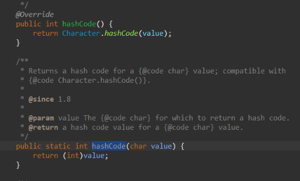
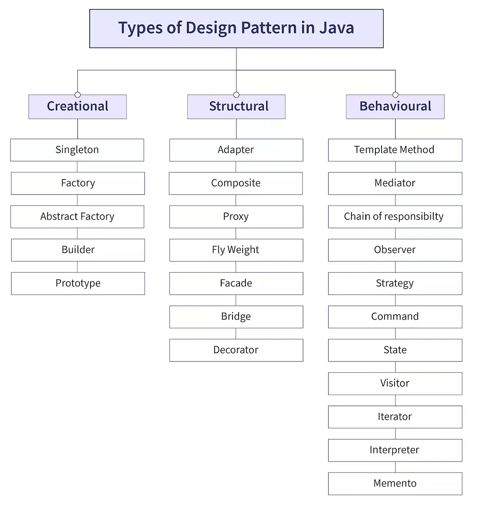

# Java Concepts

## Lambda Expression

- Lets say you have a Functional interface, and you implement this interface using anonymous class.

```
package Java2;

@FunctionalInterface
interface A{
    void show();
}


public class AboutLambdaExpression{
    public static void main(String[] args) {
        
        /**
         * Anonymous class
         */
        A a = new A() {
            public void show(){
                System.out.println("In A show");
            }
        };

        a.show();
    }
}

Output:
In A show
```

- You can reduce the above code to below code.

```
package Java2;

@FunctionalInterface
interface A{
    void show();
}


public class AboutLambdaExpression{
    public static void main(String[] args) {
        A a = () ->System.out.println("In A show");
        a.show();
    }
}

Output:
In A show
```

- This is an example of Lambda expression.
- The Lambda expression is used to provide the implementation of an interface which has functional interface or single abstract method interface. It saves a lot of code. In case of lambda expression, we don't need to define the method again (just like in anonymous class we had define `public void show()`) for providing the implementation. Here, we just write the implementation code.
- Lambda expression provides implementation of functional interface. Behind the scene , `()->` it is instantiating a `new A()`.
- Lets see how lambda expression works when there are parameters in your method.

```
@FunctionalInterface
interface B{
    void doubleTheValue(int i);
}

public class AboutLambdaExpression{
    public static void main(String[] args) {
        B b = (int val)->{
            System.out.println("Number entered : "+val);
            System.out.println("Doubled value is " +val*val);
        };
        b.doubleTheValue(5);
    }
}

Output:
Number entered : 5
Doubled value is 25
```

- Since we are using **one argument**, we can reduce the above implementation to below

```
        B b = val->{
            System.out.println("Number entered : "+val);
            System.out.println("Doubled value is " +val*val);
        };
        b.doubleTheValue(5);

Output:
Number entered : 5
Doubled value is 25
```

- Lambda expression not only makes your code concise and readable but also decrease your file size by eliminating **Anonymous class**. How but? when we compile a class which has anonymous class, check the size.


- When we use lambda expression.




- See the difference in size.
- If your functional interface have a method which returns something then in that case how to implement lambda expression?

```
@FunctionalInterface
interface Addition{
    int add(int n1,int n2);
}

public class AboutLambdaExpression{
    public static void main(String[] args) {
        Addition addvalues = (int i,int j) -> {
            return i+j;
        };
        System.out.println(addvalues.add(6, 5));
    }
}

Output:
11
```

- You can reduce the above code to below

```
        Addition addvalues = (int i,int j) ->  i+j;
        System.out.println(addvalues.add(6, 5));

Output:
11
```

- After `->` you don't need to add `return` keyword, the lambda expression handle that by itself.
- Lambda expression can only be used with functional interface because it only consist of one abstract method. Incase of multiple abstract methods it won't work because the statements of the lambda expression will wont't able to distinguish for which abstract method the implementation is written.

## Generics

- Lets say you have a Box where you will keep numbers, string or float values. How can you implement this? since all these classes have their corresponding wrapper class, we can use **Object** has data type.

```

class Box{
    private Object item;

    public Object getItem() {
        return item;
    }

    public void setItem(Object item) {
        this.item = item;
    }

}
public class AboutGenerics{
    public static void main(String[] args) {
        
        Box b = new Box();
        b.setItem(123);
        int setNumber=(int)b.getItem(); // Type casting is required from Object (Parent class) to int
        System.out.println("Item set is "+setNumber);
    }
}

Output:
Item set is 123
```

- Now lets say you wanna store string value. Again you need to convert your value using `toString()`.

```

class Box{
    private Object item;

    public Object getItem() {
        return item;
    }

    public void setItem(Object item) {
        this.item = item;
    }

}
public class AboutGenerics{
    public static void main(String[] args) {
        
        Box b = new Box();
        b.setItem(123);
        int setNumber=(int)b.getItem(); // Type casting is required from Object (Parent class) to int
        System.out.println("Item set is "+setNumber);

        b.setItem("A String value");
        String setString=b.getItem().toString();
        System.out.println("Item set is "+setString);
    }
}

Output:
Item set is 123
Item set is A String value
```

- Similarly when you set any float values, you need to explicitly cast it. Now this approach has some drawbacks. 
- **It is not type safety, there is manual casting involved and when you compile your program without any editor, just by using CLI it will lead to compile time issues as well**
- So to overcome these drawbacks, we have concepts of **Generics**. Above in the code we made the Box class field as generic by using Object class. But now we will make the Box class itself as Generic.

```

class Box<T>{
    private T item;

    public T getItem() {
        return item;
    }

    public void setItem(T item) {
        this.item = item;
    }
}
public class AboutGenerics{
    public static void main(String[] args) {
        
        /**
         * Now we are specifying that our Box will be Integer (wrapper class of int)
         * This makes the Box fields as Type safe
         */
        Box<Integer> b = new Box<>(); // Or Box<Integer> b = new Box<Integer>();
        b.setItem(123);
        // int setNumber=(int)b.getItem(); // Type casting is required from Object (Parent class) to int (Without Generic)
        int setNumber=(int)b.getItem(); // No type casting is required
        System.out.println("Item set is "+setNumber);

        Box<String> bs = new Box<String>();
        bs.setItem("A String value");
        String setString=bs.getItem();
        System.out.println("Item set is "+setString);
    }
}

Output:
Item set is 123
Item set is A String value
```

- Generic types allow you to define a class, interface, or method with placeholders (type parameters) for the data types they will work with.
- This enables code reusability and type safety, as it allows you to create classes, interfaces, or methods that can operate on various types without needing to cast the value for each type.
- In simpler terms, generics allow you to write code that can work with any object type while ensuring type safety at compile time.
- A generic is defined with type parameters enclosed in angle brackets (`<>`). These parameters act as placeholders for the actual types that will be specified when creating instances of the class. Here when we used `<T>` , so instead of **T** we can use any other alphabets or group of it. Like below

```
class Box<G>{
    private G item;

    public G getItem() {
        return item;
    }

    public void setItem(G item) {
        this.item = item;
    }
}

OR

class Box<GENERIC>{
    private GENERIC item;

    public GENERIC getItem() {
        return item;
    }

    public void setItem(GENERIC item) {
        this.item = item;
    }
}
```

- Lets say you wanted to have a generic class that can have more than one type parameter. Suppose you wanted to define a pair which will have a key and its value.

```
// K - key, V - value
class Pair<K, V> {
    private K key;
    private V value;

    public Pair(K key, V value) {
        this.key = key;
        this.value = value;
    }

    public K getKey() {
        return key;
    }

    public V getValue() {
        return value;
    }
}


public class AboutGenerics{
    public static void main(String[] args) {
        Pair<String, Integer> pair = new Pair<>("Age", 30);
        System.out.println("Key: " + pair.getKey());   // Prints: Key: Age
        System.out.println("Value: " + pair.getValue()); // Prints: Value: 30
    }
}

Output:
Key: Age
Value: 30
```

- Here, the `Pair<K, V>` class has two type parameters `K` and `V`, and you can specify the types when you create an instance of `Pair`.

### Types of Generics

- Generic types allow you to define a class, interface, or method with placeholders (type parameters) for the data types they will work with.

#### Generic Classes

- All the above examples of generics belongs represents example of generic classes.
- Syntax:

```
public class ClassName<T> {
    private T type;

    public void setType(T type) {
        this.type = type;
    }

    public T getType() {
        return type;
    }
}
```

#### Generic Interfaces


- Interfaces can also be generic, allowing different implementations to specify the type parameters.

```
nterface Processor<T> {
    void process(T item);
}

class StringProcessor implements Processor<String> {
    @Override
    public void process(String item) {
        System.out.println("Processing: " + item);
    }
}

class NumberProcessor implements Processor<Integer>{
    @Override
    public void process(Integer item) {
        System.out.println("Processing: " + item);
    }
}

public class AboutGenerics{
    public static void main(String[] args) {
        StringProcessor sp= new StringProcessor();
        sp.process("String value '123'");
        NumberProcessor np= new NumberProcessor();
        np.process(123);
    }
}

Output:
Processing: String value '123'
Processing: 123
```

- Even you can make your interface implementation i.e class as generic parameter type but same parameter type.

```
interface Processor<T> {
    void process(T item);
}

class AnyProcessor<T> implements Processor<T>{
    @Override
    public void process(T item) {
        System.out.println("Processing: " + item);
    }
}
```

- Here we have a generic interface `Processor<T>`, and a generic class `AnyProcessor<T>` that implements the interface. `T` is a type parameter representing a placeholder for any type. The method `process(T item)` will accept an argument of type `T` when implemented by any class.
- Here **whatever the type is specified for the implementation class `AnyProcessor<T>` the same parameter type will go to the interface**. Thats why if we specify any other alphabet or word like `AnyProcessor<K>` this will lead to **error because `AnyProcessor<K>` is trying to introduce a new type parameter K instead of using the one that `Processor<T>` already provides.**
- The class `AnyProcessor<T>` already declares a type parameter `T`, and this parameter needs to match the type parameter `T` from `Processor<T>` that it implements. So, when you write `AnyProcessor<K>`, you are effectively trying to mismatch the generic type declared in the interface and the class.

#### Generic Methods

- Methods that introduce their own type parameters independent of the class's type parameters. Lets say you wanna print values inside the array of any data type. So you created a generic method.

```
class PrintUtility {
    public static <T> void printArray(T[] array) {
        for (T element : array) {
            System.out.println(element);
        }
    }
}

public class AboutGenerics{
    public static void main(String[] args) {


        // Using the generic method
        Integer[] intArray = {1, 2, 3};
        PrintUtility.printArray(intArray);

        String[] strArray = {"A", "B", "C"};
        PrintUtility.printArray(strArray);
    }
}

Output:
1
2
3
A
B
C
```

#### Generic Constructors

- Similarly like methods we can have generic constructor.

```
class PrintUtility {

    <T> PrintUtility(T item){
        System.out.println("Item is "+item);
    }

}

public class AboutGenerics{
    public static void main(String[] args) {
        PrintUtility pu = new PrintUtility("String");
    }
}

Output:
Item is String
```

#### Bounded Type Parameters

- You can restrict the parameter types that can be used as type arguments using bounded type parameters. So suppose lets say you wanna have a Box but only type it will accept is numbers like integer , float , double must be used not string , character or boolean data type. So you are bounding parameter or condition on your generic declaration.

```
// java.lang.Number is abstract class which is implemented by Wrapper classes like Integer , Float , Double.
class NumberBoundedBox<T extends Number>{

    public void process(T item){
        System.out.println("Processing item "+item);
    }
}


public class AboutGenerics{
    public static void main(String[] args) {

        NumberBoundedBox<Double> nbb= new NumberBoundedBox<>();
        nbb.process(5.6);

        /**
         * Implementing String will give compilation error
         * - Bound mismatch: The type String is not a valid substitute for the bounded 
         *   parameter <T extends Number> of the type NumberBoundedBox<T>
         */
        // NumberBoundedBox<String> nbb1= new NumberBoundedBox<>();
    }
}


Output:
Processing item 5.6
```

#### Multiple Bounded Type Parameters

- Lets say you have a interface (`SimpleInterface`) as well. You wanted to implement a Generic which **extends Number and implements SimpleInterface interface**. So such type of restrictions are multiple bounded parameters.

```
interface SimpleInterface{
    void process();
}

class SimpleClass{

}

class MyCustomClass extends SimpleClass implements SimpleInterface{

    public void process(){
        System.out.println("Processing..");
    }
}

class GenericMultipleBounded<T extends SimpleClass & SimpleInterface> {

    public void process(){
        System.out.println("In GenericMultipleBounded");
    }
}

public class AboutGenerics{
    public static void main(String[] args) {
        GenericMultipleBounded<MyCustomClass> gmb=new GenericMultipleBounded<>();
        gmb.process();
    }
}

Output:
In GenericMultipleBounded
```

- Another example

```
// Defining interfaces
interface Movable {
    void move();
}

interface Flyable {
    void fly();
}

// Generic class with multiple interface bounds
public class MultiBoundClass<T extends Movable & Flyable> {
    private T entity;

    public MultiBoundClass(T entity) {
        this.entity = entity;
    }

    public void performActions() {
        entity.move();
        entity.fly();
    }
}

// Class that implements both Movable and Flyable
class Bird implements Movable, Flyable {
    @Override
    public void move() {
        System.out.println("Bird is moving");
    }

    @Override
    public void fly() {
        System.out.println("Bird is flying");
    }
}
```

- You can specify multiple bounds for a generic type parameter using the `&` symbol (AND condition). Only interfaces and one class can be used with multiple bounds.
- **You cannot use the `||` (OR) condition. In Java generics, multiple bounds work with &, meaning the type must satisfy all the bounds.**


#### Upper Bounded Generic

- An upper-bound restricts the type parameter to be of a certain type or a subclass of that type. Consider below example

```
class UpperBoundExample<T extends Number> {
    private T value;

    public UpperBoundExample(T value) {
        this.value = value;
    }

    public void printValue() {
        System.out.println("Value: " + value);
    }
}

public class AboutGenerics{
    public static void main(String[] args) {
        UpperBoundExample<Integer> intObj = new UpperBoundExample<>(10);
        UpperBoundExample<Double> doubleObj = new UpperBoundExample<>(5.5);

        intObj.printValue();  // Output: Value: 10
        doubleObj.printValue();  // Output: Value: 5.5
    }
}

Output:
Value: 10
Value: 5.5
```

- `T extends Number` ensures that `T` can only be of type `Number` or its subclasses like `Integer`, `Double`, `Float`, etc.
In the main method, the UpperBoundExample class is instantiated with `Integer` and `Double` (both subclasses of `Number`)


#### Wildcards(?) in Generics

- Generics (`<T>`) define a type parameter that must be the same throughout the entire class, method, or interface.

```
class Box<T> {
    private T value;

    public void set(T value) {
        this.value = value;
    }

    public T get() {
        return value;
    }
}
```

- Here, when you instantiate the `Box<T>`, `T` could be `Integer`, `String`, or any other type, but the type remains the same for the entire object.
- So, `<T>` is a placeholder for a specific, fixed type. Now consider the below class and guess what will be the output?

```
class BoxWithoutWildCard<T> {
    public void inspect(BoxWithoutWildCard<T> item) {
        System.out.println(item);
    }
}

public class AboutGenerics{
    public static void main(String[] args) {
        BoxWithoutWildCard<Integer> integerBoxWithoutWild = new BoxWithoutWildCard<>();
        BoxWithoutWildCard<Double> doubleBoxWithoutWild = new BoxWithoutWildCard<>();
        /**
         * Compilation ERROR
         * The method inspect(BoxWithoutWildCard<Integer>) in the type BoxWithoutWildCard<Integer> 
         * is not applicable for the arguments (BoxWithoutWildCard<Double>)
         */
        integerBoxWithoutWild.inspect(doubleBoxWithoutWild);
    }
}

Compilation Error
```

- Here, `inspect(BoxWithoutWildCard<T> item)` forces the type to be the same. So, if you instantiate `BoxWithoutWildCard<Integer>`, the method will only accept `BoxWithoutWildCard<Integer>` objects, and it will reject any other type like `BoxWithoutWildCard<Double>`. **This is rigid.**
- Lets use wildcard (`?`) and check it.

```
class BoxWithWildCard<T> {
    public void inspect(BoxWithWildCard<?> item) {
        System.out.println(item);
    }
}

public class AboutGenerics{
    public static void main(String[] args) {
        BoxWithWildCard<Number> integerBoxWithWild = new BoxWithWildCard<>();
        BoxWithWildCard<Double> doubleBoxWithWild = new BoxWithWildCard<>();
        integerBoxWithWild.inspect(doubleBoxWithWild); // Accepts any parameter type.
    }
}

Output:
BoxWithWildCard@548c4f57
```

- Here, using `BoxWithWildCard<?>` tells the method that it doesn’t care if it’s `BoxWithWildCard<Integer>,` `BoxWithWildCard<Double>`, or any other type. **This way the type becomes unknown (?)**. Wildcard `?` provides flexibility because it don’t care about the exact type. It allows you to handle any type. Whereas `<T>` enforces consistency. It means that you are working with a specific type that is fixed throughout the code. You know the exact type at compile time (like `Integer`, `String`, etc.).
- You can also add bounded parameter like below

```
class BoxWithWildCard<T> {
    public void inspect(BoxWithWildCard<? extends Number> item) {
        System.out.println(item);
    }
}
```

- Wildcards (`?`) are typically used in method parameters or return types where you need flexibility. However, they cannot be used as type parameters for classes or interfaces themselves.
- Return type example

```
// Return a list that can contain any type of object
public List<?> getItems() {
    return new ArrayList<String>();
}
```

- Another example of wildcard generic

```
        ArrayList<?> aGenericList = new ArrayList<String>();
        aGenericList=new ArrayList<Integer>();
```

- Here instead we are able to change the collection type. This allows the variable to accept any type of ArrayList, **but you still can't add elements to it because the exact type remains unknown at compile-time.**

```
aGenericList.add("Hello");  // Compilation error!
aGenericList.add(42);       // Compilation error!
aGenericList.add(null);     // Allowed, because null can represent any type
```

- The reason you can't add items like "Hello" or 42 is because `aGenericList` is of type `ArrayList<?>`, and the exact type of `?` is unknown. The compiler cannot be sure whether it’s safe to add a String or an Integer because it doesn't know the real type of `?`.

>[!NOTE]
> - Consider below code
> ```
> class BoxWithWildCard<T> {
>    public void inspect(<?> item) { 
>       System.out.println(item);
>   }
> } // Compilation Error
> ```
> - Wildcard generic can't be used to declare a standalone parameter type like `<?> item`.
> - `T`  is a type parameter that represents a specific type, used for a generic class or method. `?` is a wildcard used with generic types (like `List<?>`, `BoxWithWildCard<?>` etc..)
> - **`Wildcards works with Generic, it does not operate independently`**.

#### Lower Bounded Generic

- A lower-bound restricts the type parameter to be of a certain type or a superclass of that type. Consider below example

```
class LowerBoundExample {

    public static void addNumbers(ArrayList<? super Integer> list) {
        for (int i = 1; i <= 5; i++) {
            list.add(i);
        }
    }
}

public class AboutGenerics{
    public static void main(String[] args) {
        ArrayList<Number> numberList = new ArrayList<>();
        LowerBoundExample.addNumbers(numberList);
        System.out.println(numberList); // Output: [1, 2, 3, 4, 5]
    }
}

Output:
[1, 2, 3, 4, 5]
```

- In this example, the `addNumbers` method accepts a list of any type that is a supertype of `Integer`. This means you can pass in a `ArrayList<Integer>`, a `ArrayList<Number>`, or even a `ArrayList<Object>`.


>[!NOTE]
> - Lower bounds (`<? super Something>`) are only valid with wildcards and are typically used in method parameters, not in class declarations.
> - Java doesn't allow `T super Something` in the type parameter definition in class or method.

## Collections

- 

## Reflection


## Serialization & Deserialization

- Imagine you are playing one of the popular game **BGMI (PUB-G)**. You choose one character based on gender and accordingly you pick up dressing style for your character. Now apart from that your character killing score, its stats, matches played etc.. all this details are store somewhere in your mobile app. So when you open again, those details are still present, it does not get vanished.
- Apart from that, when a player shoots another player, the shooting action by the player gets reflected on the screen of another player. This will only happen via network. So your shooting data is transmitted over the network which is been caught by the same app installed on another player mobile.
- In java, serialization and deserialization works similarly.
- **Serialization:** Java Serialization is a mechanism by which Java objects can be converted into a byte stream. This byte stream data can be saved to a file, sent over a network or stored in memory.
- **Deserialization:** Java Deserialization is a mechanism by which byte stream (0's and 1's) fetched over the network, memory or file can be converted back again to its original java objects.



- In java if a class implements **java.io.Serializable**, then those classes object can serialize and deserialize. Lets see an example.

```


```

- not all classes and object can be serialize, .ser is not always the extension.

https://www.javaguides.net/2018/06/guide-to-serialization-in-java.html
https://www.javatpoint.com/serialization-in-java
https://techvidvan.com/tutorials/serialization-in-java/
