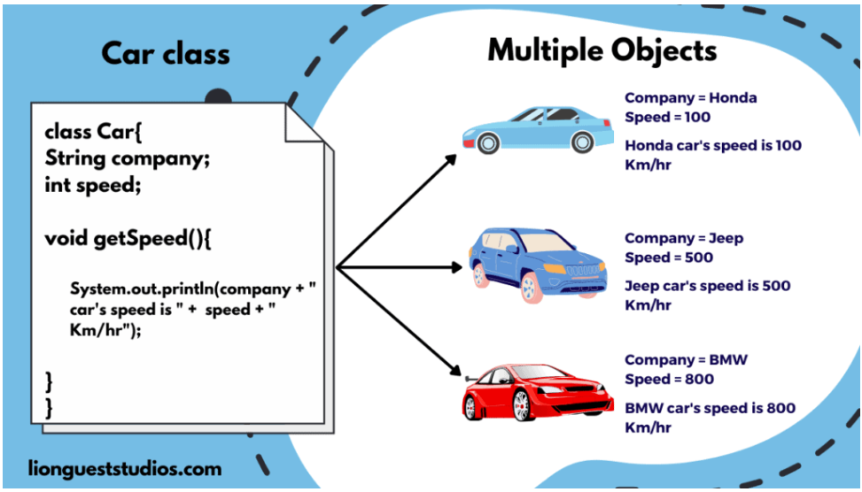
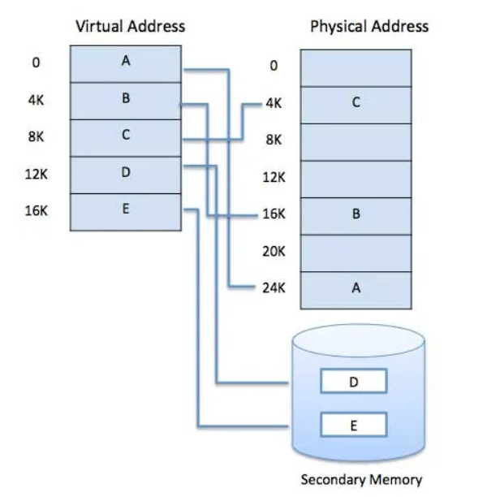
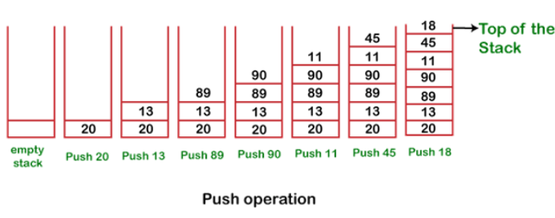
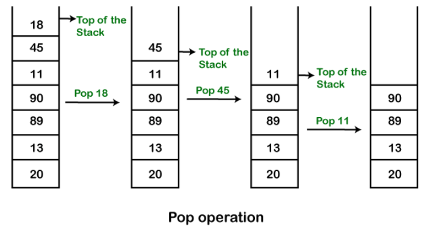
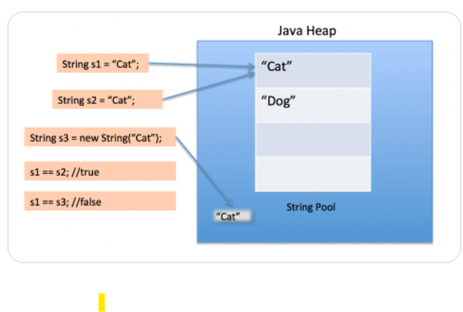
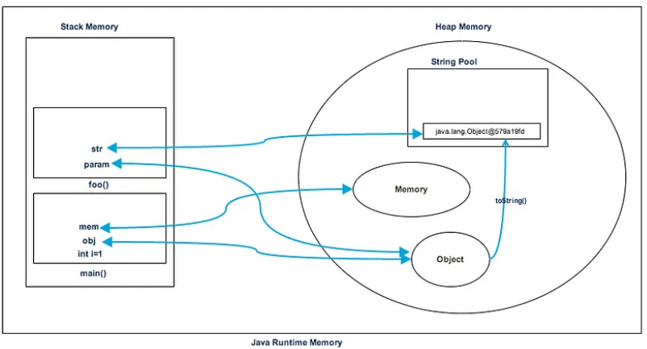

# About OOPS (Object-Oriented Programming System)

- So when a car was introduce, a blueprint of a car was prepared, like what could be requirements to built a car? , this included color, Engine , cyclinder and etc..
- So imagine refering this blue print, there is a Ferrari car, so what could be its properties?  color - red, Engine - 3902 cc, No. of cyclinder - 4 and so on.. what could be his behaviour? so the behaviors - Start engine, Accelerate, Brake, Turn, Park.
- **Class**: Is the blueprint to built a car.
- **Object**: Is Ferrari
- **Data**: Is Ferrari properties
- **Method**: Is Ferrari behaviour.

- So OOP basically organize your code structure by defining a class which acts as a blueprint. It consists a set of properties (data) and methods (behaviors). It provides a general template for what an object can be and do.
- To use the class, you create or instantiate an object. The object is a specific instance of the class, with its own customized properties using the properties of class (like a red Ferrari with a 3902 cc engine) and access to the methods defined in the class.
- When you instantiate an object, you can set its properties to match what you need, and then use its methods to perform actions. This approach helps in organizing code, making it more modular, reusable, and easier to manage.



```
package OOPS;

class Car{

    int speed;
    int numberOfCyclinder;

    public void startEngine(){
        System.out.println("Engine Started..."+", speed - "+speed+", cyclinder - "+numberOfCyclinder);
    }
}

public class SimpleOOP {
    public static void main(String[] args) {
        
        /**
         * Ferrari
         */
        Car ferrari= new Car(); //Reference variable
        ferrari.speed=230;
        ferrari.numberOfCyclinder=4;
        ferrari.startEngine();
    }
}

Output
Engine Started..., speed - 230, cyclinder - 4
```

- Lets create a mustang 


```
package OOPS;

class Car{

    int speed;
    int numberOfCyclinder;

    public void startEngine(){
        System.out.println("Engine Started..."+", speed - "+speed+", cyclinder - "+numberOfCyclinder);
    }
}

public class SimpleOOP {
    public static void main(String[] args) {
        
        /**
         * Ferrari
         */
        Car ferrari= new Car(); //Reference variable
        ferrari.speed=230;
        ferrari.numberOfCyclinder=4;
        ferrari.startEngine();

        /**
         * Mustang
         */
        Car mustang= new Car(); //Reference variable
        mustang.speed=200;
        mustang.numberOfCyclinder=3;
        mustang.startEngine();

    }
}

Output:
Engine Started..., speed - 230, cyclinder - 4
Engine Started..., speed - 200, cyclinder - 3
```

- The JVM creates these objects, so there could possibities like there can be multiple types of cars like TATA, Tesla, etc.. how to identify each? thats where every object has a unique identifier.

```
package OOPS;

class Car{

    int speed;
    int numberOfCyclinder;

    public void startEngine(){
        System.out.println("Engine Started..."+", speed - "+speed+", cyclinder - "+numberOfCyclinder);
    }
}

public class SimpleOOP {
    public static void main(String[] args) {
        
        /**
         * Ferrari
         */
        Car ferrari= new Car(); //Reference variable
        ferrari.speed=230;
        ferrari.numberOfCyclinder=4;
        ferrari.startEngine();

        /**
         * Mustang
         */
        Car mustang= new Car(); //Reference variable
        mustang.speed=200;
        mustang.numberOfCyclinder=3;
        mustang.startEngine();

        /**
         * Unique Identifier
         */
        System.out.println("Unique Identifier for ferrari - "+System.identityHashCode(ferrari));
        System.out.println("Unique Identifier for mustang - "+System.identityHashCode(mustang));
    }
}


Output:
Engine Started..., speed - 230, cyclinder - 4
Engine Started..., speed - 200, cyclinder - 3
Unique Identifier for ferrari - 791452441
Unique Identifier for mustang - 142257191
```

- An object identity is typically implemented via a unique ID. The value of the ID is not visible to the external user. However, it is used internally by the JVM to identify each object uniquely.

- Lets deep dive more into class. So lets say inside a class each variable has a scope.

```
class Car{

    int speed; // Instance variable
    int numberOfCyclinder;

    public void startEngine(){
        System.out.println("Engine Started..."+", speed - "+speed+", cyclinder - "+numberOfCyclinder);
    }

    public void speedLimit(){
        int i=200; // Local variable
    }
}
```

- **Local variable**: 
    - Scope: Declared within a method, constructor, or block of code (e.g., inside loops or conditional statements).
    - Lifetime: Created when the method is called and destroyed when the method exits. They are not accessible outside the method in which they are declared.
    - Initialization: Must be initialized before use; otherwise, the compiler will throw an error.
- **Instance variable**:
    - Scope: Declared inside a class but outside any method, constructor, or block. They are associated with an instance of the class (each object has its own copy).
    - Lifetime: Exist as long as the object (instance of the class) exists. They are created when the object is created using the new keyword and destroyed when the object is destroyed.
    - Initialization: Automatically initialized to default values if not explicitly initialized (e.g., 0 for integers, null for objects).

## Method Overloading

- Lets say we have a class calculator , for which we need add two numbers and returns the value. Uptil now we have used **void** which means that the method won't return anything , now the method will compute and return a integer value.

```
package OOPS;


class Calculator{

    public int add(int n1,int n2){

        /**
         * Method add returns the sum of n1+n2
         */
        return n1+n2;
    }
    
}

public class MethodOverloading {
    
    public static void main(String[] args) {
        
        Calculator twoNums=new Calculator();
        /**
         * Passing 4 and 5 required arguments for method "add"
         */
        System.out.println("Addition of 5 and 4 is "+twoNums.add(4, 5));
    }
}

Output:
Addition of 5 and 4 is 9
```

- Now lets say there is a requirement like , sometimes you may get 3 numbers or you may get 2 numbers, now you could create another method inside the class. The method could be **add1** since there exists already an **add** method. Here we have taken example of 2 - 3 variables addition, tomorrow there could be n number of variables addition , how do that ? java says, hey programmer since you have different number of arguments inside your add method , you can still create a method with same name i.e **add**.

```
package OOPS;


class Calculator{

    public int add(int n1,int n2){

        /**
         * Method add returns the sum of n1+n2
         */
        return n1+n2;
    }

    /**
     * Method Overloading by parameters
     */
    public int add(int n1, int n2, int n3){
        return n1+n2+n3;
    }
    
}

public class MethodOverloading {
    
    public static void main(String[] args) {
        
        Calculator twoNums=new Calculator();
        /**
         * Passing 4 and 5 required arguments for method "add"
         */
        System.out.println("Addition of 5 and 4 is "+twoNums.add(4, 5));
        System.out.println("Addition of 5,4 and 6 is "+twoNums.add(5, 4,6));
    }
}

Output:
Addition of 5 and 4 is 9
Addition of 5,4 and 6 is 15
```

- Lets say we wanna add two floating point numbers.

```
package OOPS;


class Calculator{

    public int add(int n1,int n2){

        /**
         * Method add returns the sum of n1+n2
         */
        return n1+n2;
    }

    /**
     * Method Overloading by parameters
     */
    public int add(int n1, int n2, int n3){
        return n1+n2+n3;
    }

    /**
     * Method Overloading by type
     */
    public double add(double n1,double n2){
        return n1+n2;
    }
}

public class MethodOverloading {
    
    public static void main(String[] args) {
        
        Calculator twoNums=new Calculator();
        /**
         * Passing 4 and 5 required arguments for method "add"
         */
        System.out.println("Addition of 5 and 4 is "+twoNums.add(4, 5));
        System.out.println("Addition of 5,4 and 6 is "+twoNums.add(5, 4,6));
        System.out.println("Addition of 5.5 and 4.5 is "+twoNums.add(4.5, 5.5));

    }
}


Output:
Addition of 5 and 4 is 9
Addition of 5,4 and 6 is 15
Addition of 5.5 and 4.5 is 10.0
```

>[!NOTE]
> - Overloading property is only associated with method and not with variables and classes

## Memory Management or Memory Allocation

#### What is Virtual Memory?

- Virtual memory is a memory management technique where secondary memory can be used as if it were a part of the main memory. Virtual memory is a common technique used in a computer's operating system (OS).
- Virtual memory uses both hardware and software to enable a computer to compensate for physical memory shortages, temporarily transferring data from random access memory (RAM) to disk storage. Mapping chunks of memory to disk files enables a computer to treat secondary memory as though it were main memory.
-  It frees up space in RAM (Physicall memory) by swapping data (that has not been used recently) to disk storage.



- These virtual memory sections are used in a program for storing the variables and instances of structures and classes. However, physical memory isn’t allocated to an object at declaration; only a reference is created. **The memory is allocated to the object only after it is created using the new keyword. This process of allocating dedicated virtual memory spaces to the programs and services is referred to as Memory Allocation**.
- Every time a new variable or object is declared, Java uses an automatic memory management system that allocates or deallocates memory to objects or variables. Java memory management divides into two major parts:
    - JVM
    - Garbage Collector - It is mainly responsible for de-allocating memory from objects and variables when they are no longer required. This freed-up space is then available for new Objects and variables.
- Java applications need a certain amount of RAM on a computer to run. Each time an object or variable is declared, it needs more RAM. For that purpose, the Java Virtual Machine (JVM) divides memory between Java Heap Space and Java Stack Memory.
- The Java Memory Allocation is divided into the following sections :
    - Heap ⇒ contains Objects (may also include reference variables)
    - Stack ⇒ contains methods, local variables, and reference variables.
    - Code ⇒ contains your bytecode (.class (after compilation) files in java)

#### Stack Memory

- In terms of data structure, stack is refered as Last-In-First-Out order. The stack is a linear data structure that is used to store the collection of objects.





- **Stack memory** is the temporary memory where variable values are stored when their methods are invoked. After the method is finished, the memory containing those values is cleared to make room for new methods. Any values in this block are only accessible by the current method and will not exist once it ends. When the method ends, that block will be erased. The next method invoked will use that empty block.

#### Heap Memory or dynamic memory?

>[!IMPORTANT]
> - **The heap in the JVM and the heap in data structures are different concepts, even though they share the same name.**

-  In the JVM, the heap is a portion of memory used for dynamic memory allocation. It's where objects and their associated instance variables are stored. Whenever you create an object using the `new` keyword, the memory for that object is allocated from the heap.
- Managed by the JVM's garbage collector, which automatically frees up memory that is no longer in use (i.e., when there are no more references to an object).
- The heap is shared across all threads in a Java application, meaning that objects in the heap can be accessed by multiple threads.
- The heap doesn't follow any specific data structure or order. It's simply a pool of memory where the JVM allocates and deallocates space for objects as needed.
- Objects in the heap have a lifespan that can extend beyond the method that created them, as long as there are references to them.

##### String Pool

- String Pool in java is a pool of Strings stored in Java Heap Memory. We know that String is a special class in java and we can create String objects using a new operator as well as providing values in double-quotes.



- When we use double quotes to create a String, it first looks for String with the same value in the String pool, if found it just returns the reference else it creates a new String in the pool and then returns the reference. However using new operator, we force String class to create a new String object in heap space.

#### Example of Memory Managment using Code.

- Consider below class

```
package com.journaldev.test;

public class Memory {

	public static void main(String[] args) { $// Line 1$
		int i=1; // Line 2
		Object obj = new Object(); // Line 3
		Memory mem = new Memory(); // Line 4
		mem.foo(obj); // Line 5
	} // Line 9

	private void foo(Object param) { // Line 6
		String str = param.toString(); // Line 7
		System.out.println(str);
	} // Line 8

}
```




- As soon as we run the program, it loads all the Runtime classes into the Heap space. When the `main()` method is found at line 1, Java Runtime creates stack memory to be used by the `main()` method thread, `public static void main(String[] args) { ... }`
- We are creating a primitive local variable at line 2, so it’s created and stored in the stack memory of the `main()` method, **int i=1;**
- Since we are creating an Object in the 3rd line, it’s created in heap memory and stack memory contains the reference for it. A similar process occurs when we create a Memory object in the 4th line.

```
Object obj = new Object(); // Line 3
Memory mem = new Memory(); // Line 4
```

- Now when we call the `foo()` method in the 5th line, a block at the top of the stack is created to be used by the `foo()`. Since Java is pass-by-value, a new reference to Object is created in the `foo()` stack block in the 6th line.

```
mem.foo(obj); // Line 5
private void foo(Object param) { … } // Line 6
```

- A string is created in the 7th line, it goes in the String Pool in the heap space and a reference is created in the `foo()` stack space for it. `String str = param.toString();` // Line 7

- The `foo()` method is terminated in the 8th line, at this time memory block allocated for `foo()` in the stack becomes free.
- In line 9, the `main()` method terminates and the stack memory created for the `main()` method is destroyed. Also, the program ends at this line, hence Java Runtime frees all the memory and ends the execution of the program.

- [References](https://medium.com/@tabassum_k/memory-allocation-in-java-heap-and-stack-8197aec4accb)

#### Have wonder why are we using stack data structure?

- In programming, when a method is called, the current method might call another method, which might in turn call another one, and so on. The most recently called method needs to finish execution before the previous one can continue. This pattern of execution is naturally suited to a stack's LIFO order.
- Consider below example

```
void methodA() {
    methodB();
}

void methodB() {
    methodC();
}

void methodC() {
    // do something
}
```

- `methodA` is called from `main()`.

```
+-------------------------+
|      main() Frame        |
+-------------------------+
|     ...                  |
+-------------------------+
|     methodA() Frame      |
+-------------------------+
```

- `main()` frame: The initial stack frame where execution starts. Pushed `methodA()` onto the stack when `methodA` is called in `main()`.

```
+-------------------------+
|      main() Frame        |
+-------------------------+
|     methodA() Frame      |
+-------------------------+
|     methodB() Frame      |
+-------------------------+
```

- `methodA()` frame remains on the stack. `methodB()` frame is pushed onto the stack when methodB is called from `methodA`.

```
+-------------------------+
|      main() Frame        |
+-------------------------+
|     methodA() Frame      |
+-------------------------+
|     methodB() Frame      |
+-------------------------+
|     methodC() Frame      |
+-------------------------+
```

- `methodB()` frame remains on the stack. `methodC()` frame is pushed onto the stack when methodC is called from `methodB`.
- The stack frame for `methodC` is active, and it contains local variables and the return address.
- Once `methodC` completes, its stack frame is popped off.

```
+-------------------------+
|      main() Frame        |
+-------------------------+
|     methodA() Frame      |
+-------------------------+
|     methodB() Frame      |
+-------------------------+
```

- Returning from `methodB` to `methodA`

```
+-------------------------+
|      main() Frame        |
+-------------------------+
|     methodA() Frame      |
+-------------------------+
```

- Thus this operation involes Last-In-First-Out hence stack data structure is used.

#### What is the size of Class?

- Consider the below Car class

```
package OOPS;

class Car{

    int speed; // Instance variable
    int numberOfCyclinder;

    public void startEngine(){
        System.out.println("Engine Started..."+", speed - "+speed+", cyclinder - "+numberOfCyclinder);
    }

    public void speedLimit(){
        int i=200; // Local variable
    }
}

public class SimpleOOP {
    public static void main(String[] args) {
        
        /**
         * Ferrari
         */
        Car ferrari= new Car(); //Reference variable
        ferrari.speed=230;
        ferrari.numberOfCyclinder=4;
        ferrari.startEngine();

        /**
         * Mustang
         */
        Car mustang= new Car(); //Reference variable 
        mustang.speed=200;
        mustang.numberOfCyclinder=3;
        mustang.startEngine();

        /**
         * Unique Identifier
         */
        System.out.println("Unique Identifier for ferrari - "+System.identityHashCode(ferrari));
        System.out.println("Unique Identifier for mustang - "+System.identityHashCode(mustang));
    }
}
```

- Here we have created a variable with name **ferrari** which is has a data type of **Car** , just like **int a**, but what will be its size? for int we have 4 bytes so we get a space of 32 bits in memory, what will be the space for type **Car**?
- When you call `new ClassName()`, Java allocates memory for the new object on the heap. The size of this memory is determined by the class's properties (fields). Each field in the class contributes to the overall size of the object.
- After allocating memory, the constructor of the class is called to initialize the object's properties. The constructor is a special method that sets up the initial state of the object.
- If you haven't defined a constructor, Java provides a default one that initializes fields to default values (e.g., 0 for integers, null for objects).

```
class Car {

    int speed; // Instance variable
    int numberOfCyclinder;

    // Constructor
    Car(int speed, int numberOfCyclinder) {
        this.speed = speed;
        this.numberOfCyclinder = numberOfCyclinder;
    }
}
```

- After the constructor finishes executing, the new keyword returns a reference to the newly created object. This reference is typically stored in a variable so that you can interact with the object.