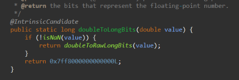
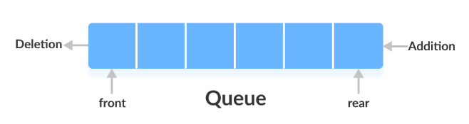

# About OOPS (Object-Oriented Programming System)

- So when a car was introduce, a blueprint of a car was prepared, like what could be requirements to built a car? , this included color, Engine , cylinder and etc..
- So imagine referring this blue print, there is a Ferrari car, so what could be its properties?  color - red, Engine - 3902 cc, No. of cylinder - 4 and so on.. what could be his behaviour? so the behaviors - Start engine, Accelerate, Brake, Turn, Park.
- **Class**: Is the blueprint to built a car.
- **Object**: Is Ferrari
- **Data**: Is Ferrari properties
- **Method**: Is Ferrari behaviour.

- So OOP basically organize your code structure by defining a class which acts as a blueprint. It consists a set of properties (data) and methods (behaviors). It provides a general template for what an object can be and do.
- To use the class, you create or instantiate an object. The object is a specific instance of the class, with its own customized properties using the properties of class (like a red Ferrari with a 3902 cc engine) and access to the methods defined in the class.
- When you instantiate an object, you can set its properties to match what you need, and then use its methods to perform actions. This approach helps in organizing code, making it more modular, reusable, and easier to manage.


```
package OOPS;

class Car{

    int speed;
    int numberOfCyclinder;

    public void startEngine(){
        System.out.println("Engine Started..."+", speed - "+speed+", cyclinder - "+numberOfCyclinder);
    }
}

public class SimpleOOP {
    public static void main(String[] args) {
        
        /**
         * Ferrari
         */
        Car ferrari= new Car(); //Reference variable
        ferrari.speed=230;
        ferrari.numberOfCyclinder=4;
        ferrari.startEngine();
    }
}

Output
Engine Started..., speed - 230, cyclinder - 4
```

- Lets create a mustang 


```
package OOPS;

class Car{

    int speed;
    int numberOfCyclinder;

    public void startEngine(){
        System.out.println("Engine Started..."+", speed - "+speed+", cyclinder - "+numberOfCyclinder);
    }
}

public class SimpleOOP {
    public static void main(String[] args) {
        
        /**
         * Ferrari
         */
        Car ferrari= new Car(); //Reference variable
        ferrari.speed=230;
        ferrari.numberOfCyclinder=4;
        ferrari.startEngine();

        /**
         * Mustang
         */
        Car mustang= new Car(); //Reference variable
        mustang.speed=200;
        mustang.numberOfCyclinder=3;
        mustang.startEngine();

    }
}

Output:
Engine Started..., speed - 230, cyclinder - 4
Engine Started..., speed - 200, cyclinder - 3
```

- The JVM creates these objects, so there could possibilities like there can be multiple types of cars like TATA, Tesla, etc.. how to identify each? thats where every object has a unique identifier.

```
package OOPS;

class Car{

    int speed;
    int numberOfCyclinder;

    public void startEngine(){
        System.out.println("Engine Started..."+", speed - "+speed+", cyclinder - "+numberOfCyclinder);
    }
}

public class SimpleOOP {
    public static void main(String[] args) {
        
        /**
         * Ferrari
         */
        Car ferrari= new Car(); //Reference variable
        ferrari.speed=230;
        ferrari.numberOfCyclinder=4;
        ferrari.startEngine();

        /**
         * Mustang
         */
        Car mustang= new Car(); //Reference variable
        mustang.speed=200;
        mustang.numberOfCyclinder=3;
        mustang.startEngine();

        /**
         * Unique Identifier
         */
        System.out.println("Unique Identifier for ferrari - "+System.identityHashCode(ferrari));
        System.out.println("Unique Identifier for mustang - "+System.identityHashCode(mustang));
    }
}


Output:
Engine Started..., speed - 230, cyclinder - 4
Engine Started..., speed - 200, cyclinder - 3
Unique Identifier for ferrari - 791452441
Unique Identifier for mustang - 142257191
```

- An object identity is typically implemented via a unique ID. The value of the ID is not visible to the external user. However, it is used internally by the JVM to identify each object uniquely.

- Lets deep dive more into class. So lets say inside a class each variable has a scope.

```
class Car{

    int speed; // Instance variable
    int numberOfCyclinder;

    public void startEngine(){
        System.out.println("Engine Started..."+", speed - "+speed+", cyclinder - "+numberOfCyclinder);
    }

    public void speedLimit(){
        int i=200; // Local variable
    }
}
```

- **Local variable**: 
    - Scope: Declared within a method, constructor, or block of code (e.g., inside loops or conditional statements).
    - Lifetime: Created when the method is called and destroyed when the method exits. They are not accessible outside the method in which they are declared.
    - Initialization: Must be initialized before use; otherwise, the compiler will throw an error.
- **Instance variable**:
    - Scope: Declared inside a class but outside any method, constructor, or block. They are associated with an instance of the class (each object has its own copy).
    - Lifetime: Exist as long as the object (instance of the class) exists. They are created when the object is created using the new keyword and destroyed when the object is destroyed.
    - Initialization: Automatically initialized to default values if not explicitly initialized (e.g., 0 for integers, null for objects).

>[!IMPORTANT]
> - Java does not support the concept of "nested" methods (a new method statements within another method). All methods in Java are defined at the class level. Therefore, you cannot declare a method inside another method.
> - Java does support nested classes but does support method calling from another method.


- Consider the below code.

```
class Car{

    int speed; // Instance variable
    int numberOfCyclinder;

    public void startEngine(){
        System.out.println("Engine Started..."+", speed - "+speed+", cyclinder - "+numberOfCyclinder);
    }

    public void speedLimit(){
        int i=200; // Local variable
    }
}

public class SimpleOOP {
    public static void main(String[] args) {
        System.out.println("Not creating reference variable of any class");
    }
}


Output:
Not creating reference variable of any class
```


- If you see we can see **SimpleOOP.class** file but not **Car.class** file, this is because we have not created any object of it. Such class whose object is not created are not compiled by java.

>[!IMPORTANT]
> - If class object is not created those class are not compile by java


## Basics of Memory Management

### What is Garbage Collector?

- As a programmer you will write lots of classes and your code might ended up creating many objects in the memory, so someone should be responsible for it to clean and vacant those memory occupied by objects, thats where comes your garbage collector.
- Garbage collection is an automatic process that the programming language runtime (like the Java Virtual Machine for Java) uses to identify and delete objects that are no longer needed by the program.
- Objects are instances of data that a program creates to perform its tasks. As the program runs, it may create many objects. Some objects are only needed for a short time. Once they are no longer used, they become "**garbage**". The garbage collector's job is to find these unused objects and free up the memory they occupy, making that memory available for new objects.

### Stack  

- In terms of data structure, stack is refered as Last-In-First-Out order. The stack is a linear data structure that is used to store the collection of objects.


- **Stack memory** is the temporary memory where variable values are stored when their methods are invoked. After the method is finished, the memory containing those values is cleared to make room for new methods. Any values in this block are only accessible by the current method and will not exist once it ends. When the method ends, that block will be erased. The next method invoked will use that empty block.
- **In a program if there are multiple methods, then every methods will have its own stack**

### Heap

>[!IMPORTANT]
> - **The heap in the JVM and the heap in data structures are different concepts, even though they share the same name.**

-  In the JVM, the heap is a portion of memory used for dynamic memory allocation. It's where objects and their associated instance variables are stored. Whenever you create an object using the `new` keyword, the memory for that object is allocated from the heap.
- Consider the below example

```

class Calculator{

    int instanceVar; // Instance variable
    public int add(int n1,int n2){
        return n1+n2; // Local Variables
    }
}

public class BasicMemoryManagement{
    public static void main(String[] args) {

        int localVar=10;
        Calculator calc=new Calculator();
        int sum=calc.add(5, 4);
        System.out.println(sum);
        calc.instanceVar=6;
        System.out.println(calc.instanceVar);

        Calculator calc1=new Calculator();
        calc1.instanceVar=16;
        System.out.println(calc1.instanceVar);
    }
}

Output:
9
6
16
```

- Now when the program will get executed , main method will have a stack. Inside the stack all its local variables will be there


- `new Calculator()` creates an object inside the heap memory , the address of that object gets stored in the main method stack for **calc** variable. So **calc is a reference variable and not object because it as reference of Calculator Object not the object itself**


- What happens to the instance variable? `int instanceVar` , now instance variable are not part of stack, it gets created within the heap under the same object address.


- Now **calc** calls **add** method , so now a new stack for add method will be created, this add method will have all its local variables.



- What will the values of **n1** and **n2**? it will be 5 and 4 because that it was it been pass when **calc** calls **add** method. After executing add it will return 7 as its output to the variable sum.


- Now we have set the **instanceVar=6** .


- We creating a new object reference for **calc1** and setting **instanceVar=7** for that newly object reference.


- If you notice, the heap size has been also increase thus heap memory is also called as **dynamic memory**.

## What is String?

- In Java, a String is a sequence of characters and is one of the most commonly used classes in the Java programming language. The String class is part of the `java.lang` package and is used to create and manipulate strings (text).

```
public class AboutStrings {
    public static void main(String[] args) {
        
        /**
         * Initializing a value in String
         */
        String n=new String();
        n="Harsh";
        System.out.println(n);

        String n1=new String("Pandya");
        System.out.println(n+" "+n1);
    
        String n2="Mr.";
        System.out.println(n2+" "+n+" "+n1);
    }
}


Output:
Harsh
Harsh Pandya
Mr. Harsh Pandya
```

- Lets say you have two string variables which stores the same value. What do you thing the reference variable values are same or different?

```
        /**
         * Points the same object in the string pool of heap memory
         */
        String s1="welcome";
        String s2="welcome";
        String s3="Welcome"; // New String literal

        System.out.println(s1.hashCode());
        System.out.println(s2.hashCode());
        System.out.println(s3.hashCode());


Output:
1233099618
1233099618
-1397214398
```

- It is the same. Java uses a special memory area called the **String Pool** to store string literals or value. When a string literal is created, the JVM checks the string pool to see if an identical string already exists. If it does, the new reference points to the existing string. If not, a new string is created in the pool.


>[!IMPORTANT]
> - If we explicitly specify **`String str=new String("Explicitly telling java to create a new Object but still it won't create")`** then still it will search in String pool. If literal is not available then only its creates a new object of string.

### Common String methods

```
        String str = "Hello";
        int len = str.length(); // 5
        char c = str.charAt(1); // 'e'
        String sub = str.substring(1, 4); // "ell"
        boolean isEqual = str.equals("Hello"); // true
        String greeting = str.concat(" World"); // "Hello World"

        String strWithSpaces = "   Hello World   ";
        String trimmed = strWithSpaces.trim();
        System.out.println("Trimmed: '" + trimmed + "'"); // Output: Trimmed: 'Hello World'

        String replaced = str.replace('o', 'a');
        System.out.println("Replaced 'o' with 'a': " + replaced); // Output: Replaced 'o' with 'a': Hella Warld

        boolean contains = str.contains("World");
        System.out.println("Contains 'World': " + contains); // Output: Contains 'World': true

        boolean isEqualIgnoreCase = str.equalsIgnoreCase("hello world");
        System.out.println("Equals Ignore Case 'hello world': " + isEqualIgnoreCase); // Output: Equals Ignore Case 'hello world': true

        boolean startsWith = str.startsWith("Hello");
        System.out.println("Starts with 'Hello': " + startsWith); // Output: Starts with 'Hello': true

        boolean endsWith = str.endsWith("World");
        System.out.println("Ends with 'World': " + endsWith); // Output: Ends with 'World': true
        
        String[] parts = str.split(" ");
        System.out.println("Split by space: ");
        for (String part : parts) {
            System.out.println(part);
        }
        // Output:
        // Split by space:
        // Hello
        // World
```

### Immutable and Mutable String (String, String Buffer, String Builder)

#### Immutable (String)

- Strings in Java are **immutable**, which means once a String object is created, it cannot be changed. Any modification to a string creates a new String object.

```
String str = "Hello";
str = str + " World";  // A new string "Hello World" is created, "str" now references the new string
```
- **Usage**: Best used when the string content is not expected to change frequently, such as for string literals or small concatenations.
- **Performance**: Since strings are immutable, every modification (like concatenation) creates a new object, which can be inefficient, especially in loops or when handling large amounts of data.

#### Mutable (String Buffer, String Builder)

##### String Buffer

- **Mutable**: Unlike String, **StringBuffer** allows modification of the string content without creating new objects.
- **Thread-Safe**: **StringBuffer** is synchronized, meaning it is safe to use in a multi-threaded environment where multiple threads might access and modify the string simultaneously.
- **Usage**: Use **StringBuffer** when you need to perform many modifications on a string in a multi-threaded environment.
- **Performance**: It is slower than **StringBuilder** due to the overhead of synchronization but faster than String for string modifications.

```
StringBuffer sb = new StringBuffer("Hello");
sb.append(" World");
System.out.println(sb.toString()); // Output: Hello World
```

##### String Builder

- **Mutable**: Like **StringBuffer**, **StringBuilder** allows modification of the string content.
- **Not Thread-Safe**: **StringBuilder** is not synchronized, meaning it is not safe to use in a multi-threaded environment without additional synchronization.
- **Usage**: Use **StringBuilder** when you need to perform many modifications on a string in a single-threaded environment. It's more efficient than StringBuffer because it doesn’t have the synchronization overhead.
- **Performance**: It is the fastest option for string modification when thread safety is not a concern.

```
StringBuilder sb = new StringBuilder("Hello");
sb.append(" World");
System.out.println(sb.toString()); // Output: Hello World
```

>[!NOTE]
> - In-built methods which are applicable for string are also applicable for String builder as well as String buffer.

## Packages

- As a developer when you work on a large project , you will be writing many codes. You might ended up multiple files. Now it is a good practice to organize you files into a different folder , thus providing a readability.
- Packages help organize your code into a structured, hierarchical way, making it easier to manage large projects.
- Packages are simple sort of folder where all your require files are structure. Packages help avoid naming conflicts for two same while which does the same function but present in different packages or folder.
- When you are working on large project you might require a different package for a database conections. Lets create that


- Lets create a project java file which will call this **DatabaseDetails.java** 


- If you see it is suggesting to import **DatabaseDetails** of **DatabaseFolder** package, since the class is in different folder
- Post importing

```
import DatabaseFolder.DatabaseDetails;

public class AboutPackages {

    public static void main(String[] args) {
        DatabaseDetails db=new DatabaseDetails();
        db.connectDb();
    }
}


Output:
Connecting Database..
```

- Now the packages we have declare are **User-defined or Custom** package. `import DatabaseFolder.DatabaseDetails` states that import the class `DatabaseDetails` of the folder `DatabaseFolder`.
- **Every class methods you use belongs to a package**. There are some in-built packages which comes with JDK.
- Have wonder `System.out.println` belongs to ?

<video controls src="20240824-0748-27.8244916.mp4" title="Title"></video>

- The `System` is a class which belongs to `java.lang` folder, it means some where in the jdk there is a java folder , inside that there is a sub-folder called lang which has a class called **System**.
- `java.lang.*` is imported by default into a Java program. When we say `java.lang.*` it means all the files present under lang folder are imported by default.
- Similarly if we have multiple sub-folders which consist of several file, we can import them using **`*`** wildcard.

### Why Are Packages Required?
- **Organize Code**: Packages help organize your code into a structured, hierarchical way, making it easier to manage large projects.
- **Avoid Naming Conflicts**: By grouping related classes together, packages help avoid naming conflicts. Classes in different packages can have the same name.
- **Access Control**: Packages provide access protection; classes within a package can access each other's members without restriction, while restricting access from classes in different packages.
- **Reusability**: Packages allow for easy reuse of classes and interfaces. Developers can create libraries of code and distribute them in the form of packages.


## Static

- Lets create a student class and reference variable of it.

```
class Student{
    String schoolname;
    int id;
    int marks;

    public void details(){
        System.out.println("School name: "+schoolname+" ,ID: "+id+" ,marks: "+marks);
    }
}

public class AboutStatic {
    public static void main(String[] args) {
        
        Student s1=new Student();
        s1.schoolname="IIT";
        s1.id=1;
        s1.marks=95;

        Student s2=new Student();
        s2.schoolname="BITS";
        s2.id=2;
        s2.marks=95;

        s1.details();
        s2.details();
    }
}

Output:
School name: IIT ,ID: 1 ,marks: 95
School name: BITS ,ID: 2 ,marks: 95
```

- Lets add **static** keyword against the `schoolname` variable and then lets try to execute the same code.

```
class Student{
    static String schoolname;
    int id;
    int marks;

    public void details(){
        System.out.println("School name: "+schoolname+" ,ID: "+id+" ,marks: "+marks);
    }
}

public class AboutStatic {
    public static void main(String[] args) {
        
        Student s1=new Student();
        s1.schoolname="IIT";
        s1.id=1;
        s1.marks=95;

        Student s2=new Student();
        s2.schoolname="BITS";
        s2.id=2;
        s2.marks=96;

        s1.details();
        s2.details();
    }
}


Output:
School name: BITS ,ID: 1 ,marks: 95
School name: BITS ,ID: 2 ,marks: 96
```

- Why so we got `BITS` for reference variable s1?, this is because a static variable is a variable that belongs to the class rather than to any specific instance (object) of the class. It is shared among all instances of the class. Only one copy of a static variable is created and shared across all objects of that class.
- Static variables are useful when you want to share a common piece of data across all instances of a class. For example, a variable that counts the number of instances of a class created.
- The static variables are stored in **MetaSpace** 


- What if the **static** key word is applied on method? , lets apply static keyword on the `details()` method.

```
class Student{
    static String schoolname;
    int id;
    int marks;

    public static void details(){
        System.out.println("School name: "+schoolname+" ,ID: "+id+" ,marks: "+marks);
    }
}

public class AboutStatic {
    public static void main(String[] args) {
        
        Student s1=new Student();
        s1.schoolname="IIT";
        s1.id=1;
        s1.marks=95;

        Student s2=new Student();
        s2.schoolname="BITS";
        s2.id=2;
        s2.marks=96;

        s1.details();
        s2.details();

        
    }
}
```


- We got an error **`Cannot make a static reference to the non-static field id, Cannot make a static reference to the non-static field marks`**. So basically there is 1 value for the variable **schoolname** since it is a static variable, but there are 2 values of **id** and **marks** (`s1.id=1,s2.id=2` and `s1.marks=95,s2.marks=96`) , these are non-static variables. Now since there are two different values, how will the static method will get to know which one to be called and printed?
- Thats why we can use **a static variable inside a static method but we cannot use a non-static variable inside a static method**.
- Lets do a work around, now if a static method is confused which values to be printed out what if we pass the reference variable's object to clear out the confusion?

```
class Student{
    static String schoolname;
    int id;
    int marks;

    public static void details(Student obj){
        System.out.println("School name: "+schoolname+" ,ID: "+obj.id+" ,marks: "+obj.marks);
    }
}

public class AboutStatic {
    public static void main(String[] args) {
        
        Student s1=new Student();
        s1.schoolname="IIT";
        s1.id=1;
        s1.marks=95;

        Student s2=new Student();
        s2.schoolname="BITS";
        s2.id=2;
        s2.marks=95;

        s1.details(s2);
        s2.details(s1);

        
    }
}

Output:
School name: BITS ,ID: 2 ,marks: 95
School name: BITS ,ID: 1 ,marks: 95
```

- So **by passing out the reference variable's object we can use non-static variable can be access in static method**


### Why Should We Call Static Members via Class Name and Not Object Name?

- We see below warnings which says 


- **Clarity and Intent**: Calling static methods or accessing static variables via the class name makes it clear that these members belong to the class, not to any specific instance. It clarifies that the method or variable is not dependent on the state of any particular object.
- **Avoid Confusion**: If you call a static method using an object, it can give the false impression that the method is tied to the instance's state, which it is not. Using the class name prevents this confusion.
- **Language Specification**: Java language specification allows calling static methods through objects, but it's not recommended as it goes against the intended use of static members.

```
class Student{
    static String schoolname;
    int id;
    int marks;

    public static void details(Student obj){
        System.out.println("School name: "+schoolname+" ,ID: "+obj.id+" ,marks: "+obj.marks);
    }
}

public class AboutStatic {
    public static void main(String[] args) {
        
        Student s1=new Student();
        Student.schoolname="IIT";
        s1.id=1;
        s1.marks=95;

        Student s2=new Student();
        Student.schoolname="BITS";
        s2.id=2;
        s2.marks=95;

        Student.details(s2);
        Student.details(s1);

        
    }
}
```

### Static on Class

- In Java, top-level classes (classes that are not nested within another class) cannot be declared as static. **This is because the static keyword implies that something belongs to the class itself rather than an instance of the class**. A top-level class itself is not contained within another class, so the concept of **static** does not apply in this context.

```
static class TopLevelClass { // Compilation error -> Illegal modifier for the class Student; only public, abstract & final are permitted
    // ...
}
```

- Though static cannot be applied on top-level class but it can be applied on nested classes.

```
class OuterClass {
    int i; // Instance variable
    static int j; // Static variable or Class variables 
    // Static nested class or Static member inner classes
    static class StaticNestedClass {
        void display() {
            System.out.println("Inside static nested class "+OuterClass.j);
        }
    }
}

public class Main {
    public static void main(String[] args) {
        // No need to create an instance of the outer class
        OuterClass.StaticNestedClass nestedObject = new OuterClass.StaticNestedClass();
        nestedObject.display(); // Output: Inside static nested class
    }
}

Output:
Inside static nested class 0
```

>[!IMPORTANT]
> - Static variables (also known as class variables) are associated with the class itself rather than with any particular instance of the class. They are shared across all instances of a class. Static variables are declared at the class level, outside any method. Declaring them inside a method would contradict their class-level nature, as methods are instance-specific (non-static methods) or just a part of the class logic (static methods).
> - Static variables cannot be defined under any method.


#### Key Points about Static Nested Classes:
- A static nested class can access the static members (variables and methods) of the outer class.
- A static nested class cannot directly access the non-static members of the outer class. It must use an instance of the outer class to do so.
- Instances of a static nested class are not tied to instances of the outer class.

### Static Block

- Lets say you wanted to execute some statements or initialize values into variable whenever the class is loaded.

```
public class AboutStatic {

    static{
        System.out.println("Statement got executed when the class is loaded");
    }

    public static void main(String[] args) {
        
        System.out.println("Inside Main Method");
                
    }
}

Output:
Statement got executed when the class is loaded
Inside Main Method
```

- A static block (also known as a static initializer block) is a block of code that is executed when the class is loaded into memory by the Java ClassLoader. 
- It is used to initialize static variables and perform any setup required for the class before any instances are created or any static methods are called

#### Characteristics of Static Blocks
- **Executed Once**: The static block is executed only once, when the class is loaded for the first time.
- **Executed Before main**: Static blocks are executed before the main method, as well as before any static methods or constructors are called.
- **Multiple Static Blocks**: You can have more than one static block in a class, and they will be executed in the order in which they appear in the class.

```
public class AboutStatic {

    static{
        System.out.println("Statement got executed when the class is loaded");
    }
    static{
        System.out.println("Second Statement");
    }
    public static void main(String[] args) {

        System.out.println("Inside Main Method");
                
    }
}

Output:
Statement got executed when the class is loaded
Second Statement
Inside Main Method
```

#### When to Use Static Blocks?
- **Initialization of Static Fields**: When static fields need to be initialized with values that require some logic or computation.
- **Resource Management**: To initialize static resources, such as loading a file or setting up a database connection that will be shared across instances. When working with large project, you need to first initialize database connections , logging etc..
- **Exception Handling**: To initialize a static variable in a static block that can handle exceptions (since static variable initialization in a field declaration cannot have a try-catch block).


- Can we have static block in other class except for main? lets try , so we have a class **A**, and we have create a static block within class A which has a method `display()`.

```
class A{
    static int num;
    static{
        num=7;
        System.out.println("Assigned Number 7");
    }

    public void display(){
        System.out.println("In A");
    }
}

public class AboutStatic {

    static{
        System.out.println("Statement got executed when the class is loaded");
    }
    static{
        System.out.println("Second Statement");
    }
    public static void main(String[] args) {

        System.out.println("Inside Main Method");

        A a=new A();
        a.display();
                
    }
}

Output:
Statement got executed when the class is loaded
Second Statement
Inside Main Method
Assigned Number 7
In A
```

- So before `display` method is called, the static block statements got executed. What if we don't create object of class A? will it still execute?

```
class A{
    static int num;
    static{
        num=7;
        System.out.println("Assigned Number 7");
    }

    public void display(){
        System.out.println("In A");
    }
}

public class AboutStatic {

    static{
        System.out.println("Statement got executed when the class is loaded");
    }
    static{
        System.out.println("Second Statement");
    }
    public static void main(String[] args) {

                
    }
}

Output:
Statement got executed when the class is loaded
Second Statement
```

- So when the object of class A was created then only the static block of A got executed. This state that static block only gets executed when object creation takes place.
- What if you don't wanna create any object and just wanted to load class A.

```
public class AboutStatic {

    static{
        System.out.println("Statement got executed when the class is loaded");
    }
    static{
        System.out.println("Second Statement");
    }
    public static void main(String[] args) throws ClassNotFoundException {

        Class.forName("A");
                
    }
}

Output:
Statement got executed when the class is loaded
Second Statement
Assigned Number 7
```

- So `Class.forName("A")` accepts a string parameter of your class name and just loads the class inside your JVM.
- This concludes that **static block statements gets executed when the class is loaded or a object of that class is instantiated**.


## Array Objects

- In Java, an Array of Objects refers to an array that can store references to objects of a particular class. Just like arrays of primitive types (e.g., int[], char[]), an array of objects can store multiple elements, but each element is a reference to an instance of a class.

```

class Student{
    int rollnumber;
    String name;
    long marks;
}


public class ArrayObjects{
    public static void main(String[] args) {
        
        /**
         * Creating references objects for student class
         */
        Student s1=new Student();
        s1.rollnumber=1;
        s1.marks=90;
        s1.name="Harsh";

        Student s2=new Student();
        s2.rollnumber=2;
        s2.marks=97;
        s2.name="Meet";

        Student[] ArrayObject = {s1,s2};
        for(Student s:ArrayObject){
            System.out.println(s.name+" , "+s.marks+" , "+s.rollnumber);
        }
    }
}

Output:
Harsh , 90 , 1
Meet , 97 , 2
```

- An array of objects in Java allows you to store multiple objects of a particular class in a single data structure.
- You must create each object individually before storing it in the array.
- Once stored, you can access and manipulate these objects using their index in the array.

## Reference Keyword 'this'

- Lets say you have a class called Assigned

```
class AssignedNumbers{

    int num1;

    public void assigned(int n1){
        num1=n1;
    }
    public void display(){
        System.out.println("Number value is - "+num1);
    }
}

public class AboutThis {
    
    public static void main(String[] args) {
        
        AssignedNumbers a = new AssignedNumbers();
        a.assigned(5);
        a.display();
    }
}

Output:
Number value is - 5
```

- Lets say you wanna change the argument of `assigned` method to **num1**

```
class AssignedNumbers{

    int num1;

    public void assigned(int num1){
        num1=num1;
    }
    public void display(){
        System.out.println("Number value is - "+num1);
    }
}

public class AboutThis {
    
    public static void main(String[] args) {
        
        AssignedNumbers a = new AssignedNumbers();
        a.assigned(5);
        a.display();
    }
}

Output:
Number value is - 0
```

- Why did we got 0? this is because you are assigning the value of local variable (num1) to itself. (5=5). You are not assigning your local variable value to your instance variable.
- How to then assign to our instance variable? one way is to pass the object itself as an argument.

```
class AssignedNumbers{

    int num1;

    public void assigned(int num1,AssignedNumbers a){
        a.num1=num1;
    }
    public void display(){
        System.out.println("Number value is - "+num1);
    }
}

public class AboutThis {
    
    public static void main(String[] args) {
        
        AssignedNumbers a = new AssignedNumbers();
        a.assigned(5,a);
        a.display();
    }
}

Output:
Number value is - 5
```

- Now java says, why to again pass the object to method, imagine there are several variable instance and different methods, will you pass the object repeatably ? to avoid this we have a **this** keyword.

```
class AssignedNumbers{

    int num1;

    public void assigned(int num1){
        this.num1=num1;
    }
    public void display(){
        System.out.println("Number value is - "+num1);
    }
}

public class AboutThis {
    
    public static void main(String[] args) {
        
        AssignedNumbers a = new AssignedNumbers();
        a.assigned(5);
        a.display();
    }
}

Output:
Number value is - 5
```

## Method Overloading

- Lets say we have a class calculator , for which we need add two numbers and returns the value. Uptil now we have used **void** which means that the method won't return anything , now the method will compute and return a integer value.

```
package OOPS;


class Calculator{

    public int add(int n1,int n2){

        /**
         * Method add returns the sum of n1+n2
         */
        return n1+n2;
    }
    
}

public class MethodOverloading {
    
    public static void main(String[] args) {
        
        Calculator twoNums=new Calculator();
        /**
         * Passing 4 and 5 required arguments for method "add"
         */
        System.out.println("Addition of 5 and 4 is "+twoNums.add(4, 5));
    }
}

Output:
Addition of 5 and 4 is 9
```

- Now lets say there is a requirement like , sometimes you may get 3 numbers or you may get 2 numbers, now you could create another method inside the class. The method could be **add1** since there exists already an **add** method. Here we have taken example of 2 - 3 variables addition, tomorrow there could be n number of variables addition , how do that ? java says, hey programmer since you have different number of arguments inside your add method , you can still create a method with same name i.e **add**.

```
package OOPS;


class Calculator{

    public int add(int n1,int n2){

        /**
         * Method add returns the sum of n1+n2
         */
        return n1+n2;
    }

    /**
     * Method Overloading by parameters
     */
    public int add(int n1, int n2, int n3){
        return n1+n2+n3;
    }
    
}

public class MethodOverloading {
    
    public static void main(String[] args) {
        
        Calculator twoNums=new Calculator();
        /**
         * Passing 4 and 5 required arguments for method "add"
         */
        System.out.println("Addition of 5 and 4 is "+twoNums.add(4, 5));
        System.out.println("Addition of 5,4 and 6 is "+twoNums.add(5, 4,6));
    }
}

Output:
Addition of 5 and 4 is 9
Addition of 5,4 and 6 is 15
```

- Lets say we wanna add two floating point numbers.

```
package OOPS;


class Calculator{

    public int add(int n1,int n2){

        /**
         * Method add returns the sum of n1+n2
         */
        return n1+n2;
    }

    /**
     * Method Overloading by parameters
     */
    public int add(int n1, int n2, int n3){
        return n1+n2+n3;
    }

    /**
     * Method Overloading by type
     */
    public double add(double n1,double n2){
        return n1+n2;
    }
}

public class MethodOverloading {
    
    public static void main(String[] args) {
        
        Calculator twoNums=new Calculator();
        /**
         * Passing 4 and 5 required arguments for method "add"
         */
        System.out.println("Addition of 5 and 4 is "+twoNums.add(4, 5));
        System.out.println("Addition of 5,4 and 6 is "+twoNums.add(5, 4,6));
        System.out.println("Addition of 5.5 and 4.5 is "+twoNums.add(4.5, 5.5));

    }
}


Output:
Addition of 5 and 4 is 9
Addition of 5,4 and 6 is 15
Addition of 5.5 and 4.5 is 10.0
```

- Method overloading is a technique, multiple methods in the same class can have the same name but different parameters.

>[!NOTE]
> - Overloading property is only associated with method and not with variables and classes

## Constructors

- A constructor in Java is a special method that is automatically called when an object of a class is created. The purpose of a constructor is to initialize the newly created object. A constructor has the same name as the class and does not have a return type (not even void).
- Lets create a constructor

```

class ABC{

    ABC(){ //constructor
        System.out.println("Constructor of ABC");
    }
}

public class AboutConstructor {
    public static void main(String[] args) {

        /**
         * Object initialized and reference is assigned to abc 
         */
        ABC abc=new ABC();
    }
}

Output:
Constructor of ABC
```

- Thus, you can see when the object is initialized method `ABC` or the constructor method `ABC` is called by default. We have not specified `abc.ABC()`.
- Lets create some instance variable and assigned them some default values via constructor.

```

class ABC{

    int age;
    String name;

    ABC(){ //constructor
        System.out.println("Constructor of ABC");
        age=10;
        name="Harsh";
        System.out.println("Name: "+name+", age:"+age);
    }
}

public class AboutConstructor {
    public static void main(String[] args) {

        /**
         * Object initialized and reference is assigned to abc 
         */
        ABC abc=new ABC();
    }
}


Output:
Constructor of ABC
Name: Harsh, age:10
```

- This way constructors are used to initialize the state of an object when it is created. This means setting up the initial values for the object’s instance variables.
- Now lets add assign value using reference variable. 

```

class ABC{

    int age;
    String name;

    ABC(){ //constructor or No-Args Constructor
        System.out.println("Constructor of ABC");
        age=10;
        name="Harsh";
        System.out.println("Name: "+name+", age:"+age);
    }

    ABC(int age,String name){ // Constructor overloading
        this.age=age;
        this.name=name;
        System.out.println("Constructor with arguments of ABC");
        System.out.println("Name: "+name+", age:"+age);
    }
}

public class AboutConstructor {
    public static void main(String[] args) {

        /**
         * Object initialized and reference is assigned to abc 
         */
        ABC abc=new ABC();
        ABC abc1=new ABC(24,"Meet");
    }
}


Output:
Constructor of ABC
Name: Harsh, age:10
Constructor with arguments of ABC
Name: Meet, age:24
```

- You can see by assigning values via object we perform method overloading or to be more specific constructor overloading. You can have multiple constructors in a class with different parameters (this is called constructor overloading).
- So there are two types of constructor

###  Default Constructor (No-Argument Constructor)
- **Definition**: A default constructor is a no-argument constructor that is automatically provided by the Java compiler if no other constructors are explicitly defined in the class.
- **Purpose**: The default constructor initializes the object with default values. For example, numeric fields are initialized to 0, boolean fields to false, and object references to null.
- **When It's Used**: If you do not define any constructor in your class, the compiler automatically provides a default constructor.

### Parameterized Constructor
- **Definition**: A parameterized constructor is one that accepts parameters (arguments). It allows you to pass values to the constructor when creating an object, providing a way to initialize the object with different values.
- **Purpose**: To initialize objects with specific values provided at the time of creation, allowing for greater flexibility and customization.
- **When It's Used**: When you want to initialize an object with specific values or require certain parameters to be set upon object creation.


## Anonymous Object

- What if instead of creating reference variable of an object , can we create only just a object? lets see

```
class Unknown{
    public void show(){
        System.out.println("In display...");
    }
}
public class AboutAnonymous {
    public static void main(String[] args) {
        int i=0;
        new Unknown().show(); // Anonymous Object
    }
}

Output:
In display...
```

- An anonymous object in Java is an object that is created without being assigned a reference variable. This means that the object is instantiated and immediately used without storing it in a variable.
- Since it has no reference, it cannot be reused after its creation and initial use.


- Anonymous objects are used when an object is needed only once. For example, when you want to call a method of an object and do not need to reuse the object afterwards.
- Because anonymous objects are not stored in variables, they can help save memory. After the object is used, it becomes eligible for garbage collection immediately, reducing the memory footprint.

## Inheritance

- Lets say you have a Basic calculator class which only performs addition and subtraction. 

```
class BasicCalculator{
    public int add(int n1, int n2){
        return n1+n2;
    }

    public int subtract(int n1,int n2){
        return n1-n2;
    }
}


public class AboutInheritence{
    public static void main(String[] args) {
        BasicCalculator bc=new BasicCalculator();
        System.out.println("Addition of 5 and 4 - "+bc.add(5,4));
        System.out.println("Subtraction of 5 and 4 - "+bc.subtract(5,4));
    }
}

Output:
Addition of 5 and 4 - 9
Subtraction of 5 and 4 - 1
```

- Now lets say you have built logic for multiplication as well division, now you have written those logic inside the class. 

```
class BasicCalculator{
    public int add(int n1, int n2){
        return n1+n2;
    }

    public int subtract(int n1,int n2){
        return n1-n2;
    }
}


class CompleteCalculator{
    public int multiply(int n1,int n2){
        return n1*n2;
    }

    public double division(int n1,int n2){
        return (double)n1/n2;
    }
}

public class AboutInheritence{
    public static void main(String[] args) {
        BasicCalculator bc=new BasicCalculator();
        System.out.println("Addition of 5 and 4 - "+bc.add(5,4));
        System.out.println("Subtraction of 5 and 4 - "+bc.subtract(5,4));

        CompleteCalculator cc=new CompleteCalculator();
        System.out.println("Multiply 5 and 4 - "+cc.multiply(5,4));
        System.out.println("Divide 5 and 4 - "+cc.division(5,4));


    }
}


Output:
Addition of 5 and 4 - 9
Subtraction of 5 and 4 - 1
Multiply 5 and 4 - 20
Divide 5 and 4 - 1.25
```

- Your class `CompleteCalculator` is still incomplete because it does not have addition and subtraction. Now to make this complete you could implement the logic of addition and subtraction by yourself or you could have inherit the properties of `BasicCalculator`.

```
class BasicCalculator{ // Parent Class or Super Class
    public int add(int n1, int n2){
        return n1+n2;
    }

    public int subtract(int n1,int n2){
        return n1-n2;
    }
}


class CompleteCalculator extends BasicCalculator{ // Child Class or Sub Class 
    public int multiply(int n1,int n2){
        return n1*n2;
    }

    public double division(int n1,int n2){
        return (double)n1/n2;
    }
}

public class AboutInheritence{
    public static void main(String[] args) {
        BasicCalculator bc=new BasicCalculator();
        System.out.println("Addition of 5 and 4 - "+bc.add(5,4));
        System.out.println("Subtraction of 5 and 4 - "+bc.subtract(5,4));

        CompleteCalculator cc=new CompleteCalculator();
        System.out.println("Multiply 5 and 4 - "+cc.multiply(5,4));
        System.out.println("Divide 5 and 4 - "+cc.division(5,4));
        System.out.println("Addition of 5 and 4 - "+cc.add(5,4));
        System.out.println("Subtraction of 5 and 4 - "+cc.subtract(5,4));

    }
}

Output:
Addition of 5 and 4 - 9
Subtraction of 5 and 4 - 1
Multiply 5 and 4 - 20
Divide 5 and 4 - 1.25
Addition of 5 and 4 - 9
Subtraction of 5 and 4 - 1
```

- Inheritance is a fundamental concept of Object-Oriented Programming (OOP) in Java, where one class (the child class or subclass) inherits the properties (fields) and behaviors (methods) of another class (the parent class or superclass).
- Inheritance allows a new class to reuse the fields and methods of an existing class, thereby promoting code reusability and creating a hierarchical relationship between classes. The child class reference variable can access the parent class instance variable as well as methods.
- Lets say there is a `reset` method which makes the calculation starting point to 0 ( BasicCalculator ) and to 1 ( CompleteCalculator ). Both method names are same in the parent class as well the child class. If we call the `reset` method using child class reference variable what gonna happen?

```
class BasicCalculator{ // Parent Class or Super Class
    public int add(int n1, int n2){
        return n1+n2;
    }

    public int subtract(int n1,int n2){
        return n1-n2;
    }

    public void reset(){
        System.out.println("Reset value to 0");
    }
}


class CompleteCalculator extends BasicCalculator{ // Child Class or Sub Class 
    public int multiply(int n1,int n2){
        return n1*n2;
    }

    public double division(int n1,int n2){
        return (double)n1/n2;
    }

    public void reset(){ // Preference given to child class
        System.out.println("Reset value to 1");
    }
}

public class AboutInheritence{
    public static void main(String[] args) {
        BasicCalculator bc=new BasicCalculator();
        System.out.println("Addition of 5 and 4 - "+bc.add(5,4));
        System.out.println("Subtraction of 5 and 4 - "+bc.subtract(5,4));
        bc.reset();

        CompleteCalculator cc=new CompleteCalculator();
        System.out.println("Multiply 5 and 4 - "+cc.multiply(5,4));
        System.out.println("Divide 5 and 4 - "+cc.division(5,4));
        System.out.println("Addition of 5 and 4 - "+cc.add(5,4));
        System.out.println("Subtraction of 5 and 4 - "+cc.subtract(5,4));
        cc.reset();

    }
}


Output:
Addition of 5 and 4 - 9
Subtraction of 5 and 4 - 1
Reset value to 0
Multiply 5 and 4 - 20
Divide 5 and 4 - 1.25
Addition of 5 and 4 - 9
Subtraction of 5 and 4 - 1
Reset value to 1
```

- Thus we can see when we use reference variable of child class, the method `reset` inside the **CompleteCalculator** got executed. Whenever a method is called using child class reference variable , the method is searched first into child class if not found then java reaches out parent class. This how we can also peform **Method Overriding**

### Method Overriding

- Method overloading is a technique, multiple methods in the same class can have the same name but different parameters.
- Method overriding is a technique, a subclass provides its own implementation of a method that is already defined in its superclasses. This happens when the method signature (name and parameters) are the same in both the superclass and the child class.

```
// Superclass
class Animal {
    // Method to be overridden
    public void makeSound() {
        System.out.println("Animal makes a sound");
    }
}

// Subclass
class Dog extends Animal {
    // Overriding the makeSound method
    @Override
    public void makeSound() {
        System.out.println("Dog barks");
    }
}

public class Main {
    public static void main(String[] args) {
        Animal myAnimal = new Animal(); // Animal reference and object
        Animal myDog = new Dog(); // Animal reference but Dog object

        myAnimal.makeSound(); // Output: Animal makes a sound
        myDog.makeSound();    // Output: Dog barks
    }
}

```

- When a method in a subclass has the same name, return type, and parameters as a method in its superclass, the subclass's method is said to **override** the superclass's method.

### Why is Inheritance Required?
- **Code Reusability**: Inheritance allows classes to reuse the code of existing classes, reducing redundancy and making the code more maintainable. A subclass inherits all the non-private fields and methods of its superclass.
- **Method Overriding**: Subclasses can override methods of the superclass to provide specific implementations for certain behaviors.

### Types of Inheritance

#### 1. Single Level Inheritance

- In single inheritance, a class inherits from only one superclass. This is the simplest form of inheritance.
- The above code examples are called as single level inheritance.

#### 2. Multilevel Inheritance

- In multilevel inheritance, a class is derived from a class, which is also derived from another class, forming a hierarchy.

```
class Animal {  // Superclass
    void eat() {
        System.out.println("Animal eats");
    }
}

class Dog extends Animal {  // Subclass of Animal
    void bark() {
        System.out.println("Dog barks");
    }
}

class Puppy extends Dog {  // Subclass of Dog
    void weep() {
        System.out.println("Puppy weeps");
    }

    public static void main(String[] args) {
        Puppy myPuppy = new Puppy();
        myPuppy.eat();   // Inherited from Animal
        myPuppy.bark();  // Inherited from Dog
        myPuppy.weep();  // Defined in Puppy
    }
}
```

#### 3. Hierarchical Inheritance

- In hierarchical inheritance, multiple classes inherit from a single superclass. This means a single class is a parent class for multiple subclasses.

```
class Vehicle {  // Superclass
    void run() {
        System.out.println("Vehicle is running");
    }
}

class Car extends Vehicle {  // Subclass 1
    void display() {
        System.out.println("Car is a Vehicle");
    }
}

class Bike extends Vehicle {  // Subclass 2
    void display() {
        System.out.println("Bike is a Vehicle");
    }

    public static void main(String[] args) {
        Car myCar = new Car();
        myCar.run();
        myCar.display();

        Bike myBike = new Bike();
        myBike.run();
        myBike.display();
    }
}
```

#### 4. Multiple Inheritance

- A subclass which extends multiple parent class is called as multiple inheritance , lets try to implement it.

```
class BasicCalculator{ // Parent Class or Super Class
    public int add(int n1, int n2){
        return n1+n2;
    }

    public int subtract(int n1,int n2){
        return n1-n2;
    }

    public void reset(){
        System.out.println("Reset value to 0");
    }
}


class CompleteCalculator extends BasicCalculator{ // Child Class or Sub Class 
    public int multiply(int n1,int n2){
        return n1*n2;
    }

    public double division(int n1,int n2){
        return (double)n1/n2;
    }

    public void reset(){ // Preference given to child class
        System.out.println("Reset value to 1");
    }
}

class AdvanceCalculator extends CompleteCalculator, BasicCalculator{

    public void scifyCalculations(){
        System.out.println("Scientific calculations");
    }
}

public class AboutInheritence{
    public static void main(String[] args) {
        BasicCalculator bc=new BasicCalculator();
        System.out.println("Addition of 5 and 4 - "+bc.add(5,4));
        System.out.println("Subtraction of 5 and 4 - "+bc.subtract(5,4));
        bc.reset();

        CompleteCalculator cc=new CompleteCalculator();
        System.out.println("Multiply 5 and 4 - "+cc.multiply(5,4));
        System.out.println("Divide 5 and 4 - "+cc.division(5,4));
        System.out.println("Addition of 5 and 4 - "+cc.add(5,4));
        System.out.println("Subtraction of 5 and 4 - "+cc.subtract(5,4));
        cc.reset();


        AdvanceCalculator ac= new AdvanceCalculator();
        ac.reset();
    }
}

```

- Here the **AdvanceCalculator** extends **CompleteCalculator** and **BasicCalculator**. We have create a reference variable of **AdvanceCalculator** and now we are calling `reset` method. Now the `reset` method is present in **CompleteCalculator** (`System.out.println("Reset value to 1");`) and **BasicCalculator** (`System.out.println("Reset value to 0");`), which one will be called? now this creates an ambiguity.
- Thats why **multiple inheritance is not supported by java**.

>[!NOTE]
> - Multiple inheritance is not directly support in java but indirectly supported via interfaces which we will see about it later.

## Super & This method

- Lets say you have 2 class X & Y. Each class has their own constructor.

```
class X{
    X(){
        System.out.println("Default Constructor of X");
    }
}

class Y{
    Y(){
        System.out.println("Default Constructor of Y");
    }
}

public class AboutSuperAndThis {
    public static void main(String[] args) {
        Y y= new Y();
        
    }
}

Output:
Default Constructor of Y
```

- Here we can see when we created the object of **Y** class, by default the construct method got called. Lets say Y extends X.
- Lets run the program again and see the output.

```
class X{
    X(){
        System.out.println("Default Constructor of X");
    }
}

class Y extends X{
    Y(){
        System.out.println("Default Constructor of Y");
    }
}

public class AboutSuperAndThis {
    public static void main(String[] args) {
        Y y= new Y();

    }
}


Output:
Default Constructor of X
Default Constructor of Y
```

- Thats strange right? , **when you create an object of a subclass, the constructor of the superclass is automatically called**.
- Behind the scene the method `super()` does these thing.

```
class X{
    X(){
        System.out.println("Default Constructor of X");
    }
}

class Y extends X{
    Y(){
        super();
        System.out.println("Default Constructor of Y");
    }
}
```

- Lets say you have a method `show()` inside your class X. You wanted to call this `show()` method in your `display()` method of your class Y.

```
class X{
    X(){
        System.out.println("Default Constructor of X");
    }

    public void show(){
        System.out.println("Class X show method");
    }
}

class Y extends X{
    Y(){
        super();
        System.out.println("Default Constructor of Y");
    }

    public void display(){
        super.show();
        System.out.println("Class Y Display method");
    }
}

public class AboutSuperAndThis {
    public static void main(String[] args) {
        Y y= new Y();
        y.display();
    }
}


Output:
Default Constructor of X
Default Constructor of Y
Class X show method
Class Y Display method
```

- As the same `super` suggest , it calls methods or variable of **Super**class.

### Why Super is required?

- **Why super() calls parent constructor?** : In a subclass, the super keyword is used to explicitly call the constructor of its parent class. This is important to ensure that the parent class is properly initialized before the subclass adds its specific initialization. Inheritance means that a subclass inherits properties and behavior from a parent class. To ensure the integrity of this hierarchy, the parent class constructor needs to run to set up its part of the object within subclass constructor.
- **Accessing Parent Class Methods and Fields**: If the child class has overridden a method of the parent class, you can use super to call the parent class's version of the method.
- **Avoiding Shadowing**: If a subclass defines a field with the same name as a field in the superclass, super can be used to access the superclass's field.

- Lets create parameterize constructor in X and Y class.

```
class X{
    X(){
        System.out.println("Default Constructor of X");
    }

    X(int i){
        System.out.println("Parameterized constructor of X");
    }
    public void show(){
        System.out.println("Class X show method");
    }

    public void test(){
        System.out.println("Class X test method");
    }
}

class Y extends X{
    Y(){
        super();
        System.out.println("Default Constructor of Y");
    }
    Y(int i){
        System.out.println("Parameterized constructor of Y");
    }
    public void display(){
        super.show();
        System.out.println("Class Y Display method");
    }

    public void test(){ // Method Overriding
        System.out.println("Class Y test method");
    }
}

public class AboutSuperAndThis {
    public static void main(String[] args) {

        /**
         * Calling Y parameterized constructor
         */
        Y y1=new Y(5);

    }
}


Output:
Default Constructor of X
Parameterized constructor of Y
```

- If you see ,X default constructor is called and Y parameterize constructor is called. How will you call X parameterizec constructor? simple just pass int value into the `super` .

```
class X{
    X(){
        System.out.println("Default Constructor of X");
    }

    X(int i){
        System.out.println("Parameterized constructor of X");
    }
    public void show(){
        System.out.println("Class X show method");
    }

    public void test(){
        System.out.println("Class X test method");
    }
}

class Y extends X{
    Y(){
        super();
        System.out.println("Default Constructor of Y");
    }
    Y(int i){
        super(i); // Calling parameterized constructor of X
        System.out.println("Parameterized constructor of Y");
    }
    public void display(){
        super.show();
        System.out.println("Class Y Display method");
    }

    public void test(){ // Method Overriding
        System.out.println("Class Y test method");
    }
}

public class AboutSuperAndThis {
    public static void main(String[] args) {

        /**
         * Calling Y parameterized constructor
         */
        Y y1=new Y(5);

    }
}


Output:
Parameterized constructor of X
Parameterized constructor of Y
```

- Now lets use `this()` keyword

```
class X{
    X(){
        System.out.println("Default Constructor of X");
    }

    X(int i){
        System.out.println("Parameterized constructor of X");
    }
    public void show(){
        System.out.println("Class X show method");
    }

    public void test(){
        System.out.println("Class X test method");
    }
}

class Y extends X{
    Y(){
        super();
        System.out.println("Default Constructor of Y");
    }
    Y(int i){
        super(i);
        System.out.println("Parameterized constructor of Y");
    }
    Y(double d){
        this();
        System.out.println("Parameterized double constructor of Y");
    }
    public void display(){
        super.show();
        System.out.println("Class Y Display method");
    }

    public void test(){ // Method Overriding
        System.out.println("Class Y test method");
    }
}

public class AboutSuperAndThis {
    public static void main(String[] args) {

        /**
         * Calling Y parameterized double constructor
         */
        Y y2=new Y(5.1);

    }
}

Output:
Default Constructor of Y
Parameterized double constructor of Y
```

- `this()` keywords call the constructor of subclass . `this` keyword in Java are used in object-oriented programming to refer to the current object (this object) respectively.
- The `this` keyword refers to the current object — the instance of the class in which it appears.
- It is often used to distinguish between instance variables and parameters or to call other constructors within the same class.
- Just like `super`, `this` access current class methods and variables it must be always the **first statement** within the constructor.
- What happens if we write both? , if both `super()` and `this()` need to be the first statement, then only one of them can actually be the first statement in any given constructor. It is not possible to have two first statements, so you cannot use both super() and this() simultaneously in a single constructor.



## Polymorphism

- "**poly**" meaning "**many**" and "**morph**" meaning "**forms**" or **behavior**. Thus, polymorphism means "many forms" or "many behavior".
- Lets take a real life example, a human we have different behaviors for a situation, like in office we would have a boss/employee behavior , when human are with friends we have a different behavior, when human is at home , it would have a different behavior.
- So here human is polymorphic. Similarly in java when we create a object or a reference variable, it will have certain behavior. When we say certain behavior it means **methods**.
- Lets take an example of method overloading

```
class Calculator{

    public int add(int n1,int n2){

        /**
         * Method add returns the sum of n1+n2
         */
        return n1+n2;
    }

    /**
     * Method Overloading by parameters
     */
    public int add(int n1, int n2, int n3){
        return n1+n2+n3;
    }

    /**
     * Method Overloading by type
     */
    public double add(double n1,double n2){
        return n1+n2;
    }
}

public class MethodOverloading {
    
    public static void main(String[] args) {
        
        Calculator twoNums=new Calculator();
        /**
         * Passing 4 and 5 required arguments for method "add"
         */
        System.out.println("Addition of 5 and 4 is "+twoNums.add(4, 5));
        System.out.println("Addition of 5,4 and 6 is "+twoNums.add(5, 4,6));
        System.out.println("Addition of 5.5 and 4.5 is "+twoNums.add(4.5, 5.5));

    }
}

Addition of 5 and 4 is 9
Addition of 5,4 and 6 is 15
Addition of 5.5 and 4.5 is 10.0
```

- Here when you call the `add` method, depending the number of arguments or parameters the appropriate add method will be called during compilation. So there are 3 different behaviors of `add` but we know which method will be executed based on parameter. This is called **Compile-time Polymorphism or Static Polymorphism**.
- Lets take an example of method overriding.

```
// Superclass
class Animal {
    public void makeSound() {
        System.out.println("Animal makes a sound");
    }
}

// Subclass 1
class Dog extends Animal {
    @Override
    public void makeSound() {
        System.out.println("Dog barks");
    }
}

// Subclass 2
class Cat extends Animal {
    @Override
    public void makeSound() {
        System.out.println("Cat meows");
    }
}

public class Main {
    public static void main(String[] args) {
        Animal myAnimal; // Reference of type Animal
        
        myAnimal = new Dog(); // Animal reference but Dog object
        myAnimal.makeSound(); // Output: Dog barks
        
        myAnimal = new Cat(); // Animal reference but Cat object
        myAnimal.makeSound(); // Output: Cat meows
    }
}
```

- Here the method `makeSound` behavior is not decided during the compilation, because it depends on the object being called which is created during run-time. Example during compilation the `new Dog()` object is not created but when the program is execute, basically in the run-time the object is created. Thus depending on the object creation during run-time we will be able to determine the behavior of `makeSound()` method. This is called **Runtime Polymorphism or Dynamic Polymorphism Or Dynamic Method Dispatch**.
- In the above example of `Animal` class, we did not created reference variable of `Dog` class or `Cat` class we created reference variable of its parent which is `Animal` class. **You use a reference variable of a superclass to refer to an object of a subclass**. For example, you can have a reference of type `Animal` pointing to an object of type `Dog`.
- This behavior is called **Dynamic Method Dispatch**.
- Lets see the backend memory management for it.


- Also one thing if you observer , we are using the same reference variable of Animal for Cat's object creation. This makes your code **loosely coupled** , so lets say in future you will create another subclass name `Cow` which extends Animal, using the same reference variable you can create object of Cow thus making your code **loosely coupled**.
- If you have created individual reference variable for each class it would ended up taking space in heap and also made your application **tightly coupled** means for a new subclass like `Cow` you need to create a new reference variable.

### There are two types of polymorphism in Java:

1. **Compile-time Polymorphism (Static Polymorphism)**: This is also known as method overloading. It occurs when multiple methods have the same name with different parameters (different type or number of parameters) within the same class.

2. **Runtime Polymorphism (Dynamic Polymorphism)**: This is achieved through method overriding, where a subclass provides a specific implementation of a method that is already defined in its superclass. The method to be executed is determined at runtime based on the object's type.

### Why Polymorphism required?

1. **Flexibility and Extensibility**: Polymorphism allows a single reference variable to represent different underlying data types. This means you can write more flexible and reusable code. For instance, a method that takes an **Animal** object can accept any subclass of **Animal** like Dog, Cat, etc., allowing you to extend and modify your code with new subclasses without changing the existing code.
2. **Code Reusability**: It promotes code reusability. You can write code that works on the superclass level, and this code can handle all subclasses equally, allowing you to reuse the same code for different types of objects.
3. **Ease of Maintenance**: Polymorphism makes it easier to manage and maintain code. Since you can use a single reference variable for multiple methods, any change you make in a superclass method will automatically apply to all subclasses, reducing redundancy and improving maintainability.

## Access Modifiers

- Uptil now we have majorly used **public** , so what is this **public**?, it is an type of access assigned to methods or variables.
- Access modifiers in Java are keywords used to set the access level (visibility) of classes, methods, and other members. They control who can access or modify the code, thereby providing a mechanism for encapsulation and security in Java applications.

### Types of Access Modifiers in Java
- Java provides four types of access modifiers:

1. **public**
    - **Access Level**: Visible everywhere. The member (class, method, or variable) can be accessed from any other class in any package.
    - **Usage**: Used when you want to make a method, variable, or class universally accessible.

2. **private**
    - **Access Level**: Visible only within the same class. Private instance variable can be access via methods using reference variable but private methods cannot be access via reference variable.
    - **Usage**: Used to restrict access to sensitive data or methods that should not be exposed outside the class.

    
    
    
    
    - Private methods can be accessible within the same method of that class.

```
package AccessModifiers;

class A{
    private int i;

    public int fetchPrivateVariable(){
        display();
        return i;
    }

    private void display(){
        System.out.println("Private method");
    }
}

public class AboutAccessModifier {
    public static void main(String[] args) {
        
        A a=new A();
        System.out.println("Accessing private variable via method - "+a.fetchPrivateVariable());
    }
}


Output:
Private method
Accessing private variable via method - 0
```

3. **protected**
    - **Access Level**: Visible within the same package and subclasses (even if they are in different packages).
    - **Usage**: Typically used in inheritance scenarios where you want to give access to subclasses but keep it hidden from other classes.

```
Protected method in AboutAccessModified.java

package AccessModifiers;

class A{
    private int i;

    public int fetchPrivateVariable(){
        display();
        return i;
    }

    private void display(){
        System.out.println("Private method");
    }
}

class B{
    protected int i;

    protected void show(){
        System.out.println("Protected method show of B");
    }
}

public class AboutAccessModifier {
    public static void main(String[] args) {
        
        A a=new A();
        System.out.println("Accessing private variable via method - "+a.fetchPrivateVariable());

        B b= new B();
        b.show();

    }
}


Output:
Private method
Accessing private variable via method - 0
Protected method show of B

Inherit class B into class C thus accessing protected methods or variables

package AccessModifiers;

class C extends B{

}

public class OtherClass {
    public static void main(String[] args) {
        C c = new C();
        c.show();
    }
}


Output:
Protected method show of B
```

4. **Default (package-private)**
    - **Access Level**: Visible only within the same package. This is the default access level when no access modifier is specified.
    - **Usage**: Used when you want to restrict access to within the same package but do not want to make it protected.

```
class MyClass { // Accessible only within the same package
    int packagePrivateNumber; // Default access modifier

    void displayPackagePrivate() {
        System.out.println("Default (package-private) method");
    }
}
```

#### Summary of types of access modifiers


- Can we apply these access modifiers on a **class**, uptil now we have applied this on class members like instance variable and methods. What if we apply access modifiers on a **class**.
- **private** and **protected** cannot be applied on a class. Java will give your compilation error `Illegal modifier for the class B; only public, abstract & final are permittedJava`.
- **public** and **default** can be applied, if **public** is not specified implicitly then **default** becomes the access modifier of a class.

## Encapsulation

- Let say if a stranger ask you about personal information like name, age etc.. would you share the details? now it depends like if you are taking a loan the bank manager requires your details to sanction you loan. Your personal information must not be share until and unless it is require. Your personal information data is encapsulated in your brain.
- Similarly in terms of java, no one must have access of your instance variable of class directly, if any other program needs your instance variable they must ask or they must get the access via method.


- Encapsulation is the mechanism of wrapping the data (variables) and code (methods) that operates on the data into a single unit called a class. It restricts direct access to some of an object's components and prevents the accidental modification of data.
- In simple terms, encapsulation is about bundling the data (attributes) and methods (functions) that operate on the data into a single unit (class), and controlling the access to the data to ensure the integrity of the object's state.
- So then how to restrict your data access? , by making your instance variable **private**.

```

class Information{
     int age;
     String name;


}

public class Encapsulation{
    public static void main(String[] args) {
        Information inf=new Information();
        inf.age=20;
        inf.name="Harsh";
        System.out.println(inf.name+" ,"+inf.age);
    }
}

Output:
Harsh ,20
```

- The above method is not encapsulated, we are still able to access instance variables. Lets make those **private**.


- The moment we make those variable private, the variables are not visible or accessible to other class directly. Lets create a method to make it access indirectly.

```

class Information{
     private int age;
     private String name;

     public void assignAge(int age){
        this.age=age;
     }
     public void assignName(String name){
        this.name=name;
     }
     public int fetchAge(){
        return age;
     }
     public String fetchName(){
        return name;
     }

}

public class Encapsulation{
    public static void main(String[] args) {
        Information inf=new Information();
        inf.assignAge(20);
        inf.assignName("Harsh");
        System.out.println(inf.fetchName()+", "+inf.fetchAge());
    }
}

Output:
Harsh, 20
```

- Encapsulation in Java refers to integrating data (variables) and code (methods) into a single unit. In encapsulation, a class's variables are hidden from other classes and can only be accessed by the methods of the class in which they are found.
- In simpler terms, encapsulation is the practice of hiding internal data and functionality of an object from external entities.
- In Java, encapsulation is implemented through access modifiers such as private, public, and protected, which control the visibility of class members such as fields and methods. Private members can only be accessed within the same class, whereas public members can be accessed anywhere in the program. Protected members can be accessed within the same class, subclasses, and classes in the same package.

### Getters and Setters

- In developers community, to fetch a variable your must should be `getVarname` and while assign a value to a variable your method should be `setVarname`.

```
public class Person {
  private String name; // private = restricted access

  // Getter
  public String getName() {
    return name;
  }

  // Setter
  public void setName(String newName) {
    this.name = newName;
  }
}
```

>[!NOTE]
> - This is a standard practice followed in industries however you can have your own name for getters and setters.


## Naming Convention

- Whenever you write a code , a good practice while creating class , methods or variable are:
    - Class & Interface : Should be in Camel Case e.g class MyCalculator
    - Variables & Methods : Should be in lower case e.g marks(), show()
    - Constants : Should be in upper case e.g PIE, EPSON

- This provides readability. 


